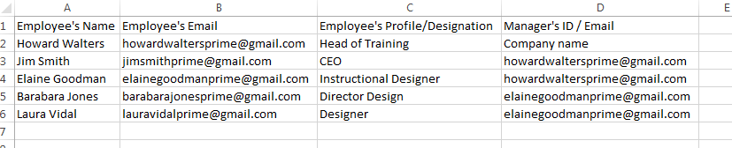

# 사용자 일괄 추가

예. 아래 단계에 따라 한 번에 여러 사용자를 추가할 수 있습니다.

1. 다음을 수행합니다. **[!UICONTROL 사용자]** 관리자 역할로 로그인하여 왼쪽 창에서 **[!UICONTROL 추가]** > **[!UICONTROL csv 업로드]**. 팝업 대화 상자가 나타납니다.

1. .CSV 파일을 사용하여 여러 사용자를 추가할 수 있습니다. 다음을 수행합니다. **[!UICONTROL 가져오기]** 그런 다음 컴퓨터에서 .csv 파일을 선택/엽니다.

1. 파일을 가져온 후 .csv 파일을 처음 업로드할 때 .csv 파일의 내용을 애플리케이션 레이블에 매핑합니다.

   이후의 모든 업로드에는 레이블에 대한 이전 설정이 고려됩니다. 다음을 수행합니다. **[!UICONTROL 저장]** 데이터 매핑을 완료한 후 **[!UICONTROL 추가]** 매핑한 .csv 파일을 업로드합니다.

1. 다음을 수행합니다. **[!UICONTROL 저장]** 데이터 매핑을 완료한 후 **[!UICONTROL 추가]** 매핑한 .csv 파일을 업로드합니다.

## 필수 필드가 있는 CSV 업로드 {#csvuploadwithmandatoryfields}

CSV에 사용자의 프로필과 관리자의 이메일 ID를 추가할 필요는 없습니다. 사용자 이름 및 사용자의 이메일 ID 만 필수 필드입니다.

이 경우 기본적으로 회사의 관리자는 사용자의 관리자로 간주됩니다. 기본적으로 직원은 사용자의 프로필로 간주됩니다.

**샘플 CSV**

필수 필드가 있는 Learning Manager 샘플 CSV를 아래에서 사용할 수 있습니다.
[Sample-CSV-name-email.zip](assets/sample-csv-name-email.zip)

## 모든 필드가 포함된 CSV 업로드 {#csvuploadwithallthefields}

직원에 대한 관리자의 이메일 ID를 포함하기 전에 관리자가 CSV에 직원으로 먼저 추가되었는지 확인하십시오. 예를 들어 아래 스냅샷에서 직원 이름인 Howard Walters를 참조하십시오.

*업로드를 위한 CSV 템플릿*

또한 조직 책임자는 자신을 사원으로 추가하고 관리자의 이메일 ID를 루트로 언급할 수 있습니다.

**샘플 CSV**

모든 필드가 있는 Learning Manager 샘플 CSV를 아래에서 사용할 수 있습니다.
[learning-manager-sample-csv.zip](assets/learning-manager-sample-csv.zip).

자세한 내용은  [CSV 업로드 사용](/help/migrated/administrators/feature-summary/add-users-user-groups.md) 자세한 내용은 기능 도움말 콘텐츠를 참조하십시오.
