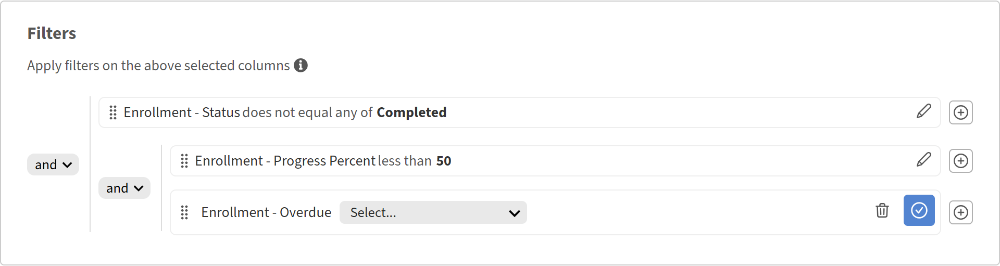

# 보고서에 필터 추가 및 결합

## 개요

필터를 사용하면 보고서를 필요한 레코드로 범위를 지정할 수 있습니다. 단일 필터를 적용하고, 여러 필터를 AND 또는 OR 논리와 결합하고, 복잡한 조건에 대해 중첩된 그룹을 만들 수 있습니다.

## 필터 추가

필터를 사용하여 보고서를 모두 보는 대신 특정 데이터 하위 집합으로 제한합니다.

예를 들어 지난 365일 동안 강의에 등록한 학습자 수를 이해할 수 있습니다. 이 경우 등록 날짜에 날짜 필터를 적용하여 최근 활동만 포함시킵니다.

1. Report Builder을 시작하고 **보고서 만들기**&#x200B;를 선택합니다.
2. 보고서의 이름 및 설명을 입력합니다.
3. 다음 열을 선택합니다. <dataset>:<column name>

   * 등록 - 등록 날짜
   * 사용자 - 이름

   

4. 보고서 섹션에서 **필터 추가**&#x200B;를 선택합니다.
5. 필터링할 필드를 검색하거나 찾아봅니다. 이 예제에서는 **등록 - 등록 날짜**&#x200B;를 선택합니다.

   

6. **추가**&#x200B;를 선택합니다.
7. 연산자를 선택합니다. 사용 가능한 연산자는 필드의 데이터 유형에 따라 다릅니다.

   * 문자열 필드 - 포함, 같음, 다음으로 시작
   * 숫자 필드 - 보다 큼, 보다 작음, 같음, 사이
   * 날짜 필드 - 같음, 이전, 이후, 사이, 마지막 N일
   * 목록(열거형) 필드 - 있음, 아님

8. 이 경우 **은(는) 작년 이내입니다**&#x200B;를 선택합니다.

   

9. **보고서 저장**&#x200B;을 선택하고 **작업** > **다운로드**&#x200B;를 선택하여 보고서를 다운로드합니다.

다운로드된 보고서에는 지난 365일 동안 학습 개체에 등록된 모든 사용자가 나열됩니다.

## AND/OR 논리로 여러 필터 추가

두 번째 필터를 추가하면 필터 간의 기본 관계는 AND입니다. 행이 나타나려면 두 조건 모두 true여야 합니다.

예를 들어 지난 365일 동안 강의에 등록한 학습자를 확인하고 특정 관리자에게 보고할 수 있습니다. 이 경우 두 조건이 모두 참이어야 하므로 AND 논리를 사용하여 필터를 결합합니다.

1. Report Builder을 시작하고 **보고서 만들기**&#x200B;를 선택합니다.
2. 보고서의 이름 및 설명을 입력합니다.
3. 다음 열을 선택합니다. <dataset>:<column name>

   * 사용자 - 이름
   * 사용자 - 관리자 이름
   * 등록 - 등록 날짜

4. **사용자 관리자 이름** 열을 기준으로 그룹화합니다.
5. 필터 섹션에서 다음 필터를 선택합니다.

   * 등록 - 등록 날짜 i **s(작년 내)**
   * 사용자 - 관리자 이름 **시작 문자** N
   * 사용자 - 관리자 이름 **이(가) 비어 있지 않습니다**

     

6. **보고서 저장**&#x200B;을 선택하고 **작업** > **다운로드**&#x200B;를 선택하여 보고서를 다운로드합니다.

다운로드한 보고서에는 이름이 N으로 시작하는 관리자에게 지난 365일 **및** 보고서 중 학습 개체에 등록한 모든 사용자가 나열됩니다.

## 중첩된 필터 그룹 만들기

중첩된 그룹을 사용하면 수식의 대괄호와 같은 여러 논리적 레벨로 조건을 빌드할 수 있습니다. 예: (카탈로그 = 안전 또는 카탈로그 = 위생) 및 완료 일자는 최근 90일 이내에 이루어집니다.

함께 평가해야 하는 AND 조건과 OR 조건이 혼합된 로직이 포함된 경우 중첩된 필터 그룹을 사용합니다.

예를 들어, 중첩된 필터 논리를 사용하여 학습자의 진행률이 50% 미만이거나 교육이 지연되는 미완료 등록을 확인하여 AND 및 OR 조건이 함께 작동하는 방식을 보여줍니다.

1. Report Builder을 시작하고 **보고서 만들기**&#x200B;를 선택합니다.
2. 보고서의 이름 및 설명을 입력합니다.
3. 다음 열을 선택합니다. <dataset>:<column name>

   * 등록 - 상태
   * 등록 - 진행률
   * 등록 - 기한 경과

     

4. **필터** 섹션에서 다음 필터를 선택합니다.

   * 등록 -상태 **이(가)**&#x200B;과(와) 같지 않습니다.
   * &#x200B;+ 를 선택합니다.
   * 등록 진행 퍼센트를 검색합니다.
   * 필터를 선택합니다.
   * **그룹으로 추가**&#x200B;를 선택합니다.

     

5. 등록 추가 - 진행률 **50 미만**

   

6. &#x200B;+ 를 선택합니다.
7. **등록 지연**&#x200B;을 검색합니다.
8. 필터를 선택합니다.
9. **그룹으로 추가**&#x200B;를 선택합니다.

   

10. 등록 지연 추가 = TRUE입니다.
11. 중첩 AND를 OR로 변경합니다.

    

12. **보고서 저장**&#x200B;을 선택하고 **작업** > **다운로드**&#x200B;를 선택하여 보고서를 다운로드합니다.

다운로드된 보고서에는 진행 중이거나 시작되지 않은 등록, 진행 퍼센트가 50% 미만이거나 기한이 경과된 등록이 모두 나열됩니다.
