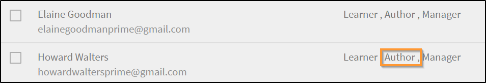
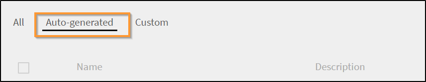
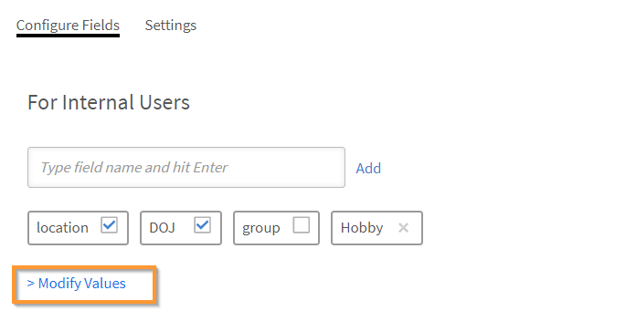
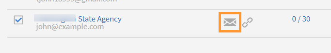

# 사용자 추가 및 사용자 그룹 만들기

Learning Manager 응용 프로그램에서 사용자 또는 사용자 그룹을 추가하는 방법을 알아보십시오.

<!---->

## 개요 {#overview}

Adobe Learning Manager에서 다음 역할을 수행할 수 있습니다.

* **책임자:** 책임자는 조직의 교육 전략을 정의합니다. 책임자는 학습자를 추가하고, 학습자에게 필요한 스킬을 검색하고, 강의를 관리 및 할당하고, 학습 계획, 인증 및 학습 프로그램을 만들고, 전체 조직에 대한 보고서를 관리할 수 있습니다.
* **작성자:** 작성자는 교육 설계가이자 콘텐츠 생성자입니다. 작성자는 Learning Manager에 모듈과 강의를 추가할 수 있습니다.
* **관리자:** 관리자는 팀의 학습 활동을 관리합니다. 관리자는 팀원이 수강할 강의를 지정하고, 팀원의 요청을 승인하고, 교육 완료 후 팀원의 성과에 대한 피드백을 제공할 수 있습니다. 관리자는 성과 추적을 위해 팀의 보고서를 볼 수도 있습니다.
* **학습자:** 학습자는 자신에게 할당된 강의, 학습 프로그램 및 인증에 액세스할 수 있습니다. 학습자는 카탈로그를 사용하여 사용 가능한 모든 강의를 찾아보고 강의, 학습 프로그램 또는 인증에 직접 등록할 수도 있습니다.

책임자는 다음 세 가지 방식으로 사용자를 추가할 수 있습니다.

* 내부
* 외부
* 사용자 그룹

## 단일 사용자 추가 {#addasingleuser}

단일 사용자 옵션을 사용하여 Adobe Learning Manager에 내부 학습자를 추가합니다.

>[!INFO]
>
>이 교육에서는 Adobe Learning Manager에 내부 학습자를 추가하는 방법에 대해 학습합니다.    

교육을 시작할 수 없는 경우 <almacademy@adobe.com>에 작성하세요.

사용자를 추가하려면

1. Adove Learning Manager에 관리자로 로그인합니다.
1. 홈 페이지에서 **[!UICONTROL 사용자 추가]**&#x200B;를 클릭합니다. 이 페이지에서는 CSV를 사용하여 단일 사용자 또는 한 번에 여러 사용자를 추가할 수 있습니다. 또한 내부 직원용 자체 등록 링크 또는 외부 학습자 프로필을 만들 수도 있습니다.
1. 단일 사용자를 추가하려면 오른쪽 상단 모서리에서 **[!UICONTROL 추가]**&#x200B;를 클릭하고 **[!UICONTROL 단일 사용자]** 옵션을 선택합니다.

   
   *단일 내부 사용자 추가*

1. **[!UICONTROL 사용자 추가]** 대화 상자에 학습자의 세부 정보를 입력합니다. **[!UICONTROL 관리자 이름]** 필드의 경우 시스템의 기존 사용자 이름을 선택합니다.

   
   *사용자 추가 대화 상자*

1. Learning Manager에서 새로운 사용자를 추가하려면 **[!UICONTROL 추가]**&#x200B;를 클릭합니다. 사용자가 추가되면 사용자에게 확인 메일이 전송됩니다. 그러면 학습자가 계정을 활성화하고 Learning Manager 사용을 시작합니다. 이 워크플로우는 Learning Manager 계정에 제한된 수의 학습자를 추가해야 하는 경우 유용합니다. 그러나 대규모 조직의 모든 직원을 등록하려는 경우 한 번에 추가할 수 있습니다. 자세한 내용은 다음 섹션을 참조하십시오.

## 사용자 일괄 추가 {#addusersinbulk}

일반적으로 대부분의 조직은 직함, 위치, 참여 날짜, 직원 체계와 같은 모든 직원 기록을 관리하는 HRMS(HR 관리 시스템)을 사용해 업무를 수행합니다. 이러한 데이터는 CSV 형식으로 내보낼 수 있습니다. CSV를 가져오려면 아래 단계를 따르십시오.

1. 오른쪽 상단 모서리에서 **[!UICONTROL 추가]**&#x200B;를 클릭하고 **[!UICONTROL CSV 업로드]** 옵션을 선택합니다.

   
   *사용자를 일괄 추가하려면 CSV를 업로드하세요.*

1. 업로드하는 CSV는 필드로 구성되어 있으며 다음과 같이 표시됩니다.

   
   *CSV 구조*

   마스터 CSV를 유지 관리하고 마스터 CSV에서 모든 추가 및 삭제를 수행해야 합니다. 마스터 CSV에는 다음 필드가 포함되어 있습니다. 

   * 이름 &#42;
   * 전자 메일 &#42;
   * profile
   * 관리자

   (&#42;) 필수 필드입니다.

1. **[!UICONTROL CSV 업로드]** 옵션을 클릭하면 다음 대화 상자가 표시됩니다.

   
   *CSV 대화 상자 업로드*

1. CSV를 선택하거나 파일을 드래그 앤 드롭합니다. 파일을 선택한 후 데이터 필드를 CSV 파일의 데이터 필드로 매핑합니다. 필요한 드롭다운을 클릭하고 적절한 필드를 선택합니다.

   
   *CSV에서 필드 매핑*

1. 사용자 가져오기를 시작하려면 **[!UICONTROL 저장]**&#x200B;을 클릭합니다. 확인 메시지가 표시됩니다.

   
   *CSV를 성공적으로 업로드하기 위한 확인 메시지*

1. 이제 새로운 사용자가 Adobe Learning Manager 계정에 추가됩니다. 새로운 사용자를 선택하려면 모든 사람이 선택되도록 이름 옆의 확인란을 선택합니다.

   
   *새 사용자 추가됨*

>[!NOTE]
>
>자세한 내용은 [사용자 일괄 추가](../add-users-in-bulk.md) FAQ를 참조하십시오.

사용자를 선택한 후 다음을 수행할 수 있습니다.

>[!INFO]
>
>이 교육에서는 CSV를 통해 사용자를 일괄 추가하는 방법을 알아봅니다.    

교육을 시작할 수 없는 경우 <almacademy@adobe.com>에 작성하세요.

## 사용자 등록 {#registerauser}

사용자를 선택한 상태에서 오른쪽 상단 모서리에 있는 **[!UICONTROL 작업]**&#x200B;을 클릭하고 **[!UICONTROL 등록]**&#x200B;을 클릭하십시오.

선택한 사용자에게 환영 전자 메일이 전송됩니다. 기존 Adobe ID가 있는 학습자는 이 링크를 클릭할 수 있습니다. 기존 Adobe ID이 없는 경우에는 시작 링크를 클릭하여 Adobe ID을 만들고 Learning Manager 계정에 연결할 수 있습니다.

### 사용자 관리

이 교육에서는 역할을 할당 및 제거하고, 시작 이메일을 보내고, 사용자를 삭제 및 제거하는 방법에 대해 학습합니다.

교육을 시작할 수 없는 경우 <almacademy@adobe.com>에 작성하세요.

## 역할 할당 {#assignarole}

학습자를 Adobe Learning Manager 계정에 추가한 후 학습자의 역할을 변경하려면 페이지의 오른쪽 상단 모서리에서 작업을 클릭하고, **[!UICONTROL 역할 할당]**&#x200B;을 선택하십시오. 여기에서 학습자에게 작업자 액세스 또는 책임자 액세스 권한을 부여할 수 있습니다. 역할을 할당하면 이 학습자는 계정에 대한 작성자 액세스 권한을 가지며 모듈을 추가하고 강의를 생성할 수 있습니다.

*사용자에게 역할 할당*

## 역할 제거 {#removearole}

또는 사용자에 대한 작업자 또는 책임자 액세스를 제거할 수도 있습니다. 한 명 이상의 학습자를 선택하고 **[!UICONTROL 작업]**&#x200B;을 클릭한 다음 **[!UICONTROL 역할 제거]**&#x200B;를 선택합니다. 예를 들어 **[!UICONTROL 작성자 제거]**&#x200B;와 같은 옵션을 선택하면 이 학습자에 대한 작성자 액세스 권한이 해지됩니다.

>[!NOTE]
>
>관리자 역할은 시스템의 사용자에게 수동으로 할당할 수 없습니다. 한 명 이상의 직원이 관리자 대시보드에 추가되면 관리자 대시보드에 자동으로 액세스할 수 있습니다.

## 사용자 삭제 {#deleteauser}

사용자를 삭제하려면 **[!UICONTROL 작업]**&#x200B;을 클릭하고 **[!UICONTROL 사용자 삭제]**&#x200B;를 선택합니다. 확인 대화 상자에서 **[!UICONTROL 예]**&#x200B;를 클릭하면 학습자가 삭제됩니다.

*사용자 삭제 확인 메시지*

## 사용자 편집 {#editauser}

사용자 목록에서 사용자를 선택한 다음 선택한 사용자를 클릭합니다. 사용자 세부 정보에서 **[!UICONTROL 편집]**() 단추를 클릭합니다. **[!UICONTROL 사용자 편집]** 대화 상자에서 필요한 편집을 수행하고 변경 사항을 저장하려면 **[!UICONTROL 저장]**&#x200B;을 클릭합니다.

*사용자 편집 대화 상자*

## 활성 필드

Adobe Learning Manager의 활성 필드 는 사용자 특정 정보를 저장하고 관리하는 데 사용되는 사용자 정의 가능한 메타데이터 필드입니다. 이러한 필드는 시스템의 각 사용자와 연관된 주요 속성 또는 특성을 정의하는 데 도움이 됩니다.

### 사용자 속성 관리

>[!INFO]
>
>이 교육에서는 활성 필드를 추가, 사용자 정의 및 구성하는 방법에 대해 알아봅니다.    

교육을 시작할 수 없는 경우 <almacademy@adobe.com>에 작성하세요.

Adobe Learning Manager에서는 사용자 특성과 해당 값의 대/소문자 구분을 유지합니다. **예**&#x200B;에서 사용자 특성의 대/소문자 구분은 &#39;location&#39;이며 해당 값은 &#39;PARIS&#39;로 같은 방식으로 유지되어 표시됩니다. 문제가 발생하면 책임자는 이제 특성 이름 및 값을 편집하여 대/소문자 구분 오류를 수정할 수 있습니다.

관리자는 **[!UICONTROL 관리 앱]** > **[!UICONTROL 사용자]** > **[!UICONTROL 사용자 그룹]**&#x200B;을 방문하여 그룹 이름을 클릭하면 됩니다.

책임자는 UI를 통해 학습자에게 허용된 특성값을 추가 및 업데이트할 수 있습니다.

활성 필드의 유형:

* 그룹화 가능: 학습자가 값에 따라 그룹화됩니다.
* 보고 가능: 확장 필드를 토대로 사용자 그룹 보고서가 생성됩니다.
* 내보내기 가능: 사용자 그룹 보고서 형식으로 내보낼 필드가 표시됩니다.

## 자가 등록 링크 만들기 {#createaselfregistrationlink}

관리자의 지원 없이 조직의 직원이 직접 Adobe Learning Manager 계정에 학습자로 등록할 수 있도록 활성화할 수도 있습니다. 책임자는 자체 등록 링크를 만들어 직원과 공유할 수 있으며, 직원은 Adobe 자격 증명을 사용하여 Learning Manager에 추가로 등록할 수 있습니다.

페이지의 오른쪽 상단 모서리에서 **[!UICONTROL 추가]**&#x200B;를 클릭하고 **[!UICONTROL 자체 등록]**&#x200B;을 선택합니다.

*학습자로 자가 등록할 수 있는 링크 만들기*

**[!UICONTROL 자가 등록 프로필 추가]** 대화 상자가 표시됩니다. 이 프로필의 이름을 지정합니다. 그런 다음 관리자의 이름을 추가합니다. 관리자는 이미 Learning Manager에 등록된 학습자여야 합니다.

*자체 등록을 위한 프로필 추가*

**[!UICONTROL 저장]**&#x200B;을 클릭하면 학습자와 공유할 수 있는 URL이 생성되며, 학습자는 해당 URL을 클릭하여 직접 자가 등록할 수 있습니다.

## 외부 학습자 등록 {#enrollexternallearners}

Adobe Learning Manager에서는 사용자의 계정에 대해 액세스가 제한된 외부 파트너 또는 기관에 대한 등록 링크를 만들어 학습 자료를 제공할 수도 있습니다.

내부 등록과 외부 등록 사이에는 몇 가지 차이점이 있습니다.

<table>
 <tbody>
  <tr>
   <td>
    
<b>내부 사용자</b>
</td>
   <td>
    
<b>외부 사용자</b>
</td>
  </tr>
  <tr>
   <td>
    
Adobe ID 또는 SSO 자격 증명으로 로그인합니다.
</td>
   <td>
    
전자 메일 ID를 사용하여 로그인합니다.
</td>
  </tr>
  <tr>
   <td>
    
게임화를 사용할 수 있습니다.
</td>
   <td>
    
게임화 기능을 사용할 수 있습니다. 책임자는 게임화 설정에서 외부 학습자에 대한 게임화를 활성화해야 합니다.
</td>
  </tr>
  <tr>
   <td>
    
학습자 계층을 사용할 수 있습니다.
</td>
   <td>
    
학습자 계층을 사용할 수 없습니다.
</td>
  </tr>
 </tbody>
</table>

외부 사용자를 등록하려면 아래 단계를 따르십시오.

1. 왼쪽 탐색 창에서 **[!UICONTROL 외부]**&#x200B;를 클릭합니다.

   

   *외부 사용자 등록*

1. 페이지 오른쪽 상단 모서리에서 **[!UICONTROL 추가]**&#x200B;를 클릭합니다.

1. **외부 등록 프로필 추가** 대화 상자에서 다음 세부 정보를 추가합니다.

   * 파트너 조직의 프로필 이름입니다.
   * 파트너 조직 관리자의 이메일 주소입니다.
   * 이 파트너의 외부 등록에 대한 인원 제한입니다.
   * 만료일은 이 그룹에 대한 새 등록을 허용하지 않도록 마감일을 설정합니다. 만료 날짜가 지나면 기존에 등록된 사용자만 이 교육에 액세스할 수 있습니다.

   

   *외부 등록 프로필 추가 대화 상자*

   * **[!UICONTROL 고급 설정]** 섹션에서 다음을 입력합니다.

      * **[!UICONTROL 로그인 요구 사항]:** 일 단위로 값을 지정하십시오. 위 기간 동안 로그인하지 않는 학습자는 삭제됩니다.
      * **[!UICONTROL 허용된 도메인]:** 허용 목록에 추가된 전자 메일 도메인 이름의 쉼표로 구분된 목록입니다.
      * **[!UICONTROL 전자 메일 확인 필요]:** 학습자에게 전자 메일 확인을 필수로 설정하려면 이 옵션을 선택합니다.

   

   *고급 설정 섹션에 세부 정보를 입력하십시오*

1. **[!UICONTROL 저장]**&#x200B;을 클릭하면 다음 확인 메시지가 표시됩니다. URL을 외부 사용자와 공유해야 합니다.

   

## 외부 프로필 활성화 {#enableanexternalprofile}

외부 프로필을 생성한 후 해당 프로필의 상태를 반드시 활성화해야 합니다. 외부 프로필 목록에서 필요한 프로필을 선택하고 상태 버튼을 전환합니다.

*외부 프로필 사용*

이렇게 하면 외부 등록 링크가 활성화됩니다. 환영 전자 메일이 자동으로 파트너에게 전송됩니다. URL 복사 아이콘()을 클릭하여 링크를 복사하고 파트너와 공유하거나 메일 아이콘()을 클릭하여 환영 전자 메일을 파트너 조직으로 재전송할 수도 있습니다.

파트너 관리자는 PrLearning Manager에서 교육을 받아야 하는 직원과 링크를 공유할 수 있습니다. 링크를 클릭하면 Learning Manager에서 프로필 생성을 위한 몇 가지 세부 정보를 입력한 후 직접 자가 등록할 수 있습니다. 이러한 사용자는 내부 직원과 함께 학습자 탭에 표시되지 않습니다. **[!UICONTROL 외부 학습자]** 탭에서 해당 직원의 이름을 확인할 수 있습니다.

## 외부 프로필 일시 중지 {#pause}

Learning Manager에 외부 사용자 그룹을 추가한 후 외부 사용자 등록 프로세스를 일시 중지할 수도 있습니다. 일시 중지하면 외부 사용자의 등록 절차가 차단됩니다. 그러나 이 절차는 사용자가 초대를 수락했지만 등록하지 않았을 때만 작동합니다.

외부 사용자 그룹을 일시 정지하려면 그룹을 선택하고, 페이지 오른쪽 상단 모서리에서 **[!UICONTROL 작업]**&#x200B;을 클릭한 다음 **[!UICONTROL 일시 중지]**&#x200B;를 클릭합니다.

## 외부 프로필 다시 시작 {#resumeanexternalprofile}

언제든지 외부 파트너의 일시 중지된 상태를 취소하고 일반 서비스를 다시 시작할 수 있습니다. 페이지 오른쪽 상단 모서리에 있는 **[!UICONTROL 작업]**&#x200B;을 클릭하고 **[!UICONTROL 다시 시작]**&#x200B;을 선택합니다.

외부 사용자의 상태는 다음 중 하나입니다.

* **비활성 상태** - 이 상태에서는 외부 사용자의 등록이 만료됩니다. 책임자는 사용자 추가 작업 과정에서 외부 사용자를 등록할 때 만료 날짜를 설정할 수 있습니다.
* **활성 상태** - 이 상태의 외부 사용자는 Learning Manager 응용 프로그램에 등록하고 로그인할 수 있습니다.
* **일시 중지** - 이 상태에서는 외부 사용자의 등록 절차가 차단됩니다. 하지만 기존 사용자는 계속 로그인할 수 있습니다.

## 사용된 시트 확인 {#checkusedseats}

외부 프로필 목록에서 **[!UICONTROL 사용된 시트]**&#x200B;을 클릭합니다. 파트너 조직의 추가된 학습자 수를 볼 수 있습니다.

*사용된 시트 확인*

## 사용자 삭제 {#Deleteauser-1}

사용자를 선택하고 오른쪽 상단에서 **[!UICONTROL 작업]** > **[!UICONTROL 사용자 삭제]**&#x200B;를 클릭합니다.

## 프로필 변경 {#changeprofile}

사용자를 다른 외부 프로필로 이동하려면 사용자를 선택하고 오른쪽 상단에서 **[!UICONTROL 작업]** > **[!UICONTROL 프로필 변경]**&#x200B;을 클릭합니다. 프로필 목록에서 프로필을 선택한 다음 **[!UICONTROL 변경]**&#x200B;을 클릭합니다.

## 역할 할당 {#Assignarole-1}

사용자를 선택하고 오른쪽 상단에서 **[!UICONTROL 작업]** > **[!UICONTROL 역할 할당]** > **만들기`<role>`**&#x200B;을(를) 클릭합니다. 사용자에게 새 역할이 할당됩니다.

## 역할 제거 {#Removearole-1}

사용자를 선택하고 오른쪽 상단에서 **[!UICONTROL 작업]** > **[!UICONTROL 역할 제거]** > **제거`<role>`**&#x200B;를 클릭합니다. 선택한 역할이 사용자에게 할당되었던 역할 목록에서 제거됩니다.

>[!NOTE]
>
>새 역할을 할당해도 사용자 정의 사용자 그룹에는 영향을 주지 않습니다. 그러나 모든 관리자, 모든 작성자 및 유사한 역할 기반 그룹과 같은 자동 생성된 사용자 그룹에 영향을 줍니다.

## 사용자 그룹 만들기 {#createusergroups}

사용자 그룹은 범주와 관련된 사용자 집합입니다. 사용자 그룹을 통해 책임자는 속성을 기반으로 조직에서 학습자를 선택하고 학습 콘텐츠를 해당 학습자에게 할당할 수 있습니다. 또한 사용자 정의된 로고 및 카탈로그를 학습자에게 할당하고 진행률에 사용자 정의된 보고서를 표시할 수도 있습니다.

>[!INFO]
>
>이 교육에서는 이름, 이메일 ID 및 여러 자동 생성된 사용자 그룹을 결합하여 사용자 그룹을 만드는 방법에 대해 학습합니다.    

<!--[Launch training](https://learningmanager.adobe.com/app/learner?accountId=98632&sdid=QLD1P6BS&mv=display&mv2=display#/course/7555694)-->

<!--In this training, you will learn how to create a user group by names, email IDs, and combining multiple auto-generated user groups.-->

<!---->

교육을 시작할 수 없는 경우 <almacademy@adobe.com>에 작성하세요.

사용자 그룹에 액세스하려면 왼쪽 탐색 창에서 **[!UICONTROL 사용자 그룹]**&#x200B;을 클릭합니다.

*사용자 그룹 만들기*

Adobe Learning Manager에는 2개의 그룹 유형(사용자 정의 및 자동 생성)이 있습니다. 학습자를 계정에 추가하면 공통 속성에 기반하여 몇 개 그룹이 자동으로 생성됩니다.

자동으로 생성된 그룹을 보려면 **[!UICONTROL 자동 생성]** 탭을 클릭합니다.

*자동 생성된 그룹 보기*

모든 내부 사용자, 모든 관리자, 비용 센터, 부서 및 관리자 팀 기반 그룹 등 다양한 그룹이 있습니다.

자동 생성된 그룹 외에도 사용자 정의 그룹을 만들 수 있습니다. 새 사용자 지정 그룹을 추가하려면 오른쪽 상단 모서리에서 **[!UICONTROL 추가]**&#x200B;를 클릭합니다.

1. 그룹의 이름과 설명을 입력합니다.
1. 입력 기반 검색 필드에 사용자 이름 또는 프로필을 입력하고 드롭다운 목록에서 사용자를 선택하여 추가합니다.

1. 학습자를 더 추가하려면 **[!UICONTROL 사용자 추가]**&#x200B;를 클릭하세요.

1. 사용자 그룹을 생성하려면 **[!UICONTROL 저장]**&#x200B;을 클릭합니다.

이제 이 사용자 정의 그룹이 생성되어 프로필에 추가됩니다. 생성한 사용자 그룹은 기본적으로 동적입니다. 유사한 속성의 새로운 사용자가 추가되면 사용자 그룹에 자동으로 추가됩니다.

사용자가 속한 그룹 목록을 보려면 **[!UICONTROL 사용자]** > **[!UICONTROL 사용자 그룹]**(으)로 이동하여 사용자 이름을 검색한 후 선택합니다. 이렇게 하면 사용자가 속한 모든 그룹이 표시됩니다.

### 사용자 그룹의 사용자 목록 다운로드

특정 사용자 그룹의 사용자 목록을 다운로드하려면 **[!UICONTROL 사용자]** > **[!UICONTROL 사용자 그룹]**&#x200B;으로 이동하고 그룹 옆에 있는 **[!UICONTROL 다운로드 아이콘]**&#x200B;을 선택합니다. 이렇게 하면 해당 그룹의 사용자 목록이 포함된 CSV 파일이 생성됩니다.

## 사용자 그룹 제외

큰 사용자 그룹에서 일부 사용자를 제외하고 싶은 경우가 있습니다. 학습 계획을 통해 특정 사용자 집합을 교육에 등록하거나 카탈로그의 올바른 가시성을 설정하는데 필요합니다. 이번 Learning Manager 릴리스에서는 사용자 정의 사용자 그룹을 만들 때 학습자 또는 사용자 그룹을 제외할 수 있습니다. [사용자 그룹 추가] 대화 상자의 [학습자 제외] 섹션에서 이 기능을 사용할 수 있습니다.

*사용자 그룹 제외*

예를 들어, Store-5(캘리포니아에 위치)를 제외한 캘리포니아에 속한 모든 사용자가 등록되도록 학습 계획을 설정하려는 경우를 가리킵니다.

## 고급 설정 {#advancedsettings}

### 데이터 소스 {#datasources}

조직 데이터베이스의 사용자 또는 학습 데이터를 Learning Manager 응용 프로그램으로 가져오거나 동기화하려면 이 기능을 사용할 수 있습니다. 동기화 빈도를 설정할 수 있습니다.

**[!UICONTROL 고급]** 섹션 아래 왼쪽 창에서 **[!UICONTROL 데이터 원본]**&#x200B;을 클릭합니다.

*사용자를 가져오거나 동기화할 데이터 원본*

**[!UICONTROL 소스]** 드롭다운에서 데이터 소스 유형을 선택하고 업데이트 빈도를 선택한 다음 즉시 동기화해야 하는 경우 **[!UICONTROL 지금 동기화]**&#x200B;를 클릭하거나 **[!UICONTROL 저장]을 클릭하세요.** 데이터 원본 유형은 내부 사용자를 위한 SFDC, FTP 등입니다.

여러 데이터 소스를 추가할 수 있습니다.

### 활성 필드 {#activefields}

책임자는 이 기능을 이용하여 사용자 등록 시 입력된 것 외에도 활성 필드를 추가할 수 있습니다.

사용자 페이지 내에서 사용 가능한 **[!UICONTROL 활성 필드]**&#x200B;를 클릭합니다. 학습자는 사용자 정의 값에 제공된 값 중에서만 선택할 수 있습니다.

*활성 필드*

### 필드 구성 {#configurefields}

**내부 사용자**

내부 사용자 필드에 사용자 정의 값을 추가할 수 있습니다.

사용자 정의 값을 추가하려면 다음 단계를 따르십시오.

1. 내부 사용자에 대해 **[!UICONTROL 값 수정]**&#x200B;을 클릭합니다.

   
   *내부 사용자에 대한 값 수정*

1. 사용자 지정 필드의 **값** 대화 상자가 나타납니다.

   
   사용자 지정 필드 대화 상자의 *값*

1. **[!UICONTROL 선택한 필드]** 드롭다운 메뉴에서 추가할 값을 선택합니다.
1. **[!UICONTROL 새로운 값]** 필드에 새로운 값을 입력합니다.
1. **[!UICONTROL 완료]**&#x200B;를 클릭합니다.
1. 오른쪽 상단 모서리에서 &#39;저장&#39;을 클릭하여 변경 사항을 **[!UICONTROL 저장]**&#x200B;합니다.

**외부 사용자**

내부 사용자 필드의 값과 유사한 사용자 정의 값 추가

*외부 사용자에 대한 값 수정*

### 설정 {#settings}

**사용자 표시**

**학습자 로그인 시 비어 있는 필드만 표시** 옵션이 활성화된 경우 사용자는 로그인 시 빈 필드만 볼 수 있습니다.

*채워지지 않은 필드 표시*

이 옵션을 사용하면 책임자는 필드를 채운 후 표시하거나 숨길 수 있습니다.

## 보고서에서 활성 필드 제한 {#restrictactivefields}

Learning Manager 27.7에서는 활성 필드에 대해 **[!UICONTROL 보고 가능]** 및 **[!UICONTROL 내보내기 가능]**&#x200B;이라는 두 가지 새로운 옵션을 제공합니다.

*활성 필드의 옵션*

CSV 필드 및 수동으로 추가된 필드의 경우 활성 필드가 **[!UICONTROL 보고 가능]**&#x200B;으로 표시되어 있으면 대시보드 보고서 내의 필터에서 활성 필드를 검색할 수 있습니다.

*대시보드 보고서의 필터*

활성 필드가 **[!UICONTROL 내보내기 가능]**&#x200B;으로 표시되어 있으면 Excel 보고서 다운로드 시 활성 필드가 Excel 파일에 표시됩니다.

이러한 옵션은 내부 및 외부 활성 필드 모두에 대해 표시됩니다.

사용자 정의 활성 필드만 삭제할 수 있습니다.

## 사용자 표시

&#39;프로필 작성&#39; 페이지가 학습자에게 보이지 않도록 설정할 수 있습니다. 학습자가 로그인했을 때 이 페이지가 표시되지 않습니다.

기존의 기본 동작은 변경되지 않습니다. 이 옵션은 책임자에게 새로 지원되는 선택적 기능입니다.

활성화할 수 있는 옵션은 다음과 같습니다.

*사용자 표시 섹션*

## FTP 및 Box 커넥터에 의한 수동 CSV 필드 지원 {#import-connector}

사용자는 학습자가 Learning Manager에 로그인할 때 활성 필드를 수동으로 제공하기를 원하는 경우가 많습니다. 이는 현재 Learning Manager에서 사용자가 CSV를 수동으로 가져올 때 가능합니다.

CSV에 일부 활성 필드가 포함되지 않을 수 있습니다. 업로드된 CSV에서 업데이트되지 않은 모든 활성 필드에 대해 사용자는 해당 활성 필드에 대한 데이터를 입력해야 합니다.

현재 모든 활성 필드는 소스 CSV의 일부 필드에 매핑되어야 합니다.

경우에 따라 사용자가 활성 필드를 CSV에 지정된 필드에 매핑하지 않으려고 할 수 있습니다. 이러한 경우 사용자는 활성 필드를 값 **[!UICONTROL DontImportFromSource]**&#x200B;에 매핑할 수 있습니다. FTP 및 Box 커넥터에서 사용자를 가져올 때 드롭다운 목록에서 이 값을 선택합니다.

## 사용자 정의 역할 {#customroles}

사용자 정보에 추가할 필드를 추가한 다음 **[!UICONTROL 저장]**&#x200B;을 클릭합니다. 필드를 추가한 후 **[!UICONTROL 사용자 편집]** 대화 상자에서 필드의 사용 가능 여부를 교차 확인할 수도 있습니다.

아래의 스냅샷과 같이 필드를 추가하고 나서 해당 필드의 체크 표시를 통해 해당 필드가 데이터 소스 또는 CSV에서 공급된 것임을 알 수 있습니다. 책임자는 공급된 필드를 활성화 또는 비활성화하여 편집할 수 있습니다.

Learning Manager의 활성 필드에 대한 **값**

활성 필드의 값은 다음 방법으로 가져옵니다.

1. Learning Manager 응용 프로그램은 계정과 연결된 데이터 소스의 메타데이터를 가져옵니다.
1. 수동으로 가져온 CSV 파일에서 캡처한 메타데이터입니다.
1. 학습자는 로그인할 때 메타데이터를 채웁니다.
1. 책임자는 사용자에 대한 데이터를 입력합니다.

>[!NOTE]
>
>Learning Manager 응용 프로그램은 이러한 메타데이터를 통해 자동으로 사용자 그룹을 생성합니다.

**사용자 정의 값 추가**

내부 및 외부 사용자 필드에 사용자 정의 값을 추가할 수 있습니다.

사용자 정의 값을 추가하려면 다음 단계를 따르십시오.

사용자 정의 필드는 추가 또는 삭제할 수 있으며 모든 사용자에게 적용됩니다. CSV 필드를 활성화 또는 비활성화할 수 있으며, 해당 필드는 귀하가 활성 필드를 수정한 다음 CSV를 업로드할 때만 적용됩니다. 모든 내부 활성 필드는 모든 유형의 내부 사용자에게 적용됩니다. 외부 필드는 외부 사용자에게만 적용됩니다. CSV에 사용자 정의 필드가 있는 경우, 다음 업로드 시 자동으로 CSV 필드로 전환되어 활성화됩니다.

## CSV 필드 값 {#valuesforcsvfields}

**[!UICONTROL 선택 제한]** 확인란이 활성화된 경우, 사용자는 CSV 필드의 정의된 필드에서만 선택해야 합니다.

*선택 제한 확인란*

## 로그 가져오기 {#importlogs}

여기에서는 책임자가 일괄 가져오기 기능을 사용하여 추가한 사용자들에 대한 CSV 가져오기 기록을 볼 수 있습니다. 페이지 오른쪽 상단 모서리에 있는 **[!UICONTROL 추가]**&#x200B;를 클릭하여 CSV 업로드 기능을 사용하여 사용자를 추가할 수도 있습니다.

## 다중 값 활성 필드

이 기능을 사용하여 하나의 활성 필드를 두 가지 이상의 필드로 설정할 수 있습니다. 계정에는 최대 3개의 다중 값 활성 필드가 존재할 수 있습니다. 다중 값 활성 필드는 외부 사용자와 내부 사용자 모두에게 유효합니다.

활성 필드를 다중 값으로 표시하면 단일 값으로 다시 변환할 수 없습니다. 이 설정은 되돌릴 수 없습니다.

기존의 단일 값 필드는 다중 값 필드로 표시할 수 없습니다.

다중 값 활성 필드를 생성하려면 아래 단계를 따르십시오.

1. 활성 필드를 추가합니다.

   
   *활성 필드 추가*

1. &#39;추가&#39;를 클릭합니다.
1. 설정 탭에서 새 필드를 다중 값 필드로 표시합니다.

   
   *다중 값으로 표시*

   또 다른 확인란인 **[!UICONTROL 학습자 구성 가능]**&#x200B;이 있습니다. 이 확인란을 비활성화하면 학습자는 프로필 페이지에서 필드를 볼 수 없습니다.

1. CSV를 사용하거나 값 수정을 클릭하여 값을 추가합니다.

   
   *값 추가*

1. [!UICONTROL **완료**]&#x200B;를 클릭합니다.

>[!NOTE]
>
>사용자 그룹이 생성되고 필드에 내용이 입력되면 다중 값을 단일 값으로 바꾸거나 단일 값을 다중 값으로 바꿀 수 없습니다.

### CSV를 사용해 다중 값 활성 필드 추가

아래 단계를 따르십시오.

1. 새 활성 필드를 열(쉼표로 구분된 값이나 단일 값)로 사용하는 CSV를 생성합니다.
1. CSV를 가져옵니다.
1. 사용자 정의 필드 값 대화 상자에서 필드를 다중 값으로 표시합니다.
1. CSV를 다시 가져옵니다.

CSV에 다중 값으로 표시한 활성 필드의 이름과 동일한 이름의 열이 있어야 합니다.

CSV에는 다음 필드가 포함되어 있습니다.

* **[!UICONTROL 사용자]**: 역할로 만든 사용자 그룹입니다.
* **[!UICONTROL 역할]**: 값이 포함된 다중 값 활성 필드입니다.

새 값이 입력되거나 값이 삭제된 상태로 CSV가 다시 업로드되면 활성 필드와 그룹도 그에 맞게 업데이트됩니다.

### 보고서

모든 보고서에는 다중 값 활성 필드와 각각의 값이 포함됩니다.

관리자는 자동 생성된 활성 필드를 추가하고 사용자 활동과 교육 보고서를 구성할 수 있습니다.

학습자 성적 증명서 보고서에는 모든 활성 필드와 쉼표로 구분된 값이 포함됩니다. 이때 관리자는 그에 따라 데이터를 필터링할 수 있습니다.

## 사용자 그룹 보고서

Adobe Learning Manager의 새로운 사용자 그룹 보고서를 사용하면 관리자가 나갔을 때 관리되지 않고 남아 있는 그룹을 확인할 수 있으므로 사용자 그룹을 관리하는 데 도움이 됩니다. 관리자는 **[!UICONTROL 사용자]** > **[!UICONTROL 사용자 그룹]** 섹션의 보고서에 액세스할 수 있습니다. 다음을 포함하여 각 그룹에 대한 자세한 정보를 제공합니다.

* 사용자 그룹 유형
* 그룹 이름
* 설명
* 제작자 (이름)
* 제작자(이메일)
* 만든 날짜(UTC 시간대)
* 사용자 수

보고서를 다운로드하려면 다음 단계를 따르십시오.

1. **[!UICONTROL 관리자]**(으)로 로그인합니다.
2. **[!UICONTROL 사용자]** > **[!UICONTROL 사용자 그룹]**&#x200B;을 선택합니다.
3. **[!UICONTROL 작업]** > **[!UICONTROL 사용자 그룹 보고서 다운로드]**&#x200B;를 선택합니다.

_사용자 그룹 보고서 다운로드_

## 자주 묻는 질문 {#faq}

+++Learning Manager에 사용자를 등록하는 방법

사용자를 추가하고 역할을 할당한 후 아래 단계를 수행하여 등록할 수 있습니다.

1. 사용자를 선택한 상태에서 오른쪽 상단 모서리에 있는 **[!UICONTROL 작업]**&#x200B;을 클릭하고 **[!UICONTROL 등록]**&#x200B;을 클릭합니다.

1. 팝업 창에서 **[!UICONTROL 예]**&#x200B;를 클릭합니다.

선택한 사용자에게 환영 전자 메일이 전송됩니다. 기존 Adobe ID가 있는 학습자는 이 링크를 클릭할 수 있습니다. 기존 Adobe ID이 없는 경우에는 시작 링크를 클릭하여 Adobe ID을 만들고 Learning Manager 계정에 연결할 수 있습니다.

전자 메일에서 이러한 링크를 클릭하면 Learning Manager에서 학습자의 계정을 확인할 수 있으므로 학습자는 이 링크를 반드시 클릭해야 합니다.

+++

+++사용자 데이터를 편집하는 방법

사용자를 편집하려면 아래 단계를 따르십시오.

1. 사용자 목록에서 데이터를 편집하려는 사용자를 클릭합니다.
1. 다음과 같은 연필 아이콘을 클릭합니다.

**사용자 편집** 대화 상자에서 필드를 적절하게 업데이트합니다. 변경 사항을 저장하려면 **[!UICONTROL 저장]**&#x200B;을 클릭합니다.

+++

+++Learning Manager에서 외부 사용자를 일시 정지하고 다시 시작하는 방법

외부 사용자 목록에서 삭제할 사용자를 선택합니다. 오른쪽 상단에서 **[!UICONTROL 작업]** > **[!UICONTROL 일시 중지]**&#x200B;를 클릭합니다.

자세한 내용은 [외부 프로필 일시 중지](add-users-user-groups.md#pause)를 참조하십시오.

프로필을 일시 정지한 후 외부 프로필이 ***일시 정지됨***&#x200B;으로 상태를 표시합니다.

+++

+++새로 만들어진 외부 프로필에 환영 전자 메일을 전송하는 방법

외부 사용자를 추가할 때 **[!UICONTROL 외부 등록 프로필 추가]** 대화 상자에서 외부 관리자의 전자 메일을 입력합니다. [저장]을 클릭하면 환영 전자 메일도 지정한 전자 메일 주소로 전송됩니다. 환영 전자 메일을 다시 전송하려면 아래 표시된 것처럼 봉투 아이콘을 클릭합니다.

+++

+++사용자 정의 사용자 그룹을 만드는 방법

**[!UICONTROL 사용자]** > **[!UICONTROL 사용자 그룹]**&#x200B;을 클릭하고 사용자 그룹 페이지에서 **[!UICONTROL 추가]**&#x200B;를 클릭합니다. [사용자 그룹 추가] 대화 상자에서 사용자를 개별적으로, 또는 팀으로 추가합니다.

+++

+++이미 입력된 활성 필드를 비활성화하는 방법

학습자가 입력하지 않은 활성 필드만 학습자에게 표시되도록 설정하려면 아래 단계를 따르십시오.

1. **[!UICONTROL 사용자]** > **[!UICONTROL 활성 필드]**&#x200B;를 클릭합니다.

1. **[!UICONTROL 설정]**&#x200B;을 클릭하고 **[!UICONTROL 학습자 로그인 시 비어 있는 필드만 표시]** 옵션을 활성화합니다.

1. **[!UICONTROL 저장]**&#x200B;을 클릭합니다.

+++

+++활성 필드에 학습자가 임의의 값을 입력하지 못하게 하는 방법

미리 정해진 값만 선택하고 임의의 값을 입력할 수 없도록 학습자의 선택을 제한할 수 있습니다. 아래 단계를 따르십시오.

1. **[!UICONTROL 사용자]** > **[!UICONTROL 활성 필드]**&#x200B;를 클릭합니다.
1. **[!UICONTROL 선택 제한]** 옵션을 활성화합니다.
1. **[!UICONTROL 완료]**&#x200B;를 클릭합니다.

+++

+++CSV 활성 필드와 사용자 정의 활성 필드를 구분하는 방법

CSV 활성 필드를 활성화하거나 비활성화할 수 있을 뿐, 삭제할 수는 없습니다. 반면에 사용자 정의 활성 필드는 활성화하거나 비활성화할 수 없습니다.

+++
