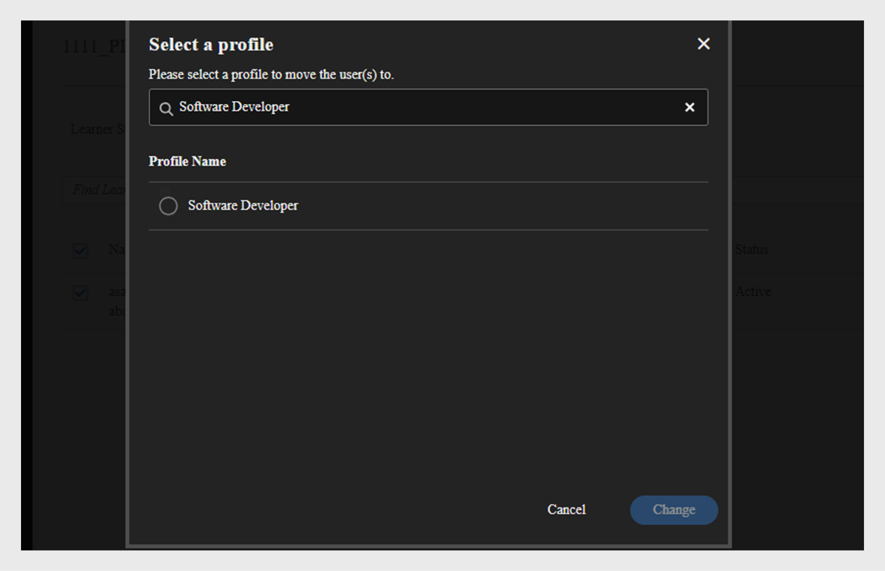

# Adobe Learning Manager에서 사용자 추가

Adobe Learning Manager에서 사용자는 학습 또는 교육 플랫폼을 사용하는 학습자입니다. 사용자의 유형은 내부 사용자와 외부 사용자라는 두 가지입니다.

내부 사용자는 조직의 직원 또는 팀원입니다.

외부 사용자는 고객, 파트너, 공급업체 또는 클라이언트와 같이 학습 콘텐츠에 액세스할 수 있는 회사 외부의 학습자입니다.

Adobe Learning Manager(ALM)을 사용하면 관리자가 수동 입력, CSV 업로드, 자가 등록 및 시스템 통합을 포함한 다양한 방법을 사용하여 내부 및 외부 사용자를 모두 온보딩하고 관리할 수 있습니다.

## 내부 사용자

Adobe Learning Manager의 내부 사용자는 조직 내의 직원 또는 팀원을 의미합니다. 이러한 에셋은 수동으로 추가하거나, 대량으로 업로드하거나, 시스템 통합을 통해 가져올 수 있습니다. 사용자를 추가한 후 사용자를 그룹으로 구성하고 강의를 할당하고 학습 진행률을 모니터링할 수 있습니다.

Adobe Learning Manager 사용자는 할당된 역할에 따라 다양한 책임을 지고 다양한 작업을 관리할 수 있습니다. 책임자, 작성자, 강사 및 통합 책임자를 포함한 각 역할은 플랫폼 내에서 사용자의 책임을 지원하도록 조정된 특정 기능을 제공합니다.

### 내부 사용자를 추가하는 방법

관리자는 다음 방법을 사용하여 내부 사용자를 추가할 수 있습니다.

* **단일 사용자 추가**: 한 번에 한 명의 사용자를 수동으로 추가합니다.
* **자체 등록 프로필**: 관리자가 만든 등록 링크를 사용하여 학습자가 Adobe Learning Manager에서 학습자로 자체 등록할 수 있도록 허용합니다.
* **CSV를 통한 일괄 업로드**: CSV 파일을 업로드하여 한 번에 여러 사용자를 추가합니다.

### 수동으로 내부 사용자 추가

관리자는 이름, 이메일, 고유 식별자 및 관리자 이름을 제공하여 사용자를 수동으로 추가할 수 있습니다. Adobe Learning Manager의 고유 식별자는 관리자가 사용자를 만들 때 할당하는 필수 식별자입니다. 각 사용자에 대해 고유해야 하며 시스템 전체에서 일관된 참조 역할을 합니다.

>[!INFO]
>
>Adobe Learning Manager에서 단일 사용자를 추가하는 방법에 대해 자세히 알아보려면 이 ALM Academy 교육을 시청하십시오.  

Adobe Learning Manager에 단일 사용자를 추가하려면 다음을 수행하십시오.

1. 관리자로 로그인합니다.
2. **사용자**&#x200B;를 선택한 다음 **내부**&#x200B;를 선택합니다.
3. **추가**&#x200B;를 선택한 다음 **단일 사용자**&#x200B;를 선택합니다.

   
   _단일 내부 사용자를 수동으로 추가하는 옵션을 표시하는 관리자 인터페이스_
4. **사용자 추가** 프롬프트에서 사용자의 **이름**, **전자 메일** 및 **프로필**(직책)을 입력합니다.

   
   _새 사용자의 이름, 전자 메일, 고유 식별자 및 프로필을 입력할 필드_
5. 사용자의 관리자를 검색하고 관리자 목록에서 이름을 선택합니다.
6. **추가**&#x200B;를 선택합니다.
사용자는 액세스할 로그인 URL이 포함된 시작 이메일을 받습니다.

### 내부 사용자에 대한 자체 등록 허용

셀프등록은 이용자가 등록 URL을 방문해 세부 정보를 입력한 뒤 플랫폼에 자동 등록할 수 있는 셀프서비스 온보딩 프로세스다. 이 방식은 사용자가 제공된 URL을 통해 직접 등록할 수 있도록 해 관리 노력을 최소화한다.

사용자에 대한 자체 등록 URL을 만들려면 다음을 수행하십시오.

1. 관리자로 로그인합니다.
2. **사용자**&#x200B;를 선택한 다음 **내부**&#x200B;를 선택합니다.
3. **추가**&#x200B;를 선택한 다음 **자가 등록**&#x200B;을 선택합니다.

   
   자가 등록 옵션을 선택하기 위한 _드롭다운 메뉴_
4. **자체 등록 프로필 추가** 프롬프트에서 **프로필 이름**(사용자의 직함) 필드에 프로필을 입력합니다.
5. **관리자 이름** 필드에서 관리자를 검색하여 사용자의 관리자를 선택합니다. 자체 등록 프로필에 할당된 관리자는 Adobe Learning Manager에 등록된 사용자여야 합니다.

   
   _프로필 이름을 설정하고 자체 등록 프로필에 관리자를 할당하기 위한 입력 필드_
6. **이미지 추가** 옵션을 사용하여 이미지를 선택합니다. 이 이미지는 프로필 섹션에 있는 학습자에게 표시됩니다.
7. **저장**&#x200B;을 선택합니다.

   Adobe Learning Manager은 사용자 프로필을 만들고 자체 등록 URL을 생성하여 사용자와 공유하여 등록을 완료할 수 있습니다.

   
   _자체 등록 URL을 만들었음을 나타내는 확인 메시지_
8. 자체 등록하려는 사용자와 URL을 공유합니다.

   등록을 위해 URL을 여러 사용자와 공유할 수 있습니다. 예를 들어 **Sales Associate** 프로필에 대한 URL을 생성하고 Sales Associate 팀과 공유하여 직접 등록할 수 있습니다.

_자체 등록 링크를 클릭하면 등록 페이지가 열립니다_

### 자체 등록 URL 목록 보기

자체 등록 URL 목록을 보려면 다음을 수행합니다.

1. **사용자**&#x200B;를 선택한 다음 **내부**&#x200B;를 선택합니다.
2. **자체 등록**&#x200B;을 선택합니다.

   책임자는 자체 등록 URL 목록을 볼 수 있습니다.

_내부 사용자가 사용할 수 있는 기존 자체 등록 URL을 표시하는 목록 보기_

### 내부 사용자 일괄 업로드

관리자는 이름, 이메일 주소 및 관리자 이름과 같은 사용자 정보가 포함된 CSV 파일을 업로드하여 한 번에 여러 사용자를 추가할 수 있습니다. 이 일괄 업로드 기능을 사용하면 사용자를 개별적으로 추가하는 것과 비교하여 시간과 노력을 절약할 수 있습니다.

>[!INFO]
>
>CSV를 통해 사용자를 일괄 추가하는 방법을 살펴보려면 이 ALM 아카데미 교육을 시청하십시오.   

여러 사용자를 추가하려면 다음을 수행하십시오.

1. 관리자로 로그인합니다.
2. **사용자**&#x200B;를 선택한 다음 **내부**&#x200B;를 선택합니다.
3. **추가**&#x200B;를 선택한 다음 **CSV 업로드**&#x200B;를 선택합니다.

   
   _대량 사용자 가져오기를 위해 CSV 파일을 업로드하는 옵션_

4. 다음 필드가 있는 CSV 파일을 준비합니다.

   * 직원 이름*
   * 직원 이메일*
   * 직원 프로필/지정
   * 관리자의 ID/이메일\
     (*) 필수 필드입니다.

5. 직원에 대한 관리자의 이메일 ID를 추가하기 전에 관리자가 CSV 파일에 직원으로 이미 포함되어 있는지 확인하십시오. 예를 들어 아래 스냅샷에서 Howard Walters라는 직원을 참조하십시오.

   
   _모든 필드가 있는 샘플 CSV 이미지_

6. CSV 파일을 업로드하고 그에 따라 데이터 필드를 매핑합니다.

   
   스프레드시트 열을 시스템 필드와 맞추는 _CSV 매핑 인터페이스_
7. **저장**&#x200B;을 선택하여 사용자를 가져옵니다.

   업로드가 완료되면 확인 메시지가 나타납니다.

   
   _이미지는 CSV 업로드 상태를 성공한 것으로 표시합니다_

>[!NOTE]
>
>모든 추가 및 삭제에 대한 마스터 CSV를 유지 관리합니다. 기존 CSV 파일은 업데이트하고 다시 업로드할 수 없습니다.

사용자를 추가하기 위해 CSV 파일을 업로드할 때에는 모든 관련 정보를 올바른 순서로 포함하는 것이 중요합니다. 관리자의 이메일 ID를 직원에게 할당할 경우 관리자의 세부 정보가 CSV 파일 앞쪽에 표시되어야 합니다. 이렇게 하면 시스템에서 관리자를 팀 구성원에 연결하기 전에 기존 사용자로 인식합니다. 예를 들어 Howard Walters가 관리자인 경우 자신에게 보고하는 직원을 나열하기 전에 CSV에 전체 사용자 세부 정보를 포함시키십시오.

### 사용자 등록 관리

사용자를 개별적으로 또는 일괄적으로 추가한 후 계정을 활성화하려면 사용자를 등록해야 합니다. 이를 통해 사용자는 Adobe Learning Manager에 액세스하고 플랫폼을 사용할 수 있습니다.

사용자를 등록하려면 다음을 수행하십시오.

1. 관리자 홈 페이지에서 **사용자**&#x200B;를 선택합니다.
2. 등록할 사용자의 이름 옆에 있는 확인란을 선택합니다.
3. **작업**&#x200B;을 선택한 다음 **등록**&#x200B;을 선택하십시오.

   
   _Adobe Learning Manager에서 선택한 사용자를 활성화하는 등록 단추_

4. **예**&#x200B;를 선택하여 사용자를 활성화합니다.

확인 이메일이 사용자에게 전송됩니다. 사용자는 이메일을 통해 링크를 선택해야 계정을 활성화하고 Adobe Learning Manager 사용을 시작할 수 있습니다.

### 사용자 보고서 다운로드

책임자는 사용자 데이터를 종합적인 보고서로 내보내고 다운로드할 수 있습니다. 이 데이터를 내보내면 관리자는 학습자 활동을 추적하고, 계정 수명 주기를 모니터링하고, 비활성 사용자를 식별하고, 준수, 감사 및 보고 목적으로 정확한 기록을 유지할 수 있습니다.

사용자 보고서를 다운로드하려면:

1. 관리자 권한으로 Adobe Learning Manager에 로그인합니다.
2. **사용자**&#x200B;를 선택한 다음 **내부**&#x200B;를 선택합니다.
3. **사용자 데이터 내보내기**&#x200B;를 선택합니다. 보고서가 준비되면 알림을 받게 됩니다.

   
   _내부 사용자 섹션에는 사용자 보고서를 내보내고 다운로드하는 옵션이 표시됩니다._
4. 알림을 선택하고 사용자 보고서를 다운로드합니다.

보고서에는 다음과 같은 정보가 포함됩니다.

* 이름
* 이메일
* 상태
* 추가된 날짜(UTC 시간대)
* 삭제 날짜(UTC 시간대)
* 마지막 로그인 날짜(UTC 시간대)
* Adobe ID
* 사용자 상태
* profile
* 인터페이스 언어
* 콘텐츠 언어
* 시간대
* 내부 사용자 ID
* 관리자 이메일

## 외부 사용자

Adobe Learning Manager을 사용하면 회사 외부의 사용자(예: 고객, 파트너, 공급업체 또는 클라이언트)를 추가하여 학습 콘텐츠에 액세스할 수 있습니다. 강사가 추가되면 강의를 그룹화하고, 강의를 할당하고 학습 진행률을 추적할 수 있습니다.

Adobe Learning Manager에서 외부 사용자를 추가하는 작업에는 다음 단계가 포함됩니다.

* 외부 등록 프로필 만들기
* 등록 프로필 활성화
* 외부 사용자와 등록 링크 공유
* 필요할 때 프로필 일시 정지 또는 다시 시작

Adobe Learning Manager은 외부 등록 프로필을 통해 이러한 사용자를 등록할 수 있도록 지원합니다.

외부 사용자를 만들려면 다음 단계를 따르십시오.

1. 관리자로 로그인합니다.
2. **사용자**&#x200B;를 선택한 다음 **외부**&#x200B;를 선택합니다.
3. 외부 사용자의 등록을 만들려면 **추가**&#x200B;를 선택하십시오.
4. **외부 등록 프로필 추가** 대화 상자에서 다음을 입력합니다.

   * **프로필 이름:** 이름을 입력하십시오.
   * **관리자 전자 메일:** 관리자의 전자 메일 주소를 입력합니다.
   * **인원 제한:** 허용되는 최대 등록 수를 설정합니다.
   * **만료:** 새 등록에 대한 마지막 날짜를 정의합니다. 만료되면 링크가 새 사용자 등록에 대해 작동하지 않습니다.

   
   _프로필 이름, 관리자 전자 메일, 인원 제한 및 만료 입력 대화 상자_

5. **이미지 추가** 옵션을 사용하여 이미지를 선택합니다. 이 이미지는 프로필 섹션에 있는 학습자에게 표시됩니다.
6. **고급 설정** 섹션을 선택하여 확장하고 필요한 세부 정보를 입력합니다.
   * **로그인 요구 사항:** 일 수를 입력합니다. 학습자가 전체 기간 동안 비활성 상태를 유지하는 경우 자동으로 제거됩니다.
   * **허용된 도메인:** 허용된 전자 메일 도메인의 쉼표로 구분된 목록을 입력하십시오. 승인된 도메인의 전자 메일 주소를 가진 사용자만 등록할 수 있습니다.
   * **전자 메일 확인 필요:** 등록 중에 전자 메일 확인을 적용하려면 이 옵션을 선택하세요.

   
   _로그인 요구 사항, 허용된 도메인 및 전자 메일 확인을 설정하는 고급 설정 패널_

7. **저장**&#x200B;을 선택합니다.

등록 URL이 생성됩니다.

### 외부 프로필 활성화

외부 프로필을 활성화하려면 다음을 수행하십시오.

1. 외부 프로파일 목록에서 새로 생성된 프로파일을 찾습니다.
2. **상태** 토글 단추를 선택하여 활성화합니다.

관리자는 이 URL을 외부 파트너와 공유하여 외부 파트너가 등록하고 이를 사용하여 Adobe Learning Manager에 로그인할 수 있도록 합니다.

_외부 프로필을 활성화하려면 토글을 선택합니다_

### 외부 프로필의 등록 URL 복사 및 공유

외부 프로필의 등록 URL은 **외부 사용자** 섹션에서 복사할 수 있습니다.

_외부 프로필의 등록 URL 복사_

### 내부 사용자와 외부 사용자 등록 간의 주요 차이점

내부 등록과 외부 등록 사이에는 몇 가지 차이점이 있습니다.

| 내부 사용자 | 외부 사용자 |
|---|---|
| Adobe ID 또는 SSO 자격 증명을 사용하여 로그인할 수 있습니다. | 모든 전자 메일 ID를 사용하여 로그인할 수 있습니다. |
| 게임화를 사용할 수 있습니다. | 게임화 기능을 사용할 수 있습니다. 책임자는 [게임화 설정](https://experienceleague.adobe.com/en/docs/learning-manager/using/admin/gamification)에서 외부 학습자에 대한 게임화를 활성화해야 합니다. |

### 외부 등록 프로필 일시 중지

Adobe Learning Manager에서 관리자는 프로필을 일시 중지하여 외부 사용자 등록을 관리할 수 있습니다. 이는 특정 외부 등록 프로필을 사용하여 신규 사용자의 가입을 일시적으로 중단하려는 경우에 유용합니다. 프로필을 일시 중지하면 초대를 받았지만 아직 등록하지 않은 사용자는 등록 프로세스를 완료할 수 없습니다. 이 작업은 이미 등록을 완료한 사용자에게는 영향을 주지 않습니다.

외부 프로필을 일시 중지하려면 다음을 수행하십시오.

1. **외부 사용자** 페이지의 오른쪽 상단에서 **작업**&#x200B;을 선택합니다.
2. 외부 등록 프로필을 일시 중지하려면 **일시 중지**&#x200B;를 선택합니다.

이렇게 하면 초대를 수락하지 않은 사용자의 새 등록이 차단됩니다. 이 작업은 아직 등록을 완료하지 않은 사용자에게만 영향을 미칩니다.

_작업 메뉴에서 기존 외부 등록 프로필을 일시 중지하는 옵션_

### 외부 등록 프로필 다시 시작

이전에 외부 프로필이 일시 중지된 경우 관리자는 외부 프로필을 다시 시작하여 신규 사용자가 등록을 완료하도록 허용할 수 있습니다. 이렇게 하면 초대를 받았지만 등록을 완료하지 못한 사용자의 등록 프로세스가 다시 활성화됩니다.

외부 사용자를 재개하려면 다음을 수행하십시오.

1. 페이지의 오른쪽 상단에서 **작업**&#x200B;을 선택합니다.
2. 일시 중지된 파트너의 액세스를 다시 시작하려면 **다시 시작**&#x200B;을 선택하십시오.

_이전에 일시 중지된 외부 등록 프로필을 다시 시작하는 옵션_

### 외부 프로필 변경

책임자는 학습자를 한 외부 프로필에서 다른 프로필로 재할당할 수 있습니다.

외부 프로필을 변경하려면 다음을 수행하십시오.

1. 관리자로 Adobe Learning Manager에 로그인합니다.
2. **[!UICONTROL 사용자]**&#x200B;를 선택한 다음 **[!UICONTROL 외부]**&#x200B;를 선택합니다.
3. 외부 프로필 목록에서 **[!UICONTROL 사용된 시트]**&#x200B;를 선택합니다.

   
   _사용된 시트 수를 보여 주는 외부 프로필 섹션_

4. 학습자를 선택한 다음 **[!UICONTROL 작업]**&#x200B;을 선택합니다.

   
   _프로필 변경 옵션을 강조 표시하는 외부 프로필 페이지에서 학습자를 다른 프로필로 이동_

5. **[!UICONTROL 프로필 변경]**&#x200B;을 선택합니다.
6. 다른 외부 프로필을 검색하여 선택합니다.

   
   _프로필 변경 프롬프트에 외부 프로필을 검색하는 옵션이 표시됨_

선택한 학습자가 선택한 외부 프로필로 이동합니다.

### 외부 시트 사용 모니터링

책임자는 Adobe 학습에서 각 외부 프로필에 추가된 사용자 수를 추적할 수 있습니다.

사용된 시트를 확인하려면 다음을 수행하십시오.

1. 외부 프로필 목록에서 **사용된 시트**&#x200B;를 선택합니다.

파트너 조직에 추가된 학습자 수와 학습자의 활성 여부를 확인할 수 있습니다.

## 사용자 관리

관리자는 사용자 세부 정보를 편집하고, 사용자를 삭제하고, 역할을 할당하고, 역할을 제거할 수 있습니다. 이렇게 하면 각 사용자가 적절한 액세스 권한과 작업을 가질 수 있습니다.

>[!INFO]
>
>이 ALM Academy 교육을 통해 역할을 할당 및 제거하고, 환영 이메일을 보내고, 사용자를 삭제 및 삭제하는 방법을 알아보십시오. [![단추]](https://content.adobelearningmanageracademy.com/app/learner?accountId=98632#/course/7555586) 

### 사용자 편집

Adobe Learning Manager에서 **사용자 편집** 옵션을 사용하여 이름, 전자 메일 주소, 고유 식별자, 프로필 및 관리자 이름과 같은 사용자의 프로필 정보를 업데이트합니다. 관리자는 사용자 데이터가 정확하고 최신 상태를 유지하도록 이러한 변경 작업을 수행할 수 있습니다.

사용자를 편집하려면 다음을 수행합니다.

1. 관리자 홈 페이지에서 **사용자**&#x200B;를 선택합니다.
2. **사용자** 목록에서 편집할 사용자를 선택합니다.
3. **프로필 편집**&#x200B;을 선택합니다.

   
   _플랫폼에서 사용자를 제거하려면 작업 메뉴에서 사용자 옵션을 삭제하십시오_

4. **예**&#x200B;를 선택하여 사용자를 삭제합니다.

사용자가 성공적으로 삭제되면 확인 메시지가 나타납니다.

## 사용자에게 역할 할당

Adobe Learning Manager의 사용자 역할은 시스템에서 각 사용자가 수행할 수 있는 작업을 정의합니다. 각 역할은 사용자의 권한에 따라 특정 권한을 제공합니다.

Adobe Learning Manager은 다음 사용자 역할을 지원합니다.

* **관리자**: 사용자 및 사용자 그룹을 관리하고, 역할을 할당하고, 데이터 원본, 허용된 도메인 및 표시 옵션과 같은 시스템 전반적인 환경 설정을 구성합니다. 책임자는 학습 콘텐츠를 생성 및 구성하고, 학습자 진행 상황을 추적하고, 보고서를 생성하고, 외부 시스템과의 통합을 설정할 책임도 있습니다.
* **작성자**: 모듈과 강의를 포함한 콘텐츠를 만들고 관리합니다.
* **관리자**: 팀 학습 활동을 감독하고, 강의에 팀 구성원을 지정하고, 요청을 승인하고, 피드백을 제공합니다.
* **통합 관리자**: ALM과 외부 플랫폼 간의 시스템 통합 및 데이터 연결을 관리합니다.
* **사용자 정의 역할**: 관리자는 사용자 정의 역할을 만들어 사용자에게 권한에 따라 맞춤형 액세스 권한을 제공할 수 있습니다. 사용자 지정 역할에 대한 자세한 내용은 이 [문서](/help/migrated/administrators/feature-summary/custom-role.md)를 참조하십시오.

사용자에게 역할을 할당하려면 다음을 수행합니다.

1. 관리자 홈 페이지에서 **사용자**&#x200B;를 선택합니다.
2. 역할을 할당할 사용자를 선택합니다.
3. 오른쪽 상단에서 **작업**&#x200B;을 선택합니다.
4. **역할 할당**&#x200B;을 선택합니다.
5. 필요한 역할을 선택합니다.

   
   _역할 할당 메뉴 옵션에 선택한 사용자에 대해 사용 가능한 역할이 표시됩니다_

6. 확인 대화 상자에서 **예**&#x200B;를 선택합니다.

## 역할 제거

사용자 역할을 제거하면 해당 역할이 부여한 권한이 취소됩니다.

사용자로부터 역할을 제거하려면 다음을 수행합니다.

1. 관리자 홈페이지에서 **사용자**&#x200B;를 선택합니다.
2. 역할을 제거할 사용자를 선택합니다.
3. **작업**&#x200B;을 선택한 다음 **역할 제거**&#x200B;를 선택합니다.

   
   _작업 메뉴에서 할당된 역할을 제거하는 옵션_

4. 확인 대화 상자에서 **예**&#x200B;를 선택합니다.

