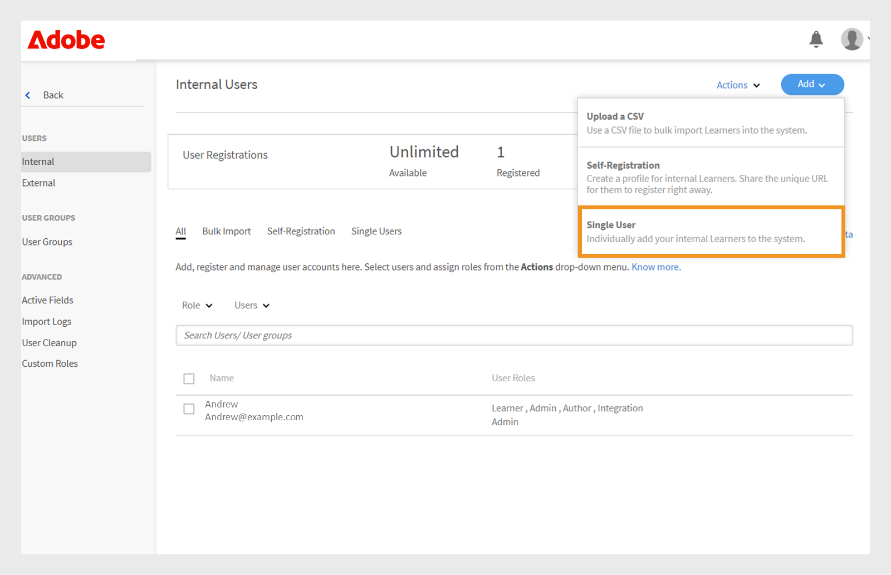
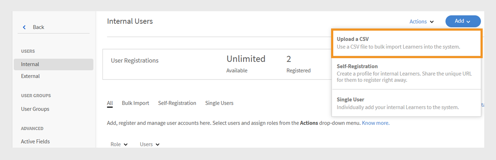
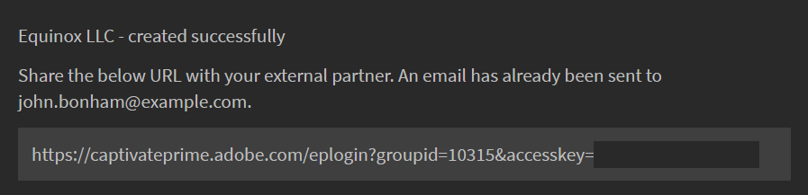
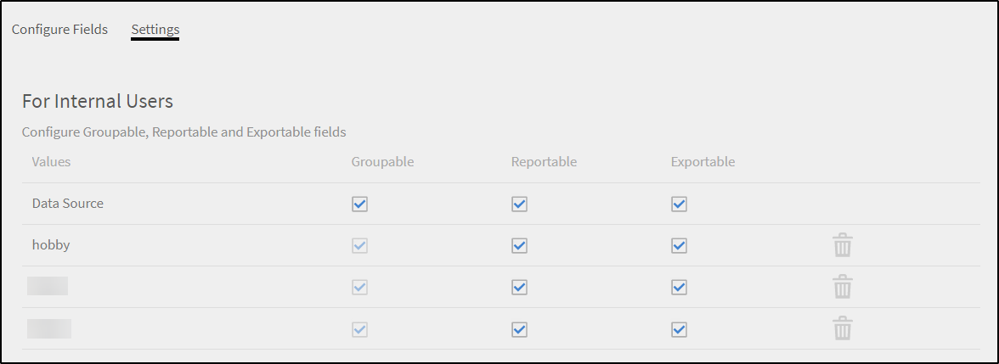

# Adobe Learning Manager에서 사용자 추가

Adobe Learning Manager에서 사용자는 학습 또는 교육을 위해 플랫폼을 사용하는 사람입니다. 사용자의 유형은 내부 사용자와 외부 사용자라는 두 가지입니다.

내부 사용자는 조직의 직원 또는 팀원입니다.

외부 사용자는 고객, 파트너, 공급업체 또는 클라이언트와 같이 학습 콘텐츠에 액세스할 수 있는 회사 외부의 사람입니다.

Adobe Learning Manager(ALM)을 사용하면 관리자가 수동 입력, CSV 업로드, 자가 등록 및 시스템 통합을 포함한 다양한 방법을 사용하여 내부 및 외부 사용자를 모두 온보딩하고 관리할 수 있습니다.

## 내부 사용자

Adobe Learning Manager의 내부 사용자는 조직 내의 직원 또는 팀원을 의미합니다. 이러한 에셋은 수동으로 추가하거나, 대량으로 업로드하거나, 시스템 통합을 통해 가져올 수 있습니다. 사용자를 추가한 후 사용자를 그룹으로 구성하고 강의를 할당하고 학습 진행률을 모니터링할 수 있습니다.

Adobe Learning Manager 사용자는 할당된 역할에 따라 다양한 책임을 지고 다양한 작업을 관리할 수 있습니다. 책임자, 작성자, 강사 및 통합 책임자를 포함한 각 역할은 플랫폼 내에서 사용자의 책임을 지원하도록 조정된 특정 기능을 제공합니다.

Adobe Learning Manager은 다음 사용자 역할을 지원합니다.

* **관리자**: 사용자 및 사용자 그룹을 관리하고, 역할을 할당하고, 데이터 원본, 허용된 도메인 및 표시 옵션과 같은 시스템 전반적인 환경 설정을 구성합니다. 책임자는 학습 콘텐츠를 생성 및 구성하고, 학습자 진행 상황을 추적하고, 보고서를 생성하고, 외부 시스템과의 통합을 설정할 책임도 있습니다.
* **작성자**: 모듈과 강의를 포함한 콘텐츠를 만들고 관리합니다.
* **관리자**: 팀 학습 활동을 감독하고, 강의에 팀 구성원을 지정하고, 요청을 승인하고, 피드백을 제공합니다.
* **통합 관리자**: ALM과 외부 플랫폼 간의 시스템 통합 및 데이터 연결을 관리합니다.
* **사용자 지정 역할**: 관리자는 사용자 지정 역할을 만들어 사용자에게 권한을 기반으로 사용자 지정 액세스를 제공할 수 있습니다. 사용자 정의 역할에 대한 자세한 내용은 이 문서를 참조하십시오.

### 내부 사용자를 추가하는 방법

관리자는 다음 방법을 사용하여 내부 사용자를 추가할 수 있습니다.

* **단일 사용자 추가**: 한 번에 한 명의 사용자를 수동으로 추가합니다.
* **자체 등록 프로필**: 관리자가 만든 등록 링크를 사용하여 학습자가 Adobe Learning Manager에서 학습자로 자체 등록할 수 있도록 허용합니다.
* **CSV를 통한 일괄 업로드**: CSV 파일을 업로드하여 한 번에 여러 사용자를 추가합니다.

### 수동으로 내부 사용자 추가

관리자는 이름, 이메일 ID, 고유 식별자 및 관리자 이름을 입력하여 개별 사용자를 수동으로 추가할 수 있습니다. Adobe Learning Manager의 고유 식별자는 관리자가 사용자를 만들 때 할당하는 필수 식별자입니다. 각 사용자에 대해 고유해야 하며 시스템 전체에서 일관된 참조 역할을 합니다.

>[!INFO]
>
>Adobe Learning Manager에서 단일 사용자를 추가하는 방법에 대해 자세히 알아보려면 이 ALM Academy 교육을 시청하십시오.  

Adobe Learning Manager에 단일 사용자를 추가하려면 다음을 수행하십시오.

1. 관리자로 로그인합니다.
2. **사용자**&#x200B;를 선택한 다음 **내부**&#x200B;를 선택합니다.
3. **추가**&#x200B;를 선택한 다음 **단일 사용자**&#x200B;를 선택합니다.

   
   _단일 내부 사용자를 수동으로 추가하는 옵션을 표시하는 관리자 인터페이스_
4. **사용자 추가** 프롬프트에서 사용자의 **이름**, **전자 메일** 및 **프로필**(직책)을 입력합니다.

   
   _새 사용자의 이름, 전자 메일, 고유 식별자 및 프로필을 입력할 필드_
5. 사용자의 관리자를 검색하고 관리자 목록에서 이름을 선택합니다.
6. **추가**&#x200B;를 선택합니다.
사용자는 액세스할 로그인 URL이 포함된 시작 이메일을 받습니다.

### 내부 사용자에 대한 자체 등록 허용

셀프등록은 이용자가 등록 URL을 방문해 세부 정보를 입력한 뒤 플랫폼에 자동 등록할 수 있는 셀프서비스 온보딩 프로세스다. 이 방식은 사용자가 제공된 URL을 통해 직접 등록할 수 있도록 해 관리 노력을 최소화한다.

사용자에 대한 자체 등록 URL을 만들려면 다음을 수행하십시오.

1. 관리자로 로그인합니다.
2. **사용자**&#x200B;를 선택한 다음 **내부**&#x200B;를 선택합니다.
3. 오른쪽 위 모서리에서 **추가**&#x200B;를 선택한 다음 **자가 등록**&#x200B;을 선택합니다.

   
   자가 등록 옵션을 선택하기 위한 _드롭다운 메뉴_
4. **자체 등록 프로필 추가** 프롬프트에서 **프로필 이름**(사용자의 직함) 필드에 프로필을 입력합니다.
5. **관리자 이름** 필드에서 관리자를 검색하여 사용자의 관리자를 선택합니다. 자체 등록 프로필에 할당된 관리자는 Adobe Learning Manager에 등록된 사용자여야 합니다.

   
   _직책을 설정하고 자체 등록 프로필에 관리자를 할당하기 위한 입력 필드_
6. **이미지 추가** 옵션을 사용하여 이미지를 선택합니다. 이 이미지는 프로필 섹션에 있는 학습자에게 표시됩니다.
7. **저장**&#x200B;을 선택합니다.

   Adobe Learning Manager은 사용자 프로필을 만들고 자체 등록 URL을 생성하여 사용자와 공유하여 등록을 완료할 수 있습니다.

   
   _자체 등록 URL을 만들었음을 나타내는 확인 메시지_
8. 자체 등록하려는 사용자와 URL을 공유합니다.

   등록을 위해 URL을 여러 사용자와 공유할 수 있습니다. 예를 들어 **Sales Associate** 프로필에 대한 URL을 생성하고 Sales Associate 팀과 공유하여 직접 등록할 수 있습니다.

_자체 등록 링크를 클릭하면 등록 페이지가 열립니다_

### 자체 등록 URL 목록 보기

자체 등록 URL 목록을 보려면 다음을 수행합니다.

1. **사용자**&#x200B;를 선택한 다음 **내부**&#x200B;를 선택합니다.
2. **자체 등록**&#x200B;을 선택합니다.

   책임자는 자체 등록 URL 목록을 볼 수 있습니다.

_내부 사용자가 사용할 수 있는 기존 자체 등록 URL을 표시하는 목록 보기_

### 내부 사용자 일괄 업로드

Adobe Learning Manager을 사용하면 관리자가 이름, 이메일 ID 및 관리자 이름을 포함한 사용자 정보가 포함된 CSV를 업로드하여 한 번에 여러 사용자를 추가할 수 있습니다. 이 일괄 업로드 기능을 사용하면 사용자를 개별적으로 추가하는 것과 비교하여 시간과 노력을 절약할 수 있습니다.

>[!INFO]
>
>CSV를 통해 사용자를 일괄 추가하는 방법을 살펴보려면 이 ALM 아카데미 교육을 시청하십시오.   

여러 사용자를 추가하려면 다음을 수행하십시오.

1. 관리자로 로그인합니다.
2. **사용자**&#x200B;를 선택한 다음 **내부**&#x200B;를 선택합니다.
3. 오른쪽 상단에서 **추가**&#x200B;를 선택하고 **CSV 업로드**&#x200B;를 선택합니다.

   
   _대량 사용자 가져오기를 위해 CSV 파일을 업로드하는 옵션_

4. 다음 필드가 있는 CSV 파일을 준비합니다.

   * 직원 이름*
   * 직원 이메일*
   * 직원 프로필/지정
   * 관리자의 ID/이메일\
     (*) 필수 필드입니다.

5. 직원에 대한 관리자의 이메일 ID를 추가하기 전에 관리자가 CSV 파일에 직원으로 이미 포함되어 있는지 확인하십시오. 예를 들어 아래 스냅샷에서 Howard Walters라는 직원을 참조하십시오.

   
   _모든 필드가 있는 샘플 CSV 이미지_

6. CSV 파일을 업로드하고 그에 따라 데이터 필드를 매핑합니다.

   
   스프레드시트 열을 시스템 필드와 맞추는 _CSV 매핑 인터페이스_
7. **저장**&#x200B;을 선택하여 사용자를 가져옵니다.

   업로드가 완료되면 확인 메시지가 나타납니다.

   
   _이미지는 CSV 업로드 상태를 성공한 것으로 표시합니다_

>[!NOTE]
>
>모든 추가 및 삭제에 대한 마스터 CSV를 유지 관리합니다. 기존 CSV 파일은 업데이트하고 다시 업로드할 수 없습니다.

사용자를 추가하기 위해 CSV 파일을 업로드할 때에는 모든 관련 정보를 올바른 순서로 포함하는 것이 중요합니다. 관리자의 이메일 ID를 직원에게 할당할 경우 관리자의 세부 정보가 CSV 파일 앞쪽에 표시되어야 합니다. 이렇게 하면 시스템에서 관리자를 팀 구성원에 연결하기 전에 기존 사용자로 인식합니다. 예를 들어 Howard Walters가 관리자인 경우 자신에게 보고하는 직원을 나열하기 전에 CSV에 전체 사용자 세부 정보를 포함시키십시오.

### 사용자 등록 관리

사용자를 개별적으로 또는 일괄적으로 추가한 후 계정을 활성화하려면 사용자를 등록해야 합니다. 이를 통해 사용자는 Adobe Learning Manager에 액세스하고 플랫폼을 사용할 수 있습니다.

사용자를 등록하려면 다음을 수행하십시오.

1. 관리자 홈 페이지에서 **사용자**&#x200B;를 선택합니다.
2. 등록할 사용자의 이름 옆에 있는 확인란을 선택합니다.
3. **작업**&#x200B;을 선택한 다음 **등록**&#x200B;을 선택하십시오.

   
   _Adobe Learning Manager에서 선택한 사용자를 활성화하는 등록 단추_

4. **예**&#x200B;를 선택하여 사용자를 활성화합니다.

확인 이메일이 사용자에게 전송됩니다. 사용자는 이메일을 통해 링크를 선택해야 계정을 활성화하고 Adobe Learning Manager 사용을 시작할 수 있습니다.

## 외부 사용자

Adobe Learning Manager을 사용하면 회사 외부의 사용자(예: 고객, 파트너, 공급업체 또는 클라이언트)를 추가하여 학습 콘텐츠에 액세스할 수 있습니다. 강사가 추가되면 강의를 그룹화하고, 강의를 할당하고 학습 진행률을 추적할 수 있습니다.

Adobe Learning Manager에서 외부 사용자를 추가하는 작업에는 다음 단계가 포함됩니다.

* 외부 등록 프로필 만들기
* 등록 프로필 활성화
* 외부 사용자와 등록 링크 공유
* 필요할 때 프로필 일시 정지 또는 다시 시작

Adobe Learning Manager은 외부 등록 프로필을 통해 이러한 사용자를 등록할 수 있도록 지원합니다.

외부 사용자를 만들려면 다음 단계를 따르십시오.

1. 관리자로 로그인합니다.
2. **사용자**&#x200B;를 선택한 다음 **외부**&#x200B;를 선택합니다.
3. 오른쪽 상단에서 **추가**&#x200B;를 선택하여 외부 사용자의 등록을 만듭니다.
4. **외부 등록 프로필 추가** 대화 상자에서 다음을 입력합니다.

   * **프로필 이름:** Adobe Learning Manager에 액세스하려는 파트너 조직의 이름을 입력하십시오.
   * **관리자 전자 메일:** 관리자의 사용자 전자 메일 주소를 입력합니다.
   * **인원 제한:** 허용되는 최대 등록 수를 설정합니다.
   * **만료:** 새 등록에 대한 마지막 날짜를 정의합니다. 만료되면 링크가 새 사용자 등록에 대해 작동하지 않습니다.

   
   _프로필 이름, 관리자 전자 메일, 인원 제한 및 만료 입력 대화 상자_

5. **이미지 추가** 옵션을 사용하여 이미지를 선택합니다. 이 이미지는 프로필 섹션에 있는 학습자에게 표시됩니다.
6. **고급 설정** 섹션을 선택하여 확장하고 필요한 세부 정보를 입력합니다.
   * **로그인 요구 사항:** 일 수를 입력합니다. 학습자가 전체 기간 동안 비활성 상태를 유지하는 경우 자동으로 제거됩니다.
   * **허용된 도메인:** 허용된 전자 메일 도메인의 쉼표로 구분된 목록을 입력하십시오. 승인된 도메인의 전자 메일 주소를 가진 사용자만 등록할 수 있습니다.
   * **전자 메일 확인 필요:** 등록 중에 전자 메일 확인을 적용하려면 이 옵션을 선택하세요.

   
   _로그인 요구 사항, 허용된 도메인 및 전자 메일 확인을 설정하는 고급 설정 패널_

7. **저장**&#x200B;을 선택합니다.

등록 URL이 생성됩니다.

### 외부 프로필 활성화

외부 프로필을 활성화하려면 다음을 수행하십시오.

1. 외부 프로파일 목록에서 새로 생성된 프로파일을 찾습니다.

2. **상태** 토글 단추를 선택하여 활성화합니다.

관리자는 이 URL을 외부 파트너와 공유하여 외부 파트너가 등록하고 이를 사용하여 Adobe Learning Manager에 로그인할 수 있도록 합니다.

_외부 프로필을 활성화하려면 토글을 선택합니다_

### 외부 프로필의 등록 URL 복사 및 공유

외부 프로필의 등록 URL은 **외부 사용자** 섹션에서 복사할 수 있습니다.

_외부 프로필의 등록 URL 복사_

### 내부 사용자와 외부 사용자 등록 간의 주요 차이점

내부 등록과 외부 등록 사이에는 몇 가지 차이점이 있습니다.

| 내부 사용자 | 외부 사용자 |
|---|---|
| Adobe ID 또는 SSO 자격 증명을 사용하여 로그인할 수 있습니다. | 모든 전자 메일 ID를 사용하여 로그인할 수 있습니다. |
| 게임화를 사용할 수 있습니다. | 게임화 기능을 사용할 수 있습니다. 책임자는 [게임화 설정](https://experienceleague.adobe.com/en/docs/learning-manager/using/admin/gamification)에서 외부 학습자에 대한 게임화를 활성화해야 합니다. |

### 외부 등록 프로필 일시 중지

Adobe Learning Manager에서 관리자는 프로필을 일시 중지하여 외부 사용자 등록을 관리할 수 있습니다. 이 기능은 특정 외부 사용자 프로필을 사용하여 신규 사용자의 가입을 일시적으로 중단하려는 경우에 유용합니다. 프로필을 일시 중지하면 초대를 받았지만 아직 등록하지 않은 사용자는 등록 프로세스를 완료할 수 없습니다. 이 작업은 이미 등록을 완료한 사용자에게는 영향을 주지 않습니다.

외부 프로필을 일시 중지하려면 다음을 수행하십시오.

1. **외부 사용자** 페이지의 오른쪽 상단에서 **작업**&#x200B;을 선택합니다.
2. 외부 사용자 프로필을 일시 중지하려면 **일시 중지**&#x200B;를 선택합니다.

이렇게 하면 아직 초대를 수락하지 않은 사용자의 등록 프로세스가 차단됩니다. 이 작업은 아직 등록을 완료하지 않은 사용자에게만 영향을 미칩니다.

_작업 메뉴에서 기존 외부 사용자 프로필을 일시 중지하는 옵션_

### 외부 등록 프로필 다시 시작

이전에 외부 프로필이 일시 중지된 경우 관리자는 외부 프로필을 다시 시작하여 신규 사용자가 등록을 완료하도록 허용할 수 있습니다. 이렇게 하면 초대를 받았지만 등록을 완료하지 못한 사용자의 등록 프로세스가 다시 활성화됩니다.

외부 사용자를 재개하려면 다음을 수행하십시오.

1. 페이지의 오른쪽 상단에서 **작업**&#x200B;을 선택합니다.
2. 일시 중지된 파트너의 액세스를 다시 시작하려면 **다시 시작**&#x200B;을 선택하십시오.

_이전에 일시 중지된 외부 사용자 프로필을 다시 시작하는 옵션_

### 외부 시트 사용 모니터링

책임자는 Adobe 학습에서 각 외부 프로필에 추가된 사용자 수를 추적할 수 있습니다.

사용된 시트를 확인하려면 다음을 수행하십시오.

1. 외부 프로필 목록에서 **사용된 시트**&#x200B;를 선택합니다.

파트너 조직에 추가된 학습자 수와 학습자의 활성 여부를 확인할 수 있습니다.

## 사용자 관리

관리자는 사용자 세부 정보를 편집하고, 사용자를 삭제하고, 역할을 할당하고, 역할을 제거할 수 있습니다. 이렇게 하면 각 사용자가 적절한 액세스 권한과 작업을 가질 수 있습니다.

>[!INFO]
>
>이 ALM Academy 교육을 통해 역할을 할당 및 제거하고, 환영 이메일을 보내고, 사용자를 삭제 및 삭제하는 방법을 알아보십시오. [![단추]](https://content.adobelearningmanageracademy.com/app/learner?accountId=98632#/course/7555586) 

### 사용자 편집

Adobe Learning Manager에서 **사용자 편집** 옵션을 사용하여 이름, 전자 메일 주소, 고유 식별자, 프로필 및 관리자 이름과 같은 사용자의 프로필 정보를 업데이트합니다. 관리자는 사용자 데이터가 정확하고 최신 상태를 유지하도록 이러한 변경 작업을 수행할 수 있습니다.

사용자를 편집하려면 다음을 수행합니다.

1. 관리자 홈 페이지에서 **사용자**&#x200B;를 선택합니다.
2. **사용자** 목록에서 편집할 사용자를 선택합니다.
3. **프로필 편집**&#x200B;을 선택합니다.

   
   _플랫폼에서 사용자를 제거하려면 작업 메뉴에서 사용자 옵션을 삭제하십시오_

4. **예**&#x200B;를 선택하여 사용자를 삭제합니다.

사용자가 성공적으로 삭제되면 확인 메시지가 나타납니다.

## 사용자에게 역할 할당

Adobe Learning Manager의 사용자 역할은 시스템에서 각 사용자가 수행할 수 있는 작업을 정의합니다. 각 역할은 사용자의 권한에 따라 특정 권한을 제공합니다.

사용자에게 역할을 할당하려면 다음을 수행합니다.

1. 관리자 홈 페이지에서 **사용자**&#x200B;를 선택합니다.
2. 역할을 할당할 사용자를 선택합니다.
3. 오른쪽 상단에서 **작업**&#x200B;을 선택합니다.
4. **역할 할당**&#x200B;을 선택합니다.
5. 필요한 역할을 선택합니다.

   
   _역할 할당 메뉴 옵션에 선택한 사용자에 대해 사용 가능한 역할이 표시됩니다_

6. 확인 대화 상자에서 **예**&#x200B;를 선택합니다.

## 역할 제거

사용자 역할을 제거하면 해당 역할이 부여한 권한이 취소됩니다.

사용자로부터 역할을 제거하려면 다음을 수행합니다.

1. 관리자 홈페이지에서 **사용자**&#x200B;를 선택합니다.
2. 역할을 제거할 사용자를 선택합니다.
3. **작업**&#x200B;을 선택한 다음 **역할 제거**&#x200B;를 선택합니다.

   
   _작업 메뉴에서 할당된 역할을 제거하는 옵션_

4. 확인 대화 상자에서 **예**&#x200B;를 선택합니다.
<!--# Add users and create user groups

Learn how to add users or user groups in Learning Manager application.

<!---->

<!--## Overview {#overview}

In Adobe Learning Manager, you can assume the following roles:

* **Administrator:** An Administrator defines the training strategy for the organization. An Administrator can add learners, search required skills for learners, manage and assign courses, create learning plans, certifications, and learning programs, and manage reports for the entire organization.
* **Author:** Authors are Instructional Designers and content creators. An Author can add modules and courses to Learning Manager.
* **Manager:** A Manager manages the learning activities of a team. A Manager can nominate team members to take a course, approve requests from team members, and provide feedback on performance of their team members post-completion of training. Managers can also view reports for their team to track their performance.
* **Learner:** Learners can access courses, learning programs, and certifications assigned to them. Learners can also browse through all the available courses by using a catalog and enroll themselves for either courses, learning programs, or certifications.

As an Administrator, you can add users in three ways:

* Internal
* External
* User groups

## Add a single user {#addasingleuser}

Add internal learners to the Adobe Learning Manager using a single user option.

>[!INFO]
>
>In this training, you will learn how to add internal learners to the Adobe Learning Manager.    

If you're unable to launch the training, write to <almacademy@adobe.com>.

To add users,

1. Log into Adobe Learning Manager as an Administrator. 
1. On the home page, click **[!UICONTROL Add Users]**. On this page, you can add a single user or multiple users at a time using a CSV. You can also create a self-registration link for internal employees or create an external learner profile.
1. To add a single user, click **[!UICONTROL Add]** on the upper-right corner and choose the option **[!UICONTROL Single User]**.

1. To add a single user, click **[!UICONTROL Add]** on the upper-right corner and choose the option **Single User**.

   
   *Add a single internal user*

1. On the **[!UICONTROL Add User]** dialog, enter the details of the learner. For the field **[!UICONTROL Manager's Name]**, pick the name of an existing user in the system.

   
   *Add user dialog box*

1. To add the new user in Learning Manager, click **[!UICONTROL Add]**. After the user is added, the user receives a verification mail. The Learner then activates the account and starts using Learning Manager. This workflow is helpful if you need to add limited number of learners to your Learning Manager Account. But if you're planning to enroll all the employees of a large organization, you can add them in a singe attempt. For more information, see the next section.

## Add users in bulk {#addusersinbulk}

Typically, most organizations work with an HR Management System (HRMS), which maintains all employee records, such as, designation, location, date of joining, or employee hierarchy. You can export this data in a CSV format. To import a CSV, follow the steps below:

1. Click **[!UICONTROL Add]** on the upper-right corner, and choose the option **[!UICONTROL Upload a CSV]**.

   
   *Upload a CSV to add users in bulk*

1. The CSV that you upload consists of the fields, as shown below:

   
   *Structure of the CSV*

   You must maintain a master CSV and perform perform all additions and deletions on the master CSV. The master CSV contains the following fields:

   * name &#42;
   * email &#42;
   * profile
   * manager

   (&#42;) Required field.

1. After you click the option **[!UICONTROL Upload a CSV]**, the following dialog displays.

   
   *Upload a CSV dialog*

1. Choose the CSV or drag-and-drop the file. After you've chosen the file, map the data fields with the ones in the CSV file. Click the required drop-down and choose the right field.

   
   *Map fields in CSV*

1. To start importing the users, click **[!UICONTROL Save]**. You can see a confirmation message.

   
   *Confirmation message for successful upload of the CSV*

1. The new users are now added to your Adobe Learning Manager account. To select the new users, select the check-box next to the names so that everybody is selected. 

   
   *New users added*

>[!NOTE]
>
>For more information, see the FAQ, [Add users in bulk](../add-users-in-bulk.md).

>[!INFO]
>
>In this training, you will learn how to add users in bulk through a CSV.    

If you're unable to launch the training, write to <almacademy@adobe.com>.

## Register a user {#registerauser}

With the user selected, click **[!UICONTROL Actions]** on the upper-right corner and click **[!UICONTROL Register]**.

The selected users receive a Welcome email. If the learners have an existing Adobe ID, they can click this link. If they don't have an existing Adobe ID, they can go ahead and click the Welcome link to create an Adobe ID and link it to their Learning Manager account.

### Manage users

In this training, you will learn how to assign and remove roles, send a welcome email, and delete and purge users. 

If you're unable to launch the training, write to <almacademy@adobe.com>.

## Assign a role {#assignarole}

After adding learners to the Adobe Learning Manager account, if you want to change their roles, click Actions on the upper-right corner of the page. Choose the option **[!UICONTROL Assign Role]**. Here you can decide whether you want to give Author access or Admin access to the learner. After you have assigned a role, this learner has Author access to the account and can add modules and create courses. 

*Assign a role to a user*

## Remove a role {#removearole}

You can also remove Author or Admin access for the users. Select one or more learners, click **[!UICONTROL Actions]**, and select **[!UICONTROL Remove Role]**. Choose an option, for example, **[!UICONTROL Remove Author]**, and the author access gets revoked for this learner. 

>[!NOTE]
>
>You cannot manually assign a Manager role to someone in the system. They automatically get access to the Manager dashboard when one or more employees are added under them.

## Delete a user {#deleteauser}

To delete a user, click **[!UICONTROL Actions]**, and choose **[!UICONTROL Delete User]**. On the confirmation dialog, click **[!UICONTROL Yes]**, and the learner gets deleted.

*Confirmation message to delete a user*

## Edit a user {#editauser}

On the list of users, choose a user, and click the user. On the user details, click the **[!UICONTROL Edit]** ( ) button. On the **[!UICONTROL Edit User]** dialog, make the necessary edits and to save the changes, click **[!UICONTROL Save]**.

*Edit User dialog*

## Active fields

Active Fields in Adobe Learning Manager are customizable metadata fields used to store and manage user-specific information. These fields help define key attributes or characteristics associated with each user in the system.

### Manage user attributes

>[!INFO]
>
>In this training, you will learn how to add, customize, and configure Active Fields.    

If you're unable to launch the training, write to <almacademy@adobe.com>.

Adobe Learning Manager preserves the case sensitivity of the user attribute and its value. **For example**, the case sensitivity of a user attribute is 'location' and its value as 'PARIS' will be preserved and displayed in the same manner. In case of any issues, the Administrator can now edit the attribute name and values to correct any case sensitivity errors. 

The Administrator can do this by visiting **[!UICONTROL Admin app]** > **[!UICONTROL Users]** > **[!UICONTROL User groups]** and clicking on the group name.  

An Admin can add and update allowed attribute values for a learner through UI.

Types of active fields:

* Groupable: Learners would get grouped on the basis of the Values
* Reportable: Reporting user groups would be created based on the active fields
* Exportable: The fields will be seen in exported in user group report.

## Create a self-registration link {#createaselfregistrationlink}

You can also enable employees in your organization to register themselves as Learners to Adobe Learning Manager Account, without taking help from you as an administrator. The administrator can create a Self-Registration link and share with the employees, who can further register to Learning Manager using their Adobe credentials.

On the upper-right corner of the page, click **[!UICONTROL Add]**, and select **[!UICONTROL Self-Registration]**.

*Create link to self-register as learner*

The **[!UICONTROL Add Self-Registration Profile]** dialog appears. Give this profile a name. Then add the manager's name. It's important to know that the manager must already be registered learner in Learning Manager.

*Add profile for self-registration*

After you click **[!UICONTROL Save]**, a URL gets generated, which you can share with the learners, so that they can click the URL and self-register themselves.

## Enroll external learners {#enrollexternallearners}

In Adobe Learning Manager, you can also create Registration links for external partners or agencies with limited access to your account and provide them learning material.

There are a few differences between internal and external registrations.

<table>
 <tbody>
  <tr>
   <td>
    
<b>Internal users</b>
</td>
   <td>
    
<b>External users</b>
</td>
  </tr>
  <tr>
   <td>
    
Log in using Adobe ID or SSO credentials.
</td>
   <td>
    
Log in using any email ID.
</td>
  </tr>
  <tr>
   <td>
    
Gamification is available.
</td>
   <td>
    
Gamification is available. The admin must enable gamification for external learners in the Gamification settings.
</td>
  </tr>
  <tr>
   <td>
    
Learner hierarchies are available.
</td>
   <td>
    
Learner hierarchies are not available.
</td>
  </tr>
 </tbody>
</table>

To enroll external users, follow the steps below:

1. In the left navigation pane, click **[!UICONTROL External]**.

   
   
   *Enroll external users*

1. On the upper-right corner of the page, click **[!UICONTROL Add]**.

1. On the **Add External Registration Profile** dialog, add the following details:

   * The profile name of the partner organization.
   * The email address of the manager of the partner organization.
   * Seat limit for external enrollment for this partner.
   * Expiry date to set a deadline to stop allowing new registrations to this group. After the Expiry date, only the existing registered users can access this training.

   

   *Add External Registration Profile dialog*

   * In the **[!UICONTROL Advanced Settings]** section, enter the following:

     * **[!UICONTROL Login Requirement]:** Specify a value in days. Learners get deleted if they do not login for the above duration.
     * **[!UICONTROL Allowed Domains]:** A comma-separated list of whitelisted email domain names.
     * **[!UICONTROL Email Verification Required]:** Select this option to make email verification mandatory for a learner.

   

   *Enter the details in the Advanced Settings section* 

1. After you click **[!UICONTROL Save]**, you can see the following confirmation message. You must share the URL with your external partner.

   

## Enable an external profile {#enableanexternalprofile}

After an external profile has been created, you must enable its status. From the list of external profiles, choose the required profile, and toggle the status button.

*Enable an external profile*

This enables the External Enrollment link. A welcome email is automatically be sent to the partner. You can also copy the link and share with them by clicking the Copy URL icon (), or you can resend the welcome email to the partner organization by clicking the Mail icon ().

The partner manager can share the link with the employees who must take the training in PrLearning Managerime. When they click the link, they can self-enroll themselves after filling out some details to create their profile on Learning Manager. These users will not appear on the Learners tab along with the internal employees. You can see their names under the **[!UICONTROL External Learners]** tab.

## Pause an external profile {#pause}

After adding an external user group to Learning Manager, you can also pause the external users' registration process. When you pause, the external users' registration process is blocked. However, this process works only when the users haven't registered yet by accepting the invitation.

To pause the external user groups, choose a group or groups, click **[!UICONTROL Actions]** from the upper-right corner of the page, and click **[!UICONTROL Pause]**.

## Resume an external profile {#resumeanexternalprofile}

At any time, you can always revoke the paused state of an external partner and resume normal services. Click **[!UICONTROL Actions]** at the upper-right corner of the page and select **[!UICONTROL Resume]**.

The following states are applicable for external users:

* **Inactive state** - In this state, the external users' registration is expired. Administrators set the expiry date for the external users while adding them through the add user workflow.
* **Active state** - In this state, the external users can register to the Learning Manager application, and log in to the application.
* **Pause** - In this state, the registration process for external users is blocked. However, the existing users can continue to log in.

## Check used seats {#checkusedseats}

On the list of external profiles, click **[!UICONTROL Seats Used]**. You can view the number of learners in the partner organization who have been added.

*Check used seats*

## Delete a user {#Deleteauser-1}

Choose a user, and from the upper-right corner, click **[!UICONTROL Actions]** > **[!UICONTROL Delete User]**.

## Change profile {#changeprofile}

To move a user to another external profile, choose a user, from the upper-right corner, click **[!UICONTROL Actions]** > **[!UICONTROL Change Profile]**. From the list of profiles, choose a profile, and click **[!UICONTROL Change]**.

## Assign a role {#Assignarole-1}

Choose a user, and from the upper-right corner, click **[!UICONTROL Actions]** > **[!UICONTROL Assign Role]** > **Make `<role>`**. The user gets a new role.

## Remove a role {#Removearole-1}

Choose a user, and from the upper-right corner, click **[!UICONTROL Actions]** > **[!UICONTROL Remove Role]** > **Remove `<role>`**. The selected role gets removed from the list of roles that were assigned to the user.

>[!NOTE]
>
>Assigning a new role will not affect custom user groups. However, it will impact auto-generated user groups such as All Admins, All Authors, and similar role-based groups.

## Create user groups {#createusergroups}

A User Group is a set of users who are related to a category. User Groups help administrators to select learners in their organization based on their attributes, and then assign learning content to them. Also, these User Groups enable administrators to assign customized logos and catalogs to learners and show customized reports on their progress.

To access User Groups, on the left navigation pane, click **[!UICONTROL User Groups]**.

*Create user groups*

### Manage user groups

>[!INFO]
>
>In this training, you will learn how to create a user group by names, email IDs, and combining multiple auto-generated user groups.    

If you're unable to launch the training, write to <almacademy@adobe.com>.

There are two types of groups in Adobe Learning Manager, Custom and Auto-generated. When you add learners to your account, some groups are automatically created based on their common properties.

To see the automatically created groups, click the tab **[!UICONTROL Auto-generated]**.

*View Auto-generated groups*

You can see that there are different groups, like All Internal Users, All Managers, groups based on the Cost Center, based on the department, and based on the teams of the managers.

In addition to Auto-generated groups, you can create Custom groups. To add a new Custom Group, on the upper-right corner, click **[!UICONTROL Add]**. 

1. Enter the name, and description for the group.
1. Enter user name or profile in search-as-you-type field and select from the drop-down list, to add users.

1. To add more learners, click **[!UICONTROL Add More Users]**.

1. To create the user group, click **[!UICONTROL Save]**.

This Custom Group is now created and added to the profile. The User Groups that you create are dynamic in nature. If new users are added with similar attributes, they're automatically added to the User Group.

To view the list of groups a user belongs to, navigate to **[!UICONTROL User]** > **[!UICONTROL User Groups]**, search for the user's name, and select it. This will display all the groups the user is part of.

### Download the list of users in a user group

To download the list of users in a specific user group, navigate to **[!UICONTROL User]** > **[!UICONTROL User Groups]**, select the **[!UICONTROL Download icon]** next to the group. This will generate a CSV file containing the list of users in that group.

 

## Exclusion of user groups

At times you would want to exclude a small set of users from a large user group. This is required to enroll this specific set of users into training via Learning Plans or to setup the correct visibility of catalogs. In this release of Learning Manager, you can exclude learners or User Groups when you create a custom user group. In the Add User Group dialog, the Exclude Learners section enables you to achieve so.

*Exclude user groups*

For example, if you want to set up a Learning Plan so that all users belonging to location = California except Store-5 (located in California) get enrolled. 

## Advanced settings {#advancedsettings}

### Data Sources {#datasources}

You can use this feature when you want to import/sync the users or learning data from your organization's database in to the Learning Manager application. You can also set up the frequency of this sync. 

Click **[!UICONTROL Data Sources]** on the left pane under **[!UICONTROL Advanced]** section. 

*Data sources to iport or sync users*

Choose the data source type from the **[!UICONTROL Source]** drop-down, select the update frequency, and click **[!UICONTROL Sync now]** if you need to sync immediately or click **[!UICONTROL Save].** Data source types are SFDC, FTP, and so on for internal users. 

You can add multiple data sources. 

### Active Fields {#activefields}

This feature enables administrators to add more active fields in addition to what has been provided during user registration. 

Click **[!UICONTROL Active Fields]** available inside users page. Learners can only choose from the values given in custom values.

*Active fields*

### Configure Fields {#configurefields}

**Internal users**

You can add custom value for user fields for internal users.

To add  custom values, follow these steps:

1. Click  **[!UICONTROL Modify Values]** for an Internal user. 

   
   *Modify values for internal users*

1. The **Values in Custom field** dialog box appears.

   
   *Values in Custom Fields dialog box*

1. Select the value to add from the **[!UICONTROL Select Field]** drop-down menu.
1. Enter new values in the **[!UICONTROL New Value]** field.
1. Click **[!UICONTROL Done]**. 
1. Click Save on the top right corner to **[!UICONTROL Save]** changes.

**External users**

Add custom values similar to that for internal users.

*Modify values for external users*

### Settings {#settings}

**User Display**

If the option **Show only unfilled fields on Learner login** is enabled, a user only sees the blank fields upon login.

*Show unfilled fields*

Using this option, an Administrator can decide whether he/she wants to show the fields or hide them once these have been populated.

## Restrict Active Fields in reports {#restrictactivefields}

Learning Manager 27.7 introduces two new options- **[!UICONTROL Reportable]** and **[!UICONTROL Exportable]**, for Active Fields.

*Options in Active Fields*

For CSV fields and manually added fields, if an Active Field is marked as **[!UICONTROL Reportable]**, the Active Field becomes searchable in a filter inside a dashboard report.

*Filters in a dashboard report*

If an Active Field is marked as **[!UICONTROL Exportable]**, then the Active Field appears in the Excel file upon downloading any Excel report.

These options appear for both internal and external Active Fields.

You can only delete a custom Active Field.

## User Display

You can hide the entire 'Complete your profile' page from the learners. The page will not pop up once the learner logs in.

Note that the existing default behavior does not change. This is an optional capability now available to Administrators. 

Enable the options below:

*User Display section*

## Support for manual CSV fields by FTP and Box connectors {#import-connector}

Often, users want Active fields to be manually provided when a learner logs in to Learning Manager. This is possible in Learning Manager at present, when the user imports a CSV manually.

The CSV may not contain all the Active fields. For all the Active fields that are not updated in the uploaded CSV, the user needs to enter the data for such Active fields.

Presently, all Active fields must be mapped to some field from the source CSV.

It so happens that sometimes a user does not want to map an Active field to a field specified in the CSV. In such cases, the user can map the Active field to the value **[!UICONTROL DontImportFromSource]**. Select this value from the drop-down list, when importing users from FTP and Box connectors.

## Custom Roles {#customroles}

Add any field of your choice as part of your user information and click **[!UICONTROL Save]**. After adding the fields, you can also cross check the availabilities of the fields in the **[!UICONTROL Edit users]** dialog. 

After adding the fields, you can notice that the fields marked with tick mark are sourced from data source or CSV as mentioned in the below snapshot. Administrator can edit these sourced fields by enabling or disabling the fields. 

**Values for active fields in Learning Manager**

The values for active fields are fetched in the following ways: 

1. Learning Manager application imports metadata from data sources associated with your account. 
1. Metadata captured from the manually imported CSV file. 
1. Learners fill up metadata when they log in
1. Administrator enters data for the users. 

>[!NOTE]
>
>Learning Manager application creates user groups automatically, from these metadata. 

**Add custom value**

You can add custom value for user fields in the Internal and External user fields.

To add  custom values, follow these steps:

Custom fields can be added and deleted, they are applicable to all users. CSV fields can be enabled or disabled, they come into effect only when you upload CSV after making the modifications in Active fields. All internal active fields are applicable to all types of Internal users. External fields are applicable only to external users. If a custom field is present in CSV, on next upload it gets converted to a CSV field automatically and it is enabled. 

## Values for CSV fields {#valuesforcsvfields}

Users can only choose from predefined fields for CSV fields if the **[!UICONTROL Restrict Selection]** check-box is enabled.

*Restrict selection check-box*

## Import Logs {#importlogs}

In this space, you can view the CSV import history for the users the administrator has added using bulk import feature. You can also click **[!UICONTROL Add]** at the upper-right corner of the page to add users using CSV upload feature. 

## Multi-valued Active Fields

With this feature, you can have more than one field for an active field. In an account, there can be at most three multi-valued active fields. The multi-valued active fields are available for both external and internal users.

Once you mark an active field as multi-valued, you cannot convert it back to single valued. This is irreversible.

An existing single valued field cannot be marked as multi-valued field.

To create a multi-valued active field, follow the steps below:

1. Add an active field.

   
   *Add an active field*

1. Click Add.
1. In the Settings tab, mark the new field as multi-valued.

   
   *Mark as multi-valued*

   There is another checkbox, **[!UICONTROL Learner Configurable]**, which when disabled, the learner will not be able to see the field on the Profile page.

1. Add the values using a CSV or by clicking Modify Values.

   
   *Add values*

1. Click [!UICONTROL **Done**].

>[!NOTE]
>
>Once is the user group is created and the field is populated, multi values cannot be converted to single values, and vice versa.

### Add multi-valued active field via CSV

Follow the steps below:

1. Create a CSV with the new active fields as columns (comma-separated or single values).
1. Import the CSV.
1. Mark the fields as multi-valued in the Values in Custom Fields dialog.
1. Import the CSV again.

The CSV must have a column with the same name as that of an active field that was marked as multi-valued.

The CSV contains the fields:

* **[!UICONTROL User]**: User groups created as roles.
* **[!UICONTROL Roles]**: Multi-valued active field with values.

If the CSV is re-uploaded with new values or deleted values, the active fields and groups also get updated accordingly.

### Reports

All reports include the multi-valued active fields and their values.

The Administrator can add auto-generated active fields, and configure user activity and training reports.

The Learner Transcript report contains all the active fields and comma-separated values. The Administrator can then filter the data accordingly.

## User group report

Adobe Learning Manager's new User Group Report helps manage user groups by providing visibility into groups left unmanaged when admins left. Admins can access the reports under the **[!UICONTROL Users]** > **[!UICONTROL User Group]** section. It provides detailed information about each group, including:

* User group type
* Group name
* Description
* Created by (Name)
* Created by (Email)
* Created on (UTC Timezone)
* Number of Users

To download the report, follow these steps:

1. Log in as an **[!UICONTROL Admin]**.
2. Select **[!UICONTROL Users]** > **[!UICONTROL User Group]**.
3. Select **[!UICONTROL Actions]** > **[!UICONTROL Download User Group Report]**.

 
_Download the User Group report_

## Frequently Asked Questions {#faq}

+++How to register users in Learning Manager?

After adding a user and assigning a role to the user, you can register the user by performing the steps below:

1. With the user or users selected, click **[!UICONTROL Actions]** on the upper-right corner, and click **[!UICONTROL Register]**.

1. On the pop-up window, click **[!UICONTROL Yes]**.

The selected user(s) receive a Welcome email. If the learners have an existing Adobe ID, they can click this link. If they don't have an existing Adobe ID, they can go ahead and click the Welcome link to create an Adobe ID and link it to their Learning Manager account.

Clicking one of these links in the email is mandatory for the learners as it helps Learning Manager to verify the learner's account.

+++

+++How to edit user data?

To edit a user, follow the steps below:

1. In the list of users, click the user for who you want to edit the data.
1. Click the pencil icon, as shown below.

In the **Edit User** dialog, update the fields accordingly. To save the changes, click **[!UICONTROL Save]**.

+++

+++How to pause and resume an external user in Learning Manager?

In the list of External Users, choose the user that you want to delete. On the upper-right corner, click **[!UICONTROL Actions]** > **[!UICONTROL Pause]**.

For more information, see [Pause an external profile](add-users-user-groups.md#pause).

After you pause a profile, the external profile displays the status as ***Paused***.

+++

+++How to send welcome email to newly created external profile?

When adding an external user, in the **[!UICONTROL Add External Registration Profile]** dialog, enter the email of the external manager. When you click Save, a welcome email also gets sent to the email address that you had specified. If you want to send the welcome mail again, click the envelope icon, as shown below:

+++

+++How to create Custom User Groups?

Click **[!UICONTROL Users]** > **[!UICONTROL User Groups]** and on the User Groups page, click **[!UICONTROL Add]**. In the Add User Group dialog, add the users both individually and as a team.

+++

+++How to disable already filled active fields?

If you want learners to only see the active fields that are not filled by them, then follow the steps below:

1. Click **[!UICONTROL Users]** > **[!UICONTROL Active Fields]**.  

1. Click **[!UICONTROL Settings]** and enable the option **[!UICONTROL Show only unfilled fields on Learner login]**.

1. Click **[!UICONTROL Save]**.

+++

+++How to prevent learners from entering random values in the active fields.?

You can restrict the selection for learners so that they can only select the values that are pre-defined and not enter any random values. Follow the steps below:

1. Click **[!UICONTROL Users]** > **[!UICONTROL Active Fields]**.
1. Enable the option **[!UICONTROL Restrict Selection]**.
1. Click **[!UICONTROL Done]**.

+++

+++How do I differentiate CSV active fields and Custom Active fields?

You can only enable or disable CSV active fields, but cannot delete them. On the other hand, you cannot enable or disable custom active fields.

+++-->