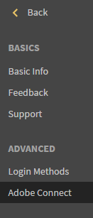
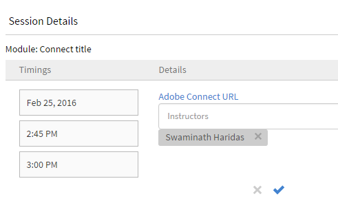

# Adobe Connect 통합

조직 관리자는 Adobe Connect 통합을 사용할 수 있도록 Learning Manager 계정 설정을 구성할 수 있습니다.

## Adobe Connect 구성 {#configureadobeconnect}

1. 관리자 로그인의 왼쪽 창에서 **[!UICONTROL &#39;설정&#39;]**&#x200B;을 클릭하여 회사 기본 정보를 봅니다. 왼쪽 창에서 **[!UICONTROL Adobe Connect]**&#x200B;을 클릭합니다.

   

   *왼쪽 창에서 Adobe Connect 선택*

1. **[!UICONTROL Adobe Connect 구성]** 섹션에서 **[!UICONTROL 지금 구성]** 링크를 클릭합니다.

   <!---->

1. 회사의 Adobe Connect 도메인 이름과 로그인 자격 증명을 제공합니다.

   

   *도메인 이름 및 자격 증명 추가*

   Adobe Connect URL 샘플: mycompany.adobeconnect.com\
   Adobe Connect 계정 책임자의 전자 메일 ID를 제공해야 합니다.

   Learning Manager에서는 Adobe에서 호스팅된 연결 계정만 지원됩니다. 예: &#39;.adobeconnect.com&#39;.

1. **[!UICONTROL 통합].**&#x200B;을 클릭합니다.

   전자 메일 ID를 인증한 후 Connect가 성공적으로 통합되면 Learning Manager에 메시지가 표시됩니다. Adobe Connect를 사용하여 가상 강의실 강의를 자동으로 볼 수 있습니다.

   Adobe Connect 계정 책임자는 Adobe Connect 사용 약관에 동의해야 합니다. 이 권한이 수락되지 않으면 로그인 인증이 실패할 수 있습니다. Adobe Connect 계정을 생성한 후 계정에 한 번 로그인합니다. 처음 로그인하면 약관 페이지가 나타납니다.

   <!---->

## 가상 강의실 세션 정보 추가 {#addvirtualclassroomsessioninformation}

가상 강의실 강의 작성자가 세션 정보를 제공하지 않으면 책임자가 세션 세부 정보를 넣을 수 있습니다.

책임자 로그인 상태에서 VC 강의 이름을 클릭합니다. 왼쪽 창에서 **[!UICONTROL 인스턴스]**&#x200B;를 클릭하고 **[!UICONTROL 세션 세부 정보]**&#x200B;를 클릭합니다.  세션 정보를 추가하려면 세션 세부 정보 페이지의 오른쪽 모서리에 있는 편집 아이콘을 클릭합니다.

*가상 강의실 세션 정보 추가*

가상 강의실 모듈 또는 세션을 생성하기 위한 Adobe Learning Manager와 Adobe Connect의 통합으로, Connect 계정은 사용 사례에 적합한 수의 회의실과 동시 사용자를 지원해야 합니다. 이러한 회의실은 Learning Manager 가상 강의실 모듈을 호스팅하는 데 사용됩니다. Learning Manager의 각 가상 강의실 모듈이나 세션은 새로운 연결 미팅룸을 동적으로 만듭니다.

Adobe Learning Manager와 별도로 Adobe Connect를 구입해야 합니다.

## 학습자 출결사항 {#learnersattendance}

가상 강의실 강의 호스트가 세션에 참석하지 않으면 세션에 참석한 학습자의 출결이 자동으로 등록되지 않습니다. 이러한 시나리오에서 관리자는 출석을 수동으로 기록할 수 있습니다.

가상 교실 강좌를 클릭하고 다음 페이지의 왼쪽 창에서 &#39;출석&#39;을 클릭하여 출석을 기록합니다.

## 대규모 참가자와 Adobe Connect 세미나 지원

Adobe Learning Manager은 Connect에서 가상 강의실 세션을 설정하는 동안 Adobe Connect에서 세미나실 선택을 지원합니다. 이전에는 책임자가 회의실 유형만 선택할 수 있었습니다. 이 기능을 사용하면 유효한 세미나 라이선스를 보유한 책임자가 ALM 내에서 일회성 또는 대규모 이벤트(최대 1,500명 참석자)를 예약하고 관리할 수 있습니다.

세미나 방에 대한 자세한 내용은 이 [문서](https://helpx.adobe.com/adobe-connect/using/creating-seminars.html)를 참조하세요.

### 세션 분석에 대한 액세스 지원

강사는 세션 대시보드에 제공된 새 링크를 통해 완료된 Adobe Connect 세션에 대한 세션 분석에 액세스할 수 있습니다.

_세션 URL 선택_

이 링크는 Connect에서 세션 분석 대시보드를 열어 세션 참여에 대한 자세한 인사이트를 제공합니다.
이 기능은 Adobe Connect을 통해 수행된 세션에서만 사용할 수 있습니다. 세션 분석에는 다음이 포함됩니다.

* **[!UICONTROL 참여]**: 라이브 세션의 전체 성능 개요
* **[!UICONTROL 상호 작용]**: 다른 창에서 참가자 활동의 자세한 분석
* **[!UICONTROL 참석자 활동]**: 참가자 참여 요약
* **[!UICONTROL 보고서 다운로드]**: 팟별 참여 데이터에 대한 보고서를 다운로드하는 옵션

_세션 대시보드_

세션 분석에 대한 자세한 내용은 이 [문서](https://helpx.adobe.com/in/adobe-connect/using/session-dashboard.html)를 참조하십시오.
