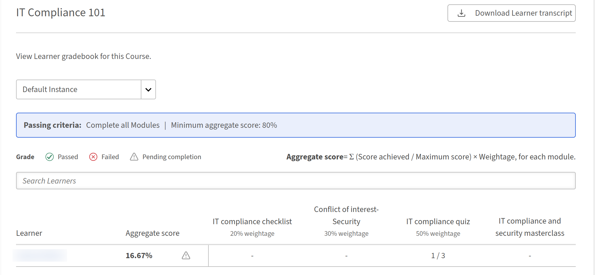

# 계정에 그레이드북 가시성 활성화

## 개요

작성자가 강의에서 학습자에게 그레이드북을 표시하려면 먼저 책임자가 계정 수준에서 그레이드북 가시성 설정을 활성화해야 합니다. 이 설정은 마스터 전환 역할을 합니다. 이 설정이 해제되면 학습자는 개별 강의가 구성된 방식과 관계없이 모든 강의에서 그레이드북을 볼 수 없습니다.

## 이 설정이 제어하는 항목

**설정** > **일반**&#x200B;의 **성적 증명서 표시 여부** 설정은 작성자가 강의 수준에서 학습자에게 성적 증명서를 노출하는 것이 허용되는지 여부를 결정합니다.

자세한 내용은 [Gradebook 가시성](/help/migrated/administrators/feature-summary/settings/basic-settings.md#gradebookvisibility)을 참조하세요.

| 상태 설정 | 효과 |
| --- | --- |
| 활성화됨 | 작성자는 강의 편집기에서 **학습자에게 그레이드북 표시** 옵션을 사용하여 강의별 그레이드북 가시성을 제어할 수 있습니다. 학습자는 작성자가 활성화한 강의에서 **성적 증명서** 탭을 볼 수 있습니다. |
| 비활성화됨 | 학습자는 어떤 강의에서도 성적 증명서를 볼 수 없습니다. 비활성화하면 강의 구성에 학습자에게 성적 증명서를 표시하는 설정이 없습니다. |

이는 계정 수준 설정과 강의 수준 설정이 함께 작동함을 의미합니다. 학습자가 성적 증명서를 보려면 둘 다 활성화해야 합니다.

## 그레이드북 가시성 활성화

1. 관리자 권한으로 Adobe Learning Manager에 로그인합니다.
2. 왼쪽 탐색에서 **설정**&#x200B;을 선택합니다.
3. **일반**&#x200B;을 선택합니다.
4. **Gradebook 표시 여부** 섹션으로 스크롤합니다.
5. **학습자용 성적 증명서 보기 활성화** 확인란을 선택합니다.

   

이제 작성자는 강의별로 성적 증명서 가시성을 구성할 수 있습니다.

## 작성자 워크플로우에 미치는 영향

이 계정 수준 설정을 사용하면 강의 편집기에서 **학습자에게 성적 증명서 표시** 토글을 사용할 수 있습니다. 작성자는 이 토글을 사용하여 수강별로 학습자가 **학습자 성적 증명서** 탭을 볼 수 있는지 여부를 결정합니다.

이 계정 수준 설정이 비활성화되면:

* 강의 편집기에서 **학습자에게 성적 증명서 표시** 토글이 계속 표시될 수 있지만 강의 수준 구성은 무시됩니다. 학습자에게 성적 증명서가 표시되지 않습니다.
* 성적 증명서 점수 및 가중 계산은 관리자 보고 목적으로 백그라운드에서 계속 실행됩니다.
* 책임자 및 사용자 정의 책임자는 학습자 성적 증명서 데이터가 포함된 학습자 성적 증명서를 다운로드할 수 있습니다.

>[!NOTE]
>
>계정 수준에서 이 설정을 비활성화해도 그레이드북 구성 또는 점수는 삭제되지 않습니다. 다시 활성화하면 이전에 구성한 모든 강의 레벨 그레이드북 설정이 즉시 복원됩니다.

## 두 설정이 상호 작용하는 방법

| 계정 수준 설정 | 강의 레벨 설정 | 학습자가 보는 내용 |
| --- | --- | --- |
| 활성화됨 | 학습자에게 성적 증명서 표시: **켬** | 강의 플레이어에 **성적 증명서** 탭이 표시됩니다. |
| 활성화됨 | 학습자에게 성적 증명서 표시: **해제** | Gradebook 탭이 없습니다. 점수는 내부적으로만 계산됩니다. |

## 성적 증명서 점수 보기 및 보고

Adobe Learning Manager의 관리자는 강의에 등록된 모든 학습자에 대한 가중 성적 증명서 점수를 보고, 모듈별로 개별 학습자 성능으로 드릴인하고, 필터링된 학습자 성적 증명서를 다운로드하고, 콘텐츠 감사 추적 보고서에서 성적 증명서 구성 변경 사항을 추적할 수 있습니다.

## 강의에 대한 성적 증명서 보기

강의에 대해 그레이드북이 활성화되면 강의를 열 때 **보고서** 아래의 왼쪽 탐색에 새로운 **L2 피드백 - 그레이드북** 섹션이 나타납니다.

* 관리자 권한으로 Adobe Learning Manager에 로그인합니다.
* 왼쪽 탐색에서 **과정**&#x200B;을 선택하고 검토할 과정을 엽니다.
* 강의 탐색의 **보고서**&#x200B;에서 **L2 피드백 - 성적 증명서**&#x200B;를 선택합니다. **활성 피드백 성과표** 페이지가 열립니다.

  

다음 항목이 표시됩니다.

1. 강의의 합격 기준(필요한 최소 모듈 및 최소 합계 점수)
2. 등급별로 학습자를 보기 위한 필터 행: **합격**, **불합격** 또는 **완료 보류 중**
3. 합산 점수 공식: 각 모듈에 대한 합산 점수 = Σ(최대 점수÷ 달성된 점수) × 가중치
4. 각 학습자의 **집계 점수** 및 점수를 매길 수 있는 각 모듈에 대한 점수를 보여 주는 학습자 목록
5. 강의에 여러 인스턴스가 있는 경우 강의 인스턴스 간에 전환하는 인스턴스 드롭다운

점수화된 모듈을 아직 시도하지 않은 학습자는 점수 열에 대시를 표시합니다. 점수, PDF, 비디오, 오디오 및 이와 유사한 기능을 지원하지 않는 모듈은 점수 열로 표시되지 않습니다.

## 개별 학습자 점수 보기

**활성 피드백 성적 증명서**&#x200B;에서 학습자의 이름을 선택합니다.

개별 학습자 보기에는 다음이 표시됩니다.

1. 학습자 이름, 전자 메일 및 상태(**완료 보류 중**, **합격** 또는 **실패**)
2. 학습자가 완료한 총 점수 및 필수 모듈 수
3. 모듈 이름, 유형, 필수 여부, 상태, 가중치, 달성한 점수 및 집계에 대한 기여도를 보여 주는 모듈 테이블

모듈 테이블에는 점수를 매길 수 있는 모듈과 점수를 매길 수 없는 모듈이 모두 포함됩니다. 점수를 매길 수 있는 모듈은 해당 점수와 기여도를 표시합니다. 점수를 매길 수 없는 모듈은 [점수] 및 [기여도] 열에 대시를 표시합니다.

## 점수 모듈

책임자 및 강사에 대한 점수 매기기 동작이 현재 워크플로우에서 변경되지 않습니다.

* 기본 콘텐츠가 점수를 보고하면 **SCORM, AICC, xAPI 및 기본 퀴즈 모듈**&#x200B;이 자동으로 점수를 매깁니다.
* **강의실 세션, 가상 강의실 세션 및 활동 모듈**&#x200B;은 강사 또는 관리자가 **출석 및 점수** 페이지에서 채점합니다.

## 강의의 학습자 성적 증명서 다운로드

다음 두 가지 방법 중 하나를 통해 성적 증명서 페이지에서 이 강의로 필터링된 학습자 성적 증명서를 직접 다운로드할 수 있습니다.

* **활성 피드백 성적 증명서**&#x200B;에서 페이지의 오른쪽 상단에 있는 **학습자 성적 증명서 다운로드**&#x200B;를 선택합니다.
* 관리자 홈 페이지에서 **보고서**&#x200B;를 선택한 다음 **사용자 지정 보고서**&#x200B;를 선택합니다. 사용 가능한 보고서 목록에서 **학습자 성적 증명서**&#x200B;를 선택합니다.

>[!NOTE]
>
>학습자 성적 증명서(CSV 보고서 및 작업 API)는 강의 레벨에서 그레이드북이 활성화되면 가중치가 열로 추가됩니다.

## 콘텐츠 감사 추적 이벤트

콘텐츠 감사 추적은 두 개의 등급별 구성 이벤트를 캡처합니다.

| **이벤트** | **표시되는 경우** |
|-----------|---------------------|
| **학습자본 업데이트됨** | 작성자가 강의에 대한 그레이드북을 활성화하거나 비활성화하는 경우 |
| **모듈 두께 업데이트됨** | 작성자가 모듈의 가중치 비율을 변경하는 경우 |

자세한 내용은 릴리스에서 변경 사항 보고 를 참조하십시오.

이 항목을 사용하여 누가 성적 증명서 구성을 변경했는지, 특히 여러 작성자가 동일한 강의에서 협업하는 환경에서 언제 변경했는지 추적할 수 있습니다.

## 문제 해결

**L2 피드백 - 성적 증명서 섹션이 강의 탐색에 표시되지 않습니다.**

강의를 생성할 때 강의 작성자가 그레이드북을 활성화해야 합니다. 작성자가 강의 생성을 위해 그레이드북을 활성화했는지 확인합니다. 그레이드북을 사용할 수 있기 전에 강의를 생성한 경우 소급하여 추가할 수 없습니다. 새 강의 버전이 필요합니다.

**완료된 모듈에도 불구하고 학습자의 총 점수는 0입니다**

강의에 가중치 값이 할당된 점수를 매길 수 있는 모듈이 하나 이상 있는지 확인합니다. 학습자가 완료한 모든 모듈(PDF, 비디오, 오디오)이 점수를 매길 수 없는 경우 합산 점수는 계산되지 않습니다. 또한 점수화된 모듈이 아직 **검토 대기 중** 상태가 아닌지 확인합니다. 등급 미달된 모듈은 강사가 점수를 입력하기 전까지는 집계에서 제외됩니다.

**다운로드한 학습자 성적 증명서에 가중치 열이 없습니다**

이 열은 그레이드북이 활성화되어 있고 하나 이상의 모듈에 가중치 값이 저장된 경우에만 나타납니다. 작성자가 그레이드북을 활성화하고 총 100%의 가중치 값을 저장했는지 확인합니다.

**학습자가 모든 필수 모듈을 완료했지만 완료 보류 중으로 표시됩니다**

하나 이상의 모듈이 여전히 강사 또는 관리자의 점수를 기다리는 중일 수 있습니다(**검토 대기 중** 상태). 모든 필수 모듈이 완료와 점수를 모두 기록할 때까지 과정을 완료할 수 없습니다. **출석 및 점수**&#x200B;의 미결 점수를 입력하여 보류 상태를 지웁니다.
