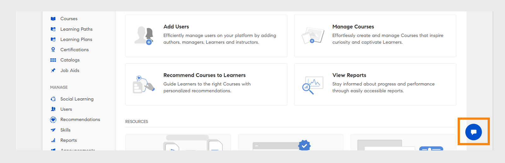

# Adobe Learning Manager의 Admin AI Assistant (Beta)

복잡한 학습 설정에서 책임자는 복잡한 메뉴와 연결이 끊어진 워크플로우 때문에 콘텐츠를 찾거나 작업을 완료하는 데 어려움을 겪을 수 있습니다. 예를 들어 보고서를 실행하거나 특정 정보에 액세스하는 등의 작업에는 여러 화면을 탐색해야 할 수 있습니다. Admin AI Assistant(Beta) 를 사용하면 작업을 효율적으로 이해하고 완료하는 데 적합한 정보를 찾을 수 있습니다.

Adobe Learning Manager의 Admin AI Assistant(Beta) 를 사용하면 책임자가 일반적인 질문에 대한 답변을 빠르게 찾고, 시스템 기능을 탐색하고, 일반 언어로 질문하여 주요 작업을 완료하는 방법을 이해할 수 있습니다. Adobe Learning Manager을 처음 사용하든지, 보다 빠른 문제 해결 방법을 찾고 있다면 Admin AI Assistant(Beta)는 플랫폼에서 직접 컨텍스트 인식 도움말을 제공하여 워크플로우를 간소화합니다.

Adobe의 AI 기능을 사용하여 학습 콘텐츠와 시스템 워크플로우에서 자연어 쿼리를 활성화합니다.  관리자는 **Adobe Learning Manager에 사용자를 추가하는 방법** 또는 **학습 경로를 추가하는 방법**&#x200B;과 같은 질문을 할 수 있습니다. Adobe Learning Manager Admin AI Assistant(Beta)는 **[!UICONTROL Experience League]**&#x200B;에 호스팅된 리소스와 같이 공개적으로 사용 가능한 Adobe 소유 설명서에서만 교육됩니다. 고객 콘텐츠, 내부 교육 자료 또는 사용자 생성 데이터로부터 학습하거나 액세스하지 않습니다.

이 도우미는 수동 탐색에 대한 의존도를 줄이고 검색 시간을 단축하며 실행 가능한 통찰력을 빠르게 표면화하는 데 도움이 됩니다.

<!--## Key benefits

* Perform common administrator tasks faster with conversational guidance.
* Get instant answers without browsing through extensive menus.
* Gain real-time insights and step-by-step guidance for administrative workflows.-->

>[!IMPORTANT]
>
>이 옵션은 관리자만 사용할 수 있으며 현재 영어만 지원합니다.

## 개인정보 보호, 보안 및 거버넌스

Admin AI Assistant(Beta)는 보안 및 데이터 개인정보 보호를 위해 설계되었습니다. 기대 가능한 사항은 다음과 같습니다.

* Admin AI Assistant(Beta)는 교육 목적을 포함하여 개인 데이터를 사용하지 않습니다.
* Adobe Learning Manager에 저장된 학습 데이터 또는 콘텐츠에 대한 액세스 권한이 없습니다.
* Admin AI Assistant(Beta)는 개인 식별 정보(PII)에 액세스하거나 공유하지 않으며 비공개 정보 또는 민감한 정보를 공유하지 않습니다.
* 사용자가 제공한 프롬프트(예: 질문 또는 쿼리)는 다른 고객과 공유되지 않습니다.

>[!IMPORTANT]
>
>Admin AI Assistant(Beta)는 고객이 2주 동안 사전 알림을 받는 단계로 출시됩니다. 지원이 필요한 경우 고객 성공 관리자(CSM)에게 문의하십시오.

## Admin AI Assistant(Beta)에 액세스하는 방법

Admin AI Assistant(Beta)를 실행하려면 다음 단계를 따르십시오.

1. 관리자로 로그인합니다.
2. 채팅 아이콘을 선택하여 Admin AI Assistant(Beta)를 실행합니다.

   
   _채팅 풍선을 선택하여 Admin AI Assistant(Beta)를 실행합니다._

   >[!NOTE]
   >
   >Admin AI Assistant(Beta)를 처음 실행할 때는 사용 전에 동의해야 합니다. 동의 대화 상자는 최초 실행 중에만 표시됩니다. 이후 모든 실행의 경우 Admin AI Assistant(Beta)로 직접 이동하여 프롬프트를 입력합니다.

3. **[!UICONTROL 시작하기]**&#x200B;를 선택합니다. 이제 Admin AI Assistant(Beta)를 사용할 준비가 되었습니다.

   
   _처음 사용하기 전에 사용 정책을 수락하라는 메시지 표시_

## Admin AI Assistant(Beta) 사용 방법

Admin AI Assistant(Beta)를 사용하려면

1. 프롬프트를 입력하고 **[!UICONTROL Enter]**&#x200B;을(를) 누릅니다. 응답이 Admin AI Assistant(Beta)에 나타납니다.

   
   _Admin AI Assistant(Beta)의 샘플 쿼리 및 응답_

### 프롬프트 예

다음은 관리자가 Admin AI Assistant(Beta)를 효과적으로 활용하는 데 사용할 수 있는 몇 가지 프롬프트 예시입니다.

* **사용자에게 강의 할당**
   * **프롬프트**: &quot;사용자에게 강의를 할당하려면 어떻게 해야 합니까?&quot;

  
  _사용자에게 강의를 할당하려면 어떻게 해야 합니까?_ 프롬프트에 대한 응답

* **최신 등록 보고서**
   * **확인**: 최신 등록 보고서를 표시합니다.

  
  _최신 등록 보고서 표시 프롬프트에 대한 응답_

* **사용자 삭제**
   * **프롬프트**: &quot;사용자를 삭제하려면 어떻게 해야 합니까?&quot;

  
  _사용자를 삭제하는 방법에 대한 응답_

### Admin AI Assistant(Beta)를 효과적으로 사용하기 위한 팁

* **프롬프트에 대해 자세히 알아보기**: 질문을 할 때는 명확한 컨텍스트와 세부 사항을 포함하세요. 예를 들어 &quot;Adobe Learning Manager에서 사용자를 추가하려면 어떻게 합니까?&quot;라고 묻는 대신 &quot;Adobe Learning Manager에서 사용자에게 강의를 할당하려면 어떻게 해야 합니까?&quot;라고 묻습니다.
* **명확하고 간결한 언어 사용**: 질문을 간단하고 집중되게 유지하세요. 이를 통해 Admin AI Assistant(Beta)가 의도를 이해하고 보다 정확한 응답을 제공하는 데 도움이 됩니다.
* **다양한 기능 살펴보기**: 등록 보고서, 학습자 진행률, 콘텐츠 할당 또는 인증 추적과 같은 다양한 기능에 대해 질문하여 사용 가능한 전체 지원 범위를 살펴보십시오.
* **피드백 제공**: 응답을 받은 후 유용했는지 알려 주세요. 엄지손가락 위로, 엄지손가락 아래로, 보고서 또는 주석 기능을 사용하여 피드백을 공유하세요. 피드백은 길잡이를 개선하는 데 중요한 역할을 합니다.

## Admin AI Assistant(Beta) 응답에 대한 피드백 제공

Admin AI Assistant(Beta)에서 생성한 응답에 대한 피드백은 정확성, 관련성 및 전체 성능을 개선하는 데 도움이 됩니다.

### 응답 좋아요 또는 싫어요

* 응답이 유용하고 정확하면 **[!UICONTROL 엄지손가락 위로]**&#x200B;를 선택합니다.
* 응답이 잘못되었거나 도움이 되지 않으면 **[!UICONTROL 아래로]**&#x200B;를 선택합니다.

### 응답 플래그 지정

응답에 플래그를 지정하려면 다음 단계를 따르십시오.

1. 응답 끝에 **[!UICONTROL 플래그]**&#x200B;를 선택합니다.

   
   _Admin AI Assistant 화면에서 보고서 선택_

2. 이유를 하나 이상 선택하고 필요한 경우 댓글을 추가한 다음 **[!UICONTROL 제출]**&#x200B;을 선택하세요.

   
   _책임자는 선택적 댓글로 엄지손가락을 올리거나 내리면서 응답을 평가합니다_

Adobe은 이 피드백을 사용하여 시간이 지남에 따라 Admin AI Assistant(Beta)를 개선합니다.

## 자주 묻는 질문

+++Admin AI Assistant(Beta)를 학습자로 사용할 수 있습니까?

아니요. 이 도우미는 관리자만 사용할 수 있습니다.

+++

+++모바일 앱에서 사용할 수 있습니까?

지금은 사용할 수 없습니다.

+++

+++관리자 작업을 수행할 수 있습니까?

아니요. Admin AI Assistant(Beta)는 지침만 제공합니다.

+++

+++더 많은 언어를 지원합니까?

Adobe Learning Manager 팀은 향후 업데이트를 위해 다국어 지원을 평가하고 있습니다.

+++
