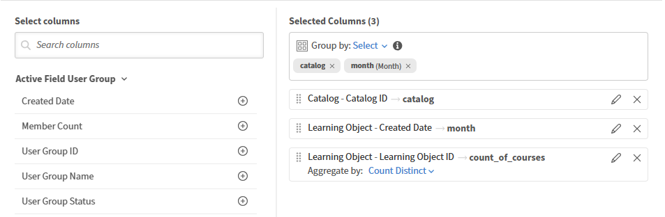
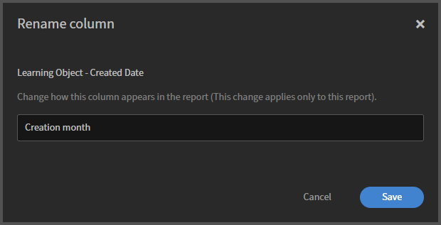

# Report Builder 템플릿 시작하기

템플릿은 Adobe Learning Manager에서 제공하는 바로 사용할 수 있는 보고서 구성입니다. 각 템플릿은 등록 및 완료 추적, 규정 준수 보고 또는 강사 성과와 같은 특정 사용 사례용으로 설계되었습니다. 템플릿을 직접 다운로드하거나 복제하여 편집 가능한 사본을 만들 수 있습니다.

1. 관리자 권한으로 Adobe Learning Manager에 로그인합니다.
2. 왼쪽 창에서 **보고서**&#x200B;를 선택한 다음 **Report Builder**&#x200B;를 선택합니다.
3. **템플릿** 탭을 선택합니다.
4. 사용 가능한 템플릿을 검색합니다. 각 템플릿의 이름은 사용 사례에 따라 지정됩니다.
   
5. 템플릿 이름을 선택하여 읽기 전용 미리 보기를 엽니다. 이 예시의 경우 Catalog Wise - Course Count MoM 템플릿 근처에 있는 복제 를 선택합니다. 열, 적용된 필터 및 정렬 순서를 검토합니다. 템플릿을 복제하면 Report Builder은 템플릿의 기존 구성이 미리 로드된 편집 가능한 사본을 엽니다. 보고서 이름, 설명, 열, 필터 및 정렬은 모두 저장하기 전에 편집할 수 있습니다.

## 보고서 이름 및 설명

1. **이름** 필드에서 기본 이름(예: _Copy of Catalog Wise_ - _Course Count Mo_)을 보고서에 대한 고유한 이름으로 바꿉니다. 이름을 입력해야 합니다.
2. **설명** 필드에 보고서에 포함된 내용에 대한 간단한 요약을 입력합니다. 이는 다른 관리자가 보고서를 보거나 편집할 때 보고서의 목적을 이해하는 데 도움이 됩니다.

## 열 추가 및 구성

**열** 섹션에는 두 개의 패널이 있습니다. 왼쪽에는 **열 선택**&#x200B;이 있고 오른쪽에는 **선택한 열**&#x200B;이 있습니다.

### 열 추가

1. **열 선택** 패널에서 이름을 선택하여 데이터 집합을 확장합니다. 예를 들면 **카탈로그** 또는 **활성 필드 사용자 그룹**&#x200B;입니다.
2. 추가하려는 열 옆의 **+** 아이콘을 선택합니다. 열은 오른쪽의 **선택한 열** 패널에 나타납니다.
   
3. 동일한 열을 두 번 이상 추가합니다. 예를 들어 동일한 필드에 두 개의 서로 다른 집계를 적용할 수 있습니다. 해당 열에 대해 **+**&#x200B;을(를) 다시 선택합니다.

### 열 순서 바꾸기

**선택한 열** 패널에서 열 행의 왼쪽에 있는 핸들을 드래그하여 다른 위치로 이동합니다. 패널의 열 순서는 다운로드한 보고서의 열 순서와 일치합니다.

### 열 이름 바꾸기

1. 열 행에서 **편집**(연필) 아이콘을 선택합니다.
   
2. 별칭을 입력합니다. 별칭은 기본 필드 이름 대신 다운로드한 보고서의 열 머리글로 나타납니다.
   

### 열 제거

열 행에서 **×** 아이콘을 선택하여 보고서에서 제거합니다.

## 그룹 적용 기준

**Group by** 컨트롤은 **선택한 열** 패널 위쪽에 나타납니다.

1. **그룹화 기준: 선택**&#x200B;을 선택합니다.
   
2. 그룹화할 열을 선택합니다. 두 개 이상을 선택할 수 있습니다. 스크린샷에서는 보고서가 _카탈로그_ 및 _작성 달_&#x200B;별로 그룹화됩니다.
3. 선택한 각 [그룹화 기준] 열은 [그룹화 기준] 컨트롤 아래에 태그로 나타납니다. 그룹화 기준 열을 제거하려면 태그에서 **×**&#x200B;을(를) 선택합니다.

>[!NOTE]
>
>group by를 적용하면 group-by 열이 아닌 모든 열에는 집계 함수가 적용되어야 합니다. 집계가 없는 열에는 오류가 발생합니다.

## 열에 집계 적용

1. **선택한 열** 패널의 그룹별 열이 아닌 열에서 **집계자**&#x200B;를 선택합니다.
2. 드롭다운에서 함수를 선택합니다. 스크린샷에서 **학습 개체** - **학습 개체 ID**&#x200B;는 count_of_course로 별칭이 지정된 **Count Distinct**&#x200B;를 사용합니다.

사용 가능한 집계 함수:

| 함수 | 반환 내용 |
|----------|-----------------|
| 계수 | 그룹의 총 행 수 |
| 고유값 개수 | 그룹의 고유 값 수 |
| 조건부 개수 | 지정한 값과 일치하는 행 수 |
| 합 | 그룹 전체의 총 숫자 필드 |
| 분 | 그룹의 가장 낮은 값 |
| 최대 | 그룹의 가장 큰 값 |
| 평균 | 그룹 전체의 평균 값 |

## 필터 적용

**필터** 섹션은 **열** 섹션 아래에 있습니다. 필터는 보고서에 표시할 행을 제한합니다.

1. 필터를 추가하려면 [필터] 섹션의 오른쪽에 있는 **+** 아이콘을 선택합니다.
2. 필터링할 필드를 선택합니다.
   
3. 연산자를 선택하고 값을 입력하거나 선택합니다.

기존 필터를 편집하려면 필터 행에서 **연필** 아이콘을 선택합니다. 중첩된 필터 그룹을 추가하려면 필터 행의 오른쪽에 있는 괄호가 있는 + 아이콘을 선택합니다.

## 정렬 구성

정렬 섹션은 필터 섹션 아래에 있습니다.

1. **+ 정렬 추가**&#x200B;를 선택하여 정렬을 추가합니다.
2. 정렬할 열을 선택하고 **오름차순** 또는 **내림차순**&#x200B;을 선택합니다.
   
3. 2차 정렬을 추가하려면 이 단계를 반복합니다. 각 정렬 행의 왼쪽에 있는 핸들을 드래그하여 우선 순위를 변경합니다.

>[!TIP]
>
>항상 한 가지 이상의 정렬을 적용합니다. 정렬하지 않으면 동일한 보고서의 다운로드 간에 행 순서가 다를 수 있습니다.

## 보고서 저장

오른쪽 상단에서 **보고서 저장**&#x200B;을 선택합니다. 보고서가 **보고서** 탭에 저장되었으며 다운로드할 준비가 되었습니다.

## 모범 사례

* 다운로드한 보고서에 필드 이름 대신 _학습 개체_ - _학습 개체 ID_&#x200B;와 같은 의미 있는 머리글이 있도록 모든 열에 별칭을 사용합니다.
* 총 행이 아닌 카탈로그별로 고유한 강의를 원하는 경우, [개수] 대신 [개수 구분]을 사용하십시오.
* 저장하기 전에 정렬을 적용합니다. 특히 공유하거나 구독할 보고서의 경우 더욱 그렇습니다.
* 설명을 최신 상태로 유지합니다. 다른 관리자는 보고서를 열지 않고도 보고서의 범위를 이해하기 위해 보고서에 의존합니다.
