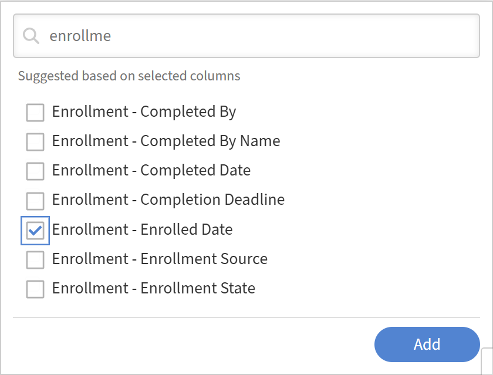

# Report Builder에서 추세 보고서 작성

추세 보고서는 강의 수, 등록 수 또는 완료 수와 같은 메트릭이 시간에 따라 어떻게 변경되는지 보여 줍니다. 날짜 열 및 추세 세분성(일, 주 또는 월)을 선택하고 Report Builder이 해당 기간별로 데이터를 그룹화합니다.

## 추세 데이터의 의미

Report Builder의 추세 보고서는 **날짜별로 그룹화된 데이터의 현재 스냅숏**&#x200B;을 반영합니다. 각 과거 날짜의 데이터 기록 상태를 표시하지 않습니다.

예를 들어 월별 등록 추세는 현재 존재하는 등록 수를 해당 등록 수가 생성된 달에 걸쳐 분산하여 표시합니다. 1월 이후에 등록한 학습자가 등록 취소되면 해당 등록 기록이 더 이상 나타나지 않을 수 있습니다. 이 보고서는 1월에 있었던 것이 아닌 현재 기록 상태를 반영하고 있다.

이는 감사 목적상 중요한 구별이 된다. 시점 기록 데이터가 필요한 경우 정확한 기록 대신 이 보고서를 사용하여 방향 추세 분석을 수행할 수 있습니다.

## 강의 수 추세 보고서 작성

이 보고서는 전월 대비 계정에 추가된 강의의 수를 보여줍니다.

1. **보고서** > **Report Builder**&#x200B;을 선택한 다음 **보고서** 탭을 선택합니다.
2. **보고서 만들기**&#x200B;를 선택합니다. 강의 수(월 단위)와 같은 이름을 입력합니다.
3. **학습 개체** 데이터 집합에서 **학습 개체 ID**&#x200B;를 추가합니다.
4. **학습 개체** 데이터 집합에서 **만든 날짜**&#x200B;를 추가합니다.
   
5. **만든 날짜**&#x200B;에 **그룹화 기준**&#x200B;을 적용합니다. 추세 세분성을 **월**&#x200B;로 설정합니다.
   
6. **학습 개체 ID**&#x200B;에 **Count**&#x200B;을(를) 적용합니다. 별칭 강의 수를 입력합니다.
   
7. **만든 날짜** 오름차순으로 정렬하여 추세를 시간순으로 표시합니다.
   
8. **보고서 저장**&#x200B;을 선택하고 **작업** > **다운로드**&#x200B;를 선택하여 보고서를 다운로드합니다.

다운로드한 파일은 강의 생성 활동의 월별 트렌드로 구성되어 있으며, 시간에 따라 생성된 강의 수를 표시합니다. 이를 통해 강의 제작 패턴, 피크, 감소 및 전반적인 콘텐츠 증가를 추적할 수 있습니다.

## 카탈로그별 완료 추세 보고서 작성

이 보고서는 정의된 기간 동안 카탈로그당 월별 완료 합계를 표시합니다.

1. **보고서** > **Report Builder**&#x200B;을 선택한 다음 **보고서** 탭을 선택합니다.
2. **보고서 만들기**&#x200B;를 선택합니다. 카탈로그 완료 MoM과 같은 이름을 입력합니다.
3. **카탈로그** 데이터 집합에서 **카탈로그 이름**&#x200B;을(를) 추가합니다.
4. **모듈 대본** 데이터 집합에서 **완료 날짜**&#x200B;를 추가합니다.
5. **학습 개체** 데이터 집합에서 **학습 개체 ID**&#x200B;를 추가하여 완료 수를 계산합니다.
6. **카탈로그 이름**&#x200B;에 **그룹화 기준**&#x200B;을 적용하세요. 또한 **월** 단위로 **완료일**&#x200B;에 **그룹화 기준**&#x200B;을 적용합니다.
   
7. **학습 개체 ID**&#x200B;에 **Count**&#x200B;을(를) 적용합니다. 총 완료라는 별칭을 입력합니다.
8. 필터 추가: **카탈로그**&#x200B;가 안전, POS, 배달(또는 계정과 관련된 카탈로그)에 있습니다.
9. 필터 추가: **완료 날짜**&#x200B;는 작년 이내입니다.
   
10. **완료 날짜** 오름차순으로 정렬합니다.
    
11. **보고서 저장**&#x200B;을 선택하고 **작업** > **다운로드**&#x200B;를 선택하여 보고서를 다운로드합니다.

## 모범 사례

* 완료 추세는 **완료 날짜**&#x200B;를 사용하고, 등록 추세는 **등록 날짜**&#x200B;를 사용하세요. 잘못된 날짜 필드를 사용하면 잘못된 결과가 나올 수 있습니다.
* 날짜 필터를 추가하여 월별 추세의 경우 최근 12개월, 주별 추세의 경우 최근 8주 등 추세를 의미 있는 기간으로 제한합니다.
* 추세 보고서에 세분성과 날짜 범위를 이름으로 지정합니다(예: &quot;카탈로그 완료 월 - 최근 3개월&quot;). 나중에 볼 때 명확해집니다.
