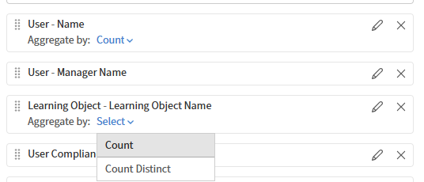

# Report Builder으로 강사 성과 검토

이 보고서는 교육 관리자가 가장 활발하게 활동하는 강사, 도달하는 학습자 수, 전달하는 강의를 완료하는 학습자 수를 확인하는 데 도움이 됩니다.

## 강사 효율성 보고서 작성

1. Report Builder을 시작하고 **보고서 만들기**&#x200B;를 선택합니다.
2. _강사 효율성_&#x200B;과 같은 이름을 입력하십시오.
3. **모듈 세션** 데이터 집합에서 **강사 이름**&#x200B;을 추가합니다.
4. **모듈 세션** 데이터 집합에서 **모듈 세션 ID**&#x200B;을(를) 추가합니다. 세션 수를 계산하기 위해 이 정보를 취합합니다.
5. **모듈 대본** 데이터 집합에서 **상태**&#x200B;를 추가합니다. 완료 수를 세는 경우 개수를 사용합니다.
6. **강사 이름**&#x200B;에서 **그룹화 기준**&#x200B;을 선택합니다.
7. **Count**&#x200B;을(를) **모듈 세션 ID**&#x200B;에 적용합니다. 별칭 _총 세션_&#x200B;을 입력합니다.
8. **Count if**&#x200B;을(를) **상태**&#x200B;에 적용하고 **완료**&#x200B;를 선택합니다. 별칭 _총 완성_&#x200B;을 입력합니다.
9. 총 등록을 표시하려면 **상태**&#x200B;를 다시 추가하세요. **시작되지 않음**&#x200B;에 **Count if**&#x200B;을(를) 적용합니다. _총 등록 수_ 별칭을 입력합니다.
   
10. **강사 이름**&#x200B;을(를) 비워 둘 수 없습니다.
    
11. **전체 완료**&#x200B;를 기준으로 정렬하면 가장 성과가 높은 강사가 먼저 표시됩니다.
    
12. 보고서 저장을 선택하고 **작업** > **다운로드**&#x200B;를 선택하여 보고서를 다운로드합니다.

다운로드된 보고서는 각 강사의 총 교육 세션, 학습자 완료 및 미시작 등록을 비교하여 강사 효율성을 요약하며 참여, 완료 성과 및 잠재적인 교육 후속 요구 사항을 평가하는 데 도움이 됩니다.

## 모범 사례

* 카탈로그 레이블을 사용하여 특정 사업부, 위치 또는 프로그램에 강사 보고서의 범위를 지정합니다. 이는 카탈로그 이름만으로 필터링하는 것보다 더 정확합니다.
* 지난 90일 동안 **등록 날짜**&#x200B;와 같은 날짜 필터를 추가하여 보고서가 항상 데이터가 아닌 최근 기간으로 범위를 지정합니다.
* 강사 이름이 아닌 **총 완료 수**&#x200B;와 같은 의미 있는 메트릭을 기준으로 정렬하면 성능 차이가 즉시 표시됩니다.
