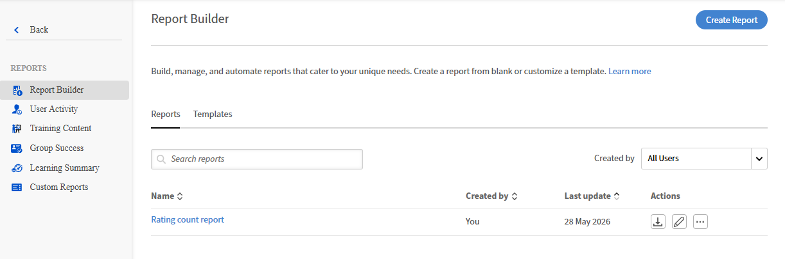

# Adobe Learning Manager의 Report Builder

## 개요

도구를 사용한 후처리 없이 선택한 열, 필터 및 데이터로 사용자 정의 보고서를 빌드하고, 미리 보고, 다운로드할 수 있습니다.

Adobe Learning Manager의 Report Builder을 통해 관리자는 필요한 보고서를 정확하게 작성할 수 있는 셀프 서비스 보고 캔버스를 이용할 수 있습니다. 고정된 보고서를 다운로드하고 스프레드시트 도구에서 모양을 변경하는 대신 원하는 열을 선택하고, 필터를 적용하고, 깨끗한 출력을 모두 한 곳에서 다운로드할 수 있습니다.

## Report Builder이 도입된 이유

Adobe Learning Manager의 기존 보고서 수정 각 보고서에는 변경할 수 없는 열 목록이 설정되어 있으며 필터링 옵션은 제한됩니다. 사용자 정의 출력이 필요한 관리자는 여러 보고서를 다운로드하고, Excel에 가입하고, 수동으로 필터를 적용하고, 매주 또는 매달 이 프로세스를 반복해야 했습니다.

Report Builder이 해당 주기를 제거합니다. 보고서를 한 번 구성하고, 저장하고, 필요할 때마다 새로운 데이터를 다운로드하므로 원하는 모양을 변경할 필요가 없습니다.

Report Builder이 해결할 수 있는 세 가지 구체적인 문제:

* **고정된 열:** 기존 보고서에는 필요하지 않은 열이 많이 포함되어 있고 제외됩니다. Report Builder을 사용하면 사용 사례와 관련된 필드만 선택할 수 있습니다.
* **제한된 필터링:** 이제 지원되는 모든 필드를 필터링할 수 있습니다. 예를 들어, 등록 날짜, 완료 날짜, 활성 필드 및 카탈로그 레이블은 상태뿐만 아니라

* **일관성 없는 데이터 원본:** UI, 작업 API 또는 커넥터에서 기존 보고서를 가져올 수 있습니다. 이 보고서는 타이밍에 따라 약간 다른 데이터를 반환할 수 있습니다. Report Builder은 일관성 있는 단일 데이터 소스에서 가져오므로 모든 다운로드가 동일한 기본 데이터를 반영합니다.

## 기존 보고서와 Report Builder이 일치하는 방식

Report Builder이 Adobe Learning Manager에서 기존의 고정된 보고서를 바꾸지 않습니다. 두 가지 모두 가능합니다. 이미 사용하는 표준 출력에 대해 기존 보고서를 사용합니다. 사용자 정의 열, 특정 필터 또는 현재 후처리가 필요한 데이터가 필요한 경우 Report Builder을 사용합니다.

## Report Builder 찾기

Report Builder은 책임자 홈페이지에서 확인할 수 있습니다. **보고서**&#x200B;를 선택한 다음 **Report Builder**&#x200B;를 선택합니다. 두 개의 탭(**템플릿** 및 **보고서**)이 표시됩니다.

## Report Builder 사용 가능 대상

관리자는 Report Builder을 사용할 수 있습니다.

>[!NOTE]
>
>계정에 대해 Report Builder을 활성화해야 합니다. 관리자 보기에 표시되지 않으면 Adobe 계정 팀 또는 CSM에 문의하십시오.

## 모범 사례

* 템플릿을 처음 사용하는 경우 Report Builder으로 시작합니다. 템플릿은 가장 일반적인 사용 사례에 맞게 미리 작성되어 즉시 작동합니다.
* 다운로드하기 전에 구성된 모든 보고서를 저장합니다. 저장된 보고서는 나중에 다시 구성하지 않고 다운로드할 수 있습니다.
