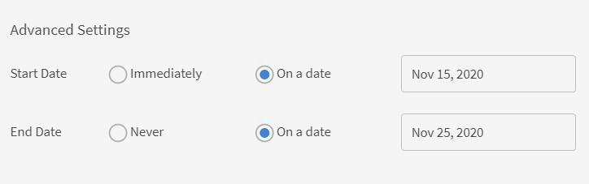

# 공지

책임자가 정의한 사용자 그룹에 멀티미디어 메시지(텍스트, 이미지 또는 비디오)로 공지사항을 보낼 수 있습니다.

책임자는 학습자에게 이벤트 또는 활동 발생을 알리는 공지를 브로드캐스트할 수 있습니다. 공지는 텍스트, 이미지 또는 비디오의 조합일 수 있습니다. 강의, 학습 프로그램 및 인증과 같은 학습 객체를 공지사항에 연결할 수 있습니다.

공지는 다음 네 가지 유형으로 구분할 수 있습니다.

* 알림
* 발행인란
* 추천
* 이메일

## 알림 {#notification}

1. 관리자 권한으로 왼쪽 창의 공지 를 클릭합니다.
1. 페이지 오른쪽 상단 모서리에 있는 &#39;추가&#39;를 클릭합니다.
1. 유형 드롭다운 목록에서 **알림으로** 옵션을 선택합니다.
1. 메시지 필드에서 공지사항을 추가합니다. 공지사항에 URL을 추가할 수도 있습니다. 그러나, HTML 형식으로 URL을 추가해야 합니다.

   예를 들면 다음과 같습니다.  `code <a href="http://www.w3schools.com" target="_blank">Visit W3Schools</a>.`

   대상을 공백으로 지정하면 사용자가 알림 URL을 눌렀을 때 링크가 새 탭에서 열립니다. 대상을 지정하지 않으면 같은 브라우저에서 링크가 열립니다.

1. 공지사항에 이미지 또는 비디오 파일과 같은 첨부 파일을 선택적으로 추가할 수 있습니다.
1. 대상 사용자 그룹 또는 대상 학습 객체를 선택합니다. 그 중 하나만 공지사항으로 고를 수 있습니다.

   텍스트 상자에 사용자 그룹 이름을 입력하고 드롭다운 목록에서 선택합니다. 마찬가지로 텍스트 상자에 개체 이름을 입력하여 교육을 선택합니다.

1. 대화 상자에서 고급 설정 을 클릭합니다. 다음 작업을 수행할 수 있습니다.

   * 고정식 공지사항 사용 확인란을 선택하면 스티커 공지사항을 만들 수 있습니다.
   * 공지사항 전송시간을 선택합니다.

1. 선택 **[!UICONTROL 날짜]** 공지사항을 나중 날짜로 예약하려면 공지사항 옆에 있는 텍스트 영역을 클릭합니다. 시작 날짜를 선택할 수 있는 달력 팝업이 나타납니다. 동일한 과정을 통해 종료 날짜를 선택합니다.
1. **[!UICONTROL 저장]**&#x200B;을 클릭합니다.
1. 초안 탭에서 알림 옆에 있는 설정 아이콘을 클릭하고 전송 을 클릭합니다.

멀티미디어 첨부 파일이 큰 경우에는 업로드하는 데 시간이 걸릴 수 있습니다. [저장]을 클릭하면 업로드가 처리 중이라는 메시지와 함께 팝업이 표시됩니다. 첨부 파일이 성공적으로 업로드되면 알림이 표시됩니다.

## 발행인란 {#masthead}

이 옵션을 선택하면 선택한 모든 미디어 파일이 학습자 홈 페이지에서 발행인란으로 작동합니다. 발행인란은 원래 목적인 학습자에 대한 조치 사항 역할을 합니다.

*발행인란 사용자 정의*

1. 발행인란을 나타낼 이미지를 찾아 선택합니다. 권장 크기는 1280 x 360픽셀입니다.
1. 발행인란을 추가할 로케일을 선택합니다. 각 언어에 대해 발행인란 에셋을 선택해야 합니다.
1. **[!UICONTROL 작업 단추]** 필드에서 학습자가 발행인란에서 단추를 클릭하면 URL로 리디렉션되도록 URL을 추가합니다. 선택적 필드입니다.
1. 대상 사용자 그룹 또는 대상 학습 객체를 선택합니다. 그 중 하나만 공지사항으로 고를 수 있습니다.

   텍스트 상자에 사용자 그룹 이름을 입력하고 드롭다운 목록에서 선택합니다. 마찬가지로 텍스트 상자에 개체 이름을 입력하여 교육을 선택합니다.

1. (으)로 **[!UICONTROL 고급 설정]** 섹션에는 다음과 같은 옵션이 있습니다.

   * 다음을 수행합니다. **[!UICONTROL 즉시]** 공지를 바로 게시하고 싶으시다면
   * 다음을 수행합니다. **[!UICONTROL 사용 안 함]** 공지가 만료되지 않도록 하려는 경우.
   * 선택 **[!UICONTROL 시작]** 및 **[!UICONTROL 종료]** 공지를 받은 날짜.

   

   *발행인란이 표시될 시간 설정*

**실시간 발행인란 공지사항 개수에 제한이 있습니까?**

가장 최근의 발행인란 공지사항 10개만 표시됩니다.

## 추천 {#recommendation}

이 옵션을 선택하면 선택한 모든 교육이 특정 사용자 그룹에 추천됩니다. 권장 사항은 머신 러닝 알고리즘을 기반으로 합니다.

*학습자에게 표시할 추천 교육 선택*

1. 학습자에게 추천하고자 하는 교육을 선택합니다. 최대 10개의 교육을 추가할 수 있습니다.

   학습자는 조직별 추천에서 등록되지 않은 교육만 볼 수 있습니다. 카탈로그 가시성을 기반으로 학습자는 교육을 볼 수 있습니다.

1. 대상 사용자 그룹 또는 대상 학습 객체를 선택합니다. 그 중 하나만 공지사항으로 고를 수 있습니다.

   텍스트 상자에 사용자 그룹 이름을 입력하고 드롭다운 목록에서 선택합니다. 마찬가지로 텍스트 상자에 개체 이름을 입력하여 교육을 선택합니다.

1. 고급 설정 섹션에는 다음과 같은 옵션이 있습니다.

   * 다음을 수행합니다. **[!UICONTROL 즉시]** 공지를 바로 게시하고 싶으시다면
   * 다음을 수행합니다. **[!UICONTROL 사용 안 함]** 공지가 만료되지 않도록 하려는 경우.
   * 선택 **[!UICONTROL 시작]** 및 **[!UICONTROL 종료]** 공지를 받은 날짜.

   <!---->

**[!UICONTROL 저장]**&#x200B;을 클릭하면 바로 공지사항을 게시하거나 나중에 게시할 수 있습니다. 그때까지 공지사항은 초안 상태가 됩니다.

* 마스트헤드/추천은 알림을 트리거하지 않습니다.
* 마스트헤드/추천은 공지사항 보고서에 표시되지 않습니다.

## 초안, 예약 및 전송 목록 {#draftscheduledandsentlist}

책임자 로그인에서는 &#39;초안&#39;, &#39;예약됨&#39;, &#39;전송됨&#39; 등 세 가지 탭에서 모든 공지를 볼 수 있습니다.

<!---->

### 초안 {#draft}

초안 탭에서 관리자가 작성했지만 브로드캐스트하지 않았거나 아직 브로드캐스트할 일정이 잡히지 않은 모든 공지를 볼 수 있습니다.

기본적으로 모든 공지사항은 즉시 전송되도록 설정되어 있습니다. 예약되지 않은 공지사항은 &#39;설정&#39;>&#39;전송&#39; 옵션을 선택하면 즉시 전송됩니다. 공지사항 전송을 예약하려면 고급 설정에서 시작 날짜와 종료 날짜를 선택해야 합니다.

### 예약 {#scheduled}

예약 탭에서는 나중에 전송하도록 예약된 모든 공지사항을 볼 수 있습니다.

### 보냄 {#sent}

전송 탭에서는 이미 전송한 모든 공지사항을 볼 수 있습니다.

## 이메일 보내기

선택한 사용자 그룹의 학습자 또는 특정 교육에 등록된 학습자에게 대상 임시 전자 메일을 보내려면 이 옵션을 사용합니다.

*학습자에게 대상 특별 전자 메일 보내기*

*관리자가 이메일 공지를 만듭니다.*

1. 선택 **[!UICONTROL 이메일로 입력]**.
1. 이메일 주제와 메시지 본문을 입력합니다.
1. 타겟 섹션에서 다음을 수행할 수 있습니다.

   * &#39;사용자 그룹&#39;을 선택합니다.
   * 강의를 선택합니다. 강의에 여러 인스턴스가 있는 경우 필수 인스턴스를 선택할 수 있습니다.

1. **[!UICONTROL 저장]**&#x200B;을 클릭합니다.
