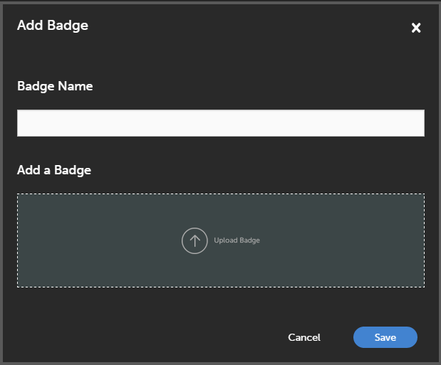

# 배지

배지는 직원이 강의 완료 시 획득할 수 있는 성과에 대한 척도입니다. Adobe Learning Manager는 최신 e러닝 개념 중 하나인 배지를 도입했습니다. 전 세계의 교수는 특정 스킬 또는 학습 목표의 표상으로 배지를 사용합니다.

배지는 사용자 동기 부여 방식으로 정의할 수 있습니다.

책임자는 다음과 같은 방법으로 학습자를 위한 배지를 생성합니다.

1. 책임자로 로그인한 다음 **[!UICONTROL 배지]** 왼쪽 창에. 학습자용 배지 목록이 나타납니다.

   >[!NOTE]
   >
   >기본적으로 몇 개의 샘플 배지 목록이 제공됩니다.

1. 다음을 수행합니다. **[!UICONTROL 추가]** 페이지 오른쪽 상단 배지 추가 대화 상자가 나타납니다.

   

   *배지 이름 및 해당 이미지 추가*

1. 배지 이름을 입력합니다. 을 클릭하여 배지를 업로드합니다. **[!UICONTROL 배지 업로드]** 을 클릭하고 **[!UICONTROL 저장]**.
