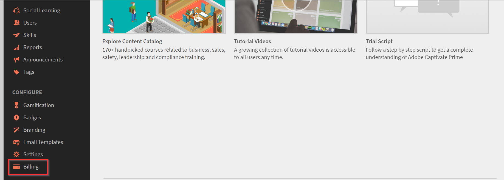
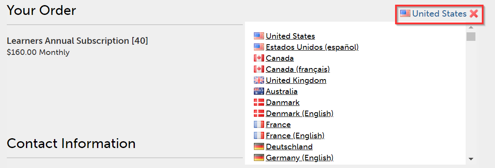
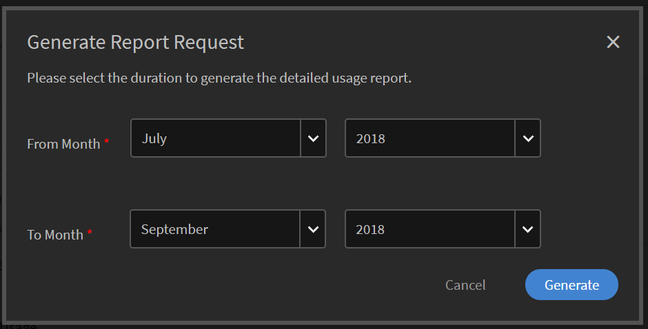

# Learning Manager 주문 및 청구 정보 관리

신용카드 결제는 [미국 지역](http://learningmanager.adobe.com/)에서만 이용할 수 있습니다.

Learning Manager 청구 정보를 관리하고 신용카드를 사용하여 주문하거나 구매 주문 또는 월간 활성 사용자 계획을 통해 구독하십시오.

Adobe Learning Manager는 유연하고 고객 친화적이며 조직 요구에 맞는 최선의 가격 모델을 제공합니다. 자세한 내용은 [Learning Manager](https://www.adobe.com/products/learningmanager.html) 페이지를 참조하십시오.

청구 정보는 조직의 관리자만 관리할 수 있습니다.

Adobe에 Learning Manager 구독 및 청구에 대한 자세한 내용을 문의하려면 [learningmanagersales@adobe.com](mailto:learningmanagersales@adobe.com)으로 전자 메일을 보내 주시기 바랍니다.

## 결제 페이지

청구 페이지에 액세스하려면 관리자로 Adobe Learning Manager에 로그인하고 왼쪽 탐색 창에서 **[!UICONTROL 청구]**&#x200B;를 선택합니다.

청구 페이지에는 다음 탭이 있습니다.

| 탭 | 용도 |
|---|---|
| **구독** | 계정 세부 정보, 라이선스 권한 및 시트 사용량을 확인합니다. 플랜 활성화를 관리합니다. |
| **주문 내역** | 계정에 대해 수행된 과거 주문을 검토합니다. |

### 구독 탭

**계정 세부 정보**

**구독** 탭의 위쪽에 있는 **계정 세부 정보** 카드에는 계정에 대한 4개의 읽기 전용 식별자가 표시됩니다.

| 필드 | 설명 |
|---|---|
| **ECCID** | Adobe의 계정 참조 번호입니다. Adobe 지원 센터에 문의할 때 이 문구를 인용하십시오. |
| **계정 ID** | 고유한 Adobe Learning Manager 계정 식별자입니다. |
| **계정 이름** | Adobe Learning Manager 계정의 표시 이름입니다. |
| **IMS 조직 ID** | 이 계정에 연결된 Adobe Admin Console 조직 아직 연결되지 않은 경우 비어 있습니다. |

**라이선스**

**라이선스** 섹션에는 계정의 모든 활성 라이선스 또는 권한이 나열됩니다. 각 블록에는 라이센스 이름, 해당되는 경우 플랜 설명 및 현재 계약 기간의 소비 수치를 보여주는 통계 행이 표시됩니다.

통계 행 열은 라이선스 유형에 따라 다릅니다.

| 라이선스 유형 | 열 표시 |
|---|---|
| 유료 라이선스(예: Adobe Learning Manager Ultimate) | 구매됨/사용됨/피어 계정에서 사용됨/남음 |
| 체험판 라이선스(예: Virtual Coach) | 사용 가능/사용됨/남음 |

통계 행 아래에서 **[!UICONTROL 사용 세부 정보 보기]**&#x200B;를 선택하여 인라인 분석을 확장합니다. 확장된 섹션에는 다음이 표시됩니다.

- 기록 기간을 포함하여 계약 기간별로 필터링하는 **기간 선택** 드롭다운
- 열이 있는 **전체 사용량** 테이블: 구매됨 / 이 계정에서 사용됨 / 피어 계정에서 사용됨 / 남음
- 개별 피어 계정 전체에 분배된 사용량을 보기 위한 **계정 내용 보기** 링크
- 사용 데이터를 파일로 내보내기 위한 **자세한 보고서 다운로드** 링크

**에이전트 오케스트레이터 라이선스 블록**

에이전트 Orchestrator 라이선스가 연결된 경우 stats 행에 다음이 표시됩니다.

| 열 | 설명 |
|---|---|
| **구입** | 계약 기간에 대해 구매한 총 Gen AI 크레딧. |
| **사용됨** | 이 라이선스를 사용하는 모든 서비스에서 소비된 크레딧. |
| **ALM에서 사용** | Adobe Learning Manager에서 특별히 소비한 크레딧. |
| **남음** | 크레딧은 계속 사용할 수 있습니다. |

조직에서 상위 및 하위 계정을 사용하는 경우 상위 계정의 **라이선스** 섹션에 연결된 모든 하위 계정의 크레딧 소비를 반영하는 **피어 계정에서 사용함** 열이 표시됩니다. 하위 계정은 할당량을 구매하지 않고 **허용된 시트**&#x200B;로 표시합니다.

## Adobe Learning Manager 계정을 Adobe Admin Console에 연결

Gen AI 기능이 활성화되기 전에 Adobe Learning Manager 계정이 Adobe Admin Console 조직에 연결되어 있어야 합니다. 연결되면 Adobe Learning Manager이 에이전트 Orchestrator 라이선스를 감지하고 **크레딧** 탭을 사용할 수 있도록 합니다.

링크는 Adobe의 표준 주문 프로세스를 통해 계정을 구매했거나 활성화 키를 사용하여 계정을 활성화한 경우 자동으로 설정됩니다. **구독** 탭에서 링크를 확인할 수 있습니다. — **계정 세부 정보**&#x200B;의 **IMS 조직 ID** 필드가 채워진 경우 계정이 이미 연결되어 있습니다.

### 수동으로 계정 연결

계정이 독립적으로 설정되어 있고 **IMS 조직 ID** 필드가 비어 있는 경우 수동으로 연결하세요.

**필수 구성 요소:**
- Adobe Learning Manager 계정의 관리자여야 합니다.
- 연결하려는 Adobe Admin Console 조직에서 시스템 관리자 역할을 보유해야 합니다.
- Adobe Admin Console 조직에는 활성 에이전트 Orchestrator 라이선스가 있어야 합니다.

1. **[!UICONTROL 결제]**&#x200B;를 선택한 다음 **[!UICONTROL 구독]** 탭을 선택합니다.
2. **계정 세부 정보** 카드에서 **[!UICONTROL IMS 조직 연결]**&#x200B;을 선택합니다.
3. 로그인 창이 열립니다. Adobe 계정 자격 증명을 입력하고 목록에서 조직을 선택합니다. Adobe Learning Manager에서 로그인 시 Adobe Admin Console 조직의 시스템 관리자 역할이 유지되고 동일한 계정에서도 Adobe Learning Manager의 관리자 역할이 있는지 확인합니다.
4. 두 검사를 모두 통과하면 링크가 설정됩니다. **IMS 조직 ID** 필드가 조직의 식별자로 업데이트되고 크레딧 잔액이 **라이선스** 섹션에 표시됩니다.
5. 둘 중 하나라도 확인에 실패하면 오류 메시지가 표시됩니다. 위의 필수 구성 요소를 확인하고 다시 시도하십시오.

### 계정 연결 해제

연결 해제 후에는 모든 학습자에 대해 Gen AI 기능이 비활성화되고 계정이 다시 연결될 때까지 **크레딧** 탭을 사용할 수 없습니다.

1. **[!UICONTROL 결제]**&#x200B;를 선택한 다음 **[!UICONTROL 구독]** 탭을 선택합니다.
2. **계정 세부 정보** 카드에서 **[!UICONTROL IMS 조직 연결 해제]**&#x200B;를 선택합니다.
3. 조직의 관리자 역할을 확인하려면 다시 로그인하십시오.
4. 링크가 제거됩니다. **IMS 조직 ID** 필드가 공백으로 돌아가고 **크레딧** 탭이 숨겨집니다.

액세스를 복원하려면 위의 수동 연결 단계를 반복합니다.

## 신용카드로 주문 {#placeordersusingcreditcards}

단일 카드 결제 주문을 이용하면 학습자 최대 3500명의 구독이 가능합니다. 이 계정의 첫 주문에서 학습자는 10명 이상이어야 합니다.

1. 책임자 앱의 왼쪽 탐색 창에서 **[!UICONTROL 청구]**&#x200B;를 클릭합니다.

   

   *Adobe Learning Manager 청구 시작*

1. **[!UICONTROL 결제 정보]** 페이지의 **[!UICONTROL 사용자 추가]** 필드에 사용자 수를 추가합니다. 선불 구독에 신용카드를 사용하는 경우 구독에 대해 추가 가능한 사용자 수를 확인할 수 있습니다. 추가할 수 있는 사용자 수는 남음.1 섹션에서 언급한 수를 초과해서는 안됩니다.

   

   *사용자 수 추가*

1. 추가하려는 사용자 수를 지정한 후 페이지 오른쪽 상단 모서리에 있는 &#39;주문하기&#39;를 클릭합니다.

   

1. 화면에 표시되는 예상 가격을 검토합니다.

   

   *주문*

   연간 구독 요금은 구독에 추가된 사용자 수를 기준으로 계산됩니다. 예를 들어 4명의 사용자가 추가되는 경우 연간 요금은 사용자 4명X$4X$12로 계산하여 $192가 도출됩니다.

   **[!UICONTROL 계속]**&#x200B;을 클릭합니다.

   *예상 검토*

1. 결제 세부 정보 페이지에서 주문에 대한 예상 가격을 확인할 수 있습니다. 현재 로케일에 따라 통화가 표시됩니다.

   

   *결제 세부 정보 보기*

   드롭다운 목록에서 국가를 선택하여 로케일을 변경할 수도 있습니다.

   

   *결제 국가 선택*

1. 연락처를 입력한 뒤, 신용카드 유형을 선택하고 신용카드 정보를 제공합니다. 필요한 세부 정보를 입력한 후 **[!UICONTROL 주문 완료]**&#x200B;를 클릭하세요.
1. 주문을 완료한 후, 최근에 주문한 패키지를 보려면 **[!UICONTROL 결제]** 페이지의 **[!UICONTROL 주문 내역]** 탭을 클릭하십시오.

   

   *주문 내역 보기*

## 주문 상태 확인 {#checkorderstatus}

모든 주문은 다음 4가지 상태 중 하나로 표시될 수 있습니다.

**활성:** 주문이 활성화되어 사용자가 등록되었습니다.

**일시 중단:** 다음 시나리오에서 주문이 일시 중단 상태로 변경됩니다.

- 신용카드 결제 대금 지불 지연
- 신용카드 사용 기한 만료
- 이 때는 모든 자동 결제에 대한 결제가 거부됩니다.

**취소 시작:** Learning Manager 관리자가 계정을 비활성화하면 주문이 이 상태로 변경됩니다. 이후 주문 취소 확인을 받으면 주문이 취소 상태로 변경됩니다.

## 구독 세부 정보 업데이트 {#updatesubscriptiondetails}

1. 주문 목록에서 **[!UICONTROL 편집]**&#x200B;을 클릭합니다.

   

   *구독 세부 정보 업데이트*

1. 구독 세부 정보 페이지에서 **[!UICONTROL 구독 편집]**&#x200B;을 클릭합니다.
1. 편집하려는 항목 선택:

   - 결제 방법: 이 옵션을 사용하여 결제 세부 정보를 업데이트합니다(예: 신용카드).
   - 주소: 이 옵션을 사용하여 주소 세부 정보를 업데이트합니다.

## 구독 취소 {#cancelasubscription}

주문 취소 방법:

1. 책임자 페이지의 왼쪽 창에서 &#39;청구&#39;를 클릭합니다.
1. 결제 페이지의 오른쪽 상단 모서리에서 **[!UICONTROL 작업]** > **[!UICONTROL 계정 비활성화]**&#x200B;를 선택합니다.
1. 책임자가 계정을 비활성화하면 다음 결제 주기부터 계정의 기존 주문이 모두 취소됩니다.

고객이 계정을 비활성화하면 다음 30일 동안 평가판 상태로 변경됩니다. 계정 소유자는 계정을 살리기 위한 세 개의 알림 전자 메일을 받습니다. 소유자가 계정을 다시 활성화하지 않으면 소유자를 제외한 모든 사용자가 Learning Manager에 액세스할 수 없습니다.

## 구매 주문을 사용하여 주문 {#placeordersusingpurchaseorder}

대체 결제 방법으로 구매 주문 프로세스를 선택할 수 있습니다. 전제 조건으로 조직의 계정은 Adobe에 등록되어야 합니다. 이 프로세스에는 조직 계정에 대금이 청구됩니다. 계정은 학습자의 활동을 기반으로 부과됩니다. 학습 객체 수준 활동만 과금됩니다. PO(구매 주문)를 사용하여 주문하는 방법:

1. [learningmanagersales@adobe.com](mailto:learningmanagersales@adobe.com)으로 전자 메일을 보내 필수 학습자 수를 알려주십시오.
1. Learning Manager 팀이 활성화 키를 보내드립니다.
1. 책임자 앱의 청구 페이지에서 활성화 키를 입력합니다.
1. 페이지 오른쪽 상단 모서리에 있는 &#39;활성화&#39;를 클릭합니다.

## 계정 상태 확인 {#checkaccountstatus}

계정이 활성화된 후 계정 상태는 다음 중 하나로 표시됩니다.

- **평가판** - Adobe Learning Manager 계정을 만들고 30일 동안 결제 없이 사용할 수 있습니다. 평가판 사용 기간 동안 학습자 등록 수에는 제한이 없습니다.
- **활성** - 이 상태에서는 계정에 구독 주문에 따라 매월 반복 결제가 포함된 활성 학습자 구독이 있습니다.
- **비활성** - 다음 시나리오에서 계정이 비활성 상태로 전환됩니다.

  - 평가판 사용 기간 후 계정에서 구독 주문 활성화를 하지 않을 수 있습니다.
  - 관리자가 계정을 비활성화하면 구독의 다음 결제 주기부터 계정의 모든 기존 주문이 취소됩니다.
  - 알림 후에는 계정의 활성 주문에 대한 결제도 거부됩니다.

비활성 상태에서 계정이 즉시 취소되지 않습니다. 신용카드가 만료된 경우 Learning Manager 팀으로부터 신용카드의 최신 정보를 제공하라는 알림을 2회 이상 받게 됩니다. 비활성 상태에서는 관리자만 Adobe Learning Manager 계정에 로그인할 수 있습니다. 다른 모든 사용자는 계정에 액세스할 수 없습니다.

- **활성화 필요** - Learning Manager 관리자가 계정 비활성화를 선택하면 계정이 이 상태로 전환됩니다. 이 계정의 주문이 모두 취소됩니다. 이러한 주문에 대한 결제 집합은 다음 결제 주기부터 이루어지지 않습니다. 계정 상태는 마지막 결제 주기 날짜까지 이 상태로 유지됩니다. 이 상태에서는 모든 사용자는 마지막 반복 결제일이 끝날 때까지 아무런 영향 없이 애플리케이션을 계속 사용할 수 있습니다.

## 구독 취소 {#Cancelasubscription-1}

활성 구독을 취소하려면 Learning Manager 지원팀에 문의하십시오.

## 계정 해지 수수료 {#accountterminationfee}

구독 기간이 끝나기 전에 가입을 취소하면 조기 해지 수수료가 부과됩니다. 해지 수수료는 남은 약정기간 가입가격의 50%입니다.

## MAU(월간 활성 사용자) 계획 {#monthlyactiveusersmauplan}

선호하는 청구 방법으로 MAU 계획을 선택할 수 있습니다. 이 옵션은 월간 고유 활성 사용자 수를 기준으로 청구 정보를 생성합니다. 월간 고유 활성 사용자는 계획을 활성화한 달부터 12개월 동안 누적으로 추가됩니다. 이 수는 해당 기간에 대한 청구에 사용됩니다.

다음은 MAU 계산 방법을 이해하는 데 도움이 되는 예시입니다.

월간 사용자 수가 다음과 같다고 가정해 보겠습니다.

- 1번째 달 = 50명
- 2번째 달 = 500명
- 3번째 달 = 5000명
- 4~12번째 달 = 10명

청구되는 총 월간 활성 사용자 = 1번째 달 + 2번째 달 + 3번째 달 + 4~12번째 달 = 50 + 500 + 5000 + 90 = 5640

이 기간 동안에는 5640명의 사용자에 대해 대금이 청구됩니다.

12개월이 끝나면 사용 횟수가 다시 0으로 재설정되고 MAU 계획의 새 기간이 시작됩니다. 여러 개의 활성화 키를 추가하여 구매한 시트 수를 늘릴 수 있습니다.

다음 작업을 수행하거나 다른 사용자가 수행한 작업으로 인해 완료를 달성한 사용자는 해당 월의 월간 고유 활성 사용자로 간주됩니다.

- 강의, 학습 프로그램 또는 인증서 사용
- 작업 지원 또는 강의 첨부 파일 사용 및 다운로드
- 개인 노트 사용, 다운로드 또는 작성
- 보드, 게시물 또는 댓글을 작성하여 소셜 학습에 참여
- 외부 인증서 제출 승인 또는 강의실/가상 강의실 세션 출석으로 완료 달성

## 사용 세부 정보 보기 {#viewusagedetails}

1. 월간 활성 사용자의 수를 보려면 **[!UICONTROL 사용 세부 정보 보기]**&#x200B;를 클릭합니다.

   

   *월별 활성 사용자 보기*

1. 표시되는 페이지에서 다음을 확인할 수 있습니다.

   - **전체 사용:** 총 활성 사용자 수, 한 달 동안 Learning Manager를 사용하고 있는 사용자, 아직 강의에 등록하지 않은 사용자 수를 확인할 수 있습니다.
   - **월별 사용량:** 월간 고유 활성 사용자 테이블을 볼 수 있습니다.

## 사용 보고서 다운로드 {#downloadusagereport}

월간 및 연간 활성 사용자 수에 대한 데이터를 다운로드할 수도 있습니다. 다운로드하려면 **[!UICONTROL 세부 보고서 다운로드]**&#x200B;를 클릭하십시오.

**보고서 생성 요청** 대화상자에서 원하는 월과 연도를 입력하고 **[!UICONTROL 생성]**&#x200B;을 클릭합니다.

*활성 사용 보고서 다운로드*

브라우저 창을 닫으면 다음에 Learning Manager를 방문할 때 다운로드가 시작됩니다.

보고서는 브라우저의 다운로드 폴더에 저장됩니다.

## 구독 취소

활성 구독을 취소하려면 Learning Manager 지원팀에 문의하십시오.

## Gen AI 크레딧 {#genaicredits}

### Gen AI 크레딧의 작동 방식

Gen AI 크레딧은 학습자가 AI 기반 기능과 상호 작용할 때마다(예: AI 어시스턴트를 통해 질문을 하거나 개인화된 학습 추천을 생성할 때) 소비됩니다. 각 상호 작용이 시작되기 전에 Adobe Learning Manager은 크레딧이 사용 가능한지 확인합니다. 크레딧을 사용할 수 있는 경우 상호 작용이 진행됩니다. 균형이 소진된 경우 학습자에게 기능을 일시적으로 사용할 수 없다는 메시지가 표시됩니다.

크레딧은 Adobe Experience Platform 에이전트 Orchestrator 라이선스의 일부로 구매됩니다. 해당 라이선스는 Adobe Admin Console에서 관리되며, Adobe Learning Manager은 이에 자동으로 연결되어 사용 가능한 크레딧을 감지합니다.

**크레딧 우선 순위 규칙:** Adobe Learning Manager 플랜에 번들로 제공되는 Gen AI 크레딧이 포함되어 있고 상담사 Orchestrator 라이선스도 있는 경우, 번들로 제공되는 크레딧이 먼저 사용됩니다. 번들형 크레딧이 소진된 후에만 상담사 Orchestrator 크레딧이 사용됩니다.

**공유 크레딧 풀:** 조직에 여러 개의 Adobe Learning Manager 계정이 모두 동일한 Adobe Admin Console 조직에 연결되어 있는 경우 모든 계정은 단일 공유 크레딧 풀에서 가져옵니다.

>[!IMPORTANT]
>
>모든 Gen AI 기능은 기본적으로 꺼져 있습니다. 학습자가 액세스하려면 각 기능을 활성화하고 크레딧 사용 제한을 설정해야 합니다.

### Gen AI 크레딧 탭에 액세스

1. **[!UICONTROL 관리자]** > **[!UICONTROL 결제]**&#x200B;를 선택합니다.
2. **[!UICONTROL 크레딧]** 탭을 선택합니다.

**크레딧** 탭은 Gen AI 크레딧을 구매했거나 계정에서 이전에 활성화된 경우에만 표시됩니다. 탭이 표시되지 않는 경우 계정이 Active Agent Orchestrator 라이선스가 있는 Adobe Admin Console 조직에 연결되어 있는지 확인하십시오.

### Gen AI 기능 표

**AI 주요 기능** 표에는 계정에서 사용할 수 있는 모든 AI 기능이 나열됩니다.

| 열 | 설명 |
|---|---|
| **기능 이름** | AI 기능의 이름입니다. 해당 기능의 설정 페이지로 이동하려면 이름을 선택하십시오. |
| **상태** | 기능의 설정 여부 해당 설정 페이지에서 기능을 전환합니다. |
| **최대 크레딧 사용 제한** | 이 기능이 약정 기간 동안 소비할 수 있는 최대 크레딧. 기능을 활성화하려면 먼저 설정해야 합니다. 학습자 관련 기능에만 적용됩니다. |
| **사용된 크레딧** | 계약 시작일 이후 이 기능에서 소비된 총 크레딧이 실시간으로 업데이트됩니다. |

### Gen AI 기능 활성화

1. **[!UICONTROL 크레딧]** 탭에서 **일반 AI 기능** 표에서 기능을 찾습니다.
2. **최대 크레딧 사용 한도** 열에 이 기능이 약정 기간 동안 사용할 수 있는 최대 크레딧 수를 입력합니다.
3. 기능 이름을 선택하여 해당 **기능 설정** 페이지로 이동하십시오.
4. **기능 설정** 페이지에서 기능을 켭니다.
5. 학습자와 카탈로그를 AI 길잡이에 할당하는 등의 추가 구성을 완료합니다.

### 크레딧이 소진되면 어떻게 됩니까?

- 기능이 **최대 크레딧 사용 제한**&#x200B;에 도달하면 학습자는 해당 기능을 일시적으로 사용할 수 없다는 메시지를 볼 수 있습니다. **크레딧** 탭에서 언제든지 한도를 올립니다.
- 전체 계정 크레딧이 소진되면 추가 크레딧을 구매할 때까지 학습자에게 모든 Gen AI 기능이 작동하지 않습니다. 사용 현황 보고서 및 크레딧 지표는 관리자가 계속 액세스할 수 있습니다.
- 크레딧이 모두 소진되었을 때 학습자가 상호 작용 중에 있으면 해당 상호 작용이 완료됩니다. 이후의 모든 상호 작용은 차단됩니다.
- 관리자는 크레딧 한도를 구매한 크레딧 수보다 높게 설정할 수 있습니다. 초과 할당이 허용되며 갱신 시 트루업이 발생할 수 있습니다.

### 월별 크레딧 사용 차트

일반 AI 기능 테이블 아래 **월별 크레딧 사용량** 차트에서는 월별 기능당 소비된 크레딧을 보여 줍니다. 기본적으로 차트에는 상담사 Orchestrator 계약 시작 날짜를 기준으로 현재 계약 연도가 표시됩니다. **[!UICONTROL 다운로드]**&#x200B;를 선택하여 선택한 기간의 월별 보고서를 내보냅니다. 보고서 생성이 비동기적이므로 파일이 준비되면 인앱 알림과 이메일을 수신하게 됩니다.

### Gen AI 사용 보고서

Adobe Learning Manager은 **[!UICONTROL 보고서]** > **[!UICONTROL AI 보고서]**&#x200B;에서 두 가지 세대 AI 사용 보고서를 제공합니다.

**월별 크레딧 사용 보고서**

월별 기능당 소비된 크레딧을 표시합니다. 예산 계획 및 계약 갱신에 유용합니다.

- **열:**&#x200B;개월 | 기능 | 사용된 크레딧
- **필터:** 하나 이상의 계약 기간에 걸친 날짜 범위를 선택합니다.
- **다운로드:** 비동기 — 파일이 준비되면 인앱 알림과 이메일을 받습니다

**학습자 Gen AI 크레딧 사용 보고서**

각 상호 작용에서 사용한 기능과 점수를 학습자에게 보여 주는 감사 추적입니다.

- **열:** 날짜 | 학습자 이름 | 학습자 전자 메일 | 기능 | 사용된 크레딧
- **필터:** 감사하려는 날짜 범위를 선택합니다.
- **다운로드:** 비동기 — 파일이 준비되면 인앱 알림과 이메일을 받습니다

### 크레딧 사용 현황 알림

Adobe Learning Manager은 신용 소비가 주요 임계값을 초과하면 자동으로 통지합니다. 알림은 인앱 및 이메일로 전송됩니다.

| 트리거 | 알림 |
|---|---|
| 계정 크레딧이 총 구매액의 90%에 도달 | 경고 - 크레딧이 계정 수준에서 거의 소진되었습니다. |
| 계정 크레딧이 총 구매액의 100%에 도달 | 경고 - 모든 크레딧이 소비되고 학습자용 Gen AI 기능이 중단됩니다. |
| 개별 최대 크레딧 사용 제한에 도달한 기능 | 경고 - 학습자에게 정지되는 특정 기능의 이름을 지정합니다 |

90% 경고가 수신되면 100% 임계값에 도달하기 전에 Adobe 계정 팀에 문의하여 크레딧을 추가로 구매합니다.

## 자주 묻는 질문 {#frequentlyaskedquestions}

**계정에서 구독을 추가/제거하는 방법**

계정에 구독을 추가하려면 구독을 구매할 사용자 수를 추가합니다. 그런 다음 오른쪽 상단 모서리의 **[!UICONTROL 주문하기]**&#x200B;를 클릭합니다. 예상 가격을 검토하고 **[!UICONTROL 계속]**&#x200B;을 클릭합니다. 계정 세부 정보와 신용카드 세부 정보를 입력합니다. 그럼 다음 구독을 구매하기 위해 **[!UICONTROL 주문 완료]**&#x200B;를 클릭합니다.

활성 구독을 제거하려면 Learning Manager 지원팀에 문의하십시오.

**구독에 사용하는 신용카드를 변경하려면 어떻게 해야 합니까?**

활성 계정의 **[!UICONTROL 주문 내역]** 탭에서 **[!UICONTROL 편집]**&#x200B;을 클릭합니다. 그럼 다음 구독 세부 정보 페이지에서 **[!UICONTROL 구독 편집]**&#x200B;을 클릭합니다. 새 신용카드의 세부 정보를 입력하고 **[!UICONTROL 결제 수단 업데이트]**&#x200B;를 클릭합니다.

*신용카드 세부 정보 보기*

**Learning Manager에서 결제 정보를 어떻게 업데이트하나요?**

결제 정보를 업데이트하려면 다음 단계를 따르십시오.

1. **관리자**(으)로 로그인하고 **[!UICONTROL 결제]**&#x200B;를 클릭합니다.
1. 주문 목록에서 **[!UICONTROL 편집]**&#x200B;을 클릭합니다.
1. 구독 세부 정보 페이지에서 **[!UICONTROL 구독 편집]**&#x200B;을 클릭합니다.

편집하려는 항목 선택:

1. **[!UICONTROL 결제 방법]:** 이 옵션을 사용하여 결제 세부 정보를 업데이트합니다(예: 신용카드).
1. **[!UICONTROL 주소]:** 이 옵션을 사용하여 주소 세부 정보를 업데이트합니다.

**구독을 부분적으로 취소할 수 있습니까?**

아니오. 구독을 부분적으로 취소할 수 없습니다. 구매한 사용자 수를 줄여야 하는 경우 결제 주기 말에 구독을 취소하고 난 후에 필요한 사용자 수를 구매할 수 있습니다.

**신용카드 결제에 대한 송장을 어떻게 받을 수 있나요?**

다음 방법 중 하나로 결제에 대한 송장을 받으려면 [FastSpring](https://fastspring.com/)에 문의하십시오.

- `https://questionacharge.com` 링크를 사용하여 FastSpring으로 서비스 요청을 만드십시오.
- 송장을 요청하려면 `orders@fastspring.com`에 FastSpring에 전자 메일을 보내십시오.

## 일반 AI 크레딧 문제 해결

| 문제 | 솔루션 |
|---|---|
| **크레딧 탭이 표시되지 않음** | Gen AI 크레딧을 구매하거나 이 계정에 적용하지 않았습니다. Adobe Admin Console에서 Agent Orchestrator 라이선스를 확인한 다음 조직이 **[!UICONTROL 결제]** > **[!UICONTROL 구독]** > **계정 세부 정보**&#x200B;에 연결되어 있는지 확인합니다. |
| **IMS 조직 ID 필드가 비어 있습니다** | 계정이 아직 연결되지 않았습니다. **계정 세부 정보** 카드에서 **[!UICONTROL IMS 조직 연결]**&#x200B;을 선택하고 위의 연결 단계를 따르십시오. |
| **연결 실패 오류** | 연결하려는 Adobe Learning Manager 및 Adobe Admin Console 조직 모두에 관리자 역할이 있는지 확인합니다. 링크가 설정되려면 두 검사 모두 통과해야 합니다. |
| **활성화 키를 적용한 후 IMS 조직 ID 필드가 비어 있음** | 자동 연결은 Adobe의 표준 주문 플로우를 통해 활성화된 계정에 대해서만 발생합니다. 독립적으로 설정된 계정의 경우 키를 활성화한 후 위의 수동 연결 단계를 완료하십시오. |
| **연결 해제 후 Gen AI 기능을 사용할 수 없음** | 연결을 해제하면 모든 Gen AI 기능에 대한 액세스가 제거되고 [크레딧] 탭이 숨겨집니다. 액세스 권한을 복원하려면 활성 에이전트 Orchestrator 라이선스가 있는 Adobe Admin Console 조직에 계정을 다시 연결하십시오. |

<!-- 
# Manage Learning Manager orders and billing

Credit card-based purchase is only available in the [US region](http://learningmanager.adobe.com/).

Manage Learning Manager billing, place orders by using a credit card, subscribe using a Purchase Order, or via a Monthly Active Users plan.

Adobe Learning Manager has a flexible, customer-friendly, and one of the best pricing models to cater to your organization needs. For more information, see the [Learning Manager](https://www.adobe.com/products/learningmanager.html) page.

Only the Administrators of your organization can manage billing.

If you want to contact Adobe for more information about Learning Manager subscription and billing, write to us at [learningmanagersales@adobe.com](mailto:learningmanagersales@adobe.com).

## Place orders using credit cards {#placeordersusingcreditcards}

You can buy a subscription for a maximum of 3500 learners through any single credit card payment order. The first order in the account must be for a minimum of 10 learners.

1. On the Administrator app, click **[!UICONTROL Billing]** on the left navigation pane.

   

   *Launch Adobe Learning Manager billing*

1. On the **[!UICONTROL Billing Information]** page, add the number of users in the **[!UICONTROL Add Users]** field. When using a credit card for pre-paid subscriptions, you can see the number of users that you can add for the subscription. The number of users you can add must not exceed the number mentioned in the section Remaining.1. 

   

   *Add number of users*

1. After specifying the number of users to add, click Place Order in the upper-right corner of the page.

   

1. Review the estimate that appears on the screen.

   

   *Place an order*

   The annual subscription fee is calculated based on the number of users who are added for the subscription. For example, if four users are being added, the annual fee is calculated using the expression 4 usersX$4X$12, which returns $192.

   Click **[!UICONTROL Proceed]**.

   *Review the estimate*

1. On the Payment Details page, you can view the estimated price of the order. The currency appears based on the current locale.

   

   *View payment details*

   You can also change the locale by choosing the country from the drop-down list.

   

   *Select the country of billing*

1. Enter your contact information, choose the credit card type, and provide the details of the credit card. After you've entered the required details, click **[!UICONTROL Complete Order]**.
1. After you've placed the order, to see the recently ordered packages, click the **[!UICONTROL Order History]** tab on the **[!UICONTROL Billing]** page.

   

   *View order history*

## Check order status {#checkorderstatus}

All orders can have one of the four statuses:

**Active:** An order is active, and users are registered successfully.

**Suspended:** An order moves into suspended state in the following scenarios:

* Delay in receipt of payment from the credit card
* Expiry of the credit card.
* Payment is declined for any recurring payment cycle.

**Canceled initiated:** An order moves into this state when the Learning Manager Administrator deactivates the account. The order then moves into a canceled state after receiving the cancellation confirmation of the order.

## Update subscription details {#updatesubscriptiondetails}

1. In the list of orders, click **[!UICONTROL Edit]**.

   

   *Update subscription details*

1. In the Subscription details page, click **[!UICONTROL Edit Subscription]**.
1. Choose the item that you want to edit:

   * Payment method: Use this option to update payment details, such as, credit card.
   * Address: Use this option to update address details.

## Cancel a subscription {#cancelasubscription}

To cancel an order:

1. In the left pane of the Administrator page, click Billing.
1. In the Billing page, on the upper-right corner, choose **[!UICONTROL Actions]** > **[!UICONTROL Deactivate Account]**.
1. Once the Administrator deactivates the account, all existing orders in the account are canceled from the next billing cycle.

When an account is deactivated by the customer, it enters a trial state for the next 30 days. The account owner receives three reminder emails to revive the account. If the owner does not reactivate the account, none of the users are able to access Learning Manager apart from the owner.

## Place orders using Purchase Order {#placeordersusingpurchaseorder}

You can choose purchase order process as an alternative mode of payment. As a pre-requisite, your organization's account must be registered with Adobe. Your organization account is charged for this process. The account is charged based on a learner's activities. Only Learning Object-level activities are charged. To place an order using PO:

1. Send an email to [learningmanagersales@adobe.com](mailto:learningmanagersales@adobe.com) and mention the number of required learners.
1. The Learning Manager team sends you an activation key.
1. In the Billing page of the Administrator app, enter the activation key.
1. Click Activate in the upper-right corner of the page.

## Check account status {#checkaccountstatus}

After an account gets activated, the account can be in any of the following states:

* **Trial** - You can create an Adobe Learning Manager account and use it without any payment for a period of 30 days. There is no limit on the number of learners registered during the trial period.
* **Active** - In this state, the account has active learner subscriptions with recurring monthly payment as per the subscription order.
* **Inactive** - An account moves into inactive state in the following scenarios:

  * After the trial period if there are no active subscription orders in the account.
  * Administrator deactivates the account, which results in canceling all the existing orders in an account from the next billing cycle of subscription.
  * Payment is declined for active orders in an account even after reminders.

An inactive state does not cancel your account with immediate effect. You receive at least a couple of reminders from the Learning Manager team asking you to provide the latest information about

your credit card if it has expired. In an inactive state, only an administrator can log in to the Captivate

Learning Manager account. All other users cannot access the account.

* **Activation required** - Your account moves into this state when the Learning Manager administrator chooses to deactivate the account. All the orders of this account get canceled. The collection of payment for these orders does not happen from the next billing cycle. The status of the account remains in this state until the day of the last billing cycle. In this state, all users can continue to use the application without any impact until the end of the last recurring payment date.

## Cancel a subscription {#Cancelasubscription-1}

To cancel an active subscription, contact the Learning Manager support team.

## Account termination fee {#accountterminationfee}

If you want to cancel the subscription before the completion of the annual term, an early termination fee is charged. The termination fee is equivalent to 50% of the subscription price of the remaining commitment period.

## Monthly Active Users (MAU) plan {#monthlyactiveusersmauplan}

You can choose a MAU plan as your preferred way of billing. This option generates billing based on the number of monthly unique active users. The monthly unique active users are added cumulatively for a period of 12 months starting from the month of plan activation. This number is used for billing for the period.

Use the following example to understand how MAU is calculated.

Let there be a case where the number of users per month are as follows:

* Month 1 = 50
* Month 2 = 500
* Month 3 = 5000
* Month 4 to 12 = 10

Total Monthly Active Users that are billed = Month 1 + Month 2 + Month 3 + Month 4 to 12 = 50 + 500 + 5000 + 90 = 5640.

The billing for the period would be for 5640 users.

At the end of the 12-month period, the usage count is reset back to zero and a new period for MAU plan starts. You can add multiple activation keys to increase the purchased number of seats.

Any user who performs the following actions or achieves completions due to actions taken by others is considered as a monthly unique active user for that calendar month.

* Consuming a course, learning program or certification.
* Consuming, downloading a Job Aid or course attachments.
* Consuming, downloading or creating personal notes.
* Participating in Social Learning by creating Boards, posts or comments.
* Achieving completions due to External Certificate submission approvals or attendance for a classroom/virtual classroom sessions.

## View usage details {#viewusagedetails}

1. To view the number of active users by month, click **[!UICONTROL View Usage Details]**.

   

   *View active users by month*

1. On the page that displays, you can view the following:

   * **Overall usage:** You can check the total number of active users, users who are consuming Learning Manager in a month, and the number of users who have not yet signed up for any course.

   * **Monthly usage:** You can see a table of unique active users per month.

## Download usage report {#downloadusagereport}

You can also download the data of the number of active users by month and year. To download, click **[!UICONTROL Download Detailed Report]**.

On the **Generate Report Request** dialog, enter the required months and year, and click **[!UICONTROL Generate]**.

*Download active usage report*

If you close the browser window, the download starts the next time you visit Learning Manager.

The reports are saved in the Downloads folder of your browser.

## Cancel a subscription

To cancel an active subscription, contact the Learning Manager support team.

## Frequently Asked Questions {#frequentlyaskedquestions}

+++How to add/remove subscriptions from an account?

To add subscriptions in an account, add the number of users for who you'd like to purchase subscriptions. Then on the upper-right corner, click **[!UICONTROL Place Order]**. Review the estimate and click **[!UICONTROL Proceed]**. Enter your account details and also your credit card details. Then to purchase the subscriptions, click **[!UICONTROL Complete Order]**.

To remove an active subscription, contact the Learning Manager support team.
+++

+++How to change a credit card for subscriptions?

In the **[!UICONTROL Order History]** tab, for an active account, click **[!UICONTROL Edit]**. Then on the Subscription Details page, click **[!UICONTROL Edit Subscription]**. Enter your new credit card details and click **[!UICONTROL Update Payment Method]**.

*View credit card details*
+++

+++How to update the Billing information on Learning Manager?

To update the billing information, follow the steps below:

1. Log in as **Admin** and click **[!UICONTROL Billing]**.
1. In the list of orders, click **[!UICONTROL Edit]**.
1. In the Subscription details page, click **[!UICONTROL Edit Subscription]**.

Choose the item that you want to edit:

1. **[!UICONTROL Payment method]:** Use this option to update payment details, such as, credit card.
1. **[!UICONTROL Address]:** Use this option to update address details.
+++

+++Can I partially cancel a subscription?

No, you cannot cancel a subscription partially. If you need to reduce the number of seats that you have purchased, you can cancel the subscription at the end of the billing cycle and then purchase the number of seats required.
+++

+++How do I get an Invoice for my Credit card payments?

Contact [FastSpring](https://fastspring.com/) to get an invoice for your payments, using one of the following ways:

* Create a service request with FastSpring using the link `https://questionacharge.com`.
* Send an email to FastSpring on `orders@fastspring.com` requesting for the invoice.
-->
