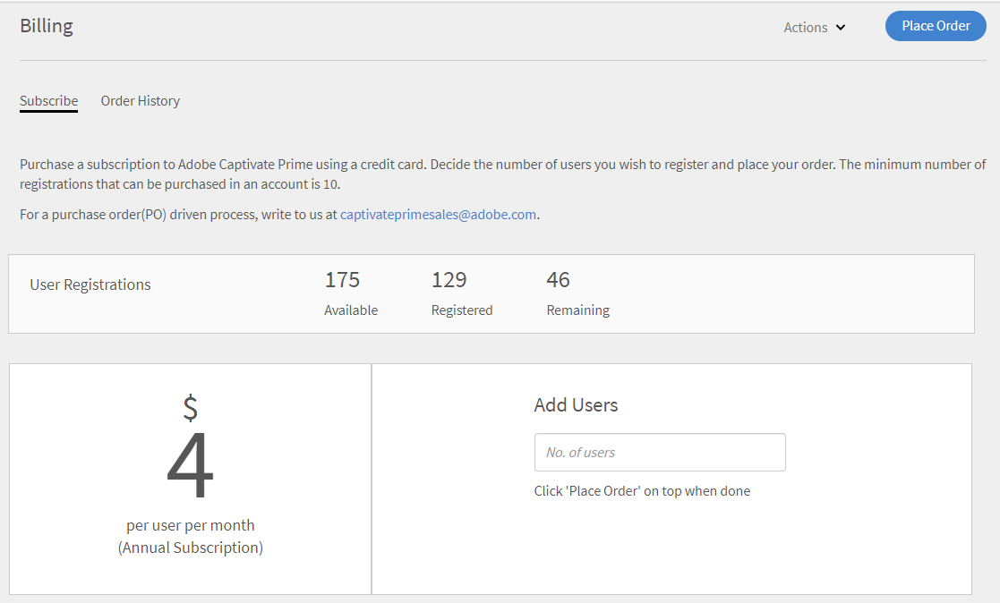
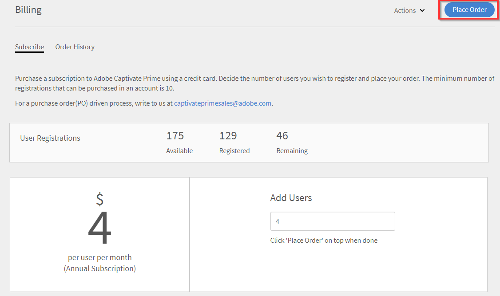

# Learning Manager 주문 및 청구 정보 관리

신용카드 결제는 [미국 지역](http://learningmanager.adobe.com/)에서만 이용할 수 있습니다.

Learning Manager 청구 정보를 관리하고 신용카드를 사용하여 주문하거나 구매 주문 또는 월간 활성 사용자 계획을 통해 구독하십시오.

Adobe Learning Manager는 유연하고 고객 친화적이며 조직 요구에 맞는 최선의 가격 모델을 제공합니다. 자세한 내용은 [Learning Manager](https://www.adobe.com/products/learningmanager.html) 페이지를 참조하십시오.

청구 정보는 조직의 관리자만 관리할 수 있습니다.

Adobe에 Learning Manager 구독 및 청구에 대한 자세한 내용을 문의하려면 [learningmanagersales@adobe.com](mailto:learningmanagersales@adobe.com)으로 전자 메일을 보내 주시기 바랍니다.

## 신용카드로 주문 {#placeordersusingcreditcards}

단일 카드 결제 주문을 이용하면 학습자 최대 3500명의 구독이 가능합니다. 이 계정의 첫 주문에서 학습자는 10명 이상이어야 합니다.

1. 책임자 앱의 왼쪽 탐색 창에서 **[!UICONTROL 청구]**&#x200B;를 클릭합니다.

   

   *Adobe Learning Manager 청구 시작*

1. **[!UICONTROL 결제 정보]** 페이지의 **[!UICONTROL 사용자 추가]** 필드에 사용자 수를 추가합니다. 선불 구독에 신용카드를 사용하는 경우 구독에 대해 추가 가능한 사용자 수를 확인할 수 있습니다. 추가할 수 있는 사용자 수는 Remaining.1 섹션에 명시된 수를 초과해서는 안 됩니다.

   

   *사용자 수 추가*

1. 추가하려는 사용자 수를 지정한 후 페이지 오른쪽 상단 모서리에 있는 &#39;주문하기&#39;를 클릭합니다.

   

1. 화면에 표시되는 예상 가격을 검토합니다.

   

   *주문*

   연간 구독 요금은 구독에 추가된 사용자 수를 기준으로 계산됩니다. 예를 들어 4명의 사용자가 추가되는 경우 연간 요금은 사용자 4명X$4X$12로 계산하여 $192가 도출됩니다.

   **[!UICONTROL 계속]**&#x200B;을 클릭합니다.

   *예상 검토*

1. 결제 세부 정보 페이지에서 주문에 대한 예상 가격을 확인할 수 있습니다. 현재 로케일에 따라 통화가 표시됩니다.

   

   *결제 세부 정보 보기*

   드롭다운 목록에서 국가를 선택하여 로케일을 변경할 수도 있습니다.

   

   *결제 국가 선택*

1. 연락처를 입력한 뒤, 신용카드 유형을 선택하고 신용카드 정보를 제공합니다. 필요한 세부 정보를 입력한 후 **[!UICONTROL 주문 완료]**&#x200B;를 클릭하세요.
1. 주문을 완료한 후, 최근에 주문한 패키지를 보려면 **[!UICONTROL 결제]** 페이지의 **[!UICONTROL 주문 내역]** 탭을 클릭하십시오.

   

   *주문 내역 보기*

## 주문 상태 확인 {#checkorderstatus}

모든 주문은 다음 4가지 상태 중 하나로 표시될 수 있습니다.

**활성:** 주문이 활성화되어 사용자가 등록되었습니다.

**일시 중단:** 다음 시나리오에서 주문이 일시 중단 상태로 변경됩니다.

* 신용카드 결제 대금 지불 지연
* 신용카드 사용 기한 만료
* 이 때는 모든 자동 결제에 대한 결제가 거부됩니다.

**취소 시작:** Learning Manager 관리자가 계정을 비활성화하면 주문이 이 상태로 변경됩니다. 이후 주문 취소 확인을 받으면 주문이 취소 상태로 변경됩니다.

## 구독 세부 정보 업데이트 {#updatesubscriptiondetails}

1. 주문 목록에서 **[!UICONTROL 편집]**&#x200B;을 클릭합니다.

   

   *구독 세부 정보 업데이트*

1. 구독 세부 정보 페이지에서 **[!UICONTROL 구독 편집]**&#x200B;을 클릭합니다.
1. 편집하려는 항목 선택:

   * 결제 방법: 이 옵션을 사용하여 결제 세부 정보를 업데이트합니다(예: 신용카드).
   * 주소: 이 옵션을 사용하여 주소 세부 정보를 업데이트합니다.

## 구독 취소 {#cancelasubscription}

주문 취소 방법:

1. 책임자 페이지의 왼쪽 창에서 &#39;청구&#39;를 클릭합니다.
1. 결제 페이지의 오른쪽 상단 모서리에서 **[!UICONTROL 작업]** > **[!UICONTROL 계정 비활성화]**&#x200B;를 선택합니다.
1. 책임자가 계정을 비활성화하면 다음 결제 주기부터 계정의 기존 주문이 모두 취소됩니다.

고객이 계정을 비활성화하면 다음 30일 동안 평가판 상태로 변경됩니다. 계정 소유자는 계정을 살리기 위한 세 개의 알림 전자 메일을 받습니다. 소유자가 계정을 다시 활성화하지 않으면 소유자를 제외한 모든 사용자가 Learning Manager에 액세스할 수 없습니다.

## 구매 주문을 사용하여 주문 {#placeordersusingpurchaseorder}

대체 결제 방법으로 구매 주문 프로세스를 선택할 수 있습니다. 전제 조건으로 조직의 계정은 Adobe에 등록되어야 합니다. 이 프로세스에는 조직 계정에 대금이 청구됩니다. 계정은 학습자의 활동을 기반으로 부과됩니다. 학습 객체 수준 활동만 과금됩니다. PO(구매 주문)를 사용하여 주문하는 방법:

1. [learningmanagersales@adobe.com](mailto:learningmanagersales@adobe.com)으로 전자 메일을 보내 필수 학습자 수를 알려주십시오.
1. Learning Manager 팀이 활성화 키를 보내드립니다.
1. 책임자 앱의 청구 페이지에서 활성화 키를 입력합니다.
1. 페이지 오른쪽 상단 모서리에 있는 &#39;활성화&#39;를 클릭합니다.

## 계정 상태 확인 {#checkaccountstatus}

계정이 활성화된 후 계정 상태는 다음 중 하나로 표시됩니다.

* **평가판** - Adobe Learning Manager 계정을 만들고 30일 동안 결제 없이 사용할 수 있습니다. 평가판 사용 기간 동안 학습자 등록 수에는 제한이 없습니다.
* **활성** - 이 상태에서는 계정에 구독 주문에 따라 매월 반복 결제가 포함된 활성 학습자 구독이 있습니다.
* **비활성** - 다음 시나리오에서 계정이 비활성 상태로 전환됩니다.

   * 계정에 활성 구독 주문이 없는 경우 체험판 기간 이후
   * 관리자가 계정을 비활성화하면 구독의 다음 결제 주기부터 계정의 모든 기존 주문이 취소됩니다.
   * 알림 후에는 계정의 활성 주문에 대한 결제도 거부됩니다.

비활성 상태에서 계정이 즉시 취소되지 않습니다. Learning Manager 팀으로부터 최신 정보를 제공하라는 알림을 2회 이상 받게 됩니다

신용카드가 만료된 경우. 비활성 상태에서는 관리자만 Captivate에 로그인할 수 있습니다

Learning Manager 계정. 다른 모든 사용자는 계정에 액세스할 수 없습니다.

* **활성화 필요** - Learning Manager 관리자가 계정 비활성화를 선택하면 계정이 이 상태로 전환됩니다. 이 계정의 주문이 모두 취소됩니다. 이러한 주문에 대한 결제 집합은 다음 결제 주기부터 이루어지지 않습니다. 계정 상태는 마지막 결제 주기 날짜까지 이 상태로 유지됩니다. 이 상태에서는 모든 사용자는 마지막 반복 결제일이 끝날 때까지 아무런 영향 없이 애플리케이션을 계속 사용할 수 있습니다.

## 구독 취소 {#Cancelasubscription-1}

활성 구독을 취소하려면 Learning Manager 지원팀에 문의하십시오.

## 계정 해지 수수료 {#accountterminationfee}

구독 기간이 끝나기 전에 가입을 취소하면 조기 해지 수수료가 부과됩니다. 해지 수수료는 남은 약정기간 가입가격의 50%입니다.

## MAU(월간 활성 사용자) 계획 {#monthlyactiveusersmauplan}

선호하는 청구 방법으로 MAU 계획을 선택할 수 있습니다. 이 옵션은 월간 고유 활성 사용자 수를 기준으로 청구 정보를 생성합니다. 월간 고유 활성 사용자는 계획을 활성화한 달부터 12개월 동안 누적으로 추가됩니다. 이 수는 해당 기간에 대한 청구에 사용됩니다.

다음은 MAU 계산 방법을 이해하는 데 도움이 되는 예시입니다.

월간 사용자 수가 다음과 같다고 가정해 보겠습니다.

* 1번째 달 = 50명
* 2번째 달 = 500명
* 3번째 달 = 5000명
* 4~12번째 달 = 10명

청구되는 총 월간 활성 사용자 = 1번째 달 + 2번째 달 + 3번째 달 + 4~12번째 달 = 50 + 500 + 5000 + 90 = 5640

이 기간 동안에는 5640명의 사용자에 대해 대금이 청구됩니다.

12개월이 끝나면 사용 횟수가 다시 0으로 재설정되고 MAU 계획의 새 기간이 시작됩니다. 여러 개의 활성화 키를 추가하여 구매한 시트 수를 늘릴 수 있습니다.

다음 작업을 수행하거나 다른 사용자가 수행한 작업으로 인해 완료를 달성한 사용자는 해당 월의 월간 고유 활성 사용자로 간주됩니다.

* 강의, 학습 프로그램 또는 인증서 사용
* 작업 지원 또는 강의 첨부 파일 사용 및 다운로드
* 개인 노트 사용, 다운로드 또는 작성
* 보드, 게시물 또는 댓글을 작성하여 소셜 학습에 참여
* 외부 인증서 제출 승인 또는 강의실/가상 강의실 세션 출석으로 완료 달성

## 사용 세부 정보 보기 {#viewusagedetails}

1. 월간 활성 사용자의 수를 보려면 **[!UICONTROL 사용 세부 정보 보기]**&#x200B;를 클릭합니다.

   

   *월별 활성 사용자 보기*

1. 표시되는 페이지에서 다음을 확인할 수 있습니다.

   * **전체 사용:** 총 활성 사용자 수, 한 달 동안 Learning Manager를 사용하고 있는 사용자, 아직 강의에 등록하지 않은 사용자 수를 확인할 수 있습니다.

   * **월별 사용량:** 월간 고유 활성 사용자 테이블을 볼 수 있습니다.

## 사용 보고서 다운로드 {#downloadusagereport}

월간 및 연간 활성 사용자 수에 대한 데이터를 다운로드할 수도 있습니다. 다운로드하려면 **[!UICONTROL 세부 보고서 다운로드]**&#x200B;를 클릭하십시오.

**보고서 생성 요청** 대화상자에서 원하는 월과 연도를 입력하고 **[!UICONTROL 생성]**&#x200B;을 클릭합니다.

*활성 사용 보고서 다운로드*

브라우저 창을 닫으면 다음에 Learning Manager를 방문할 때 다운로드가 시작됩니다.

보고서는 브라우저의 다운로드 폴더에 저장됩니다.

## 구독 취소

활성 구독을 취소하려면 Learning Manager 지원팀에 문의하십시오.

## 자주 묻는 질문 {#frequentlyaskedquestions}

+++계정에서 구독을 추가/제거하려면 어떻게 해야 합니까?

계정에 구독을 추가하려면 구독을 구매할 사용자 수를 추가합니다. 그런 다음 오른쪽 상단 모서리의 **[!UICONTROL 주문하기]**&#x200B;를 클릭합니다. 예상 가격을 검토하고 **[!UICONTROL 계속]**&#x200B;을 클릭합니다. 계정 세부 정보와 신용카드 세부 정보를 입력합니다. 그럼 다음 구독을 구매하기 위해 **[!UICONTROL 주문 완료]**&#x200B;를 클릭합니다.

활성 구독을 제거하려면 Learning Manager 지원팀에 문의하십시오.
+++

+++구독에 사용하는 신용카드를 변경하려면 어떻게 해야 합니까?

활성 계정의 **[!UICONTROL 주문 내역]** 탭에서 **[!UICONTROL 편집]**&#x200B;을 클릭합니다. 그럼 다음 구독 세부 정보 페이지에서 **[!UICONTROL 구독 편집]**&#x200B;을 클릭합니다. 새 신용카드의 세부 정보를 입력하고 **[!UICONTROL 결제 수단 업데이트]**&#x200B;를 클릭합니다.

*신용카드 세부 정보 보기*
+++

+++Learning Manager에서 결제 정보를 어떻게 업데이트하나요?

결제 정보를 업데이트하려면 다음 단계를 따르십시오.

1. **관리자**(으)로 로그인하고 **[!UICONTROL 결제]**&#x200B;를 클릭합니다.
1. 주문 목록에서 **[!UICONTROL 편집]**&#x200B;을 클릭합니다.
1. 구독 세부 정보 페이지에서 **[!UICONTROL 구독 편집]**&#x200B;을 클릭합니다.

편집하려는 항목 선택:

1. **[!UICONTROL 결제 방법]:** 이 옵션을 사용하여 결제 세부 정보를 업데이트합니다(예: 신용카드).
1. **[!UICONTROL 주소]:** 이 옵션을 사용하여 주소 세부 정보를 업데이트합니다.
+++

+++구독을 부분적으로 취소할 수 있습니까?

아니오. 구독을 부분적으로 취소할 수 없습니다. 구매한 사용자 수를 줄여야 하는 경우 결제 주기 말에 구독을 취소하고 난 후에 필요한 사용자 수를 구매할 수 있습니다.
+++

+++신용카드 결제에 대한 송장을 어떻게 받을 수 있나요?

다음 방법 중 하나로 결제에 대한 송장을 받으려면 [FastSpring](https://fastspring.com/)에 문의하십시오.

* `https://questionacharge.com` 링크를 사용하여 FastSpring으로 서비스 요청을 만드십시오.
* 송장을 요청하려면 `orders@fastspring.com`에 FastSpring에 전자 메일을 보내십시오.
+++
