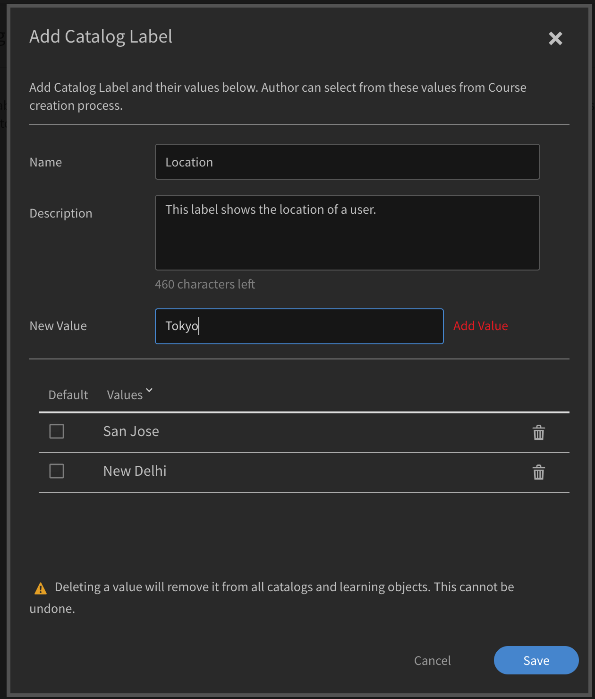

# 카탈로그 레이블

카탈로그 레이블에서는 특정 필드가 있는 학습 객체를 태그하고 하나 이상의 값을 적용할 수 있습니다. 활성화되면 관리자 및 작성자는 카탈로그 레이블 및 값을 설정하고 이를 학습 객체에 연결할 수 있습니다.

이 기능으로 데이터를 쉽게 분류할 수 있습니다. 예를 들어 학습 객체를 위치, 부서 또는 스킬에 따라 분류하고자 할 수 있습니다. 그런 경우에는 필드와 데이터 필터링을 적용할 수 있습니다.

카탈로그 레이블을 활성화하려면 다음 단계를 따르십시오.

* 관리자는 **[!UICONTROL 설정]** > **[!UICONTROL 일반]** > **[!UICONTROL 카탈로그 레이블 표시]**&#x200B;를 엽니다.
* 레이블을 활성화하려면 확인란을 사용합니다.

## 카탈로그 레이블 추가 {#addcataloglabels}

카탈로그 레이블을 추가하려면 다음 단계를 따르십시오.

1. **[!UICONTROL 고급]** 옵션에서 **[!UICONTROL 설정]** > **[!UICONTROL 카탈로그 레이블]**&#x200B;을 엽니다. [!UICONTROL 카탈로그 레이블] 페이지를 엽니다.

   

1. 페이지 오른쪽 상단 모서리에 있는 **[!UICONTROL &#39;카탈로그 레이블 추가&#39;]** 또는 **[!UICONTROL &#39;추가&#39;]**&#x200B;를 클릭합니다. **[!UICONTROL &#39;카탈로그 레이블 추가&#39;]** 대화 상자가 나타납니다.
1. 필드에 카탈로그 레이블 및 해당 값을 추가합니다. 하나의 사용자 정의 필드는 여러 값을 가질 수 있습니다. 작성자는 강의 생성 프로세스 동안 이러한 값 중에서 선택할 수 있습니다.

   

1. **[!UICONTROL 저장]**&#x200B;을 클릭합니다.
1. 레이블을 저장하면 카탈로그 레이블 페이지에 표시됩니다. 필수 값으로 지정할지 여부를 선택할 수 있습니다.

   

## 카탈로그에 레이블 적용 {#applylabelstocatalogs}

카탈로그 레이블을 만들고 다음 단계를 수행하여 해당 레이블을 특정 카탈로그에 적용할 수 있습니다.

1. 왼쪽 창에서 **[!UICONTROL &#39;카탈로그&#39;]**&#x200B;를 클릭합니다. 카탈로그 페이지가 열리고 카탈로그 목록이 표시됩니다.
1. 카탈로그를 선택하고 레이블에 적용합니다.
1. 왼쪽 창에서 &#39;카탈로그 레이블&#39;을 클릭합니다.
1. 오른쪽 상단에서 **[!UICONTROL 편집]**&#x200B;을 클릭합니다. 이 페이지에 사용 가능한 카탈로그 레이블 목록이 표시됩니다.
1. 카탈로그에 레이블을 추가하려면 **[!UICONTROL &#39;카탈로그 추가&#39;]**&#x200B;를 클릭합니다.
1. 카탈로그에 추가된 기존 레이블을 제거하려면 **[!UICONTROL 제거]**&#x200B;를 클릭하십시오.

사용자 정의 필드가 카탈로그에 추가되면, 카탈로그의 일부인 모든 학습 객체에 적용됩니다.
