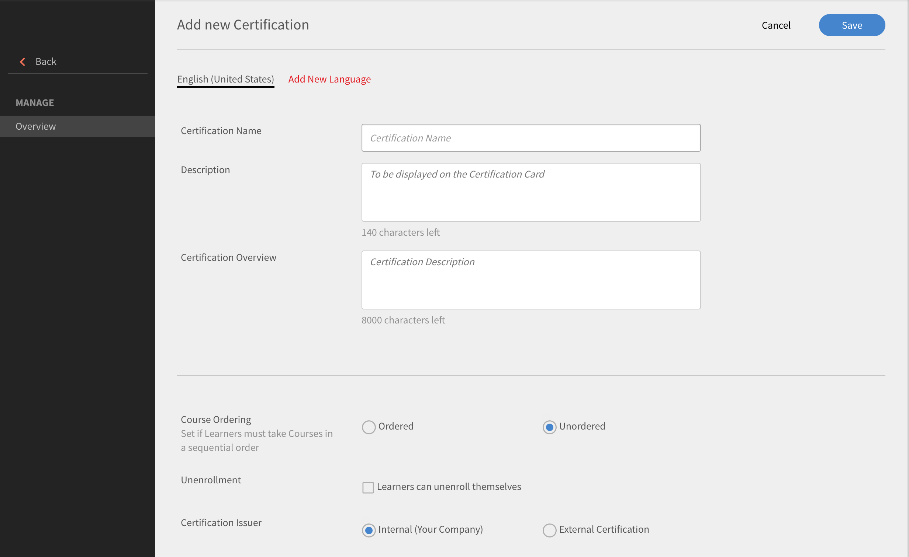

# 인증

인증 생성, 학습자 등록, 게시된 인증 편집 방법을 알아보십시오.

이 기능을 사용하여 일회성으로 또는 반복적으로 학습자를 인증하십시오. 관리자만 학습자를 위한 인증을 정의할 수 있습니다.

관리자는 내부적으로 호스팅하거나 타사가 수행하는 인증 프로그램을 생성할 수 있습니다. 내부 인증에서는 학습자가 인증을 받기 위해 이수해야 하는 강의를 정해야 합니다. 프로그램을 게시하고 학습자에게 할당합니다.

## 인증 생성 {#createacertification}

1. 왼쪽 창에서 **[!UICONTROL 인증]**&#x200B;을 클릭합니다.\
   모든 초안 및 게시된 인증 상태 목록이 있는 페이지가 나타납니다.

1. 다양한 모드에서 인증 보기:

   1. **[!UICONTROL 초안]** 탭을 클릭하여 초안 상태의 모든 인증을 확인합니다. 생성을 완료해야 합니다.
   1. 사용자가 게시한 모든 인증을 보려면 **[!UICONTROL 게시됨]**&#x200B;을 클릭하세요.
   1. 모든 상태의 인증을 보려면 **[!UICONTROL 모두]**&#x200B;를 클릭하십시오.
   1. 인증 목록을 오름차순 또는 내림차순으로 정렬하거나 갱신한 날짜를 기준으로 정렬하고 확인합니다.

1. **[!UICONTROL 추가]**&#x200B;를 클릭합니다.

   새로운 인증 페이지가 나타납니다.

*인증을 추가할 페이지 보기*

1. 인증서 이름 및 설명을 추가합니다.

<table>
 <tbody>
  <tr>
   <th>필드</th>
   <th>설명</th>
  </tr>
  <tr>
   <td>완료 기간</td>
   <td>인증 기한. 숫자 값을 입력합니다.</td>
  </tr>
  <tr>
   <td>유형</td>
   <td>
    
인증 유형:

    <ul>
     <li><b>반복</b>- 매년, 2년 또는 3년마다 인증을 받아야 하는 경우 이 옵션을 선택합니다.</li>
     <li><b>영구적</b>- 인증을 한 번만 받으면 되는 경우 이 옵션을 선택합니다.</li>
    </ul></td>
  </tr>
  <tr>
   <td>다시 할당</td>
   <td>완료 날짜 또는 등록 날짜를 기준으로 인증서를 재할당할지 선택합니다. </td>
  </tr>
  <tr>
   <td>유효성(개월)  </td>
   <td>인증 유효 기간을 지정합니다.</td>
  </tr>
  <tr>
   <td>강의 순서 </td>
   <td>학습자가 순서대로 강의할지 순서에 상관없이 강의를 이수할지 결정합니다. </td>
  </tr>
  <tr>
   <td>등록 취소 </td>
   <td>학습자가 스스로 등록을 취소할 수 있는 옵션을 활성화 또는 비활성화합니다.</td>
  </tr>
  <tr>
   <td>인증 발급자 </td>
   <td>
    
귀사에 속한 경우 <b>내부</b>를 선택하거나 외부 조직 인증에 대해 <b>외부</b>를 선택합니다.

    
<b>외부 인증</b>을 선택하면 2개의 추가 옵션이 표시됩니다.

    <ul>
     <li>승인된 날짜와 동일 </li>
     <li>학습자가 제출함 </li>
    </ul>
    
학습자는 외부 인증에 대한 올바른 완료 날짜를 지정할 수 있습니다. 이전 버전에서는 기본적으로 Prime에서 관리자의 승인 날짜를 기준으로 완료 날짜를 설정했습니다. 학습자가 입력한 완료 날짜는 인증 생성 날짜 이후여야 합니다.
</td>
  </tr>
  <tr>
   <td>지속 기간</td>
   <td>외부 인증을 선택한 경우 지속 기간을 분 단위로 지정하십시오.</td>
  </tr>
  <tr>
   <td>태그</td>
   <td>인증과 연결하려는 태그를 입력합니다. 태그는 인증서 검색 시 유용합니다.</td>
  </tr>
  <tr>
   <td>카탈로그 선택 </td>
   <td>인증서가 포함된 카탈로그를 선택합니다.</td>
  </tr>
 </tbody>
</table>

**[!UICONTROL 다음에 대해 추천]** 섹션에서 제품, 역할 및 역할 수준을 선택하여 해당 제품 및 역할에 관심을 표현한 사용자에게 이 학습 경로를 제안합니다.

*추천*

**[!UICONTROL 강의]** > **[!UICONTROL 카탈로그]** 탭에서 인증에 추가할 강의를 선택하십시오.

각 강의 타일 위에 마우스를 올려놓고 +를 클릭하여 인증에 추가합니다. 강의를 추가하기 전에 학습자로 보려면 **[!UICONTROL 미리 보기]**&#x200B;를 클릭하십시오.

1. **[!UICONTROL 교육 과정]** 탭을 클릭하여 추가한 강의 목록을 보거나 확인합니다.
1. **[!UICONTROL Publish]**&#x200B;를 클릭합니다.

## 인증 매핑을 위한 강의 인스턴스 {#courseinstancemappingforcertifications}

인증에 대한 강의 및 인스턴스를 매핑하는 방법은 다음과 같습니다.

1. 왼쪽 창의 &#39;인증&#39;을 클릭합니다.
1. 인증 목록에서 강의 및 인스턴스를 매핑할 인증의 &#39;인증 보기&#39;를 선택합니다.
1. 왼쪽 창에서 &#39;강의&#39;를 클릭합니다. 인증에 대한 강의가 표시됩니다. &#39;편집&#39;을 클릭합니다.
1. 인스턴스 매핑을 설정할 강의에 마우스를 올리고 &#39;강의 인스턴스 매핑&#39;을 선택합니다.
1. 나타나는 팝업에서 선택한 인증에 보낼 강의 인스턴스를 선택합니다.
1. &#39;저장&#39;을 클릭합니다.

책임자는 학습 프로그램에 강의실 및 가상 강의실 유형의 강의를 추가할 수 있습니다. 작성자가 강의 생성 중 부여한 세션이 기본 인스턴스가 됩니다. 책임자가 학습 프로그램에 강의를 추가하면, 기본적으로 모든 강의의 기본 인스턴스로 매핑됩니다. 하지만 관리자는 인스턴스 매핑을 변경할 수 있습니다. 학습 프로그램에 추가된 강의의 수는 아래에 나타난 것처럼 인스턴스 페이지에서 확인할 수 있습니다.

## 전체 카탈로그 제어 활성화 {#catalog}

학습자 또는 모듈에 대한 전체 [카탈로그 제어를 허용하는 것과 마찬가지로](shared-catalog-full-control.md), 인증서 전체 카탈로그 제어를 활성화할 수 있습니다.

## 인증에 학습자 등록 및 등록 취소 {#enrollorunenrolllearnerstothecertification}

학습자 등록에 필요한 정보 및 단계에 대한 자세한 내용은 [학습자 등록](courses.md#main-pars_header_1058138132)을 참조하십시오.

## 학습자 등록 취소 {#unenrollmentforlearners}

인증을 생성할 때, 관리자는 학습자에게 인증에서 직접 등록을 취소할 수 있는 권한을 줄 지 선택할 수 있습니다. 책임자가 해당 옵션을 선택하면 학습자는 직접 등록을 취소할 수 있습니다.

*학습자 등록 취소 선택*

## 완료 표시 {#markcompletion}

관리자는 옵션을 사용하여 인증 완료 표시를 할 수 있습니다. 인증 완료 표시를 하려면 다음 단계를 따르십시오.

1. **[!UICONTROL 인증]** > **[!UICONTROL 학습자]**&#x200B;를 엽니다.

   등록된 학습자 목록이 있는 학습자 페이지가 열립니다.

1. 각 학습자에 대해 사용 가능한 확인란을 이용하여 인증 완료를 표시할 학습자를 하나/다수/전체 중 선택합니다.
1. **[!UICONTROL 동작]** > **[!UICONTROL 완료 표시]**&#x200B;를 클릭합니다.

   여러 강의에 하나의 인증이 있는 경우 모든 강의에 완료 표시가 된다는 것을 참고하십시오.

## 외부 인증을 위한 필수 강의 {#mandatory}

Learning Manager 초기 릴리스에서는 외부 인증에서 학습자가 강의를 완료하는 것이 인증서를 완료하는 필수 요건이 아니었습니다.

이제 인증 편집 시 교육과정 탭에서 **[!UICONTROL 필수 강의를 인증서 완료를 위한 필수 요건으로 설정]** 옵션을 활성화하여 강의를 필수 강의로 지정할 수 있습니다.

## 게시한 인증 편집 {#editingapublishedcertification}

관리자는 게시된 상태의 인증을 편집할 수 있습니다. 해당 상태에서는 책임자가 인증의 전체 섹션을 편집한 뒤 다시 게시할 수 있습니다.

게시된 인증을 편집하려면 인증 카드를 클릭하고 페이지의 오른쪽 상단에 있는 **[!UICONTROL 편집]**&#x200B;을 클릭합니다.

인증 섹션을 편집하는 중 페이지를 나가면, 인증을 다시 게시해야 합니다. 인증을 다시 게시할 것인지 묻는 확인 대화 상자가 나타납니다.

*인증서 편집*

## 구독 {#subscription}

책임자는 퀴즈 점수와 학습자 상태 보고서를 가져올 수 있습니다. 보고서 빈도, 전자 메일 주제, 수신자 전자 메일 ID를 설정할 수 있습니다. 설정된 빈도에 따라 수신자는 보고서가 첨부된 전자 메일을 수신합니다.

*보고서 빈도 및 기타 속성 설정*
