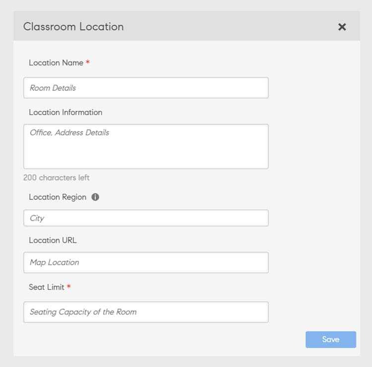
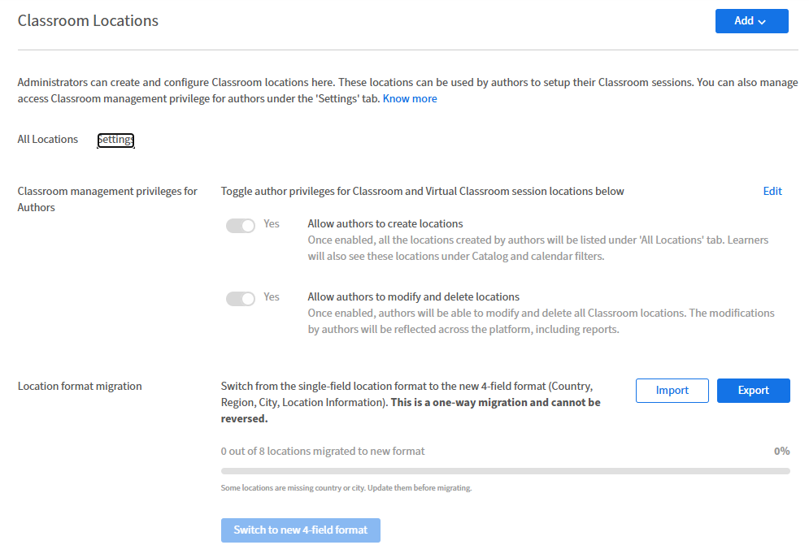
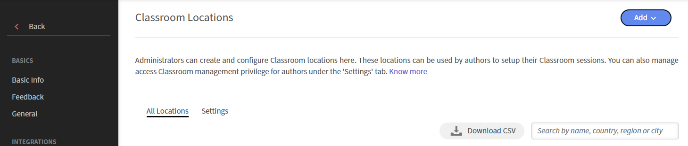
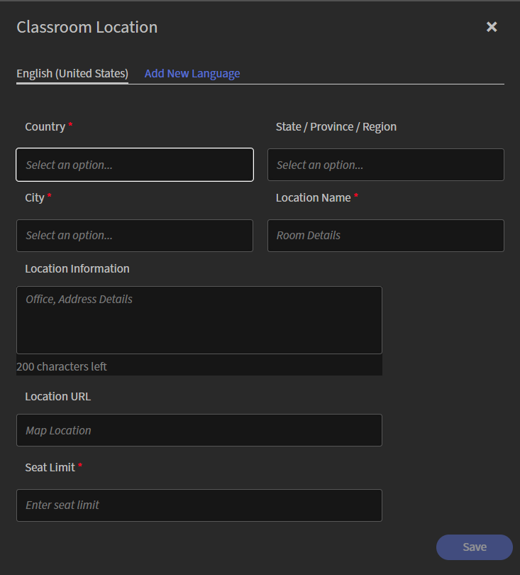
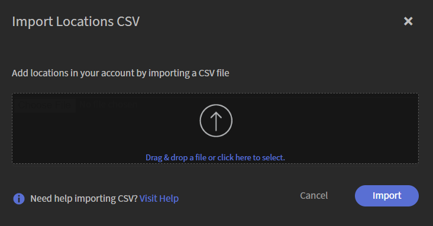
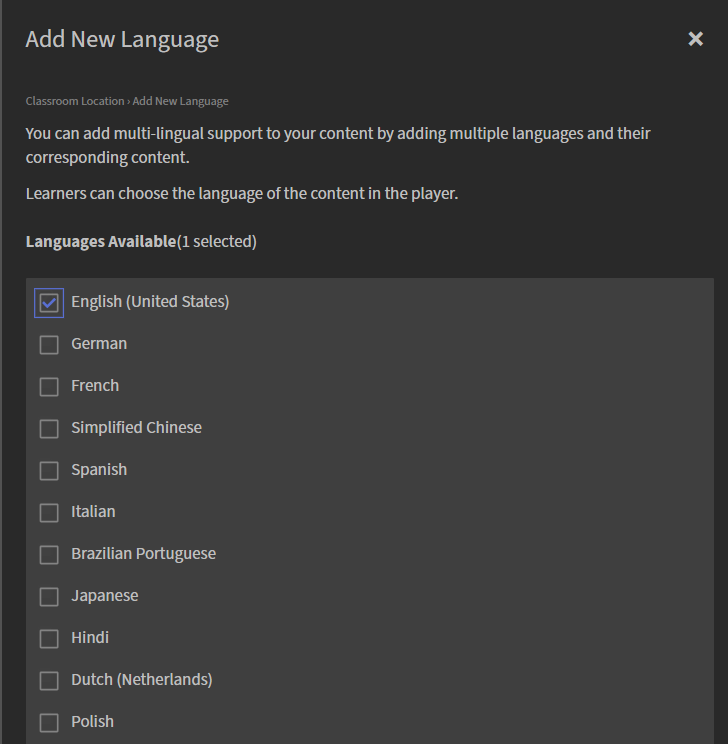
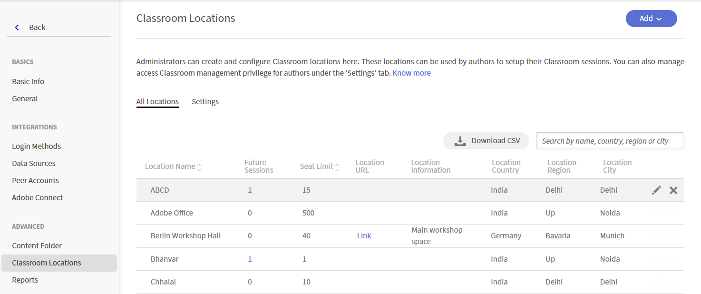
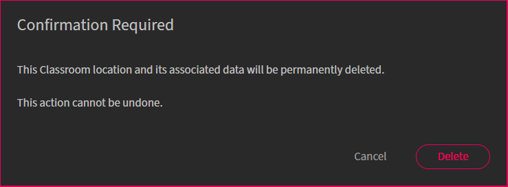

# 강의실 위치 추가

책임자는 강의실 및 가상 강의실 모듈에서 강사 주도 교육 이벤트를 설정할 때 재사용할 강의실 위치 라이브러리를 만들고 관리할 수 있습니다. 각 위치에 대해 위치 이름, 인원 제한 및 위치 URL을 포함한 추가 정보와 같은 세부 정보를 정의할 수 있습니다. 그러면 작성자는 강의를 생성할 때 이러한 미리 정의된 위치를 선택할 수 있습니다.

기본적으로 Adobe Learning Manager은 단일 필드 위치 형식을 사용합니다. 여러 국가와 언어로 강의실 위치를 관리하는 조직의 경우 Learning Manager는 **국가**, **시/도/지역**, **시** 및 **위치 이름**&#x200B;을 포함하는 구조화된 4개 필드 형식도 지원합니다. 이 형식은 위치 기반 필터링 및 개별 위치에 대한 언어 지원과 같은 추가 기능을 제공합니다. 관리자는 1회 마이그레이션을 통해 4개 필드 형식으로 전환할 수 있습니다.

>[!NOTE]
>
>4개 필드 위치 형식이 활성화되지 않은 경우 작성자와 학습자는 평소와 같이 강의실 위치를 계속 사용할 수 있습니다. 기존의 단일 필드 위치 형식은 그대로 사용할 수 있으며 변경할 필요가 없습니다. 자세한 내용은 [4개 필드 메서드로 마이그레이션](#migrate-classroom-locations-to-the-four-field-format)을 참조하세요.

## 강의실 위치 설정 구성

책임자는 작성자가 강의실 위치를 만들고 관리할 수 있는지 여부를 제어할 수 있습니다. 작성자가 사용할 수 있는 액세스 수준을 정의하려면 **강의실 위치** 설정을 사용합니다.

**강의실 위치** 설정을 구성하려면:

1. **관리자**(으)로 Adobe Learning Manager에 로그인합니다.
1. **설정** > **강의실 위치**&#x200B;를 선택합니다.

   **강의실 위치** 페이지가 표시됩니다.

1. **설정** 탭을 선택합니다.

   

   ***설정**탭에서 강의실 및 가상 강의실 위치에 대한 작성자 권한을 활성화합니다.*

1. **편집**&#x200B;을 선택합니다.

   토글을 편집할 수 있게 되어 다음 설정을 업데이트할 수 있습니다.

   | **설정** | **설명** |
   |---|---|
   | **작성자가 위치를 만들 수 있도록 허용** | 작성자가 강사 주도 교육 세션을 만들 때 강의실 및 가상 강의실 모듈 위치를 만들 수 있도록 하려면 이 옵션을 활성화합니다. |
   | **작성자가 위치를 수정하고 삭제할 수 있도록 허용** | 작성자가 강의실 및 가상 강의실 위치를 편집하거나 삭제할 수 있도록 하려면 이 옵션을 활성화합니다. |

1. **저장**&#x200B;을 선택합니다.

## 강의실 위치 생성 및 관리

책임자는 작성자가 강의실 및 가상 강의실 교육 세션을 만들 때 재사용할 수 있는 강의실 위치를 만들고 관리할 수 있습니다. Adobe Learning Manager은 다음 두 가지 위치 형식을 지원합니다.

* **단일 필드 형식**: 각 강의실 위치는 단일 **위치 이름** 필드로 식별됩니다. 자세한 내용은 [단일 필드 형식을 사용하여 강의실 위치 추가](#add-a-classroom-location-using-a-single-field-format)를 참조하세요.
* **4개 필드 형식**: 각 강의실 위치는 **국가**, **시/도/지역**, **시** 및 **위치 이름**&#x200B;으로 구성되어 있어 여러 지역에서 위치를 더 쉽게 관리할 수 있습니다. 계정이 현재 단일 필드 형식을 사용하는 경우 4개 필드 형식으로 전환하기 전에 일회성 마이그레이션을 완료하십시오. 자세한 내용은 [4개 필드 메서드로 마이그레이션](#migrate-classroom-locations-to-the-four-field-format)을 참조하세요.

### 단일 필드 형식을 사용하여 강의실 위치 추가

단일 필드 형식을 사용하여 강의실 위치를 추가할 수 있습니다.

1. **관리자**(으)로 Adobe Learning Manager에 로그인합니다.
1. **설정** > **강의실 위치**&#x200B;를 선택합니다.
1. **추가** > **새 위치**&#x200B;를 선택합니다.
1. **강의실 위치** 대화 상자에 다음 세부 정보를 입력하십시오.

   1. **위치 이름**&#x200B;을 입력하십시오. 고유한 이름을 사용합니다. 그렇지 않으면 Learning Manager에 오류 메시지가 표시됩니다.
   1. **위치 정보** 필드에 위치 설명을 입력합니다. 이 필드는 선택 사항입니다.
   1. **위치 URL**&#x200B;을 입력합니다. 학습자는 강의실 세부 정보에서 해당 정보를 확인할 수 있습니다. 필요한 경우 URL은 지도 위치 URL 일 수도 있습니다. 선택적 필드입니다.
   1. **위치 영역**&#x200B;을 입력하고 선택합니다. 이 필드는 선택 사항입니다.
   1. **인원 제한** 필드에 사용 가능한 인원 수를 입력합니다. 이것은 강의실의 좌석 수를 나타냅니다. 이 값은 실제 강사 주도 교육 이벤트 생성 시 변경될 수 있습니다.
      
      *단일 필드 형식을 사용하여 강의실 위치를 추가합니다.*

### 강의실 위치를 4개 필드 형식으로 마이그레이션

계정에서 기존 단일 필드 강의실 위치 형식을 사용하는 경우 4개 필드 형식을 활성화하기 전에 기존 강의실 위치를 마이그레이션하십시오. 4개 필드 형식은 위치 데이터를 **국가**, **시/도/지역**, **시** 및 **위치 이름**&#x200B;으로 구성하므로 여러 지역에서 위치를 더 쉽게 관리할 수 있습니다.

이 마이그레이션은 일회성 프로세스입니다. 4개 필드 형식으로 전환한 후에는 단일 필드 형식으로 계정을 되돌릴 수 없습니다.

기존 위치를 마이그레이션하려면 다음을 수행하십시오.

1. **관리자** > **강의실 위치**&#x200B;로 이동하고 **설정** 탭을 선택합니다.
1. **위치 형식 마이그레이션** 섹션에서 **내보내기**&#x200B;를 선택합니다.

   기존 강의실 위치가 있는 CSV 파일이 다운로드됩니다. 다음 열을 사용할 수 있습니다.

   1. **room_id**: 위치의 고유 식별자입니다.
   1. **로캘**: 번역된 위치 이름 및 위치 정보에 대한 로캘입니다.
   1. **이름**: 강의실 이름입니다.
   1. **국가**: 강의실이 있는 국가입니다.
   1. **상태**: 강의실이 있는 주, 시 또는 지역입니다.
   1. **도시**: 교실이 있는 도시입니다.
   1. **정보**: 건물 이름, 층 또는 방 번호와 같은 추가 세부 정보입니다.
   1. **url**: 지도 링크와 같이 위치와 연결된 URL입니다.
   1. **좌석 제한**: 강의실의 최대 좌석 수.

   >[!NOTE]
   >
   >4필드 형식이 활성화되지 않은 경우에도 내보낸 CSV에는 항상 4필드 위치 형식 열이 포함됩니다.

   

   *4필드 위치 형식으로 전환하기 전에 마이그레이션 진행 상황을 확인하십시오.*

1. 각 열 이름에 대해 CSV 파일을 국가, 주, 구/군/시 등의 필수 정보와 함께 업데이트합니다.
1. **가져오기**&#x200B;를 선택한 다음 업데이트된 CSV 파일을 업로드합니다.

   Adobe Learning Manager은 데이터의 유효성을 검사하고 마이그레이션 진행률을 업데이트합니다.

1. 마이그레이션 진행률 표시줄이 100%에 도달하면 **새로운 4필드 형식으로 전환**&#x200B;을 선택합니다. **위치 형식 마이그레이션** 상태가 **마이그레이션 완료**(으)로 업데이트됩니다.

   

   *위치 형식 마이그레이션이 마이그레이션 완료 상태로 업데이트됩니다.*

## 4개 필드 형식을 사용하여 강의실 위치 추가

1회 마이그레이션을 완료한 후 책임자는 4개 필드 형식으로 강의실 위치를 만들 수 있습니다. 그러면 작성자는 강사 주도 교육 세션을 만들 때 이러한 위치를 재사용할 수 있습니다. 책임자는 강의실 위치를 개별적으로 추가하거나 CSV 파일에서 여러 강의실 위치를 가져올 수 있습니다.

### 강의실 위치 추가

강의실 위치를 사용하면 교육 장소를 표준화하고 작성자의 세션 예약을 간소화할 수 있습니다.

강의실 위치를 추가하려면:

1. 책임자 앱에서 **설정** > **강의실 위치**&#x200B;를 선택합니다.

   

   *강의실 위치를 추가하려면&#x200B;**모든 위치**탭을 선택하십시오.*

1. 오른쪽 상단에서 **추가** > **새 위치**&#x200B;를 선택합니다.

   **강의실 위치** 팝업 창이 나타납니다.

   

   *강의실 위치 팝업 창에 세부 정보를 입력합니다.*

1. **강의실 위치** 팝업 창에서 다음 세부 정보를 입력합니다.

   | **필드** | **설명** |
   |---|---|
   | **국가** | 강의실이 있는 국가를 선택합니다. |
   | **시/도/지역** | 주, 시/도 또는 지역을 선택합니다. |
   | **구/군/시** | 교실이 위치한 도시를 선택합니다. |
   | **위치 이름** | 강의실 또는 강의실 이름을 입력합니다. |
   | **위치 정보** | 건물 이름, 층 또는 방 번호와 같은 추가 세부 정보를 입력합니다. |
   | **위치 URL** | 지도 링크와 같이 해당 위치의 URL을 입력합니다. |
   | **인원 제한** | 강의실의 최대 수용 인원을 입력합니다. |

1. **저장**&#x200B;을 선택합니다.

   강의실 위치가 **모든 위치** 탭에 저장되고 나열됩니다.

### 강의실 위치를 대량으로 가져오기

일괄 가져오기를 사용하여 여러 강의실 위치를 추가하거나 CSV 파일을 사용하여 기존 위치를 업데이트합니다.

강의실 위치를 대량으로 가져오려면:

1. 책임자 앱에서 **설정** > **강의실 위치**&#x200B;를 선택합니다.
1. **모든 위치** 탭에서 **CSV 다운로드**&#x200B;를 선택합니다.

   기존 강의실 위치가 포함된 CSV 파일이 다운로드됩니다. 다음 열을 사용할 수 있습니다.

   1. **room_id**: 위치의 고유 식별자입니다.
   1. **로캘**: 번역된 위치 이름 및 위치 정보에 대한 로캘입니다.
   1. **이름**: 강의실 이름입니다.
   1. **국가**: 강의실이 있는 국가입니다.
   1. **상태**: 강의실이 있는 주, 시 또는 지역입니다.
   1. **도시**: 교실이 있는 도시입니다.
   1. **정보**: 건물 이름, 층 또는 방 번호와 같은 추가 세부 정보입니다.
   1. **url**: 지도 링크와 같이 위치와 연결된 URL입니다.
   1. **좌석 제한**: 강의실의 최대 좌석 수.

1. 각 열 이름에 대해 CSV 파일을 국가, 주, 구/군/시 등의 필수 정보와 함께 업데이트합니다.
1. 오른쪽 상단에서 **추가** > **일괄 가져오기 위치**&#x200B;를 선택합니다.

   **위치 CSV 가져오기** 팝업 창이 나타납니다.

   

   *업데이트된 정보가 포함된 CSV를 끌어서 놓습니다.*

1. 업데이트된 CSV 파일을 업로드 영역으로 끌어다 놓습니다.
1. **가져오기**&#x200B;를 선택합니다.

   강의실 위치가 업데이트됩니다.

## 강의실 위치에 번역 추가

**위치 이름** 및 **위치 정보** 필드에 대한 번역을 추가하여 학습자가 선호하는 언어로 강의실 위치 세부 정보를 표시합니다.

강의실 위치에 대한 번역을 추가하려면:

1. **강의실 위치**&#x200B;에서 **모든 위치** > **추가**&#x200B;를 선택합니다.
1. **새 위치**&#x200B;를 선택합니다.

   **강의실 위치** 팝업 창이 나타납니다.

1. **새 언어 추가**&#x200B;를 선택합니다.

   **새 언어 추가** 팝업 창이 나타납니다.

   

   *새 언어 추가 팝업 창에서 언어를 선택합니다.*

1. **저장**&#x200B;을 선택합니다.

   번역이 저장되고 사용자에게 표시됩니다.

>[!NOTE]
>
>**위치 이름** 및 **위치 정보** 필드만 번역을 지원합니다. **국가**, **시/도/지역** 및 **시**&#x200B;와 같은 위치 세부 정보는 번역되지 않습니다.

## 강의실 위치 편집

강의실 위치를 편집하려면 다음 단계를 따르십시오.

1. 책임자 앱에서 **설정** > **강의실 위치**&#x200B;를 선택합니다.
1. 편집하려는 강의실 위치 위로 마우스를 가져갑니다.

   

   *필요한 강의실 위치 위로 마우스를 가져가서 편집 아이콘을 선택합니다.*

1. **강의실 위치 편집** 아이콘을 선택합니다.

   강의실 위치 팝업 창이 나타납니다.

1. 강의실 위치를 수정하고 **저장**&#x200B;을 선택합니다.

## 강의실 위치 삭제

강의실 위치를 삭제하려면 다음 단계를 따르십시오.

1. 책임자 앱에서 **설정** > **강의실 위치**&#x200B;를 선택합니다.
1. 삭제하려는 강의실 위치 위로 마우스를 가져갑니다.
1. **강의실 위치 삭제** 아이콘을 선택합니다.

   확인 필요 팝업 창이 나타납니다.

   

   *삭제를 선택하여 강의실 위치 삭제를 확인합니다.*

1. **삭제**&#x200B;를 선택합니다.

## 자주 묻는 질문

1. **마이그레이션이 완료된 후 기존 강의실 위치는 어떻게 됩니까?** 
4개 필드 위치 형식은 모든 기존 위치가 수동으로 또는 CSV 업로드를 통해 마이그레이션된 후에만 활성화할 수 있습니다. 4개 필드 형식이 활성화되면 강의실 위치를 사용하는 모든 기존 강의의 위치가 새 형식으로 표시됩니다.

1. **내보낸 CSV를 4개 필드 위치 형식과 일치하도록 수동으로 다시 구성해야 합니까?** 
아니요. 내보낸 CSV 파일은 현재 활성화 여부에 관계없이 항상 4개 필드 위치 형식을 사용합니다. 파일을 가져오기 전에 누락된 값만 업데이트하면 됩니다.

1. **마이그레이션이 Adobe Learning Manager 보고서에 영향을 줍니까?** 
예. 마이그레이션 후 강의실 위치 정보가 포함된 보고서에는 다음 형식으로 위치가 표시됩니다.

   **국가 > 시/도/지역 > 구/군/시 > 위치 이름**

   이 형식은 이전의 단일 필드 위치 값을 대체합니다.

1. **4개 필드 위치 형식을 사용하지 않으면 어떻게 됩니까?** 
작성자 또는 학습자에 대해서는 변경된 사항이 없습니다. 책임자가 마이그레이션을 완료하고 4개 필드 형식을 활성화할 때까지 강의실 위치는 기존 단일 필드 형식을 사용하여 오늘과 같이 계속 나타나고 작동합니다.
