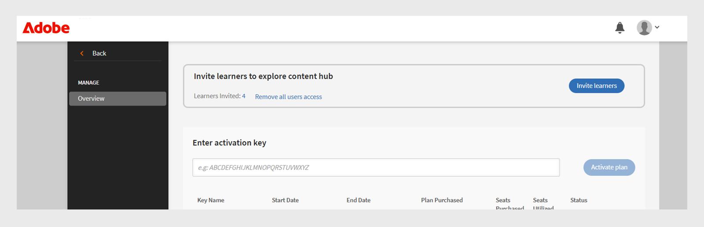

# 콘텐츠 마켓플레이스

학습 책임자는 양질의 콘텐츠를 소싱 및 업로드하는 데 종종 어려움을 겪습니다. Adobe Learning Manager의 콘텐츠 마켓플레이스는 신뢰할 수 있는 공급자의 프리미엄 과정에 대한 라이선스를 허용하여 이를 간소화하고 더 빠르고 확장 가능한 학습 전달을 활성화합니다. 콘텐츠 마켓플레이스를 사용하여 관리자는 공급자의 서드파티 강의를 찾아보고, 미리 보고, 라이선스를 부여할 수 있습니다.

콘텐츠 마켓플레이스에서는 콘텐츠 획득을 위한 다음과 같은 플랜을 제공합니다.

* **[!UICONTROL 프리미엄 필수 정보]**
* **[!UICONTROL 프리미엄 필수 패키지]**

| **[!UICONTROL 프리미엄 필수 정보]** | **[!UICONTROL 프리미엄 필수 패키지]** |
|---|---|
| 90,000개 이상의 강의 이용 | 100,000개 이상의 강의 이용 |
| 250개 이상의 공급자의 콘텐츠 | 모든 프리미엄 필수 콘텐츠 포함 |
| 신뢰할 수 있는 공급자의 전용 콘텐츠:<li>이지라마</li><li>스킬슈브</li><li>톰슨 로이터</li><li>엠트레인</li><li>Harvard ManageMentor</li> | 다음과 같은 최상위 공급자의 전용 강의: <li>블린키스트</li><li>Pluralsight</li>Skillsoft</li><li>탄력 있는</li><li>쿠르세라</li> |

<!--**[!UICONTROL Premium Essentials]**:
A cost-effective solution designed to enhance employee engagement. 

* Access to over 90,000 courses
* Content from more than 250 providers
* Focus on compliance and skill improvement
* Exclusive content from trusted providers such as:
   * EasyLlama
   * Skillshub
   * Thomson Reuters
   * Emtrain
   * Harvard ManageMentor

**[!UICONTROL Premium Essentials Plus]**:

* Access to more than 100,000 courses
* Includes all Premium Essentials content
* Exclusive courses from top providers like:
   * Blinkist
   * Pluralsight
   * Skillsoft
   * Traliant
   * Coursera

Select the plan that best meets your organization's learning goals and budget.-->

## 공급자로부터 콘텐츠 획득

콘텐츠 공급자로부터 콘텐츠를 검색하고 얻으려면 다음 단계를 따르십시오.

1. 관리자 홈 페이지에서 **[!UICONTROL 콘텐츠 마켓플레이스]**&#x200B;를 선택합니다. **[!UICONTROL 콘텐츠 마켓플레이스]** 페이지가 나타납니다.

   
   _콘텐츠 마켓플레이스 페이지에서 구매 플랜 보기_

2. 관리자는 **[!UICONTROL 프리미엄 필수]** 및 **[!UICONTROL 프리미엄 필수 플러스]** 플랜에 대한 콘텐츠 허브를 미리 보고 탐색할 수 있습니다.

콘텐츠 제공업체는 오래된 콘텐츠 제거를 관리하여 사전 통지 없이 사용 중지되는 학습 자료가 없도록 합니다.

<!--Learning Manager now offers Content Marketplace for you to explore and purchase trainings. Explore 70,000+ courses that cover a wide range of topics, available in multiple formats. Choose from curated playlists that cater to a vast variety of roles and meet your learning and upskilling needs.

In the Administrator app, there is a new option **[!UICONTROL Content Marketplace]**, which you'll find on the left panel.

Users can purchase from curated playlists covering various topics or purchase the entire catalog. 

On the page, you can see two tiles, Enterprise Training and Creative Cloud Training. The first tile launches the marketplace, using which you can acquire courses for your learners. The latter launches the content catalog.

The Enterprise Training page in the Administrator app enables you to invite users and download the Express Interest report, and also purchase the entire catalog or curated playlist.-->

## 견적 요청

관리자는 Premium Essentials 또는 Premium Essentials Plus 와 같은 플랜을 선택하고, 필요한 시트 수를 지정하고, 다운로드 가능한 Quote 요청 양식을 생성할 수 있습니다. 완료되면 처리를 위해 양식이 Adobe Learning Manager 영업팀으로 전송됩니다. Request for Quote 프로세스를 통해 Adobe은 조직의 요구 사항에 따라 사용자 정의된 Pricing 을 제공할 수 있습니다.

견적 요청을 다운로드하려면 다음 단계를 수행합니다.

1. 관리자 홈페이지에서 **[!UICONTROL 콘텐츠 마켓플레이스]**&#x200B;를 선택합니다.

2. 라이선스 유형을 선택하고 **[!UICONTROL 견적 요청]** 섹션에서 견적을 생성할 시트 수를 입력합니다.

3. 견적을 다운로드하려면 **[!UICONTROL 견적 요청 다운로드]**&#x200B;를 선택하십시오.

_플랜 선택 후 견적 요청 다운로드_

견적을 [learningmanagersales@adobe.com](mailto:learningmanagersales@adobe.com)에 보내 라이선스를 활성화하십시오. Adobe 고객 성공 관리자에게 문의하여 구매 프로세스를 시작할 수도 있습니다.

## 콘텐츠 허브에 학습자 초대

콘텐츠 마켓플레이스에 학습자를 초대하여 콘텐츠를 살펴보고 관심을 표현하십시오. 관리자는 계정의 모든 학습자를 초대하거나 선택한 학습자를 초대할 수 있습니다. 학습자가 콘텐츠를 살펴보려면 먼저 초대해야 합니다. 콘텐츠 허브에 대한 자세한 내용은 [문서](/help/migrated/administrators/feature-summary/content-marketplace.md#content-hub)를 참조하십시오.

학습자를 초대하려면 다음 작업을 수행하십시오.

1. 관리자 홈페이지에서 **[!UICONTROL 콘텐츠 마켓플레이스]**&#x200B;를 선택합니다.
2. **[!UICONTROL 학습자 초대]**&#x200B;를 선택하고 필요한 학습자를 선택합니다.
3. **[!UICONTROL 학습자 초대]**&#x200B;를 선택합니다.

관리자는 **[!UICONTROL 모든 사용자 액세스 제거]** 링크를 선택하여 **[!UICONTROL 콘텐츠 허브]**&#x200B;에 대한 액세스 권한을 해지할 수도 있습니다. 액세스가 취소되면 학습자 앱에서 콘텐츠 허브 페이지가 더 이상 표시되지 않습니다.

_콘텐츠 허브에 액세스하도록 사용자 초대_

기본적으로 이 옵션은 모든 새 계정에 대해 활성화됩니다. 기존 계정의 경우 관리자는 학습자가 콘텐츠 마켓플레이스에 액세스하도록 수동으로 초대해야 합니다.

<!--## Purchase

You get unlimited access to the entire library of courses. Click the **[!UICONTROL Purchase]** button to download a Purchase Request form.

*Enter the number of seats to purchase*

Specify the number of seats for which you want to purchase the courses for. Download the purchase request form and then send the form to the sales team of Learning Manager.

The team will then validate the information and then generate a key, which will be provided to you. This is the activation key using which you'll grant access to your users to the content offering.

After the key is generated by the CSAM team, the Administrator can use the key to import the courses, and migrate the courses into the existing catalog or the new catalog.

During migration of courses, the status displays as **[!UICONTROL Importing Courses]**. Once the migration completes, the Administrator gets a notification that migration is complete and successful.

The **[!UICONTROL Licenses]** section then displays all the licenses that are acquired for the account.

The Administrator can see the links of the purchased catalogs in the Catalog Overview page.

Once the courses are added to the catalog, the Administrator can then grant access to the trainings to various user or user groups.

*Grant access to training to users and user groups*-->

<!--## Express interest report

When a learner clicks Express interest to Catalog in the Learner app, the interest is recorded in an Express interest report. The Administrator can download the report. The report (csv) contains the following fields:

* Name of the catalog
* Number of users expressing interest
* Email of the user expressing interest-->

## 콘텐츠 허브

콘텐츠 허브를 통해 책임자는 학습자 앱의 필수 플레이리스트를 관심 목록에 추가할 수 있습니다. 학습자 역할의 관리자에게는 콘텐츠 허브 페이지가 매번 표시되므로 플레이리스트를 쉽게 관심 목록에 추가할 수 있습니다. 책임자는 본인의 계정에 있는 일부 SME에게만 이 페이지에 대한 액세스를 허용하여 적합한 플레이리스트를 관심 목록에 추가하도록 도울 수 있습니다.

Adobe Learning Manager은 콘텐츠 허브와 정기적으로 동기화하여 새로운 추가 및 업데이트가 플랫폼에 자동으로 반영되도록 합니다.

모든 컨텐츠가 지원되는 언어로 매핑되므로 관리자가 언어 환경 설정에 따라 컨텐츠를 보다 효과적으로 필터링하고 관리할 수 있습니다.

## 전자 메일 템플릿

Adobe Learning Manager은 관리자와 학습자에게 콘텐츠 구매, 시스템 업데이트 및 학습 활동을 알리는 사전 구성된 이메일 템플릿을 제공합니다.

사용할 수 있는 전자 메일 템플릿은 세 가지입니다.

1. **[!UICONTROL 콘텐츠 활성화 성공]:** 타사 콘텐츠를 성공적으로 구매한 후 관리자에게 보냈습니다. 이 알림은 활성화가 완료되었으며 시스템에서 학습자 할당을 위해 구매한 콘텐츠를 사용할 수 있음을 확인합니다.
2. CSV를 통한 자동 사용자 가져오기가 실패하면 **[!UICONTROL 자동 사용자 업로드 실패]:**&#x200B;가 트리거됩니다. 이 경고는 관리자가 예약된 사용자 업데이트 문제를 빠르게 식별하여 수정 작업을 수행할 수 있도록 합니다.
3. **[!UICONTROL 콘텐츠를 살펴보려면 사용자 초대]:** 관리자가 마켓플레이스에서 콘텐츠를 구매하면 학습자에게 전송되는 초대 전자 메일입니다. 이후 사용자는 학습 여정을 즉시 시작할 수 있습니다.

<!--Purchased courses cannot be added in recurring certificates.
Purchased courses cannot be shared to peer accounts.
Purchased courses can be consumed by all users who get access to it. Configure the catalog visibility to restrict the visibility of purchased courses to limited users.
Purchased courses cannot be consumed once the activation key expires. Please purchase/activate another key to allow consumption.-->

<!--## Content Hub in Content Marketplace

Content Hub allows Administrators and Subject Matter Experts (SMEs) to shortlist required playlists from learner app. Once shortlisted, Admins can download the Purchase Request Form and share it with the Adobe Sales agent.

An Admin can invite SMEs to shortlist the playlist which they are interested in. 

*Launch Content Hub from the marketplace*

Content Hub is available in Learner role for all Administrators. Administrators allow SMEs to shortlist the playlist which they are interested in purchasing.

The Content Hub page is visible to Administrators in their learner role all the time as it allows them to shortlist playlists easily. To help you in shortlisting the right playlist, Admins can make this page accessible to limited Subject matter experts in their account. Just visit the Enterprise Training page on Admin side and take steps to provide access.  

*View resources in the Content hub*

Learning Manager also enables Administrators to download a shortlisted playlist and share it with Adobe Sales team. Before downloading the shortlist, visit the Content Hub and shortlist a playlist by adding a playlist to your library. 

Then as Administrator, click **[!UICONTROL Content Marketplace]** > **[!UICONTROL Enterprise Training]** > **[!UICONTROL Purchase section]** > **[!UICONTROL Curated Playlists]**. Click the **[!UICONTROL Purchase]** button to download the Purchase request form which contains the details of your shortlisted playlist.

*Download the Purchase Request form*

The courses and Playlist which you see in the Content Hub are the same as what you see in the Content Marketplace. Content Hub simply provides an ability for Administrators and limited SMEs to shortlist playlist easily for purchase.-->
