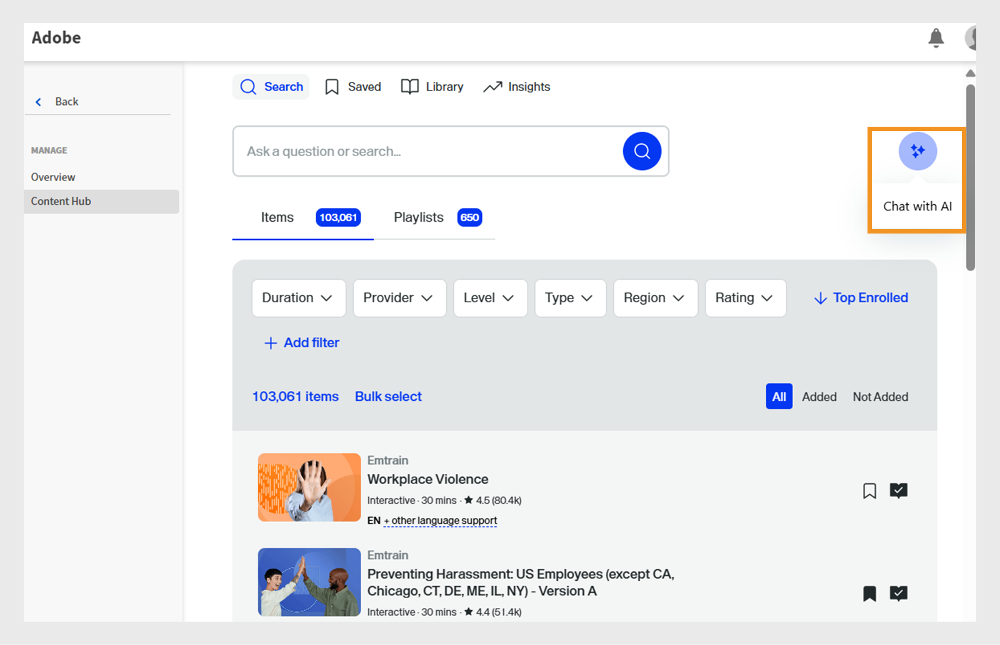

# 학습 경로에 Go1 과정 큐레이션

관리자는 종종 여러 저장소 또는 카탈로그에서 강의를 큐레이션해야 하므로 최적의 옵션을 식별하기가 어렵습니다. 이는 수천 개의 코스를 이용할 수 있는 Go1에서는 특히 어렵습니다. 이를 단순화하기 위해 학습 경로 생성 플로우 내에서 직접 AI 기반 큐레이션 기능을 제공합니다. 이를 통해 책임자는 가장 관련성이 높은 강의를 빠르게 찾고 선택할 수 있습니다

Go1 강의를 학습 경로 및 인증에 직접 추가합니다. Go1 과정이 포함된 학습 경로를 생성하면 학습자가 교육의 일부로 선택한 Go1 과정에 액세스할 수 있습니다.

>[!INFO]
>
>학습 경로 또는 인증에 Go1 강의를 추가하려면 활성 Go1 라이선스가 필요합니다. Go1 라이선스 세부 사항에 대해 자세히 알아보려면 이 [문서](/help/migrated/administrators/feature-summary/content-marketplace.md)를 확인하세요.

## 학습 경로 생성

Go1 강의로 학습 경로를 생성하려면

1. 관리자 권한으로 Adobe Learning Manager에 로그인합니다.
2. 왼쪽 탐색 창에서 **[!UICONTROL 학습 경로]**&#x200B;를 선택합니다.
3. **[!UICONTROL 추가]**&#x200B;를 선택합니다.

   
   _학습 경로 섹션에서 추가를 선택하여 학습자를 위한 구조화된 새 교육 프로그램을 만들고 구성하십시오_

4. 필요한 세부 정보를 입력하고 **[!UICONTROL 저장]**&#x200B;을 선택합니다. 자세한 내용은 이 [문서](/help/migrated/administrators/feature-summary/learning-paths.md)를 참조하세요.
5. 다음과 같은 방법으로 학습 경로에 강의를 추가할 수 있습니다.

   * **[!UICONTROL 강의 또는 학습 경로 추가]**: Adobe Learning Manager에서 사용할 수 있는 기존 강의 또는 학습 경로를 추가합니다.
   * **[!UICONTROL Go1에서 콘텐츠 큐레이션]**: Go1 플랫폼에서 강의를 추가합니다.
6. **[!UICONTROL Go1에서 콘텐츠 큐레이션]**&#x200B;을 선택합니다.

   
   _영업 엔지니어의 스킬 개발 플레이리스트에 Go1 강의를 추가하여 선별된 서드파티 콘텐츠로 학습 옵션을 확장하세요._
7. 책임자는 다음과 같은 방법으로 재생 목록을 만들 수 있습니다.

   * **[!UICONTROL Go1 AI 도우미]**&#x200B;를 사용하고 있습니다. 자세한 내용은 [Go1 AI 도우미](/help/migrated/administrators/feature-summary/content-marketplace/curate-go1-playlist.md#go1-ai-assistant)를 참조하세요.
   * **[!UICONTROL 라이브러리]**&#x200B;에서 **[!UICONTROL 재생 목록 만들기]**&#x200B;를 선택하고 다음 중 하나를 선택합니다.
a. **[!UICONTROL AI로]**: AI를 사용하여 플레이리스트를 만듭니다. 자세한 내용은 이 [섹션](/help/migrated/administrators/feature-summary/content-marketplace/curate-go1-playlist.md#create-a-playlist-with-ai)을(를) 참조하세요.
b. **[!UICONTROL 직접]**: 강의를 수동으로 추가하여 재생 목록을 만듭니다. 자세한 내용은 이 [섹션](/help/migrated/administrators/feature-summary/content-marketplace//curate-go1-playlist.md#create-a-playlist-manually)을(를) 참조하세요.

### Go1 AI Assistant

Adobe Learning Manager은 관리자가 쉽게 강의 큐레이션을 진행할 수 있도록 AI 기반 지원을 제공합니다. 콘텐츠 허브 페이지에서 사용할 수 있는 AI 어시스턴트를 통해 관리자는 질문을 하고, 개인화된 추천을 받고, 플레이리스트를 즉시 만들 수 있습니다. 또한 AI 지원이 학습 경로 생성 플로우에 통합되어 관리자가 Go1과 같은 대형 카탈로그에서 가장 관련성이 높은 강의를 빠르게 식별할 수 있습니다. 이러한 기능을 통해 큐레이션 프로세스를 간소화하고 시간을 절약하며 학습자가 최상의 콘텐츠를 제공받을 수 있습니다.

AI로 플레이리스트를 만들려면 다음을 수행하십시오.

1. Go1 콘텐츠 허브에서 **[!UICONTROL AI와 채팅]** 옵션을 선택합니다.

   
   _AI와 채팅 옵션을 표시하는 콘텐츠 허브 화면, 여기서 관리자는 AI 길잡이와 상호 작용하여 질문할 수 있습니다_

2. 질문을 입력하고 **[!UICONTROL 보내기]**&#x200B;를 선택합니다.

   
   관리자가 질문을 입력하고, 강의 추천을 받고, 필요에 맞는 재생 목록을 즉시 만들 수 있는 _AI 도우미 화면_
3. 스킬을 선택한 다음 **[!UICONTROL 하나의 목록으로 컴파일]**&#x200B;을 선택합니다.

   
   재생 목록을 선택하고 컴파일할 수 있는 관련 기술을 표시하는 _AI 도우미 화면_
4. **[!UICONTROL 재생 목록으로 변환]**&#x200B;을 선택합니다.

   
   _모든 강의를 플레이리스트로 컴파일하기 위해 [재생 목록으로 변환] 옵션을 표시하는 AI 도우미 화면_

5. **[!UICONTROL 재생 목록 보기]**&#x200B;를 선택합니다.

   
   _재생 목록을 게시하고 학습 경로에 가져오기 위한 재생 목록 보기 옵션을 표시하는 AI 도우미 화면_

6. 재생 목록을 만들려면 **[!UICONTROL Publish]**&#x200B;을(를) 선택합니다. Go1에서 추가 재생 목록을 만들고 학습 경로에 추가할 수 있습니다.
7. 확인 프롬프트에서 **예**&#x200B;를 선택합니다.
8. **[!UICONTROL 가져올 재생 목록 선택]**&#x200B;에서 재생 목록을 선택하십시오.

   
   _Adobe Learning Manager의 Go1 라이브러리에서 영업 엔지니어 스킬 향상 재생 목록을 선택하고 가져오기_

9. **[!UICONTROL 학습 경로에 재생 목록 추가]**&#x200B;를 선택한 다음 **[!UICONTROL Publish]**&#x200B;를 선택합니다.

플레이리스트에 있는 강의가 학습 경로에 추가됩니다. 그러면 책임자는 즉시 강의 수강을 시작할 수 있는 학습자를 등록할 수 있습니다.

### AI로 플레이리스트 만들기

책임자는 AI 프롬프트에 재생 목록 설명을 입력할 수 있습니다. AI가 관련 강의를 큐레이션하고 요구 사항에 따라 플레이리스트를 만듭니다. AI는 사용자가 제공한 학습 목표나 프롬프트를 해석하여 플레이리스트를 생성합니다. 재생 목록을 만들 때 관리자는 &#39;AI로&#39; 콘텐츠를 큐레이션하도록 선택할 수 있으며, 이를 통해 시스템은 대규모 언어 모델을 사용하여 지정된 학습 목표와 기간 및 유형과 같은 콘텐츠 환경 설정을 이해할 수 있습니다. 그런 다음 AI는 콘텐츠 라이브러리에서 이러한 조건과 일치하는 관련 학습 개체를 검색합니다.

1. **[!UICONTROL 재생 목록 만들기]**&#x200B;를 선택한 다음 **[!UICONTROL AI로]**&#x200B;를 선택합니다.

   
   _AI로 큐레이트된 플레이리스트를 만들어 학습자의 요구에 맞게 조정된 자동화된 강의 추천_

2. **[!UICONTROL 학습 목표 입력]** 텍스트 필드에 재생 목록에 대한 간단한 설명을 입력합니다. 예를 들어, _제품 지식, 기술 커뮤니케이션, 고객 참여 및 솔루션 판매를 개선하는 데 중점을 둔 영업 엔지니어를 위한 큐레이트된 학습 플레이리스트를 만듭니다_.

   
   _학습 목표를 입력하여 사용자 정의 재생 목록을 만들면 Adobe Learning Manager에서 학습자의 요구 사항에 맞는 강의를 추천할 수 있습니다_

3. **[!UICONTROL 다음]**&#x200B;을 선택합니다. 프롬프트에 선택 시 필요한 스킬, 강의 기간 및 강의 유형이 표시됩니다.
4. 필요한 스킬을 선택합니다.

   
   _목록에서 기술을 선택하여 영업 엔지니어의 강의를 큐레이션합니다_

5. 강의 지속 기간을 선택하고 재생 목록 유형을 입력합니다.
   
   _판매 엔지니어를 위한 강의를 큐레이션할 기간 및 강의 유형을 선택합니다._

6. **[!UICONTROL 재생 목록 생성]**&#x200B;을 선택합니다. 플레이리스트는 2개 페이지에 걸쳐 10개의 강의로 생성되며 책임자는 이를 사용하여 학습 경로를 생성할 수 있습니다.

   
   _Adobe Learning Manager에서 큐레이트된 영업 엔지니어 스킬 향상 플레이리스트 검토_

7. **[!UICONTROL 이미지 선택]**&#x200B;을 선택하여 재생 목록에 이미지를 찾아 추가합니다.
8. 사용 가능한 AI 옵션을 사용하여 제목을 변경합니다.

   * **[!UICONTROL 쓰기 개선]**: 기존 제목을 개선하여 더 명확하게 합니다.
   * **[!UICONTROL 제목 생성]**: 콘텐츠 또는 컨텍스트를 기반으로 자동으로 새 제목을 만듭니다.

   
   재생 목록 제목을 향상하는 AI 옵션이 있는 _Go1 재생 목록 만들기 화면_

9. 사용 가능한 AI 옵션을 사용하여 설명을 변경합니다.
   * **[!UICONTROL 쓰기 개선]**: 기존 설명을 다듬어 보다 명확하게 만듭니다.
   * **[!UICONTROL 설명 생성]**: 콘텐츠 또는 컨텍스트를 기반으로 자동으로 새 설명을 만듭니다.
   * **[!UICONTROL 더 짧게 만들기]**: 기본 아이디어를 유지하면서 텍스트나 제목을 줄입니다.

   
   재생 목록 설명을 향상시키기 위한 AI 옵션이 있는 _Go1 재생 목록 만들기 화면_

10. **[!UICONTROL 항목 추가]**&#x200B;를 선택하여 재생 목록에 강의를 더 추가합니다.

11. 재생 목록을 만들려면 **[!UICONTROL Publish]**&#x200B;을(를) 선택합니다. Go1에서 추가 재생 목록을 만들고 학습 경로에 추가할 수 있습니다.
12. 확인 프롬프트에서 **예**&#x200B;를 선택합니다.
13. **[!UICONTROL 가져올 재생 목록 선택]**&#x200B;에서 재생 목록을 선택하십시오.

    
    _Adobe Learning Manager의 Go1 라이브러리에서 영업 엔지니어 스킬 향상 재생 목록을 선택하고 가져오기_

14. **[!UICONTROL 학습 경로에 재생 목록 추가]**&#x200B;를 선택한 다음 **[!UICONTROL Publish]**&#x200B;를 선택합니다.

플레이리스트에 있는 강의가 학습 경로에 추가됩니다. 그러면 책임자는 즉시 강의 수강을 시작할 수 있는 학습자를 등록할 수 있습니다.

>[!NOTE]
>
>관리자는 콘텐츠 허브 페이지에서 직접 재생 목록을 만들 수도 있습니다. 자세한 내용은 [콘텐츠 허브](/help/migrated/administrators/feature-summary/content-marketplace.md#content-hub)를 참조하세요.

## 수동으로 재생 목록 만들기

학습자의 요구 사항에 가장 적합한 강의를 수동으로 선택하고 관련 있는 추가 강의를 큐레이션합니다.

재생 목록을 수동으로 만들려면 다음을 수행하십시오.

1. **[!UICONTROL 재생 목록 만들기]**&#x200B;를 선택한 다음 **[!UICONTROL 직접 선택]**&#x200B;하세요.

   
   _관리자가 특정 학습자 요구 사항에 따라 강의를 큐레이션할 수 있는 모든 권한을 제공하는 재생 목록을 수동으로 만듭니다_

2. **[!UICONTROL 이미지 선택]**&#x200B;을 선택하여 재생 목록에 이미지를 찾아 추가합니다.
3. 재생 목록의 제목과 설명을 입력합니다.

   
   _제목과 설명을 Adobe Learning Manager의 재생 목록에 추가하여 목적을 명확하게 정의하고 학습자의 대상 기술 개발을 안내합니다_

4. **[!UICONTROL 만들기]**&#x200B;를 선택합니다.
5. **[!UICONTROL 항목 추가]**&#x200B;를 선택하여 관련 강의를 추가합니다.

   
   _Adobe Learning Manager에서 영업 엔지니어 스킬 개발 플레이리스트에 항목을 추가하여 대상 과정 큐레이션_

6. 필수 강의를 검색하고 선택합니다.
7. **[!UICONTROL Publish]**&#x200B;을 선택합니다. 재생 목록은 관련 강의로 생성되었습니다.
8. 확인 프롬프트에서 **예**&#x200B;를 선택합니다.
9. **[!UICONTROL 가져올 재생 목록 선택]**&#x200B;에서 재생 목록을 선택하십시오.
10. **[!UICONTROL 학습 경로에 재생 목록 추가]**&#x200B;를 선택한 다음 **[!UICONTROL Publish]**&#x200B;를 선택합니다.

플레이리스트에 있는 강의가 학습 경로에 추가됩니다. 그러면 책임자는 즉시 강의 수강을 시작할 수 있는 학습자를 등록할 수 있습니다.

## Go1 플레이리스트 관리

관리자는 생성된 Go1 플레이리스트를 복제, 공유 또는 삭제하여 관리할 수 있습니다.

### 재생 목록 복제

재생 목록을 복제하려면 다음을 수행하십시오.

1. 관리자 권한으로 Adobe Learning Manager에 로그인합니다.
2. **[!UICONTROL 콘텐츠 마켓플레이스]**&#x200B;를 선택합니다.
3. **[!UICONTROL 콘텐츠 허브]**&#x200B;를 선택한 다음 **[!UICONTROL 라이브러리]**&#x200B;를 선택하십시오.
4. 재생 목록을 선택한 다음 **[!UICONTROL 편집]**&#x200B;을 선택합니다.
   
   재생 목록을 편집하는 옵션을 보여 주는 _Go1 재생 목록 화면_
5. 줄임표를 선택한 다음 **[!UICONTROL 복제]**&#x200B;를 선택합니다.
   
   _재생 목록 관리 화면, 복제 옵션 강조 표시_

선택한 재생 목록이 복제되어 Go1 컨텐츠 라이브러리에 추가됩니다.

### 재생 목록 삭제

재생 목록을 삭제하려면 다음을 수행하십시오.

1. 관리자 권한으로 Adobe Learning Manager에 로그인합니다.
2. **[!UICONTROL 콘텐츠 마켓플레이스]**&#x200B;를 선택합니다.
3. **[!UICONTROL 콘텐츠 허브]**&#x200B;를 선택한 다음 **[!UICONTROL 라이브러리]**&#x200B;를 선택하십시오.
4. 재생 목록을 선택한 다음 **[!UICONTROL 편집]**&#x200B;을 선택합니다.
   
   재생 목록을 편집하는 옵션을 보여 주는 _Go1 재생 목록 화면_
5. 줄임표를 선택한 다음 **[!UICONTROL 재생 목록 삭제]**&#x200B;를 선택합니다.
   
   _재생 목록 관리 화면, 재생 목록 삭제 옵션 강조 표시_

선택한 재생 목록이 Go1 라이브러리에서 삭제됩니다.

## 강의 제한 초과

학습 경로에 Go1 강의를 추가할 때 새로 추가된 강의가 아직 Adobe Learning Manager에 동기화되지 않은 경우 관리자에게 오류가 표시될 수 있습니다. 이러한 강의는 48~72시간 이내에 수강할 수 있습니다.

지금 재생 목록을 추가하면 이미 동기화된 강의만 포함됩니다.

모든 강의를 포함하려면 동기화가 완료될 때까지 기다린 후 재생 목록을 학습 경로에 추가하는 것이 좋습니다.

## 인증 Go1 과정

책임자는 Adobe Learning Manager 내의 인증 프로그램에서 Go1 강의를 추가할 수 있습니다. 인증을 생성하는 동안 책임자는 Go1 콘텐츠 카탈로그에서 강의를 검색하고 선택할 수 있습니다. Go1 플랜을 통해 가져온 모든 Go1 강의는 인증 워크플로우 내에서 선택할 수 있습니다.

Go1 강의를 포함하는 인증은 영구 또는 반복으로 구성할 수 있습니다. 반복 인증의 경우 정해진 시간 간격 후에 인증서가 자동으로 갱신되어 학습자가 Go1 강의를 다시 수강하고 인증 상태를 유지할 수 있습니다.

인증서 만들기에 대한 자세한 내용은 [인증](/help/migrated/administrators/feature-summary/certifications.md)을 참조하십시오.
