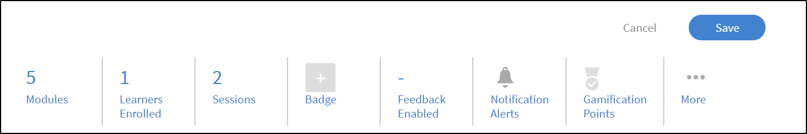
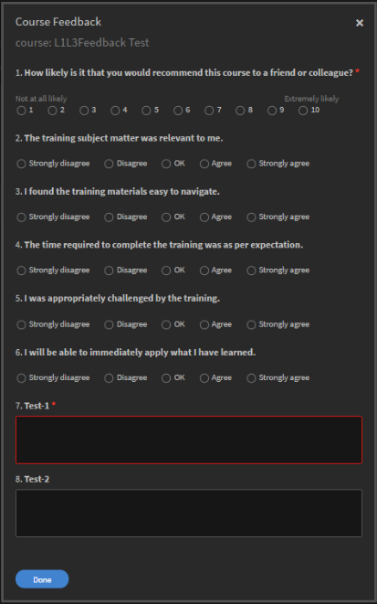
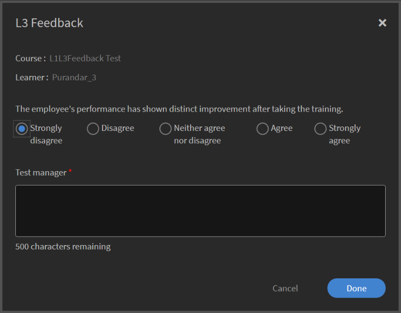
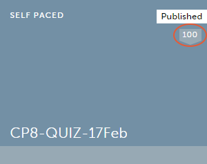
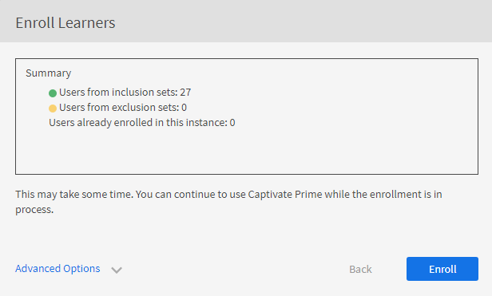

# 강의 모듈, 인스턴스 및 학습 프로그램 만들기

이 문서는 책임자 역할의 강의 모듈, 인스턴스, 강의 생성에 대한 도움말로 구성되어 있습니다.

작성자는 강의를 생성합니다. 학습자는 강의를 수강할 수 있고 책임자는 강의 이용량에 따라 학습자의 성과를 추적할 수 있습니다.

## 개요 {#overview}

작성자는 강의를 생성합니다. 그런 다음 학습자는 강의를 수강할 수 있고 책임자는 강의 이용량에 따라 학습자의 성과를 추적할 수 있습니다. 책임자는 작성자가 생성한 강의를 보고 이 섹션에서 설명하는 일부 활동을 수행할 수 있습니다. 책임자는 학습자를 위한 사전 정의 강의 세트로 고유 학습 프로그램을 생성할 수 있습니다.

## 강의 인스턴스 만들기 {#createinstanceofacourse}

### 인스턴스 관리

>[!INFO]
>
>이 교육에서는 인스턴스 세부 정보와 인스턴스 속성을 편집하는 방법에 대해 알아봅니다.    

교육을 시작할 수 없는 경우 다음 주소로 작성하십시오. <almacademy@adobe.com>.

### 인스턴스를 만드는 방법

작성자가 강의를 만든 후에 강의 인스턴스를 생성할 수 있습니다. 강의 인스턴스를 생성하면 다른 시기에 학습자에게 동일한 강의를 제공할 수 있습니다. 학습자는 원하는 인스턴스를 선택하고 등록할 수 있습니다. 고유의 배지 세트, 피드백 및 기타 설정을 포함하도록 각 인스턴스를 구성할 수 있습니다.

인스턴스 생성 방법

1. 책임자 웹 앱에서 왼쪽 창의 **[!UICONTROL 강의]**&#x200B;를 클릭합니다.
1. 강의 목록에서 필수 강의를 선택하고 **[!UICONTROL 강의 보기]**&#x200B;를 클릭합니다.

   

   *강의 보기*

1. 인스턴스를 생성하려면 왼쪽 창의 **[!UICONTROL 인스턴스]**&#x200B;를 클릭합니다. 모든 강의에는 기본적으로 인스턴스가 있습니다. 기본 인스턴스를 수정하거나 인스턴스를 추가할 수 있습니다. 이 강의 인스턴스는 삭제할 수 없습니다.
1. 인스턴스를 생성하려면 강의 정보의 오른쪽 상단 모서리에 있는 **[!UICONTROL 새 인스턴스 추가]**&#x200B;를 클릭합니다. 강의의 새 인스턴스가 표시됩니다.
1. 인스턴스의 속성을 입력합니다.

   * (으)로 **[!UICONTROL 인스턴스 이름]** 필드에 강의와 연관시킬 인스턴스 이름을 입력합니다. 인스턴스의 이름은 고유해야 합니다.
   * 인스턴스의 완료 기한을 지정합니다. 학습자는 이 날짜까지 강의 완료 상태를 달성해야 합니다.
   * 다음을 수행합니다. **[!UICONTROL 옵션 더 보기]** 기타 기한 옵션을 표시합니다.
   * **[!UICONTROL 등록 마감]:** 자가 등록일 경우 학습자가 학습 객체에 등록해야 하는 날짜입니다.
   * **[!UICONTROL 등록 취소 기한]:** 등록 취소 마감일을 지정하여 학습자 스스로 등록 취소를 제한할 수 있습니다.
   * **[!UICONTROL 시간대]:** 검색 후 **[!UICONTROL 시간대]** 드롭다운 목록에서 선택합니다.

   책임자는 요청에 따라 강의 또는 학습 프로그램에 대한 완료 기한을 결정할 수 있습니다. 그러나 강의실/가상 강의실 기반 교육에 대해 완료 기한을 하나만 설정하는 것이 좋습니다.

   

   *완료 마감 시한 설정*

## 인스턴스의 속성 보기 {#viewpropertiesoftheinstance}

*인스턴스의 속성 보기*

1. **모듈:** 강의 작성자가 생성한 모듈의 개수입니다.
1. **등록된 학습자:** 책임자가 강의에 등록한 학습자 수입니다.
1. **세션:** 강의의 가상 강의실 및 강의실 모듈의 수입니다.
1. **피드백 활성화:** 이 강의에 대한 L1, L2 및 L3 피드백 활성화 여부를 표시합니다.

## 인스턴스 중단 {#retireaninstance}

인스턴스를 중단하려면 아래 단계를 수행하십시오.

1. 인스턴스에서 드롭다운 메뉴를 클릭하고 **[!UICONTROL 인스턴스 중단]** 옵션을 선택합니다.

   

   *인스턴스 사용 중지*

1. 중단된 모든 인스턴스를 검색하려면 인스턴스 페이지에서 **[!UICONTROL 중단됨]** 탭을 클릭합니다.

## 인스턴스 복원 {#restoreaninstance}

중단된 인스턴스를 활성화 상태로 복원하려면 다음 단계를 수행하십시오.

1. 인스턴스에서 드롭다운 메뉴를 클릭하고 **[!UICONTROL 인스턴스 다시 열기]** 옵션을 선택합니다.

   

   *인스턴스 복원*

1. 이제 인스턴스가 활성 모드로 복원됩니다.

## 인스턴스 레벨 전자 메일 전송

등록된 학습자에게 인스턴스 레벨 전자 메일을 전송하려면 다음을 수행합니다.

1. 에 **[!UICONTROL 인스턴스]** 페이지에서 인스턴스의 옵션을 선택하고 **[!UICONTROL 등록된 학습자에게 전자 메일 보내기]**.

*인스턴스에 등록된 전자 메일 학습자*

1. 에 **[!UICONTROL 공지 만들기]** 대화 상자에서 이메일로 입력 을 선택합니다. 제목을 지정하고 메시지를 입력한 다음 **[!UICONTROL 저장]**&#x200B;을 클릭합니다. 교육이 자동으로 선택됩니다.

   

   *공지를 이메일로 만들기*

1. **[!UICONTROL 저장]**&#x200B;을 클릭하면 공지사항이 성공적으로 생성되었다는 확인 메시지를 확인할 수 있습니다. 공지사항을 게시하려면 **[!UICONTROL 지금 게시]**&#x200B;를 클릭합니다.

   

### 강의에 학습자 등록

이 교육에서는 학습자를 등록, 등록 취소 및 다시 등록하는 방법에 대해 학습합니다.

교육을 시작할 수 없는 경우 다음 주소로 작성하십시오. <almacademy@adobe.com>.

### 다양한 인스턴스에 학습자 등록

1. 강의 목록에서 강의를 선택합니다.
1. 왼쪽 패널에서 **[!UICONTROL 학습자]**&#x200B;를 선택합니다.
1. **[!UICONTROL 등록]**&#x200B;을 선택합니다.

   

   *강의 게시*

1. [!UICONTROL **학습자 등록**] 대화 상자에서는 다음을 수행할 수 있습니다.

   * 인스턴스 선택 드롭다운에서 학습자를 등록할 인스턴스를 선택합니다.
   * 학습자 포함 필드에서 사용자나 사용자 그룹 또는 둘 다 선택합니다.
   * [학습자 제외] 필드에서 인스턴스에서 제외할 학습자를 선택합니다.
   * 선택한 인스턴스에 학습자를 등록하려면 대화 상자 하단에서 예 를 선택합니다.

1. **[!UICONTROL 진행]**&#x200B;을 선택합니다.

   

   *학습자 등록 진행*

### 인스턴스의 등록 보고서 보기

1. 강의 목록에서 강의를 선택합니다.
1. 왼쪽 패널에서 **[!UICONTROL 학습자]**&#x200B;를 선택합니다.
1. 선택 **[!UICONTROL 액션]** > **[!UICONTROL 내보내기]**.

Excel 파일에는 각 인스턴스에 대한 워크시트가 포함되어 있습니다. 워크시트는 다음과 같은 필드로 구성됩니다.

* 학습자
* 이메일
* 고유 사용자 ID
* 강의 이름
* LO 고유 ID
* 상태
* 선택 조건
* 등록 날짜/등록 취소 날짜(UTC 시간대)
* 완료 날짜(UTC 시간대)
* 기한(UTC 시간대)
* 시작 날짜(UTC 시간대)
* 퀴즈 점수
* 관리자 이름
* 주소
* 사용자 상태
* 전문 영역
* 설명
* 방문 수
* 방문 날짜
* 타임스탬프(UTC 시간대)
* 소요 시간(분)

>[!NOTE]
>
>다중 등록을 활성화하면 각 강의의 학습자 성적 증명서 보고서에 다중 행이 추가됩니다(각 인스턴스당 하나의 행).
>
>강의당 하나의 행만 예상하도록 보고 자동화를 설정한 경우 다중 등록 기능을 활성화하기 전에 보고 자동화에 필요한 조정을 수행해야 합니다.

## 에스컬레이션 레벨 설정 {#escalation}

전자 메일 알림을 보내는 경우 책임자는 다음으로 에스컬레이션 레벨을 명백하게 선택해야 합니다.

* 관리자
* 관리자 및 스킵 레벨 관리자

*에스컬레이션 수준 설정*

## 강의 조정 {#coursemoderation}

작성자가 모듈을 추가, 업데이트 또는 삭제한 다음 강의를 다시 게시하면 모든 책임자는 해당 내용에 대한 알림을 받게 됩니다. 책임자는 링크를 클릭하여 변경 사항을 보고 기존 콘텐츠와 신규 콘텐츠를 비교할 수 있습니다. 그리고 변경 사항을 승인 또는 거부할지 선택할 수 있습니다.

강의 조정을 활성화하려면 **[!UICONTROL 설정]** > **[!UICONTROL 일반]**. **[!UICONTROL 강의 조정]** 확인란을 선택하여 기능을 활성화합니다.

*강의 조정 활성화*

작성자가 강의에 적용한 변경 사항을 보려면 알림을 클릭합니다. 그런 다음에 작성자의 업데이트 내용을 승인하거나 거부할 수 있습니다. 승인을 선택하면 강의는 다시 게시됩니다. 업데이트를 거부하면 강의의 이전 버전이 계속 유지됩니다. 어느 것을 선택하든 작성자에게 알림이 전송됩니다.

*작성자가 강의 업데이트를 요청함*

여러 작성자가 하나의 강의를 업데이트하는 경우, 책임자의 알림에는 가장 마지막에 수행된 변경 사항이 반영됩니다. 최신 변경 사항을 승인 또는 거부할 수 있습니다.

## L1 및 L3 피드백 추가 {#addl1andl3feedback}

강의를 생성하면서 L1 및 L3 피드백 옵션을 추가할 수 있습니다.

1. 책임자로 로그인한 뒤 왼쪽 창의 &#39;강의&#39;를 클릭합니다. 오른쪽 페이지에 모든 강의 목록이 나타납니다.
1. L1 또는 L3 피드백을 추가할 강의 타일을 클릭합니다.
1. 왼쪽 창의 인스턴스 기본값을 클릭합니다.
1. L1 또는 L3 피드백 옆의 전환 단추에 있는 원을 클릭하여 활성화합니다.
1. L3 질문 아래에 있는 텍스트 영역에 L3 피드백 질문을 추가합니다.

## 필수 L1 피드백 {#mandatory-l1-feedback}

L1 피드백에서 모든 질문 또는 첫 번째 질문을 필수로 설정할 수 있습니다.

*L1 피드백에서 모든 질문 또는 첫 번째 질문을 필수로 지정합니다.*

이제 질문을 만들 수 있으며 이는 이제 필수가 됩니다.

*질문 만들기*

어떤 이유로 두 개의 필수 질문에 텍스트가 없으면 피드백 양식에 질문이 표시되지 않습니다.

>[!NOTE]
>
>학습 프로그램 인스턴스에서 이러한 설정을 활성화하는 것으로는 충분하지 않습니다. 또한 학습 프로그램의 각 과정에 대해 강의 인스턴스 레벨에서 이러한 설정을 활성화해야 합니다.

활성화된 경우 인스턴스 기본값 페이지에서 다음을 수행합니다 **[!UICONTROL 모든 질문 필수]**&#x200B;그런 다음 이후에 생성되는 모든 새 인스턴스가 이 설정을 상속합니다.

*인스턴스 기본값 페이지 보기*

## 과정 레벨에서 L1 피드백 {#l1-feedback-course-level}

이전 버전의 Learning Manager에서 책임자는 학습 프로그램에 관해 L1 피드백을 활성화할 수 있습니다.

Learning Manager의 이 릴리스에서 책임자는 학습 프로그램에 포함된 모든 과정에 관한 L1 피드백을 보낼 수 있습니다. 책임자는 강의 인스턴스 수준의 모든 강의에 L1 피드백이 활성화되었는지 확인해야 합니다.

1. 각 과정에 대해 L1 피드백을 활성화하려면 책임자 앱에서 **[!UICONTROL 학습 프로그램]** > **[!UICONTROL 학습 프로그램 보기]**.

1. 다음을 수행합니다. **[!UICONTROL 인스턴스]** > **[!UICONTROL L1 피드백 활성화됨]**.

1. 옵션 활성화 **[!UICONTROL 각 과정에 대해 활성화]**.

   

   *강의 피드백 활성화*

   학습 프로그램 수준에서 이 토글을 활성화만 해도 이 프로그램 내 강의에 대한 L1 피드백은 트리거되지 않습니다. L1 피드백을 활성화하려면 학습 프로그램에서 각 과정으로 이동하여 L1 피드백 전환을 활성화합니다.

   

   *각 과정에 대해 L1 피드백 활성화*

   L1 피드백이 모든 과정에 대해 활성화되었지만 학습 프로그램 인스턴스에서 비활성화되었다면 L1 피드백이 과정에 대해 트리거되지 않습니다.

## 언어별 퀴즈 보고서

퀴즈 보고서로 학습 프로그램 또는 강의를 끝낸 후 학습자의 성과를 평가할 수 있습니다.

Learning Manager에서는 현재 13개의 인터페이스 언어 및 32개의 콘텐츠 언어를 제공하여 학습을 용이하게 합니다. 그러나 해당 옵션이 학습자 친화적이며 글로벌 학습자 지원에 편리함을 제공하지만, 책임자가 다양한 로케일에서 시도한 보고서를 가져오기는 어렵습니다.

강의가 다중 언어로 제공되는 경우 퀴즈 보고서에는 다른 언어로 된 데이터가 포함됩니다. 지금까지 책임자가 생성한 보고서의 경우 퀴즈를 진행한 언어와 상관없이 아래에 하나씩 표시되었습니다. **예**&#x200B;사용자가 네덜란드어로 퀴즈를 진행한 경우 책임자는 한 번에 네덜란드어를 사용하는 사용자가 진행한 퀴즈 보고서만 볼 수 있습니다. 인터페이스 언어로 영어를 선택한 책임자의 경우 진행한 로케일에 상관없이 모든 사용자의 보고서를 한 번에 확인할 수 없었습니다.

이제 책임자가 선택한 콘텐츠 로케일에 상관없이 학습자가 진행한 각각의 언어에 맞게 모든 보고서를 볼 수 있도록 문제가 수정되었습니다. 다른 언어로 진행된 퀴즈는 퀴즈 보고서에 추가 열로 추가됩니다.

## 계정 레벨에서 L1 피드백 활성화 {#l1-feedback-account-level}

*계정 수준에서 L1 피드백 활성화*

책임자는 계정 수준에서 이 설정을 켜면 새로 만든 강의 및 학습 프로그램에 대해 L1 피드백을 활성화할 수 있습니다. 단, 이 설정을 켜도 기존 과정 및 학습 프로그램에는 영향을 주지 않습니다

활성화된 경우 모든 새로운 교육 및 새로운 인스턴스에는 기본적으로 피드백이 활성화됩니다. 작성자/책임자가 인스턴스를 방문하는 경우 인스턴스는 기본값이 되고 수동으로 끈 다음 인식됩니다.

L1 피드백을 활성화하려면 책임자 앱에서 **[!UICONTROL 설정]** > **[!UICONTROL 피드백]**.

*피드백 설정 페이지 보기*

다음을 수행합니다. **[!UICONTROL 편집]** 오른쪽 위 모서리에서 옵션을 전환하여 L1 피드백을 활성화합니다.

작성자가 강의를 생성할 때 책임자 앱의 인스턴스 페이지에서 **[!UICONTROL L1 피드백]** 이(가) 새 강의에 자동으로 활성화됩니다.

<!---->

L1 피드백을 비활성화하려면 **[!UICONTROL 활성화]** 아래와 같은 옵션:

*L1 피드백 활성화 또는 비활성화*

## L1 및 L3 피드백에 서술형 질문 추가 {#descriptive}

Learning Manager 11월 릴리스에는 서술형 질문 추가 옵션이 제공됩니다. 책임자는 학습자에게 이러한 질문을 추가할 수 있습니다. 이 프로비전은 Learning Manager에서 제공하는 기본 질문에 추가됩니다. 질문 아래에 있는 옵션을 선택하여 필수 사항으로 만들 수도 있습니다.

L1 피드백에는 두 가지 서술형 질문을, L3 피드백에는 한 가지 서술형 질문을 추가할 수 있습니다.

L1 피드백을 활성화하면 다음 스냅샷과 같이 옵션을 볼 수 있습니다.

*L1 및 L3 피드백에 서술형 질문 추가*

학습자가 강의를 완료하자마자 즉시 질문이 나타나게 하려면, 그에 해당하는 옵션을 선택할 수 있습니다.

L1 질문 출력에 대해 아래에 있는 샘플 스냅샷을 참조하십시오. 학습자는 다음 형식으로 질문을 볼 수 있습니다. 테스트-1 및 테스트-2는 서술형 질문입니다.

*샘플 강의 피드백 질문*

L3 피드백을 활성화하면 아래 스냅샷에 나타난 대로 옵션을 볼 수 있습니다.

*L3 피드백 활성화*

2번 질문은 L3 피드백의 서술형 질문입니다. 질문 아래에 있는 옵션을 클릭하여 필수 사항으로 만들 수도 있습니다.

L3 질문 출력에 대해 아래에 있는 샘플 스냅샷을 참조하십시오. 학습자는 다음 형식으로 질문을 볼 수 있습니다.

*L3 피드백 출력 보기*

## L1 및 L3 피드백 질문 설정 {#setupl1andl3feedbackquestionnaire}

L1 및 L3 피드백 질문을 설정하고 계정 레벨의 알림 메시지를 설정할 수 있습니다.

1. 다음을 수행합니다. **[!UICONTROL 설정]** 그런 다음 **[!UICONTROL 피드백]** 책임자로 로그인한 후 왼쪽 창에서 실행하십시오.\
   피드백 설정 페이지에는 두 개의 탭이 있습니다. **[!UICONTROL L1 피드백]** 및 **[!UICONTROL L3 피드백]**.\
   **[!UICONTROL L1 피드백]** 탭은 기본 목록으로 구성됩니다. **[!UICONTROL L1 피드백]** 알림 메시지 설정이 있는 자가 진행식 및 강의실 강의에 대한 질문입니다. 위치 **[!UICONTROL L3 피드백]** 탭에서는 L3 피드백 기본 명령문과 알림 메시지 설정을 볼 수 있습니다.

1. 페이지 오른쪽 상단 모서리에 있는 &#39;편집&#39;을 클릭하여 기존 질문을 수정할 수 있습니다.\
   위치 **[!UICONTROL L1 피드백]** 탭에서는 예/아니요 토글 버튼을 클릭하여 각 질문을 활성화/비활성화할 수 있습니다.\
   위치 **[!UICONTROL L3 피드백]** 탭을 사용하여 기본 피드백 명령문을 수정할 수 있습니다.\
   다음을 수행합니다. **[!UICONTROL 새 알림 메시지 추가]** 알림 메시지를 보낼 시점을 선택합니다.

1. 다음을 수행합니다. **[!UICONTROL 저장]** 페이지 오른쪽 상단

L1 피드백에서는 기본 질문과 2개의 질문 세트가 표시됩니다. 첫 번째 질문 세트는 활동 기반 강의에 사용되는 자가 진행식 강의와 연관됩니다. 두 번째 질문 세트는 강의실 및 가상 강의실 유형의 강의에 사용됩니다.

## 체크리스트 데이터 내보내기 {#export-checklist-data}

강의 목록에서 체크리스트가 포함된 강의를 엽니다. 왼쪽 창에 옵션 **[!UICONTROL 체크리스트]**&#x200B;가 표시됩니다.

*체크리스트 데이터 내보내기*

옵션을 클릭하고 강의 페이지에서 다음을 수행합니다.

1. 인스턴스 및 모듈을 선택합니다.
1. 다음을 수행합니다. **[!UICONTROL 액션]** > **[!UICONTROL 내보내기]**&#x200B;을 입력한 다음 학습자 체크리스트 보고서를 내보냅니다.

에 **[!UICONTROL 체크리스트]** 페이지에서 강사는 다음에서 체크리스트 보고서를 내보낼 수 있습니다 **[!UICONTROL 액션]** 드롭다운 목록입니다.

CSV 보고서에는 다음과 같은 필드가 포함됩니다.

* 사용자 이름
* 사용자 전자 메일
* 관리자 이름 및 전자 메일
* 교육 이름
* 교육 인스턴스
* 강사 이름 및 전자 메일
* 제출 날짜:
* 평가 상태
* 실제 텍스트가 포함된 질문
* 사용자 상태
* 프로필
* 활성 필드

상태 필터를 선택한 후 보고서를 다운로드하는 경우 다운로드된 학습자 성적 증명서 보고서에는 적용된 상태 필터를 기반으로 학습자 데이터가 포함됩니다. 추가된 이 필터는 학습자 성적 증명서를 생성하려는 경우 사용자 정의 책임자 및 관리자에게도 표시됩니다.

## 강의 보기 {#viewingcourses}

책임자는 이용 가능한 모든 강의 목록을 볼 수 있습니다.   다음을 수행합니다. **[!UICONTROL 강의]** 왼쪽 창에서 검색 및 필터 옵션이 있는 강의 목록을 볼 수 있습니다. 강의 축소판에서 각 강의의 강의 효과 진행률 또한 볼 수 있습니다.

>[!NOTE]
>
>학습자가 강의를 수료한 후 또는 게시 후 특정 강의를 지연하고 싶은 경우 강의를 중단할 수 있습니다. 게시됨 상태의 강의만 중단할 수 있습니다. 중단된 전체 강의 목록은 **[!UICONTROL 중단됨]** 탭.

## 퀴즈 점수 보기 {#viewquizscores}

1. 강의 축소판에서 강의 이름을 클릭합니다.
1. 왼쪽 창의 &#39;퀴즈 점수&#39;를 클릭합니다.

사용자 이름 또는 각 질문을 기준으로 모든 강의의 퀴즈 점수를 볼 수 있습니다. 적절히 &#39;사용자&#39; 또는 &#39;질문&#39; 탭을 선택합니다.

강의의 각 인스턴스 기반 점수를 보려면 드롭다운 목록에서 인스턴스 유형을 선택합니다.

## 강의 학습자 목록 관리 {#managelearnerslistforacourse}

1. 강의 축소판에서 강의 이름을 클릭합니다.
1. 왼쪽 창에서 **[!UICONTROL 학습자]**.

*강의에서 학습자 선택*

학습자 페이지에서 다음 작업을 수행할 수 있습니다.

* 제거할 학습자를 선택한 다음 클릭합니다. [!UICONTROL **액션**] > [!UICONTROL **제거**].
* 출석을 표시하려는 학습자를 선택하고 [!UICONTROL **액션**] > [!UICONTROL **완료로 표시**].

학습자가 모듈을 재설정하여 다시 사용할 수 있도록 하려면 을 클릭합니다. [!UICONTROL **재설정**]. 팝업 대화 상자에서 &#39;예&#39;를 클릭하여 재설정을 확인합니다. 완료된 모듈은 재설정할 수 없습니다. 실패 또는 미완료 모듈만 재설정할 수 있습니다.

또한 학습자를 엑셀 시트로 내보낼 수 있습니다. 학습자 목록을 내보내려면 [!UICONTROL **액션**] > [!UICONTROL **내보내기**].

>[!NOTE]
>
>강의에 여러 인스턴스가 있는 경우, 엑셀에 있는 학습자 목록은 각 탭에 개별적으로 제공됩니다. 학습자 목록은 학습자 이름, 상태, 선택 조건으로 구성됩니다. 학습자 상태는 다음과 같습니다 **시작되지 않음**&#x200B;또는 **진행 중**&#x200B;또는 **완료됨**.

## 학습자 출결사항 내보내기 {#attendance}

모든 강의실 및 VC 강의의 경우 모든 인스턴스에 대해 이 강의에 출석한 학습자 목록을 다운로드할 수 있습니다.

강의 세부 정보 페이지에서 오른쪽 창의 **[!UICONTROL &#39;출석 및 점수&#39;]**&#x200B;를 클릭합니다.

해당 페이지의 오른쪽 상단에서 **[!UICONTROL &#39;동작&#39;]** 드롭다운 목록을 클릭합니다. 그런 다음 **[!UICONTROL 학습자 목록 내보내기(PDF)]** 옵션을 클릭합니다.

*학습자 목록을 PDF으로 내보내기*

PDF에 강사가 보는 것과 동일한 학습자 그룹이 표시됩니다.

PDF를 다운로드하면 해당 강의 생성 시 사용한 시간대(UTC)를 확인할 수 있습니다.

## 승인 보류 상태의 학습자 내보내기

책임자, 관리자 및 사용자 정의 책임자는 등록 승인 보류 상태의 학습자 데이터를 내보낼 수 있습니다. **강의 > 학습자** 탭에서 드롭다운 목록의 동작을 클릭하여 데이터를 내보낼 수 있습니다.

관리자 승인 강의에 등록됨/승인 보류 중인 학습자가 없는 경우 옵션이 표시되고 빈 보고서가 생성됩니다. 학습자가 승인 보류 상태, 등록됨 상태, 보류 중 상태, 등록 취소됨 상태일 때도 내보낼 수 있습니다.

보고서에는 승인 보류 중인 활성, 삭제됨, 일시 중단됨 상태의 사용자 데이터가 포함됩니다. 또한 보고서에는 승인 보류 상태의 내부 및 외부 사용자 데이터가 포함됩니다.

이전에 승인 보류 상태였던 학습자가 등록 취소 시, 해당 기록은 보고서에 표시되지 않습니다. 또한 이전에 승인 보류 상태였던 학습자가 책임자/관리자/사용자 정의 책임자 등록을 통해 강의 등록 시 해당 기록은 보고서에 표시됩니다.

## L1 및 L3 피드백 보기 {#viewl1andl3feedback}

강의에 대해 학습자가 제공한 L1 피드백과 관리자가 학습자에게 제공한 L3 피드백을 볼 수 있습니다.

1. 강의 목록에서 강의 타일을 클릭합니다.
1. 받은 피드백을 보려면 왼쪽 창에서 L1 피드백 또는 L3 피드백을 클릭합니다.
1. 특정 인스턴스에 대한 피드백을 보려면 드롭다운 목록에서 인스턴스를 선택합니다.

## 강의 미리 보기 {#previewcourses}

책임자는 **[!UICONTROL 학습자로 미리 보기]** 강의 모듈을 보는 동안 표시되는 옵션입니다.

1. 다음을 수행합니다. **[!UICONTROL 강의]** 관리자 권한으로 로그인한 후 왼쪽 창에서 실행하십시오.
1. 페이지의 강의 목록 중 하나를 클릭합니다.
1. 왼쪽 창에서 &#39;학습자로 미리 보기&#39;를 클릭한 다음 페이지에 있는 모듈 이름을 클릭하여 플레이어에서 강의 모듈을 미리 봅니다.

## 강의 효과 {#courseeffectiveness}

강의가 학습자에게 유용했는지 파악하기 위해 강의 효과를 평가합니다. 강의 내용에 대한 학습자 피드백 결과, 학습자를 위한 강의 퀴즈 결과 및 강의 학습을 기반으로 학습자를 평가하는 관리자의 피드백 조합입니다.

책임자는 아래의 스냅샷과 같이 강의 축소판에서 강의 효과 등급 또한 볼 수 있습니다. 이 강의의 등급은 100으로 표시돼 있습니다.

<!---->

강의 효과 등급 값은 L1, L2 및 L3 피드백 값을 고려하여 산출됩니다. 각 피드백의 내용을 확인하려면 강의 효과 값을 클릭합니다. 아래와 같이 팝업이 나타납니다.

*L1, L2 및 L3 피드백에 대한 강의 효과 보기*

샘플 스냅샷에서는 총 사용자 1명 중 1명이 3개의 피드백을 전부 받았으며 점수는 100/100입니다. 이 표에서 보듯 강의에 3개의 피드백(L1, L2 및 L3) 중 제공되지 않은 것이 있는 경우, 전체 효과에 부정적인 영향을 미칩니다. 팝업의 오른쪽 아래 모서리에 있는 아래로 화살표를 클릭하면 강의 효과가 어떻게 계산되는지 볼 수 있습니다.

*강의 효과 계산*

위에 표시된 원형 도표에서 볼 수 있듯이 관리자의 L3 피드백에는 가중치가 부여됩니다.

## 강의 및 학습 프로그램 검색 {#searchingcoursesandlearningprograms}

Adobe Learning Manager에서는 원하는 강의/학습 프로그램을 빠르고 쉽게 찾을 수 있습니다. 강의는 두 가지 방법으로 검색할 수 있습니다.

1. 검색 필드를 사용할 수 있습니다. 오른쪽 상단 모서리에 표시된 검색 아이콘을 클릭합니다. 검색창이 나타납니다. 강의 이름 또는 강의와 관련된 키워드를 입력하여 강의/학습 프로그램을 찾습니다. Captivate, C, Java, HTML 등 미리 정의된 태그를 사용하여 검색할 수도 있습니다. 검색 필드 내에서 태그를 검색할 수 있습니다. 즉, 검색 필드에 입력을 하면 태그가 표시됩니다.
1. 필터를 사용하여 강의/학습 프로그램 목록을 필터링할 수 있습니다. 전체, 게시됨, 초안, 중단됨 등의 상태로 강의에 필터를 적용할 수 있습니다. 책임자 모드에서는 초안 필터가 표시되지 않습니다.

&#39;역량&#39;을 클릭하여 선택하면 역량 기준으로 검색할 수도 있습니다. 책임자는 네 가지 방법으로 강의를 정렬하여 필요한 강의를 더 잘 찾을 수 있습니다. 정렬 기준 을 클릭하고 알파벳 오름차순, 알파벳 내림차순, 강의 갱신일 또는 강의 효과를 선택합니다.

<!---->

학습 프로그램은 세 가지 방법으로 정렬할 수 있습니다. 알파벳 오름차순, 알파벳 내림차순, 업데이트 날짜 기준입니다.

## 학습자 등록 {#enrollinglearners}

같은 단계를 따라 강의, 학습 프로그램 및 인증에 학습자를 등록할 수 있습니다. 관리자는 다음 단계를 따라서 본인에게 학습자를 등록할 수 있습니다.

책임자는 조직의 요구 사항에 따라 필수 강의에 학습자를 등록할 수 있습니다.

1. 게시된 강의 타일에 마우스를 가져다 대고 학습자 등록 을 클릭합니다.\
   또는 게시된 강의 타일을 클릭한 뒤 왼쪽 창에서 학습자를 클릭할 수도 있습니다. 학습자 목록이 있는 페이지가 나타납니다. &#39;등록&#39;을 클릭합니다.\
   학습자 등록 대화 상자가 나타납니다.

1. 인스턴스 선택 필드에서 인스턴스를 선택합니다. 드롭다운에는 활성, 중단 및 만료된 인스턴스를 포함한 모든 인스턴스가 나열됩니다.

>[!NOTE]
>
>책임자는 학습자 페이지의 드롭다운 화살표를 클릭한 다음 강의에 등록된 모든 학습자를 제거할 수 있습니다 **[!UICONTROL 액션]** > **[!UICONTROL 제거]**.

*학습자를 등록하는 동안 댓글 추가*

*학습자 등록*

## 사용자

+++학습자 포함

포함하고 싶은 사용자 그룹 또는 개별 사용자를 선택합니다(전자 메일 ID 또는 이름 사용). 같은 세트의 교집합에 모든 사용자 그룹을 추가합니다. 다른 사용자 그룹을 공동으로 추가하려면 새로운 포함 집합을 사용합니다.

+++

+++학습자 제외

제외하고 싶은 사용자 그룹 또는 개별 사용자를 선택합니다(전자 메일 ID 또는 이름 사용). 같은 세트의 교집합에 모든 사용자 그룹을 추가합니다. 다른 사용자 그룹을 공동으로 추가하려면 새로운 포함 집합을 사용합니다.

+++

## 사용자 전자 메일 ID

+++이메일 ID

등록하려는 학습자의 고유한 전자 메일 ID를 세미콜론, 쉼표 또는 줄 바꿈으로 구분하여 복사하고 붙여넣으십시오. **[!UICONTROL 전자 메일 ID 확인]** 옵션을 사용하여 입력된 내용을 확인합니다. 유효하지 않은 입력값은 빨간색으로 표시됩니다. 해당 입력값을 제거하거나 정정한 다음 **[!UICONTROL 계속 진행]**&#x200B;을 클릭하여 진행합니다.

*학습자 등록*

요약 대화 상자에 포함 집합, 제외 집합 및 이미 강의 인스턴스에 등록된 사용자의 수가 표시됩니다.

+++

### 학습자를 등록하는 동안 댓글 추가 {#enroll-comments}

<!----->

책임자 또는 관리자는 강의에 학습자를 등록하는 동안 댓글을 추가할 수 있습니다. 등록 중인 사용자 집단에 대한 추가 정보를 언급할 수 있습니다. 이 데이터는 강의 보고서로 내보내집니다.

의견: **아님** 학습자에게 표시됩니다.

책임자가 학습자의 강의 보고서를 생성하면 추가된 모든 댓글이 보고서에 표시됩니다. 요약 대화 상자에 포함 집합, 제외 집합 및 이미 강의 인스턴스에 등록된 사용자의 수가 표시됩니다.

**[!UICONTROL 학습자 등록]** 대화 상자에서 **[!UICONTROL 고급 옵션]**&#x200B;을 확장합니다. (으)로 **[!UICONTROL 추가 의견]** 필드에 필요한 설명을 입력합니다.

*학습자용 주석 추가*

## 등록 사용자 검색 {#searchforusers}

학습 개체의 학습자 섹션에 있는 등록된 사용자를 타이프 어헤드 검색을 통해 검색할 수 있습니다. 타이프 어헤드 검색을 사용하면 이름, 전자 메일 ID, UUID를 통해 점진적으로 등록 사용자를 검색할 수 있습니다.

*등록된 사용자 검색 과정*

이러한 유형의 검색은 자동 완성, 증분 검색, 입력에 따른 검색, 인라인 검색, 즉시 검색 등으로 불리기도 합니다.

검색 필드에 학습자 또는 사용자 그룹을 입력하면, 검색어에 일치하는 하나 이상의 발견된 결과가 즉시 사용자에게 제시됩니다.

이 절차를 사용하면 여러 번 검색하는 것에 비해 대상을 훨씬 빠르고 간편하게 검색할 수 있습니다.

모든 인스턴스에 걸친 학습자 또는 사용자 그룹이 검색 결과로 표시됩니다. 모든 학습자에 대해 학습자가 등록된 인스턴스가 **[!UICONTROL 인스턴스]** 열이 표시됩니다.

*검색 결과 보기*

타이프 어헤드 검색을 사용하면:

* 인스턴스에 관계없이 등록된 모든 사용자를 볼 수 있습니다.
* 하나 이상의 등록 사용자를 포함한 모든 사용자 그룹을 볼 수 있습니다.

검색이 실행된 후에는 학습자를 인스턴스별로 필터링할 수 없습니다. **[!UICONTROL 인스턴스 선택]** 드롭다운 목록에서 인스턴스를 선택하는 옵션이 비활성화됩니다.

또한 검색 결과를 사용하여 학습자 또는 사용자 그룹을 선택하고 다음 작업을 수행할 수 있습니다.

* 등록 취소
* 완료 표시
* 모듈 재설정

검색을 수행하는 동안, 동작 드롭다운 목록의 등록 취소 > 일괄 옵션이 강의/학습 프로그램에 대해 비활성화됩니다.

## 학습자와 QR 코드를 공유하여 등록, 완료 또는 둘 모두 수행 {#shareqrcodewithlearnerstoenrollcompleteorboth}

Adobe Learning Manager에서 책임자는 강의에 빠르게 등록할 수 있도록 학습자와 QR 코드를 공유할 수 있습니다. 3개의 다른 QR 코드는 강의 &#39;등록&#39;, &#39;완료&#39; 또는 &#39;등록 및 완료&#39;를 표시하는 데 사용됩니다.

학습자는 Adobe Learning Manager 디바이스 앱을 사용하여 손쉽게 각 QR 코드를 스캔할 수 있습니다.

**QR 코드를 다운로드하려면 다음을 수행하십시오.**

1. 다음을 수행합니다. **[!UICONTROL 강의]** 학습 섹션,
1. 강의 선택 > **[!UICONTROL 강의 보기]**.
1. 다음을 수행합니다. **[!UICONTROL 인스턴스]** > **[!UICONTROL 자세히]** > **[!UICONTROL QR 코드]**.

   <!---->

1. QR 코드를 활성화한 다음 &#39;등록&#39;, &#39;완료&#39;, &#39;등록 및 완료&#39; 다운로드 아이콘을 클릭하여 각 동작에 대한 QR 코드가 포함된 pdf를 다운로드합니다. 책임자는 QR 코드를 학습자와 공유할 수 있습니다.

   

   *학습자와 QR 코드 공유*

## 강의 사용 주기 {#courselifecycle}

일반적인 강의 사용 주기는 다음과 같습니다.

**초안** - 작성자가 강의 생성 및 저장을 완료하면 이 상태에서는 학습자가 아직 강의를 수강할 수 없습니다. 이 상태에서는 강의를 삭제할 수 있습니다.

**게시됨** - 작성자가 강의 게시를 완료했을 때. 이 상태인 경우 학습자는 강의에 등록할 수 있습니다.

**중단됨** - 강의를 게시한 후 작성자가 학습자 카탈로그에 강의가 나타나는 것을 원하지 않으면 강의를 중단 상태로 변경할 수 있습니다. 이 상태의 강의는 다시 게시하거나 삭제할 수 있습니다.

**삭제됨** - Adobe Learning Manager 애플리케이션에서 완전히 제거된 상태의 강의입니다. 강의는 오직 초안 또는 중단 상태일 때만 작성자가 삭제할 수 있습니다. 중단 상태의 강의를 삭제할 수도 있습니다.

*과정 수명 주기의 과정*

## 알림 설정 {#notificationsettings}

책임자는 알림 설정을 조정할 수 있습니다. 자세한 내용은 [알림](user-notifications.md)을 참조하십시오.

## 자주 묻는 질문 {#frequentlyaskedquestions}

+++모듈을 책임자로 재설정하는 방법은 무엇입니까?

강의 학습자 페이지에서 학습자 또는 그룹을 선택하고 **[!UICONTROL 액션]** > **[!UICONTROL 모듈 재설정]**.

*모듈 재설정 옵션 보기*

옵션을 클릭하면 선택한 모든 학습자 모듈 상태가 재설정됩니다. 완료된 모듈은 재설정되지 않습니다.

+++

+++학습자가 강의로 직접 리디렉션할 수 있도록 강의 URL을 추가하는 방법은 무엇입니까?

강의 카드에 마우스를 두고 **[!UICONTROL URL 복사]**&#x200B;를 클릭합니다. URL을 복사하면 학습자는 해당 URL을 사용하여 강의에 직접 액세스할 수 있습니다.

+++

+++인스턴스를 다시 여는 방법은 무엇입니까?

중단된 인스턴스를 다시 열려면, 인스턴스에서 드롭다운 메뉴를 클릭하고 **[!UICONTROL 인스턴스 다시 열기]**&#x200B;를 클릭합니다.

+++
