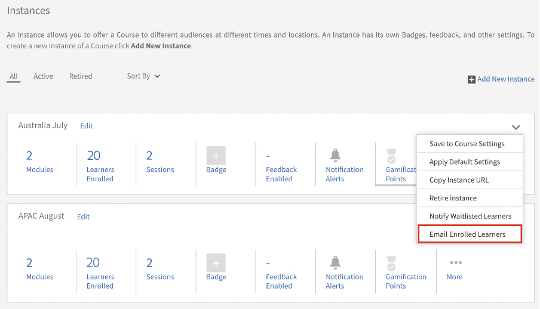
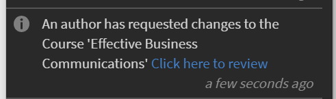
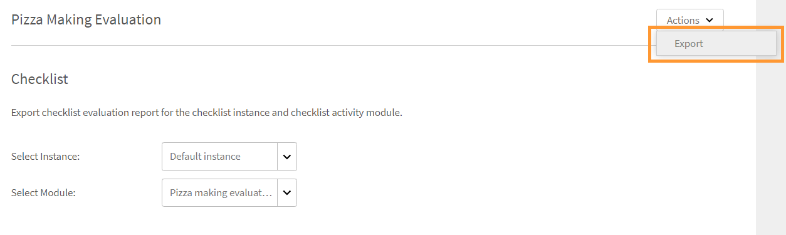
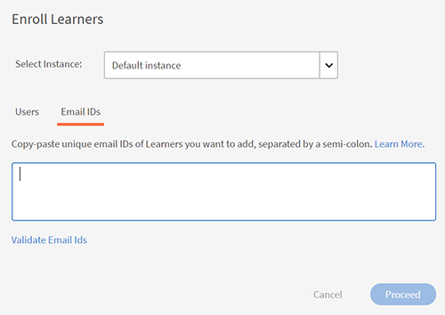

# 강의 모듈, 인스턴스 및 학습 프로그램 생성

이 문서는 책임자 역할의 강의 모듈, 인스턴스, 강의 생성에 대한 도움말로 구성되어 있습니다.

작성자는 강의를 생성합니다. 학습자는 강의를 수강할 수 있으며, 책임자는 강의 이용률을 기준으로 학습자의 성과를 추적할 수 있습니다.

## 개요 {#overview}

작성자는 강의를 생성합니다. 그러면 학습자는 강의를 수강하고 책임자는 강의 이용률을 기준으로 학습자의 성과를 추적할 수 있습니다. 책임자는 작성자가 만든 강의를 보고 이 섹션에서 설명하는 몇 가지 활동을 수행할 수 있습니다. 책임자는 미리 정의된 학습자용 강의 세트로 고유한 학습 프로그램을 생성할 수 있습니다.

## 강의 인스턴스 만들기 {#createinstanceofacourse}

작성자가 강의를 생성한 후 강의 인스턴스를 만들 수 있습니다. 강의 인스턴스를 생성하면 다른 기간에 학습자에게 동일한 강의를 제공할 수 있습니다. 학습자는 원하는 인스턴스를 선택하여 등록할 수 있습니다. 각 인스턴스가 고유의 배지, 피드백 및 기타 설정을 포함하도록 구성할 수 있습니다.

인스턴스를 만들려면

1. 책임자 웹 앱에서 **[!UICONTROL 강의]** 왼쪽 창에.
1. 강의 목록에서 필요한 강의를 선택하고 **[!UICONTROL 강의 보기]**.

   

   *강의 보기*

1. 인스턴스를 만들려면 **[!UICONTROL 인스턴스]** 왼쪽 창에. 모든 강의에는 기본적으로 인스턴스가 있습니다. 기본 인스턴스를 수정하거나 인스턴스를 추가할 수 있습니다. 이 강의 인스턴스는 삭제할 수 없습니다.
1. 인스턴스를 만들려면 **[!UICONTROL 새 인스턴스 추가]** 강의 오른쪽 상단에 있는 강의의 새 인스턴스가 표시됩니다.
1. 인스턴스의 속성을 입력하십시오.

   * (으)로 **[!UICONTROL 인스턴스 이름]** 필드에 강의와 연관시킬 인스턴스 이름을 입력합니다. 인스턴스에 고유한 이름을 사용해야 합니다.
   * 인스턴스의 완료 기한을 지정합니다. 학습자는 이 날짜까지 강의 완료 상태를 달성해야 합니다.
   * 다음을 수행합니다. **[!UICONTROL 옵션 더 보기]** 기타 기한 옵션을 표시합니다.
   * **[!UICONTROL 등록 마감]:** 자가 등록일 경우 학습자가 학습 객체에 등록해야 하는 날짜입니다.
   * **[!UICONTROL 등록 취소 기한]:** 등록 취소 마감일을 지정하여 학습자 스스로 등록 취소를 제한할 수 있습니다.

   책임자는 필요에 따라 강의 또는 학습 프로그램의 완료 기한을 정할 수 있습니다. 단, 강의실/가상 강의실 기반 교육에는 1개를 사용하는 것이 좋습니다.

   

   *완료 마감 시한 설정*

## 인스턴스의 속성 보기 {#viewpropertiesoftheinstance}

*인스턴스의 속성 보기*

1. **모듈:** 강의 작성자가 생성한 모듈 수
1. **등록한 학습자:** 책임자가 강의에 등록한 학습자 수
1. **세션:** 과정의 가상 강의실 및 강의실 모듈 수
1. **피드백 활성화됨:** 이 강의에 대해 L1, L2 및 L3 피드백이 활성화되었는지 여부를 표시합니다.

## 인스턴스 사용 중지 {#retireaninstance}

인스턴스를 종료하려면 아래 단계를 수행하십시오.

1. 인스턴스에서 드롭다운 메뉴를 클릭하고 옵션을 선택합니다. **[!UICONTROL 인스턴스 사용 중지]**.

   

   *인스턴스 사용 중지*

1. 중단된 인스턴스를 모두 검색하려면 탭을 클릭합니다 **[!UICONTROL 중단됨]** 인스턴스 페이지에서 다음을 수행합니다.

## 인스턴스 복원 {#restoreaninstance}

중단된 인스턴스를 활성화 상태로 복원하려면 다음 단계를 수행하십시오.

1. 인스턴스에서 드롭다운 메뉴를 클릭하고 옵션을 선택합니다. **[!UICONTROL 인스턴스 다시 열기]**.

   

   *인스턴스 복원*

1. 이제 인스턴스가 활성 모드로 복원됩니다.

## 인스턴스 수준 이메일 보내기

인스턴스 레벨 전자 메일을 등록된 학습자에게 보내려면 다음을 수행합니다.

1. 인스턴스 페이지에서 인스턴스에 대한 옵션을 선택한 다음 **[!UICONTROL 등록된 학습자에게 전자 메일 보내기]**.

*인스턴스에 등록된 전자 메일 학습자*

1. 공지 작성 대화 상자에서 이메일로 입력 을 선택합니다. 제목을 지정하고 메시지를 입력한 다음 [저장]을 클릭합니다. 교육이 자동으로 선택됩니다.

   

   *공지를 이메일로 만들기*

1. 클릭 후 **[!UICONTROL 저장]**&#x200B;공지가 성공적으로 작성되었다는 확인 메시지가 표시됩니다. 공지를 게시하려면 **[!UICONTROL 지금 게시]**.

   

### 다양한 인스턴스에 학습자 등록

1. 강의 목록에서 강의를 선택합니다.
1. 선택 **[!UICONTROL 학습자]** 왼쪽 패널에서
1. 선택 **[!UICONTROL 등록]**.

   

   *강의 게시*

1. (으)로 [!UICONTROL **학습자 등록**] 대화 상자에서 다음을 수행할 수 있습니다.

   * 인스턴스 선택 드롭다운에서 학습자를 등록할 인스턴스를 선택합니다.
   * 학습자 포함 필드에서 사용자나 사용자 그룹 또는 둘 다 선택합니다.
   * [학습자 제외] 필드에서 인스턴스에서 제외할 학습자를 선택합니다.
   * 선택한 인스턴스에 학습자를 등록하려면 대화 상자 하단에서 예 를 선택합니다.

1. 선택 **[!UICONTROL 계속]**.

   

   *학습자 등록 진행*

### 인스턴스의 등록 보고서 보기

1. 강의 목록에서 강의를 선택합니다.
1. 선택 **[!UICONTROL 학습자]** 왼쪽 패널에서
1. 선택 **[!UICONTROL 액션]** > **[!UICONTROL 내보내기]**.

Excel 파일에는 각 인스턴스에 대한 워크시트가 들어 있습니다. 워크시트는 다음 필드로 구성됩니다.

* 학습자
* 이메일
* 사용자 고유 ID
* 강의 이름
* LO 고유 ID
* 상태
* 선택 기준
* 등록 날짜/등록 취소 날짜(UTC 시간대)
* 완료 날짜(UTC 시간대)
* 예정 날짜(UTC 시간대)
* 시작 날짜(UTC 시간대)
* 퀴즈 점수
* 관리자 이름
* 주소
* userState
* 전문 분야
* 주석
* 방문 횟수
* 방문 날짜
* 타임스탬프(UTC 시간대)
* 소요 시간(분)

>[!NOTE]
>
>참고: 다중 등록을 활성화하면 각 강의의 학습자 성적 증명서 보고서에 여러 행이 추가됩니다(각 인스턴스에 대해 하나의 행).
>
>강의당 하나의 행만 예상하도록 보고 자동화를 설정한 경우 다중 등록 기능을 활성화하기 전에 보고 자동화에 필요한 조정을 수행해야 합니다.

## 에스컬레이션 수준 설정 {#escalation}

이메일 알림을 보낼 때 관리자는 에스컬레이션 레벨을 다음과 같이 명시적으로 선택해야 합니다.

* 관리자
* 관리자 및 건너뛰기 수준 관리자

*에스컬레이션 수준 설정*

## 강의 조정 {#coursemoderation}

작성자가 모듈을 추가, 업데이트 또는 삭제하고 강의를 다시 등록할 때마다 모든 관리자가 동일한 사항에 대한 알림을 받습니다. 관리자는 변경 내용을 보고 링크를 클릭하여 이전 콘텐츠와 새 콘텐츠를 비교한 다음 그에 따라 변경 내용을 승인하거나 거부할 수 있습니다.

강의 조정을 활성화하려면 **[!UICONTROL 설정]** > **[!UICONTROL 일반]**. 선택 **[!UICONTROL 강의 조정]** 이 기능을 활성화하려면 확인란을 선택합니다.

*강의 조정 활성화*

알림을 클릭하여 작성자가 강의에 적용한 변경 내용을 봅니다. 그런 다음 작성자의 변경 사항을 승인하거나 거부합니다. 승인하도록 선택하면 강의가 다시 게시됩니다. 업데이트를 거부하면 이전 버전의 강의가 계속 존재합니다. 두 경우 모두 작성자에게 알림이 전송됩니다.

*작성자가 강의 업데이트를 요청함*

동일한 강의를 업데이트하는 작성자가 여러 명인 경우 마지막으로 수행한 변경 내용이 관리자의 알림에 반영됩니다. 그런 다음 최신 변경 사항을 승인하거나 거부할 수 있습니다.

## L1 및 L3 피드백 추가 {#addl1andl3feedback}

강의를 만드는 동안 L1 및 L3 피드백 옵션을 추가할 수 있습니다.

1. 책임자로 로그인한 후 왼쪽 창에서 강의 를 클릭합니다. 모든 강의 목록이 오른쪽 페이지에 나타납니다.
1. L1 또는 L3 피드백을 추가할 강의 타일을 클릭합니다
1. 왼쪽 창에서 인스턴스 기본값 을 클릭합니다.
1. L1 또는 L3 피드백 옆에 있는 원 켜기/끄기 버튼을 클릭하여 활성화합니다.
1. L3 질문 아래의 텍스트 영역에 L3 피드백 질문을 추가합니다.

## 필수 L1 피드백 {#mandatory-l1-feedback}

L1 피드백에서 모든 질문 또는 첫 번째 질문을 필수로 설정할 수 있습니다.

*L1 피드백에서 모든 질문 또는 첫 번째 질문을 필수로 지정합니다.*

이제 질문을 만들 수 있으며 이는 이제 필수가 됩니다.

*질문 만들기*

어떤 이유로 두 개의 필수 질문에 텍스트가 없으면 피드백 양식에 질문이 표시되지 않습니다.

>[!NOTE]
>
>학습 프로그램 인스턴스에서 이러한 설정을 활성화하는 것으로는 충분하지 않습니다. 또한 학습 프로그램의 각 과정에 대해 강의 인스턴스 레벨에서 이러한 설정을 활성화해야 합니다.

활성화된 경우 인스턴스 기본값 페이지에서 다음을 수행합니다 **[!UICONTROL 모든 질문 필수]**&#x200B;그런 다음 이후에 생성되는 모든 새 인스턴스가 이 설정을 상속합니다.

*인스턴스 기본값 페이지 보기*

## 강의 수준의 L1 피드백 {#l1-feedback-course-level}

이전 버전의 Learning Manager에서 책임자는 학습 프로그램에 L1 피드백을 활성화할 수 있습니다.

Learning Manager의 이 릴리스에서 책임자는 학습 프로그램에 포함된 모든 과정에 대한 L1 피드백을 보낼 수 있습니다. 책임자는 강의 인스턴스 수준의 모든 강의에 L1 피드백이 활성화되었는지 확인해야 합니다.

1. 각 과정에 대해 L1 피드백을 활성화하려면 책임자 앱에서 **[!UICONTROL 학습 프로그램]** > **[!UICONTROL 학습 프로그램 보기]**.

1. 다음을 수행합니다. **[!UICONTROL 인스턴스]** > **[!UICONTROL L1 피드백 활성화됨]**.

1. 옵션 활성화 **[!UICONTROL 각 과정에 대해 활성화]**.

   

   *강의 피드백 활성화*

   학습 프로그램 수준에서 이 토글을 활성화만 해도 이 프로그램 내 강의에 대한 L1 피드백은 트리거되지 않습니다. L1 피드백을 활성화하려면 학습 프로그램에서 각 과정으로 이동하여 L1 피드백 전환을 활성화합니다.

   

   *각 과정에 대해 L1 피드백 활성화*

   L1 피드백이 모든 과정에 대해 활성화되었지만 학습 프로그램 인스턴스에서 비활성화되었다면 L1 피드백이 과정에 대해 트리거되지 않습니다.

## 언어별 퀴즈 보고서

퀴즈 보고서는 학습 프로그램 또는 강의를 완료한 후 학습자의 성과를 평가하는 데 도움이 됩니다.

Learning Manager에서는 현재 13개의 인터페이스 언어 및 32개의 콘텐츠 언어를 제공하여 학습을 용이하게 합니다. 이 옵션은 학습자 친화적이며 글로벌 학습자 지원에 편리함을 제공하지만 책임자가 다양한 로케일에서 시도한 보고서를 가져오기는 어렵습니다.

강의가 다중 언어로 제공되는 경우 퀴즈 보고서에는 다른 언어로 된 데이터가 표시됩니다. 지금까지 책임자가 생성한 보고서의 경우 퀴즈를 진행한 언어와 상관없이 아래에 하나씩 표시되었습니다. **예**&#x200B;사용자가 네덜란드어로 퀴즈를 진행한 경우 책임자는 한 번에 네덜란드어를 사용하는 사용자가 진행한 퀴즈 보고서만 볼 수 있습니다. 인터페이스 언어로 영어를 선택한 책임자의 경우 진행한 로케일에 상관없이 모든 사용자의 보고서를 한 번에 확인할 수 없었습니다.

이제 책임자가 선택한 콘텐츠 로케일에 상관없이 학습자가 진행한 각각의 언어에 맞게 모든 보고서를 볼 수 있도록 문제가 수정되었습니다. 다른 언어로 진행된 퀴즈는 퀴즈 보고서에 추가 열로 추가됩니다.

## 계정 수준에서 L1 피드백 활성화 {#l1-feedback-account-level}

*계정 수준에서 L1 피드백 활성화*

책임자는 계정 수준에서 이 설정을 켜면 새로 만든 강의 및 학습 프로그램에 대해 L1 피드백을 활성화할 수 있습니다. 단, 이 설정을 켜도 기존 과정 및 학습 프로그램에는 영향을 주지 않습니다

활성화되면 모든 새 교육 및 새 인스턴스에 대해 기본적으로 피드백이 활성화됩니다. 작성자/책임자가 인스턴스를 방문하면 인스턴스가 기본값으로 전환되고 수동으로 꺼집니다.

L1 피드백을 활성화하려면 책임자 앱에서 **[!UICONTROL 설정]** > **[!UICONTROL 피드백]**.

*피드백 설정 페이지 보기*

다음을 수행합니다. **[!UICONTROL 편집]** 오른쪽 위 모서리에서 옵션을 전환하여 L1 피드백을 활성화합니다.

작성자가 강의를 생성할 때 책임자 앱의 인스턴스 페이지에서 **[!UICONTROL L1 피드백]** 이(가) 새 강의에 자동으로 활성화됩니다.

<!---->

L1 피드백을 비활성화하려면 **[!UICONTROL 활성화]** 아래와 같은 옵션:

*L1 피드백 활성화 또는 비활성화*

## L1 및 L3 피드백에 서술형 질문 추가 {#descriptive}

Learning Manager 11월 릴리스에는 서술형 질문 추가 옵션이 제공됩니다. 책임자는 학습자에게 이러한 질문을 추가할 수 있습니다. 이 프로비전은 Learning Manager에서 제공하는 기본 질문에 추가됩니다. 필요한 경우 질문 아래에서 옵션을 선택하여 필수적으로 지정할 수도 있습니다.

L1 피드백에는 두 가지 서술형 질문을, L3 피드백에는 한 가지 서술형 질문을 추가할 수 있습니다.

L1 피드백을 활성화하면 다음 스냅샷과 같은 옵션을 볼 수 있습니다.

*L1 및 L3 피드백에 서술형 질문 추가*

강의 완료 후 즉시 학습자에게 질문지가 표시되도록 하려면 적절한 옵션을 선택하면 됩니다.

아래에 L1 설문지의 샘플 출력이 제공됩니다. 학습자는 아래 형식으로 질문지를 볼 수 있습니다. 서술형 문항은 Test-1과 Test-2이다.

*샘플 강의 피드백 질문*

L3 피드백을 활성화하면 아래 스냅샷에 나타난 대로 옵션을 볼 수 있습니다.

*L3 피드백 활성화*

질문 2는 L3 피드백에 대한 서술형 질문입니다. 질문 아래에 있는 해당 옵션을 클릭하여 이 옵션을 필수 항목으로 지정할 수 있습니다.

아래에 L3 설문지의 샘플 출력이 제공됩니다. 학습자는 아래 형식으로 질문지를 볼 수 있습니다.

*L3 피드백 출력 보기*

## L1 및 L3 피드백 질문 설정 {#setupl1andl3feedbackquestionnaire}

L1 및 L3 피드백 질문을 설정하고 계정 수준에서 알림 메시지를 설정할 수도 있습니다.

1. 다음을 수행합니다. **[!UICONTROL 설정]** 그런 다음 **[!UICONTROL 피드백]** 책임자로 로그인한 후 왼쪽 창에서 실행하십시오.\
   피드백 설정 페이지에는 두 개의 탭이 있습니다. **[!UICONTROL L1 피드백]** 및 **[!UICONTROL L3 피드백]**.\
   **[!UICONTROL L1 피드백]** 탭은 기본 목록으로 구성됩니다. **[!UICONTROL L1 피드백]** 알림 메시지 설정이 있는 자가 진행식 및 강의실 강의에 대한 질문입니다. 위치 **[!UICONTROL L3 피드백]** 탭에서는 L3 피드백 기본 명령문과 알림 메시지 설정을 볼 수 있습니다.

1. 페이지 오른쪽 상단 모서리에 있는 &#39;편집&#39;을 클릭하여 기존 질문을 수정할 수 있습니다.\
   위치 **[!UICONTROL L1 피드백]** 탭에서는 예/아니요 토글 버튼을 클릭하여 각 질문을 활성화/비활성화할 수 있습니다.\
   위치 **[!UICONTROL L3 피드백]** 탭을 사용하여 기본 피드백 명령문을 수정할 수 있습니다.\
   다음을 수행합니다. **[!UICONTROL 새 알림 메시지 추가]** 알림 메시지를 보낼 시점을 선택합니다.

1. 다음을 수행합니다. **[!UICONTROL 저장]** 페이지 오른쪽 상단

L1 피드백에서는 기본 질문과 함께 두 가지 질문 세트를 볼 수 있습니다. 첫 번째 질문 세트는 활동 기반 강의에도 사용할 수 있는 자가 진행식 강의를 참조합니다. 강의실 및 가상 강의실 유형의 강의는 두 번째 질문지 세트를 사용할 수 있다.

## 체크리스트 데이터 내보내기 {#export-checklist-data}

강의 목록에서 체크리스트가 포함된 강의를 엽니다. 왼쪽 창에 옵션이 표시됩니다 **[!UICONTROL 체크리스트]**.

*체크리스트 데이터 내보내기*

옵션을 클릭하고 강의 페이지에서 다음을 수행합니다.

1. 인스턴스와 모듈을 선택합니다.
1. 다음을 수행합니다. **[!UICONTROL 액션]** > **[!UICONTROL 내보내기]**&#x200B;을 입력한 다음 학습자 체크리스트 보고서를 내보냅니다.

에 **[!UICONTROL 체크리스트]** 페이지에서 강사는 다음에서 체크리스트 보고서를 내보낼 수 있습니다 **[!UICONTROL 액션]** 드롭다운 목록입니다.

CSV 보고서에는 다음 필드가 포함되어 있습니다.

* 사용자 이름
* 사용자 이메일
* 관리자 이름 및 이메일
* 교육 이름
* 교육 인스턴스
* 강사 이름 및 이메일
* 제출일:
* 평가 상태
* 질문과 실제 텍스트
* 사용자 상태
* 프로필
* 활성 필드

상태 필터를 선택한 후 보고서를 다운로드하면 다운로드한 학습자 성적 증명서 보고서에는 적용된 상태 필터를 기반으로 하는 학습자 데이터가 포함됩니다. 추가된 이 필터는 학습자 성적 증명서를 생성하려는 경우 사용자 정의 책임자 및 관리자에게도 표시됩니다.

## 강의 보기 {#viewingcourses}

책임자는 이용 가능한 모든 강의 목록을 볼 수 있습니다.   다음을 수행합니다. **[!UICONTROL 강의]** 왼쪽 창에서 검색 및 필터 옵션이 있는 강의 목록을 볼 수 있습니다. 강의 축소판에서 각 강의에 대한 강의 효과 백분율을 볼 수도 있습니다.

>[!NOTE]
>
>학습자가 강의를 수료한 후 또는 게시 후 특정 강의를 지연하고 싶은 경우 강의를 중단할 수 있습니다. 게시된 상태에서만 강의를 중단할 수 있습니다. 중단된 전체 강의 목록은 **[!UICONTROL 중단됨]** 탭.

## 퀴즈 점수 보기 {#viewquizscores}

1. 강의 축소판에서 강의 이름을 클릭합니다.
1. 왼쪽 창에서 [퀴즈 점수]를 클릭합니다.

사용자 이름이나 각 질문을 기반으로 특정 강의의 퀴즈 점수를 볼 수 있습니다. 이에 따라 [사용자별] 또는 [질문 탭별]을 선택합니다.

드롭다운 목록에서 인스턴스 유형을 선택하여 강의의 각 인스턴스를 기준으로 점수를 봅니다.

## 강의 학습자 목록 관리 {#managelearnerslistforacourse}

1. 강의 축소판에서 강의 이름을 클릭합니다.
1. 왼쪽 창에서 **[!UICONTROL 학습자]**.

*강의에서 학습자 선택*

학습자 페이지에서 다음 작업을 수행할 수 있습니다.

* 제거할 학습자를 선택한 다음 클릭합니다. [!UICONTROL **액션**] > [!UICONTROL **제거**].
* 출석을 표시하려는 학습자를 선택하고 [!UICONTROL **액션**] > [!UICONTROL **완료로 표시**].

학습자가 모듈을 재설정하여 다시 사용할 수 있도록 하려면 을 클릭합니다. [!UICONTROL **재설정**]. 팝업 대화 상자에서 예 를 클릭하여 재설정을 확인합니다. 완료된 모듈은 재설정할 수 없습니다. 실패했거나 완료되지 않은 모듈만 재설정할 수 있습니다.

학습자 목록을 엑셀 시트로 내보낼 수도 있습니다. 학습자 목록을 내보내려면 [!UICONTROL **액션**] > [!UICONTROL **내보내기**].

>[!NOTE]
>
>강의에 여러 인스턴스가 있는 경우, 엑셀에 있는 학습자 목록은 각 탭에 개별적으로 제공됩니다. 학습자 목록은 학습자 이름, 상태 및 선택 기준으로 구성됩니다. 학습자 상태는 다음과 같습니다 **시작되지 않음**&#x200B;또는 **진행 중**&#x200B;또는 **완료됨**.

## 학습자 출석 내보내기 {#attendance}

모든 강의실 및 VC 강의의 경우 예를 들어 이 강의에 참여한 학습자 목록을 다운로드할 수 있습니다.

강의 세부 정보 페이지에서 **[!UICONTROL 출석 및 점수]** 오른쪽 창에서 다음을 수행합니다.

페이지의 오른쪽 상단 모서리에서 **[!UICONTROL 액션]** 드롭다운 목록입니다. 그런 다음 옵션을 클릭합니다 **[!UICONTROL 학습자 목록 내보내기(PDF)]**.

*학습자 목록을 PDF으로 내보내기*

PDF에서 강사와 동일한 학습자 집합을 볼 수 있습니다.

PDF을 다운로드하면 강의 생성 시 사용된 표준 시간대(UTC)를 확인할 수 있습니다.

## 승인 보류 상태의 학습자 내보내기

책임자, 관리자 또는 사용자 정의 책임자는 등록 승인 보류 상태의 학습자 데이터를 내보낼 수 있습니다. 다음을 통해 데이터를 내보낼 수 있습니다. **강의 > 학습자** 을 누르고 작업 드롭다운 목록을 누릅니다.

관리자 승인 강의에 등록됨/승인 보류 중인 학습자가 없는 경우 옵션이 표시되고 빈 보고서가 생성됩니다. 학습자가 승인 보류 상태, 등록됨 상태, 보류 중 상태, 등록 취소됨 상태일 때도 내보낼 수 있습니다.

보고서에는 승인 보류 중인 활성, 삭제됨, 일시 중단됨 상태의 사용자 데이터가 포함됩니다. 또한 보고서에는 승인 보류 상태의 내부 및 외부 사용자 데이터가 포함됩니다.

이전에 승인 보류 상태였던 학습자가 등록 취소 시 해당 기록은 보고서에 표시되지 않습니다. 또한 이전에 승인 보류 상태였던 학습자가 책임자/관리자/사용자 정의 책임자 등록을 통해 강의에 등록하면 해당 기록은 보고서에 표시됩니다.

## L1 및 L3 피드백 보기 {#viewl1andl3feedback}

학습자가 강의에서 제공한 L1 피드백과 관리자가 학습자를 위해 제공한 L3 피드백을 볼 수 있습니다.

1. 강의 목록에서 강의 타일을 클릭합니다.
1. 왼쪽 창에서 L1 피드백 또는 L3 피드백 을 클릭하여 받은 피드백을 확인합니다.
1. 드롭다운 목록에서 인스턴스를 선택하여 해당 인스턴스에 대한 피드백을 확인합니다.

## 강의 미리 보기 {#previewcourses}

책임자는 **[!UICONTROL 학습자로 미리 보기]** 강의 모듈을 보는 동안 표시되는 옵션입니다.

1. 다음을 수행합니다. **[!UICONTROL 강의]** 관리자 권한으로 로그인한 후 왼쪽 창에서 실행하십시오.
1. 페이지의 강의 목록에서 강의 타일을 클릭합니다.
1. 왼쪽 창에서 학습자로 미리 보기 를 클릭하고 페이지의 모듈 이름을 클릭하여 플레이어에서 강의 모듈을 미리 봅니다.

## 강의 효과 {#courseeffectiveness}

강의 효과성은 학습자에게 강의의 유용성을 이해하기 위해 평가된다. 강의 내용에 대한 학습자 피드백 결과, 학습자를 위한 강의 퀴즈 결과 및 강의 학습을 기반으로 학습자를 평가하는 관리자의 피드백 조합입니다.

책임자는 아래 스냅샷과 같이 강의 축소판에서 강의 효과 등급을 볼 수 있습니다. 이 강의의 등급은 100으로 표시됩니다.

<!---->

L1, L2, L3 피드백 값을 고려하여 강의 효과 등급 값이 도착합니다. 각 피드백의 내용을 구분하려면 강의 효과 값을 클릭합니다. 팝업이 아래와 같이 나타납니다.

*L1, L2 및 L3 피드백에 대한 강의 효과 보기*

이 샘플 스냅샷에서는 사용자 1/1이 세 개의 피드백을 모두 받았으므로 점수가 100/100입니다. 이 표를 통해 세 개의 피드백(L1, L2, L3) 중 어느 하나라도 강의에 제공되지 않을 경우, 전체적인 효과에 부정적인 영향이 있음을 이해할 수 있다. 팝업 오른쪽 하단 모서리에 있는 아래쪽 화살표를 클릭하여 강의 효과 계산이 어떻게 수행되는지 확인합니다.

*강의 효과 계산*

위에 표시된 파이 차트에 따라 관리자의 L3 피드백에는 더 많은 가중치가 부여됩니다.

## 강의 및 학습 프로그램 검색 {#searchingcoursesandlearningprograms}

Adobe Learning Manager에서는 원하는 강의/학습 프로그램을 빠르고 쉽게 찾을 수 있습니다. 다음 두 가지 방법으로 강의를 검색할 수 있습니다.

1. 검색 필드를 사용합니다. 오른쪽 상단에 표시된 검색 아이콘을 클릭합니다. 검색 필드가 나타납니다. 강의 이름 또는 강의와 관련된 키워드를 입력하여 강의/학습 프로그램을 찾습니다. Captivate, C, Java, HTML 등 미리 정의된 태그를 사용하여 검색할 수도 있습니다. 태그는 검색 필드 내에서 검색할 수 있습니다. 즉, 태그를 입력할 때 검색 필드에 표시됩니다.
1. 필터를 사용하여 강의/학습 프로그램 목록을 필터링합니다. 전체, 게시됨, 초안, 중단됨 등의 상태별로 강의를 필터링할 수 있습니다. 관리자 모드에서는 초안 필터가 나타나지 않습니다.

역량 을 클릭하여 선택하면 역량 기준으로 검색할 수 있습니다. 책임자는 네 가지 방법으로 강의를 정렬하여 필요한 강의를 더 잘 찾을 수 있습니다. 정렬 기준 을 클릭하고 알파벳 오름차순, 알파벳 내림차순, 강의 갱신일 또는 강의 효과를 선택합니다.

<!---->

학습 프로그램은 알파벳 오름차순, 알파벳 내림차순 및 업데이트된 날짜를 기준으로 세 가지 방법으로 정렬할 수 있습니다.

## 학습자 등록 {#enrollinglearners}

동일한 단계에 따라 강의, 학습 프로그램 및 인증에 학습자를 등록할 수 있습니다. 관리자는 다음 단계에 따라 학습자를 등록할 수도 있습니다.

책임자는 조직 요구 사항에 따라 일부 학습자를 필수 강의에 등록합니다.

1. 게시된 강의 타일에 마우스를 가져다 대고 학습자 등록 을 클릭합니다.\
   또는 게시된 강의 타일을 클릭한 뒤 왼쪽 창에서 학습자를 클릭할 수도 있습니다. 학습자 목록이 있는 페이지가 나타납니다. [등록]을 클릭합니다.\
   학습자 등록 대화 상자가 나타납니다.

1. 인스턴스 선택 드롭다운에서 인스턴스를 선택합니다. 드롭다운에는 활성, 중단 및 만료된 인스턴스를 포함한 모든 인스턴스가 나열됩니다.

>[!NOTE]
>
>책임자는 학습자 페이지의 드롭다운 화살표를 클릭한 다음 강의에 등록된 모든 학습자를 제거할 수 있습니다 **[!UICONTROL 액션]** > **[!UICONTROL 제거]**.

*학습자를 등록하는 동안 댓글 추가*

*학습자 등록*

## 사용자

+++학습자 포함

포함할 사용자 그룹 및 개별 학습자(이메일 ID 또는 이름 사용)를 선택합니다. 동일한 세트 아래에 교차의 모든 사용자 그룹을 추가합니다. Union에서 다른 사용자 그룹을 추가하려면 새 포함 집합을 사용하십시오.

+++

+++학습자 제외

제외할 사용자 그룹 및 개별 학습자(이메일 ID 또는 이름 사용)를 선택합니다. 동일한 세트 아래에 교차의 모든 사용자 그룹을 추가합니다. 조합에 다른 사용자 그룹을 추가하려면 새 포함 집합을 사용합니다.

+++

## 사용자 이메일 ID

+++이메일 ID

세미콜론, 쉼표 또는 줄 간격을 구분하여 등록할 학습자의 전자 메일 ID를 복사/붙여넣기합니다. 사용: **[!UICONTROL 이메일 ID 확인]** 항목의 유효성을 검사하는 옵션입니다. 유효하지 않은 모든 항목은 빨간색으로 표시됩니다. 해당 항목을 제거 또는 수정하고 을 클릭하여 계속합니다. **[!UICONTROL 계속합니다.]**

*학습자 등록*

포함 집합, 제외 집합 및 강의 인스턴스에 이미 등록된 사용자의 수와 함께 요약 대화 상자가 나타납니다.

+++

### 학습자를 등록하는 동안 댓글 추가 {#enroll-comments}

<!----->

책임자 또는 관리자는 강의에 학습자를 등록하는 동안 댓글을 추가할 수 있습니다. 등록 중인 사용자 집단에 대한 추가 정보를 언급할 수 있습니다. 이 데이터는 강의 보고서로 내보내집니다.

의견: **아님** 학습자에게 표시됩니다.

책임자가 학습자의 강의 보고서를 생성하면 보고서에 주석이 추가됩니다. 포함 집합, 제외 집합 및 강의 인스턴스에 이미 등록된 사용자의 수와 함께 요약 대화 상자가 나타납니다.

에 **[!UICONTROL 학습자 등록]** 대화 상자에서 옵션을 확장합니다. **[!UICONTROL 고급 옵션]**. (으)로 **[!UICONTROL 추가 의견]** 필드에 필요한 설명을 입력합니다.

*학습자용 주석 추가*

## 등록된 사용자 검색 {#searchforusers}

학습 개체의 학습자 섹션에 있는 등록된 사용자를 타이프 어헤드 검색을 통해 검색합니다. 타이프 어헤드 검색을 사용하면 이름, 이메일 ID 및 uuid를 사용하여 등록된 사용자를 점진적으로 검색할 수 있습니다.

*등록된 사용자 검색 과정*

이러한 유형의 검색은 자동 완료, 증분 검색, 유형별 검색, 인라인 검색 또는 인스턴트 검색이라고도 합니다.

검색 필드에 학습자나 사용자 그룹을 입력하면 검색어에 해당하는 일치 항목이 하나 이상 검색되어 즉시 표시됩니다.

이 프로세스를 사용하면 여러 검색 결과를 연속적으로 실행하는 것보다 훨씬 빠르고 덜 번거로운 방법으로 원하는 결과를 찾을 수 있습니다.

모든 인스턴스에 걸쳐 있는 학습자 또는 사용자 그룹은 검색 후 표시됩니다. 모든 학습자에 대해 학습자가 등록된 인스턴스가 **[!UICONTROL 인스턴스]** 열이 표시됩니다.

*검색 결과 보기*

타이프 어헤드 룩업을 사용하여 다음을 수행할 수 있습니다.

* 인스턴스에 관계없이 등록된 모든 사용자를 봅니다.
* 하나 이상의 등록된 사용자가 있는 모든 사용자 그룹을 봅니다.

검색을 실행한 후에는 인스턴스로 학습자를 필터링할 수 없습니다. 인스턴스에서 인스턴스를 선택하기 위한 옵션 **[!UICONTROL 인스턴스 선택]** 드롭다운 목록이 비활성화되어 있습니다.

또한 검색 결과를 사용하여 학습자 또는 사용자 그룹을 선택하고 다음 작업을 수행할 수 있습니다.

* 등록 취소
* 완료 표시
* 모듈 재설정

검색을 수행하는 동안, 동작 드롭다운 목록의 등록 취소 > 일괄 옵션이 강의/학습 프로그램에 대해 비활성화됩니다.

## 학습자와 QR 코드를 공유하여 등록, 완료 또는 둘 모두 수행 {#shareqrcodewithlearnerstoenrollcompleteorboth}

Adobe Learning Manager의 책임자는 강의에 빠르게 등록할 수 있도록 학습자와 QR 코드를 공유할 수 있습니다. 3개의 다른 QR 코드는 강의 &#39;등록&#39;, &#39;완료&#39; 또는 &#39;등록 및 완료&#39;를 표시하는 데 사용됩니다.

학습자는 Adobe Learning Manager 디바이스 앱을 사용하여 손쉽게 각 QR 코드를 스캔할 수 있습니다.

**QR 코드를 다운로드하려면 다음을 수행하십시오**:

1. 다음을 수행합니다. **[!UICONTROL 강의]** 학습 섹션,
1. 강의 선택 > **[!UICONTROL 강의 보기]**.
1. 다음을 수행합니다. **[!UICONTROL 인스턴스]** > **[!UICONTROL 자세히]** > **[!UICONTROL QR 코드]**.

   <!---->

1. QR 코드를 활성화한 다음 &#39;등록&#39;, &#39;완료&#39; 및 &#39;등록 및 완료&#39; 다운로드 아이콘을 클릭하여 각각에 대한 QR 코드가 포함된 PDF를 다운로드합니다. 책임자는 그런 다음 학습자와 QR 코드를 공유할 수 있습니다.

   

   *학습자와 QR 코드 공유*

## 강의 사용 주기 {#courselifecycle}

일반적인 과정 수명 주기는 다음과 같습니다.

**초안** - 작성자가 강의 생성 및 저장을 완료하면 이 상태에서는 학습자가 아직 강의를 수강할 수 없습니다. 이 상태에서는 강의를 삭제할 수 있습니다.

**게시됨** - 작성자가 강의 게시를 완료했을 때. 이 상태에서는 학습자가 강의를 등록할 수 있습니다.

**중단됨** - 강의를 게시한 후 작성자가 학습자 카탈로그에 강의가 나타나는 것을 원하지 않으면 강의를 중단 상태로 변경할 수 있습니다. 이 상태에서 강의를 다시 게시하거나 삭제할 수 있습니다.

**삭제됨** - Adobe Learning Manager에서 완전히 제거된 상태의 강의입니다. 강의는 초안 상태일 때만 작성자가 삭제할 수 있습니다. 중단 상태의 강의를 삭제할 수도 있습니다.

*과정 수명 주기의 과정*

## 알림 설정 {#notificationsettings}

책임자는 알림 설정을 조정할 수 있습니다. 자세한 내용은 다음을 참조하세요. [알림.](user-notifications.md)

## 자주 묻는 질문 {#frequentlyaskedquestions}

+++모듈을 책임자로 재설정하는 방법은 무엇입니까?

강의 학습자 페이지에서 학습자 또는 그룹을 선택하고 **[!UICONTROL 액션]** > **[!UICONTROL 모듈 재설정]**.

*모듈 재설정 옵션 보기*

옵션을 클릭하면 선택한 모든 학습자 모듈 상태가 재설정됩니다. 완료된 모듈은 재설정되지 않습니다.

+++

+++학습자가 강의로 직접 리디렉션할 수 있도록 강의 URL을 추가하는 방법은 무엇입니까?

강의 카드에 마우스를 두고 클릭 **[!UICONTROL URL 복사]**. URL을 복사하면 학습자는 해당 URL을 사용하여 강의에 직접 액세스할 수 있습니다.

+++

+++인스턴스를 다시 여는 방법은 무엇입니까?

중단된 인스턴스를 다시 열려면, 인스턴스에서 드롭다운 메뉴를 클릭하고 **[!UICONTROL 인스턴스 다시 열기]**.

+++
