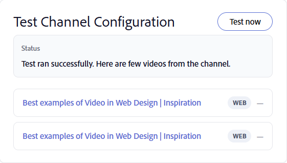

# 채널 만들기

조직은 종종 지식 공유 세션, 교육 기록 및 기타 비디오 콘텐츠를 선별된 웹 및 Confluence Cloud 페이지에 저장합니다. 채널은 Adobe Learning Manager을 이러한 콘텐츠 소스에 연결하여 학습자가 여러 시스템을 탐색할 필요 없이 비디오를 더 쉽게 검색하고 소비할 수 있도록 합니다. 채널을 통해 기업 웹 페이지 및 Confluence Cloud 페이지에서 비디오 기반 학습 콘텐츠를 검색 가능한 단일 위치에 구성하고 공유할 수 있습니다. 학습자는 여러 내부 사이트에서 검색하는 대신 Adobe Learning Manager에서 직접 관련 레코딩을 검색하고 액세스할 수 있습니다. 자세한 내용은 [채널 검색 및 참여](../../learners/feature-summary/discover-and-engage-with-channels.md)를 참조하세요.

책임자는 학습자가 채널에 액세스할 수 있도록 하기 전에 채널을 만들고 관리하고, 가시성 설정을 구성하고, 콘텐츠를 소스와 동기화하고, 비디오를 사용할 수 있는지 확인할 수 있습니다. 이 문서에서는 이러한 채널 관리 작업을 수행하는 방법에 대해 설명합니다.

**주요 이점**

- 여러 내부 소스의 비디오 기반 학습 콘텐츠를 한 위치에 통합합니다.
- 여러 인트라넷 위치의 비디오 콘텐츠를 웹 페이지로 큐레이션한 다음 ALM에 채널로 표시합니다.
- 학습자가 여러 사이트를 탐색하지 않고도 콘텐츠를 찾고, 즐기고, 참여할 수 있습니다.
- 원본 소스와 동기화된 컨텐츠 유지

## 채널 활성화

채널은 관리자가 계정에 대해 설정하는 기능입니다. 활성화되면 비디오 콘텐츠가 포함된 엔터프라이즈 웹 페이지 및 클라우드 연결 페이지에 연결되는 채널을 만들 수 있습니다.

채널 Crawler는 해당 컨텐츠를 다음 형식으로 제공하는 소스 페이지에서 비디오를 안정적으로 추출합니다.

- 표
- 글머리 기호 목록
- 문서

**채널** 기능을 사용하려면:

1. 관리자로 Adobe Learning Manager에 로그인합니다.

1. 왼쪽 탐색에서 **채널**을 선택합니다.
     **채널** 페이지가 열립니다.

1. **설정** 탭을 선택합니다.

   

   *관리자가 계정에 대한 채널을 만들 수 있도록&#x200B;**설정**탭에서 채널 기능을 활성화합니다.*

1. **채널 기능**&#x200B;을 사용하도록 설정하십시오.

     계정에 대해 채널을 사용할 수 있습니다.

## 채널 만들기

Adobe Learning Manager에서 비디오를 검색하는 콘텐츠 소스를 정의하는 채널을 만들고 채널 및 비디오 페이지 모양을 사용자 지정합니다.

1. **채널** 탭으로 이동하고 **채널 추가**를 선택합니다.
     **채널 만들기** 페이지가 열립니다.

   

   *채널을 만들 때 콘텐츠 원본을 정의하고 표시 여부 및 동기화 옵션을 구성합니다.*

1. **채널** 섹션에서 **채널 이름** 및 **설명**&#x200B;을 입력합니다.

1. 드롭다운 메뉴에서 **소스 유형**&#x200B;을 선택합니다. 다음과 같은 옵션을 사용할 수 있습니다.

   1. **웹 페이지**: 웹 페이지를 크롤링하고 비디오 링크와 관련 메타데이터를 가져오려면 이 옵션을 선택합니다.

   1. **Confluence page**: Confluence Cloud 페이지에서 비디오 링크 및 메타데이터를 검색하려면 이 옵션을 선택합니다. Confluence Cloud에 연결하려면 다음 세부 정보를 제공하십시오.
      - **아틀라시안 전자 메일 주소**: Atlassian 계정과 연결된 전자 메일 주소를 입력하십시오.
      - **Atlassian API 토큰**: Atlassian 계정에서 생성된 API 토큰을 입력하십시오. API 토큰 생성에 대한 지침을 보려면 **API 토큰을 만드는 방법**&#x200B;을 선택하십시오. 이 토큰은 소스를 크롤링할 때 인증에 사용되며 암호화되어 저장됩니다.

      

      *Confluence Cloud로 인증하는 데 사용되는 Atlassian 전자 메일 주소와 API 토큰을 입력하십시오.*

1. 선택한 소스 유형 콘텐츠의 **소스 URL**&#x200B;을(를) 입력하십시오.

1. **상태** 섹션에서 다음 옵션을 구성합니다.

   1. **학습자에게 표시**: 학습자가 채널을 사용할 수 있게 하려면 이 옵션을 활성화합니다. 구성 또는 테스트를 계속하는 동안 채널을 숨기려면 이 옵션을 비활성화합니다.

   1. **자동으로 동기화**: 새 비디오가 소스에 추가될 때 채널을 자동으로 업데이트하려면 이 옵션을 활성화하십시오. 채널을 수동으로 동기화하려면 이 옵션을 비활성화하십시오.

1. (선택 사항) **고급 설정 표시**&#x200B;를 선택한 후 필요에 따라 다음 옵션을 구성합니다.

   1. **채널 테마 색상**: 채널의 시각적 모양을 사용자 지정할 색상을 선택합니다.

   1. **크롤링 깊이**: 연결된 페이지의 크롤링 깊이를 입력하여 비디오 콘텐츠를 검색합니다. 최대 크롤링 깊이 **2**&#x200B;을(를) 지원합니다.

   1. **크롤링 빈도(시간)**: Adobe Learning Manager에서 새 콘텐츠 또는 업데이트된 콘텐츠가 있는지 원본을 확인하는 빈도를 입력하십시오.

      

      *고급 설정 표시 를 선택하여 채널 테마 색상, 크롤링 깊이 및 크롤링 빈도를 구성합니다.*

1. **지금 테스트**&#x200B;를 선택하여 원본의 유효성을 검사하세요. 샘플 비디오는 구성된 소스에서 검색되어 표시됩니다.

   

   *채널을 만들기 전에&#x200B;**지금 테스트**를 사용하여 소스에서 비디오가 검색되는지 확인합니다.*

1. **채널 만들기**&#x200B;를 선택합니다. 채널이 만들어져 **채널** 목록에 추가됩니다.

## 채널 검색

검색 상자를 사용하여 이름으로 채널을 빠르게 찾을 수 있습니다.

1. **채널** 탭을 선택합니다.
1. **채널 검색** 상자를 선택합니다.
1. **채널 검색** 상자에 채널 이름 또는 그 일부를 입력하십시오.
     목록 필터가 검색과 일치하는 채널만 표시합니다.

   

   *검색 상자에 채널 이름을 입력하여&#x200B;**채널**목록을 필터링합니다.*

## 채널 가시성 관리

**동작** 메뉴를 사용하여 하나 이상의 채널을 동시에 비활성화하거나 숨깁니다.

### 채널 비활성화

하나 이상의 채널을 비활성화하여 채널 구성을 유지하면서 학습자가 콘텐츠에 액세스하지 못하도록 합니다.

채널을 비활성화하려면 다음을 수행하십시오.

1. **채널**(으)로 이동합니다.
1. 하나 이상의 채널 옆에 있는 확인란을 선택한 다음 **동작**&#x200B;을 선택합니다.

   ![하나 이상의 선택한 채널을 사용하지 않으려면 [동작] 메뉴에서 [사용 안 함]을 선택하십시오.](assets/disable-channels.png)
   *하나 이상의 선택한 채널을 사용하지 않으려면 [동작] 메뉴에서 [사용 안 함]을 선택하십시오.*
1. **사용 안 함**.  선택 **채널 사용 안 함** 팝업 창이 나타납니다.
1. **사용 안 함**.  선택 선택한 채널을 사용할 수 없습니다.

### 학습자의 채널 숨기기

학습자가 삭제하지 않고 사용할 수 없도록 하나 이상의 채널을 숨깁니다.

학습자의 채널을 숨기려면 다음을 수행하십시오.

1. **채널**(으)로 이동합니다.
1. 하나 이상의 채널 옆에 있는 확인란을 선택한 다음 **동작**&#x200B;을 선택합니다.
1. **학습자에게 숨기기**&#x200B;를 선택합니다.  **학습자에게 숨기기** 팝업 창이 나타납니다.

   
   *채널 구성을 삭제하지 않고 학습자의 채널을 숨깁니다.*

1. **학습자에게 숨기기**를 선택합니다.
     선택한 채널이 학습자에게 숨겨져 있습니다.

## 채널 편집

기존 채널을 편집하여 구성 및 설정을 업데이트할 수 있습니다.

채널을 편집하려면 다음을 수행하십시오.

1. **채널** 목록에서 필요한 채널을 선택합니다.
     **채널 편집** 페이지가 열리고 현재 채널 구성이 표시됩니다.

1. 필요에 따라 채널 설정을 업데이트합니다.

   

   ***채널 편집**페이지에서 채널 이름, 설명, 원본 및 설정을 업데이트합니다.*

1. (선택 사항) **지금 테스트**&#x200B;를 선택합니다.

1. **변경 내용 저장**을 선택합니다.
     업데이트된 채널 설정이 저장됩니다.

## 채널 삭제

더 이상 필요하지 않은 하나 이상의 채널을 삭제할 수 있습니다.

1. **채널** 탭으로 이동합니다.

1. 삭제하려는 각 채널 옆에 있는 확인란을 선택합니다.

1. [채널] 목록의 오른쪽 아래에서 **삭제**&#x200B;를 선택합니다.   **채널 삭제** 팝업 창이 나타납니다.

   

   *확인 대화 상자에 선택한 채널이 나열됩니다.*

1. **삭제**를 선택합니다.
     선택한 채널이 영구적으로 삭제됩니다. 이 작업은 실행 취소할 수 없습니다.
