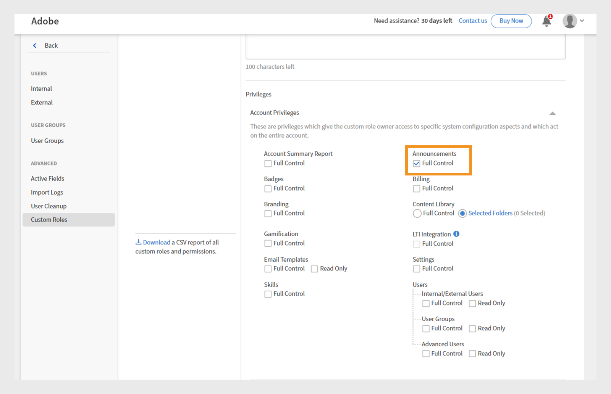
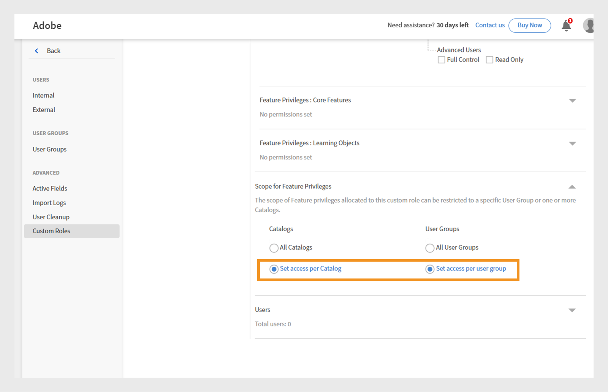

# 범위가 지정된 공지 권한이 있는 사용자 정의 역할

관리자는 특정 카탈로그 및 사용자 그룹으로 제한된 공지 권한으로 사용자 정의 역할을 만들 수 있습니다. 이렇게 하면 공지가 대상으로, 관련성이 있으며 의도한 학습자에게만 표시됩니다. 범위 지정 공지는 올바른 사용자가 다른 사람에게 세부 정보를 보내지 않고 관련 공지를 받도록 합니다.

## 특정 범위로 사용자 정의 역할 만들기

관리자는 특정 카탈로그 및 사용자 그룹으로 제한된 공지 권한으로 사용자 정의 역할을 만들 수 있습니다.

특정 범위로 사용자 정의 역할을 생성하려면 다음을 수행합니다.

1. 관리자 권한으로 Adobe Learning Manager에 로그인합니다.
2. 왼쪽 탐색 창에서 **[!UICONTROL 사용자]**&#x200B;를 선택합니다.

   
   _Adobe Learning Manager에서 지정된 권한 및 책임을 위해 사용자에게 사용자 지정 역할 할당_

3. 사용자 정의 역할을 선택합니다.
4. 사용자 정의 역할 생성을 선택합니다.

   
   _사용자에게 사용자 지정 역할을 할당하여 권한을 사용자 정의하고 특정 사용자 그룹 또는 카탈로그에 대한 관리 제어를 간소화합니다_

5. 사용자 정의 역할의 이름 및 설명을 입력합니다.
6. 계정 권한에서 공지 를 선택합니다.

   
   _사용자 지정 관리자가 범위 내에서 대상 통신을 관리할 수 있도록 허용하려면 계정 권한에서 공지 권한을 활성화하십시오._

7. 기능 권한의 범위에서 카탈로그별로 액세스 설정 을 선택하고 카탈로그를 선택합니다.
8. 동일한 섹션에서 사용자 그룹별 액세스 설정 을 선택하고 필요한 항목을 선택합니다
사용자 그룹.

   
   _사용자 지정 관리자가 할당된 범위 내에서만 권한과 액세스를 관리할 수 있도록 사용자 그룹 및 카탈로그 범위를 설정합니다._

9. 이 사용자 지정 역할을 할당할 사용자를 선택하고 추가합니다. 할당된 사용자는 자신의 범위에 대한 공지를 만들 수 있습니다.

사용자 정의 관리자는 할당된 사용자 그룹 및 카탈로그로 제한하여 메시지가 올바른 대상자에게 도달하도록 하고 불필요한 알림을 방지합니다. 알림 및 이메일 공지의 경우 관리자는 추가 사용자 그룹을 추가할 수 있지만 정의된 범위 내의 사용자만 이를 받습니다. 추천 및 발행인란 공지사항에 대해서는 할당된 범위 내의 사용자 그룹만 선택할 수 있습니다.

## 할당된 범위에 대한 알림 만들기

사용자 정의 관리자는 할당된 사용자 그룹 및 카탈로그로 제한하여 메시지가 올바른 대상자에게 도달하도록 하고 불필요한 알림을 방지합니다.

할당된 범위에 대한 공지를 만들려면 다음을 수행하십시오.

1. 사용자 정의 관리자로 Adobe Learning Manager에 로그인합니다.
2. 왼쪽 탐색 창에서 **[!UICONTROL 공지]**&#x200B;를 선택합니다.
3. **[!UICONTROL 추가]**&#x200B;를 선택합니다.

   
   관리자가 대상 사용자 그룹에 대한 공지를 만들고 관리할 수 있는 Adobe Learning Manager의 _공지 페이지_

4. 드롭다운 메뉴에서 **[!UICONTROL 공지 유형]**&#x200B;을 선택합니다.
a. **[!UICONTROL 알림으로]**
b. **[!UICONTROL 발행인란으로]**
c. **[!UICONTROL 권장 사항]**
d. **[!UICONTROL 전자 메일로]**
5. **[!UICONTROL 발행인란으로]**&#x200B;를 선택합니다.
6. 언어를 선택하고 발행인란의 이미지를 업로드합니다.
7. 필요한 경우 작업 버튼에 대한 URL을 추가합니다.

   
   _공지 작성 화면을 통해 관리자가 공지 유형을 설정하고, 첨부 파일을 업로드하고, 작업 버튼을 추가할 수 있습니다._

   할당된 범위는 **[!UICONTROL 범위]** 섹션에서 미리 선택되었으며 사용자 지정 관리자가 수정할 수 없습니다.

   >[!NOTE]
   >
   >**[!UICONTROL 알림]** 및 **[!UICONTROL 전자 메일]** 공지의 경우, 할당된 범위와 겹치는 경우 추가 사용자 그룹 및 카탈로그를 포함할 수 있습니다.

8. **[!UICONTROL 저장]**&#x200B;을 선택합니다.

사용자 정의 책임자 범위에 있는 학습자만 공지를 볼 수 있습니다. 여러 유형의 공지를 만드는 방법은 이 [문서](/help/migrated/administrators/feature-summary/announcements.md)를 참조하세요.

## 사용자 지정 관리자가 범위 재설정

책임자가 공지 범위를 변경한 경우 사용자 정의 책임자는 게시된 공지의 범위를 재설정할 수 있습니다. 범위가 재설정되고 나면 업데이트된 범위가 공지에 적용되며 새 범위에 있는 학습자만 공지를 볼 수 있습니다.

범위를 재설정하려면 다음을 수행하십시오.

1. 사용자 정의 관리자로 Adobe Learning Manager에 로그인합니다.
2. 왼쪽 탐색 창에서 **[!UICONTROL 공지]**&#x200B;를 선택합니다.
3. **[!UICONTROL 게시]** 탭을 선택합니다.
4. 공지를 선택한 다음 설정 아이콘을 선택합니다.
5. **[!UICONTROL 편집]**&#x200B;을 선택합니다.

   
   _편집, 게시 및 기타 옵션이 있는 게시된 공지를 보여 주는 공지 화면_

6. **다시 설정**&#x200B;을 선택합니다.

   
   _사용자 지정 관리자가 새 액세스 권한을 반영하도록 범위 선택을 다시 설정하고 업데이트할 수 있는 옵션과 함께 범위 변경 알림을 표시하는 알림_

범위가 업데이트되며 업데이트된 범위 내의 사용자만 공지를 볼 수 있습니다.

## 관리자 UI를 통해 공지 편집

책임자는 사용자 정의 책임자가 만든 모든 공지를 편집하고 관리할 수 있습니다. 관리자가 특정 범위를 가진 사용자 지정 관리자가 만든 공지를 편집하려고 하면 공지에 **[!UICONTROL 제거]** 범위를 나타내는 경고 메시지가 나타납니다. 책임자는 범위를 제거하여 모든 사용자가 공지를 사용할 수 있도록 할 수 있습니다. 이 경우 사용자 정의 관리자에게 알림 범위가 변경되었다는 경고가 표시됩니다.

관리자 UI를 통해 공지를 편집하려면 다음을 수행합니다.

1. 관리자 권한으로 Adobe Learning Manager에 로그인합니다.
2. 왼쪽 탐색 창에서 **[!UICONTROL 공지]**&#x200B;를 선택합니다.
3. **[!UICONTROL 게시]** 탭을 선택합니다.
4. 공지를 선택한 다음 설정 아이콘을 선택합니다.
5. **[!UICONTROL 편집]**&#x200B;을 선택합니다.

   
   _편집, 게시 및 기타 옵션이 있는 게시된 공지를 보여 주는 공지 화면_

6. **[!UICONTROL 제거]**&#x200B;를 선택합니다.

   
   _범위를 지정한 사용자 그룹에 대해 만든 공지를 관리자가 편집할 수 있도록 범위를 제거해야 함을 나타내는 공지 화면_

관리자는 범위를 제거한 후 공지를 편집할 수 있습니다.
