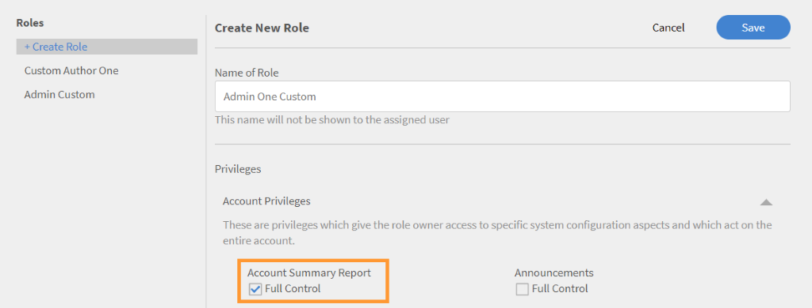
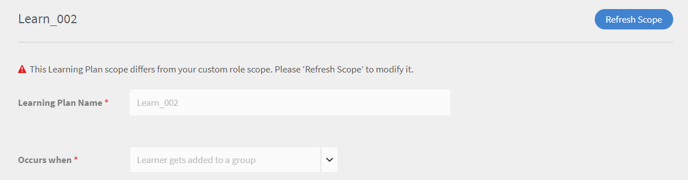

# 사용자 정의 역할

이 기능을 사용하면 사용자 정의 역할을 정의하고 사용자 집합에 특정 권한을 지정할 수 있습니다. 이 기능을 사용하면 개인의 기존 역할 범위 외부에서 권한을 지정할 수 있습니다.

사용자 정의 역할을 통해 특정 카탈로그에 제한된 작성 기능을 사용하도록 할 수 있습니다. 또한, 보고 관리를 위한 역할을 만들 수도 있습니다. 그런 다음 이러한 특정 책임을 져야 하는 개인에게 이러한 역할을 부여할 수 있습니다.

## 사용자 정의 역할 생성 {#create-role}

1. 책임자로 로그인합니다. 열기 **[!UICONTROL 사용자]** > **[!UICONTROL 사용자 정의 역할]**.
1. 선택 **[!UICONTROL 역할 만들기]**. **[!UICONTROL &#39;새 역할 생성&#39;]** 창을 클릭합니다.

   

   *사용자 정의 역할 만들기*

1. 다음 위치에 이름을 입력합니다. **[!UICONTROL 역할 이름]** 필드.
1. **[!UICONTROL 계정 권한]**: 이러한 권한은 역할 소유자에게 전체 계정에서 작동하는 특정 시스템 구성 측면에 대한 액세스 권한을 제공합니다. 접근 권한을 선택합니다. 사용자는 할당된 권한을 완전히 제어할 수 있습니다.

>[!NOTE]
>
>   이러한 권한에는 범위를 적용할 수 없습니다.

*범위 설정*

1. **기능 권한 - 핵심 기능**: 학습 활동 관리를 위한 특정 기능에 대한 액세스 권한을 부여하는 데 사용됩니다. 이 옵션을 사용하면 다음 기능에 대한 권한을 부여할 수 있습니다.

   * 카탈로그
   * 보고서
   * 태그

   

   *카탈로그, 보고서 및 태그의 범위 설정*

1. **기능 권한 - 학습 객체:**  LO 관련 기능에 대한 액세스 권한을 제공하려면 이 옵션을 사용하십시오. 다음 LO에 대한 액세스 권한을 제공할 수 있습니다.

   * 인증
   * 강의
   * 작업 지원
   * 학습 프로그램

   LO에 대한 특정 작업 제어를 부여할 수도 있습니다. 사용 권한은 다음 중 하나를 따릅니다.

   * 전체 제어
   * 편집 및 삭제
   * 등록
   * 보고

   

   *특정 권한 부여*

1. **기능 권한의 범위:** 이 역할에 할당되는 기능 권한의 범위는 특정 사용자 그룹 또는 하나 이상의 카탈로그로 제한될 수 있습니다.

   카탈로그: 라디오 버튼을 사용하여 **[!UICONTROL 모든 카탈로그]**&#x200B;에 권한을 부여하거나, **[!UICONTROL 카탈로그 당 접근 설정]** 옵션을 사용하여 특정 카탈로그에 대한 접근 권한을 제공합니다. 또한, 여러 가지 카탈로그를 선택할 수도 있습니다.

   사용자 그룹: **[!UICONTROL 모든 사용자 그룹]**&#x200B;에 접근 권한을 부여하거나, **[!UICONTROL 사용자 그룹 당 접근 설정]** 옵션을 사용하여 특정 사용자 그룹에 접근 권한을 제공합니다. 특정 사용자 그룹만 지정할 수 있습니다.

   >[!NOTE]
   >
   >계정 권한에서 공지, 게임화, 이메일 템플릿, 스킬 및 사용자를 선택한 경우, 사용자 그룹 액세스 권한이 기본적으로 모든 사용자 그룹에 제공되며 이 옵션은 비활성화됩니다.

   계정 권한에서 학습 계획을 선택하면 모든 카탈로그와 사용자 그룹 접근이 기본적으로 제공됩니다. 그리고 범위 아래에서 이러한 옵션은 사용하지 않도록 설정됩니다.

   

   *권한 범위 정의*

>[!NOTE]
>
>   Learning Manager 27.6에서는 각 카탈로그에 서로 다른 권한 집합이 부여된 여러 카탈로그에 범위를 지정할 사용자 정의 역할을 만들 수 있습니다.

카탈로그에 다양한 권한을 부여하려면 아래 단계를 따르십시오.

1. **[!UICONTROL 카탈로그별 액세스 설정]** 옵션을 클릭합니다.
1. 카탈로그를 선택하면 각 카탈로그의 권한 레벨을 볼 수 있습니다. 권한은 다음과 같습니다.

   <table>
        <tbody>
        <tr>
          <td>
          
<b>권한</b>
</td>
          <td>
          
<b>설명</b>
</td>
        </tr>
        <tr>
          <td>
          
전체 제어
</td>
          <td>
          
모든 학습 객체에 대한 전체 제어를 부여합니다. 권한에는 추가, 편집, 삭제, 읽기, 등록 및 보고가 포함됩니다. 
</td>
        </tr>
        <tr>
          <td>
          
보고
</td>
          <td>
          
학습 객체의 보고서 탭에 액세스할 수 있는 권한만 부여합니다.
</td>
        </tr>
        <tr>
          <td>
          
등록
</td>
          <td>
          
학습 객체에 등록할 수 있는 권한만 부여합니다.
</td>
        </tr>
        <tr>
          <td>
          
읽기 전용
</td>
          <td>
          
카탈로그에서 학습 객체를 볼 수 있는 권한만 부여합니다.
</td>
        </tr>
        </tbody>
      </table>

1. 요구 사항에 따라 권한을 활성화 또는 비활성화합니다.
1. 변경 사항을 저장하려면 **[!UICONTROL 확인]**&#x200B;을 클릭합니다. 그런 다음 사용자 정의 역할의 변경 사항을 저장하려면 **[!UICONTROL 저장]**&#x200B;을 클릭합니다.

예를 들어, 다음 시나리오를 고려하십시오.

사용자 정의 사용자가 학습 객체에 대해 가질 수 있는 권한은 학습 객체 권한과 카탈로그 권한의 교집합입니다.

사용자 정의 사용자는 강의를 대상으로 전체 권한을 가지며 카탈로그 A에는 읽기 전용 액세스 권한만을, 카탈로그 B에는 전체 권한을 가집니다. 이런 경우 결과적으로 카탈로그 A 강의에는 읽기 전용 액세스 권한을 가지며 카탈로그 B 강의에는 전체 제어 권한을 갖게 됩니다.

사용자 정의 역할이 있는 사용자는 다음을 수행할 수 있습니다.

* 액세스 권한이 있는 카탈로그의 콘텐츠만 볼 수 있습니다.
* 학습 객체가 포함된 카탈로그의 권한에 따라 모든 학습 객체에 액세스합니다.

  책임자는 다음을 수행할 수 있습니다.

* 사용자 정의 역할에 대해 둘 이상의 카탈로그를 선택할 수 있습니다.
* 언제든지 카탈로그의 권한을 수정할 수 있습니다.
* 더 이상 권한을 부여하지 않으려는 범위에서 카탈로그를 제거할 수 있습니다.
* 카탈로그에 대한 권한을 부여할 때 카탈로그에 대한 읽기 전용 권한을 암묵적으로 부여할 수 있습니다.

  아래 표는 권한 부여 방법을 보여줍니다.

  <table>
    <tbody>
     <tr>
      <td>
       
<strong> </strong>
</td>
      <td>
       
<strong>카탈로그 레벨 권한</strong>
</td>
     </tr>
     <tr>
      <td>
       
<strong>학습 객체- 레벨 권한</strong>

       
<strong>(예: 강의)</strong>
</td>
      <td>
       
전체 제어
</td>
      <td>
       
등록
</td>
      <td>
       
보고
</td>
      <td>
       
읽기 전용
</td>
     </tr>
     <tr>
      <td>
       
전체 제어
</td>
      <td>
       
전체 제어
</td>
      <td>
       
등록
</td>
      <td>
       
보고
</td>
      <td>
       
읽기 전용
</td>
     </tr>
     <tr>
      <td>
       
등록
</td>
      <td>
       
등록
</td>
      <td>
       
등록
</td>
      <td>
       
읽기 전용
</td>
      <td>
       
읽기 전용
</td>
     </tr>
     <tr>
      <td>
       
편집 및 삭제
</td>
      <td>
       
편집 및 삭제
</td>
      <td>
       
읽기 전용
</td>
      <td>
       
읽기 전용
</td>
      <td>
       
읽기 전용
</td>
     </tr>
     <tr>
      <td>
       
보고
</td>
      <td>
       
보고
</td>
      <td>
       
읽기 전용
</td>
      <td>
       
보고
</td>
      <td>
       
읽기 전용
</td>
     </tr>
    </tbody>
   </table>

1. **사용자:** 이 역할을 부여받은 사용자를 확인하려면 이 옵션을 사용합니다. 검색 상자를 사용하여 사용자를 한 명 이상 선택할 수 있습니다.

   **사용자 정의 역할 CSV 업로드에 사용자 추가:** CSV 업로드를 통해 사용자를 추가하려면 관리자가 사용자를 가져오는 데 사용한 .csv 파일에 CustomRole 열을 추가합니다. 사용자 정의 역할을 할당할 사용자의 CustomRole 열에 사용자 역할을 입력합니다. CSV 파일을 업로드하려면  **[!UICONTROL 추가 > CSV 업로드]**.

   사용자 지정 역할 열참고:

* 사용자 그룹 검색은 할 수 없습니다.
* 이미 책임자 역할을 부여받은 사용자는 검색할 수 없습니다.
* 사용자에게 새 사용자 정의 역할을 할당하면 사용자의 이전 사용자 정의 역할이 재정의됩니다.

  <!---->

* 설정에 대한 권한이 있는 사용자 지정 관리자는 사용자 엔터티에 대한 권한이 없더라도 데이터 소스의 사용자 동기화 또는 동기화에 대한 일정을 구성할 수 있습니다.
* 사용자 정의 책임자가 사용자 개체를 대상으로 하는 권한을 가진 경우, 사용자 정의 책임자는 스스로 책임자 역할을 부여하고 기본 책임자가 될 수 있습니다.

## 사용자 정의 작성자에 관한 폴더 액세스 제한 {#folder-custom-author}

Learning Manager는 사용자 정의 역할을 사용하여 콘텐츠 라이브러리에 대한 액세스 권한을 부여하는 기능을 이미 지원합니다. 이미 콘텐츠 라이브러리에 액세스할 수 있는 모든 사용자 정의 작성자는 콘텐츠 폴더가 구성된 후에도 모든 콘텐츠 파일에 계속 액세스할 수 있습니다. 이는 레거시 동작을 유지하기 위한 것입니다. 관리자는 현재 동작을 계속 수행하려는 경우 변경할 필요가 없습니다.

이러한 사용자 정의 작성자에 대한 액세스를 제한하려는 경우 관리자는 기존 사용자 정의 역할을 편집하고 특정 콘텐츠 폴더에만 액세스 권한을 제공하여 구성해야 합니다.

*사용자 정의 작성자에 대한 폴더 액세스 제한*

사용자 정의 작성자를 만드는 동안 이제 콘텐츠 폴더를 작성자에게 할당할 수 있습니다. 옵션 선택 **선택한 폴더**.

옵션을 클릭하고 나면 새 대화 상자가 열리며 여기에서 폴더를 사용자 정의 작성자에게 할당할 수 있습니다.

*사용자 정의 작성자를 위한 폴더 선택*

폴더를 선택하고 **[!UICONTROL 확인]**.

## 사용자 정의 책임자에 대한 학습 요약 대시보드 {#custom-admin-dashboard}

사용자 정의 관리자는 관리자가 보는 것과 동일한 보기를 볼 수 있습니다. 사용자 정의 관리자는 자신의 범위 밖에 데이터를 저장할 수 있습니다. 이는 사용자 정의 책임자에게 전체 범위가 있는 경우에만 적용됩니다. 전체 범위를 부여하려면 사용자 정의 책임자를 만드는 동안 옵션을 활성화합니다 **[!UICONTROL 전체 제어]** 계정 요약 보고서.

*사용자 정의 역할 만들기*

결과적으로 옵션은 **[!UICONTROL 모든 카탈로그]** 및 **[!UICONTROL 모든 사용자 그룹]** 이(가) 선택되고 나머지는 비활성화됩니다.

*권한 범위 정의*

## 임시 사용 권한 {#implicitpermissions}

사용자에게 특정 엔티티가 있는 역할이 부여된 경우 부여된 엔티티에서 작업을 수행할 수 있도록 다른 엔티티에도 액세스해야 하는 경우가 있을 수 있습니다. 예를 들어, 사용자에게 강의 엔티티에 대한 생성 액세스 권한이 부여되는 경우, 강의 엔티티를 생성 중인 강의와 연관시킬 수 있도록 스킬 및 태그 엔티티에 대한 액세스 권한이 필요합니다. 이 표에서는 이러한 암시적 권한에 대한 정보를 제공합니다.

<table>
 <tbody>
  <tr>
   <th>접근 권한 유형</th>
   <th>책임자가 부여한 개체 권한</th>
   <th>임시 개체 권한</th>
   <th>임시 접근</th>
  </tr>
  <tr>
   <td>관리</td>
   <td>사용자</td>
   <td>그룹</td>
   <td>CRUD(생성, 읽기, 갱신, 삭제)</td>
  </tr>
  <tr>
   <td>등록</td>
   <td>모든 los(강의, 작업 지원, 학습 프로그램, 인증)</td>
   <td>사용자 
     학습 계획</td>
   <td>읽기</td>
  </tr>
  <tr>
   <td>생성</td>
   <td>
    
콘텐츠 그룹 
      작업 지원 
</td>
   <td>태그</td>
   <td>읽기</td>
  </tr>
  <tr>
   <td>생성</td>
   <td>강의</td>
   <td>콘텐츠 그룹 
     태그 
     스킬 
     배지 
     작업 지원</td>
   <td>전부 읽기</td>
  </tr>
  <tr>
   <td>생성</td>
   <td>학습 프로그램 
     인증 </td>
   <td>강의 
     태그 
     스킬 
     배지</td>
   <td>읽기</td>
  </tr>
  <tr>
   <td>생성</td>
   <td>학습 계획</td>
   <td>카탈로그 
     그룹 
     스킬 
     모든 손실(강의, 작업 지원, 학습 프로그램, 인증)</td>
   <td>읽기</td>
  </tr>
  <tr>
   <td>생성</td>
   <td>공지</td>
   <td>사용자 
     그룹 
     모든 손실(강의, 작업 지원, 학습 프로그램, 인증)</td>
   <td>읽기</td>
  </tr>
  <tr>
   <td>생성</td>
   <td>게임화</td>
   <td>브랜딩</td>
   <td>작성</td>
  </tr>
  <tr>
   <td>*</td>
   <td>사용자</td>
   <td>청구</td>
   <td>읽기</td>
  </tr>
  <tr>
   <td>*</td>
   <td>카탈로그</td>
   <td>그룹 
     모든 손실(강의, 작업 지원, 학습 프로그램, 인증)</td>
   <td>읽기</td>
  </tr>
  <tr>
   <td>*</td>
   <td>설정</td>
   <td>브랜딩 
     사용자</td>
   <td>읽기</td>
  </tr>
  <tr>
   <td>*</td>
   <td>브랜딩</td>
   <td>설정</td>
   <td>읽기</td>
  </tr>
  <tr>
   <td>*</td>
   <td>결제 
     게임화</td>
   <td>사용자</td>
   <td>읽기</td>
  </tr>
 </tbody>
</table>

## 사용자 정의 접근 {#accessacustomrole}

책임자가 사용자 정의 역할을 부여하면 전자 메일 알림을 받을 수 있습니다.

참고: 사용자 정의 역할로 이미 Learning Manager에 로그인한 경우에 새 역할로 접속하려면 Learning Manager에 다시 로그인해야 합니다.

역할을 전환하려면 Learning Manager 오른쪽 상단에 있는 프로필 아이콘을 클릭하고 원하는 역할을 클릭합니다.

## 구성 가능한 역할별로 범위가 지정된 학습 계획 {#scopeconfigure}

이전 버전의 Learning Manager에서는 학습 계획을 생성할 수 있는 권한이 부여된 모든 사용자 정의 역할에서 모든 유형의 사용자 그룹 및 학습 객체에 대한 학습 계획의 범위를 지정할 수 있었습니다.

학습 계획 액세스 권한이 부여될 때 범위 설정이 비활성화되어 기본적으로 모든 카탈로그 및 모든 사용자 그룹에 대한 액세스 권한이 사용자에게 부여되었습니다.

책임자가 생성한 모든 학습 계획은 기본적으로 모든 사용자에게 적용됩니다. 사용자에게 모든 학습 객체를 할당할 수도 있습니다. 반면 사용자 정의 역할이 부여된 사용자는 모든 범위(예: 모든 카탈로그, 학습 객체 또는 사용자 그룹)에 액세스할 수 있습니다. 즉, 책임자는 제한된 범위로 사용자의 학습 계획에 대한 액세스를 허용하는 사용자 정의 역할을 예상대로 생성할 수 없었습니다.

이번 Learning Manager 업데이트에서는 사용자 및 학습 객체의 범위를 지정할 수 있는 학습 계획에 대해 사용자 정의 역할을 생성할 수 있습니다. 즉, 학습 계획을 사용자 정의 책임자의 역할 범위에 기반한, 제한된 범위로 생성할 수 있습니다.

이제 책임자는 학습 계획 관리 액세스 권한 부여 시 범위를 정의하거나 제한할 수 있습니다.

사용자 정의 책임자는 구성 가능한 역할의 범위에 따라 제한된 범위의 학습 계획을 생성할 수 있습니다. 이러한 학습 계획은 일반 책임자 외에 동일한 역할을 가진 사용자 정의 책임자만 액세스할 수 있습니다. 또한 사용자 정의 책임자는 계정에서 어떤 다른 학습 계획도 볼 수 없습니다.

학습 계획에 액세스할 수 있는 기존 사용자 정의 책임자는 항상 정의에 따라 전체 범위에 대한 권한을 갖게 되며, 일반 책임자처럼 계정에서 모든 학습 계획에 액세스할 수 있습니다. 전체 범위로 생성된 새로운 사용자 정의 역할 및 이러한 역할에 추가된 새로운 사용자 정의 책임자는 모든 학습 계획에 계속 액세스할 수 있습니다.

책임자 및 전체 권한 사용자 정의 책임자가 생성한 학습 계획은 일반적인 방식으로 생성되며 범위에 의해 제한되지 않습니다.

**기능 권한 범위** 섹션에서 사용자 정의 역할에 대한 사용자 그룹 및/또는 카탈로그에 대한 액세스를 부여할 수 있습니다.

*사용자 정의 역할에 대한 사용자 그룹 및/또는 카탈로그에 대한 액세스 권한 부여*

사용자를 사용자 정의 역할에 할당

*사용자 정의 역할에 사용자 지정*

사용자는 이제 Learning Manager에 사용자 정의 책임자로 로그인하고 학습 계획을 추가합니다.

새로운 학습자가 추가되면 사용자 정의 책임자는 구성 가능한 역할의 범위가 지정된 카탈로그에서만 교육을 선택할 수 있습니다.

이제 이 학습 계획은 사용자가 학습 계획의 범위 사용자 그룹 내의 그룹에도 추가된 경우에만 학습자에게 적용됩니다. 다른 모든 학습자는 이 학습 계획에서 제외됩니다.

## 학습자를 그룹에 추가 {#learnergetsaddedtothegroup}

<!---->

사용자 정의 책임자는 해당 역할의 범위가 지정된 사용자 그룹 내의 사용자가 속한 모든 사용자 그룹을 선택할 수 있습니다.

사용자가 지정된 그룹에 추가되면 이미 학습 계획의 범위가 지정된 사용자 그룹에 속해 있고, 지정된 사용자 그룹에 추가된 사용자에게만 학습 객체가 할당됩니다.

## 범위 변경 {#changeinscope}

책임자가 사용자 정의 역할의 범위를 변경하면 해당 변경 사항이 사용자 정의 책임자에게도 적용됩니다. 사용자 정의 책임자가 이전 사용자 정의 역할에 의해 이미 범위가 지정된 학습 계획을 선택하면 다름과 같은 메시지가 표시됩니다.

*범위 변경 후 메시지*

이제 사용자 정의 책임자는 이전 범위를 새 범위로 업데이트하거나 새로 고쳐야 합니다.

**[!UICONTROL 범위 새로 고침]**&#x200B;을 클릭하면 범위가 업데이트되고, 다음과 같은 경고 메시지가 표시됩니다.

*범위를 새로 고친 후 경고 메시지*

**[!UICONTROL &#39;예&#39;]**&#x200B;를 클릭하면 범위가 업데이트됩니다.

## 게임화 보고서를 사용자 정의 역할에 추가 {#gamification-custom}

책임자는 사용자 정의 사용자에 대한 게임화 보고서를 활성화할 수 있습니다.

1. **[!UICONTROL 사용자 정의 역할]** 페이지에서 사용자 정의 역할 이름을 입력합니다.
1. (으)로 **[!UICONTROL 기능 권한: 핵심 기능]** 섹션, 옵션 활성화 **[!UICONTROL 전체 제어]** 범주 **[!UICONTROL 보고서]**.

1. **[!UICONTROL 사용자]** 섹션에서 새롭게 생성된 사용자 정의 역할을 할당할 사용자를 선택합니다.
1. **[!UICONTROL &#39;저장&#39;]**&#x200B;을 클릭합니다.

사용자가 사용자 정의 책임자로 로그인하고 왼쪽 창에서&#x200B;**[!UICONTROL &#39;보고서&#39;]**&#x200B;를 클릭하면 다음과 같은 성적 증명서가 표시됩니다.

*게임화 성적 증명서 다운로드*

**[!UICONTROL &#39;게임화 성적 증명서&#39;]**&#x200B;를 클릭하고 사용자를 선택한 다음 보고서를 생성합니다.

책임자가 레벨 점수를 변경하는 경우 현재 점수에 따른 레벨이 보고서에 표시됩니다.

게임화를 재설정해도 레벨을 달성한 날짜는 재설정되지 않습니다.

## 자주 묻는 질문 {#frequentlyaskedquestions}

+++사용자 정의 역할을 생성하려면 어떻게 해야 합니까?

사용자 정의 역할은 작성자 또는 책임자 역할의 하위 집합과 같습니다. 하나 또는 여러 권한을 허용하고 범위를 정의하며 역할을 사용자에게 할당할 수 있습니다.

다음을 수행합니다. **[!UICONTROL 사용자]** > **[!UICONTROL 사용자 정의 역할]**. 사용자 정의 역할 페이지에서 **[!UICONTROL 역할 생성]**&#x200B;을 클릭합니다. 사용자 정의 역할의 이름을 입력하고 그 역할에 주어지는 권한을 설정합니다. 자세한 내용은 [사용자 정의 역할 생성](custom-role.md#create-role)을 참조하십시오.
+++
