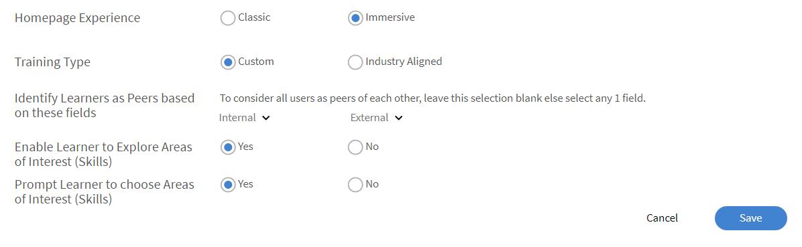

# 학습자 홈페이지 사용자 정의

## 개요 {#overview}

책임자는 학습자의 홈페이지를 사용자 정의하여 학습자에게 개인화된 최신 콘텐츠 기반으로 만들 수 있습니다.

개인화된 접근 방식은 위젯을 기반으로 한 학습자 홈페이지 제작 방식을 제공하며 조직의 책임자는 WYSIWYG 방식의 책임자 사용자 인터페이스에서 구성할 수 있습니다.

산업 스킬에 대한 타사 콘텐츠를 분석하고 명시적 및 임시 데이터를 사용하여 피어 활동과 학습자의 관심 영역을 통합하는 AI 기반 알고리즘의 개인화된 교육 권장 사항입니다.

### 학습자 홈페이지 사용자 정의

이 교육에서는 학습자 홈페이지를 사용자 정의하는 방법을 살펴봅니다.

교육을 시작할 수 없는 경우 <almacademy@adobe.com>에 작성하세요.

## 학습자 홈페이지 구성 {#configurethelearnerhomepage}

**브랜딩** > **학습자 홈페이지** 페이지에서 책임자는 학습자의 홈페이지 환경을 사용자 정의하여 학습자가 학습자 앱에 로그인하면 완전히 달라진 모습과 느낌을 확인할 수 있습니다.

관리자는 책임자 앱(**브랜딩** > **학습자 홈페이지** 탭)에서 UI(룩앤필)를 설정할 수 있습니다.

책임자는 몰입형 UI 위젯 보기로 전환하고, 이에 따라 위젯/기능을 사용자 정의한 다음 몰입형 UI를 활성화할 수 있습니다.

**학습자 홈페이지** 화면에는 다음 섹션이 포함되어 있습니다.

## 몰입형 레이아웃 옵션 {#immersivelayoutoption}

몰입 기반 페이지의 레이아웃을 보려면 **몰입** 옵션을 활성화합니다. **브랜딩 > 일반**&#x200B;에서 이 옵션을 전환할 수 있습니다.

이전 버전에서는 학습자 홈페이지 옵션이 &#39;설정&#39;에 있었습니다.

다음은 설정할 수 있는 옵션입니다.

**홈페이지 환경:** **클래식** 또는 **몰입형**&#x200B;을 사용하도록 설정합니다. &#39;몰입형&#39;을 선택하는 경우 다음 옵션이 나타납니다.

* **교육 유형:** **산업** 또는 **사용자 지정**&#x200B;을 선택하세요. 사용자 정의 교육은 사내에서 생성되었습니다. 산업 정렬 교육에는 타사 공급자의 바로 사용 가능한 콘텐츠가 포함됩니다.

*산업 또는 사용자 지정 맞춤을 선택하여 홈페이지 환경 설정*

클래식 환경과 몰입형 환경 모두에서 **학습자가 관심 영역을 탐색할 수 있도록** 옵션을 사용할 수 있습니다.

<table>
 <tbody>
  <tr>
   <td>
    
<b>'사용자 정의'를 선택하는 경우...</b>
</td>
   <td>
    
<b>산업 정렬...을 선택하는 경우</b> 
</td>
  </tr>
  <tr>
   <td>
    
최대 한 개의 내부 및 외부 활성 필드를 선택할 수 있습니다.
</td>
   <td>
    
최대 5개, 최소 1개의 필드를 선택할 수 있습니다. 기본적으로 <b>프로필</b> 옵션이 선택됩니다.
</td>
  </tr>
 </tbody>
</table>

학습자가 1,000명 미만인 경우 전체 계정이 하나의 범위로 간주됩니다. 특히 사용자 정의 교육 유형을 위한 것입니다. 계정에 사용자가 1000명 미만인 경우, 전체 계정을 범위로 간주합니다.

>[!NOTE]
>
>**스킬 탐색** 확인란이 설정 > 일반으로 이동되었습니다.

몰입형 경험이 선택된 경우 이 옵션이 활성화되고 회색으로 표시됩니다. 이 확인란은 &#39;클래식&#39; 경험에 대해서만 활성화됩니다.

*학습자 홈페이지 설정*

몰입형 레이아웃은 모든 새 계정에 대한 기본값입니다. 레이아웃은 관리자가 활성화하거나 비활성화할 수 있는 위젯으로 제어됩니다. 위젯의 배치 방식을 기반으로 학습자 홈페이지에도 동일하게 반영됩니다.

활성화하거나 비활성화할 수 있는 위젯은 다음과 같습니다.

이를 사용하면 학습자 UI가 시작되기 전에 학습자 UI를 미리 볼 수 있습니다.

기존 계정의 경우 **몰입형** 옵션은 **해제**&#x200B;됩니다. 소셜 및 게임화 기능이 켜져 있는 새 계정에 대해 활성화됩니다.

*학습자 UI 미리 보기*

<table>
 <tbody>
  <tr>
   <td>
    
<b>위젯</b>
</td>
   <td>
    
<b>설명</b>
</td>
  </tr>
  <tr>
   <td>
    
발행인란
</td>
   <td>
    
<b>발행인란은 무엇이며, 학습자 발행인란을 어떻게 사용자 정의합니까? </b> 

    
학습자에게 환영 배너입니다. 배너는 이미지 또는 비디오일 수 있습니다. 발행인란은 특정 사용자 그룹을 대상으로 할 수 있으며 학습자가 홈페이지에 로그인하는 즉시 발행인란을 볼 수 있습니다. 사용자 그룹은 책임자가 설정한 대상 플랜에 따라 여러 hero images 또는 비디오를 볼 수 있습니다. 

    
책임자가 배너를 업로드하는 방법:

    <ol>
     <li>왼쪽 패널에서 <b>공지</b>를 클릭합니다. </li>
     <li>페이지 오른쪽 상단 모서리에서 <b>추가</b>를 클릭합니다.</li>
     <li><b>유형 </b>드롭다운 목록에서 <b>발행인란으로</b>를 선택합니다.</li>
     <li>발행인란에 포함할 메시지를 작성합니다.</li>
     <li>이미지나 비디오를 업로드합니다.</li>
     <li>대상 참가자를 선택합니다. 발행인란이 표시될 사용자 그룹 또는 교육을 선택합니다.</li>
     <li>발행인란 공지를 저장합니다.</li>
    </ol></td>
  </tr>
  <tr>
   <td>
    
내 학습
</td>
   <td>
    
최근에 학습자가 방문한 학습 개체를 표시합니다. 
</td>
  </tr>
  <tr>
   <td>
    
달력
</td>
   <td>
    
학습자를 위한 다양한 예정 강의실 및 가상 강의실 교육을 월별로 표시합니다. 관리자 승인 교육을 포함하여 학습자가 등록하거나 이미 등록한 교육이 표시됩니다. 
</td>
  </tr>
  <tr>
   <td>
    
기한이 표시되는 등록
</td>
   <td>
    
기한이 지났거나, 예정된 기한이 지났거나, 진행 중인 등록을 표시합니다. 
</td>
  </tr>
  <tr>
   <td>
    
게임화
</td>
   <td>
    
학습 활동을 기반으로 한 순위표를 표시합니다.
</td>
  </tr>
  <tr>
   <td>
    
소셜 학습
</td>
   <td>
    
학습자와 동일한 사용자 범위에 있는 사용자의 활동 및 게시물을 나열합니다. 
</td>
  </tr>
  <tr>
   <td>
    
조직에서 추천함
</td>
   <td>
    
활성화되면 이 위젯은 특정 사용자 그룹에 대한 교육을 추천합니다. 각 사용자 그룹은 하나 이상의 교육을 대상으로 할 수 있으며 대상 플랜은 시간대를 기준으로 합니다.  

    <ul>
     <li>
      
먼저 <a href="announcements.md#recommendation"> 관리자가 <b>권장 사항</b> 유형의 공지</a>를 만든 다음 필수 교육을 선택하고 그룹을 사용합니다. 사용자 그룹에 속한 학습자는 권장 교육을 볼 수 있습니다.
</li>
     <li>
      
두 번째로 책임자는 추천이 즉시 시작되거나 특정 날짜에 시작되도록 결정할 수도 있습니다.
</li>
    </ul></td>
  </tr>
  <!--<tr>
   <td>
    
Recommendation based on area of interest
</td>
   <td>
    
Displays Learning Objects based on the learner's chosen area of interest. The recommendation is driven by a Machine Learning algorithm.
</td>
  </tr>-->
  <tr>
   <td>
    
카탈로그별 검색 
</td>
   <td>
    
홈페이지에서 타일로 카탈로그를 표시합니다. 
</td>
  </tr>
  <!--<tr>
   <td>
    
Recommendation based on peer activity 
</td>
   <td>
    
Displays training based on what a learner's peers are taking. This is again driven by a Machine Learning algorithm.
</td>
  </tr>-->
 </tbody>
</table>

변경 사항을 저장하면 학습자 홈페이지가 모든 변경 사항을 반영합니다.

학습자가 브라우저를 통해 학습자 앱에 로그인하면 다음과 같은 몰입형 레이아웃을 볼 수 있습니다.

<table>
 <tbody>
  <tr>
   <td>
    
<strong>홈 페이지</strong>
</td>
   <td>
    
<strong>내 학습 목록</strong>
</td>
   <td>
    
<strong>카탈로그 보기</strong>
</td>
  </tr>
 </tbody>
</table>

*홈 페이지의 여러 섹션에 대한 몰입형 레이아웃 보기*

## 클래식 레이아웃 옵션 {#classiclayoutoption}

지금까지 항상 존재하는 사용자 인터페이스 레이아웃은 이제 클래식 레이아웃으로 참조됩니다. 이 옵션을 선택하면 학습자 홈페이지 보기가 클래식 레이아웃으로 되돌아갑니다.

*클래식 레이아웃 미리 보기*

## 추천 설정 구성 {#configurerecommendationsettings}

**브랜딩** > **일반**&#x200B;에서 내부 및 외부 학습자에 대한 추천 범위를 구성하고 학습자가 학습자 홈페이지에서 스킬을 선택할 수 있도록 설정할 수 있습니다.

**일반** 페이지에는 다음 옵션이 있습니다.

<table>
 <tbody>
  <tr>
   <td>
    
조직 이름
</td>
   <td>
    
학습자가 속한 조직의 이름입니다.
</td>
  </tr>
  <tr>
   <td>
    
서브도메인
</td>
   <td>
    
조직의 서브도메인입니다.
</td>
  </tr>
  <tr>
   <td>
    
로고 스타일
</td>
   <td>
    
이러한 방식으로 귀하의 로고 및 회사 이름이 Learning Manager에 표시됩니다. 
</td>
  </tr>
  <tr>
   <td>
    
테마
</td>
   <td>
    
Learning Manager에 적용된 테마입니다.
</td>
  </tr>
  <tr>
   <td>
    
사용자 정의
</td>
   <td>
    
Adobe Learning Manager을 통해 계정을 사용자 정의하여 사용자에게 보다 다양한 환경을 제공할 수 있습니다. 
</td>
  </tr>
  <tr>
   <td>
    
학습자 홈페이지
</td>
   <td>
    
<b>클래식 </b>또는 <b>몰입형</b>을 선택합니다. 몰입형을 선택하는 경우 기타 옵션이 나타납니다.
</td>
  </tr>
  <tr>
   <td>
    
교육 유형 
</td>
   <td>
    
<b>사용자 정의 </b>또는 <b>산업 정렬</b>을 선택합니다. 학습자가 1,000명 미만인 경우 전체 계정이 하나의 범위로 간주됩니다. 추천은 모든 학습자를 기반으로 합니다. 
</td>
  </tr>
  <tr>
   <td>
    
추천 범위 설정 
</td>
   <td>
    
하나 이상의 활성 필드를 선택합니다. <b>사용자 정의</b>의 경우 최대 한 개의 활성 필드를 선택할 수 있습니다. <b>산업 정렬</b>의 경우 최대 다섯 개의 활성 필드를 선택할 수 있습니다. 
</td>
  </tr>
  <tr>
   <td>
    
학습자가 관심 영역을 살펴보도록 활성화
</td>
   <td>
    
클래식 경험에 대해서만 적용됩니다. <b>예 </b> 또는 <b>아니요</b>를 선택합니다. 
</td>
  </tr>
  <tr>
   <td>
    
사용자에게 관심 영역(스킬)을 선택하라는 메시지 표시  
</td>
   <td>
    
몰입형 경험에 대해서만 적용됩니다. <b>예</b> 또는 <b>아니요</b>를 선택하세요.  
</td>
  </tr>
 </tbody>
</table>

>[!NOTE]
>
>새 계정의 경우 학습자 홈페이지, 교육 유형 및 추천 범위 설정이 표시되지 않습니다.

