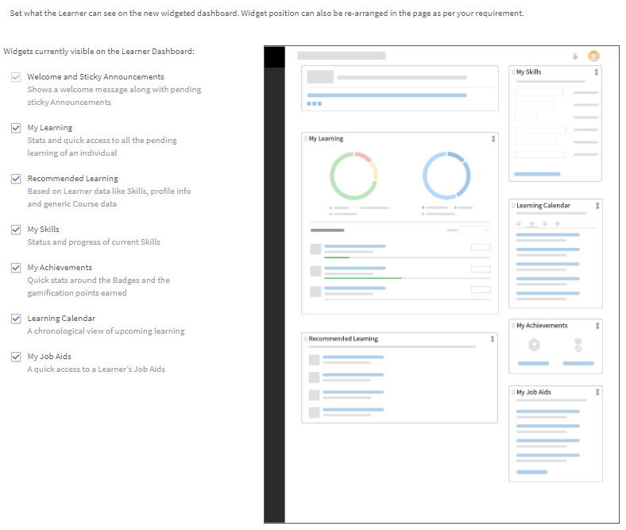

# 학습자 홈페이지 사용자 정의

## 개요 {#overview}

책임자는 학습자의 홈페이지를 사용자 정의하고, 보다 현대적이고, 콘텐츠를 구동하며 학습자에게 개인화할 수 있습니다.

개인화된 접근 방식은 학습자 홈페이지 구축의 위젯화된 방식을 제공하며 조직의 책임자는 WYSIWYG 방식의 책임자 사용자 인터페이스에서 구성할 수 있습니다.

산업 스킬에 대한 타사 콘텐츠를 분석하고 명시적 및 임시 데이터를 사용하여 피어 활동과 학습자의 관심 영역을 통합하는 AI 기반 알고리즘의 개인화된 교육 권장 사항입니다.

## 학습자 홈페이지 구성 {#configurethelearnerhomepage}

에 **브랜딩** > **학습자 홈페이지** 페이지에서 책임자는 학습자의 홈페이지 경험을 사용자 정의하여 학습자가 학습자 앱에 로그인하면 완전히 달라진 모양과 느낌을 확인할 수 있습니다.

관리자는 관리 앱()에서 UI(룩앤필)를 설정할 수 있습니다.**브랜딩** > **학습자 홈페이지** 탭).

관리자는 몰입형 UI 위젯 보기로 전환하고 그에 따라 위젯/기능을 사용자 정의한 다음 몰입형 UI를 활성화할 수 있습니다.

대상 **학습자 홈페이지** 화면에는 다음 섹션이 포함되어 있습니다.

## 몰입형 레이아웃 옵션 {#immersivelayoutoption}

몰입형 페이지의 레이아웃을 보려면 다음 옵션을 활성화합니다 **몰입형**. 다음에서 이 옵션을 전환할 수 있습니다. **브랜딩 > 일반**.

이전 버전의 학습자 홈페이지 옵션은 &#39;설정&#39;에 있었습니다.

설정할 수 있는 옵션은 다음과 같습니다.

**홈페이지 환경:** 다음 중 하나를 활성화합니다. **클래식** 또는 **몰입형**. [몰입형]을 선택하면 다음 옵션이 나타납니다.

* **교육 유형:** 다음 중 하나를 선택합니다. **산업** 또는 **사용자 정의 맞춤**. 맞춤 교육은 사내에서 생성됩니다. 산업 정렬 교육에는 타사 공급자의 바로 사용 가능한 콘텐츠가 포함됩니다.

*산업 또는 사용자 정의 정렬을 선택하여 홈페이지 환경 설정*

옵션 **학습자가 관심 영역을 탐색할 수 있도록 활성화** 클래식 및 몰입형 경험 모두에서 사용할 수 있습니다.

<table>
 <tbody>
  <tr>
   <td>
    
<b>사용자 정의...</b>
</td>
   <td>
    
<b>산업 정렬...을 선택하는 경우</b> 
</td>
  </tr>
  <tr>
   <td>
    
내부 및 외부 활성 필드를 최대 한 개 선택할 수 있습니다.
</td>
   <td>
    
최대 5개 및 최소 1개의 필드를 선택할 수 있습니다. 기본적으로 옵션은 <b>프로필 </b>이(가) 선택되었습니다.
</td>
  </tr>
 </tbody>
</table>

학습자가 1,000명 미만인 경우 전체 계정이 하나의 범위로 간주됩니다. 이는 특히 사용자 정의 교육 유형용입니다. 계정에 1,000명 미만의 사용자가 있는 경우 전체 계정을 범위로 간주합니다.

>[!NOTE]
>
>확인란 **스킬 탐색** 이(가) 설정 > 일반으로 이동되었습니다.

몰입형 경험이 선택된 경우 이 옵션이 활성화되고 회색으로 표시됩니다. 이 확인란은 클래식 환경에 대해서만 활성화됩니다.

*클래식 환경을 위한 선택*

몰입형 레이아웃은 모든 새 계정에 대한 기본값입니다. 레이아웃은 관리자가 활성화하거나 비활성화할 수 있는 위젯으로 제어됩니다. 위젯의 배치 방식을 기반으로 학습자 홈페이지에도 동일하게 반영됩니다.

활성화하거나 비활성화할 수 있는 위젯은 다음과 같습니다.

이를 통해 학습자 UI가 작동하기 전에 학습자 UI를 미리 볼 수 있습니다.

기존 계정의 경우 **몰입형** 될 일 **끄기**. 소셜 및 게임화 기능이 켜져 있는 새 계정에 대해 활성화됩니다.

*학습자 UI 미리 보기*

<table>
 <tbody>
  <tr>
   <td>
    
<b>위젯</b>
</td>
   <td>
    
<b>설명</b>
</td>
  </tr>
  <tr>
   <td>
    
발행인란
</td>
   <td>
    
<b>발행인란은 무엇이며, 학습자 발행인란을 어떻게 사용자 정의합니까? </b> 

    
학습자에게 환영 배너입니다. 배너는 이미지 또는 비디오일 수 있습니다. 발행인란은 특정 사용자 그룹을 대상으로 할 수 있으며 학습자가 홈페이지에 로그인하는 즉시 발행인란을 볼 수 있습니다. 사용자 그룹은 책임자가 설정한 대상 플랜에 따라 여러 hero images 또는 비디오를 볼 수 있습니다. 

    
책임자가 배너를 업로드하는 방법:

    <ol>
     <li>왼쪽 패널에서 <b>공지</b>. </li>
     <li>페이지의 오른쪽 상단 모서리에서 <b>추가</b>.</li>
     <li>(으)로부터 <b>유형 </b>드롭다운 목록에서 <b>발행인란</b>.</li>
     <li>발행인란에 포함할 메시지를 작성합니다.</li>
     <li>이미지 또는 비디오를 업로드합니다.</li>
     <li>대상 참가자를 선택합니다. 발행인란이 표시될 사용자 그룹 또는 교육을 선택합니다.</li>
     <li>발행인란 공지를 저장합니다.</li>
    </ol></td>
  </tr>
  <tr>
   <td>
    
내 학습
</td>
   <td>
    
최근에 학습자가 방문한 학습 개체를 표시합니다. 
</td>
  </tr>
  <tr>
   <td>
    
달력
</td>
   <td>
    
학습자를 위한 다양한 예정된 강의실 및 가상 강의실 교육 교육을 월별 별로 표시합니다. 관리자 승인 교육을 포함하여 학습자가 등록할 수 있거나 이미 등록된 교육이 표시됩니다. 
</td>
  </tr>
  <tr>
   <td>
    
게임화
</td>
   <td>
    
학습 활동을 기반으로 순위표를 표시합니다.
</td>
  </tr>
  <tr>
   <td>
    
소셜 학습
</td>
   <td>
    
학습자와 동일한 사용자 범위에 있는 사용자의 활동 및 게시물을 나열합니다. 
</td>
  </tr>
  <tr>
   <td>
    
조직에서 추천함
</td>
   <td>
    
활성화되면 이 위젯은 특정 사용자 그룹에 교육을 추천합니다. 각 사용자 그룹은 하나 이상의 교육을 대상으로 할 수 있으며 대상 플랜은 시간대를 기준으로 합니다.  

    <ul>
     <li>
      
첫 번째, 관리자 <a href="announcements.md#recommendation">공지를 작성합니다.</a> 타이프 <b>권장 사항</b> 필요한 교육을 선택하고 그룹을 사용합니다. 사용자 그룹에 속한 학습자는 권장 교육을 볼 수 있습니다.
</li>
     <li>
      
두 번째로 관리자는 권장 사항이 즉시 시작되는지 또는 지정된 날짜에 시작되는지를 결정할 수도 있습니다.
</li>
    </ul></td>
  </tr>
  <tr>
   <td>
    
관심 영역을 기반으로 추천
</td>
   <td>
    
학습자가 선택한 관심 영역을 기반으로 학습 개체를 표시합니다. 권장 사항은 머신 러닝 알고리즘을 기반으로 합니다.
</td>
  </tr>
  <tr>
   <td>
    
카탈로그별 검색 
</td>
   <td>
    
홈페이지에서 카탈로그를 타일로 표시합니다. 
</td>
  </tr>
  <tr>
   <td>
    
피어 활동 기반 추천 
</td>
   <td>
    
학습자의 동료가 수강하는 내용에 따른 교육을 표시합니다. 이는 다시 머신 러닝 알고리즘에 의해 구동된다.
</td>
  </tr>
 </tbody>
</table>

변경 사항을 저장한 후 학습자 홈페이지에는 모든 변경 사항이 반영됩니다.

학습자가 브라우저를 통해 학습자 앱에 로그인하면 다음과 같은 몰입형 레이아웃을 볼 수 있습니다.

<table>
 <tbody>
  <tr>
   <td>
    
<strong>홈 페이지</strong>
</td>
   <td>
    
<strong>내 학습 목록</strong>
</td>
   <td>
    
<strong>카탈로그 보기</strong>
</td>
  </tr>
 </tbody>
</table>

*홈 페이지에서 다양한 섹션에 대한 몰입형 레이아웃 보기*

## 클래식 레이아웃 옵션 {#classiclayoutoption}

지금까지 항상 존재하던 사용자 인터페이스 레이아웃을 이제 클래식 레이아웃이라고 합니다. 이 옵션을 선택하면 학습자 홈페이지 보기가 클래식 레이아웃으로 되돌아갑니다.

*클래식 레이아웃 미리 보기*

## 추천 설정 구성 {#configurerecommendationsettings}

켜기 **브랜딩** > **일반**, 내부 및 외부 학습자에 대한 추천 범위를 구성하고 학습자가 학습자 홈페이지에서 스킬을 선택하도록 할 수 있습니다.

에 **일반** 페이지에서 다음과 같은 옵션을 사용할 수 있습니다.

<table>
 <tbody>
  <tr>
   <td>
    
조직 이름
</td>
   <td>
    
학습자가 속한 조직의 이름입니다.
</td>
  </tr>
  <tr>
   <td>
    
하위 도메인
</td>
   <td>
    
조직의 하위 도메인입니다.
</td>
  </tr>
  <tr>
   <td>
    
로고 스타일링
</td>
   <td>
    
이러한 방식으로 귀하의 로고 및 회사 이름이 Learning Manager에 표시됩니다. 
</td>
  </tr>
  <tr>
   <td>
    
테마
</td>
   <td>
    
Learning Manager에 적용된 테마입니다.
</td>
  </tr>
  <tr>
   <td>
    
사용자 정의
</td>
   <td>
    
Adobe Learning Manager를 통해 계정을 사용자 정의하여 사용자에게 보다 다양한 환경을 제공할 수 있습니다. 
</td>
  </tr>
  <tr>
   <td>
    
학습자 홈페이지
</td>
   <td>
    
다음 중 하나를 선택합니다. <b>클래식 </b>또는 <b>몰입형</b>. [몰입형]을 선택하면 다른 옵션이 나타납니다.
</td>
  </tr>
  <tr>
   <td>
    
교육 유형 
</td>
   <td>
    
다음 중 하나를 선택합니다. <b>사용자 정의 </b>또는 <b>산업 정렬</b>. 학습자가 1,000명 미만인 경우 전체 계정이 하나의 범위로 간주됩니다. 추천은 모든 학습자를 기반으로 합니다. 
</td>
  </tr>
  <tr>
   <td>
    
추천 범위 설정 
</td>
   <td>
    
하나 이상의 활성 필드를 선택합니다. 대상 <b>사용자 정의</b>, 최대 한 개의 활성 필드를 선택할 수 있습니다. 대상 <b>산업 정렬</b>, 최대 다섯 개의 활성 필드를 선택할 수 있습니다. 
</td>
  </tr>
  <tr>
   <td>
    
학습자가 관심 영역을 탐색할 수 있도록 활성화
</td>
   <td>
    
클래식 경험에만 해당됩니다. 선택 <b>예 </b>또는 <b>아니요</b>. 
</td>
  </tr>
  <tr>
   <td>
    
사용자에게 관심 영역(스킬)을 선택하라는 메시지 표시  
</td>
   <td>
    
몰입형 경험에 대해서만 적용됩니다. 선택 <b>예</b> 또는 <b>아니요</b>.  
</td>
  </tr>
 </tbody>
</table>
