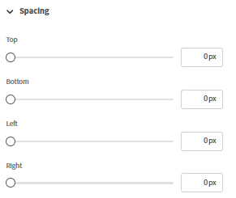
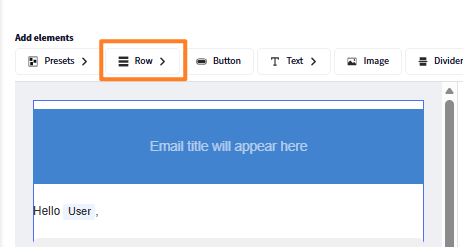
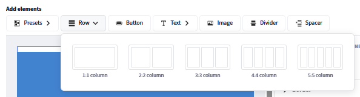
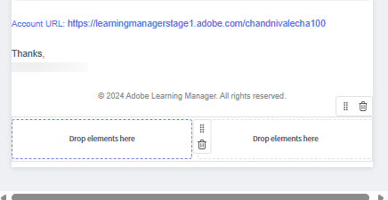
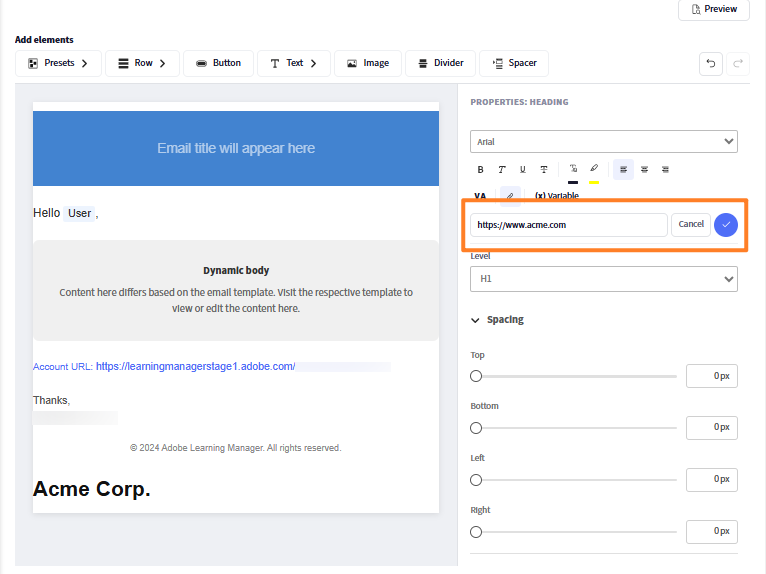
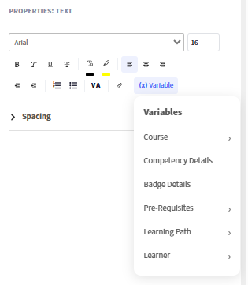
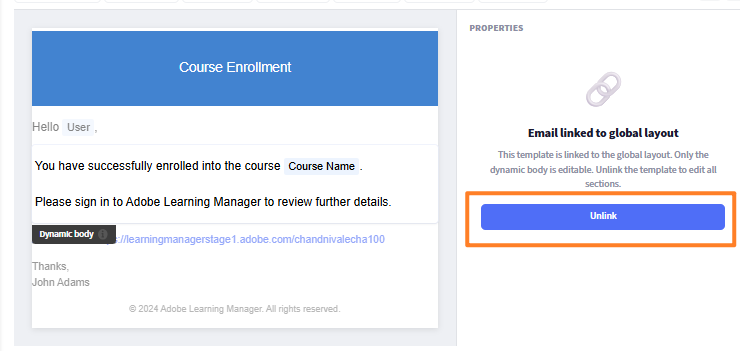

## 구성 요소 기반 이메일 빌더

Adobe Learning Manager에는 관리자 및 작성자가 HTML 작성 없이 최신 시각적 편집기를 사용하여 완전히 브랜드화된 엔터프라이즈급 이메일을 제작할 수 있는 구성 요소 기반 이메일 빌더가 포함되어 있습니다. 등록 확인부터 세션 미리 알림에 이르기까지 조직에서 보내는 모든 전자 메일은 브랜드의 모양과 느낌을 정확하게 일치시킬 수 있습니다.

**관리자용:** 모든 전자 메일을 자동으로 감싸는 재사용 가능한 머리글과 바닥글*로 전역 레이아웃을 한 번 디자인한 다음 필요에 따라 개별 템플릿을 사용자 지정합니다. 인라인 드래그하여 놓기 편집기에서 전체 서식 있는 텍스트, 이미지, 배너, 단추, 소셜 미디어 링크, 구분자 등의 서식 있는 구성 요소를 사용하여 전자 메일을 구성합니다.

**작성자의 경우:** 특정 강의 및 인스턴스에 범위가 지정된 전자 메일에 동일한 편집기 기능을 적용하여 교육 커뮤니케이션을 계정 전체 설정에 영향을 주지 않고 각 학습 경험에 맞게 조정할 수 있습니다.

작성기는 계층 모델을 지원합니다. 인스턴스, 강의 또는 계정 수준에서 동일한 이메일 템플릿을 구성할 수 있습니다. 템플릿이 개별적으로 편집되지 않은 경우에는 상위 수준의 설정을 자동으로 상속합니다. 완전히 사용자 지정된 디자인이 필요한 경우에는 템플릿의 연결을 해제하고 완전히 제어할 수 있습니다. 기본 제공 미리 보기를 사용하면 전자 메일을 보내기 전에 수신자의 받은 편지함에 정확히 어떻게 표시되는지 확인할 수 있습니다.

## 이메일 템플릿 시스템의 작동 방식

Adobe Learning Manager에서 전송되는 모든 이메일은 세 가지 구조적 부분으로 구성됩니다.

* **머리글:** 배너 이미지 또는 색상과 조직 이름
* **본문:** 각 전자 메일 형식에 고유한 동적 콘텐츠 영역입니다. 메시지 텍스트와 변수 자리 표시자가 포함됩니다.
* **바닥글:** 계정 URL, 전자 메일 서명, 도움말 링크 및 기타 요소

**전역 레이아웃**&#x200B;은 130개 이상의 모든 전자 메일 템플릿에 동시에 적용되는 마스터 디자인입니다. 전역 레이아웃을 업데이트해도 여전히 연결된 모든 템플릿은 변경 내용을 자동으로 반영합니다. 언제든지 템플릿을 전역 레이아웃에서 연결 해제하여 독립적으로 사용자 정의할 수 있습니다.

### 전자 메일 계층

상속을 통해 설정 및 디자인 흐름이 상위 레벨에서 하위 레벨로 변경됩니다. 각 수준은 상속된 내용을 재정의하거나 완전히 사용자 지정할 수 있습니다.

| 레벨 | 구성 대상 | 기본 상태 | 편집할 수 있는 항목 |
| --- | --- | --- | --- |
| **전역 레이아웃** | 책임자 | 루트, 마스터 없음 | 전체 레이아웃: 모든 부품, 모든 구성 요소 |
| **계정 전자 메일 템플릿** | 책임자 | 전역 레이아웃에 연결됨 | 본문만(링크됨), 전체 레이아웃(링크되지 않음) |
| **작성자- LO 레이아웃** | 작성자 | 계정 템플릿에 연결됨 | LO 범위의 전체 레이아웃 |
| **작성자- LO 전자 메일 템플릿** | 작성자 | LO 레이아웃에 연결됨 | 본문만(링크됨), 전체 레이아웃(링크되지 않음) |
| **작성자 - 인스턴스 전자 메일 템플릿** | 작성자 | LO 템플릿에 연결됨 | 본문만(링크됨), 전체 레이아웃(링크되지 않음) |

### 핵심 상속 규칙

* 모든 레벨은 명시적으로 변경될 때까지 바로 상위 레벨에 링크되기 시작합니다.
* 템플릿의 **본문**&#x200B;을 편집해도 연결이 해제되지 않습니다. 머리글과 바닥글은 계속해서 마스터를 반영합니다.
* **레이아웃**&#x200B;을 편집하거나 **연결 해제**&#x200B;를 선택하면 해당 템플릿에 대한 상위 연결만 끊깁니다.
* **원본으로 되돌리기** 템플릿을 부모에 다시 연결하고 레이아웃과 본문을 모두 부모 버전으로 다시 설정합니다.
* 한 레벨에서 연결을 해제하면 그 위 또는 아래 레벨에는 영향을 주지 않습니다.

## 전역 레이아웃 설정

전역 레이아웃은 모든 연결된 이메일로 유입되는 공유 머리글, 바닥글 및 구조적 래퍼를 정의합니다. 모든 템플릿이 일관된 브랜딩으로 시작하도록 먼저 구성합니다.

### 전역 레이아웃 편집기 열기

1. 관리자 권한으로 Adobe Learning Manager에 로그인합니다.
2. 왼쪽 탐색에서 **전자 메일 템플릿**&#x200B;을 선택합니다.
3. **전역 레이아웃** 탭을 선택합니다.

   편집기 캔버스가 현재 전역 레이아웃과 함께 로드됩니다. 가운데에 자리 표시자로 표시되는 **동적 본문** 영역은 각 템플릿의 고유한 메시지 내용이 표시되는 영역을 나타냅니다. 전역 레이아웃에서는 동적 본문을 편집할 수 없습니다.

   

### 전자 메일 컨테이너 구성

전자 메일 컨테이너는 모든 전자 메일의 가장 바깥쪽 래퍼입니다. 해당 설정은 모든 콘텐츠의 시각적 프레임에 영향을 줍니다.

1. **전역 전자 메일 레이아웃** 근처에서 **편집** 선택
2. 캔버스에서 전자 메일 컨테이너를 선택합니다.
3. 오른쪽의 **속성** 패널에서 다음을 설정합니다.
   * **배경색:** 모든 전자 메일 콘텐츠 뒤의 색

   

   * **테두리:** 외부 테두리의 스타일, 폭 및 색상

   

   * **간격:** 전자 메일 내용 방향 주변의 패딩

   

   * **행 간격:** 레이아웃의 모든 행 사이에 적용된 수직 간격

   

### 행 및 열 작업

전자 메일 편집기의 모든 내용은 **행** 안에 배치됩니다. 각 행에는 하나 이상의 **열**&#x200B;이 포함되어 있고 각 열에는 하나 이상의 **구성 요소**&#x200B;가 있습니다.

행을 추가하려면 다음을 수행합니다.

1. 캔버스의 상단에서 **행**&#x200B;을 선택합니다.

   

2. 열 레이아웃을 선택하십시오: **1열**, **2열**, **3열** 또는 **4열**.

   

   구성 요소에 대해 준비가 완료된 후 새 행이 캔버스에 표시됩니다.

행을 구성하려면 다음을 수행합니다.

1. 캔버스에서 행을 선택합니다.

   

2. **속성** 패널에서 다음을 설정합니다.
   * **배경색:** 행 수준 배경색이 이 행의 컨테이너 색을 재정의합니다.
   * **테두리:** 행 테두리 스타일, 너비 및 색상
   * **간격:** 이 행에 있는 열 사이의 가로 간격

   

**행 순서 바꾸기:**

* 핸들로 행을 드래그하여(왼쪽 가장자리를 마우스로 가리키면 표시됨) 위나 아래로 이동합니다.

**행을 삭제하려면:**

* 행을 선택하고 행 도구 모음에서 **삭제** 아이콘을 선택합니다.

### 구성 요소 추가 및 정렬

구성 요소는 전자 메일 콘텐츠의 구성 요소입니다. 맨 위의 **구성 요소** 패널에서 열 셀에 끌어 놓습니다. 왼쪽의 **속성** 패널을 사용하여 선택한 구성 요소를 사용자 지정합니다.

구성 요소를 드래그하여 놓을 때 파란색 &quot;+&quot; 표시기가 구성 요소를 놓을 수 있는 위치를 표시합니다.

**구성 요소를 추가하려면:**

1. [구성 요소] 패널에서 원하는 구성 요소를 찾습니다.

   

2. 캔버스의 열 셀로 드래그합니다.

   

3. 구성 요소가 해당 셀에 추가됩니다. 오른쪽 패널에서 속성을 열려면 선택합니다.

   

**구성 요소 이동 방법:**

* 핸들로 구성 요소를 다른 열 또는 행 위치로 드래그합니다.

**구성 요소를 삭제하려면:**

* 구성 요소를 선택하고 구성 요소 도구 모음에서 **삭제** 아이콘을 선택합니다.

### 사전 설정 구성 요소 편집

**전역 레이아웃**&#x200B;에는 전자 메일 설정에 구성된 공유 필드에 해당하는 기본 제공 사전 설정 구성 요소가 포함되어 있습니다. 사전 설정 구성 요소는 캔버스에서 직접 편집하거나 완전히 제거할 수 있습니다.

| 사전 설정 구성 요소 | 기본 콘텐츠 | 제거할 수 있습니까? |
| --- | --- | --- |
| **배너** | 기본 배너 이미지 또는 색상 | 예 |
| **인사말** | &quot;{{user}} 님, 안녕하세요.&quot; | 예 |
| **동적 본문** | 템플릿별 내용에 대한 자리 표시자 | 아니요- 필수 |
| **계정 URL** | 계정의 플랫폼 URL | 예 |
| **서명** | 구성된 서명 텍스트 | 예 |

**사전 설정 구성 요소를 편집하려면:**

1. 배너와 같이 사전 설정 구성 요소를 추가합니다.

   

2. 캔버스에서 배너를 선택합니다.
3. **속성** 패널에서 배너의 글꼴, 글꼴 크기 및 기타 시각적 속성을 변경합니다.

   

**모든 전자 메일에서 사전 설정 구성 요소를 제거하려면:**

1. 캔버스에서 사전 설정 구성 요소를 선택합니다.
2. 구성 요소 도구 모음에서 **삭제**&#x200B;를 선택합니다.

전역 레이아웃에서 사전 설정 구성 요소를 제거하면 연결된 모든 전자 메일에서 제거됩니다. 연결되지 않은 템플릿은 사용자가 각 템플릿에서 구성 요소를 수동으로 제거할 때까지 구성 요소를 유지합니다.

### 전역 레이아웃 저장

레이아웃이 완료되면 **저장**&#x200B;을 선택합니다. 업데이트된 디자인은 여전히 전역 레이아웃에 연결된 모든 이메일 템플릿에 즉시 적용됩니다.

## 전역 전자 메일 사전 설정 구성

배너, 인사말, 서명과 같이 전자 메일에서 재사용할 공통 요소를 정의합니다. 이는 전역 레이아웃이나 Adobe Learning Manager 내의 개별 이벤트 기반 이메일 템플릿에서 사용할 수 있습니다. 여기에서 변경한 내용은 해당 사전 설정이 사용되는 모든 곳에 자동으로 반영됩니다. 이메일 빌더에서 직접 이러한 사전 설정을 재정의하고 사용자 정의 요소를 디자인하도록 선택할 수도 있습니다.

다음을 구성합니다.

### 전자 메일 배너

1. **전자 메일 배너** 옆의 **편집**&#x200B;을 선택합니다.
2. 배너 이미지를 업로드하거나 단색 배경색을 설정합니다.

   

3. **저장**&#x200B;을 선택합니다.

### 전자 메일 인사말

1. **이메일 인사말** 옆의 **편집** 선택
2. 기본값은 &quot;안녕하세요 {{user}}&quot;입니다. {{user}} 변수는 런타임에 수신자의 이름으로 채워집니다.

   

3. 인사말 텍스트를 수정하거나 인사말을 완전히 제거합니다.
4. **저장**&#x200B;을 선택합니다.

### 계정 URL

1. **계정 URL** 옆의 **편집**&#x200B;을 선택합니다.
2. 학습 플랫폼의 URL을 입력합니다. 모든 발신 전자 메일에 표시됩니다.

   

3. **저장**&#x200B;을 선택합니다.

### 전자 메일 서명

1. **전자 메일 서명** 옆의 **편집** 선택
2. 닫는 텍스트를 입력합니다.

   

3. **저장**&#x200B;을 선택합니다.

## 개별 구성 요소 추가 및 구성

### 텍스트 구성 요소

텍스트 구성 요소는 전체 서식 있는 텍스트 편집을 지원합니다.

1. **텍스트** 구성 요소를 열 셀로 끕니다.
2. 편집 모드로 전환하려면 이 옵션을 선택합니다.

   

3. 콘텐츠를 입력하거나 붙입니다.
4. 다음과 같은 서식 옵션을 적용합니다.
   * **글꼴:** 웹에 적합한 글꼴(Arial, Helvetica, Georgia 등) 또는 계정에 대해 구성된 사용자 정의 글꼴 중에서 선택합니다.
   * **크기:** 글꼴 크기(포인트)
   * **굵게**, **기울임꼴**, **밑줄**, **취소선**
   * **위 첨자** 및 **아래 첨자**
   * **텍스트 색상** 및 **배경색**(텍스트 강조 표시)
   * **맞춤:** 왼쪽, 가운데, 오른쪽 또는 양쪽 맞춤
   * **줄 간격:** 줄 높이 승수
   * **가로 및 세로 패딩:** 텍스트 블록 내의 내부 간격
5. 하이퍼링크를 추가하려면 다음을 수행하십시오.
   * 연결할 텍스트를 선택합니다
   * 도구 모음에서 **링크** 아이콘을 선택합니다.
   * 대상 URL 입력

   

6. **적용** 선택

### 이미지 구성 요소

1. **Image** 구성 요소를 열 셀로 끕니다.
2. **업로드**&#x200B;를 선택하여 새 이미지 파일(JPEG 및 GIF 지원)을 업로드하거나, **찾아보기**&#x200B;를 선택하여 이미지 라이브러리에서 선택하십시오.
3. 이미지를 선택한 상태에서 다음을 구성합니다.

   

   * **이미지 변경:** 새 이미지를 업로드하거나 현재 선택한 이미지를 바꿉니다.
   * **이미지 URL:** 표시할 이미지의 소스 URL을 지정합니다. 이 위치에서 이미지가 로드됩니다.
   * **링크:** 이미지에 클릭 가능한 하이퍼링크를 추가합니다. 이미지를 클릭하면 사용자가 지정된 URL로 리디렉션됩니다.
   * **테두리 유형:** 이미지 테두리의 스타일을 정의합니다. 사용 가능한 옵션에는 없음, 단색 및 점선이 있습니다.
   * **테두리 색상:** 테두리 스타일이 적용될 때 이미지 테두리 색상을 설정합니다.
   * **모퉁이 반경:** 이미지 모퉁이의 원형율을 제어합니다. 값이 높을수록 모퉁이가 더 둥글게 됩니다.
   * **테두리 선:** 이미지 테두리의 두께(폭)를 조정합니다.
   * **위쪽 간격:** 이미지 위에 공백을 추가합니다.
   * **아래쪽 간격:** 이미지 아래에 공백을 추가합니다.
   * **왼쪽 간격:** 이미지 왼쪽에 공간을 추가합니다.
   * **오른쪽 간격:** 이미지의 오른쪽에 공간을 추가합니다.
   * **가로 맞춤:** 컨테이너 내의 이미지 위치를 결정합니다. 옵션에는 일반적으로 왼쪽, 가운데 및 오른쪽 맞춤이 포함됩니다.

### 버튼 구성 요소

1. **Button** 구성 요소를 열 셀로 끌어 옵니다.
2. 선택 및 구성:

   

   * **레이블:** 단추 텍스트
   * **링크:** 단추를 클릭할 때 대상 URL
   * 버튼 레이블의 **글꼴:** 글꼴 모음 및 크기
   * **텍스트 색상:** 레이블 색상
   * **배경색:** 단추 채우기 색
   * **크기:** 단추 너비 및 높이
   * **모퉁이 스타일:** 둥근, 정사각형 또는 원형
   * **맞춤:** 열 내에서 왼쪽, 가운데 또는 오른쪽
   * **패딩:** 레이블 텍스트와 단추 가장자리 사이의 내부 간격

### 구분선 및 스페이서 구성 요소

**구분선:**&#x200B;은 콘텐츠 섹션 사이에 보이는 가로선을 추가합니다.

1. **분할자** 구성 요소를 열로 끌어 옵니다.
2. 속성 패널에서 **선 스타일**(실선, 점선, 점선), **색상**, **너비**, **높이**(선 위와 아래의 수직 공간)를 설정합니다.

   **스페이서:** 선이 없는 요소 사이에 보이지 않는 수직 공간을 추가합니다.

3. **Spacer** 구성 요소를 드래그하고 속성 패널에서 해당 **높이**&#x200B;를 설정합니다.

## 변수 삽입 및 관리

변수는 전자 메일을 보낼 때 실제 데이터로 대체되는 동적 자리 표시자입니다. 사용 가능한 변수는 특정 템플릿 유형에 따라 다릅니다. 등록 확인 전자 메일에는 세션 미리 알림과 다른 변수가 있습니다.

### 피커를 사용하여 변수 삽입

1. 변수를 표시할 텍스트 구성 요소에 커서를 놓습니다.
2. 텍스트 편집기 도구 모음에서 **변수 삽입**&#x200B;을 선택합니다. 변수 선택기가 열리고 이 템플릿 유형에 사용할 수 있는 모든 변수가 표시됩니다.
3. 변수를 선택합니다. 예를 들어 **과정 이름**, **학습자 이름** 또는 **학습 경로 이름**&#x200B;을 입력합니다.

   

### 다음을 입력하여 변수 삽입

이중 중괄호로 직접 둘러싸인 변수 이름을 입력하십시오. {\{variable_name}\} 편집기에서 이를 자동으로 인식하고 변수 토큰으로 강조 표시합니다.

**일반 변수의 예:**

| 변수 | (으)로 교체됨 |
| --- | --- |
| 수신자의 전체 이름 | {\{learnerName}\} |
| 수신자의 전자 메일 | {\{learnerEmail}\} |
| 수신자의 사용자 이름 | {\{user}\} |
| 사용자 유형 | {\{userType}\} |
| 조직 이름 | {\{organizationName}\} |
| 강의 이름 | {\{courseName}\} |
| 강의 설명 | {\{courseDescription}\} |
| 강의 작성자 | {\{courseAuthor}\} |
| 강의 링크 | {\{courseLink}\} |
| 강의에 필요한 스킬 | {\{courseSkillDetails}\} |
| 과정의 배지 | {\{courseBadge}\} |
| 강의 등록 마감 | {\{courseEnrollmentDeadline}\} |
| 강의 완료 마감 시한 | {\{courseCompletionDeadline}\} |
| 강의 완료 날짜 | {\{courseCompletionDate}\} |
| 학습 경로 이름 | {\{LPName}\} |
| 학습 경로 링크 | {\{LPLink}\} |
| 학습 과정 등록 기한 | {\{LPEnrollmentDeadline}\} |
| 학습 과정 완료 기한 | {\{LPCompletionDeadline}\} |
| 학습 과정 완료일 | {\{LPCompletionDate}\} |
| 인증 이름 | {\{certificationName}\} |
| 인증 등록 기한 | {\{certificationEnrollmentDeadline}\} |
| 인증 완료 날짜 | {\{certificationCompletionDate}\} |
| 강의 기한 기간 | {\{deadlineDuration}\} |
| 강의 만료 기간 | {\{expiryDuration}\} |
| 강의 만료일 | \{\{expiryDate\}\} |
| 세션 이름 | \{\{sessionName\}\} |
| 세션 시작일 | \{\{sessionDate\}\} |
| 세션 종료 날짜 | \{\{endSessionDate\}\} |
| 세션 시작 시간 | \{\{sessionTime\}\} |
| 세션 종료 시간 | \{\{endSessionTime\}\} |
| 장소 이름 | \{\{venueName\}\} |
| 장소 정보 | \{\{venueInfo\}\} |
| 장소 URL | \{\{venueURL\}\} |
| 장소 지역 | \{\{venueRegion\}\} |
| 가상 강의실 URL | \{\{vcUrl\}\} |
| 가상 강의실 공급자 계정 필요 | \{\{VCProviderAccountReq\}\} |
| 강사 이름 | \{\{instructorName\}\} |
| 모듈 이름 | \{\{moduleName\}\} |
| 학습 개체 이름 | \{\{learningObjectName\}\} |
| 학습 개체 완료 날짜 | \{\{loCompletionDate\}\} |
| 대체 학습 개체 이름 | \{\{alternateLoNameList\}\} |
| 대체 학습 개체 링크 | \{\{alternateLoNameListLinks\}\} |
| 대체 학습 개체 제거됨 | \{\{removedAlternateLo\}\} |
| 필수 구성 요소 텍스트 | \{\{preRequiiteText\}\} |
| 필수 구성 요소 수 | \{\{preRequiiteCountText\}\} |
| CI 이름 | \{\{ciName\}\} |
| 보고서 대시보드 이름 | \{\{reportDashboardName\}\} |
| 작업 지원 이름 | \{\{jobAidName\}\} |
| 공지 내용 | \{\{announcementContentText\}\} |
| 프로필 이름 | \{\{profileName\}\} |
| 코스 인원 제한 | \{\{seatLimit\}\} |
| 도움말 문서 홈 페이지 링크 | \{\{captivatePrimeHelp\}\} |
| 도움말 페이지에 연결 | \{\{helpPageLink\}\} |
| 계수 | \{\{count\}\} |

>[!NOTE]
>
>변수는 템플릿별로 다릅니다. 모든 템플릿에서 모든 변수를 사용할 수 있는 것은 아닙니다. **변수 삽입** 선택기를 사용하여 편집 중인 템플릿에 적용되는 변수만 봅니다. 인식할 수 없는 변수 이름을 중괄호로 묶어 입력하면 편집기에서 오류가 생성되지 않지만 보낸 전자 메일에 리터럴 텍스트로 표시됩니다.

### 배너의 변수

1. 이메일 제목 줄도 변수를 지원합니다. 제목에 변수를 추가하려면 다음을 수행하십시오.
2. 템플릿을 열고 **전자 메일 제목** 필드를 찾습니다.
3. 변수를 직접 입력합니다. 예를 들면 &quot;{\{course_name}\}의 등록이 확인되었습니다&quot;와 같습니다. 전자 메일이 전송되면 변수가 실제 강의 이름으로 렌더링됩니다.
4. 또는 **변수 추가**&#x200B;를 선택한 다음 **강의**&#x200B;를 선택합니다.

   

### 변수 및 전역 레이아웃

전역 레이아웃의 변수는 템플릿 독립적이며 컨텍스트에 따라 다르게 확인됩니다. 전역 레이아웃에서는 {\{user}\} 및 {\{account_url}\}과 같이 보편적으로 적용할 수 있는 변수만 사용합니다. 템플릿별 변수(예: {\{course_name}\})는 전역 레이아웃이 아닌 개별 템플릿 본문에 배치해야 합니다.

## 템플릿 연결 및 연결 해제

### 연결된 상태와 연결되지 않은 상태 비교

모든 템플릿은 상위 항목에 **연결**&#x200B;되거나 **연결 해제**&#x200B;되며 완전히 독립적입니다.

**연결된 경우:**

* 편집기에서 머리글과 바닥글이 **회색으로 표시**&#x200B;됩니다. 템플릿이 연결되었음을 나타내는 시각적 표시기입니다.

* 본문만 편집할 수 있음
* 상위 레이아웃에 대한 변경 내용이 자동으로 이 템플릿에 적용됩니다.

**연결 해제된 경우:**

* 머리글 및 바닥글을 자유롭게 편집할 수 있습니다. 회색으로 표시된 영역이 없습니다.
* 템플릿은 완전히 독립적입니다. 상위 변경 사항이 영향을 주지 않습니다.
* 템플릿은 연결 해제 시 상위 디자인에서 시작됩니다

**키 규칙:** **본문**&#x200B;을 편집해도 템플릿 연결이 해제되지 않습니다. **레이아웃**&#x200B;을 편집하거나 **연결 해제**&#x200B;를 명시적으로 선택하면 부모 연결이 끊어집니다.

### 연결 대상(연결 상태 유지)

* 전역 브랜딩이 자동으로 계속 적용되도록 하려는 경우
* 이 템플릿의 메시지 텍스트나 변수만 변경하면 됩니다
* 대규모 템플릿 라이브러리를 유지 관리하고 있으며 중앙 집중식 브랜드 제어를 원합니다.

### 연결 해제해야 하는 경우

* 특정 템플릿에 대해 다른 배너, 색상 구성표 또는 구조적 레이아웃이 필요합니다
* 특정 과정, 인증 또는 대상자를 위해 고유한 브랜드 경험을 구축하고 있는 경우
* 사용자는 하나의 학습 객체 또는 인스턴스에 대해 완전한 디자인 제어가 필요한 작성자입니다

### 계정 수준 템플릿 연결 해제- 관리자

1. **전자 메일 템플릿**&#x200B;을 선택하고 템플릿을 엽니다. 예: 강의 - 자가 등록.
2. **연결 해제**&#x200B;를 선택합니다.

   

3. 확인 메시지를 읽고 **예**&#x200B;를 선택합니다.
4. 머리글과 바닥글은 자유롭게 편집할 수 있습니다.
5. 템플릿의 아무 부분이나 사용자 정의합니다.
6. **저장**&#x200B;을 선택합니다.

템플릿은 상위 항목의 레이아웃을 시작 지점으로 유지하지만 이후 상위 항목 업데이트를 더 이상 받지 않습니다.

### 템플릿을 상위 버전으로 되돌리기

템플릿을 원래 링크로 되돌리고 마스터가 제공하는 바로 그 항목으로 재설정합니다.

* 템플릿이 **본문 편집만**(여전히 연결)인 경우: 본문 메시지를 부모의 기본값으로 되돌립니다. 머리글과 바닥글은 이미 마스터에서 가져왔기 때문에 변경되지 않습니다.
* 템플릿이 **완전히 연결 해제됨**&#x200B;인 경우: 모든 항목, 머리글, 본문 및 바닥글을 상위 버전으로 바꿉니다. 모든 독립 사용자 지정이 영구적으로 제거됩니다.

>[!CAUTION]
>
>[원본으로 되돌리기]는 실행 취소할 수 없습니다. 되돌리기 전에 보존할 내용을 복사합니다.

**되돌리려면:**

1. 편집기에서 템플릿을 엽니다.
2. **원본으로 되돌리기**&#x200B;를 선택합니다.

   

### 인스턴스 레벨 템플릿 연결 해제 - 작성자

1. 강의를 열고 **전자 메일 템플릿**&#x200B;을 선택합니다.
2. 강의 완료 등의 템플릿을 엽니다.
3. **연결 해제**&#x200B;를 선택하고 확인합니다.
4. 변경하고 **저장**&#x200B;을 선택하세요.

이 인스턴스에만 영향을 줍니다. 다른 인스턴스는 영향을 받지 않습니다. 인스턴스 템플릿은 전역 레이아웃이 아닌 연결 해제 시점의 LO 수준 템플릿 디자인에서 시작합니다.

관리자 템플릿을 전역 레이아웃 버전으로 되돌리고 전역 레이아웃에 다시 연결합니다. 작성자 LO 템플릿이 관리 계정 템플릿 버전으로 복원됩니다. 작성자 인스턴스 템플릿을 LO 템플릿 버전(또는 LO 템플릿이 연결된 경우 계정 템플릿)으로 되돌립니다.

## 개별 템플릿 사용자 정의

### 템플릿으로 이동

1. **전자 메일 템플릿**&#x200B;의 목록에서 범주를 선택합니다. 예를 들어 **일반**, **학습 활동** 또는 **미리 알림 및 업데이트**&#x200B;를 사용할 수 있습니다.
2. 이름으로 템플릿을 찾습니다. 템플릿은 트리거 이벤트 및 현재 활성화/비활성화 상태와 함께 나열됩니다.
3. 템플릿 이름을 선택하여 편집기에서 엽니다.

### 본문 편집(연결된 템플릿)

템플릿이 연결된 경우에는 본문만 편집할 수 있습니다. 머리글 및 바닥글이 회색으로 표시됩니다.

1. 템플릿을 엽니다. 머리글 및 바닥글이 회색으로 표시되는지 확인합니다(연결된 상태).
2. 본문의 아무 곳이나 선택하여 편집 모드를 시작합니다.
3. 메시지 텍스트, 서식, 변수 및 본문의 구성 요소를 편집합니다.
4. **저장**&#x200B;을 선택합니다.

### 완전히 사용자 정의된 템플릿 편집(연결 해제됨)

연결을 해제하면 전역 레이아웃과 동일한 드래그 앤 드롭 편집기를 사용하여 머리글, 본문 및 바닥글의 세 부분 모두를 편집할 수 있습니다.

1. 모든 부분에서 행과 구성 요소를 추가, 제거 또는 재정렬합니다.
2. 사전 설정 구성 요소(배너, 인사말, 서명, 계정 URL)를 개별적으로 편집합니다.
3. 이 템플릿 유형과 관련된 변수를 삽입합니다.
4. **저장**&#x200B;을 선택합니다.

### 여러 언어로 템플릿 편집

모든 템플릿은 계정에 대해 구성된 모든 콘텐츠 언어를 지원합니다.

1. 템플릿을 엽니다.
2. **언어** 드롭다운을 선택합니다. 계정에 사용 가능한 모든 언어가 표시됩니다.
3. 편집할 언어를 선택합니다.
4. 해당 언어의 본문(연결되지 않은 경우 레이아웃)을 편집합니다.
5. **저장**&#x200B;을 선택합니다.

각 언어 버전은 개별적으로 저장됩니다. 한 언어를 편집해도 다른 언어는 영향을 받지 않습니다. 언어 버전이 사용자 지정되지 않은 경우 학습자는 해당 언어에 대한 기본 콘텐츠를 받게 됩니다.

>[!NOTE]
>
>템플릿이 연결 해제된 상태에서 한 언어로 템플릿의 레이아웃을 편집하면 레이아웃 변경 사항이 해당 언어 버전에만 적용됩니다. 다른 언어 버전은 고유한 상태를 유지합니다.

### 편집기에서 미리 보기(비주얼 체크)

1. 편집기 도구 모음에서 **미리 보기**&#x200B;를 선택합니다.
2. 미리 보기 모달이 열리고 수신자에게 표시되는 전자 메일이 표시됩니다.
3. 레이아웃, 간격, 이미지 및 가변 자리 표시자 토큰을 검토합니다.
4. 미리 보기를 닫아 편집을 계속합니다.

## 이전 버전과의 호환성

### 기존 계정

이전에 구성한 모든 전자 메일 템플릿은 그대로 유지됩니다. 새 빌더는 기존 편집기와 함께 사용할 수 있습니다. 업데이트 전에 구성된 템플릿은 자동으로 새 형식으로 마이그레이션되지 않습니다. 이전과 같은 기능을 계속 수행합니다.

### 새 계정

새로운 빌더와 깔끔한 기본 전역 레이아웃으로 시작하세요. 기본 레이아웃에서는 이전 구성에 있는 알려진 렌더링 문제(배너 이미지 표시 실패 등)를 방지하는 단순화된 디자인을 사용합니다.

계정에 이전 형식과 새 형식 템플릿이 모두 있는 경우, 이 둘은 충돌 없이 공존합니다. 개별 템플릿을 새 편집기에서 열고 저장하여 원하는 속도에 맞게 새 형식으로 마이그레이션할 수 있습니다.

## 전자 메일 템플릿 문제 해결

**전역 레이아웃 변경 내용이 템플릿에 표시되지 않음**

템플릿 연결이 해제되었습니다. 확인 및 수정하려면 다음을 수행하십시오.

1. 템플릿을 엽니다.
2. 머리글과 바닥글이 **편집 가능**(회색으로 표시되지 않음)이면 템플릿 연결이 해제됩니다.
3. 전역 레이아웃 상속을 복원하려면 **원본으로 되돌리기**&#x200B;를 선택하고 확인합니다.

**템플릿이 전역 레이아웃과 다르게 보입니다.**

위와 동일한 원인입니다. 템플릿이 의도적으로 또는 이전 레이아웃 편집으로 인해 연결 해제되었습니다. 원본으로 되돌려 다시 연결합니다.

**변수가 보낸 전자 메일에서 리터럴 텍스트로 렌더링되고 있습니다**

변수 이름의 철자가 잘못되었거나 이 템플릿 유형에 사용할 수 없습니다.

1. 템플릿을 열고 변수를 찾습니다.
2. **변수 삽입** 선택기를 사용하여 삭제한 후 다시 삽입하세요.
3. 선택기에는 이 템플릿에 유효한 변수만 표시됩니다. 오타를 방지하려면 목록에서 선택합니다.
