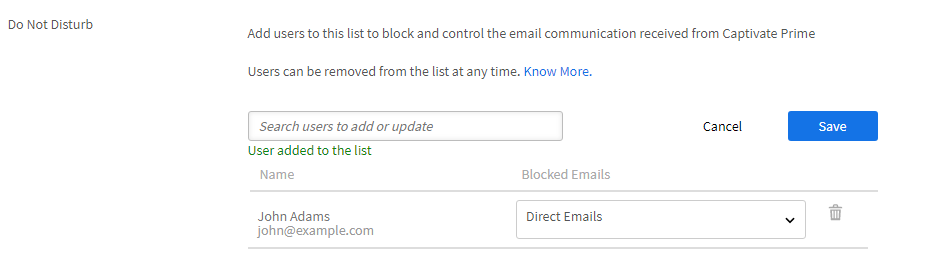

# 전자 메일 템플릿

교육 활동의 이벤트는 학습자에게 전송된 전자 메일을 트리거합니다. 책임자는 이러한 전자 메일 템플릿을 쉽게 활성화, 비활성화 또는 수정할 수 있습니다.

Learning Manager 응용 프로그램은 이벤트를 기반으로 하여 여러 역할의 사용자에게 전자 메일 알림을 보냅니다.

책임자는 콘텐트를 추가 또는 수정하고 학습자, 관리자 및 작성자가 트리거한 다양한 이벤트에 대한 알림을 사용자에게 전송하여 전자 메일 템플릿을 사용자 정의할 수 있습니다.

책임자는 특정 이벤트에 대해 전자 메일 알림을 보내지 않도록 선택할 수도 있습니다.

## 전자 메일 템플릿 소개

이 교육에서는 개별 이메일 템플릿을 사용자 정의하고 이메일 템플릿에 대한 과정 수준 및 계정 수준 설정을 사용자 정의하는 방법에 대해 알아봅니다.

<!--In this training, you will learn how to create a user group by names, email IDs, and combining multiple auto-generated user groups.-->

교육을 시작할 수 없는 경우 다음 주소로 작성하십시오. <almacademy@adobe.com>.

## 전자 메일 템플릿 구성 {#configureemailtemplates}

책임자는 이러한 전자 메일 템플릿을 쉽게 활성화, 비활성화 또는 수정할 수 있습니다.

1. 템플릿에 액세스하려면 **[!UICONTROL 전자 메일 템플릿]** 왼쪽 창에. 이 페이지에서는 세 가지 범주의 템플릿을 볼 수 있습니다. **[!UICONTROL 일반]**, **[!UICONTROL 학습 활동]**, 및 **[!UICONTROL 알림 메시지 및 업데이트]**. 네 번째 탭은 **[!UICONTROL 설정]**&#x200B;템플릿을 구성할 수 있습니다.

   

   *일반 탭을 선택합니다*

1. 전자 메일 템플릿 목록을 보려면 아무 탭이나 클릭합니다.

   

   *전자 메일 템플릿 목록 보기*

   토글 버튼을 클릭하여 이러한 전자 메일 알림을 쉽게 활성화하거나 비활성화할 수 있습니다.

1. 템플릿의 콘텐츠를 수정하려면 템플릿 이름을 클릭합니다. 여기서 다른 유형의 사용자에 대해 서로 다른 템플릿을 사용할 수 있음을 확인할 수 있습니다.

   

   *전자 메일 템플릿 보기*

1. 이 전자 메일 템플릿의 콘텐츠를 수정하려면 전자 메일 본문을 클릭합니다. 이제 템플릿을 변경하십시오. 텍스트를 수정할 수 있으며 전자 메일에서 이러한 변수 중 하나를 사용할 수도 있습니다. 본문 섹션의 변경 사항은 이 전자 메일 템플릿에만 적용할 수 있습니다. 하지만 이 전자 메일의 서명을 변경하면 변경 사항이 모든 템플릿에 전역적으로 적용됩니다.

   마우스를 각 아이콘 위로 가져가면 이름이 표시됩니다.

   

   *전자 메일 템플릿 수정*

   템플릿 위에 있는 **[!UICONTROL 원래로 돌아가기]** 링크를 클릭하면 메시지 본문을 기본 콘텐츠로 재설정할 수 있습니다.

1. 이 템플릿에 적용된 변경 사항을 확인하려면 저장을 클릭하십시오. 이제 사용자는 수정된 전자 메일 템플릿을 사용하여 전자 메일 알림을 받을 수 있습니다.

## 전자 메일 템플릿 설정 사용자 정의 설정 {#customizesettingsofanemailtemplate}

1. **[!UICONTROL 설정]**&#x200B;을 클릭하여 설정 페이지를 엽니다. 이제 전자 메일 템플릿을 사용자 정의할 수 있습니다.
1. 학습자가 전자 메일을 받을 이름 및 전자 메일 ID를 사용자 정의하려면 **[!UICONTROL 전송자 이름 및 주소].**

   연락처 [***Adobe 지원***](https://helpx.adobe.com/contact/enterprise-support.other.html#learning-manager) 세부 정보를 구성하거나 변경합니다.

1. 다음에서 전자 메일 배너 사용자 정의 **[!UICONTROL 전자 메일 배너]** 선택 사항입니다. 다음을 선택하여 배너 색상 변경 **[!UICONTROL 배너 배경]**.

   사용자 정의 이미지를 배너로 사용하려면 **[!UICONTROL 사용자 정의 이미지]** 선택 사항입니다. 변경 후 **[!UICONTROL 저장]**&#x200B;을 클릭합니다.

    

   *배너 이미지 사용자 정의*

   사용자 정의 이미지 크기는 1240x200px이어야 하며 .jpg, .jpeg, .png 형식을 지원합니다.

1. **[!UICONTROL 편집]**&#x200B;을 클릭하여 전자 메일 서명을 편집합니다. 필요한 변경 사항을 입력하고 변경 사항을 저장합니다.

   

   *전자 메일 서명 사용자 정의*

1. 옵션에서 편집 을 클릭하여 계정 URL을 편집합니다. **[!UICONTROL 계정 URL]**.

    이 계정 URL 링크는 모든 전자 메일에서 서명 바로 앞에 표시됩니다. 필요한 URL을 입력하고 **[!UICONTROL 저장]**&#x200B;을 클릭합니다. URL은 내부 사용자에게만 보인다는 점에 유의하십시오.

   

   *계정 URL 사용자 정의*

1. 관리자가 아래 확인란을 사용하여 부하 직원에 보낸 전자 메일도 받아야 하는지 여부를 구성합니다. **[!UICONTROL 선택적 관리자 전자 메일]** 선택 사항입니다.

## 다이제스트 전자 메일 빈도 설정 {#setfrequencyofdigestemails}

에 **[!UICONTROL 전자 메일 템플릿]** > **[!UICONTROL 설정]** 책임자는 페이지에서 학습자에게 보낼 다이제스트 전자 메일의 빈도를 변경할 수 있습니다.

**[!UICONTROL 다이제스트 전자 메일 설정]** 섹션에서 **[!UICONTROL 편집]**&#x200B;을 클릭합니다.

드롭다운에서 다음 중 하나를 선택합니다 **[!UICONTROL 격주]** 또는 **[!UICONTROL 월간]**.

* **[!UICONTROL 격주]:** 빈도를 **[!UICONTROL 격주]**, 학습자는 2주에 한 번 전자 메일을 수신합니다.

* **[!UICONTROL 월간]:** 빈도를 **[!UICONTROL 월간]**, 학습자는 매월 한 번 전자 메일을 수신합니다.

*다이제스트 전자 메일 빈도 설정*

이 옵션을 활성화하면 빈도가 로 설정됩니다. **[!UICONTROL 격주]** 기본적으로 기존/신규 활성 계정의 경우

### 학습자의 DND 목록

DND 목록에서 학습자는 다이제스트 전자 메일에 대한 사용자 설정을 볼 수 없습니다. 옵션은 비활성화된 상태로 유지되며 학습자는 메일을 수신하지 않습니다.

## 학습자에게 보내는 샘플 다이제스트 전자 메일 {#digest-email}

다음 샘플은 학습자가 받는 메일을 나타냅니다.

*샘플 이메일*

### 교육 활동

*교육 활동의 전자 메일*

### 추천 교육

*권장 교육 전자 메일*

### 순위표

*순위표 전자 메일*

### 최신 게시물

*최신 게시물의 이메일*

### 전자 메일 액세스 보고서 다운로드

전자 메일 액세스 보고서를 다운로드하려면 **[!UICONTROL 다운로드]** 버튼을 클릭합니다. 이 보고서에는 전자 메일을 받은 사용자 수와 링크를 열고 클릭한 사용자 수가 포함됩니다.

## 전자 메일 도메인 사용자 정의 {#customizeemaildomain}

학습자가 알림을 받을 전자 메일 도메인과 전자 메일 ID를 사용자 정의하려면 [***Learning Manager 지원***](https://helpx.adobe.com/contact/enterprise-support.other.html#learning-manager) 추가할 도메인에 대한 세부 정보 및 새 이메일 id를 입력합니다.

귀하의 요청이 처리되면 확인 링크가 담긴 전자 메일이 귀하가 기재한 새로운 전자 메일 주소로 발송됩니다. 전자 메일에 있는 인증 링크를 클릭하여 인증 절차를 확인하고 완료합니다.

## 전자 메일 방해 금지 구성 {#dnd}

책임자는 Learning Manager에서 전자 메일을 받을 수 있는 사용자 및 받을 수 없는 사용자를 선택할 수 있습니다.

다음을 사용하여 이 작업을 수행할 수 있습니다 **[!UICONTROL 방해 금지]** 옵션 아래 **[!UICONTROL 설정]** 탭. 이름, 전자 메일 ID 또는 고유 사용자 ID를 사용하여 이 목록에 사용자를 추가할 수 있습니다.

목록에 추가할 사용자를 검색합니다.

<!---->

## 차단된 전자 메일 {#blockedemails}

(으)로부터 **차단된 전자 메일** 차단할 전자 메일 유형을 선택할 수 있는 각 사용자의 드롭다운 목록입니다.

<!---->

다음과 같은 옵션을 사용할 수 있습니다.

* **학습자에게 보내는 다이렉트 전자 메일:** 이 옵션은 학습자에게 보내는 전자 메일을 제한하거나 허용합니다.
* **학습자의 관리자에 대한 에스컬레이션 전자 메일:** 이 옵션은 학습자의 관리자에게 전송되는 전자 메일을 제한 또는 허용합니다.
* **직접 보고서 정보:** 이 옵션은 사용자의 직접 보고서에 대해 사용자에게 전송되는 에스컬레이션 전자 메일 수신을 제한 또는 허용합니다.
* **스킵 레벨 보고서 정보:** 이 옵션은 사용자의 두 번째 레벨 보고서에 대해 사용자에게 전송되는 에스컬레이션 전자 메일 수신을 제한 또는 허용합니다.

목록에서 사용자를 삭제하려면 사용자 탭에서 각 사용자에 대해 사용할 수 있는 삭제 옵션을 사용할 수 있습니다.

CSV를 사용하여 사용자를 DND 목록에 추가할 수 있습니다. 다음 각 열에 True/False/Blank 값을 포함합니다.

* 직접 전자 메일 차단
* 사용자 에스컬레이션 차단
* 수신한 직접 에스컬레이션 차단
* 수신한 스킵 에스컬레이션 차단

사용자가 선택한 옵션에 대한 전자 메일을 받지 못하도록 하려면 값 필드에 true 를 입력합니다. 값에 false를 입력하면 차단된 사용자의 차단이 해제됩니다. 열이 비어 있으면 이전 선택 내용이 적용됩니다.

## 템플릿 사용자 정의의 유연성

Learning Manager의 전자 메일 템플릿에는 편집 가능한 섹션이 포함되어 있으므로 메시지 및 브랜딩 환경 설정에 따라 전자 메일 커뮤니케이션의 사용자 정의를 보다 유연하게 진행할 수 있습니다.

전자 메일 템플릿 사용자 정의에 대한 주요 개선 사항은 다음과 같습니다.

### 계정 레벨에서 전자 메일 인사말 사용자 정의

선택 **[!UICONTROL 전자 메일 템플릿]** > **[!UICONTROL 설정]**. **[!UICONTROL 전자 메일 인사말]** 섹션의 **[!UICONTROL 편집]**&#x200B;을 선택합니다.

*이메일 인사말 사용자 정의*

또한 다음을 사용자 정의할 수 있습니다.

* 강의 레벨과 인스턴스 레벨 모두에서의 전자 메일 배너와 전자 메일 서명
* 전자 메일 바닥글을 편집합니다. 바닥글 영역에는 계정 URL, 서명 및 사용자가 추가하는 모든 자유 형식 텍스트에 대한 사전 정의된 변수가 포함됩니다.

또한 템플릿에서는 Microsoft Word에서 내용을 복사하여 붙여넣을 때 서식이 유지되는 고급 편집 기능을 지원합니다.

### 인스턴스 설정

이 교육에서는 인스턴스 기본값을 설정하고, 새 인스턴스를 추가하고, 인스턴스를 폐기하고 다시 열고, 인스턴스에 대한 전자 메일 템플릿을 구성하는 방법에 대해 학습합니다.

교육을 시작할 수 없는 경우 다음 주소로 작성하십시오. <almacademy@adobe.com>.

## 인라인 초대 {#inlineinvitations}

Learning Manager 사용자는 이제 인라인 전자 메일 초대를 수신합니다. ICS 첨부 파일은 더 이상 초대를 보내는 데 사용되지 않습니다. 초대의 모든 변경 사항은 일정에 자동으로 반영됩니다.

<!---->

## 자주 묻는 질문 {#frequentlyaskedquestions}

+++전자 메일 템플릿에서 도움말을 비활성화하는 방법

현재로서는 Learning Manager에서 전자 메일 템플릿에 있는 **도움말**&#x200B;을 비활성화할 수 없습니다.

+++

+++전자 메일 템플릿을 수정하려면 어떻게 해야 합니까?

1. 책임자로 Learning Manager 계정에 로그인합니다.
1. 왼쪽 창에서 **[!UICONTROL 전자 메일 템플릿]**&#x200B;을 클릭하고 수정할 전자 메일 템플릿을 선택합니다.
1. 각 템플릿을 사용자 정의하려면 템플릿 본문에 있는 텍스트를 클릭합니다. 스냅샷에 표시된 적절한 아이콘을 클릭하면 텍스트에 변수를 삽입할 수 있습니다. 마우스를 각 아이콘 위로 가져가면 이름이 표시되며 이를 템플릿에 적용할 수 있습니다.
1. 템플릿을 변경한 후 을 클릭합니다. **[!UICONTROL 저장]**.

+++

+++자신만의 전자 메일 템플릿을 만들려면 어떻게 해야 합니까?

현재로서는 사용자 정의 전자 메일 템플릿을 만들 수 없습니다. 하지만 기존 템플릿을 편집 및 수정할 수 있습니다.

+++

+++전자 메일 템플릿을 해제하는 방법

전자 메일 템플릿을 해제하려면 비활성화해야 할 템플릿을 선택하고 예/아니요 원형 토글 버튼을 클릭하십시오.

+++

+++템플릿에서 전송자 이름 및 주소를 변경하려면 어떻게 해야 합니까?

보낸 사람 이름과 전자 메일 주소를 변경하려면 [Adobe Learning Manager 지원](https://helpx.adobe.com/contact/enterprise-support.other.html#learning-manager).

+++
