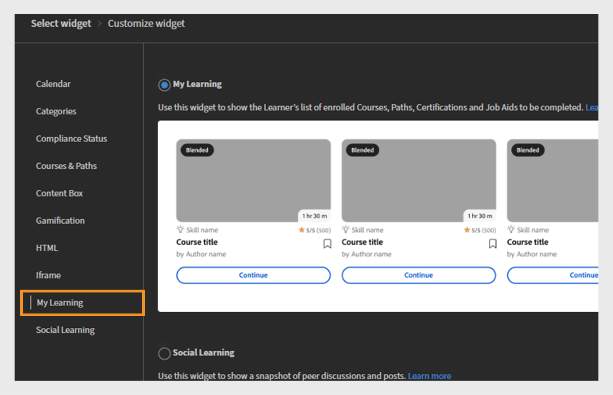

# 위젯 추가 및 구성

## 달력 위젯

달력 위젯은 예정된 세션 및 교육을 표시합니다. 달력을 검색하여 향후 몇 개월에 계획된 교육을 볼 수 있습니다. 이를 통해 월별로 교육 세션을 볼 수 있으며, 왼쪽 또는 오른쪽으로 스크롤할 수 있습니다.

책임자가 페이지에 달력 위젯을 추가하여 교육 일정을 표시할 수 있습니다. 학습자는 예정 세션을 보기 위해 개월 단위로 스크롤하여 달력과 상호 작용할 수 있습니다. 관련 교육을 빠르게 찾기 위해 세션을 필터링할 수 있습니다.

### 달력 위젯 추가

영업 팀과 고객 성공 관리자(CSM) 팀이 별도로 있는 금융 회사에서 관리자는 이 위젯을 사용하여 팀별 교육 세션을 강조할 수 있습니다. For example:

* 영업 팀은 제품 업데이트, 규정 준수 교육 및 피치 워크숍에 대한 예정된 세션을 확인할 수 있습니다.
* CSM 팀은 클라이언트 온보딩 워크샵, 고객 커뮤니케이션 교육 및 서비스 우수성 프로그램을 볼 수 있습니다.

달력 위젯을 구성하려면 다음을 수행합니다.

1. 관리자 권한으로 Adobe Learning Manager에 로그인합니다.
2. 왼쪽 탐색 창에서 **[!UICONTROL 브랜딩]**&#x200B;을 선택합니다.
3. **[!UICONTROL 사용자 지정 페이지]**&#x200B;를 선택합니다.
4. 필요한 페이지를 선택한 다음 **[!UICONTROL 페이지 디자인]**&#x200B;을 선택합니다.
5. **[!UICONTROL 편집]**&#x200B;을 선택한 다음 레이아웃을 선택합니다.
6. **[!UICONTROL 위젯 추가]**&#x200B;를 선택합니다.
7. **[!UICONTROL 일정]**&#x200B;을 선택한 다음 **[!UICONTROL 진행]**&#x200B;을 선택합니다.

   
   _일정에서 교육 세션을 표시하기 위한 달력 위젯 옵션을 강조하는 위젯 선택 화면_

8. **[!UICONTROL 위젯 제목]** 및 **[!UICONTROL 위젯 설명]**&#x200B;을 입력합니다.

   
   관리자가 위젯 제목과 설명을 설정하고 카탈로그를 선택할 수 있는 _달력 위젯 사용자 지정 화면_

9. **[!UICONTROL 달력]** 위젯 내에서 카탈로그의 강의 및 학습 경로를 표시하도록 검색하여 선택합니다.
10. **[!UICONTROL 위젯 추가]**&#x200B;를 선택합니다.

달력 위젯이 페이지에 추가됩니다. 책임자가 다른 위젯을 추가하고 페이지를 게시할 수 있습니다.

>[!NOTE]
>
>카탈로그를 선택하지 않으면 모든 카탈로그의 세션이 표시됩니다.

## 카테고리 위젯

범주 위젯은 카탈로그, 제품 또는 역할별로 구성된 학습 콘텐츠를 범주로 표시합니다. 학습자가 주제, 부서, 스킬 또는 기타 관련 분류별로 그룹화된 교육을 쉽게 검색하고 찾을 수 있도록 도와줍니다.

책임자는 범주화된 학습 옵션을 표시할 수 있도록 페이지에 범주 위젯을 추가합니다. 학습자는 위젯을 사용하여 관심 있는 범주를 선택하여 교육을 탐색한 다음 관련 강의 또는 경로를 확인할 수 있습니다.

카탈로그 및 권장 구성 방법에 대한 자세한 내용은 [카탈로그](/help/migrated/administrators/feature-summary/catalogs.md) 및 [Recommendations](/help/migrated/recommendations-adobe-learning-manager.md) 문서를 참조하십시오.

### 범주 위젯 추가

금융 서비스 회사의 경우 서로 다른 팀에서 역할별 교육에 액세스해야 하는 경우가 많습니다. 카테고리 위젯을 사용하면 학습 콘텐츠를 명확하고 클릭 가능한 타일로 구성하여 영업팀 및 CSM 팀이 필요한 항목을 더 쉽게 찾을 수 있습니다.

범주 위젯을 구성하려면 다음을 수행합니다.

1. 관리자 권한으로 Adobe Learning Manager에 로그인합니다.
2. 왼쪽 탐색 창에서 **[!UICONTROL 브랜딩]**&#x200B;을 선택합니다.
3. **[!UICONTROL 사용자 지정 페이지]**&#x200B;를 선택합니다.
4. 필요한 페이지를 선택한 다음 **[!UICONTROL 페이지 디자인]**&#x200B;을 선택합니다.
5. **[!UICONTROL 편집]**&#x200B;을 선택한 다음 레이아웃을 선택합니다.
6. **[!UICONTROL 위젯 추가]**&#x200B;를 선택합니다.
7. **[!UICONTROL 범주]**&#x200B;를 선택한 다음 **[!UICONTROL 진행]**&#x200B;을 선택하십시오.

   
   _쉽게 탐색할 수 있도록 카탈로그, 제품 또는 역할별로 학습 콘텐츠를 구성하는 범주 위젯 옵션을 강조하는 위젯 선택 화면_

8. 범주 카드에 표시할 세부 정보를 선택합니다.

   * **[!UICONTROL 범주 이미지]**
   * **[!UICONTROL 범주 설명]**

9. **[!UICONTROL 위젯 제목]** 및 **[!UICONTROL 위젯 설명]**&#x200B;을 입력합니다.
10. **[!UICONTROL 범주 원본]**&#x200B;에서 카탈로그를 검색하고 선택합니다.

    
    _범주 위젯 옵션을 구성하여 위젯 제목과 설명을 설정하고 범주 소스를 선택합니다_

11. **[!UICONTROL 위젯 추가]**&#x200B;를 선택합니다.

범주 위젯이 페이지에 추가됩니다. 책임자는 다른 위젯을 추가하고 페이지를 게시할 수 있습니다.

## 준수 위젯

준수 상태 위젯은 준수 또는 인증 요구 사항을 충족하는 데 대한 학습자의 진행률을 표시합니다. 완료, 보류 중 또는 기한이 경과한 강의를 포함하여 사용자에게 할당된 필수 교육의 상태가 표시됩니다.

관리자는 준수 상태 위젯을 페이지에 추가하여 준수 교육 진행률을 표시합니다. 학습자는 이를 사용하여 완료한 필수 강의와 여전히 주의가 필요한 강의를 빠르게 확인할 수 있습니다.

### 준수 상태 위젯 추가

금융 서비스 회사의 경우 영업 팀과 CSM(Customer Success Manager) 팀이 모두 제 시간에 규정 준수 교육을 완료해야 합니다. 준수 상태 위젯을 사용하면 학습자가 팀별 페이지에서 예정된 기한 및 교육 진행률을 직접 추적할 수 있습니다.

준수 위젯을 구성하려면 다음을 수행합니다.

1. 관리자 권한으로 Adobe Learning Manager에 로그인합니다.
2. 왼쪽 탐색 창에서 **[!UICONTROL 브랜딩]**&#x200B;을 선택합니다.
3. **[!UICONTROL 사용자 지정 페이지]**&#x200B;를 선택합니다.
4. 필요한 페이지를 선택한 다음 **[!UICONTROL 페이지 디자인]**&#x200B;을 선택합니다.
5. **[!UICONTROL 편집]**&#x200B;을 선택한 다음 레이아웃을 선택합니다.
6. **[!UICONTROL 위젯 추가]**&#x200B;를 선택합니다.
7. **[!UICONTROL 준수 상태]**&#x200B;를 선택한 다음 **[!UICONTROL 진행]**&#x200B;을 선택하십시오.

   
   _기한 및 상태 표시기로 학습자 등록을 표시하는 데 사용되는 준수 상태 위젯을 강조하는 위젯 선택 화면_

8. **[!UICONTROL 위젯 제목]** 및 **[!UICONTROL 위젯 설명]**&#x200B;을 입력합니다.

   
   _준수 상태 위젯 화면에서 관리자는 위젯 제목과 설명을 설정하여 학습자의 등록 마감일과 상태를 표시할 수 있습니다_

9. **[!UICONTROL 위젯 추가]**&#x200B;를 선택합니다.

준수 상태 위젯이 페이지에 추가됩니다. 책임자는 다른 위젯을 추가하고 페이지를 게시할 수 있습니다.

## 강의 및 경로 위젯

강의 및 경로 위젯에는 학습자의 역할, 관심 또는 교육 요구 사항에 맞게 조정된 추천 강의 및 학습 경로가 표시됩니다.

책임자는 페이지에 강의 및 경로 위젯을 추가하여 특정 대상자에게 주요 학습 내용을 강조합니다. 학습자는 위젯을 사용하여 추천 강의나 경로를 찾아보고 강의에 직접 등록할 수 있습니다.

### 강의 및 경로 위젯 추가

금융 회사가 영업 및 고객 성공 관리자(CSM)라는 두 팀에 대한 역할별 교육 페이지를 생성하려고 합니다. 강의 및 경로 위젯을 사용하여 각 팀에 가장 관련 있는 학습 프로그램을 표시할 수 있습니다.

강의 및 경로 위젯을 구성하려면 다음을 수행합니다.

1. 관리자 권한으로 Adobe Learning Manager에 로그인합니다.
2. 왼쪽 탐색 창에서 **[!UICONTROL 브랜딩]**&#x200B;을 선택합니다.
3. **[!UICONTROL 사용자 지정 페이지]**&#x200B;를 선택합니다.
4. 필요한 페이지를 선택한 다음 **[!UICONTROL 페이지 디자인]**&#x200B;을 선택합니다.
5. **[!UICONTROL 편집]**&#x200B;을 선택한 다음 레이아웃을 선택합니다.
6. **[!UICONTROL 위젯 추가]**&#x200B;를 선택합니다.
7. **[!UICONTROL 과정 및 경로]**&#x200B;를 선택합니다.

   
   _강의, 학습 경로, 인증, 작업 지원을 학습자용 대화형 카드로 표시하기 위한 강의 및 경로 위젯을 강조하는 위젯 선택 화면_

8. **[!UICONTROL 진행]**&#x200B;을 선택합니다.
9. **[!UICONTROL 위젯 제목]** 및 **[!UICONTROL 위젯 설명]**&#x200B;을 입력합니다.
10. 카탈로그를 선택하거나 표시할 최대 25개의 강의를 수동으로 선택합니다.

_책임자가 위젯 제목, 설명을 설정하고 대화형 카드로 표시할 강의 또는 학습 경로를 선택하는 과정 및 경로 위젯_
&#x200B;11. **[!UICONTROL 위젯 추가]**&#x200B;를 선택합니다.

강의 및 경로 위젯이 페이지에 추가됩니다. 책임자는 다른 위젯을 추가하고 페이지를 게시할 수 있습니다.

## 콘텐츠 상자 위젯

컨텐츠 상자 위젯을 통해 관리자는 텍스트, 이미지, 공지 또는 페이지에 대한 링크와 같은 사용자 정의된 컨텐츠를 추가할 수 있습니다. 학습 환경 내에서 직접 중요한 정보, 팁, 업데이트 또는 홍보 메시지를 공유할 수 있도록 유연한 공간을 제공합니다.

### 콘텐츠 상자 위젯 추가

금융 회사가 영업 및 고객 성공 관리자(CSM)라는 두 팀에 대한 역할별 교육 페이지를 생성하려고 합니다. Content Box 위젯을 사용하여 대상 리소스, 업데이트 및 동기 메시지를 공유하는 제목, 설명, 이미지 및 CTA(Call-To-Action) 단추가 있는 사용자 정의 섹션을 추가할 수 있습니다.

Content Box 위젯을 구성하려면 다음을 수행합니다.

1. 관리자 권한으로 Adobe Learning Manager에 로그인합니다.
2. 왼쪽 탐색 창에서 **[!UICONTROL 브랜딩]**&#x200B;을 선택합니다.
3. **[!UICONTROL 사용자 지정 페이지]**&#x200B;를 선택합니다.
4. 필요한 페이지를 선택한 다음 **[!UICONTROL 페이지 디자인]**&#x200B;을 선택합니다.
5. **[!UICONTROL 편집]**&#x200B;을 선택한 다음 레이아웃을 선택합니다.
6. **[!UICONTROL 위젯 추가]**&#x200B;를 선택합니다.
7. **[!UICONTROL 콘텐츠 상자]**&#x200B;를 선택한 다음 **[!UICONTROL 진행]**&#x200B;을 선택합니다.

   
   _학습자 참여를 향상시키기 위해 사용자 지정 이미지, 텍스트 및 동작 단추를 표시하기 위한 콘텐츠 상자 위젯을 강조하는 위젯 선택 화면_

8. **[!UICONTROL 제목]** 및 **[!UICONTROL 설명]**&#x200B;을 입력하십시오.
9. **[!UICONTROL 작업 단추 레이블]**&#x200B;에 텍스트를 입력하고 링크를 제공합니다.
10. 배경 채우기 옵션 중 하나를 선택합니다.

    * **[!UICONTROL 색상]**: 색상 피커에서 색상을 선택하거나 텍스트 필드에 색상 코드를 입력합니다.
    * **[!UICONTROL 이미지]**: 사진을 찾아 업로드합니다.

11. **[!UICONTROL 콘텐츠 상자 높이]** 옵션을 사용하여 상자 높이를 조정합니다.
12. 텍스트 서식 옵션을 선택합니다.

    
    관리자가 제목, 설명, 동작 단추 레이블 및 링크를 입력할 수 있는 _콘텐츠 상자 위젯 사용자 지정 화면_

13. **[!UICONTROL 위젯 추가]**&#x200B;를 선택합니다.

콘텐츠 상자 위젯이 페이지에 추가됩니다. 책임자는 다른 위젯을 추가하고 페이지를 게시할 수 있습니다.

## 게임화 위젯

책임자는 게임화 위젯을 사용자 정의 페이지에 추가하여 학습자의 도전 과제(예: 획득한 배지, 누적된 점수 및 순위표)를 표시합니다. 학습자는 자신의 진도를 추적하고 동료와 결과를 비교할 수 있으며, 이는 동기부여와 지속적 참여를 촉진한다.

### 게임화 위젯 추가

금융 회사는 두 주요 팀인 영업 및 고객 성공 관리자(CSM)에서 학습자 참여와 동기를 높이고 싶어합니다. 게임화 위젯을 사용하여 학습자가 교육을 완료하고 능동적으로 참여할 수 있도록 점수, 배지 및 순위표를 부여할 수 있습니다.

영업 팀의 경우 게임화는 영업 기술, 제품 지식 및 고객 참여 교육과 관련된 성과에 중점을 둘 수 있습니다. CSM 팀의 경우 고객 서비스 인증, 규정 준수 교육 및 고객 관리 기술을 강조할 수 있습니다.

게임화 위젯을 구성하려면 다음을 수행합니다.

1. 관리자 권한으로 Adobe Learning Manager에 로그인합니다.
2. 왼쪽 탐색 창에서 **[!UICONTROL 브랜딩]**&#x200B;을 선택합니다.
3. **[!UICONTROL 사용자 지정 페이지]**&#x200B;를 선택합니다.
4. 필요한 페이지를 선택한 다음 **[!UICONTROL 페이지 디자인]**&#x200B;을 선택합니다.
5. **[!UICONTROL 편집]**&#x200B;을 선택한 다음 레이아웃을 선택합니다.
6. **[!UICONTROL 위젯 추가]**&#x200B;를 선택합니다.
7. **[!UICONTROL 게임화]**&#x200B;를 선택한 다음 **[!UICONTROL 진행]**&#x200B;을 선택합니다.

   
   순위표에 학습 활동과 성과를 표시하는 데 사용되는 게임화 위젯을 강조하는 _위젯 선택 화면_

8. **[!UICONTROL 위젯 제목]** 및 **[!UICONTROL 위젯 설명]**&#x200B;을 입력합니다.
9. **[!UICONTROL 위젯 추가]**&#x200B;를 선택합니다.

게임화 위젯이 페이지에 추가됩니다. 책임자는 다른 위젯을 추가하고 페이지를 게시할 수 있습니다.

## HTML 위젯

HTML 위젯을 사용하면 관리자가 사용자 정의 HTML 코드를 페이지에 직접 포함할 수 있습니다. 이를 통해 맞춤형 콘텐츠를 추가하거나 서드파티 도구를 통합하거나 표준 위젯 기능을 뛰어넘는 대화형 요소를 포함할 수 있는 유연성을 제공합니다. HTML, CSS 및 심지어 JavaScript를 통한 풍부한 사용자 정의를 지원하여 학습 플랫폼 내에서 독창적인 디자인과 외부 통합을 가능하게 합니다.

### HTML 위젯 추가

금융 회사는 영업 및 고객 성공 관리자(CSM)라는 두 주요 팀에 맞게 맞춤화된 대화형 콘텐츠를 제공하고자 합니다. HTML 위젯을 사용하여 재무 대시보드, 데이터 시각화, 대화형 양식 또는 시장 분석 도구와 같은 사용자 정의 HTML 기반 리소스를 교육 또는 팀 페이지에 직접 포함할 수 있습니다.

HTML 위젯을 구성하려면 다음을 수행합니다.

1. 관리자 권한으로 Adobe Learning Manager에 로그인합니다.
2. 왼쪽 탐색 창에서 **[!UICONTROL 브랜딩]**&#x200B;을 선택합니다.
3. **[!UICONTROL 사용자 지정 페이지]**&#x200B;를 선택합니다.
4. 필요한 페이지를 선택한 다음 **[!UICONTROL 페이지 디자인]**&#x200B;을 선택합니다.
5. **[!UICONTROL 편집]**&#x200B;을 선택한 다음 레이아웃을 선택합니다.
6. **[!UICONTROL 위젯 추가]**&#x200B;를 선택합니다.
7. **[!UICONTROL HTML]**&#x200B;을 선택한 다음 **[!UICONTROL 진행]**&#x200B;을 선택합니다.

   
   HTML, CSS 및 JavaScript 코드를 사용하여 HTML을 사용자 정의하기 위한 페이지 위젯을 강조하는 _위젯 선택 화면_

8. 각 필드에 **[!UICONTROL HTML]**, **[!UICONTROL CSS]** 및 **[!UICONTROL JavaScript]** 코드를 입력합니다.
9. **[!UICONTROL 위젯 추가]**&#x200B;를 선택합니다.

HTML 위젯이 페이지에 추가됩니다. 책임자는 다른 위젯을 추가하고 페이지를 게시할 수 있습니다.

## IFrame 위젯

Iframe 위젯은 학습 플랫폼의 페이지 내에서 직접 외부 URL의 콘텐츠를 표시합니다. 외부 웹 사이트, 도구 또는 응용 프로그램을 프레임 안에 포함하므로 학습자가 LMS를 떠나지 않고도 해당 콘텐츠를 보고 상호 작용할 수 있습니다.

### Iframe 위젯 추가

금융 회사는 영업 및 CSM(Customer Success Manager) 팀의 내부 교육 및 공동 작업 페이지에 외부 도구와 리소스를 원활하게 포함하고자 합니다. Iframe 위젯을 사용하여 LMS 인터페이스 내에 직접 타사 금융 대시보드, 시장 분석 플랫폼 또는 클라이언트 관리 포털을 표시할 수 있습니다.

Iframe 위젯을 구성하려면:

1. 관리자 권한으로 Adobe Learning Manager에 로그인합니다.
2. 왼쪽 탐색 창에서 **[!UICONTROL 브랜딩]**&#x200B;을 선택합니다.
3. **[!UICONTROL 사용자 지정 페이지]**&#x200B;를 선택합니다.
4. 필요한 페이지를 선택한 다음 **[!UICONTROL 페이지 디자인]**&#x200B;을 선택합니다.
5. **[!UICONTROL 편집]**&#x200B;을 선택한 다음 레이아웃을 선택합니다.
6. **[!UICONTROL 위젯 추가]**&#x200B;를 선택합니다.
7. **[!UICONTROL Iframe]**&#x200B;을 선택한 다음 **[!UICONTROL 진행]**&#x200B;을 선택합니다.

   
   _선택한 섹션 내에 외부 응용 프로그램 또는 웹 페이지를 포함하기 위한 Iframe 위젯을 강조하는 위젯 선택 화면_

8. **[!UICONTROL 작업 단추에 연결된 페이지]** 옵션에 URL을 입력하십시오.
9. **[!UICONTROL Iframe 높이]** 옵션을 사용하여 Iframe 높이를 조정합니다.

   
   _Iframe 위젯 사용자 지정 화면에서 관리자는 페이지 URL을 입력하고 iframe 높이를 지정하여 외부 콘텐츠를 포함할 수 있습니다._

10. **[!UICONTROL 위젯 추가]**&#x200B;를 선택합니다.

Iframe 위젯이 페이지에 추가됩니다. 책임자는 다른 위젯을 추가하고 페이지를 게시할 수 있습니다.

관리자는 올바른 세부 정보를 검색하려면 액세스 토큰을 iframe URL의 쿼리 매개 변수로 포함해야 합니다. 예를 들어, Adobe Learning Manager의 정보를 iframe 내에 표시하려면 URL에 다음 매개 변수를 포함해야 합니다.

* 사용자 ID: 학습자의 고유 식별자입니다
* accountId: 학습자와 연결된 계정 식별자입니다
* 토큰: API 호출에 필요한 인증 토큰
* 로케일: 학습자의 언어 또는 로케일 환경 설정

## 내 학습 위젯

내 학습 위젯은 학습자에게 할당되거나 등록된 모든 강의, 학습 프로그램 및 인증을 개인화된 보기로 제공합니다. 유형별, 기한별로 학습 내용을 구성하여 학습자가 자신의 진행 상황을 쉽게 추적하고 학습 자료에 접근할 수 있도록 하고 있다. 이 위젯을 통해 학습자는 필요한 교육에 집중할 수 있으며 예정된 기한 을 간략하게 볼 수 있습니다.

### 내 학습 위젯 추가

금융 회사는 두 개의 주요 팀인 영업 및 고객 성공 관리자(CSM)에 맞게 개인화된 학습 경험을 제공하고자 합니다. 내 학습 위젯을 사용하여 각 팀 멤버에게 할당된 강의, 진행 중인 학습 경로 및 인증을 통합한 보기를 제공할 수 있습니다.

내 학습 위젯을 구성하려면 다음과 같이 하십시오.

1. 관리자 권한으로 Adobe Learning Manager에 로그인합니다.
2. 왼쪽 탐색 창에서 **[!UICONTROL 브랜딩]**&#x200B;을 선택합니다.
3. **[!UICONTROL 사용자 지정 페이지]**&#x200B;를 선택합니다.
4. 필요한 페이지를 선택한 다음 **[!UICONTROL 페이지 디자인]**&#x200B;을 선택합니다.
5. **[!UICONTROL 편집]**&#x200B;을 선택한 다음 레이아웃을 선택합니다.
6. **[!UICONTROL 위젯 추가]**&#x200B;를 선택합니다.
7. **[!UICONTROL 내 학습]**&#x200B;을 선택한 다음 **[!UICONTROL 진행]**&#x200B;을 선택합니다.

   
   _위젯 선택 화면, 학습자가 등록한 강의의 개인화된 목록을 표시하는 데 사용되는 내 학습 위젯을 강조 표시_

8. **[!UICONTROL 위젯 제목]** 및 **[!UICONTROL 위젯 설명]**&#x200B;을 입력합니다.
9. **[!UICONTROL 위젯 추가]**&#x200B;를 선택합니다.

내 학습 위젯이 페이지에 추가됩니다. 책임자는 다른 위젯을 추가하고 페이지를 게시할 수 있습니다.

## 소셜 학습 위젯

소셜 학습 위젯을 통해 학습자는 학습 플랫폼 내에서 상호 작용하고, 아이디어를 공유하고, 공동 작업을 수행할 수 있습니다. 텍스트, 비디오, 오디오, 스크린샷, 질문, 투표 등 다양한 유형의 콘텐츠 게시를 지원합니다. 학습자는 댓글을 달거나 답글을 달거나, 업보팅 또는 다운보팅을 할 수 있어 동료간 지식공유와 참여를 촉진할 수 있다. 이 위젯은 사회적 상호 작용과 지속적인 학습을 유도하여 공식적인 훈련을 보완하는 무형식 학습 공간을 만듭니다.

### 소셜 학습 위젯 추가

금융 회사는 영업 및 고객 성공 관리자(CSM)라는 두 주요 팀 간의 공동 작업과 지식 공유를 원합니다. 소셜 학습 위젯을 사용하여 팀 구성원이 질문을 게시하고 모범 사례를 공유하고 유용한 콘텐츠를 업로드하고, 토론에 참여하는 대화형 공간을 만들 수 있습니다.

소셜 학습 위젯을 구성하려면 다음을 수행합니다.

1. 관리자 권한으로 Adobe Learning Manager에 로그인합니다.
2. 왼쪽 탐색 창에서 **[!UICONTROL 브랜딩]**&#x200B;을 선택합니다.
3. **[!UICONTROL 사용자 지정 페이지]**&#x200B;를 선택합니다.
4. 필요한 페이지를 선택한 다음 **[!UICONTROL 페이지 디자인]**&#x200B;을 선택합니다.
5. **[!UICONTROL 편집]**&#x200B;을 선택한 다음 레이아웃을 선택합니다.
6. **[!UICONTROL 위젯 추가]**&#x200B;를 선택합니다.
7. **[!UICONTROL 소셜 학습]**&#x200B;을 선택한 다음 **[!UICONTROL 진행]**&#x200B;을 선택합니다.

   
   공동 작업 및 참여를 장려하는 게시물을 표시하기 위한 소셜 학습 위젯을 강조하는 _위젯 선택 화면_

8. **[!UICONTROL 위젯 제목]** 및 **[!UICONTROL 위젯 설명]**&#x200B;을 입력합니다.
9. **[!UICONTROL 위젯 추가]**&#x200B;를 선택합니다.

소셜 학습 위젯이 페이지에 추가됩니다. 책임자는 다른 위젯을 추가하고 페이지를 게시할 수 있습니다.

## 새로운 기능

페이지에서 위젯을 구성한 후 메뉴를 사용하여 페이지를 구성하고 그룹화합니다.
