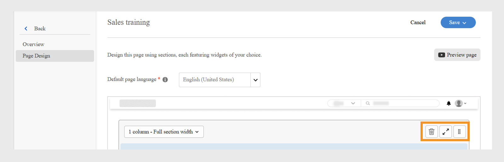

# Experience Builder에서 사용자 정의 페이지 만들기

금융 서비스 회사의 관리자는 영업 팀과 고객 성공 팀이라는 두 팀을 관리합니다. 각 팀에는 고유한 학습 요구 사항이 있지만, 두 팀 모두 동일한 표준 학습 포털을 사용하고 있습니다. 이로 인해 혼란, 어수선함, 학습자 참여도가 낮아졌다.
헤드리스 빌드에 투자하거나 맞춤형 개발자 솔루션을 기다릴 필요 없이 이 문제를 해결하려면 Adobe Learning Manager에서 Experience Builder를 사용하면 됩니다. 페이지, 위젯 및 메뉴를 사용하여 코딩 없이 몇 단계만으로 브랜드화된 역할별 포털을 디자인할 수 있습니다.

Adobe Learning Manager에서 영업 엔지니어링 팀을 위한 사용자 정의 페이지를 만들려면 다음과 같이 하십시오.

1. 관리자 권한으로 Adobe Learning Manager에 로그인합니다.
2. 왼쪽 탐색 창에서 **[!UICONTROL 브랜딩]**&#x200B;을 선택합니다.
3. **[!UICONTROL 사용자 지정 페이지]**&#x200B;를 선택합니다.
4. **[!UICONTROL 페이지 만들기]**&#x200B;를 선택합니다.

   
   새 사용자 지정 학습 환경을 디자인하는 페이지 만들기 옵션이 표시된 _사용자 지정 페이지 화면_

5. **[!UICONTROL 페이지 이름]**&#x200B;을 입력합니다(예: 영업 팀을 위한 영업 교육).
6. **[!UICONTROL 페이지 설명]**&#x200B;을 입력하십시오.

   
   대상 영업 교육 포털을 만들기 위한 페이지 이름, 설명, 유형, URL 및 아이콘 구성에 대한 필드를 표시하는 Adobe Learning Manager의 _영업 교육 페이지 설정_

7. 다음에서 페이지 유형을 선택합니다.

   * **[!UICONTROL ALM 위젯을 사용하여 빌드]**: 관리자는 기존 Adobe Learning Manager 위젯을 사용하여 페이지를 만들 수 있습니다. 페이지 URL 필드에 사용자 정의 문자열을 입력합니다. 이 문자열은 사용자 정의 페이지의 URL에 추가됩니다.
   * **[!UICONTROL 외부 페이지]**: 관리자가 외부 페이지의 URL을 추가할 수 있습니다. 페이지 유형을 [외부]로 선택한 경우 [페이지 URL] 텍스트 필드에 외부 페이지 URL을 입력합니다.

8. **[!UICONTROL 아이콘 변경]**&#x200B;을 선택하여 페이지의 아이콘을 변경합니다.
9. **[!UICONTROL 새 언어 추가]**&#x200B;를 선택하여 페이지의 기본 언어를 추가합니다.
10. **[!UICONTROL 저장]**&#x200B;을 선택합니다.

페이지가 만들어지고 [사용자 정의 페이지] 섹션에 초안으로 저장됩니다. 관리자는 위젯을 사용하여 초안 페이지를 편집하고 디자인할 수 있습니다.

다음 단계는 사용자 정의 페이지에 레이아웃을 추가하는 것입니다. 여기서 위젯을 추가하고 구성할 수 있습니다.

## Experience Builder의 페이지 레이아웃

드롭다운 메뉴에서 적절한 섹션 레이아웃을 선택하여 페이지를 디자인합니다. 모든 레이아웃의 최대 폭은 1212픽셀입니다. 추가하려는 위젯 수와 원하는 크기에 따라 다음 섹션 옵션 중에서 선택합니다.

* **[!UICONTROL 1 열 - 전체 섹션 너비]**: 콘텐츠가 섹션의 전체 너비에 걸쳐 있어 최대 공간을 제공합니다.
* **[!UICONTROL 2개의 열 - 섹션 너비가 각각 1/2개씩]**: 섹션이 동일한 너비의 두 열로 균등하게 분할됩니다.
* **[!UICONTROL 2열 - 2/3 및 1/3 섹션 너비]**: 기본 콘텐츠는 너비의 3분의 2를 차지하고 측면 콘텐츠는 3분의 1을 사용합니다.
* **[!UICONTROL 2열 - 1/3 및 2/3 섹션 너비]**: 측면 콘텐츠는 3분의 1을 차지하고 메인 콘텐츠는 3분의 2를 차지합니다.
* **[!UICONTROL 3개 열 - 섹션 너비가 각각 1/3개씩]**: 섹션이 동일한 너비의 3개 열로 나뉩니다.

>[!NOTE]
>
>1열 - 전체 섹션 폭 레이아웃을 제외한 모든 레이아웃에서 최대 10개의 위젯을 수직으로 추가할 수 있습니다.

Experience Builder에서 영업 교육 페이지의 레이아웃을 선택하려면 다음을 수행하십시오.

1. 관리자 권한으로 Adobe Learning Manager에 로그인합니다.
2. 왼쪽 탐색 창에서 **[!UICONTROL 브랜딩]**&#x200B;을 선택합니다.
3. **[!UICONTROL 사용자 지정 페이지]**&#x200B;를 선택한 다음 필요한 페이지를 선택합니다.
4. **[!UICONTROL 페이지 디자인]**&#x200B;을 선택합니다.
5. **[!UICONTROL 편집]**&#x200B;을 선택합니다.

   
   _판매 교육 사용자 지정 페이지에 대한 페이지 디자인 편집 화면에서 페이지 섹션, 위젯 및 레이아웃을 추가하기 위한 편집 버튼을 강조 표시_

6. **[!UICONTROL 섹션 레이아웃 선택]** 드롭다운에서 옵션을 선택합니다.

   
   _섹션 레이아웃 선택 대화 상자를 사용하면 관리자가 사용자 지정 페이지 디자인을 위한 단일 열 또는 다중 열 위젯 배열을 선택할 수 있습니다._

7. **[!UICONTROL 진행]**&#x200B;을 선택합니다.

추가된 레이아웃에는 다음과 같은 옵션이 있습니다.

* **[!UICONTROL 행 삭제]**: 레이아웃에서 행을 제거합니다.
* **[!UICONTROL 화면 너비에 맞추기]**: 더 잘 보이도록 화면에 맞게 자동으로 크기가 조정되도록 레이아웃을 조정합니다.
* **[!UICONTROL 재정렬]**: 레이아웃을 원하는 위치로 드래그하여 놓아 레이아웃 순서를 변경합니다.

_섹션을 재정렬, 확장 또는 삭제하는 레이아웃 옵션을 표시하는 페이지 레이아웃_

다음 단계는 사용자 정의 페이지에 위젯을 추가하고 구성하는 것입니다.

## 위젯 추가 및 구성

요구 사항에 따라 영업 교육 사용자 정의 페이지에 필요한 위젯을 추가합니다.

Sales Training 사용자 정의 페이지에서 위젯을 구성하려면 다음을 수행합니다.

1. 레이아웃에서 **[!UICONTROL 위젯 추가]**&#x200B;를 선택합니다.

   
   _페이지 디자인 화면에서 관리자가 위젯을 선택하고 추가하여 강의 페이지를 사용자 지정할 수 있습니다_

2. **[!UICONTROL 콘텐츠 상자 위젯]**&#x200B;을 선택한 다음 **[!UICONTROL 진행]**&#x200B;을 선택합니다.

   
   _학습자 참여를 향상시키기 위해 사용자 지정 이미지, 텍스트 및 동작 단추를 표시하기 위한 콘텐츠 상자 위젯을 강조하는 위젯 선택 화면_

3. **[!UICONTROL 제목]** 및 **[!UICONTROL 설명]**&#x200B;을 입력하십시오.
4. **[!UICONTROL 작업 단추 레이블]**&#x200B;에 텍스트를 입력하고 링크를 제공합니다.
5. 나머지 옵션을 구성합니다. [콘텐츠 상자 위젯](/help/migrated/administrators/feature-summary/experience-builder/add-a-widget.md#content-box-widget)에 대해 자세히 알아보려면 이 **[!UICONTROL 섹션]**&#x200B;을(를) 확인하세요.

   
   위젯 구성 옵션을 보여 주는 _콘텐츠 상자 위젯 화면_

6. 영업 엔지니어를 위한 **[!UICONTROL 콘텐츠 상자 위젯]** 구성 화면에 제목, 설명 및 작업 단추 레이블을 입력합니다.
7. **[!UICONTROL 위젯 추가]**&#x200B;를 선택합니다.
8. **[!UICONTROL 저장]**&#x200B;을 선택하고 다음 옵션 중 하나를 선택합니다.
a. **[!UICONTROL 초안으로 저장]**: 페이지가 초안으로 저장됩니다. 관리자는 나중에 페이지를 편집할 수 있습니다.
b. **[!UICONTROL 저장 및 Publish]**: 페이지가 게시되고 관리자가 이 페이지를 메뉴에 추가할 수 있습니다.

   
   _저장 옵션을 사용하면 관리자가 페이지를 나중에 편집할 수 있도록 초안으로 저장하거나 학습자 액세스를 위해 게시할 것인지 선택할 수 있습니다_

페이지를 초안으로 저장하거나 게시할 수 있습니다. 관리자는 게시하기 전에 초안을 편집할 수 있으며 게시된 페이지를 업데이트하고 다시 게시할 수도 있습니다.

동일한 단계에 따라 Customer Success Manager 팀을 위한 페이지를 만듭니다.

## 페이지 미리보기

페이지를 미리 보려면:

1. 관리자 권한으로 Adobe Learning Manager에 로그인합니다.
2. 왼쪽 탐색 창에서 **[!UICONTROL 브랜딩]**&#x200B;을 선택합니다.
3. **[!UICONTROL 사용자 지정 페이지]**&#x200B;를 선택합니다.
4. 필요한 페이지를 선택한 다음 **[!UICONTROL 페이지 디자인]**&#x200B;을 선택합니다.
5. **[!UICONTROL 편집]**&#x200B;을 선택한 다음 **[!UICONTROL 미리 보기 페이지]**&#x200B;를 선택하여 포털의 미리 보기를 봅니다.

   
   _배너, 추천 코스가 있는 사용자 지정 페이지 레이아웃을 표시하는 페이지 미리 보기_

6. 위젯의 높이와 폭을 보려면 Inspect 모드 를 선택합니다.

   
   _Inspect 모드가 있는 Experience Builder의 페이지 미리보기 화면이 강조 표시되어 관리자가 위젯을 검토하고 검사할 수 있습니다_

## 다른 언어로 페이지 만들기

관리자는 페이지를 만드는 동안 [새 언어 추가]에서 필요한 언어를 선택하여 여러 로케일별 사용자 정의 페이지를 만들 수 있습니다. 여러 언어를 추가하는 경우 위젯 세부 정보는 기본 언어 탭 옆에 있는 해당 탭의 각 언어별로 별도로 구성해야 합니다.

_관리자는 기본 언어와 함께 프랑스어와 같은 추가 언어에 대한 위젯 세부 정보를 추가할 수 있습니다._

## 페이지 수명 주기 관리

관리자는 [사용자 정의 페이지] 섹션을 사용하여 페이지를 편집, 삭제 및 복제할 수 있습니다.

### 페이지 편집

사용자 정의 페이지를 편집하려면 다음과 같이 하십시오.

1. 관리자 권한으로 Adobe Learning Manager에 로그인합니다.
2. 왼쪽 탐색 창에서 브랜딩 을 선택합니다.
3. 사용자 정의 페이지를 선택합니다.
4. 필요한 페이지를 선택한 다음 편집 을 선택합니다.
5. 저장을 선택합니다.

페이지가 변경 사항으로 업데이트됩니다.

_사용자 정의 페이지를 편집하여 관리자가 페이지 이름, 설명 및 유형을 업데이트할 수 있도록 허용_

### 페이지 삭제

페이지를 삭제하려면 다음을 수행하십시오.

1. 관리자 권한으로 Adobe Learning Manager에 로그인합니다.
2. 왼쪽 탐색 창에서 브랜딩 을 선택합니다.
3. 사용자 정의 페이지를 선택합니다.
4. 필요한 페이지를 선택합니다.
5. 작업 을 선택한 다음 삭제 를 선택합니다.

_제품 교육용으로 만든 사용자 정의 페이지를 삭제하는 옵션을 표시하는 사용자 정의 페이지 화면_

### 페이지 복제

페이지 복제 방법:

1. 관리자 권한으로 Adobe Learning Manager에 로그인합니다.
2. 왼쪽 탐색 창에서 브랜딩 을 선택합니다.
3. 사용자 정의 페이지를 선택합니다.
4. 필요한 페이지를 선택합니다.
5. 작업 을 선택한 다음 복제 를 선택합니다.

_제품 교육용으로 만들어진 사용자 정의 페이지를 복제하는 옵션을 표시하는 사용자 정의 페이지 화면_

## 새로운 기능

페이지를 만든 후 교육 요구 사항에 따라 사용자 정의 페이지에 위젯을 추가하고 구성합니다.
