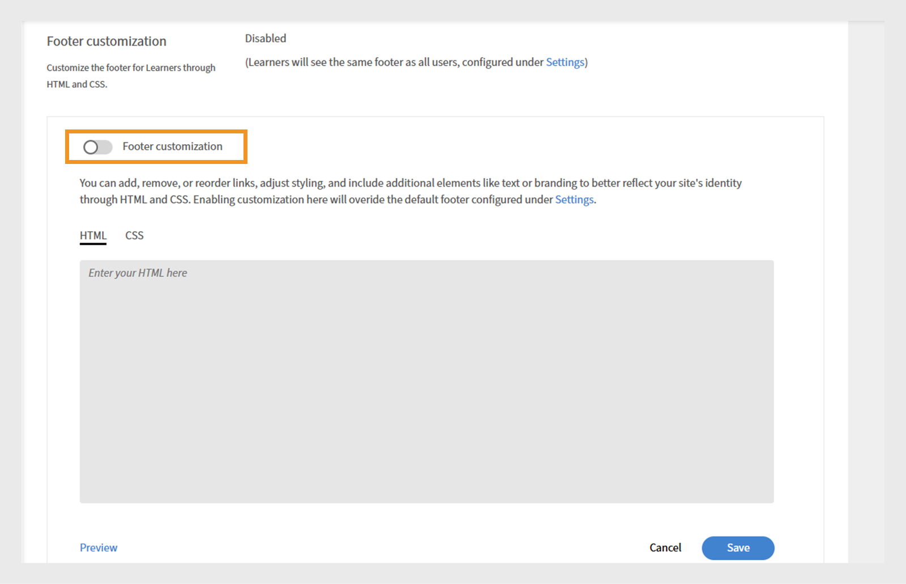
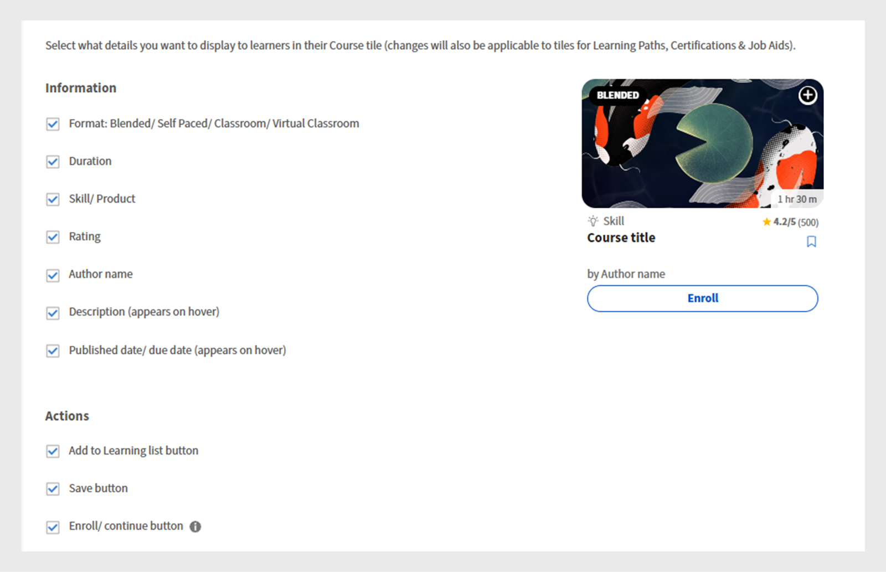
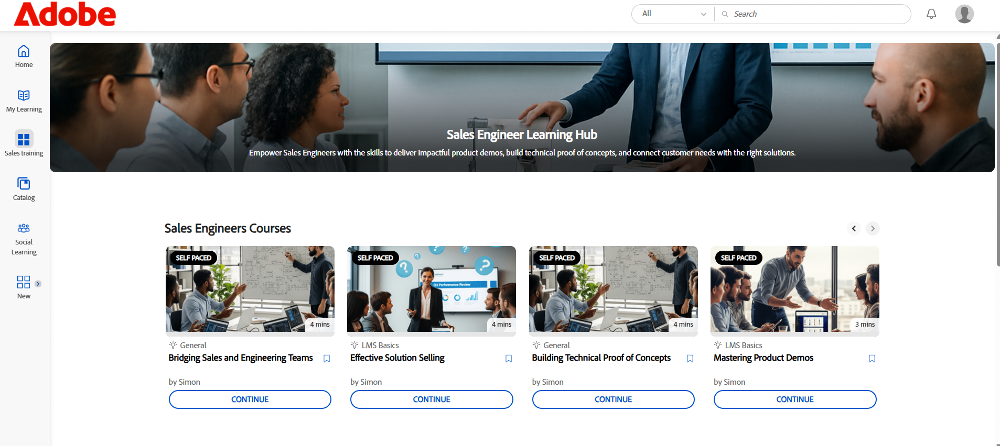

# Experience Builder 사용자 정의

## 바닥글 사용자 정의

바닥글은 학습자 인터페이스의 아래쪽에 표시되며 일반적으로 관리자 설정에서 구성한 기본 정보를 표시합니다. 책임자는 이를 사용자 정의 바닥글로 대체하여 브랜드 경험을 만들 수 있습니다. HTML 및 CSS를 사용하여 조직 요구 사항에 맞게 바닥글의 디자인, 레이아웃 및 콘텐츠를 정의할 수 있습니다.

금융회사의 관리자는 사용자 정의 옵션을 사용하여 바닥글을 구성할 수 있습니다. 이 옵션을 사용하면 나만의 HTML과 CSS를 추가하여 바닥글을 완전히 유연하게 디자인할 수 있습니다.

바닥글을 사용자 정의하려면 다음과 같이 하십시오.

1. 관리자 권한으로 Adobe Learning Manager에 로그인합니다.
2. **[!UICONTROL 브랜딩]**&#x200B;을 선택한 다음 **[!UICONTROL 일반]**&#x200B;을 선택합니다.
3. **[!UICONTROL 바닥글 사용자 지정]** 옵션 옆의 **[!UICONTROL 편집]**&#x200B;을 선택합니다.

   
   바닥글 사용자 지정을 활성화하는 옵션이 표시된 Adobe Learning Manager의 _일반 설정 화면_

4. 토글 버튼을 선택하여 **[!UICONTROL 바닥글 사용자 지정]**&#x200B;을 활성화합니다.

   
   Adobe Learning Manager에서 _바닥글 사용자 지정 설정, 토글을 표시하여 사용자 지정 바닥글과 필드가 개인 맞춤화된 브랜딩을 위해 HTML 또는 CSS를 추가하도록 설정_

5. 각각의 탭에서 **[!UICONTROL HTML]** 및 **[!UICONTROL CSS]**&#x200B;을 입력하세요.

   
   Adobe Learning Manager의 _바닥글 사용자 지정 화면에서 학습자 인터페이스 바닥글을 추가, 편집 또는 스타일링하는 사용자 지정 HTML 섹션이 표시됩니다_

6. 사용자 지정된 바닥글을 저장하기 전에 보려면 **[!UICONTROL 미리 보기]**&#x200B;를 선택하세요.

   
   Adobe Learning Manager에서 사용자 정의된 학습자 인터페이스 바닥글 미리 보기(범주화된 링크 포함)__

7. **[!UICONTROL 저장]**&#x200B;을 선택합니다.

사용자 정의된 바닥글이 모든 학습자에게 표시됩니다.

## 강의 타일 사용자 정의

금융 회사에서 책임자는 강의 타일을 설정하여 학습자가 볼 수 있는 세부 정보를 결정할 수 있습니다. 예를 들어, 준수 교육에 대한 강의 설명과 스킬 이름을 표시하지만 필수 요구 사항에 집중할 수 있도록 등급 또는 작성자의 이름을 숨길 수 있습니다.

강의 타일을 사용자 정의하려면

1. 관리자 권한으로 Adobe Learning Manager에 로그인합니다.
2. **[!UICONTROL 브랜딩]**&#x200B;을 선택한 다음 **[!UICONTROL 강의 타일]**&#x200B;을 선택합니다.
3. **[!UICONTROL 편집]**&#x200B;을 선택합니다.

   
   Adobe Learning Manager의 _강의 타일 설정 화면에서 타일을 사용자 지정할 수 있는 편집 옵션 표시_

4. 아래 옵션을 선택하여 강의 정보와 관련된 세부 정보를 표시하거나 숨깁니다.

   a. **[!UICONTROL 형식]**: 혼합/자가 진행식/강의실/가상 강의실: 학습 개체의 유형입니다.
b. **[!UICONTROL 기간]**: 학습 개체의 기간입니다.
c. **[!UICONTROL 스킬/제품]**: 강의 범위의 주요 스킬 또는 제품을 표시합니다.
d. **[!UICONTROL 등급]**: 강의의 학습자 등급을 표시합니다.
e. **[!UICONTROL 작성자 이름]**: 강의 작성자 이름을 표시합니다.
f. **[!UICONTROL 설명(마우스를 위로 가져가면 표시됨)]**: 학습자가 카드 위에 마우스를 가져가면 강의에 대한 간단한 요약을 표시합니다.
g. **[!UICONTROL 게시된 날짜/기한(마우스를 위로 가져가면 표시됨)]**: 강의가 게시된 시기 또는 완료 기한을 표시합니다.

5. 강의 조치와 관련된 세부 정보를 표시하거나 숨기려면 아래 옵션을 선택하십시오.

   a. **[!UICONTROL 학습 목록에 추가 단추]**: 나중에 참조할 수 있도록 학습자가 강의를 개인 학습 목록에 저장할 수 있도록 허용합니다.
b. **[!UICONTROL 저장 단추]**: 강의 설정 또는 환경 설정에 대한 변경 내용을 저장합니다.
c. **[!UICONTROL 등록/계속 단추]**: 학습자가 새 강의에 등록하거나 이미 시작한 강의를 계속할 수 있도록 허용합니다. 이 옵션을 숨기면 그 옆에 나타나는 권장하지 않음 및 다운로드 작업도 제거됩니다.

   
   _Adobe Learning Manager에서 관리자가 학습자에게 표시할 정보와 동작을 선택하는 강의 타일 구성 화면_

6. 강의 타일 미리 보기가 화면 오른쪽에 표시됩니다.

   
   Adobe Learning Manager의 _강의 타일 구성 화면에서 강의 타일 미리 보기를 강조합니다._

7. **저장**&#x200B;을 선택합니다.

사용자 정의된 강의 타일이 모든 학습자에게 표시됩니다.

**사용자 지정 전**


_사용자 지정 전 Adobe Learning Manager의 강의 타일_

**사용자 지정 후**


사용자 지정 후 _Adobe Learning Manager의 강의 타일_

## JavaScript 및 CSS를 사용하여 사용자 정의

금융 회사 관리자는 회사의 브랜딩 및 규제 요구 사항에 맞게 CSS와 JavaScript를 삽입하여 학습자 앱을 사용자 정의하고 앱의 모양, 레이아웃 및 대화형 기능을 완벽하게 제어할 수 있습니다.

CSS 및 JS를 사용하여 학습자 인터페이스를 사용자 정의하려면 다음과 같이 하십시오.

1. 관리자 권한으로 Adobe Learning Manager에 로그인합니다.
2. **[!UICONTROL 브랜딩]**&#x200B;을 선택한 다음 **[!UICONTROL CSS 및 JS 구성]**&#x200B;을 선택합니다.
3. **[!UICONTROL 편집]**&#x200B;을 선택합니다.
4. 각 탭에 사용자 정의 CSS 및 JS를 입력합니다.

   
   관리자가 사용자 정의 CSS 및 JS를 추가할 수 있는 Adobe Learning Manager의 _CSS 및 JS 구성 화면_

5. 저장을 선택합니다.

사용자 정의가 모든 학습자에게 표시됩니다.

**사용자 지정 전**

학습자 홈페이지 메뉴 디자인은 Adobe Learning Manager 기본 디자인을 기반으로 합니다.


_사용자 정의 전 Adobe Learning Manager 학습자 홈페이지_

**사용자 지정 후**

다음 CSS 및 JS를 추가한 후 사용자 정의에 따라 학습자 홈페이지 메뉴가 업데이트되었습니다.

샘플 CSS:

```
p{
display:block;
}

.withExtraMargin{
margin-right: 100px!important;
}
.alm-footer-extraMargin{
margin-top:0;
}

.alm-layout-almLayoutContainer{
margin: 0;
    margin-bottom: 5rem;
}
#page-756 #category-970151 .alm-category-card-cardLink
{
    height: 400px;

}
#page-756 #category-970151 .alm-category-card-header
{
height: 240px!important;
}
#page-656 .alm-category-card-cardLink{
    height: 380px;
background: white;
}
#page-656 .alm-category-card-header{
height: 200px!important;
}

#page-746 #html-636797 {
    background-color: #f7f9fc;
}

#page-746 .alm-layout-almLayoutContainer{
row-gap:0;
margin-bottom:0;
}

.alm-category-card-cardLink{
transition: border .3s ease;
}
.navText{
       font-size: 16px;
    cursor: pointer;
}
.submenuDownCaret{
display:none;}
.alm-catalog-container-pageContainer{
max-width: 1720px;
    width: 100%;
    padding: 0 40px;
    padding: 0 40px;
}


.pagenavbarcontainer.newNavbarContainer{
width: 1230px;
    margin: 0 auto;
}
div[automationid="learner-menu-inside-header"]{
margin-right:100px!important;
}
#searchScope,.searchSeparator,#searchInDropdown{
display:none!important;
}
#right-navbar{
    margin-right: 0;
}
#companyLogoImg{
cursor:pointer;
max-width:190px;
}
.alm-catalog-container-filtersContainer{
width:340px;
}
.alm-training-card-v2-imageFlipContainer{
border:none;
}
.newSearchBoxContainer{
border-radius: 5px !important;
    border-width: 2px !important;
    border-color: rgb(5, 32, 34) !important;
}
.searchBoxFlex{
width:250px!important;
flex-direction: row-reverse;
    padding-right: 10px;
}
.searchPlaceholderIcon svg{
    height: 16px;
    width: 16px;
}
.searchPlaceholderIcon svg path{
fill: black;
}
#page-656 .alm-layout-almLayoutContainer {
    padding-bottom: 5rem;
margin-bottom:0!important;
}
#page-656 .alm-strip-widget-header-stripHeaderContainer{
display:none;
}
#page-656 .content-wrapper{
padding-bottom:50px;
}
.myspan{
position: absolute;
    bottom: 10px;
    display: block;
    width: 85%;
    margin-left: 20px;
    margin-right: 20px;
    border-top: 1px solid #efefef !important;
    color: #5a697c !important;
    text-align: right;
    padding-top: 5px;
}
.alm-app-wrapperComponent{
padding-bottom:100px;}


@media (max-width: 768px) {
#page-656 .alm-category-widget-cardRow{
   flex-direction: column;
gap: 40px;
 }
#page-656 .alm-category-widget-stripCardContainerRow{
    width: 100%;
    display: flex;
    justify-content: center;
  }
}

@media (max-width: 768px) {
    .container2-right {
        display: none!important;
    }
.container-1 .content-wrapper{
    padding: 0 20px!important;
 }
}
```

샘플 JS:

```
console.error("Hello Error")

setTimeout(() =>{
// Step 1: Check if #category-284977 is present
const categoryElement = document.querySelector('#category-284977');

if (categoryElement) {
  // Step 2: Find all elements with .alm-category-card-cardLink
  const cardLinks = categoryElement.querySelectorAll('.alm-category-card-cardLink');

  // Step 3: Loop over them and append span with random calculation
  cardLinks.forEach((link, index) => {
    const span = document.createElement('span');


    // Calculate number = (index+1) * 5
    let number = (index + 1) * 5;
if(index === 2){
number = number +2;
}
if(index == 3){
number = number - 7;
}

    span.textContent = `${number} courses`;
    span.classList.add('myspan');
    link.appendChild(span);
  });
}

},2000)
```


_사용자 정의 후 Adobe Learning Manager 학습자 홈페이지_

## 위젯 사용자 정의

관리자는 CSS 클래스를 적용하여 사용자 정의 페이지에서 위젯을 사용자 정의할 수 있습니다. 예를 들어 콘텐츠 상자 위젯의 텍스트를 정렬하거나 강의 및 경로 위젯의 강의 타일 간 간격을 조정할 수 있습니다.

>[!TIP]
>
>학습자 페이지에 Inspect을 표시하여 수정하려는 스타일을 식별합니다. 관련 CSS 클래스를 복사하고 CSS 및 JS 구성 페이지에 붙여넣어 사용자 정의를 적용합니다.

**사용자 지정 전**

다음 화면은 CSS 사용자 정의를 추가하기 전에 Sales Engineers 교육 페이지입니다.


_사용자 정의 전 영업 엔지니어 학습자 페이지_

**사용자 지정 후**

다음 CSS 클래스를 추가하면 해당 클래스에 정의된 스타일에 따라 학습자 페이지가 업데이트됩니다. CSS를 기반으로 콘텐츠 상자 위젯의 텍스트가 왼쪽에 정렬되었으며 강의 타일 간 간격이 늘어났습니다.

```
.alm-custom-content-box-center {
    align-items: baseline;
    text-align: initial;
}
.alm-training-card-v2-imageContainer {
    border: 14px solid var(--prime-color-white);
    border-radius: -1px;
    height: 106%;
    position: relative;
    transition: all .1s ease-in-out;
}
.alm-course-path-widget-cardRow {
    display: flex;
    gap: 135px;
    margin: 0 0 21px;
    padding: 10px;
}
```


_사용자 정의 후 영업 엔지니어 학습자 페이지_

### 위젯에 대한 미리 정의된 CSS 클래스

다음은 위젯에 사용할 수 있는 미리 정의된 CSS 클래스입니다.

| 위젯 이름 | Css 컨테이너 |
|---|---|
| 달력 | alm-calendar-widget-container |
| 범주 | alm-범주-위젯-컨테이너 |
| 범주 카드 | alm-category-card-container |
| 규정 준수 | alm-compliance-container |
| 과정 및 경로 | alm-course-path-widget-container |
| 강의 및 패스 LO 카드 | alm-training-card-v2-card |
| 콘텐트 상자 | alm-custom-content-box-container |
| 게임화 | alm-leaderboard-container |
| 소셜 학습 | alm-social-learning-container |


