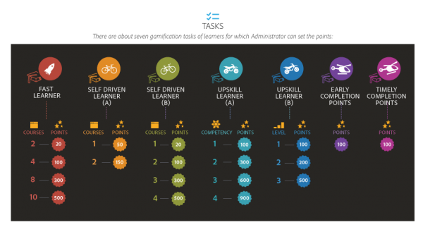
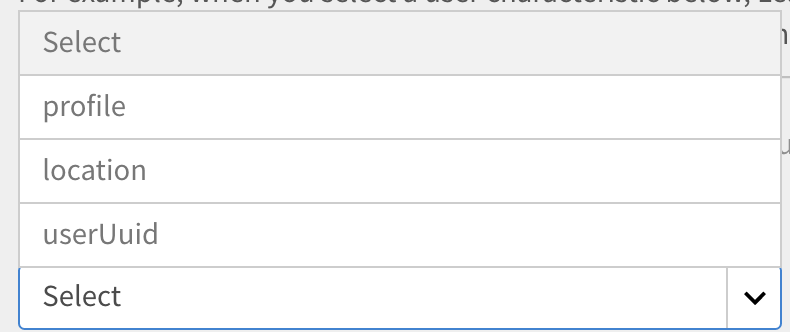

# 게임화

게임화는 게임이 아닌 컨텍스트에 게임적 사고 방식과 구조를 활용하여 학습하면서 점수를 획득하는 방식으로 사용자의 참여를 유도하는 방법입니다.

## 개요 {#overview}

Adobe Learning Manager에는 학습자의 참여를 유도하고 대화형 게임 요소를 통해 학습을 촉진할 수 있도록 설계된 게임화라는 기능이 포함되어 있습니다. 보상을 통해 원하는 학습자 행동을 장려하고 학습자가 점수를 획득하고 동료와 경쟁할 수 있도록 한다. 이 기능은 학습 플랫폼 내에서 사용자의 참여도와 동기를 향상시킵니다.

기본적으로 사용자가 패턴을 이해할 수 있도록 하기 위해 일부 게임화 포인트와 데이터를 사용할 수 있습니다. 그에 따라 점수를 수정할 수 있습니다.

<!--A sample illustration is provided below that shows all the tasks and points.

-->

## 게임화 설정 {#gamificationsettings}

설정에 액세스하려면 아래 단계를 따르십시오.

1. 책임자로 로그인한 다음 왼쪽 창에서 **[!UICONTROL 게임화]**&#x200B;를 클릭합니다.
1. 새로운 Learning Manager 계정을 생성하면 기본적으로 게임화는 비활성화됩니다. 활성화하려면 페이지 오른쪽 위 모서리에 있는 **[!UICONTROL 활성화]**&#x200B;를 클릭합니다.

## 설정 포인트 {#setuppoints}

관리자는 다음 단계를 따라서 학습자에 대한 게임화 점수를 설정할 수 있습니다.

1. 관리자로 로그인한 후 **[!UICONTROL 게임화]**&#x200B;를 클릭하십시오.\
   브론즈, 실버, 골드, 플래티넘 레벨 목록과 각 레벨을 달성하는 데 필요한 점수가 담긴 페이지가 나타납니다. 작업 목록과 그에 해당하는 점수가 나타납니다.
1. 각 작업 옆에 있는 &#39;편집&#39; 아이콘을 클릭하여 점수를 설정할 수 있습니다.
1. 월/분기/일년에 특정 수의 강의를 완료하는 등 과제 발생 빈도를 수정합니다.
1. **[!UICONTROL 저장]**&#x200B;을 클릭합니다.

*포인트 설정*

## 과제 {#tasks}

책임자가 점수를 설정할 수 있는 학습자의 게임화 과제는 다섯 가지입니다. 다음은 모든 학습자의 과제와 점수를 설명하는 그림입니다.

>[!NOTE]
>
>특정 과제의 학습자를 위한 게임화 점수는 누적되지 않는다. 그러나 학습자가 다른 과제에 대해 점수를 얻으면 점수는 학습자 계정에 누적 추가됩니다.

강의에 점수를 할당할 때, 책임자는 학습자가 점수를 점진적으로 획득할 수 있도록 해야 합니다.

**습득이 빠른 학습자용**

이 과제는 학습자가 월/분기/연 내에 특정 개수의 강의를 완료했을 때 적용할 수 있습니다. 습득이 빠른 학습자를 격려하기 위한 과제입니다.

가능한 시나리오는 다음과 같습니다.

1. 월/분기/연 내에 2개의 강의를 완료한 학습자는 20점을 획득합니다.
1. 월/분기/연 내에 4개의 강의를 완료한 학습자는 100점을 획득합니다.
1. 8개의 강의를 완료한 학습자는 300점을 획득합니다.
1. 10개의 강의를 완료한 학습자는 500점을 획득합니다.

>[!NOTE]
>
>책임자는 해당 점수를 획득하기 위해 완료해야 하는 강의 수와 기간을 수정할 수 있습니다.

과제 내에서 점수는 학습자에게 누적 부여되지 않습니다. 예를 들어 학습자가 2개의 강의를 완료하여 20점을 얻었다고 가정해 보겠습니다. 학습자가 4개의 강의를 완료했을 때, 학습자는 100점을 획득합니다. 기존의 20점은 고려하지 않습니다.

**자기 주도 학습자용(a)**

이 과제는 학습자가 지정된 수의 강의에 등록하고 월/분기/년 이내에 완료할 때 적용됩니다. 이 경우 책임자는 이 작업을 활성화하여 점수를 할당하고 권장할 수 있습니다.

가능한 시나리오:

1. 월/분기/연 내에 1개의 강의에 등록한 학습자는 50점을 획득합니다.
1. 학습자가 월/분기/년 이내에 두 개의 강의에 등록하면 150점을 받습니다.

>[!NOTE]
>
>책임자는 강의의 수와 기간을 수정할 수 있습니다.

**자기 주도 학습자용(b)**

이 과제는 학습자가 월/분기/연 내에 완료해야 하는 수의 강의보다 많은 수의 강의에 등록하여 완료했을 때 적용할 수 있습니다. 이러한 경우 책임자는 이 과제에 점수를 할당하여 학습자를 독려할 수 있습니다.

할당된 강의에 추가적으로 등록하는 학습자에게 가능한 시나리오:

1. 월/분기/연 내에 1개의 강의에 등록한 학습자는 20점을 획득합니다.
1. 학습자가 월/분기/년 이내에 두 개의 강의에 등록하면 100점을 받습니다.
1. 월/분기/연 내에 3개의 강의에 등록한 학습자는 300점을 획득합니다.
1. 월/분기/연 내에 4개의 강의에 등록한 학습자는 500점을 획득합니다.

>[!NOTE]
>
>책임자는 강의의 수와 기간을 수정할 수 있습니다. 예를 들어 세 번째 경우에서 강의의 수를 3개에서 5개로, 점수를 80점으로 수정할 수 있습니다.

**스킬 향상용(a)**

이 과제는 학습자가 특정 개수의 역량을 완료했을 때 적용할 수 있습니다. 관리자는 이 과제를 선택하여 학습자가 최대한 많은 역량을 획득하도록 독려할 수 있습니다.

역량 향상을 위한 가능한 시나리오:

1. 학습자가 하나의 역량을 달성하면 100점을 획득합니다.
1. 학습자가 두 가지 역량을 달성하면 300점을 획득합니다.
1. 학습자가 세 가지 역량을 달성하면 600점을 획득합니다.
1. 학습자가 4개의 역량을 달성하면 900점을 획득합니다.

>[!NOTE]
>
>이 과제에는 기한을 적용할 수 없습니다. 관리자는 각 시나리오에 대한 강의 수를 수정할 수 있습니다.

**스킬 향상용(b)**

이 과제는 학습자가 더 높은 수준의 역량을 완료했을 때 적용할 수 있습니다.

특정 역량 내 스킬 향상용에서 가능한 시나리오:

1. 학습자가 한 레벨을 달성하면 100점을 받게 됩니다.
1. 학습자가 두 가지 레벨을 달성하면 200점을 받게 됩니다.
1. 학습자가 세 가지 레벨을 달성하면 500점을 받게 됩니다.

>[!NOTE]
>
>이 과제에는 기한을 적용할 수 없습니다. 학습자가 더 높은 레벨을 달성하고 나서 더 낮은 수준의 역량을 달성하면 높은 레벨에서만 점수를 획득합니다.

**참조**

이 과제는 완료 후 N일 이내에 완료된 강의를 다시 참조하는 학습자에게 적용됩니다.

가능한 시나리오:
학습자가 이수 후 30일 이내에 이수한 강의를 참고하면 50점을 받는다.

**조기 완료 점수**

이 과제는 학습자가 강의를 완료하기 위해 N일 이내에 책갈피 표시된 강의를 다시 참조할 때 적용됩니다.

가능한 시나리오:\
강의를 가장 먼저 완료한 10명 안에 든 학습자는 100점을 받습니다.

**적시 완료 점수**

이 과제는 학습자가 강의에 등록 후 정해진 기간 내에 강의를 완료했을 때 적용할 수 있습니다.

가능한 시나리오:\
강의 개시 후 10일 이내에 강의를 완료한 학습자는 100점을 획득합니다.

**종합 학습자**

이 과제는 월간 사전 작업, 리소스 및 작업 지원과 같은 선택 학습 자료를 사용하는 학습자에게 적용됩니다.

가능한 시나리오:

1. 학습자가 한 달에 하나의 학습을 완료하면 20점을 받습니다.
1. 학습자가 한 달에 두 개의 학습을 완료하면 40점을 받습니다.
1. 학습자가 월 3회 학습을 완료하면 80점을 받습니다.

**일관된 학습**

이 과제는 주, 월 또는 분기의 특정 일수 동안 학습 활동을 하는 학습자에게 적용됩니다. 활동에는 학습 콘텐츠 사용, 리소스 다운로드 및 작업 지원이 포함됩니다.

가능한 시나리오:

1. 학습자가 매주 1일 학습 활동을 하면 20점을 받는다.
1. 학습자가 매주 2일 동안 학습활동을 하면 40점을 받는다.
1. 학습자가 매주 1일 학습 활동을 하면 80점을 받는다.

**피드백**

이는 강의에 피드백을 제공하는 학습자에게 적용됩니다.

가능한 시나리오:

1. 시작 평가 피드백의 경우 20점을 받습니다.
1. 반응 피드백의 경우 20점을 받습니다.
1. 관리자 피드백의 경우 20점을 획득합니다.

## 관리자 작업 {#administratoractions}

책임자는 기밀 사용자 목록을 만들고, 게임화 점수를 재설정하고, 학습자용 게임화 기능을 비활성화/활성화할 수 있습니다. 게임화 페이지에서 **[!UICONTROL 설정]**&#x200B;을 선택하여 아래 스냅샷과 같이 작업을 봅니다.

*관리자용 게임화 옵션*

## 기밀 설정 {#confidentialitysettings}

필요한 경우 일부 상위 관리 사용자를 기밀 사용자로 만들 수 있습니다. 기밀 사용자의 게임화 활동은 리더보드의 다른 학습자에게는 보이지 않습니다.

기밀 설정은 내부 및 외부 사용자 모두에 적용할 수 있습니다.

1. **[!UICONTROL 게임화]** > **[!UICONTROL 설정]** > **[!UICONTROL 기밀 설정]**&#x200B;을 클릭합니다.

*기밀 정보 설정 보기*

1. 정렬된 사용자에서 사용자 이름에 대한 확인란을 클릭하고 &#39;숨기기&#39;를 클릭하여 사용자를 기밀 사용자로 만듭니다.

   >[!NOTE]
   >
   >사용자 이름에 대한 확인란 체크 표시를 사용하여 정렬된 사용자에서 기밀 사용자를 식별할 수 있습니다.

1. 기밀 사용자 탭을 클릭하여 기밀 사용자 목록을 봅니다. 기본적으로는 볼 수 없습니다. 드롭다운 화살표 아이콘을 클릭하여 목록을 봅니다.
1. 기밀 사용자 목록에서 사용자 이름에 대한 확인란을 클릭하고 &#39;추가&#39;를 클릭하여 기밀 목록에서 사용자를 제거합니다.

## 게임화 재설정 {#resetgamification}

학습자가 획득한 게임화 포인트와 구성 설정을 재설정할 수도 있습니다. 사용자 점수를 재설정하면 사용자가 획득한 모든 포인트가 사라지고 0으로 재설정됩니다. 사용자 점수 및 구성 설정을 재설정하면 레벨 및 과제에 할당된 모든 기본 점수가 0으로 재설정됩니다.

게임화 재설정 설정은 내부 및 외부 사용자에게 모두 적용할 수 있습니다.

학습자 점수 및 구성을 재설정하려면 &#39;게임화 재설정&#39;을 클릭하고 요구 사항에 따라 옵션을 선택합니다. 학습자 점수 재설정은 학습자 점수 재설정과 구성 설정 중에서만 선택할 수 있습니다. 선택한 후 &#39;확인&#39;을 클릭합니다.

*게임화 지점 재설정*

## 게임화 비활성화 {#disablegamification}

[!UICONTROL **게임화**] > **[!UICONTROL 설정]** > [!UICONTROL **게임화 기능**]&#x200B;을 클릭합니다. 이를 통해 학습자용 게임화 기능과 리더보드를 별도로 활성화할 수 있습니다. 필요에 따라 내부 학습자용 활성화와 외부 학습자용 활성화 중에서 선택하고 &#39;확인&#39;을 클릭합니다. 모든 포인트는 다시 게임화 기능을 활성화하면 유지됩니다.

*게임화 사용 안 함*

내부 및 외부 사용자 모두가 게임화 기능을 사용하지 않도록 설정할 수 있습니다.

## 그룹 레벨 게임화 {#grouplevelgamification}

관리자는 범위 설정을 변경하여 게임화 범위를 정할 수 있습니다. 유사한 프로필 사용자, 그룹 또는 위치 사이에서 선택하여 게임화 기능을 활성화할 수 있습니다.

1. 관리자 로그인에서 왼쪽 창의 **[!UICONTROL 게임화]**&#x200B;를 클릭합니다.
1. **[!UICONTROL 게임화]** > **[!UICONTROL 설정]** > **[!UICONTROL 범위 설정]**&#x200B;을 엽니다. [!UICONTROL 게임화 범위 설정] 대화 상자가 나타납니다.

   

   *게임화 범위 설정 대화 상자 보기*

1. **[!UICONTROL 범위 설정 사용]** 옵션을 클릭합니다.

1. 드롭다운 목록에서 사용자 특성을 선택합니다.

   <!---->

1. 선택한 사용자 특성에 해당하는 값을 선택합니다. 예를 들어 프로필로 사용자 특성을 선택하려면 드롭다운 목록에서 값을 선택해야 합니다. 참조할 수 있도록 샘플 프로필 값을 아래 스크린샷에서 볼 수 있습니다.

   <!---->

1. **[!UICONTROL 저장].**&#x200B;을 클릭합니다.
