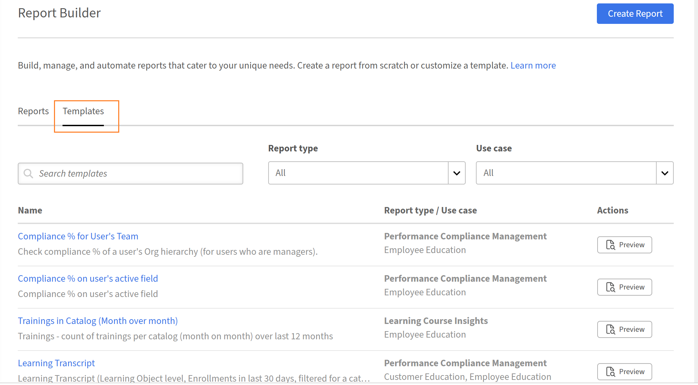
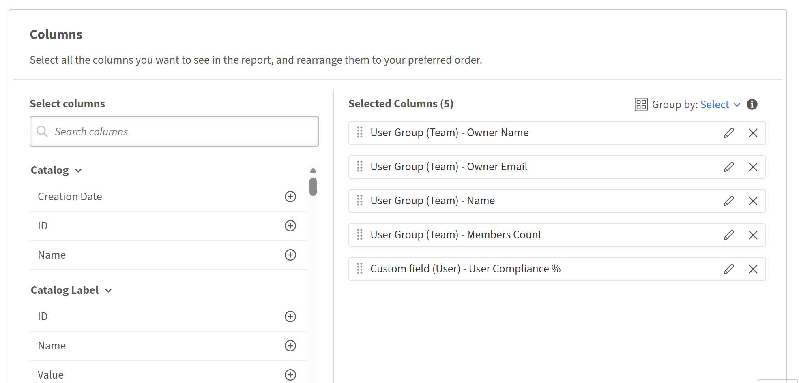
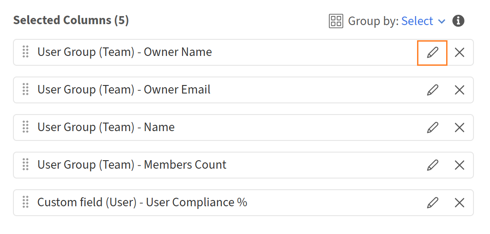
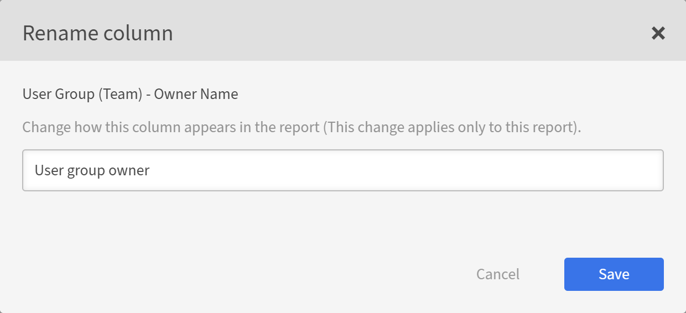
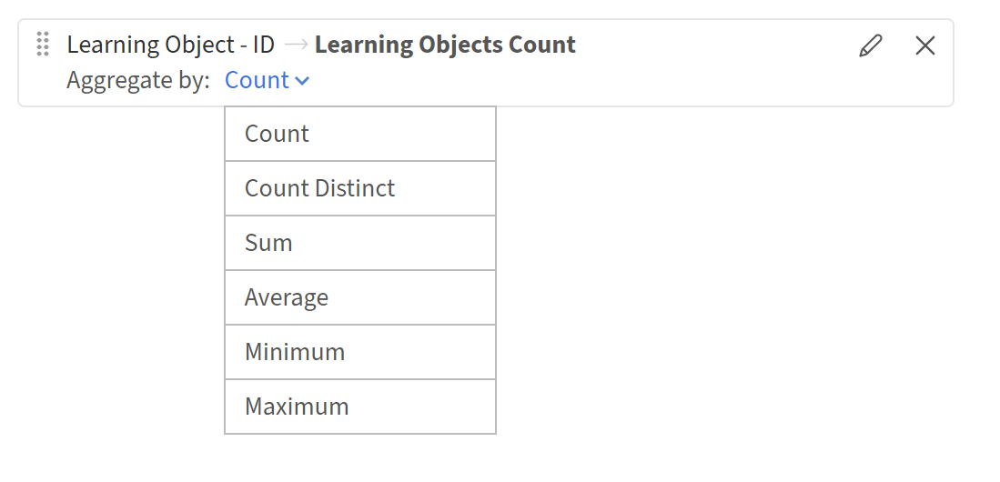
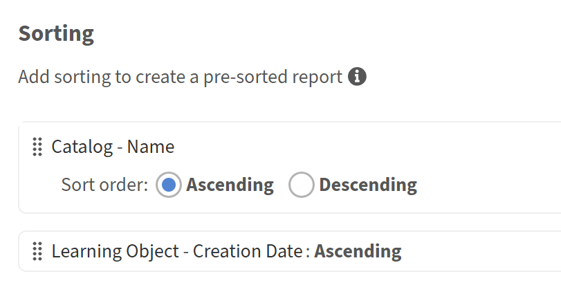

# Report Builder 시작하기

## 개요

Report Builder은 가장 일반적인 학습 데이터 보고 사용 사례를 위해 설계된 15개의 사전 설치된 템플릿을 포함합니다. 각 템플릿은 열, 필터, 그룹화 기준 설정 및 정렬이 이미 적용된 바로 사용 가능한 보고서 구성입니다. 템플릿은 읽기 전용입니다. 미리 보거나 복제하여 편집 가능한 사본을 만들 수 있습니다.

## 템플릿 정보

템플릿은 Adobe Learning Manager에서 제공하는 바로 사용할 수 있는 보고서 구성입니다. 각 템플릿은 등록 및 완료 추적, 규정 준수 보고 또는 강사 성과와 같은 특정 사용 사례용으로 설계되었습니다. 템플릿은 Report Builder의 **템플릿** 탭에 나타납니다. 각 템플릿은 하나 이상의 데이터 집합에서 만들어지며 특정 유형의 출력을 생성합니다. 템플릿을 사용자 정의하려면 **복제**&#x200B;를 선택하여 원본을 변경하지 않고 **보고서** 탭에서 편집 가능한 복사본을 만듭니다.

## 템플릿 카탈로그

### 사용자 학습 성적 증명서

**범주:** 성적 증명서, 완료 및 진행률 추적

**설명:** 모든 학습 개체 유형에 대한 모든 등록, 상태, 점수, 기한 및 소요 시간을 표시하여 각 학습자의 학습 기록을 완성합니다.

**사용 시기:** 준수 감사, 학습자 지원 사례 또는 ALM 데이터를 외부 시스템에 통합하기 위해 학습자 활동을 완전히 감사할 수 있도록 내보내야 하는 경우.

**해당 대상 그룹:** 고객 교육, 파트너 교육, 직원 교육, 영업 지원

**사용된 데이터 집합:** 사용자, 학습 개체, 대본(학습 개체)

**키 열:** 사용자 ID, 사용자 이름, 사용자 전자 메일, 관리자 이름, 사용자 상태, 학습 개체 이름, 학습 개체 유형, 등록 날짜, 완료 날짜, 상태, 진행 퍼센트, 사용자 최고 점수, 완료 마감 날짜, 지연, 소요 시간(분)

**적용된 필터:** 등록 날짜가 지난 해에 포함되었습니다. 카탈로그 = 기본 카탈로그

### 학습자 진행률 요약

**범주:** 성적 증명서, 완료 및 진행률 추적

**설명:** 부모 LO ID를 통한 계층 매핑을 포함하여 할당된 학습 경로 및 강의에 대해 각 학습자의 진행률을 추적합니다.

**다음 경우에 사용:** 진행 중인 학습자, 기한이 지난 학습자 및 기한을 놓칠 위험이 있는 학습자(*)가 학습 경로 내에 있는 위치를 확인하고 싶습니다.

**해당 대상 그룹:** 고객 교육, 파트너 교육, 직원 교육, 영업 지원

**사용된 데이터 집합:** 사용자, 학습 개체, 대본(학습 개체)

**키 열:** 사용자 ID, 사용자 이름, 사용자 전자 메일, 관리자 이름, 학습 개체 ID, 학습 개체 이름, 학습 개체 유형, 상위 학습 개체 ID, 등록 날짜, 완료 기한, 상태, 진행 퍼센트, 지연, 시작 날짜, 완료 날짜

**적용된 필터:** 등록 날짜가 작년 이내일 때; 학습 개체 유형 = 학습 경로 또는 과정; 카탈로그 = 기본 카탈로그

### 활성 학습자 대시보드

**범주:** 학습자 참여 및 플랫폼 사용

**설명:** 학습자당 플랫폼 참여에 대한 월별 요약으로, 액세스한 강의, 완료 및 총 소요 시간을 표시합니다.

**사용 시기:** 지난 1년 동안 가장 많이, 가장 적게 참여했던 학습자를 확인하고 매달 참여 추세를 확인합니다.

**해당 대상 그룹:** 고객 교육, 파트너 교육, 직원 교육, 영업 지원

**사용된 데이터 집합:** 사용자, 대본(학습 개체)

**키 열:** 사용자 ID, 사용자 이름, 사용자 전자 메일, 관리자 이름, 사용자 상태, 마지막 액세스 날짜(월), 액세스한 고유 과정, 등록 완료, 총 소요 시간(분)

**적용된 필터:** 사용자의 작년 마지막 액세스 날짜; 사용자 상태 = 활성; 카탈로그 = 기본 카탈로그

**그룹화 기준:** 사용자 필드 + 마지막 액세스 날짜의 월

**집계:** 학습 개체 ID에서 고유 개수(액세스된 고유 과정), 상태 = 완료(등록 완료), 총 소요 시간(총 소요 시간)

### 비활성 학습자 보고서

**범주:** 학습자 참여 및 플랫폼 사용

**설명:** 지난 1년 동안 플랫폼 액세스 권한이 없는 활성 사용자를 식별하고 마지막 등록 및 완료 날짜를 표시합니다.

**다음 경우에 사용:** 재참여 캠페인, 라이선스 검토 또는 계정 정리를 위해 휴면 계정을 찾아야 합니다.

**해당 대상 그룹:** 고객 교육, 파트너 교육, 직원 교육, 영업 지원

**사용된 데이터 집합:** 사용자, 대본(학습 개체)

**키 열:** 사용자 ID, 사용자 이름, 사용자 전자 메일, 관리자 이름, 사용자 생성 날짜, 사용자 마지막 액세스 날짜, 마지막 등록 날짜, 마지막 완료 날짜

**적용된 필터:** 사용자의 마지막 액세스 날짜가 지난 해에 없습니다. 사용자 상태 = 활성; 카탈로그 = 기본 카탈로그

**그룹화 기준:** 사용자 ID, 사용자 이름, 사용자 전자 메일, 관리자 이름, 사용자 생성 날짜, 사용자 마지막 액세스 날짜

**집계:** 등록 날짜(마지막 등록 날짜)의 최대, 완료 날짜(마지막 완료 날짜)의 최대

### 새로운 학습자 채택

**범주:** 학습자 참여 및 플랫폼 사용

**설명:** 첫 번째 등록, 완료 및 액세스한 총 강의 등 지난 해에 생성된 사용자의 온보딩 참여를 추적합니다.

**다음의 경우 사용:** 새 사용자가 계정 생성에서 첫 번째 등록 및 완료로 이동하는 속도(주요 온보딩 상태 지표)를 측정하려고 합니다.

**해당 대상 그룹:** 고객 교육, 파트너 교육, 직원 교육, 영업 지원

**사용된 데이터 집합:** 사용자, 대본(학습 개체)

**키 열:** 사용자 ID, 사용자 이름, 사용자 전자 메일, 관리자 이름, 사용자 생성 날짜, 사용자 마지막 액세스 날짜, 첫 번째 등록 날짜, 첫 번째 완료 날짜, 액세스된 총 강의, 완료된 강의

**적용된 필터:** 작년 내의 사용자 생성 날짜; 사용자 상태 = 활성; 카탈로그 = 기본 카탈로그

>[!NOTE]
>
>이 템플릿은 사용자 데이터 집합과 대본 데이터 집합 간에 왼쪽 조인을 사용하여 등록이 0인 사용자가 계속 보고서에 표시되도록 합니다. 이를 통해 아직 학습 여정이 시작되지 않은 신규 사용자를 식별할 수 있습니다.

**그룹화 기준:** 사용자 ID, 사용자 이름, 사용자 전자 메일, 관리자 이름, 사용자 생성 날짜, 사용자 마지막 액세스 날짜

**집계:**&#x200B;분(등록 날짜(첫 번째 등록 날짜), 최소(완료 날짜), 개수(학습 개체 ID)(액세스된 총 과정), 개수(상태 = 완료)(완료 과정)

### 사용자 그룹별 학습

**범주:** 사용자, 그룹 및 조직 구조

**설명:** 조직 구성 간(활성 학습자, 액세스한 강의, 완료 및 그룹당 소요 시간)의 학습 활동을 비교합니다.

**다음 경우에 사용:** 부서, 직무 또는 활성 필드 기반 사용자 그룹 전체에서 참여를 벤치마킹하려는 경우.

**해당 대상 그룹:** 고객 교육, 파트너 교육, 직원 교육, 영업 지원

**사용된 데이터 집합:** 사용자 그룹(활성 필드), 대본(학습 개체)

**키 열:** 사용자 그룹 ID, 사용자 그룹 이름, 멤버 수, 활성 학습자, 액세스한 고유 강의 합계, 등록 완료, 총 소요 시간(분)

**적용된 필터:** 등록 날짜가 지난 해에 포함되었습니다. 카탈로그 = 기본 카탈로그; 사용자 그룹(활성 필드) 이름 = 프로필(활성 필드)

**그룹화 기준:** 사용자 그룹 ID, 사용자 그룹 이름, 구성원 수

**집계:** 사용자 ID에서 고유 개수(활성 학습자), 학습 개체 ID에서 고유 개수(액세스된 고유 강의 합계), 상태 = 완료(등록 완료), 소요 시간 합계(총 소요 시간)

### 위치별 학습

**범주:** 사용자, 그룹 및 조직 구조

**설명:** 학습 활동을 지리적 위치(활성 학습자, 액세스한 강의, 완료 및 위치별 소요 시간)에 걸쳐 비교합니다.

**다음의 경우 사용:** 수동 데이터 분할 없이 모든 지역에서 학습 상태를 벤치마킹해야 합니다. 지리적으로 분산된 학습자가 있는 글로벌 조직에 유용합니다.

**해당 대상 그룹:** 고객 교육, 파트너 교육, 직원 교육, 영업 지원

**사용된 데이터 집합:** 사용자 그룹(활성 필드), 대본(학습 개체)

**키 열:** 사용자 그룹 ID, 사용자 그룹 이름, 멤버 수, 활성 학습자, 액세스한 고유 강의 합계, 등록 완료, 총 소요 시간(분)

**적용된 필터:** 등록 날짜가 지난 해에 포함되었습니다. 카탈로그 = 기본 카탈로그, 사용자 그룹(활성 필드) 이름에 &quot;Location&quot;이 포함되었습니다.

**그룹화 기준:** 사용자 그룹 ID, 사용자 그룹 이름, 구성원 수

**집계:** 사용자 ID에서 고유 개수(활성 학습자), 학습 개체 ID에서 고유 개수(액세스된 고유 강의 합계), 상태 = 완료(등록 완료), 소요 시간 합계(총 소요 시간)

### Manager로 학습

**범주:** 사용자, 그룹 및 조직 구조

**설명:** 각 관리자의 전체 팀 계층 구조(활성 학습자, 완료 시간 및 소요 시간)의 학습 성과를 요약합니다.

**다음 경우에 사용:** 관리자 간의 팀 참여를 비교하고 완료율이 낮거나 팀 크기에 비해 시간이 걸리는 팀을 식별하려고 합니다.

**해당 대상 그룹:** 직원 교육, 영업 지원.

**사용된 데이터 집합:** 사용자 그룹(팀), 성적 증명서(학습 개체)

**주요 열:** 관리자 ID, 관리자 이름, 관리자 전자 메일, 구성원 수(전체 팀), 활성 학습자, 액세스한 고유 강의 합계, 등록 완료, 총 소요 시간(분)

**적용된 필터:** 등록 날짜가 지난 해에 포함되었습니다. 카탈로그 = 기본 카탈로그

**그룹화 기준:** 소유자 ID(관리자 ID), 소유자 이름, 소유자 전자 메일, 구성원 수

**집계:** 사용자 ID에서 고유 개수(활성 학습자), 학습 개체 ID에서 고유 개수(액세스된 고유 강의 합계), 상태 = 완료(등록 완료), 소요 시간 합계(총 소요 시간)

>[!NOTE]
>
>이 템플릿은 각 관리자 아래의 전체 팀 계층 구조를 캡처하는 사용자 그룹(팀) 데이터 세트를 사용합니다. 추가 사용자 그룹 필터는 필요하지 않습니다.

### 등록 요약

**범주:** 성적 증명서, 완료 및 진행률 추적

**설명:** 강의 레벨 등록 수는 각 학습 개체에 대한 상태(완료됨, 진행 중 및 시작되지 않음)별로 구분됩니다.

**사용 시기:** 각 강의의 등록 단계(시작한 학습자 수, 진행 중인 학습자 수, 완료한 학습자 수)를 빠르게 볼 수 있습니다.

**해당 대상 그룹:** 고객 교육, 파트너 교육, 직원 교육, 영업 지원

**사용된 데이터 집합:** 학습 개체, 대본(학습 개체)

**키 열:** 학습 개체 ID, 학습 개체 이름, 학습 개체 유형, 학습 개체 상태, 총 등록된 학습자, 완료된 등록, 진행 중 등록, 시작되지 않음

**적용된 필터:** 등록 날짜가 지난 해에 포함되었습니다. 카탈로그 = 기본 카탈로그

**그룹화 기준:** 학습 개체 ID, 이름, 유형, 상태

**집계:** 사용자 ID에서 고유한 항목 수(등록된 총 학습자), 상태가 완료인 경우 수, 상태가 진행 중인 경우 수, 상태가 시작되지 않은 경우 수

### 등록 추세 분석

**범주:** 성적 증명서, 완료 및 진행률 추적

**설명:** 월간 등록 및 학습 개체당 완료 횟수를 보여 주며, 시간이 지남에 따라 학습자 섭취가 어떻게 진전되는지 보여 줍니다.

**사용 시기:** 각 강의에 대한 등록이 급증하고 페이드되는 시기와 완료가 같은 달에 등록을 따르는지 여부를 확인하고 싶습니다.

**해당 대상 그룹:** 고객 교육, 파트너 교육, 직원 교육, 영업 지원

**사용된 데이터 집합:** 학습 개체, 대본(학습 개체)

**키 열:** 학습 개체 이름, 학습 개체 유형, 등록 날짜(월), 등록된 총 학습자, 등록 완료

**적용된 필터:** 등록 날짜가 지난 해에 포함되었습니다. 카탈로그 = 기본 카탈로그

**그룹화 기준:** 학습 개체 이름, 학습 개체 유형, 등록 날짜 월

**집계:** 사용자 ID에서 고유한 항목 수(등록된 총 학습자), 완료 여부 수(상태 = 완료)(등록 완료)

### 강의 완료 보고서

**범주:** 성적 증명서, 완료 및 진행률 추적

**설명:** 상태 수, 마지막 완료 날짜, 평균 진행률 및 평균 소요 시간이 포함된 과정별 완료 분석.

**다음 경우에 사용:** 등록률이 높지만 완료율이 낮은 과정 또는 평균 진행률이 낮은 과정(조기 중지를 나타냄)과 같이 성과가 낮은 콘텐츠를 식별하려고 합니다.

**해당 대상 그룹:** 고객 교육, 파트너 교육, 직원 교육, 영업 지원

**사용된 데이터 집합:** 학습 개체, 대본(학습 개체)

**키 열:** 학습 개체 ID, 학습 개체 이름, 학습 개체 유형, 학습 개체 상태, 총 등록된 학습자, 완료된 등록, 진행 중 등록, 시작되지 않음 등록, 마지막 완료 날짜, 평균 진행 %, 평균 소요 시간(분)

**적용된 필터:** 등록 날짜가 지난 해에 포함되었습니다. 카탈로그 = 기본 카탈로그

**그룹화 기준:** 학습 개체 ID, 이름, 유형, 상태

**집계:** 사용자 ID에서 고유 개수, 상태가 완료됨/진행 중/시작되지 않음인 경우 개수, 완료 날짜의 최대, 진행 백분율의 평균, 소요 시간의 평균

### 완료 추세 대시보드

**범주:** 성적 증명서, 완료 및 진행률 추적

**설명:** 학습 개체당 월간 완료 수(평균 소요 시간 및 진행률 포함)로, 완료된 등록에만 범위가 지정됩니다.

**다음 경우에 사용:** 완료율이 월별로 증가하고 있는지 여부와 완료한 학습자가 제대로 학습하고 있는지 또는 빠르게 학습하고 있는지 여부를 추적하려고 합니다.

**해당 대상 그룹:** 고객 교육, 파트너 교육, 직원 교육, 영업 지원

**사용된 데이터 집합:** 학습 개체, 대본(학습 개체)

**키 열:** 학습 개체 이름, 학습 개체 유형, 완료 날짜(월), 총 학습자 수, 평균 소요 시간(분), 평균 진행률 %

**적용된 필터:** 작년 내의 완료 날짜; 상태 = 완료; 카탈로그 = 기본 카탈로그

**그룹화 기준:** 학습 개체 이름, 학습 개체 유형, 완료 월

**집계:** 사용자 ID에서 고유 개수(총 완료한 학습자), 평균 소요 시간, 평균 진행 백분율

>[!NOTE]
>
>이 템플릿은 그룹화하기 전에 완료 상태로 필터링하여 유효한 완료 날짜가 있는 레코드만 포함하고 null 날짜가 월간 추세를 왜곡하지 않도록 합니다.

### 완료 시간

**범주:** 성적 증명서, 완료 및 진행률 추적

**설명:** 각 과정을 완료하는 데 걸린 실제 시간, 평균, 최소값 및 최대값을 지정된 기간 대비 측정합니다.

**다음 경우에 사용:** 학습자가 완료할 수 있는 시간보다 훨씬 더 오래 또는 더 짧게 사용하는 강의를 식별하려고 합니다. 이는 콘텐츠 길이 또는 난이도 문제를 나타낼 수 있습니다.

**해당 대상 그룹:** 고객 교육, 파트너 교육, 직원 교육, 영업 지원

**사용된 데이터 집합:** 학습 개체, 대본(학습 개체)

**키 열:** 학습 개체 ID, 학습 개체 이름, 학습 개체 유형, 기간(분, 설계됨), 총 학습자 수, 평균 소요 시간(분), 최소 소요 시간(분), 최대 소요 시간(분)

**적용된 필터:** 작년 내의 완료 날짜; 상태 = 완료; 카탈로그 = 기본 카탈로그

**그룹화 기준:** 학습 개체 ID, 이름, 유형, 기간(분)

**집계:** 사용자 ID에 고유한 개수, 평균/최소/소요 시간 최대

**참고:** 기간(설계된 과정 길이)이 그룹화 기준에 포함되어 실제 소요 시간과 같은 행에 표시되므로 계산된 필드 없이 직접 비교할 수 있습니다. 최소 및 최대 소요 시간 간의 큰 차이는 일관되지 않은 학습자 경험을 시사합니다.

### 기한 경과 학습 할당

**범주:** 준수 및 인증

**설명:** 필수 등록이 지연된 활성 사용자를 나열하며 각 사용자에 대한 기한, 현재 상태 및 진행률을 표시합니다.

**사용 시기:** 관리자에게 에스컬레이션하거나 재등록 워크플로우를 트리거하려면 비준수 학습자의 실행 가능한 목록이 필요합니다.

**해당 대상:** 파트너 교육, 직원 교육, 영업 지원

**사용된 데이터 집합:** 사용자, 사용자 그룹(활성 필드), 학습 개체, 성적 증명서(학습 개체)

**키 열:** 사용자 ID, 사용자 이름, 사용자 전자 메일, 관리자 이름, 사용자 그룹(활성 필드) 이름, 학습 개체 ID, 학습 개체 이름, 학습 개체 유형, 등록 날짜, 완료 기한, 상태, 진행 퍼센트, 기한 지남

**적용된 필터:** 지연 = 예; 상태 = 진행 중 또는 시작되지 않음; 작년 내의 완료 마감 시한; 카탈로그 = 기본 카탈로그; 사용자 상태 = 활성; 사용자 그룹(활성 필드) 이름 = 프로필(활성 필드)

**적용된 그룹 없음** 출력은 지연된 등록당 하나의 행으로, 에스컬레이션에 대한 전체 학습자 및 강의 세부 정보를 보존합니다.

>[!NOTE]
>
>상태 필터(진행 중 또는 시작되지 않음)는 완료되었지만 기한으로 잘못 플래그가 지정된 레코드를 제외하기 위한 보호 조치로 사용됩니다.

### 필수 교육 상태

**범주:** 준수 및 인증

**설명:** 완료 마감 시한이 있는 모든 등록의 전체 준수 보기로, 모든 상태가 포함되며 기한이 지난 것은 아닙니다.

**다음의 경우 사용:** 예를 들어, 리더에게 전체 필수 교육 완료율을 보고하려면 위반이 아닌 완전한 준수 그림이 필요합니다.

**해당 대상 그룹:** 직원 교육, 영업 지원.

**사용된 데이터 집합:** 사용자, 사용자 그룹(활성 필드), 학습 개체, 성적 증명서(학습 개체)

**키 열:** 사용자 ID, 사용자 이름, 사용자 전자 메일, 관리자 이름, 사용자 그룹(활성 필드) 이름, 학습 개체 ID, 학습 개체 이름, 학습 개체 유형, 등록 날짜, 완료 기한, 완료 날짜, 상태, 진행 퍼센트, 기한 지남

**적용된 필터:** 완료 기한은 비어 있지 않습니다. 등록 날짜는 작년 이내입니다. 카탈로그 = 기본 카탈로그; 사용자 상태 = 활성; 사용자 그룹(활성 필드) 이름 = 프로필(활성 필드)

**적용된 그룹 없음** 모든 상태가 포함됨(완료됨, 진행 중, 시작되지 않음, 지연), 완전한 준수 상황을 제공합니다.

**참고:** &quot;완료 기한은 비어 있지 않습니다&quot;에 대한 필터링은 필수 상태가 구성된 방식에 관계없이 모든 과정 유형에서 필수 교육을 일관되게 식별하는 주요 논리입니다.

## Template quick-reference

| **#** | **템플릿 이름** | **범주** | **내부 edu** | **외부(고객/파트너) edu** |
|--------|------------------------------|-------------------------------------|------------------|-------------------------------------|
| 1 | 사용자 학습 성적 증명서 | 대본, 완료 및 진행률 | ✓ | ✓ |
| 2 | 학습자 진행률 요약 | 대본, 완료 및 진행률 | ✓ | ✓ |
| 3 | 활성 학습자 대시보드 | 학습자 참여 및 플랫폼 사용 | ✓ | ✓ |
| 4 | 비활성 학습자 보고서 | 학습자 참여 및 플랫폼 사용 | ✓ | ✓ |
| 5 | 새로운 학습자 채택 | 학습자 참여 및 플랫폼 사용 | ✓ | ✓ |
| 6 | 사용자 그룹별 학습 | 사용자, 그룹 및 조직 구조 | ✓ | ✓ |
| 7 | 위치별 학습 | 사용자, 그룹 및 조직 구조 | ✓ | ✓ |
| 8 | Manager로 학습 | 사용자, 그룹 및 조직 구조 | ✓ | ✗ |
| 9 | 등록 요약 | 대본, 완료 및 진행률 | ✓ | ✓ |
| 10 | 등록 추세 분석 | 대본, 완료 및 진행률 | ✓ | ✓ |
| 11 | 강의 완료 보고서 | 대본, 완료 및 진행률 | ✓ | ✓ |
| 12 | 완료 추세 대시보드 | 대본, 완료 및 진행률 | ✓ | ✓ |
| 13 | 완료 시간 | 대본, 완료 및 진행률 | ✓ | ✓ |
| 14 | 기한 경과 학습 할당 | 규정 준수 및 인증 | ✓ | ✓ |
| 15 | 필수 교육 상태 | 규정 준수 및 인증 | ✓ | ✗ |

## Report Builder 템플릿 사용

일반적인 보고 사용 사례에 맞게 사전 제작된 템플릿을 맞춤화하여 Adobe Learning Manager Report Builder에서 빠르게 시작할 수 있습니다.

1. 관리자 권한으로 Adobe Learning Manager에 로그인합니다.
2. 왼쪽 창에서 **보고서**&#x200B;를 선택한 다음 **Report Builder**&#x200B;를 선택합니다.

3. **템플릿** 탭을 선택합니다.
4. 사용 가능한 템플릿을 검색합니다. 각 템플릿의 이름은 사용 사례에 따라 지정됩니다.

   

5. 템플릿 이름을 선택하여 읽기 전용 미리 보기를 엽니다. 이 예제에서는 **사용자 팀**&#x200B;에 대한 준수 %를 선택합니다. 열, 적용된 필터 및 정렬 순서를 검토합니다.
6. **복제**&#x200B;를 선택합니다.

   

템플릿을 복제하면 Report Builder은 템플릿의 기존 구성이 미리 로드된 편집 가능한 사본을 엽니다. 보고서 이름, 설명, 열, 필터 및 정렬은 모두 저장하기 전에 편집할 수 있습니다.

## 보고서 이름 및 설명

1. **이름** 필드에서 기본 이름(예: *사용자 팀의 준수 % 사본*)을 고유한 보고서 이름으로 바꿉니다. 이름을 입력해야 합니다.
2. **설명** 필드에 보고서에 포함된 내용에 대한 간단한 요약을 입력합니다. 이는 다른 관리자가 보고서를 보거나 편집할 때 보고서의 목적을 이해하는 데 도움이 됩니다.

## 열 추가 및 구성

**열** 섹션에는 두 개의 패널이 있습니다. 왼쪽에는 **열 선택**&#x200B;이 있고 오른쪽에는 **선택한 열**&#x200B;이 있습니다.

### 열 추가

1. **열 선택** 패널에서 이름을 선택하여 데이터 집합을 확장합니다. 예를 들면 **카탈로그** 또는 **활성 필드 사용자 그룹**&#x200B;입니다.
2. 추가하려는 열 옆의 **+** 아이콘을 선택합니다. 열은 오른쪽의 **선택한 열** 패널에 나타납니다.

   

3. 동일한 열을 두 번 이상 추가합니다. 예를 들어 동일한 필드에 두 개의 서로 다른 집계를 적용할 수 있습니다. 해당 열에 대해 **+**&#x200B;을(를) 다시 선택합니다.

### 열 순서 바꾸기

**선택한 열** 패널에서 열 행의 왼쪽에 있는 핸들을 드래그하여 다른 위치로 이동합니다. 패널의 열 순서는 다운로드한 보고서의 열 순서와 일치합니다.

### 열 이름 바꾸기

1. 열 행에서 **편집**(연필) 아이콘을 선택합니다.

   

2. 별칭을 입력합니다. 별칭은 기본 필드 이름 대신 다운로드한 보고서의 열 머리글로 나타납니다.

   

### 열 제거

열 행에서 **x** 아이콘을 선택하여 보고서에서 제거합니다.

## 그룹 적용 기준

**Group by** 컨트롤은 **선택한 열** 패널 위쪽에 나타납니다.

1. **그룹화 기준: 선택**&#x200B;을 선택합니다.

   

2. 그룹화할 열을 선택합니다. 두 개 이상을 선택할 수 있습니다. 스크린샷에서는 보고서가 사용자 그룹(팀)-이름 및 사용자 그룹(팀)-소유자 이름별로 그룹화됩니다.
3. 선택한 각 그룹별 열은 **그룹별** 컨트롤 아래에 태그로 표시됩니다. 그룹화 기준 열을 제거하려면 태그에서 **x**&#x200B;을(를) 선택합니다.

>[!NOTE]
>
>group by를 적용하면 group-by 열이 아닌 모든 열에는 집계 함수가 적용되어야 합니다. 집계가 없는 열에는 오류가 발생합니다.

### 열에 집계 적용

1. **선택한 열** 패널의 그룹별 열이 아닌 열에서 **집계자**&#x200B;를 선택합니다.
2. 드롭다운에서 함수를 선택합니다. 스크린샷에서 **학습 개체 수**&#x200B;는 count_of_courses로 별칭이 지정된 **Count Distinct**&#x200B;을 사용합니다.

   

사용 가능한 집계 함수:

| **함수** | **반환되는 항목** |
|--------------------|---------------------------------------------|
| **카운트** | 그룹의 총 행 수 |
| **고유 개수** | 그룹의 고유 값 수 |
| **Count If** | 지정한 값과 일치하는 행 수 |
| **합계** | 그룹 전체의 총 숫자 필드 |
| **분** | 그룹의 가장 낮은 값 |
| **최대** | 그룹의 가장 큰 값 |
| **평균** | 그룹 전체의 평균 값 |

## 필터 적용

**필터** 섹션은 **열** 섹션 아래에 있습니다. 필터는 보고서에 표시할 행을 제한합니다.

1. 필터를 추가하려면 [필터] 섹션의 오른쪽에 있는 **+** 아이콘을 선택합니다.
2. 필터링할 필드를 선택합니다.

   

3. 연산자를 선택하고 값을 입력하거나 선택합니다.

기존 필터를 편집하려면 필터 행에서 **연필** 아이콘을 선택합니다. 중첩된 필터 그룹을 추가하려면 필터 행의 오른쪽에 대괄호가 있는 **+** 아이콘을 선택합니다.

## **정렬 구성**

**정렬** 섹션이 **필터** 섹션 아래에 있습니다.

1. **+ 정렬 추가**&#x200B;를 선택하여 정렬을 추가합니다.
2. 정렬할 열을 선택하고 **오름차순** 또는 **내림차순**&#x200B;을 선택합니다.

   

3. 2차 정렬을 추가하려면 이 단계를 반복합니다. 각 정렬 행의 왼쪽에 있는 핸들을 드래그하여 우선 순위를 변경합니다.

>[!TIP]
>
>항상 한 가지 이상의 정렬을 적용합니다. 정렬하지 않으면 동일한 보고서의 다운로드 간에 행 순서가 다를 수 있습니다.

## 보고서 저장

오른쪽 상단에서 **보고서 저장**&#x200B;을 선택합니다. 보고서가 **보고서** 탭에 저장되었으며 다운로드할 준비가 되었습니다.

## 모범 사례

* 다운로드한 보고서에 학습 개체 - 학습 개체 ID와 같은 필드 이름 대신 의미 있는 머리글이 포함되도록 모든 열에 별칭을 사용합니다.
* 총 행이 아닌 카탈로그별로 고유한 강의를 원하는 경우 **Count** 대신 **Count Distinct**&#x200B;을(를) 사용하십시오.

* 저장하기 전에 정렬을 적용합니다. 특히 공유하거나 구독할 보고서의 경우 더욱 그렇습니다.
* 설명을 최신 상태로 유지합니다. 다른 관리자는 보고서를 열지 않고도 보고서의 범위를 이해하기 위해 보고서에 의존합니다.
