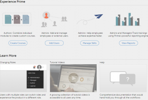

# 책임자로 시작하기

응용 프로그램의 주요 기능을 시작 페이지에서 알아볼 수 있습니다.

책임자로 로그인한 다음에는 비디오 목록이 있는 팝업 창을 볼 수 있습니다.

## 샘플 비디오 보기 {#viewsamplevideos}

샘플 비디오 튜토리얼을 시청하면 책임자 역할의 주요 특징을 이해할 수 있습니다. 로그인 시 이 팝업 창이 나타나지 않도록 하려면 을 클릭하여 비활성화할 수 있습니다. **[!UICONTROL 로그인 시 표시 안 함]** 팝업 오른쪽 하단 모서리에 있는 option 키를 누릅니다.

다음을 수행합니다. **[!UICONTROL 창 닫기]** 아이콘을 클릭하여 팝업을 닫습니다.

<!---->

## 시작 페이지 {#gettingstartedpage}

시작 페이지에서 다음 작업을 수행할 수 있습니다.

* 강의 생성
* 사용자 추가
* 사용자 관리
* 보고서 보기

또한 튜토리얼 비디오 시청, 도움말 콘텐츠 보기 및 다양한 역할 배우기를 선택하여 Learning Manager 응용 프로그램을 자세히 알아볼 수 있습니다.

<!---->
