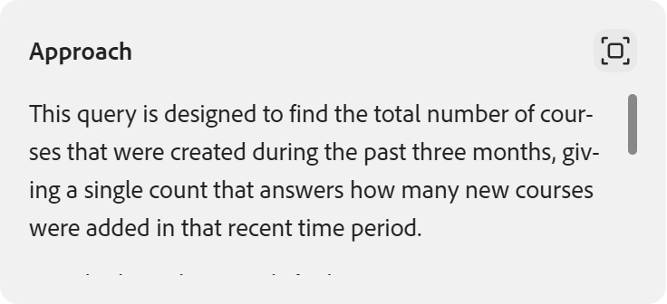
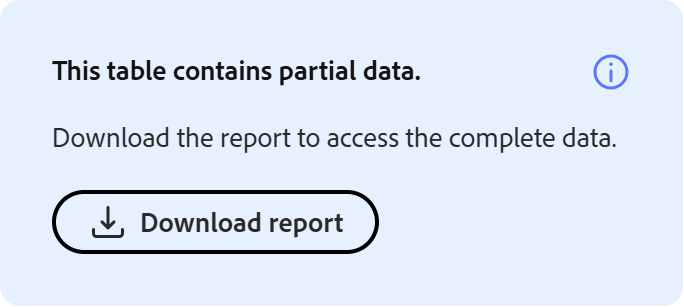

# Insights 에이전트란?

Insights 상담사는 관리자가 자연어를 사용하여 학습자 데이터를 쿼리할 수 있도록 해 주는 Adobe Learning Manager의 AI 기반 기능입니다. 보고서를 다운로드하고 스프레드시트를 조작하는 대신 &quot;계정에서 지난 3개월 동안 생성된 강의가 몇 개입니까?&quot;와 같은 질문을 입력합니다. Give me a month-on-month report.&quot;, and Insights Agent retrieve and present the data directly. 결과를 테이블로 보거나 CSV 파일로 다운로드할 수 있습니다.

Insights Agent는 데이터 질문과 답변 얻기 사이의 단계를 줄이도록 설계되었습니다. 현재 Excel 피벗, BI 팀 또는 여러 보고서의 조합에 의존하는 관리자는 Insights 에이전트를 사용하여 더 빠르게 답변을 얻을 수 있습니다.

## Insights 상담사가 수행할 수 있는 작업

Insights 에이전트를 사용하면 다음 작업을 수행할 수 있습니다.

- 지역, 부서 또는 사용자 그룹별 완료 및 준수 측정 단위 확인
- 학습 프로그램 간 등록 동향 분석
- 특정 강의 또는 학습 경로에 대한 진행률 데이터 보기
- 테이블 또는 다운로드 가능한 CSV 파일로 결과 검색
- 결과가 계산된 방식에 대한 간단한 언어 설명 얻기

## Data Insights 에이전트가 지원하지 않는 기능

다음 데이터 형식은 이 릴리스의 범위를 벗어납니다.

- 피드백 및 설문 조사 데이터
- 게임화 점수 및 배지
- 감사 기록 및 변경 로그

이러한 데이터 형식을 참조하는 쿼리는 결과를 반환하지 않습니다. 예를 들어, &quot;지난 분기에 수여된 게임화 점수는 몇 점입니까?&quot; 또는 &#39;어떤 학습자가 준수 배지를 획득했습니까?&#39;를 추가함 은(는) 오류 또는 불완전한 데이터를 반환합니다.

## Insights 상담사와 Report Builder의 차이점

두 기능 모두 동일한 기본 학습 데이터를 사용하지만 다르게 작동합니다. Insights 에이전트가 대화중입니다. 원하는 내용을 설명하면 상담사가 검색합니다. Report Builder이 구조화되었습니다. 데이터 집합, 열 및 필터를 선택하여 재사용 가능한 보고서를 작성합니다.

| **사용 사례** | **추천** |
|---|---|
| 간단한 데이터 질문 | 인사이트 에이전트 |
| 스키마를 몰라도 데이터 탐색 | 인사이트 에이전트 |
| 반복 가능한 구조화된 보고서 작성 | 보고서 작성기 |
| 여러 데이터 세트를 사용자 정의 조인과 결합 | 보고서 작성기 |
| 보고서 구독 예약 | 보고서 작성기 |
| 사용자 정의 조인 또는 고급 데이터 모델링과 데이터 세트 결합 | 보고서 작성기 |

**중요**: Insights 에이전트와 Report Builder 간의 통합은 향후 릴리스에서 계획되었으며 현재 베타에서는 사용할 수 없습니다.

## Insights 상담사의 작동 방식

질문을 입력하면 Insights 상담사는 다음 네 단계로 질문을 처리합니다.

1. **해석**: 에이전트가 필요한 데이터를 식별하기 위해 질문을 구문 분석합니다. 질문의 일부가 애매한 경우, 상담사는 계속하기 전에 명확한 질문을 합니다

2. **방법**: 상담사는 대답을 찾는 데 수행한 단계를 설명합니다. 이 섹션은 특히 복잡한 쿼리에 대해 의도한 대로 데이터가 검색되었는지 확인하는 데 도움이 됩니다.

3. **결과**: 에이전트가 데이터를 테이블로 표시합니다. 결과에 50개 이하의 행이 포함되어 있으면 일반 언어 요약이 포함될 수 있습니다.

4. **다운로드**: 결과를 CSV 파일로 다운로드할 수 있습니다. 대용량 보고서의 경우 추가 시간이 소요될 수 있으며, 파일이 준비되면 상담사가 사용자에게 알립니다.

**방법** 섹션은 복잡한 쿼리에 특히 유용합니다. 에이전트가 사용한 논리를 보여주는데, 이는 BI 분석가가 쿼리를 수동으로 실행했을 경우 설명하는 논리와 유사합니다. 접근법을 검토하면 결과물을 작업하기 전에 결과물이 신뢰할 수 있는지 확인하는 데 도움이 됩니다.

## Insights 에이전트를 사용하여 질문

Adobe Learning Manager의 Insights 에이전트를 사용하여 일반 언어 질문으로 학습자 데이터를 쿼리하고 결과를 텍스트, 테이블 또는 다운로드 가능한 CSV 파일로 얻을 수 있습니다.

관리자는 Learning Manager의 AI 어시스턴트 패널에서 인사이트 에이전트를 사용할 수 있습니다. 패널 크기 조정 가능 결과를 읽기 쉽게 하기 위해 확장할 수 있습니다. 기본적으로 패널을 열면 **Get Insights** 모드가 선택됩니다. 제품 사용 방법에 대한 지침 질문에도 별도의 **학습** 모드를 사용할 수 있습니다. **학습** 모드는 Learning Manager 사용 방법에 대한 유익한 질문에 답합니다. 예를 들면 &quot;학습 경로를 생성하려면 어떻게 해야 합니까?&quot;와 같습니다. 학습자 데이터를 쿼리하지 않습니다.

### 질문하기

기본적으로 **Get Insights** 모드가 선택되면 도우미에 액세스할 때마다 모드를 조정할 필요 없이 학습자 데이터 쿼리를 즉시 시작할 수 있습니다. 그러나 지침 질문을 위해 **학습** 모드로 전환한 경우 쿼리를 제출하기 전에 **인사이트 가져오기**&#x200B;를 다시 선택해야 합니다.

1. Learning Manager에서 AI 도우미 아이콘을 선택하여 도우미 패널을 엽니다.

2. 기본적으로 선택되어 있지 않은 경우 모드 선택기에서 **Get Insights**을 선택합니다.
   

3. 텍스트 필드에 질문을 입력합니다. 일반 언어를 사용합니다. 예: **지난 3개월 동안 생성된 강의 수는 몇 개입니까?**

4. **보내기**&#x200B;를 선택하거나 **Enter**&#x200B;을 눌러 질문을 제출하세요.

### 응답 검토

질문을 제출하면 Insights 에이전트가 요청을 처리하고 최대 네 개의 부분으로 구성된 응답을 반환합니다.

1. **명확성(필요한 경우):** 질문에 \&quot;학습 활동\&quot; 또는 \&quot;성과\&quot; 또는 &quot;지난 3개월 동안의 성과 데이터 제공&quot;과 같이 모호한 용어가 포함되어 있으면 도우미가 옵션 목록을 표시하고 계속하기 전에 하나를 선택하라는 메시지를 표시합니다. 원하는 옵션과 가장 잘 맞는 옵션을 선택합니다. 초기 질문 이후에는 추가 지침을 입력할 수 없습니다. 제공된 옵션 중에서 선택하는 것이 쿼리 인터페이스를 사용하여 새 쿼리를 시작할 때까지 사용할 수 있는 유일한 상호 작용입니다. 제공된 옵션에서 선택해야 명확하게 응답할 수 있습니다. 이 릴리스에서는 자유 텍스트 후속 작업을 사용할 수 없습니다.

2. **방법:** **방법** 섹션은 에이전트가 데이터를 검색하는 데 수행한 단계를 설명합니다. 질문 아래에 스크롤 가능한 패널로 표시됩니다. 전체 접근 방식을 보려면 확장 아이콘을 선택합니다. 이 섹션을 검토하면 특히 복잡한 질의의 경우 로직이 사용자의 의도와 일치하는지 확인하는 데 도움이 됩니다. 예를 들어 \&quot;지난 해에 등록한 모든 학습자\&quot;를 요청하면 상담사는 모든 등록 기록이 아닌 각 학습자의 최근 등록을 반환할 수 있습니다. **방법** 섹션 **5월** 또는 **이(가) 해당 결정에 대해 설명합니다**. 로직이 의도와 일치하지 않으면 보다 구체적인 용어로 새 쿼리를 시작합니다.

3. **결과:** Insights 에이전트는 결과를 텍스트나 표로 생성합니다. 테이블 형식으로 가장 잘 해석되는 데이터 요소의 경우 Insights 에이전트는 테이블을 반환합니다. Insights 에이전트는 차트 또는 그래프를 생성하지 않습니다. 데이터를 시각화하려면 CSV를 다운로드하고 원하는 도구에서 여십시오. 결과에 50개 이하의 행이 포함되어 있으면 표 위에 일반 언어 요약이 포함될 수 있습니다. 예를 들어 \&quot;최근 1년 동안 생성된 등록이 5개 이하인 강의는 어디이며, 작성자는 누구입니까?\&quot;

응답에는 다음과 같은 요약이 포함됩니다.

***요약***

- *일치하는 강의: 102*
- *등록 수 범위: 24 - 2019*
- *일치하는 강의당 평균 등록: 589.6*
- *일치하는 강의당 평균 등록 수: 553.5*

*내보내기가 준비되면 전체 보고서에 대한 다운로드 링크가 제공됩니다.*

**참고:** Insights 에이전트는 확률적입니다. 동일한 쿼리를 두 번 실행하면 응답 구문 또는 결과 순서가 약간 다를 수 있습니다. 검색된 기본 데이터는 동일하지만 출력은 여러 실행에 따라 다를 수 있습니다.

### 보고서 다운로드

결과를 CSV 파일로 내보내려면 **보고서 다운로드**&#x200B;를 선택하세요. 큰 결과 세트의 경우 다운로드에 추가 시간이 걸릴 수 있습니다. 파일이 준비되면 에이전트가 메시지를 표시합니다. 알림을 받을 수도 있습니다.

## 새 쿼리 시작

각 Insights 에이전트 세션은 한 번에 하나의 질문을 처리합니다. 결과를 검토한 후 **새 질문**&#x200B;을 선택하여 다른 질문을 합니다. 같은 세션에서 후속 질문을 입력하거나 상담사에게 반환된 결과를 구체화하거나 확장하도록 요청할 수 없습니다.

>[!TIP]
>
>관련 데이터를 탐색하려면 먼저 학습한 내용을 통합하는 새 쿼리를 시작합니다. 예를 들어, 등록 합계를 지역별로 확인한 후 동일한 지역의 완료율을 확인하는 새 질의를 시작합니다.

## 피드백 제공

각 응답 후 thumbs-up 또는 thumbs-down 아이콘을 선택하여 결과를 평가합니다. 출력이 부정확한지, 이해하기 어려운지, 또는 반환하는 데 너무 오래 걸렸는지 여부도 지정할 수 있습니다. 이 피드백은 시간이 지남에 따라 상담사를 개선하는 데 도움이 됩니다.

## 모범 사례

- 넓은 질문이 아닌 특정 질문으로 시작하세요. \&quot;북미 사용자 그룹의 안전 교육 과정 이수율은 얼마입니까?\&quot;\&quot;는 \&quot;완료 데이터 표시\&quot;보다 유용한 결과를 반환합니다.\&quot;
- 콘텐츠 및 학습자 그룹에 이름을 지정할 때 정확한 Adobe Learning Manager 용어를 사용하십시오. 쿼리 작성 안내서에는 사용할 올바른 용어가 나열됩니다.
- 상담사가 명확한 질문을 하는 경우 원래 쿼리를 구체화하는 신호로 처리합니다. 질문이 구체적일수록 더 적은 설명이 필요합니다.
- 특히 정확성이 중요한 규정 준수 관련 쿼리에 대해 결과를 처리하기 전에 **방법** 섹션을 검토하십시오.

## Insights 에이전트에 대한 효과적인 쿼리 작성

쿼리 품질은 Insights Agent 반환 결과의 품질에 직접적인 영향을 줍니다. 쿼리가 잘 구성된 쿼리에는 컨텍스트(콘텐츠 및 학습자), 범위(상태, 시간 범위 및 사용자 상태) 및 열(출력에 원하는 정확한 필드)의 세 가지 요소가 포함됩니다. 정확한 용어, 쿼리 구조 및 예제 쿼리를 시작점으로 사용하는 방법을 알아봅니다.

### 3부분으로 구성된 쿼리 수식

모든 효과적인 Insights 에이전트 쿼리에는 다음 세 가지 구성 요소가 포함됩니다.

| **구성 요소** | **의미** | **예** |
|---|---|---|
| **컨텍스트** | 문의하는 콘텐츠 및 학습자 | &quot;...위치 101의 영업 사원 학습자를 위한 신규 채용 온보딩 학습 경로..&quot; |
| **범위** | 등록 상태, 시간 범위 및 사용자 상태 | &quot;...등록되었지만 아직 완료되지 않은 사용자가 지난 90일 동안...&quot; |
| **열** | 출력에 원하는 모든 필드 | &quot;...이름, 전자 메일, 위치 및 등록 날짜 표시&quot; |

이러한 구성요소 중 하나가 누락되면 모호한 결과가 발생하거나 상담사의 명확한 질문이 제기됩니다.

### 올바른 ALM 용어 사용

Insights 에이전트는 쿼리를 Adobe Learning Manager의 데이터 모델과 일치시킵니다. 잘못된 용어를 사용하면 결과가 잘못되거나 반환되지 않을 수 있습니다. 아래 왼쪽 열에 있는 용어를 사용하십시오.

| **이 용어 사용** | **이 항목 아님** |
|---|---|
| **학습 경로** | 프로그램/트랙/교육 과정 |
| **강의** | 모듈/클래스/레슨 |
| **인증** | 배지/인증서 |
| **학습자** | 학생/직원 |
| **세션** | 분류/스케줄링된 일자 |
| **사용자 그룹** | 팀/부서/코호트 |
| **활성 필드** | 사용자 정의 필드/특성 |
| **등록** | 등록/할당 |
| **완료** | 완료/완료/합격 |
| **카탈로그 레이블** | 범주/태그 그룹 |

Insights Agent는 대/소문자를 구분하지 않지만 정확한 용어 일치로 정확도가 향상됩니다.

### 내 콘텐츠 연결

상담사가 살펴볼 학습 항목을 알 수 있도록 모든 쿼리에는 내용 앵커가 필요합니다. 다음 중 하나를 기준으로 고정할 수 있습니다.

| **앵커 유형** | **예** |
|---|---|
| 이름 | &quot;...신규 채용 온보딩 학습 경로&quot; |
| 카탈로그 | &quot;...온보딩 카탈로그의 모든 학습 경로&quot; |
| 카탈로그 라벨 | &quot;...카탈로그 레이블이 Region = North인 모든 과정&quot; |
| 태그 | &quot;...모든 강의에서 준수 태그를 지정함&quot; |
| 스킬 | &quot;...고객 서비스 스킬에 매핑된 모든 과정&quot; |
| 준수 레이블 | &quot;...모든 규정 준수 관련 인증&quot; |
| 콘텐츠 유형 | &quot;...모든 게시된 강의&quot; / &quot;...모든 인증&quot; |

### 학습자 연결

다음 방법 중 하나를 사용하여 포함시킬 학습자를 지정합니다.

- **활성 필드 값** - &quot;활성 필드 직함이 Sales Associate인 학습자&quot; 또는 &quot;활성 필드 위치가 101인 학습자&quot;
- **사용자 그룹** - &quot;Sales Associates 사용자 그룹의 학습자&quot;
- **세션** - &quot;학습자가 작업 공간 안전 과정의 6월 15일 세션에 등록되었습니다.&quot;

### 범위 정의

명확한 범위 없이 결과에 잘못된 상태, 기간 또는 사용자 상태가 포함될 수 있습니다.

| **범위 형식** | **옵션** |
|---|---|
| 등록 상태 | 등록됨/완료됨/등록되지 않음/지연 |
| 시간 범위 | 모든 시간 / 최근 30일 / 최근 90일 / 특정 날짜 범위 |
| 사용자 상태 | 활성 사용자만(기본값) / 비활성 상태에 대해 &#39;삭제된 사용자 포함&#39; 추가 |

### 모든 출력 열 이름 지정

열을 지정하지 않으면 Insights 에이전트가 열을 선택합니다. 출력에 원하는 모든 필드의 이름을 지정합니다.

| **모호함** | **특정** |
|---|---|
| &quot;위치 번호 표시&quot; | &quot;각 위치에 대해 총 학습자, 등록된 수, 등록되지 않은 수&quot; |
| 완료율 표시&quot; | &quot;각 학습 경로: 이름, 등록한 총 수, 완료한 수, 완료 수 %&quot; |
| &quot;실패한 사람 표시&quot; | &#39;아직 완료하지 않은 학습자의 학습자 이름, 전자 메일, 강의 이름 및 완료 상태 표시&#39; |

### 예제 쿼리

시작 지점으로 사용합니다. 계정에 적용되는 콘텐츠 이름, 사용자 그룹 및 시간 범위를 교체하여 이러한 설정을 조정하십시오.

**완료 및 준수**

- &quot;북미 사용자 그룹의 안전 교육 과정 이수율은 얼마입니까?&quot;
- &quot;준수 레이블이 지정된 모든 강의의 사용자 그룹별 완료율을 표시합니다. 사용자 그룹 이름, 총 등록됨, 총 완료됨 및 완료 % 포함.&quot;
- &quot;활성 필드 직책 = VP인 모든 학습자의 준수율은 무엇입니까?&quot;

**등록 분석**

- &quot;위치별로 신입 사원 온보딩 학습 경로에 등록된 학습자 수는 몇 명입니까?&quot;
- &quot;지난 90일 동안의 지역별 등록을 표시합니다. 지역 이름 및 등록 수를 포함합니다.&quot;
- &quot;작업 공간 안전 정보 강의에 등록되었지만 아직 완료되지 않은 모든 학습자를 나열합니다. 이름, 전자 메일 및 등록 날짜가 포함됩니다.&quot;

**프로그램 및 강의 진행**

- &quot;리더십 개발 학습 경로의 완료 상태 분석 - 완료됨, 진행 중 및 시작되지 않음 수를 표시합니다.&quot;
- &quot;지난달에 데이터 개인정보 보호 강의를 완료한 학습자는 몇 명입니까?&quot;

**조직 보기**

- &quot;부서별로 그룹화된 모든 규정 준수 레이블 인증에 대한 완료율을 표시합니다. 부서 이름, 등록된 총 수 및 완료율(%)을 포함합니다.&quot;
- &quot;지난 30일 동안의 지역별 등록 분포는 무엇입니까?&quot;

### 피해야 할 일반적인 실수

| **방지** | **대신 수행** |
|---|---|
| 콘텐츠 앵커 없음(&quot;모두 표시&quot;) | 특정 경로, 강의, 카탈로그, 태그 또는 스킬의 이름 지정 |
| 모호한 메트릭(&quot;완성이 낮은 이유는 무엇입니까?&quot;) | 측정 가능한 질문: &quot;지역별 완료율이 30% 미만인 학습 경로는 무엇입니까?&quot; |
| 사용자 상태를 지정하지 않음 | 명시적으로 &quot;활성 사용자만&quot; 또는 &quot;삭제된 사용자 포함&quot; 추가 |
| 예측 요청 | 현재 데이터에 표시되는 내용 확인, 표시되는 내용 확인 |
| 지원되지 않는 데이터(피드백, 스킬, 배지)에 대해 묻기 | 보고서 섹션에서 기존 보고서 사용 |
| 하나의 쿼리에서 여러 질문(&quot;지역별 등록 표시 및 안전 교육을 완료하지 않은 사용자 목록&quot;) | 쿼리당 하나의 중요 질문을 합니다. 상담사는 복합 쿼리의 일부만 응답할 수 있으며 나머지는 해결된다는 보장은 없습니다. |

## 릴리스의 제한 사항

**반복 인증은 명확화 단계 동안 여러 옵션을 표시할 수 있습니다.**

반복되는 인증에 대해 데이터를 쿼리할 때 Insights 상담사는 인증 반복 시 단일 항목으로 표시하는 대신 여러 옵션을 표시할 수 있습니다. 이러한 옵션을 선택하면 잘못되었거나 불완전한 데이터가 반환될 수 있습니다. 반복되는 인증을 쿼리할 때는 Insights 에이전트를 사용하지 않는 것이 좋습니다.

**반복 인증에 포함된 강의는 명확화 단계에서 여러 옵션을 표시할 수 있습니다.**

반복 인증과 연결된 강의 데이터를 쿼리하면 Insights 상담사는 설명 단계에서 인증 주기에 걸쳐 생성된 강의의 각 버전마다 하나의 단일 항목으로 표시하는 대신 여러 옵션을 표시할 수 있습니다. 이러한 옵션을 선택하면 잘못되었거나 불완전한 데이터가 반환될 수 있습니다.

**새로 추가된 데이터가 결과에 표시되기까지 최대 30분이 소요될 수 있습니다.**

콘텐츠가 생성되거나 학습자가 등록되거나 완료 기록이 업데이트되면 쿼리 결과에서 해당 데이터를 사용할 수 있기까지 최대 30분이 소요될 수 있습니다. 결과가 완전하지 않거나 최근 활동을 반영하지 않는 경우 30분 정도 기다렸다가 다시 쿼리해 보십시오.

**등록 및 완료 데이터에는 직접 및 간접 등록이 모두 포함됩니다**

강의나 학습 경로에 대한 등록 또는 완료 데이터를 쿼리하면 Insights 상담사는 직접 등록(해당 강의나 학습 경로에 특별히 등록된 학습자)과 간접 등록(다른 학습 경로나 인증의 일부로 동일한 콘텐츠에 액세스한 학습자)을 모두 포함하는 결합된 수를 반환합니다. 그 결과로 이 두 등록 유형이 분리되지는 않습니다.

**라틴어 이외의 스크립트로 제출된 쿼리는 지원되지 않습니다.**

Insights Agent는 프랑스어, 스페인어와 같은 영어 및 라틴 알파벳 언어로 작성된 쿼리를 지원합니다. 일본어, 중국어, 아랍어, 한국어, 힌디어 및 러시아어를 비롯한 라틴어가 아닌 스크립트를 사용하여 제출된 쿼리는 처리할 수 없으며 에이전트는 쿼리를 완료할 수 없음을 나타내는 메시지를 표시합니다. 이러한 언어 중 하나로 쿼리를 제출하면 새 쿼리를 시작하고 영어로 다시 구합니다. 이후 릴리스에서는 추가 언어 지원을 고려할 수 있습니다.

**결과에 모든 상태의 콘텐츠와 학습자가 포함될 수 있습니다**

Insights Agent에서 데이터를 쿼리할 때 다르게 지정하지 않는 한 결과에 사용 가능한 모든 상태의 레코드가 포함될 수 있습니다. 예를 들어, 등록된 학습자를 위한 쿼리는 대기자 명단에 있는 학습자 또는 계정이 삭제된 학습자를 포함할 수 있습니다. 강의 또는 학습 경로 쿼리에는 게시된 콘텐츠와 중단된 콘텐츠가 모두 포함될 수 있습니다. 결과를 구체화하려면 질문을 할 때 명시적 조건을 포함하십시오. 예를 들어 활성 사용자만 지정하거나 대기자 명단에 등록된 학습자를 제외하거나 결과를 게시된 콘텐츠로 제한하여 결과물에 보고자 하는 기록만 반영되도록 할 수 있습니다.

