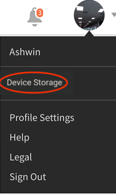

# iPad 및 Android 태블릿 사용자

iPad 또는 Google Nexus 9 Android 태블릿의 Learning Manager 앱에서 학습자로 로그인하면 다음 **홈** 화면이 표시됩니다.

*앱의 홈 화면*

학습 및 카탈로그 기능으로 이동하려면 **메뉴** 드롭다운을 탭한 다음 알맞은 옵션을 선택하세요.

<!---->

## 오프라인으로 앱 이용 {#accesstheappoffline}

iPad 및 Google Nexus 9 Android 태블릿에서 Learning Manager 앱을 오프라인으로 액세스할 수 있습니다. 오프라인 모드에서 강의를 다운로드하여 수강하고 난 다음, 네트워크와 연결하여 콘텐츠를 온라인 앱에 다시 동기화합니다.

1. 상단의 **메뉴** 드롭다운을 누르고 **학습** 옵션을 누릅니다. 이용 가능한 모든 강의 리스트가 표시됩니다.
1. 학습 콘텐트를 다운로드하려면 각 학습 내용 아래에 있는 다운로드 아이콘을 탭합니다.

   <!---->

1. 온라인 상태에서는 콘텐트를 온라인으로 동기화할 것인지 확인하는 메시지가 응용 프로그램 맨 위 표시줄에 나타납니다. 동기화를 원한다면 빨간색 표시줄을 탭합니다. 녹색 표시줄은 콘텐츠가 온라인 응용 프로그램에 동기화되었다는 것을 나타냅니다.

<!--## Track device storage {#trackdevicestorage}

You can monitor your device storage periodically.

Tap the profile icon at the upper-right corner of the app and tap **Device Storage** menu option.

An app storage information dialog appears as shown below.

Using the app storage information, you can check the total space of device, app and the downloaded courses. This information enables you to download courses accordingly. To delete the downloaded courses in the device, tap X icon adjacent to each course name.-->
