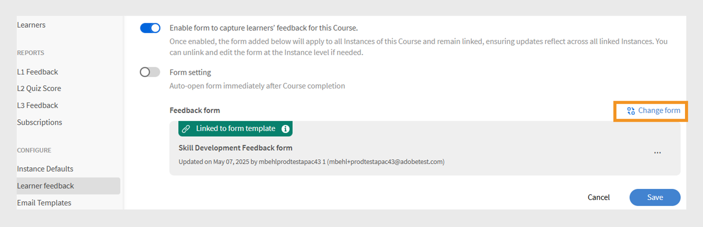

# L1 피드백 양식

>[!IMPORTANT]
>
>일부 고객에게는 개선된 L1 피드백 기능이 출시될 예정입니다. 계정에 이 기능이 표시되지 않으면 기존 피드백 기능에 대한 자세한 내용은 [L1 및 L3 피드백 추가](/help/migrated/administrators/feature-summary/courses.md#add-l1-and-l3-feedback)를 참조하세요.
>
>CSM(Customer Success Manager) 팀에 문의하여 새 피드백 시스템을 활성화하고 마이그레이션 타임라인에 대해 알아보십시오.

Adobe Learning Manager의 레벨 1(L1) 피드백 기능을 사용하면 강의 또는 학습 경로를 완료한 후 학습자가 피드백을 공유할 수 있습니다. 이 피드백은 책임자가 강의 품질, 강사 효율성 및 전반적인 학습 경험을 평가하는 데 도움이 됩니다.

이제 관리자는 재사용 가능한 여러 피드백 양식을 만들고 관리할 수 있으며 이를 특정 강의와 학습 경로에 할당할 수 있습니다.

이 기능을 사용하면 관리자가 다음과 같은 작업을 수행할 수 있어 유연성이 향상됩니다.

* 재사용 가능한 피드백 양식 만들기
* 다양한 강의 또는 학습 경로에 대한 피드백 맞춤화
* 필요에 따라 맞춤형 양식 할당

이제 **[!UICONTROL L1 피드백 보고서]**&#x200B;와 **[!UICONTROL 피드백 보고서]**(사용자 지정 보고서)에 피드백 양식 이름과 피드백 버전이라는 두 개의 새 열이 포함됩니다. 이 열은 사용된 피드백 양식에 대한 세부 정보를 제공합니다.

## L1 피드백 양식 만들기

책임자는 계정 수준에서 여러 개의 L1 피드백 양식을 만들고 과정, 학습 경로 또는 인증에 적절한 양식을 할당할 수 있습니다.

L1 피드백 양식을 만들려면 다음을 수행하십시오.

1. 관리자 권한으로 Adobe Learning Manager에 로그인합니다.
2. **[!UICONTROL 피드백 양식]**&#x200B;을 선택합니다.

   
   _피드백 양식을 만들고 관리하기 위한 피드백 양식 옵션을 표시하는 관리자 홈페이지_
3. **[!UICONTROL 양식 추가]**&#x200B;를 선택합니다.

   
   _피드백 양식을 만들기 위한 양식 추가 단추를 표시하는 피드백 양식 화면_
4. **[!UICONTROL 기본 템플릿 언어]**&#x200B;를 선택한 다음 **[!UICONTROL 저장]**&#x200B;을 선택하십시오.

   
   _기본 언어를 선택하는 옵션을 표시하는 새 템플릿 프롬프트 추가_
5. 양식 제목 및 설명을 입력합니다.

   
   _양식 제목 및 양식 설명 옵션 유형을 표시하는 피드백 양식 페이지 추가_
6. **[!UICONTROL 질문 추가]** 메뉴에서 다음 중 질문 유형을 선택합니다.

   a. **[!UICONTROL 무료 텍스트]**: 학습자가 자신의 단어로 답변을 제공할 수 있습니다.

   * **[!UICONTROL 질문]** 텍스트 필드에 질문을 입력합니다.
   * 질문을 필수 항목으로 만들려면 **[!UICONTROL 필수]** 토글을 선택합니다.
     
     _피드백 양식에 자유 텍스트 질문 추가_

   b. **[!UICONTROL 숫자 크기/NPS]**: 학습자는 숫자 크기(일반적으로 1~10)를 사용하여 강의 만족도 또는 강의를 추천할 가능성을 평가할 수 있습니다.

   * **[!UICONTROL 질문]** 텍스트 필드에 질문을 입력합니다.
   * 등급 범위(1~10)를 선택합니다.
   * 질문을 필수 항목으로 만들려면 **[!UICONTROL 필수]** 토글을 선택합니다.
     \
     _피드백 양식에 숫자/NPS 비율 질문 추가_

   c. **[!UICONTROL 리커트 척도]**: 학습자는 설명에 동의하는 정도를 지정할 수 있습니다(강력하게 동의하지 않음 - 강력하게 동의함).

   * **[!UICONTROL 질문]** 텍스트 필드에 질문을 입력합니다.
   * 질문을 필수 항목으로 만들려면 **[!UICONTROL 필수]** 토글을 선택합니다.
     
     _피드백 양식에 리커트 척도 질문 추가_

   d. **[!UICONTROL 강의 효과 점수]**: 상대 평가 시스템을 사용하여 강의가 학습자에게 미치는 영향을 측정하는 척도입니다.

   * 1부터 10까지의 Likert 배율로 미리 정의된 질문이 피드백 양식에 추가됩니다.
   * **[!UICONTROL 강의 효과 점수]** 질문 하나만 추가할 수 있으며 편집할 수 없습니다.
     
     _피드백 양식에 강의 효과 점수 질문 추가_
7. **[!UICONTROL 저장]**&#x200B;을 선택합니다. 생성된 양식은 피드백 Forms 섹션에서 볼 수 있습니다.

### 피드백 양식 미리 보기

영어(미국) 미리보기를 선택하여 피드백 양식을 미리 볼 수 있습니다. 여러 언어로 양식을 만든 경우 각 언어로 양식을 미리 볼 수도 있습니다. 이 [섹션](/help/migrated/administrators/feature-summary/l1-feedback-form.md#add-feedback-forms-in-other-languages)을(를) 보고 다른 언어로 피드백 양식을 추가하는 방법을 알아보십시오.

_기본 언어로 피드백 양식을 볼 수 있는 미리 보기 옵션이 표시된 피드백 양식 화면_

### 다른 언어로 피드백 양식 추가

여러 언어로 된 피드백 양식에서 질문에 대한 번역을 만드십시오. 그러나 영어 등의 기본 언어로 된 질문만 추가하거나 제거할 수 있습니다. 다른 언어의 경우에는 처음에 기본 언어로 추가된 질문만 번역할 수 있습니다. 번역본에서 직접 질문을 추가하거나 제거할 수는 없다.

1. 피드백 양식에서 **[!UICONTROL 새 언어 추가]**&#x200B;를 선택합니다.

   
   _피드백 양식에 새 언어 버전 추가_
2. 원하는 언어를 선택하고 **[!UICONTROL 저장]**&#x200B;을 선택합니다.
3. 추가한 언어에 대한 탭으로 이동합니다.
4. 각 질문 옆의 **[!UICONTROL 번역]**&#x200B;을 선택하여 번역을 추가합니다.

   
   _번역 옵션을 표시하여 질문을 해당 언어로 번역하는 피드백 양식 화면_

   >[!NOTE]
   >
   >강의 효과 점수 질문은 자동으로 변환됩니다.

5. 번역을 추가한 후 **[!UICONTROL 저장]**&#x200B;을 선택합니다.

## 피드백 양식을 기본값으로 설정

책임자는 자가 진행식, 강의실, 가상 강의실 및 혼합 강의에 대한 기본 피드백 양식을 설정할 수 있습니다. 구성이 완료되면 모든 강의를 완료하면 이 기본 양식이 학습자에게 자동으로 표시됩니다. 책임자가 특정 강의에 대해 다른 피드백 양식을 할당하지 않는 한 이 기본 양식은 모든 강의에 적용됩니다.

_기본 피드백 양식을 설정하는 피드백 양식 화면 표시 옵션_

## 학습자 피드백 설정 구성

책임자는 학습자 피드백 섹션에서 다음 설정을 구성할 수 있습니다.

* **[!UICONTROL 이 강의에 대한 학습자의 피드백을 수집하기 위한 양식 활성화]**: 이 옵션을 활성화하면 강의에 대한 학습자의 피드백을 수집할 수 있습니다. 활성화되면 강의를 완료한 학습자에게 피드백을 제공하라는 메시지가 표시됩니다.
* **[!UICONTROL 양식 설정]**: 활성화되면 학습자가 강의를 완료한 후 바로 피드백 양식이 자동으로 열리므로 적시에 피드백을 더 쉽게 수집할 수 있습니다.

_학습자 피드백 설정을 표시하는 학습자 피드백 화면_

>[!NOTE]
>
>강의 인스턴스는 강의 레벨의 기본 피드백 양식을 사용합니다. 새 인스턴스를 만들면 계정 수준 대신 강의 수준 기본 폼도 사용됩니다.

### 강의의 기본 피드백 양식 변경

기본 피드백 양식은 모든 강의에 적용됩니다. 책임자는 새 양식을 작성하거나 기존 목록에서 양식을 선택할 수 있습니다. 기본 피드백 양식을 변경하려면 이 강의에서 학습자 피드백을 활성화해야 합니다.

기본 피드백 양식을 변경하려면 다음을 수행하십시오.

1. 관리자 홈페이지에서 **[!UICONTROL 강의]**&#x200B;를 선택합니다.
2. **[!UICONTROL 과정]** 섹션에서 과정을 선택합니다.
3. **[!UICONTROL 강의 보기]**&#x200B;를 선택한 다음 **[!UICONTROL 학습자 피드백]**&#x200B;을 선택합니다.

   
   _학습자 피드백 화면에 양식을 변경하는 편집 옵션이 표시됩니다_
4. **[!UICONTROL 학습자 피드백]** 섹션에서 **[!UICONTROL 편집]**&#x200B;을 선택합니다.
5. **[!UICONTROL 양식 변경]**&#x200B;을 선택합니다.

   
   _학습자 피드백 화면에 강의 피드백 양식을 변경하는 양식 변경 옵션이 표시됩니다_
6. 메뉴에서 다른 피드백 양식을 선택하거나 **[!UICONTROL 빈 양식으로 시작]**&#x200B;을 선택하여 새 양식을 만듭니다.

   
   _사용 가능한 템플릿에서 선택하거나 새 양식을 만드는 옵션을 표시하는 양식 화면 추가_
7. **[!UICONTROL 저장]**&#x200B;을 선택하여 변경 내용을 적용합니다.

강의가 기본 피드백 양식을 사용하고 있고 기본 양식이 계정 수준에서 업데이트되면, 이러한 모든 강의는 자동으로 새 양식을 반영합니다. 그러나 책임자가 양식을 변경하거나 강의 수준에서 새 양식을 할당하는 경우 기본 양식에 대한 향후 변경 내용이 해당 강의의 피드백 양식에 영향을 주지 않습니다.

인스턴스에서는 강의 레벨 피드백 양식을 기본값으로 사용합니다. 책임자가 강의 레벨에서 피드백 양식을 변경하더라도 인스턴스 레벨에서 이미 설정된 양식에는 영향을 주지 않습니다. 그러나 변경 후 생성된 모든 새 인스턴스는 기본적으로 업데이트된 강의 레벨 피드백 양식을 사용합니다.

동일한 단계에 따라 학습 경로에 대한 기본 피드백 양식을 변경하십시오.

>[!NOTE]
>
>양식을 변경하지 않으면 강의에서 기본 피드백 양식을 사용합니다.

