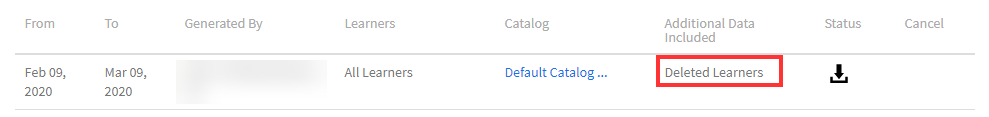

# 학습자 성적 증명서

Learning Manager를 사용하여 학습자 성적 증명서를 다운로드하고 보고서를 관리합니다.

Adobe Learning Manager를 사용하면 조직 책임자가 학습자 관련 성적 증명서를 생성할 수 있습니다.

## 학습자 성적 증명서 생성 {#generatelearnertranscripts}

1. 학습자 성적 증명서를 생성하려면 다음을 클릭합니다. **[!UICONTROL 보고서]** 관리자 로그인 의 왼쪽 창에 표시됩니다.

   책임자는 **[!UICONTROL 사용자 정의 보고서]** > **[!UICONTROL Excel 보고서]** 탭 내부 **[!UICONTROL 보고서]** 페이지.

1. 링크를 클릭합니다. **[!UICONTROL 학습자 성적 증명서]**.

   대상 **[!UICONTROL 학습자 성적 증명서]** 기록 페이지가 메시지와 함께 표시됩니다. **아직 생성된 학습자 성적 증명서가 없습니다** 또는 학습 성적 증명서 내역 페이지 구현 후 트리거된 다운로드 목록입니다.

   <!---->

   학습자 성적 증명서 대화 상자가 나타납니다. 성적 증명서가 필요한 날짜 범위를 설정합니다.

   >[!NOTE]
   >
   >기본적으로 시작 날짜는 학습자의 등록 날짜이며 종료 날짜는 항상 현재 날짜입니다. 데이터가 필요할 때 시작 날짜만 수정할 수 있습니다.

1. 목록에서 학습자 이름 선택 **[!UICONTROL 학습자 선택]** 필드 및 클릭 **[!UICONTROL 생성].**
1. 단일 학습자 또는 학습자 그룹을 선택할 수 있습니다. 한 명 이상의 학습자를 추가하려면 **[!UICONTROL 학습자 추가]**&#x200B;를 클릭합니다.

   

   *학습자 추가*

1. 확인란을 선택하여 특정 카탈로그를 선택할 수 있습니다. 성적 증명서는 특정 카탈로그에서만 다운로드할 수 있습니다. 다음에서 카탈로그를 선택하여 특정 카탈로그를 선택할 수 있습니다. **[!UICONTROL 카탈로그 선택]** 드롭다운 목록입니다.

   

1. 학습자 성적 증명서를 내보낼 때, **[!UICONTROL 등록 상태]**. 이 드롭다운에는 다음과 같은 옵션이 있습니다.

   * 모두 선택
   * 완료됨
   * 진행 중
   * 시작되지 않음
   * 등록 취소됨

   

   *카탈로그 선택*

1. 계정에서 삭제된 학습자의 성적 증명서도 다운로드할 수 있습니다.

   삭제된 사용자의 학습자 성적 증명서를 다운로드하려면 **[!UICONTROL 고급 옵션]** 화살표 및 확인란 활성화 **[!UICONTROL 삭제된 학습자 데이터 포함]**.

   

   *삭제된 학습자의 학습자 성적 증명서 다운로드*

1. 학습자 성적 증명서에서 &quot;**[!UICONTROL 모듈 레벨 정보 활성화]**&quot; 확인란. 이 경우 이 옵션을 활성화하면 모듈 이름 및 모듈별 소요 시간을 성적 증명서의 일부로 가져올 수 있습니다.
1. &quot; 옵션을 활성화하여 스킬 데이터 및 요약 시트를 다운로드할 수 있습니다.**[!UICONTROL 스킬 데이터 및 요약 시트 포함]**&quot; 확인란.

   스킬 데이터가 포함되지 않으면 성적 증명서가 생성되어 컴퓨터에 .csv 파일로 다운로드됩니다. 스킬 데이터 확인란이 활성화되면 성적 증명서가 생성되어 .xls 파일로 다운로드됩니다.

## 복사/붙여넣기로 학습자 성적 증명서 생성

학습자 성적 증명서를 가져오는 프로세스는 매우 지루합니다. 한 번에 하나의 학습자 또는 사용자 그룹의 성적 증명서만 가져올 수 있기 때문입니다. 그러나 복사/붙여넣기 기능을 사용하면 한꺼번에 학습자 이메일 ID 목록을 복사하여 붙여넣을 수 있습니다.

1. 사용자로 로그인 **[!UICONTROL 책임자]** 또는 **[!UICONTROL 관리자]**.
1. 다음으로 이동: **[!UICONTROL 보고서]** 아래 **[!UICONTROL 관리]**, 가 로드됩니다. **[!UICONTROL 사용자 활동]** 페이지.
1. 다음을 수행합니다. **[!UICONTROL 사용자 정의 보고서]** 왼쪽 창에서 **[!UICONTROL 학습자 성적 증명서]** 목록에서 선택합니다.
1. 에 **[!UICONTROL 학습자 성적 증명서]** 페이지에서 **[!UICONTROL 새로 생성]** 버튼을 클릭합니다.
1. 시작 을 클릭하여 원하는 날짜를 선택합니다. **[!UICONTROL 날짜 범위 선택]** 드롭다운. 다음을 수행합니다. **[!UICONTROL 이메일 ID]** 탭하여 복사한 고유 이메일 id 목록을 입력합니다.

   

   *전자 메일 ID 복사 및 붙여넣기*

1. 사용 **[!UICONTROL 이메일 ID 확인]** 입력한 id가 올바른지 확인합니다.

   

   *이메일 ID 확인*

   입력한 이메일 아이디가 잘못된 경우 위와 같이 확인 메시지가 빨간색으로 강조 표시됩니다.

   **[!UICONTROL 생성]** 입력한 모든 이메일 ID가 정확하지 않으면 버튼이 활성화되지 않습니다.

   

   *학습자 성적 증명서 생성*

1. 다음을 수행합니다. **[!UICONTROL 생성]** 언급된 모든 이메일 id에 대한 학습자 성적 증명서를 생성하는 버튼. 아래와 같이 보고서가 생성되었음을 알려주는 확인 메시지가 표시됩니다.

   

   *생성 중인 보고서의 확인 메시지*

   학습자 성적 증명서는 두 항목 모두에서 입력한 이메일 ID와 연계하여 생성할 수 있습니다 **[!UICONTROL 사용자]** 및 **[!UICONTROL 이메일 ID]** 탭.

## 학습자 성적 증명서 다운로드 기록 {#ltdownload}

에 **[!UICONTROL 학습자 성적 증명서]** 다운로드 페이지, 보고서를 생성하려면 **[!UICONTROL 새로 생성]** 학습자 성적 증명서 대화 상자가 표시됩니다.

*모든 학습자 성적 증명서의 보고서 생성*

**[!UICONTROL 고급 옵션]**&#x200B;을 클릭하고 패널을 확장합니다.

사용자 및 사용자가 속한 카탈로그를 선택합니다. **[!UICONTROL 생성]** 버튼을 클릭하면 보고서 다운로드에 소요되는 대략적인 시간을 알려주는 대화 상자가 표시됩니다. 보고서를 생성하려면 **[!UICONTROL &#39;생성&#39;]**&#x200B;을 클릭합니다.

*생성 버튼을 선택합니다.*

성적 증명서가 배경에 생성되고 Learning Manager에서 작업을 계속 수행할 수 있습니다. 성정 증명서가 생성되면 목록에서 성적 증명서를 다운로드할 수 있습니다.

책임자는 시스템의 모든 사람이 생성한 모든 성적 증명서를 볼 수 있습니다.

*다운로드 내역 보기*

다운로드 목록에는 다음 속성이 표시됩니다.

* **학습자:** 성적 증명서를 다운로드할 학습자/학습자 그룹.
* **포함된 추가 데이터:** 학습자 성적 증명서 양식 추가 내 고급 옵션에서 책임자가 다운로드하려는 추가 데이터에 따라 다름
* **상태:** 다운로드, 대기 중 또는 진행 중입니다.
* **시작일** 및 **종료일**: 성적 증명서 다운로드 기간
* **적용된 필터:** 등록 상태에 대한 필터를 적용했는지 여부.
* **생성자:** 다운로드를 요청한 Learning Manager 사용자의 사용자 ID입니다.
* **상태:** 다운로드, 대기 중 또는 진행 중입니다.

언제든지 다운로드를 취소할 수 있습니다. 책임자가 작업을 취소하면 Learning Manager에서 학습자 성적 증명서를 트리거한 사용자에게 앱 내 알림을 전송합니다.

*학습자 성적 증명서 다운로드 대기열*

다음을 수행할 수 있습니다. **취소** 언제든지 다운로드할 수 있습니다. 작업이 취소되면 Learning Manager에서 작업을 취소한 사용자에게 앱 내 알림을 전송합니다.

## 삭제된 학습자 데이터 {#dataofdeletedlearners}

삭제된 학습자 데이터를 학습자 성적 증명서 목록에 포함시킬 수 있습니다. 학습자 성적 증명서 대화 상자에서 옵션을 활성화합니다 **[!UICONTROL 삭제된 학습자 데이터 포함]**.

옵션 활성화 후 **[!UICONTROL &#39;생성&#39;]**&#x200B;을 클릭하면 삭제된 학습자의 데이터가 학습자 성적 증명서 다운로드 페이지에 다음과 같이 표시됩니다.

*삭제된 학습자 데이터 보기*

## 열 사용자 정의 {#customize-columns-lt}

책임자는 학습자 성적 증명서 보고서에서 내보낸 열을 사용자 정의할 수 있습니다. 책임자, 사용자 정의 책임자 및 관리자는 보고서를 내보내기 전에 열을 구성할 수 있습니다.

에 **[!UICONTROL 학습자 성적 증명서]** 대화 상자에서 **[!UICONTROL 고급 옵션]**. (으)로 **[!UICONTROL 내보내기 형식 구성]** 섹션에서 내보낼 열을 선택합니다.

*내보낼 열 사용자 정의*

사용자 정의는 사용자가 .CSV 형식으로 학습자 성적 증명서를 다운로드하는 경우에만 허용됩니다. .XLSX 형식에서 다운로드하는 경우 열 환경 설정 선택 항목은 인식되지 않으며 모든 기본 열은 내보내기 됩니다.

## 학습자 성적 증명서 파일 콘텐츠 {#learnertranscriptfilecontent}

일반적인 학습자 성적 증명서 파일 한 개에는 6개의 엑셀 시트가 있습니다. 학습자 성적 증명서 시트는 강의당 관련된 학습자 수, 스킬, 강의나 학습자 기준 완료율 및 준수 대시보드를 포함한 데이터에 대한 전반적인 통찰력을 제공합니다. 학습자 성적 증명서에서 사용할 수 있는 대시보드는 다음과 같습니다.

**학습자 성적 증명서**

학습자 성적 증명서 엑셀 시트는 학습자의 프로필 세부 정보와 함께 등록 날짜, 시작 날짜, 달성한 점수, 획득한 퀴즈 점수 등 학습 객체 중심의 수료 관련 세부 정보를 제공합니다. 강의가 학습 프로그램의 일부인 경우 개별 강의 이용 세부 사항과 별도로 나열됩니다.

**1- 학습 활동 대시보드**

이 학습 객체 특정 대시보드에서는 각 강의, 학습 프로그램, 인증당 학습자의 수를 볼 수 있습니다. 특정 학습 객체에 대한 학습자 진행률 시트를 볼 수 있습니다. 이 시트에는 강의 또는 학습 프로그램을 완료한 학습자의 수, 진행 중인 학습자, 학습자의 기한 등의 데이터가 표시됩니다.

특정 강의에 대한 사용자의 진행률은 귀하가 기입한 기한 및 진행률 기준치가 적용된 입력 필드를 기준으로 계산됩니다. 예를 들어 귀하가 입력 필드 값으로 7일 및 70%를 기입한 경우, 강의 진행률은 기한이 7일 남았으며 70% 이상 진행된 강의가 표시됩니다. 또한, 이 시트에서는 마감 기간을 변경할 수 있습니다. 수정된 데이터는 이 대시보드에 자동으로 표시됩니다.

**2- 학습 활동 대시보드**

이 학습 대시보드는 특정 사용자의 데이터를 표시합니다. 이 대시보드에서는 특정 사용자가 등록한 강의, 학습 프로그램, 인증을 볼 수 있습니다. 표에는 사용자가 완료한 학습 객체, 진행 중인 학습 객체 및 사용자의 예정된 기한에 대한 데이터가 표시됩니다.

각 강의의 사용자 진행률은 입력 내용을 기준으로 계산됩니다. 즉, 기한 및 진행률 값입니다. 예를 들어 귀하가 입력 필드 값으로 7일 및 70%를 기입한 경우 다른 강의에 대한 사용자 진행률은 기한이 7일 남았으며 70% 이상 진행된 강의가 표시됩니다.

**스킬**

스킬 시트에는 스킬 이름, 스킬 레벨, 필요한 점수, 획득한 점수, 완료도 및 기타 프로필 세부 정보가 제공됩니다. 아래에 있는 스킬 엑셀 시트의 샘플 스냅샷을 참조하십시오.

*스킬 Excel 시트 샘플*

**1- 스킬 대시보드**

이 대시보드에서는 조직이 다양한 스킬을 갖추고 있는지 볼 수 있습니다. 특정 스킬에 대해 조직 내에서 이 스킬을 보유하고 있어야 하는 사용자의 수와 실제로 스킬을 보유한 사람의 수를 확인할 수 있습니다. 대시보드에는 스킬을 새로 고침해야 하는 사용자가 표시됩니다. 해당 값은 귀하가 입력 필드에 기입한 내용을 바탕으로 계산됩니다. 예를 들어 귀하가 50일을 입력한 경우 대시보드에는 50일 후에 스킬을 새로 고침해야 하는 사용자 데이터가 표시됩니다.

**2- 스킬 대시보드**

보다 사용자별 특징을 가지는 스킬 대시보드입니다. 특정 사용자 또는 여러 사용자를 필터링하여 대시보드에서 스킬 레벨을 확인할 수 있습니다. 이 시트는 관리자와 책임자가 학습자에게 기대하는 정도의 스킬과 비교하여 각 학습자가 어느 정도의 스킬을 갖고 있는지 추적하는 데 도움이 됩니다. 스킬 대시보드는 또한 스킬을 새로 고침해야 하는 학습자에게 도움이 됩니다. 학습자의 새로 고침 목록은 입력 필드에 귀하가 기입한 일자 수를 기준으로 계산됩니다.

**준수 대시보드**

준수 대시보드는 사용자별 준수 보고서와 훈련별 준수 보고서의 두 부분으로 구성됩니다. 사용자 기반 보고서에서 준수 대시보드를 사용하여 중요한 준수 이니셔티브 기한이 다가오고 있는 사용자를 추적할 수 있습니다. 훈련 기반 보고서에서는 학습 프로그램 또는 인증을 필터링할 수 있습니다.

두 준수 보고서 모두 기한별로 필터링하여 적절한 데이터를 확인할 수 있습니다.

### 성적 증명서의 시간 및 날짜 열 {#datetime}

다음 열의 값은 분을 가장 가까운 분으로 반올림하고 초 값은 00입니다.

* 등록 날짜(UTC 시간대)
* 시작 날짜(UTC 시간대)
* 완료 날짜(UTC 시간대)

*Excel 시트의 시간 및 날짜 열*

### 성적 증명서의 모듈 지속 기간 및 ID 열 {#moduledurationandidcolumnsinthetranscript}

학습자 성적 증명서에는 열이 표시됩니다. **[!UICONTROL 모듈 지속 시간]** 및 **[!UICONTROL ID]**.

*성적 증명서의 모듈 지속 기간 및 ID 열*

### 성적 증명서의 기타 열 {#ModuledurationandIDcolumnsinthetranscript-1}

| **열** | **설명** |
|---|---|
| 다음 이후 | 새로 고침해야 하는 입력된 날짜(값) 이전에 스킬을 습득한 학습자 수 |
| 스킬 | 학습자에게 할당된 스킬 이름 |
| 관리자 이름 | 스킬 요약표에 부하 직원의 스킬 습득 데이터를 표시할 수 있는 관리자 이름 |
| 행 레이블 | 스킬 목록이 할당된 학습자 이름 |
| 각 사용자가 습득해야 하는 스킬 수 | 학습자에게 할당된 스킬 수 |
| 각 사용자가 달성한 스킬 수 | 각 사용자가 습득한 스킬 수 |
| 새로 고침해야 하는 스킬 수 | 스킬을 새로 고침해야 하는 학습자 수 |
| 준수 비율 | 할당된 스킬의 진행률 |
| 포함된 경로 | 이 열에는 포함된 학습 프로그램의 이름이 표시됩니다. |
| 포함된 경로 ID | 이 열에는 포함된 학습 프로그램의 ID가 표시됩니다. |
| 포함된 경로 언어 | 이 열에는 생성한 학습 프로그램에 사용되는 언어가 표시됩니다. |
