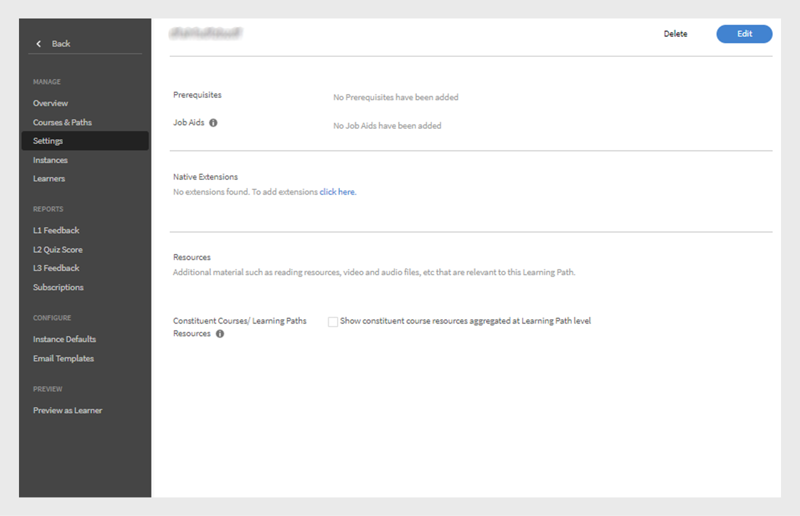

# 학습 경로

## 학습 경로란 무엇입니까?

책임자는 종종 특정 주제나 전문 분야에 대한 지식을 심층적으로 다루는 세부 교육 과정을 편성하는 데 관심을 기울입니다. 또한 일련의 교육 과정을 이수해야 하는 직원이나 고객도 마찬가지입니다. 이를 위해서는 일련의 강의와 프로그램을 유기적으로 묶어 완전한 교육 패키지를 만들어야 합니다.

학습 경로가 탄생한 배경입니다. 학습 경로는 학습자가 특정 주제에 정통하려면 통달해야 하는 긴 여정입니다. 학습자는 자신의 교육 환경을 통제하는 한편, 자기주도 학습을 통해 한층 더 효율적으로 지식을 습득하고 보유할 수도 있습니다.

예를 들어 기업은 신입사원의 적응 기간에 자사의 정책과 절차, 문화, 역사 등에 관해 가르칩니다. 학습 경로는 직원이 필요한 대로 교육 과정을 구성하는 방식을 지원하므로 본인에게 적합한 학습 경로를 고려해 강의에 등록할 수 있습니다. 필요한 경우 기업은 이 학습 경로에 직원을 등록하여 직원이 차근차근 강의를 이수하도록 도울 수 있습니다.

## 학습 경로 생성 및 구성

이 교육에서는 학습 경로를 생성하고 여기에 강의를 추가하고 학습 경로를 게시 및 폐기하고 학습 경로 내의 인스턴스를 구성하는 방법에 대해 학습합니다.

교육을 시작할 수 없는 경우 다음 주소로 작성하십시오. <almacademy@adobe.com>.

## 학습 경로의 장점

학습 경로는 편리하고 간편하게 교육 프로그램을 제공할 수 있습니다. 학습 경로의 주요 장점은 다음과 같습니다.

1. 스킬과 스킬 레벨을 학습 경로에 직접 할당할 수 있습니다. 스킬 점수에 맞출 필요가 없습니다. 학습자가 학습 경로를 완료하면 관련 스킬 레벨이 달성됩니다.
1. 기존의 학습 경로를 새 학습 경로에 포함할 수 있습니다. 학습 경로 삽입은 1계층 삽입만 허용됩니다. 따라서 이미 삽입된 경로가 있는 학습 경로는 새 경로에 삽입할 수 없습니다.
1. 학습 경로 레벨에서 선행 조건, 작업 지원, 리소스를 추가할 수 있습니다.
1. 섹션을 생성할 수 있습니다. 각 섹션에는 제목을 지정할 수 있습니다.
1. 섹션을 이수 필수로 지정하고 완료 기준을 설정할 수 있습니다.

## Learning Manager에서 학습 경로 추가

책임자용 Learning Manager 앱에서 **[!UICONTROL 학습 경로]** 왼쪽 패널에서

(으)로 **[!UICONTROL 학습 경로]** 페이지에서 **[!UICONTROL 추가]**. 세부 정보를 입력합니다.

*새 학습 경로 추가*

학습 경로를 생성한 후 새로 생성된 학습 경로를 선택하고 이 학습 경로에 강의를 추가합니다.

스킬을 추가하고 학습 경로에 배지를 할당할 수 있습니다. 스킬을 추가하려면 아래에서 필요한 스킬을 선택합니다. **[!UICONTROL 스킬 선택]** 드롭다운 목록입니다. 각 스킬의 레벨도 선택합니다.

학습 경로에 배지를 할당합니다. 사용 가능한 배지 목록에서 배지를 선택합니다.

제품, 역할 및 역할 수준을 선택합니다. **[!UICONTROL 추천 대상]** 섹션에서 해당 제품 및 역할에 관심을 표현한 사용자에게 이 학습 경로를 제안합니다.

&#39;정렬되지 않음&#39;과 &#39;정렬됨&#39; 중 섹션과 교육의 원하는 나열 순서를 선택합니다.

&#39;정렬됨&#39;을 선택하면 강의가 생성한 순서대로 나열됩니다. &#39;정렬되지 않음&#39;을 선택하면 강의가 순서대로 나열되지 않습니다. 학습자는 원하는 순서로 강의를 완료할 수 있습니다.

학습 경로에 강의를 추가하려면 **[!UICONTROL 강의 또는 학습 경로 추가]**.

화면에 나타난 대화 상자에서 학습 경로에 추가할 교육을 선택합니다.

*학습 경로에 교육 추가*

할당된 스킬, 수정된 날짜, 강의 효과를 기준으로 강의를 추가로 정렬할 수 있습니다.

강의 또는 학습 경로를 선택한 후 **[!UICONTROL 저장]**.

학습 경로에서 수행할 수 있는 작업은 다음과 같습니다.

**섹션 만들기 및 구성:** 섹션은 교육의 영역이나 실질적인 구성 요소를 완료하는 여러 교육 과정을 그룹화하기 위해 생성됩니다. 각 섹션에는 제목을 지정할 수 있습니다. 각 섹션 또한 특정 완료 요구 사항이 있는 필수 로 표시할 수 있습니다.

**각 섹션에서 강의를 이수 필수로 설정합니다.** 필수 확인란을 선택하여 해당 교육을 학습 경로의 필수 항목으로 지정할 수 있습니다. 확인란을 선택하면 모든 교육을 이수 필수로 만들거나 일부 교육을 이수 필수로 설정할 수 있습니다.

*각 섹션에서 강의를 이수 필수로 설정*

**순서 다시 정렬:** 강의를 위 또는 아래로 옮겨서 순서를 바꿀 수 있습니다.

*교육 순서 조정*

**강의 제거:** 강의 카드에서 &#39;X&#39;를 클릭하여 학습 경로에서 강의를 제거합니다.

*학습 경로에서 과정 제거*

변경을 마친 후 학습 경로를 게시하려면 &#39;게시&#39;를 클릭합니다.

## 학습 경로 중첩

학습 경로 안에 다른 학습 경로를 삽입할 수 있지만, 학습 경로 안에는 최대 하나의 학습 경로만 중첩할 수 있습니다.

강의를 삽입하듯이 학습 경로를 삽입할 수 있습니다.

*학습 경로 내에 학습 경로 추가*

## 학습 경로 설정

설정 섹션에서 학습자가 학습 경로를 시작하기 전에 반드시 완료해야 하는 선행 조건과 작업 지원을 추가할 수 있습니다. 또한 학습자에게 도움이 될만한 리소스도 추가할 수 있습니다.

*학습 경로 설정 변경*

## 인스턴스

학습 경로 인스턴스에는 **[!UICONTROL 학습 경로]**&#x200B;라는 별도의 타일이 표시됩니다. 이 타일에는 학습 경로에 추가된 학습 프로그램의 개수가 표시됩니다.

(으)로 **강의** tile에서는 이 인스턴스에 등록된 학습자에게 표시되는 강의 인스턴스를 볼 수 있습니다.

대상 **[!UICONTROL 학습자가 인스턴스를 선택할 수 있도록 설정하십시오(유연 학습 경로)]** 확인란은 강의에만 적용됩니다. 모든 하위 학습 경로에는 학습 프로그램 인스턴스를 학습 경로와 매핑할 수 있는 옵션이 주어집니다. 기본적으로 매핑은 기본 인스턴스로 설정됩니다.

*학습 경로 인스턴스*

## 알림

세 가지 옵션이 있습니다.

1. **[!UICONTROL 모든 스킬 레벨 강의 및 학습 경로(기본적으로 선택됨)]:** 학습자는 학습 경로 레벨에 관계 없이 미완료 과정에서 알림을 받습니다.
1. **[!UICONTROL 최상위 학습 경로]:** 학습자는 상위 학습 경로에 속하는 미완료 과정에 대한 알림을 받습니다.
1. **[!UICONTROL 학습 경로 + 첫 번째 스킬 레벨 아동만]:** 학습자는 상위 학습 경로의 첫 번째 하위 학습 경로의 미완료 과정에 대한 알림을 받습니다.

이 옵션에 따라 알림이 표시됩니다. 기본적으로 옵션은 **[!UICONTROL 모든 레벨의 강의 및 학습 경로]** 이(가) 인스턴스에 대해 활성화됩니다.

## 중요 사항

학습 프로그램이라는 기존 기능의 이름이 릴리스 직후에 학습 경로로 변경됩니다. 학습 프로그램이란 용어를 계속 사용하고 싶은 경우 &#39;용어&#39; 기능을 사용하여 원하는 용어를 적용할 것을 권장합니다. 이렇게 하면 학습 프로그램이라는 용어를 사용할 수 있습니다.

학습 경로는 다양한 기능을 지원합니다. 그중 일부 기능은 릴리스 직후에 사용할 수 있습니다. 일단 책임자/작성자가 이런 기능들을 사용할 수 있습니다. &#39;섹션&#39;, &#39;다른 경로에 학습 경로 추가&#39; 등과 같은 확장 기능입니다. 아래에 설명된 확인란을 선택하여 활성화할 수 있습니다.

학습자는 학습 프로그램(지금의 학습 경로)을 앞으로도 계속 사용할 수 있으며, 작성자/책임자 역시 학습 프로그램을 계속 작성할 수 있습니다. 위에서 언급한 학습 경로의 확장 기능을 활용하려면 책임자가 아래의 설명대로 설정을 활성화해야 합니다. 설정을 활성화하면 학습 경로의 모든 새로운 확장 기능을 사용할 수 있습니다.

대상 **[!UICONTROL 설정]** > **[!UICONTROL 일반]** 페이지에 학습 경로를 활성화할 수 있는 옵션이 새로 추가되었습니다. 이 옵션을 활성화하면 학습 경로에 강의와 학습 프로그램을 추가할 수 있습니다. 일단 활성화된 옵션은 변경할 수 없습니다.

## 기타 학습 경로 관련 세부 정보

### &#39;책임자 설정&#39;에서 학습 경로 옵션 비활성화/선택 취소

**네이티브 웹 앱을 사용하는 계정**

**학습자**

* 기본적으로 학습자용 UI에는 &#39;학습 프로그램&#39;에서 &#39;학습 경로&#39;로 변경된 용어가 표시됩니다. 이와 같은 변화는 더 직관적인 인터페이스를 추구하고자 단행되었습니다. 이러한 변경을 원하지 않는 경우 아래 사항을 참조하십시오.

* 그러나 이미 &#39;사용자 정의 용어&#39; 기능으로 &#39;학습 프로그램&#39;이란 용어에 사용자 정의 텍스트를 추가하여 사용 중인 경우 변경된 용어가 UI에 반영되지 않습니다.
* 사용자 정의 용어 기능을 사용하지 않았지만 &#39;학습 프로그램&#39;이란 용어를 그대로 유지하려는 경우 릴리스 이후에 &#39;사용자 정의 용어&#39; 기능을 사용해 UI에 표시되는 용어를 학습 프로그램으로 변경할 수 있습니다.

* 기존 &#39;학습 프로그램&#39;의 전체적인 외양과 느낌은 시각적으로 더 풍성한 외양과 느낌으로 업데이트됩니다.

**작성자 및 책임자**

* 책임자/작성자용 앱에 표시되는 용어는 학습자용 앱과 동일합니다.
* 작성자 및 책임자가 기존의 &#39;학습 프로그램&#39; 개체를 생성하고 업데이트할 수 있는 UI가 이제 새 UI로 업데이트됩니다. 사용자 인터페이스가 훨씬 더 직관적으로 작동할 뿐, 기능성은 이전과 동일합니다. 이와 같은 UI 변경 사항은 &#39;학습 경로의 확장 기능&#39;을 비활성화해도 기능성을 고스란히 유지한 채 계정에 반영됩니다.

* 기존의 학습 프로그램 개체는 변경되지 않으므로 학습자에게 영향을 미치지 않습니다(위에 설명한 용어 제외). 작성자/책임자용 UI에는 기존의 개체에 &#39;섹션&#39;이라는 기본 그룹화 영역이 나타나는데, 이 영역은 개체의 기능성에 실질적인 영향을 미치지 않습니다. 또한 작성자/책임자용 UI에는 스킬, 작업 지원 등과 같은 기능도 추가로 표시됩니다. 그러나 작성자/책임자가 아직 이런 기능을 사용하지 않았기 때문에 실제로 사용하기 전까지는 학습자 측에 영향을 미치지 않습니다.

**보고**

* 학습 경로 옵션을 활성화하지 않으면 학습 경로는 학습자 성적 증명서의 기존 구조에 영향을 미치지 않습니다. 그러나 이전 공지에서 전달된 바와 같이(이전 커뮤니케이션에서 공유한 표 참조) 릴리스 직후에 학습자 성적 증명서의 맨 오른쪽에 새로운 열이 하나 더 추가됩니다.

**헤드리스 LMS를 사용하는 계정**

**학습자**

* 헤드리스 인터페이스를 사용하는 학습자에게는 이번 업데이트가 적용되지 않습니다. 보고서를 생성하는 데 사용되는 API도 즉시 변경되지 않습니다.

**작성자 및 책임자**

* 위에서 설명한 작성자/책임자용 UI와 동일하게 업데이트됩니다.

**보고**

* 위에서 설명한 보고와 동일하게 업데이트됩니다.

### 책임자 설정에서 학습 경로 옵션 활성화/선택

**네이티브 웹 앱을 사용하는 계정**

**학습자**

* 이 옵션을 비활성화하면 학습자용 UI와 동일하게 업데이트됩니다.
* 학습 경로의 확장 기능을 사용해보면 경로와 섹션이 삽입된 보다 정교한 경로, 경로 완료 시 획득할 수 있는 스킬과 배지, 경로 레벨의 리소스 외에도 다양한 이점을 체감할 수 있을 것입니다.

**작성자 및 책임자**

* 이 옵션을 비활성화하면 작성자/책임자용 UI와 동일하게 업데이트됩니다.

* 작성자와 책임자는 더욱 다양한 기능을 활용하여 학습 경로를 체계적으로 편성할 수 있습니다. 학습자가 학습 경로 완료 시 자동으로 달성되는 스킬 레벨을 정의할 수 있습니다(즉, 레벨을 달성하는 데 필요한 점수를 계산할 필요가 없습니다). 학습 경로 레벨에서 리소스를 추가할 수 있습니다(현재로서는 불가능). 섹션을 생성한 후 각 섹션에 종횡비 옵션을 설정할 수 있습니다. 학습 경로 안에는 하나의 다른 학습 경로를 삽입할 수 있습니다(1계층 중첩 지원).

**보고**

* &#39;학습자 성적 증명서&#39;와 &#39;콘텐츠 보고서&#39; 구조에 몇 개의 새로운 열이 추가되고, 학습 경로에 다른 학습 경로를 삽입할 수 있는 새로운 기능이 그곳에 배치됩니다. 학습자 성적 증명서 및 콘텐츠 보고서 데이터를 Learning Manager 외부의 사용자 정의 데이터 웨어하우스/데이터베이스로 내보내는 데 사용되는 통합 코드가 그로 인한 영향을 받을 수 있습니다. 이에 관한 내용은 이전 커뮤니케이션에 수록된 표를 참조하십시오.

**헤드리스 LMS를 사용하는 계정**

**학습자**

* 헤드리스 인터페이스의 구축 기반인 API에는 변화가 없습니다. 따라서 학습자는 헤드리스 LMS 환경을 변경하지 않는 한 이번 업데이트의 영향을 받지 않습니다.
* 그러나 새로운 학습 경로를 생성하여 학습 경로의 확장 기능을 사용하려면 헤드리스 LMS 환경을 변경해야만 학습자용 앱에 이번 업데이트가 반영됩니다. Learning Manager API는 이에 필요한 기능을 지원합니다.

**작성자 및 책임자**

* 위에서 설명한 작성자/책임자용 UI와 동일하게 업데이트됩니다.

**보고**

* 위에서 설명한 보고와 동일하게 업데이트됩니다.
