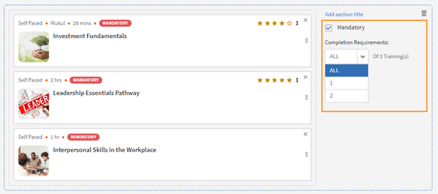

# 학습 경로

## 학습 경로란 무엇입니까?

책임자는 종종 특정 주제나 전문 분야에 대한 지식을 심층적으로 다루는 세부 교육 과정을 편성하는 데 관심을 기울입니다. 또한 일련의 교육 과정을 이수해야 하는 직원이나 고객도 마찬가지입니다. 이를 위해서는 일련의 강의와 프로그램을 유기적으로 묶어 완전한 교육 패키지를 만들어야 합니다.

학습 경로가 탄생한 배경입니다. 학습 경로는 학습자가 특정 주제에 정통하려면 통달해야 하는 긴 여정입니다. 학습자는 자신의 교육 환경을 통제하는 한편, 자기주도 학습을 통해 한층 더 효율적으로 지식을 습득하고 보유할 수도 있습니다.

예를 들어 기업은 신입사원의 적응 기간에 자사의 정책과 절차, 문화, 역사 등에 관해 가르칩니다. 학습 경로는 직원이 필요한 대로 교육 과정을 구성하는 방식을 지원하므로 본인에게 적합한 학습 경로를 고려해 강의에 등록할 수 있습니다. 필요한 경우 기업은 이 학습 경로에 직원을 등록하여 직원이 차근차근 강의를 이수하도록 도울 수 있습니다.

## 학습 경로 생성 및 구성

이 교육에서는 학습 경로를 생성하고 여기에 강의를 추가하고 학습 경로를 게시 및 폐기하고 학습 경로 내의 인스턴스를 구성하는 방법에 대해 학습합니다.

교육을 시작할 수 없는 경우 <almacademy@adobe.com>에 작성하세요.

## 학습 경로의 장점

학습 경로는 편리하고 간편하게 교육 프로그램을 제공할 수 있습니다. 학습 경로의 주요 장점은 다음과 같습니다.

1. 스킬과 스킬 레벨을 학습 경로에 직접 할당할 수 있습니다. 스킬 점수에 맞출 필요가 없습니다. 학습자가 학습 경로를 완료하면 관련 스킬 레벨이 달성됩니다.
1. 기존의 학습 경로를 새 학습 경로에 포함할 수 있습니다. 학습 경로 삽입은 1계층 삽입만 허용됩니다. 따라서 이미 삽입된 경로가 있는 학습 경로는 새 경로에 삽입할 수 없습니다.
1. 학습 경로 레벨에서 선행 조건, 작업 지원, 리소스를 추가할 수 있습니다.
1. 섹션을 생성할 수 있습니다. 각 섹션에는 제목을 지정할 수 있습니다.
1. 섹션을 이수 필수로 지정하고 완료 기준을 설정할 수 있습니다.

## Learning Manager에서 학습 경로 추가

책임자용 Learning Manager 앱에서 왼쪽 창의 **[!UICONTROL 학습 경로]**&#x200B;를 클릭합니다.

**[!UICONTROL 학습 경로]** 페이지에서 **[!UICONTROL 추가]**&#x200B;를 클릭합니다. 세부 정보를 입력합니다.

*새 학습 경로 추가*

**등록 유형** 옵션에서 **자가 등록** 또는 **관리자 등록**&#x200B;을 선택합니다.

>[!NOTE]
>
>**관리자 등록** 옵션을 선택하면 학습자는 관리자 지정 또는 관리자 승인 강의만 볼 수 있습니다. 학습자는 추천 섹션에 학습 경로가 표시되지 않습니다.

학습 경로를 생성한 후 새로 생성된 학습 경로를 선택하고 이 학습 경로에 강의를 추가합니다.

스킬을 추가하고 학습 경로에 배지를 할당할 수 있습니다. 스킬을 추가하려면 **[!UICONTROL 스킬 선택]** 드롭다운 목록에서 필요한 스킬을 선택합니다. 각 스킬의 레벨도 선택합니다.

*스킬 추가*

학습 경로에 배지를 할당합니다. 사용 가능한 배지 목록에서 배지를 선택합니다.

**[!UICONTROL 다음에 대해 추천]** 섹션에서 제품, 역할 및 역할 수준을 선택하여 해당 제품 및 역할에 관심을 표현한 사용자에게 이 학습 경로를 제안합니다.

*추천*

&#39;정렬되지 않음&#39;과 &#39;정렬됨&#39; 중 섹션과 교육의 원하는 나열 순서를 선택합니다.

&#39;정렬됨&#39;을 선택하면 강의가 생성한 순서대로 나열됩니다. &#39;정렬되지 않음&#39;을 선택하면 강의가 순서대로 나열되지 않습니다. 학습자는 원하는 순서로 강의를 완료할 수 있습니다.

학습 경로에 강의를 추가하려면 **[!UICONTROL 강의 또는 학습 경로 추가]**&#x200B;를 클릭합니다.

화면에 나타난 대화 상자에서 학습 경로에 추가할 교육을 선택합니다.

*학습 경로에 교육 추가*

할당된 스킬, 수정된 날짜, 강의 효과를 기준으로 강의를 추가로 정렬할 수 있습니다.

강의 또는 학습 경로를 선택한 후 **[!UICONTROL 저장]**&#x200B;을 클릭합니다.

학습 경로에서 수행할 수 있는 작업은 다음과 같습니다.

**섹션 만들기 및 구성:** 섹션을 만들어 여러 교육 과정을 그룹화하고 해당 교육 영역이나 실질적인 교육 내용을 완성합니다. 각 섹션에는 제목을 지정할 수 있습니다. 각 섹션 또한 특정 완료 요구 사항이 있는 필수 로 표시할 수 있습니다.

**각 섹션에서 강의를 이수 필수로 설정:** 필수 확인란을 선택하여 해당 교육을 학습 경로의 이수 필수로 설정할 수 있습니다. 확인란을 선택하면 모든 교육을 이수 필수로 만들거나 일부 교육을 이수 필수로 설정할 수 있습니다.

*각 섹션에서 강의를 필수 항목으로 지정*

**순서 조정:** 강의를 위 또는 아래로 옮겨서 순서를 바꿀 수 있습니다.

*교육 순서 재정렬*

**강의 제거:** 강의 카드에서 &#39;X&#39;를 클릭하여 학습 경로에서 강의를 제거합니다.

*학습 경로에서 과정 제거*

변경을 마친 후 학습 경로를 게시하려면 Publish을 클릭합니다.

## 중첩 또는 향상된 학습 경로

중첩 또는 향상된 학습 경로는 학습 경로 내에 여러 학습 경로가 포함된 학습 경로입니다. 학습 경로를 삽입하려면 학습 경로 내에 강의를 추가하는 것과 동일한 프로세스를 따르십시오.

*중첩 또는 향상된 학습 경로*

## 학습 경로 설정

설정 섹션에서 학습자가 학습 경로를 시작하기 전에 반드시 완료해야 하는 선행 조건과 작업 지원을 추가할 수 있습니다. 또한 학습자에게 도움이 될만한 리소스도 추가할 수 있습니다.

*학습 경로 설정 변경*

## 인스턴스

학습 경로 인스턴스에는 **[!UICONTROL 학습 경로]**&#x200B;라는 별도의 타일이 표시됩니다. 이 타일에는 학습 경로에 추가된 학습 프로그램의 개수가 표시됩니다.

**강의** 타일에서 이 인스턴스에 등록된 학습자에게 표시되는 강의 인스턴스를 볼 수 있습니다.

**[!UICONTROL 학습자가 인스턴스를 선택할 수 있도록 설정(유연 학습 경로)]** 확인란은 강의에만 적용할 수 있습니다. 이 옵션을 통해 학습자는 학습 경로에서 인스턴스를 전환할 수 있습니다. 모든 하위 학습 경로에는 학습 프로그램 인스턴스를 학습 경로와 매핑할 수 있는 옵션이 주어집니다. 기본적으로 매핑은 기본 인스턴스로 설정됩니다.

*학습 경로 인스턴스*

강의는 유연하고 학습자가 세션을 선택해야 하는 경우에도 책임자나 학습 계획을 통해 강의에 등록할 수 있습니다. 이 경우 시스템은 시트 제한에 도달해도 학습자가 등록할 수 있도록 허용하지만 시트가 나올 때까지 과정을 시작할 수 없습니다.

대기자 명단 기능은 학습자가 자가 자가 등록한 경우에만 적용됩니다. 세션이 시트 제한에 도달하면 강사는 대기자 명단에 등록된 학습자 목록을 볼 수 있습니다. 시트를 사용할 수 있게 되면 강사는 대기자 명단에 등록된 학습자를 추가하여 세션이 다시 용량이 될 때까지 추가할 수 있습니다.

## 알림

세 가지 옵션이 있습니다.

1. **[!UICONTROL 모든 스킬 레벨 강의 및 학습 경로(기본적으로 선택됨)]:** 학습자는 학습 경로에 포함된 레벨에 관계 없이 미완료 과정에 대한 알림을 받습니다.
1. **[!UICONTROL 최상위 학습 경로]:** 학습자는 상위 학습 경로에 속하는 미완료 과정에 대한 알림을 받습니다.
1. **[!UICONTROL 학습 경로 + 첫 번째 스킬 수준의 하위 항목만]:** 학습자는 상위 학습 경로의 첫 번째 하위 항목인 미완료 과정에 대한 알림을 받습니다.

이 옵션에 따라 알림이 표시됩니다. 기본적으로 인스턴스에는 **[!UICONTROL 모든 레벨의 강의 및 학습 경로]** 옵션이 적용됩니다.

## 구독수

개별 학습 경로를 구독하여 받은 편지함으로 직접 퀴즈 점수 및 학습자 상태를 포함한 포괄적인 데이터를 받을 수 있습니다.

다음 단계를 따르십시오.

1. 학습 경로 > 구독으로 이동합니다.
1. [더 추가]를 선택합니다.
1. 세부 정보를 선택하고 보고서를 수신할 전자 메일 ID를 입력합니다.

*개별 학습 경로 구독*

## 중요 사항

학습 프로그램이라는 기존 기능의 이름이 릴리스 직후에 학습 경로로 변경됩니다. 학습 프로그램이란 용어를 계속 사용하고 싶은 경우 &#39;용어&#39; 기능을 사용하여 원하는 용어를 적용할 것을 권장합니다. 이렇게 하면 학습 프로그램이라는 용어를 사용할 수 있습니다.

학습 경로는 다양한 기능을 지원합니다. 그중 일부 기능은 릴리스 직후에 사용할 수 있습니다. 일단 책임자/작성자가 이런 기능들을 사용할 수 있습니다. &#39;섹션&#39;, &#39;다른 경로에 학습 경로 추가&#39; 등과 같은 확장 기능입니다. 아래에 설명된 확인란을 선택하여 활성화할 수 있습니다.

학습자는 학습 프로그램(지금의 학습 경로)을 앞으로도 계속 사용할 수 있으며, 작성자/책임자 역시 학습 프로그램을 계속 작성할 수 있습니다. 위에서 언급한 학습 경로의 확장 기능을 활용하려면 책임자가 아래의 설명대로 설정을 활성화해야 합니다. 설정을 활성화하면 학습 경로의 모든 새로운 확장 기능을 사용할 수 있습니다.

**[!UICONTROL 설정]** > **[!UICONTROL 일반]** 페이지에 학습 경로를 활성화할 수 있는 옵션이 새로 추가되었습니다. 이 옵션을 활성화하면 학습 경로에 강의와 학습 프로그램을 추가할 수 있습니다. 일단 활성화된 옵션은 변경할 수 없습니다.

<!-- ## Other Learning Path-related details 

### Learning Path option is disabled/unchecked in Admin Settings

**Accounts using Native Web apps**

**Learners**

* By default, learners will notice a change in terminology from "Learning Program" to Learning Path". This has been done to make the interface more intuitive. If you do not want this change, refer to the below points.  

* This change however will not be reflected in the UI if you have already used the 'Custom Terminology" function to replace the terminology "Learning Programs" with some custom text. 
* In case you had not used the Custom Terminology function yet but now wish to retain "Learning Programs" as the terminology, you can do so via the 'Custom Terminology' feature post the release.

* The overall cosmetic look and feel of erstwhile 'Learning Programs' will get updated to a more visually rich look and feel.

**Authors and Admins**

* The terminology within the Admin/Author apps is the same as that of learners.
* The UI for Authors and Admins to create, update the erstwhile 'Learning Program' objects will now be updated to the new UI. There is no loss of functionality, just that the User Interface to do the operation will be much more intuitive. These UI changes will reflect in your account, even if you have chosen not to enable 'Extended Features of Learning Path', with no loss in functionality. 

* Note that any existing Learning Program objects will not change so there is no impact on learners (other than the terminology point noted above). Authors/Admins might notice a default grouping called "Section" within their existing objects, which would be of no material impact as far as functionality goes. Authors/Admins will also see added functionalities like Skills, Job Aids etc. But as you haven't used it yet, it will not create any impact on the learner side till you actually start using it.

**Reporting**

* If you do not enable the option, Learning Path , there are no changes in the Learner Transcript report structure due to Learning Path. But as communicated in earlier notice (refer to the table shared in earlier communication); one new column will get added to the extreme right of the Learner Transcript immediately after the release.

**Accounts using Headless LMS**

**Learners**

* There are no changes for learners in headless interface. APIs as well that are used to generate the reports does not have immediate changes. 

**Authors and Admins**

* Same changes as that of Authors/Admins stated above.

**Reporting**

* Same changes as that of Reporting stated above.

### Learning Paths option is enabled/checked in Admin Settings

**Accounts using Native Web apps**

**Learners**

* Same changes as that of Learners when the option is disabled.
* As you start using the extended functionality of Learning Paths, Learners will benefit from seeing more elaborate paths with embedded paths and sections, Skills and badges being earned on path completion, resources at path level, and other benefits.

**Authors and Admins**

* Same changes as that of Authors and Admins when the option is disabled.

* Users will get more functionality in crafting elaborate paths. You can define Skill-Levels that would automatically be achieved by a learner on completion of path (not have to focus on the arithmetic of Credits for the levels). Resources can be added at the path level (Not possible as of today). Sections can be created with each section having the ability to have X of Y options. One can embed a Learning Path within another Learning Path (one level of hierarchy supported)

**Reporting**

* A few new columns will get added to the 'Learner Transcript' and 'Content Report' structures to incorporate the new feature of embedding of paths within paths. This may impact integration code that you may have written to export this data to your custom data warehouse/DB outside Learning Manager. This information is communicated in the table provided in earlier communication.

**Accounts using Headless LMS**

**Learners**

* There is no change for your learners, unless you make changes to your headless LMS implementation, as the APIs on which you have built your headless interface will not be changing.
* If you do start using the extended features of Learning Paths by creating new Learning Paths, however you will have to make changes to the headless LMS implementation to reflect those on your learner app. The Learning Manager APIs will allow you to do that.

**Authors and Admins**

* Same changes as that of Authors/Admins stated above.

**Reporting**

* Same changes as that of Reporting stated above. -->
