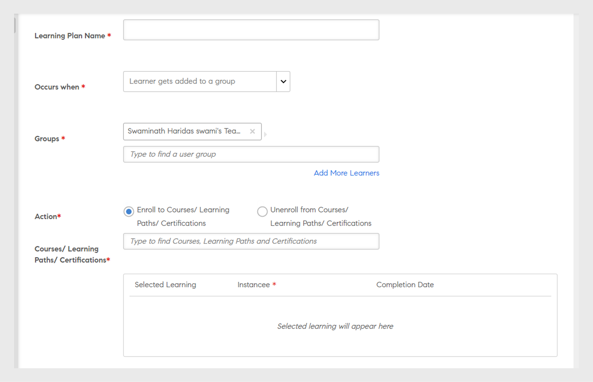
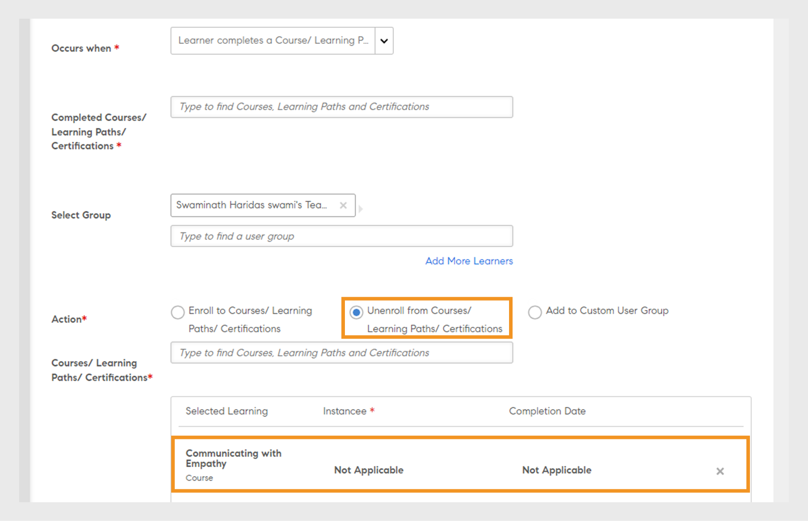
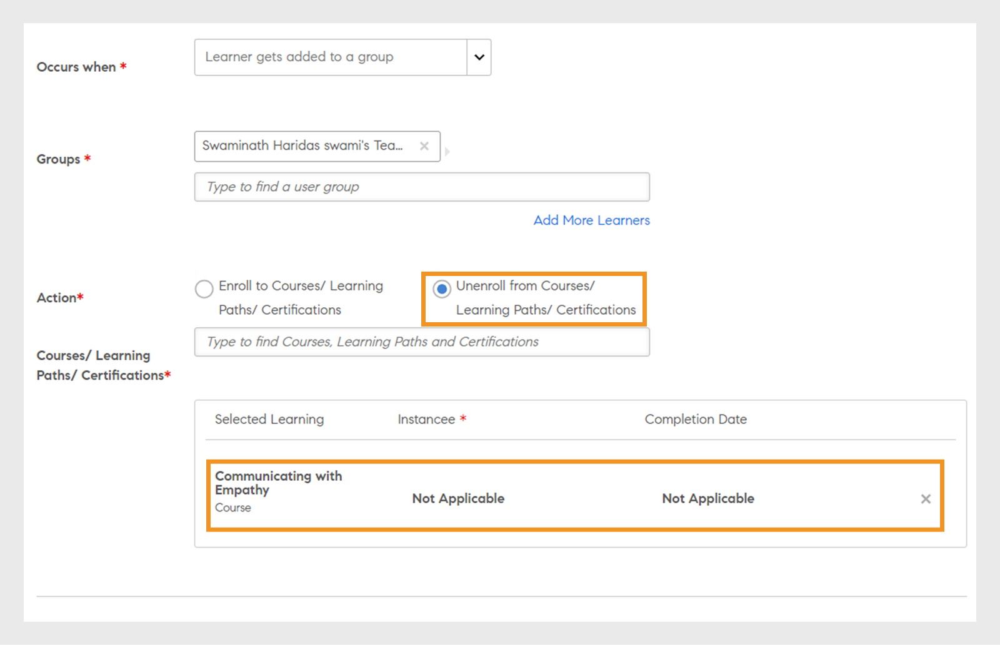

# 학습 계획

Learning Manager의 책임자용 학습 계획을 생성합니다.

## 개요 {#overview}

학습 계획은 규칙 집합으로, 특정 기준에 따라 학습자를 지정된 교육에 등록합니다.

책임자는 학습 계획을 이용하여 새 직원의 온보딩이나 직원 위치 또는 명칭 변경 등과 같은 특정 이벤트에 따라 강의, 학습 프로그램 또는 인증을 자동으로 할당할 수 있습니다.

예를 들어 직원이 조직에 들어오면 새 직원 오리엔테이션 프로그램이 해당 직원에게 자동으로 할당됩니다. 마찬가지로 직원이 관리자로 승진하면 새 관리자 오리엔테이션 프로그램이 해당 직원에게 자동으로 할당됩니다.

미리 정해진 이벤트 집합에 따라 학습자를 모든 강의 및 학습 프로그램에 자동으로 등록할 수 있습니다. 스킬, 강의 또는 학습 프로그램을 완료한 후 이어지는 학습 활동을 자동으로 할당하여 학습자에 대한 학습 경로를 생성할 수 있습니다.

## 학습 계획 생성 {#createlearningplans}

학습 계획을 생성하려면 책임자로 로그인해야 합니다.

1. 왼쪽 창의 **[!UICONTROL 학습 계획]**&#x200B;을 클릭합니다. 기존 이벤트가 있는 경우에는 페이지에서 확인할 수 있습니다. 그러나, 처음으로 학습 계획 기능을 설정한다면 다음 단계로 이동합니다.
1. 페이지 오른쪽 상단 모서리에서 **[!UICONTROL 추가]**&#x200B;를 클릭합니다. **[!UICONTROL 학습 계획 추가]** 대화 상자에서 직원이 수강해야 하는 학습 계획의 이름을 입력합니다.

   

1. **[!UICONTROL 다음과 같은 경우 발생]** 드롭다운 목록에서 필요한 이벤트를 선택합니다. 옵션은 학습자가 강의를 언제 수강할지 결정합니다. 이벤트 유형을 선택한 후 적절한 교육, 강의, 학습 프로그램 또는 인증을 선택합니다.

>[!NOTE]
>
> 책임자 및 작성자는 자동 등록 이벤트를 만들 수 있습니다.

이벤트는 다음과 같습니다.

**1 - 새 학습자 추가됨:** 새 사용자나 직원이 조직에 가입할 때

**2 - 학습자가 그룹에 추가됩니다.** 새 사용자나 직원이 그룹에 가입할 때  이 이벤트를 적용할 수 있는 드롭다운 목록의 사용자 그룹을 입력하고 선택합니다. 다수의 그룹을 선택할 수 있습니다. 또한, 옵션을 선택하면 해당 그룹의 모든 기존 구성원에게 이 이벤트를 할당할 수도 있습니다.

이 학습 계획은 ***사용자 정의- 그룹*** 사용자에 맞게 설계되었습니다. 필드에 그룹 이름을 입력하고 타이프 어헤드 검색을 사용하여 그룹을 선택합니다.

**3 - 학습자가 그룹에서 제거됩니다.** 이벤트는 사용자 또는 학습자가 그룹에서 제거되면 트리거됩니다. 이 이벤트를 적용할 수 있는 드롭다운 목록의 사용자 그룹을 입력하고 선택합니다. 여러 그룹을 선택할 수 있습니다.

**4 - 학습자가 강의/학습 경로/인증을 완료합니다.** 이벤트는 학습자가 강의, 학습 프로그램 등과 같은 학습 개체를 완료하면 트리거됩니다. 이 이벤트가 적용될 학습 객체를 선택합니다. 이벤트 완료 상태를 선택합니다. 또한, 학습자가 속한 사용자 그룹을 선택할 수도 있습니다. 학습 객체를 완료한 다음에 이 이벤트가 시작하는 날짜 수를 입력합니다. 이 학습 개체를 이미 완료한 기존 사용자에게 이 이벤트를 할당하려면 이 옵션을 선택합니다.

**5 - 학습자가 강의 모듈을 통과하지 못함:** 이벤트는 학습자가 강의, 학습 프로그램 등과 같은 학습 객체에 실패하면 트리거됩니다. 이 이벤트가 적용될 학습 객체를 선택합니다. 이 학습자가 속한 사용자 그룹을 선택할 수도 있습니다.

**4 - 학습자가 스킬 레벨을 달성합니다.** 스킬 이름을 입력하고 스킬 레벨을 선택합니다. 또한, 학습자가 속한 사용자 그룹을 선택할 수도 있습니다. 이는 선택 사항입니다. 스킬을 획득한 다음에 이 이벤트가 시작하는 날짜 수를 입력합니다. 이 스킬을 이미 습득한 기존 학습자에게 이벤트를 할당하려면 이 옵션을 선택합니다.

또한 며칠 후에 학습 계획을 학습자에게 할당해야 하는지 날짜 수를 설정합니다.

**5 - 특정 날짜:** 이벤트가 특정 날짜에 발생해야 하는 경우 이벤트를 할당해야 하는 날짜를 선택합니다. 이벤트를 자동으로 할당받아야 하는 사용자 그룹을 선택합니다. 할당해야 할 인스턴스를 선택하고, 필요하면 며칠 후에 이벤트를 시작해야 하는지 날짜 수를 입력합니다.

1. 모든 이벤트는 **[!UICONTROL 인스턴스]** 드롭다운 목록에서 인스턴스를 선택할 수 있습니다. 모든 이벤트에 대해 할당된 학습의 인스턴스를 선택할 수도 있습니다.

   

   Learning Manager에서 학습 계획은 자체 인스턴스인 Auto를 만듭니다. 그룹(예: 모든 학습자)을 선택하면 기본적으로 학습 계획의 모든 학습자가 Auto 인스턴스에 등록됩니다.

   학습 계획을 저장하면 강의의 학습자 섹션에 있는 **[!UICONTROL 인스턴스 선택]** 드롭다운 목록에 Auto 인스턴스가 옵션으로 표시됩니다.

1. 학습 계획을 저장하려면 **[!UICONTROL 저장]**&#x200B;을 클릭합니다.

## 교육에서 등록 취소 {#unenroll-training}

학습 계획을 추가하는 경우 책임자는 특정 트리거를 기반으로 특정 교육에서 사용자를 등록 취소할 수 있습니다.

책임자 앱에서 **[!UICONTROL 학습 계획]** > **[!UICONTROL 추가]**.

다음 섹션에서는 해당 옵션이 있는 트리거를 나타냅니다 **[!UICONTROL 교육에서 등록 취소]** 이(가) 추가되었습니다.

## 학습자는 그룹에서 제거됩니다. {#learnergetsremovedfromagroup}

1. 하나 이상의 사용자 그룹을 추가합니다. 여러 그룹이 선택된 경우 학습자가 언급된 그룹에서 제거되면 계획이 트리거됩니다.
1. 다음으로 동작 선택 **[!UICONTROL 교육에서 등록 취소]**.

   1. 책임자는 사용자 그룹에서 제거되는 경우 등록 취소되는 사용자로부터 교육을 선택할 수 있습니다.
   1. 인스턴스 및 완료 날짜는 이 시나리오에 적용되지 않습니다.

## 학습자가 교육을 완료합니다. {#learnercompletesatraining}

1. 하나 이상의 사용자 그룹을 추가합니다. 여러 그룹이 선택된 경우 학습자가 지정된 교육을 완료하면 계획이 트리거됩니다.
1. 다음으로 동작 선택 **[!UICONTROL 교육에서 등록 취소]**.

   1. 책임자는 사용자 그룹에 추가되는 경우 등록 취소되는 사용자로부터 교육을 선택할 수 있습니다.
   1. 인스턴스 및 완료 날짜는 이 경우에 적용되지 않습니다.

## 학습자가 강의 모듈에 불합격했습니다

1. 하나 이상의 사용자 그룹을 추가합니다. 여러 그룹이 선택된 경우 학습자가 지정된 교육에 실패하면 계획이 트리거됩니다.
1. 다음으로 동작 선택 **[!UICONTROL 교육에서 등록 취소]**.

   1. 책임자는 사용자 그룹에 추가되는 경우 등록 취소되는 사용자로부터 교육을 선택할 수 있습니다.
   1. 인스턴스 및 완료 날짜는 이 경우에 적용되지 않습니다.

## 학습자가 그룹에 추가됩니다 {#learnergetsaddedtoagroup}

1. 하나 이상의 사용자 그룹을 추가합니다. 여러 그룹이 선택된 경우 학습자가 언급된 그룹에 추가되면 계획이 트리거됩니다.
1. 교육에서 등록 취소로 동작을 선택합니다.

   1. 책임자는 사용자 그룹에 추가되는 경우 등록 취소되는 사용자로부터 교육을 선택할 수 있습니다.
   1. 인스턴스 및 완료 날짜는 이 경우에 적용되지 않습니다.

## 학습자가 스킬 레벨을 달성합니다 {#learnerachievesaskilllevel}

1. 달성해야 하는 스킬을 지정합니다.
1. 하나 이상의 사용자 그룹을 추가합니다. 여러 그룹이 선택된 경우 학습자가 선택한 스킬을 달성하면 계획이 트리거됩니다.

## 특정 날짜에 {#onaspecificdate}

1. 학습자가 등록 취소되어야 하는 날짜를 선택합니다.
1. 하나 이상의 사용자 그룹을 추가합니다. 여러 그룹이 선택된 경우 해당 날짜에 계획이 트리거되며 선택된 그룹의 일부인 사용자가 등록 취소됩니다.
1. 교육에서 등록 취소로 동작을 선택합니다.

   1. 책임자는 지정된 날짜에 등록 취소된 등록 취소되는 사용자로부터 교육을 선택할 수 있습니다.
   1. 인스턴스 및 완료 날짜는 이 경우에 적용되지 않습니다.

## 학습 계획 편집 {#editalearningplan}

책임자는 학습 계획을 생성한 다음 언제든지 이 순서를 수정/업데이트할 수 있습니다. 편집하려면 학습 계획의 이름을 선택하고 **[!UICONTROL 학습 계획 편집]** 팝업 대화 상자가 나타납니다.  **[!UICONTROL 저장]**&#x200B;을 선택합니다.

>[!NOTE]
>
>다음을 수정할 수 없습니다. **[!UICONTROL 다음 경우에 발생합니다.]** 옵션: **[!UICONTROL 학습 계획 편집]** 팝업.

## 학습 계획 활성화 {#enablealearningplan}

기본적으로 생성한 모든 새 학습 계획은 비활성화 상태입니다. 학습자가 할당할 수 있도록 플랜을 활성화해야 합니다. 확인란을 활성화하는 경우 **[!UICONTROL 현재 학습자]**, 이벤트는 자체적으로 활성화됩니다.

학습 계획을 활성화하려면

1. 학습 계획 목록에서 활성화할 계획을 선택합니다.

   

1. 페이지의 오른쪽 상단 모서리에서 **[!UICONTROL 액션]** > **[!UICONTROL 활성화]**. 이렇게 하면 학습 계획이 활성화됩니다.

## 학습 계획 삭제 {#deletealearningplan}

학습 계획을 삭제하려면

1. 학습 계획 목록에서 삭제할 계획을 선택합니다.
1. 페이지의 오른쪽 상단 모서리에서 **[!UICONTROL 액션]** > **[!UICONTROL 삭제]**.

## 학습 계획 비활성화 {#disablealearningplan}

학습 계획을 비활성화하려면

1. **[!UICONTROL 활성화]**&#x200B;탭을 클릭합니다.
1. 학습 계획 목록에서 비활성화할 계획을 선택합니다.
1. 페이지의 오른쪽 상단 모서리에서 **[!UICONTROL 액션]** > **[!UICONTROL 사용 안 함]**. 이를 통해 계획이 **[!UICONTROL 비활성화]** 탭으로 이동합니다.

## 학습 계획 필터링 {#filteralearningplan}

학습 계획을 작성하는 동안 사용된 이벤트 유형에 따라 학습 계획을 필터링할 수 있습니다. **[!UICONTROL 유형]**&#x200B;을 클릭하고 옵션을 선택하면 선택 사항과 일치하는 학습 계획이 표시됩니다.

## 자주 묻는 질문 {#frequentlyaskedquestions}

1. 신입 사원의 온보딩을 위해 자동 등록을 구성하도록 Learning Manager를 어떻게 설정합니까?

   (으)로 **[!UICONTROL 다음 경우에 발생합니다.]** 드롭다운 목록에서 옵션을 선택합니다. **[!UICONTROL 새 학습자 추가됨]**. 그런 다음 학습자의 학습 목표, 인스턴스 및 완료 날짜를 할당합니다. 책임자 및 작성자는 자동 등록 이벤트를 만들 수 있습니다. 이벤트를 만든 후 활성화합니다.

1. 강의실 및 가상 강의실 강의에 대한 학습 계획/자동 등록을 설정하려면 어떻게 해야 합니까?

   필수 세션 세부 사항으로 강의 인스턴스를 설정하는 것이 좋습니다. 그런 다음 학습 계획을 설정하고 강의 인스턴스에 매핑합니다. 강의 인스턴스는 이미 생성되었습니다.

1. 특정 학습 계획에 등록된 학습자 목록을 보려면 어떻게 해야 합니까?

   인스턴스, Auto가 생성되면 **[!UICONTROL 강의]** > **[!UICONTROL 학습자]**&#x200B;에서 필요한 인스턴스를 선택합니다. **[!UICONTROL 인스턴스]** 드롭다운 목록입니다.
