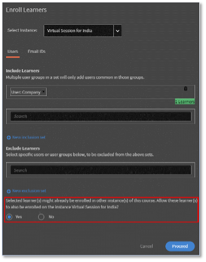

# Adobe Learning Manager 다중 등록

Adobe Learning Manager에서 각 강의는 서로 다른 인스턴스를 보유할 수 있습니다. 계정 관리자는 여러 시간대에 걸쳐 다양한 VILT 세션 인스턴스를 생성하고 특정 사용자 그룹에 대한 세션을 만드는 것이 주요 임무 중 하나입니다.

2023년 7월 릴리스 전에는 책임자가 학습자를 등록할 때 하나의 인스턴스에만 등록할 수 있습니다. 학습자가 다른 인스턴스에서 강의를 수강하기를 원한다면 책임자는 각 인스턴스에 대해 하나씩 많은 강의를 작성했습니다.

Adobe Learning Manager의 다중 등록 기능을 사용하면 책임자가 이러한 상황을 방지할 수 있습니다.

## 다중 등록이란 무엇입니까?

다중 등록은 사용 가능한 다양한 인스턴스를 통해 학습자가 강의에 여러 번 등록됩니다.  학습자는 등록, 완료 또는 아직 시작 전의 상태와 관계없이 여러 강의 인스턴스에 등록할 수 있습니다. 작성자가 [!UICONTROL 복수 등록] 그러면 학습자는 강의의 여러 인스턴스에 등록할 수 있습니다.

*설정에서 다중 등록 실행*

각 인스턴스의 진행 상황을 개별적으로 추적할 수 있고, 보고서를 내보내 각 인스턴스의 진행 상황을 추적할 수 있습니다.

## 중요 요점

* 다중 등록은 강의에 여러 인스턴스가 있는 경우에만 적용됩니다.
* 다중 등록 옵션이 활성화되고 사용자가 여러 인스턴스에 등록되면 학습자 성적 증명서 보고서의 각 강의에 대해 새 행이 생성됩니다(각 인스턴스와 각 학습자에 대해 하나의 행이 생성됨)
* 보고 자동화가 강의당 하나의 행만 예상하도록 설정된 경우, 다중 등록 기능을 사용으로 설정하기 전에 보고 자동화에 필요한 조정을 수행해야 합니다.

## 다중 등록을 활성화하는 방법

1. Adobe Learning Manager 계정에 작성자로 로그인합니다.
1. 학습자가 여러 번 등록할 강의를 선택합니다.
1. 왼쪽 패널에서 **[!UICONTROL 설정]** > **[!UICONTROL 편집]** > **[!UICONTROL 인스턴스 구성]** > **[!UICONTROL 다중 등록 활성화]**.

*다중 등록 활성화*

>[!NOTE]
>
>작성자는 인스턴스 전환과 다중 등록을 동시에 활성화할 수 없습니다.

## 학습자 보기

다중 등록은 학습자가 강의실 또는 VC 강의에 등록하거나 다른 강의로 넘어가기 전에 강의를 다시 완료하고자 할 때 유용합니다.

등록하지 않은 학습자의 경우 강의를 선택하면 여러 인스턴스가 있는 강의 아래 화면이 표시됩니다. 그런 다음 각 인스턴스를 선택하고 등록할 수 있습니다.

*인스턴스 보기*

한 인스턴스에 등록한 후 오른쪽 창에서 모든 인스턴스 보기 옵션을 선택하여 다른 인스턴스에 등록할 수 있습니다.

*인스턴스에 등록*

각 인스턴스에서의 진행 상황은 아래와 같이 추적할 수 있습니다.

*각 인스턴스의 진행률 추적*

## 관리자의 다중 등록 변경 사항

**등록:**

학습자를 등록하는 동안 다음 확인란을 활성화할 수 있습니다.

*&quot;선택한 학습자는 이미 이 강의의 다른 인스턴스에 등록되어 있을 수 있습니다. 이러한 학습자도 인스턴스에 등록할 수 있도록 허용합니다.&quot;*

*관리자용 등록 옵션*

학습자가 이미 하나의 인스턴스에 등록되어 있고 책임자가 다른 강의 인스턴스에 학습자를 등록하려고 하는 경우 예를 선택합니다.

## 보고

동일한 강의의 두 인스턴스에 등록된 학습자의 경우 각 강의 인스턴스에 대해 두 행이 생성됩니다. 또한 보고서에는 인스턴스의 진행 상태가 표시됩니다.
