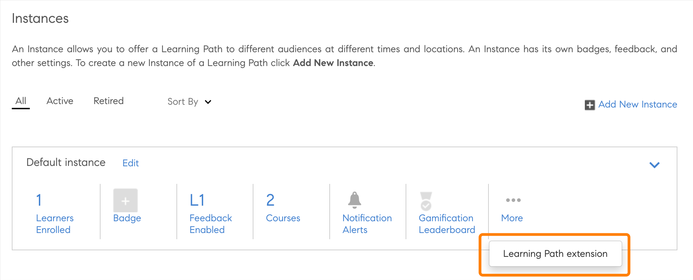

# 기본 확장성

기본 버전의 Adobe Learning Manager에서 사용자 정의 경험을 설정할 수 있으므로 덜 복잡한 경우에는 헤드리스를 사용하지 않아도 됩니다. 사용자 정의 앱을 만들고 학습자, 관리자, 책임자, 작성자 또는 강사 워크플로의 기본 버전에서 다양한 지점에 배치할 수 있습니다.

Adobe Learning Manager는 책임자, 작성자, 학습자, 관리자 및 강사 앱에서 15개의 호출 지점을 지원합니다.

## 확장 기능 만들기

1. 책임자의 경우 왼쪽 패널에서 **[!UICONTROL 기본 확장 기능]**&#x200B;을 선택합니다.
1. 확장 프로그램 추가 를 선택합니다.
1. 확장명 입력 **[!UICONTROL 이름]** 필드.
1. 확장에 대한 설명을 **[!UICONTROL 설명]** 필드.
1. 호출 지점을 선택합니다. 호출 지점은 Adobe Learning Manager에서 사용자 정의 앱에 링크나 버튼을 삽입할 수 있는 모든 위치입니다. 다음과 같은 호출 지점을 사용할 수 있습니다.

   이 예제에서는 **[!UICONTROL 관리자]**, **[!UICONTROL 작성자: 과정]**, **[!UICONTROL 학습 경로]** - **[!UICONTROL 인스턴스]** - **[!UICONTROL 인스턴스 행]**.

   
   *호출 지점 선택*

1. UI에 표시될 확장 레이블을 **[!UICONTROL 확장 레이블]** 필드.
1. **[!UICONTROL URL]** 필드에 확장 기능을 호스팅할 URL을 입력합니다.
1. 열기 드롭다운에서 확장 프로그램을 모달로 시작할지 아니면 새 탭으로 시작할지 선택합니다.
1. 양식 크기를 선택합니다. 옵션을 선택한 경우 사용할 수 있습니다 *인앱* 이전 단계의 모달.

   팝업 내에서 액세스 가능성을 유지하려면 확장 앱이 웹 사이트의 마지막 포커스 가능 요소에 있을 때 이벤트로 전송되어야 하고, 그런 다음 사용자가 TAB 키를 선택해야 합니다. 접근성을 지원하기 위해 팝업 내부의 초점을 유지하는 데 필요합니다.

   ```
   window.parent.postMessage({*}
   
   { type: 'ALM_EXTENSION_APP', eventType: 'trapFocusInModal' }
   
   ,{}'');
   ```

1. 확장 기능의 범위를 설정합니다. 다음과 같은 범위를 사용할 수 있습니다.

   * **[!UICONTROL 모든 강의, 학습 경로 및 인증]**: 이 확장 프로그램은 모든 과정, 학습 경로 및 인증에 대해 활성화됩니다. 작성자는 책임자와 함께 일부 과정, 학습 경로 및 인증에 대해 비활성화할 수 있습니다.
   * **[!UICONTROL 선택한 강의, 학습 경로 및 인증]**: 이 확장 프로그램은 모든 과정, 학습 경로 및 인증에 대해 비활성화되어 있습니다. 작성자는 책임자와 함께 일부 과정, 학습 경로 및 인증에 대해 활성화할 수 있습니다.

1. **[!UICONTROL 활성화]** 전환을 선택하여 확장 기능을 활성화합니다. 활성화하면 범위에 따라 지정된 호출 지점에 확장 프로그램이 나타납니다.
1. 페이지 오른쪽 상단 모서리에 있는 **[!UICONTROL 저장]**&#x200B;을 선택하여 확장 기능을 만듭니다.

## 관리자로 확장 기능에 액세스

1. 책임자의 경우 왼쪽 도구 모음에서 **[!UICONTROL 학습 경로]**&#x200B;를 선택합니다.
1. 강의 > **[!UICONTROL 학습 경로 보기]**&#x200B;를 선택합니다.
1. 왼쪽 패널에서 **[!UICONTROL 인스턴스]**&#x200B;를 선택합니다.
1. 인스턴스 섹션에서 **[!UICONTROL 자세히]**&#x200B;를 선택합니다. 확장 기능은 인스턴스 섹션에 표시됩니다.

   
   *확장 기능 선택*

   확장 기능을 선택하면 확장 기능이 모달로 표시됩니다.

## 작성자로 확장 기능에 액세스

1. 책임자의 경우 왼쪽 도구 모음에서 **[!UICONTROL 학습 경로]**&#x200B;를 선택합니다.
1. 강의 > **[!UICONTROL 학습 경로 보기]**&#x200B;를 선택합니다.
1. 왼쪽 패널에서 **[!UICONTROL 인스턴스]**&#x200B;를 선택합니다.
1. 인스턴스 섹션에서 **[!UICONTROL 자세히]**&#x200B;를 선택합니다. 확장 기능은 인스턴스 섹션에 표시됩니다.

   
   *작성자로 확장 프로그램 액세스*

   확장 기능을 선택하면 확장 기능이 모달로 표시됩니다.

## 모든 확장 기능 보기

관리자는 기본 확장 프로그램 페이지에서 모든 확장 프로그램을 볼 수 있습니다. 목록을 보려면 앱의 왼쪽 패널에서 기본 확장 기능을 선택합니다.


*모든 확장 프로그램 보기*

## 확장 기능 활성화 또는 비활성화

작성자는 강의 설정 페이지에서 강의, 인증 또는 학습 경로의 확장 기능을 활성화하거나 비활성화할 수 있습니다.


*확장 프로그램 활성화*

## 액세스 키 공유

등록 확장 기능을 구성하려면 액세스 키를 공유해야 합니다.

이 키가 생성되어 공유되지 않으면 등록 인증이 실패하고 학습자가 강의에 직접 등록할 수 없기 때문에 중요합니다.

과정 또는 학습 경로와 인증서에 등록하려면 액세스 키를 공유해야 합니다.

설정 탭에서 키를 생성합니다.


*액세스 키 공유*

## 확장 기능 보고서 다운로드

이 보고서를 다운로드하는 방법에는 두 가지가 있습니다.

**확장 프로그램 구성 보고서**

1. 기본 확장 기능 페이지에서 **[!UICONTROL 확장 기능 구성 보고서]**&#x200B;를 선택합니다.

   
   *확장 보고서 다운로드*

   보고서가 생성됩니다.

1. 확인 을 선택합니다.

   
   *보고서 생성*

    보고서에는 다음과 같은 필드가 포함됩니다.

   * 확장 이름
   * 호출 점수
   * 라벨
   * URL에서 열기
   * 범위
   * 활성화
   * LO 고유 ID
   * 교육 ID
   * 교육 유형
   * 교육 이름

**보고서 페이지**

1. 위치 **[!UICONTROL 보고서]** > **[!UICONTROL 사용자 정의 보고서]**, 선택 **[!UICONTROL 확장 프로그램 구성 보고서]**.

   
   *보고서 페이지에서 보고서 다운로드*

상태가 범위 내에 있어야 합니다. **0 - 4294967295**&#x200B;을 선택합니다.
