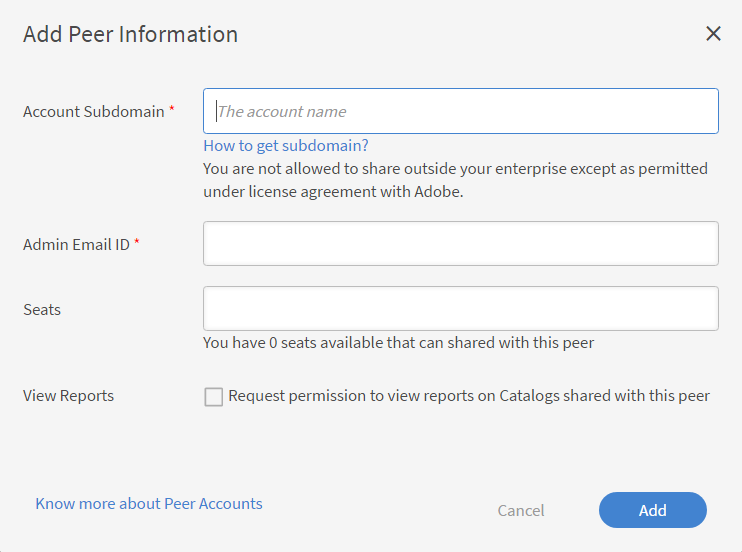

# 피어 계정

이 문서에서 Learning Manager 피어 계정을 생성 및 관리하는 방법을 알아보십시오.

Learning Manager에서는 피어 계정 기능을 사용하면 구입한 시트를 공유할 수 있도록 기능을 제공합니다. Learning Manager에서 피어 계정을 사용하면 책임자는 구입한 시트를 책임자와 연결된 피어 계정과 공유할 수 있습니다. 또한, 시트 공유를 시작한 책임자는 피어 계정 보고서를 볼 수 있습니다.

## 피어 계정 추가 {#addapeeraccount}

1. 관리자 대시보드에서 **[!UICONTROL 설정]** > **[!UICONTROL 피어 계정]**&#x200B;을 클릭합니다.
1. 오른쪽 상단에서 **[!UICONTROL 추가]**&#x200B;를 클릭합니다.

   

   *피어 계정 추가*

1. **[!UICONTROL 계정 하위 도메인]** 필드에서 피어 계정을 설정할 하위 도메인을 지정합니다.

   

   *하위 도메인 추가*

>[!NOTE]
>
>다른 계정의 하위 도메인을 찾으려면 계정의 URL을 확인하십시오. 하위 도메인은 기본 도메인 앞에 표시되며 특정 계정을 식별하는 데 도움을 줍니다.
>
>For example:
>
>URL [https://www.learningmanager.com/accountname](https://www.learningmanager.com/accountname)에서 하위 도메인은 **accountname**&#x200B;입니다.
>
>URL [https://www.accountname.learningmanager.com](https://www.accountname.learningmanager.com)에서 하위 도메인도 **accountname**&#x200B;입니다.
>
>하위 도메인은 각 계정에 고유하며 해당 Learning Manager 인스턴스에 액세스하는 데 사용됩니다.

1. 피어 계정 요청을 수락하거나 거부할 책임자의 이메일 ID를 입력합니다.
1. 동료와 공유할 시트 수를 지정합니다. 피어 계정과 시트를 공유하면 피어 계정은 받은 시트 또는 피어 자체 구매 시트와 함께 활성 상태로 전환됩니다.

   이용 가능한 좌석보다 많은 숫자를 입력하면 시스템에서 경고를 표시합니다.

1. 피어의 등록 보고서 및 공유 카탈로그 리포트를 보려면 확인란을 선택하십시오.
1. 피어 계정을 추가하려면 &#39;추가&#39;를 클릭합니다.

   책임자가 동료와 좌석을 공유하면 동료는 다른 사람과 좌석을 공유할 수 없습니다. 그러나 동료가 일부 좌석을 별도로 구입하여 공유할 수 있습니다.

## 피어 계정에서 공유한 시트 보기

책임자는 책임자 인터페이스에서 피어 계정이 공유한 시트 수를 볼 수 있습니다.

피어 계정에서 공유한 시트를 보려면:

1. 관리자 권한으로 Adobe Learning Manager에 로그인합니다.
2. **[!UICONTROL 사용자]**&#x200B;를 선택한 다음 **[!UICONTROL 내부]**&#x200B;를 선택합니다.

_피어 계정에서 공유한 시트 수를 보여 주는 사용자 섹션_

## 피어 계정 관련 보고서 보기 {#viewreportsassociatedwithpeeraccounts}

피어 계정을 설정하면 피어 계정 관련 보고서도 구성할 수 있습니다. 책임자가 피어 계정 요청을 시작하면 피어 계정 관련 보고서를 볼 수 있습니다.

또한 피어도 책임자 보고서를 보길 원한다면 별도의 피어 계정 요청을 책임자에게 보내야 합니다.

피어 계정에 공유 카탈로그를 생성하고 보는 방법에 대한 자세한 내용은 [피어 보고서 보기](reports.md#main-pars_header_894271250)를 참조하십시오.

## 피어 계정 삭제 {#deletingpeeraccounts}

더 이상 계정에서 시트나 구매를 공유하지 않으려면 피어 계정을 삭제할 수 있습니다.

1. Learning Manager 책임자 앱에서 &#39;설정&#39; > &#39;피어 계정&#39;을 선택합니다.
1. 삭제할 피어 계정을 선택합니다.
1. 다음 중 하나를 실행합니다.

   * 페이지 오른쪽 상단 모서리에 있는 &#39;삭제&#39;를 클릭합니다.
   * 삭제하려는 피어 계정 옆에 있는 삭제 아이콘을 클릭합니다.

   피어 계정을 삭제하면 받은 시트가 더 이상 공유되지 않습니다. 피어 계정에 시트만 받고 구매한 시트가 없으면 해당 계정은 비활성 상태로 전환됩니다.

## 피어 계정에 대한 사용자 보고서 {#download-peer-account}

책임자는 피어 계정의 사용자 보고서를 볼 수 있습니다. 상위 계정 책임자는 보고서에 액세스하도록 요청할 수 있으며 피어 계정 책임자가 이를 수락하면 상위 책임자는 피어 계정에 등록된 사용자 수를 볼 수 있게 되며 피어 계정에 대한 사용자 보고서를 다운로드할 수 있게 됩니다.

1. 피어 계정 페이지에서 **[!UICONTROL 추가]**&#x200B;를 클릭합니다.
1. **[!UICONTROL 전체 계정에 대한 사용자 보고서를 다운로드할 수 있는 권한 요청]** 옵션을 활성화합니다.

*피어 계정의 사용자 보고서 보기*

피어 계정에 대한 보고서를 다운로드하려면 **[!UICONTROL 다운로드]**&#x200B;를 클릭하십시오.

## 자주 묻는 질문 {#frequentlyaskedquestions}

+++하나의 계정에서 다른 계정으로 시트를 공유하는 방법

피어 계정을 추가하는 경우 다른 피어 계정과 공유할 수 있는 시트 개수를 지정합니다.

*한 계정에서 다른 계정으로 시트 공유*
+++
