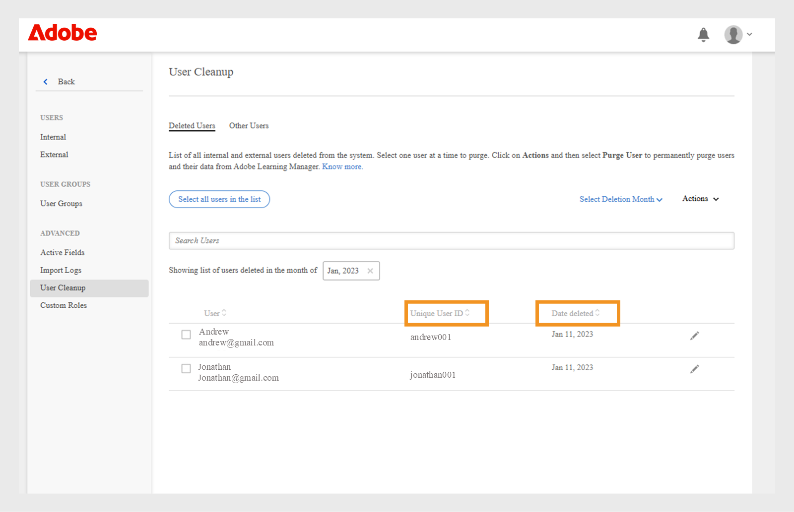

# 사용자 제거

Learning Manager의 사용자 데이터 제거에 관해 자세히 알아봅니다.

## 개요 {#overview}

사용자 제거 기능을 사용하여 사용자의 개인 식별 정보와 학습 기록을 Learning Manager에서 제거합니다. &#39;사용자 삭제&#39;와 &#39;사용자 제거&#39;는 다른 기능입니다. 삭제된 사용자는 복원할 수 있지만 제거된 사용자와 그에 관련된 모든 사용자 데이터 및 학습 레코드는 복원할 수 없습니다.

사용자 제거 작업은 다음과 같은 결과를 가져옵니다.

* 사용자를 제거하면 가져오기 로그의 링크가 작동하지 않아 이전 CSV가 다운로드되지 않고 사용자 데이터가 다시 시스템으로 복구됩니다.
* 작성자가 제거되면 작성자의 이름은 해당 사용자를 제거한 책임자의 이름으로 대체됩니다.
* 강사가 제거되면 세션에서 삭제됩니다. 책임자는 이러한 세션의 강사를 교체/추가해야 합니다.
* Learning Manager에서 사용자를 제거하여도 외부 응용 프로그램(타사 시스템 또는 사용자가 작성한 기타 응용 프로그램)에서는 해당 사용자가 제거되지 않습니다. 외부 응용 프로그램 소유자에게 문의하여 해당 응용 프로그램에서 사용자를 제거할 수 있습니다.
* 커넥터 설정 구성에서 사용자 제거를 참조하면 커넥터가 비활성화됩니다. 다시 시작하려면 책임자가 커넥터를 재구성해야 합니다.

<!---### Manage users

In this training, you will learn how to assign and remove roles, send a welcome email, and delete and purge users. 

If you're unable to launch the training, write to <almacademy@adobe.com>.-->

## 사용자 제거 방법

사용자를 제거하려면 다음 단계를 따르십시오.

1. 책임자가 왼쪽 창에서 **[!UICONTROL 사용자]**&#x200B;를 클릭합니다. **[!UICONTROL 내부 사용자]** 페이지가 열립니다.
1. 제거할 사용자를 삭제합니다. 삭제하려면 확인란을 사용하여 하나 이상의 사용자를 선택합니다. **[!UICONTROL 작업]** 드롭다운을 열고 **[!UICONTROL 사용자 삭제]**&#x200B;를 선택합니다.
1. 왼쪽 창에서 **[!UICONTROL &#39;사용자 정리&#39;]**&#x200B;를 클릭합니다. 삭제된 사용자 목록과 함께 **[!UICONTROL 사용자 정리]** 페이지가 나타납니다. 라디오 버튼을 사용하여 제거할 사용자를 선택합니다. 한 번에 한 명의 사용자만 제거할 수 있습니다.

   

   *제거할 사용자 선택*

1. **[!UICONTROL 작업]** 드롭다운 메뉴를 열고 **[!UICONTROL 사용자 제거]**&#x200B;를 선택합니다.

   

   *사용자 제거 옵션 선택*

1. 확인을 요청하는 대화 상자가 나타납니다. 제거하면 선택한 사용자와 관련된 모든 사용자 데이터 및 학습 레코드가 영구적으로 삭제됩니다. 제거 후에는 작업을 취소할 수 없습니다. 확인하려면 **[!UICONTROL 제거]**&#x200B;를 클릭하세요.

   

   *사용자를 삭제한 후 확인 메시지*

1. 확인 후 &#39;제거&#39;를 클릭하면 &#39;제거&#39; 요청이 수락됩니다. 작업이 완료되면 알림을 받습니다. 제거 요청 ID도 제공됩니다. 이 ID를 CSM에 제공하여 요청을 추적할 수 있습니다.

>[!NOTE]
>
>삭제한 사용자를 시스템에 다시 추가하면 이전 역할(예: 관리자, 관리자, 작성자, 강사 등)이 유지되지 않습니다. 학습자 역할과 함께 추가됩니다.

## 사용자 일괄 제거

처음 사용자 50명을 선택하고 한 번에 제거할 수 있습니다. 그러면 책임자는 50명의 사용자를 선택하고 한 번에 제거할 수 있습니다. 책임자가 사용자를 대량으로 제거하려는 경우 유용합니다. 항상 제거 대상으로 선택된 사용자를 확인하는 것이 좋습니다. 올바른 사용자 그룹만 제거되도록 확인하는 것이 중요합니다.

*사용자 일괄 제거*

## 삭제하기 전에 삭제된 사용자 필터링

Adobe Learning Manager을 통해 관리자는 플랫폼에서 이미 삭제된 사용자를 영구적으로 제거할 수 있습니다. 삭제 라고 하는 이 프로세스는 조직이 깨끗한 학습자 데이터베이스를 유지 관리하고 데이터 보존 정책을 준수하며 사용자 데이터에 대한 무단 액세스를 방지하는 데 도움이 됩니다.
이는 데이터 위생을 유지하고 오래되고 사용하지 않는 사용자 데이터가 시스템에서 제거되도록 하는 데 특히 유용합니다.
사용자 제거는 데이터 개인정보 보호 지침을 준수하거나 중복 레코드를 제거하여 기밀 데이터 저장소를 유지하는 데 필수적입니다.

### 삭제된 사용자를 월별 기준으로 필터링

삭제된 사용자를 특정 달을 선택한 후 영구적으로 삭제하여 필터링할 수 있습니다.

삭제 월을 사용하여 삭제된 사용자를 필터링하려면 다음을 수행하십시오.

1. 관리자 홈 페이지에서 **[!UICONTROL 사용자]**&#x200B;를 선택한 다음 **[!UICONTROL 사용자 정리]**&#x200B;를 선택합니다.
2. **[!UICONTROL 삭제 월 선택]** 날짜 선택기를 선택하고 날짜를 선택합니다.

   
   _사용자가 삭제된 월 선택_

   선택한 월에 삭제된 사용자 목록이 나타납니다.

   
   _선택한 월에 표시된 삭제된 사용자 목록_

### 월별 삭제된 사용자 정렬

필터링된 사용자를 **[!UICONTROL 고유 사용자 ID]** 및 **[!UICONTROL 삭제된 날짜]**&#x200B;를 기준으로 정렬할 수 있습니다.

1. 삭제된 사용자 목록에서 사용자의 사용자 ID 또는 삭제 날짜에 따라 사용자를 정렬합니다.

   
   _고유 사용자 ID로 필터링된 사용자 목록_

2. 한 명 또는 여러 명의 사용자를 선택합니다.
3. **[!UICONTROL 작업]**&#x200B;을 선택한 다음 **[!UICONTROL 사용자 제거]**&#x200B;를 선택합니다.
4. Adobe Learning Manager에서 사용자 레코드를 영구적으로 삭제하려면 확인 메시지에서 제거 를 선택합니다.

   
   _사용자를 영구적으로 제거하기 전에 최종 확인_

>[!NOTE]
>
>사용자를 제거하면 해당 데이터가 영구적으로 제거됩니다. 계속하기 전에 선택 항목을 다시 확인합니다.

+++사용자 제거 작업의 결과에 대해 읽어보기

<table>
 <tbody>
  <tr>
   <th><strong>Learning Manager UI를 이용한 제거- 기업</strong></th>
   <th> </th>
  </tr>
  <tr>
   <td>요청받은 기업 계정에서 선택한 사용자를 삭제합니다. </td>
   <td>예</td>
  </tr>
  <tr>
   <td>전자 메일, adobe_id가 선택된 사용자 전자 메일과 일치하는 모든 평가판 계정에서 모든 사용자를 삭제합니다.</td>
   <td>예</td>
  </tr>
  <tr>
   <td>전자 메일, adobe_id가 선택된 사용자 전자 메일과 일치하고 자신이 평가판 계정 생성자인 모든 평가판 계정에서 모든 사용자를 삭제합니다.</td>
   <td>아니오</td>
  </tr>
  <tr>
   <td>요청하는 기업 계정 및 모든 체험판 계정의 다른 모든 필드에서 사용자 이메일을 삭제합니다.</td>
   <td>예</td>
  </tr>
  <tr>
   <td>이니시에이터에게 삭제 확인을 알립니다.</td>
   <td>예</td>
  </tr>
  <tr>
   <td><strong>Learning Manager UI를 이용한 제거 - 비기업</strong></td>
   <td> </td>
  </tr>
  <tr>
   <td>요청된 평가판 계정에서 선택한 사용자를 삭제합니다.</td>
   <td>예</td>
  </tr>
  <tr>
   <td>전자 메일, adobe_id가 선택된 사용자 전자 메일과 일치하는 모든 평가판 계정에서 모든 사용자를 삭제합니다.</td>
   <td>예</td>
  </tr>
  <tr>
   <td>전자 메일, adobe_id가 선택된 사용자 전자 메일과 일치하고 자신이 평가판 계정 생성자인 모든 평가판 계정에서 모든 사용자를 삭제합니다.</td>
   <td>아니오</td>
  </tr>
  <tr>
   <td>모든 체험판 계정의 다른 모든 필드에서 사용자 이메일을 삭제합니다.</td>
   <td>예</td>
  </tr>
  <tr>
   <td>이니시에이터에게 삭제 확인을 알립니다.</td>
   <td>예</td>
  </tr>
  <tr>
   <td><strong>다른 사용자 제거 - 기업(내부 또는 외부 Learning Manager 사용자가 아닌 개인)</strong></td>
   <td> </td>
  </tr>
  <tr>
   <td>요청받은 기업 계정과 모든 평가판 계정의 다른 모든 영역에서 선택한 사용자를 삭제합니다.</td>
   <td>예</td>
  </tr>
  <tr>
   <td>계정에서 사용자 삭제.</td>
   <td>아니오</td>
  </tr>
  <tr>
   <td>이니시에이터에게 삭제 확인을 알립니다. </td>
   <td>예</td>
  </tr>
  <tr>
   <td><strong>제거</strong> <strong>기타 사용자 - 비기업(내부 또는 외부 Learning Manager 사용자가 아닌 개인)</strong></td>
   <td> </td>
  </tr>
  <tr>
   <td>요청받은 모든 평가판 계정의 다른 모든 영역에서 선택한 사용자를 삭제합니다.</td>
   <td>예</td>
  </tr>
  <tr>
   <td>계정에서 사용자 삭제.</td>
   <td>아니오</td>
  </tr>
  <tr>
   <td>이니시에이터에게 삭제 확인을 알립니다.</td>
   <td>예</td>
  </tr>
  <tr>
   <td><strong>Adobe IMS를 이용한 제거 - 기업</strong></td>
   <td> </td>
  </tr>
  <tr>
   <td>기업 관리자에게 요청을 알립니다.</td>
   <td>예</td>
  </tr>
  <tr>
   <td>알림 전송을 위한 전자 메일 영역을 선택합니다.</td>
   <td>아니오</td>
  </tr>
  <tr>
   <td><strong>Adobe IMS를 이용한 제거 - 비기업</strong></td>
   <td> </td>
  </tr>
  <tr>
   <td>무료 평가판 계정에서 제공받은 AdobeID/Email을 가진 모든 사용자를 삭제합니다.</td>
   <td>예</td>
  </tr>
  <tr>
   <td>계정 생산자가 Email/AdobeId를 제공받은 경우 평가판 계정의 모든 사용자를 삭제합니다.</td>
   <td>예</td>
  </tr>
  <tr>
   <td>모든 평가판 계정의 다른 모든 영역에서 선택 전자 메일 ID를 삭제합니다.</td>
   <td>예</td>
  </tr>
 </tbody>
</table>

+++

## 자주 묻는 질문 {#frequentlyaskedquestions}

+++일괄 요청 시 완료하는 데 얼마나 걸립니까?

사용자 제거 요청은 완료하기까지 최대 30일이 소요됩니다.
+++

+++Adobe Learning Manager에서 일괄 제거를 수행할 수 있습니까?

예, 일괄적으로 제거할 수 있습니다. 하지만, 50명의 사용자만 일괄적으로 제거할 수 있습니다.
+++

+++제거된 사용자를 복원할 수 있습니까?

아니요. 사용자 데이터가 제거되면 모든 데이터가 영구적으로 삭제되며 복구할 수 없습니다.

+++
