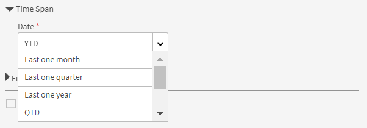
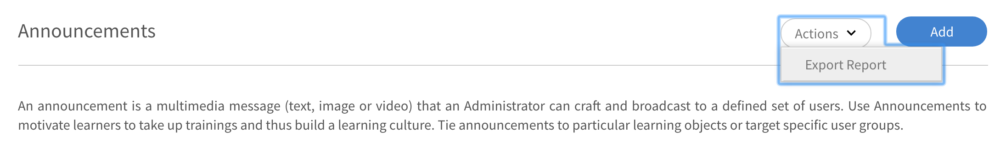

# 보고서

Learning Manager 응용 프로그램에서 책임자 역할과 관련된 보고서에 관해 알아봅니다.

Adobe Learning Manager에서는 학습자 활동을 추적, 모니터링 및 제어하는 다양한 보고서를 생성할 수 있습니다. 학습자의 활동이 추적되고 데이터베이스에 자동으로 캡처됩니다. 관리자 및 관리자 보고서는 데이터베이스에서 생성됩니다.

## 개요 {#overview}

책임자와 관리자의 보고서 생성 프로세스는 둘 다 유사합니다. 관리자는 자신의 하위 보고서를 볼 수 있지만 책임자는 조직 전체의 모든 보고서를 볼 수 있습니다.

보고서는 대시보드에서 집계됩니다. 보고서는 대시보드 내에 있어야 합니다. A **[!UICONTROL 기본 대시보드]** 이(가) 보고서 페이지에 기본적으로 있습니다. 사용자가 추가한 보고서가 이 기본 대시보드로 이동합니다. 개별 대시보드에 보고서를 추가하려면 드롭다운 화살표를 사용하여 다음을 선택합니다 **[!UICONTROL 보고서 추가]**. 대시보드 작성에 대한 자세한 내용은 이 페이지의 대시보드 섹션을 참조하십시오.

## 학습 요약 대시보드 {#dashboards}

플랫폼의 모든 학습 활동에 대한 요약 보고서를 참조하십시오. 이 페이지에서는 선택한 루트 사용자의 팀 및 외부 프로필에 대한 다음과 같은 요약 정보를 확인할 수 있습니다. 시간 범위도 선택할 수 있습니다.

* 등록, 보기 및 완료 형태의 학습 요약
* 최상위 스킬
* 준수 요약

*요약 차트*

내부 루트 수준 관리자가 있는 경우 해당 관리자가 차례로 표시됩니다.

모든 외부 프로필은 내부 프로필(내부 루트 수준 사용자) 다음에 나열됩니다.

외부 프로파일에 관리자가 있으면 관리자 계층이 **[!UICONTROL 데이터 표시 대상]** 드롭다운 목록입니다. - 사용자는 모든 세부 정보 페이지의 관리자 계층에 나열됩니다(학습 요약, 준수 및 스킬 상태).

그렇지 않으면 모든 개별 사용자 세부 정보가 목록에 표시됩니다.

다양한 내부 팀의 등록에 대한 자세한 내용을 보려면 을(를) 클릭하십시오. **[!UICONTROL 학습 요약 세부 정보]**.

*학습 요약 세부 정보*

등록을 클릭하면 각 관리자의 학습자와 학습 객체가 등록된 학습자를 확인할 수 있습니다. 각 학습자의 진행 및 완료 세부 정보를 확인할 수도 있습니다.

*관리자에게 할당된 학습자*

팀을 클릭하고 해당 보고서를 csv로 내보냅니다. 책임자는 사용자 그룹 또는 개별 사용자를 선택하여 사용자 그룹 또는 개별 사용자에 대한 보고서를 내보낸 다음 동작 드롭다운 목록에서 세부 정보를 내보낼 수 있습니다.

또한 진행 중이며 습득한 스킬에 대한 막대 차트 보기도 확인할 수 있습니다. 그래프에 표시할 스킬을 추가/제거할 수 있습니다.

*스킬 상태 누적 가로 막대 차트*

최종 시각화에서 학습자의 준수 상태를 확인하고 적절한 조치를 취할 수 있다.

또한 책임자는 준수 대시보드에서 개별 교육 데이터를 볼 수 있습니다.

예를 들어, 책임자가 준수를 추적하기 위해 세 가지 교육을 확인했습니다. Learning Manager는 세 가지의 모든 교육에 대한 준수 스냅샷을 한 번에 제공합니다.

이제 책임자는 교육을 클릭하고 선택한 교육에 관한 준수를 빠르게 볼 수 있습니다.

*준수 대시보드 보기*

각 내부 팀의 준수 상태를 확인할 수도 있습니다.

링크를 클릭합니다. **[!UICONTROL 준수 상태 세부 정보]** 를 클릭합니다.

팀의 경우 팀 내 학습자 수가 학습 준수 사항을 위반하거나 준수하고 있음을 확인할 수 있습니다.

*팀의 규정 준수 상태*

## 관리자와 교육 공유

Learning Manager는 모든 책임자와 관리자에게 준수 대시보드를 제공합니다. 관리자는 특정 교육에 대한 팀 구성원의 준수를 추적하는 것이 매우 유용하다는 것을 확인할 수 있습니다. 동시에 책임자는 모든 관리자가 대시보드에 준수 교육을 추가하고 추적하기를 희망합니다.

Learning Manager에서 **[!UICONTROL 관리자와 공유]** 책임자는 워크플로우를 통해 관리자와 교육을 공유하고 관리자의 준수 대시보드에 추가할 수 있습니다. 따라서 관리자는 조치를 취할 필요가 없으며 즉시 준수 추적을 시작할 수 있습니다.

책임자는 일련의 교육 과정을 관리자와 개별적으로 또는 그룹과 공유할 수 있습니다. 이러한 공유를 통해 관리자는 지정된 교육에 대한 팀의 준수를 쉽게 추적할 수 있습니다.

책임자는 준수 교육의 기본 목록을 &#39;푸시&#39;하여 관리자의 준수 대시보드에서 볼 수 있게 할 수 있습니다.

### 교육 공유

1. 위치 **[!UICONTROL 보고서]** > **[!UICONTROL 학습 요약]**&#x200B;을 누르고 아래로 스크롤하여 탭을 클릭합니다 **[!UICONTROL 관리자와 공유]**.

   
   *관리자와 교육 공유*

1. 교육 또는 다중 교육을 추가하려면 **[!UICONTROL 공유 항목 추가]**.

1. (으)로 **[!UICONTROL 관리자와 공유]** 대화 상자에서 교육과 관리자를 선택합니다.

   
   *관리자와 공유할 교육 선택*

1. 다음을 수행합니다. **[!UICONTROL 공유]**.

이제 교육이 지정된 관리자와 공유되었습니다.

### 교육 보기

공유된 교육 목록에서 **[!UICONTROL 보기]**. 관리자 또는 일부 관리자에게 할당된 교육을 볼 수 있습니다.

### 교육 취소

1. 관리자에게서 교육을 취소하려면 **[!UICONTROL 철회]**.

1. 다음을 수행합니다. **[!UICONTROL 계속]**. 그러면 관리자의 준수 대시보드에서 이전에 공유된 교육이 취소됩니다.

## 사용자 활동 대시보드 {#useractivitydashboards}

시간 경과에 따른 플랫폼의 모든 사용자 활동 요약을 참조하십시오. 사용자 그룹을 구성하고 필터를 적용합니다.

사용자 활동 대시보드에는 계정의 사용자 활동이 표시됩니다. 나열된 세 가지 보고서는 다음과 같습니다.

* **등록된 사용자:** 이 보고서는 전주 대비 계정에 등록된 사용자 수 정보를 제공합니다. 월별 활성 단위 라이선스가 있는 계정의 경우 보고서는 MAU 단위를 대신 표시합니다.

* **사용자 방문 보고서:** 이 보고서는 플랫폼에 액세스하는 사용자의 일별 수에 대한 정보를 제공합니다. 월별 보고서도 사용할 수 있습니다.

* **학습 소요 시간 보고서:** 이 보고서는 하루 단위로 플랫폼에서 사용되는 학습 시간에 대한 정보를 제공합니다. 월별 보고서도 사용할 수 있습니다.

## 등록된 사용자 {#registeredusers}

Learning Manager는 매주 시스템에 등록된 사용자 수를 기록합니다. 책임자는 해당 요일에 등록된 사용자 수를 파악하기 위해 이 보고서를 볼 수 있습니다. 한 주 동안 저장된 등록 수는 변경되지 않습니다. 따라서 과거의 등록된 수는 시스템에서 현재 학습자 집합과 관련이 없습니다.

이 보고서는 전주 대비 계정에 등록된 사용자 수 정보를 제공합니다.

월별 활성 단위 라이선스가 있는 계정의 경우 보고서는 MAU 단위를 대신 표시합니다.

*등록 사용자 보고서*

***월별 액세스 단위 계정의 경우:***

**월별 활성 사용자 보고서**

이 보고서는 학습 플랫폼에서 매월 활성화된 학습자의 수를 표시합니다. 사용자가 여기에 언급된 학습 작업을 수행하는 경우 해당 달의 활성 사용자로 간주됩니다. 월별 활성 단위를 계산하는 것과 동일한 방법입니다.

한 달에 한 번 계산하여 저장한 월별 활성 수는 변경되지 않습니다. 따라서 과거의 표시된 수는 시스템에서 현재 학습자 집합과 관련이 없습니다.

## 사용자 방문 {#uservisits}

이 보고서는 하루 또는 한 달 동안 시스템에 액세스한 총 학습자를 표시합니다. 학습을 전혀 소비하지 않고 학습 플랫폼을 탐색하는 것은 학습 플랫폼에 &#39;접근&#39;하는 것으로 간주되기도 한다. 이는 책임자가 시스템에 액세스하는 사용자의 총 집합을 파악하는 데 도움이 됩니다. Learning Manager는 월의 첫째 날에 이전 달 플랫폼에 액세스한 총 사용자의 기록을 만듭니다. 이러한 사용자에 대한 사용자 그룹 정보도 캡처합니다.

책임자가 구성한 사용자 그룹만 기록됩니다. 이를 통해 책임자는 과거 월별 데이터에 대한 사용자 그룹에 필터를 적용할 수도 있습니다. 사용자 그룹 구성이 수정되고 Learning Manager가 이전 달에 이 사용자 그룹에 대한 데이터를 기록하지 않았다면 Learning Manager는 이전 달에 새로 구성된 이 사용자 그룹의 데이터를 표시할 수 없습니다.

이 보고서에는 웹, 모바일 앱, 헤드리스 사용자 정의 솔루션 등과 같은 모든 형식을 사용하여 플랫폼에 액세스하는 사용자가 포함됩니다. 장치 앱 사용 그래프는 특히 Learning Manager의 장치 앱을 사용하여 플랫폼에 액세스하는 사용자만 언급합니다. 이는 책임자가 계정에서 모바일 앱의 사용을 식별하는 데 도움을 줍니다.

*사용자 방문 보고서*

## 학습 소요 시간 보고서 {#learningtimespentreport}

여기에서는 12개월 동안의 모든 학습자에 대한 총 학습 시간을 보여 주는 이중 축 라인 차트를 확인할 수 있습니다. 두 번째 축은 한 개인의 학습에 소요되는 시간의 중앙값을 나타낸다.

학습 프로그램 및 인증과 같은 다양한 학습 객체에 소요된 시간은 다음에 대해 계산됩니다.

* 정적 컨텐츠 및 대화형 컨텐츠가 포함된 자가 진행식 과정
* URL이 있는 활동 강의.
* 주말 플래그가 활성화된 주말 세션
* 출석이 자동으로 표시되는 VC 연결 세션
* 학습 프로그램 및 인증과 같은 다양한 학습 객체에 소요된 시간입니다
* xAPI 활동 강의의 xAPI 명령문.

추가로 Excel 스프레드시트로 그래프를 내보낼 수 있습니다.

다른 사용자 그룹과 관련하여 데이터를 보는 데 도움이 되는 사용자 그룹 구성을 선택하는 필터가 제공됩니다.

선택한 날짜 및 사용자 그룹 필터가 대시보드의 모든 관련 그래프에 적용됩니다.

>[!NOTE]
>
>대상 **[!UICONTROL 사용자 방문]** 및 **[!UICONTROL 소요된 학습 시간]** 보고서에서 (사용자 그룹이 구성되어 있지 않으면) 전체 계정에 대한 기본 데이터가 표시됩니다.

## 교육 콘텐츠 대시보드 {#trainingcontentdashboard}

교육 콘텐츠 대시보드는 플랫폼에서 사용 가능한 교육에 대한 인사이트를 제공합니다. 인기 교육을 보거나 이용 가능한 모든 교육을 추적할 수 있습니다.

## 교육 보고서 {#trainingsreport}

이 보고서는 플랫폼에서 사용 가능한 총 교육(게시된 상태)에 대한 월별 정보를 제공합니다. 시간에 따라 제공되는 교육 수를 표시합니다.

*교육 보고서*

## 활성 교육 보고서 {#activetrainingsreport}

이 보고서는 선택한 시간 범위 동안 활성 상태인 교육 정보를 제공합니다. 활성 교육은 주어진 시간에 등록되거나, 플레이어에서 보거나, 완료된 교육입니다.

활성 교육의 경우, 사용자 그룹 구성을 완료하지 않으면 모든 루트 사용자(관리자 역할) 내부 그룹의 데이터를 선택할 수 있습니다. 루트 사용자 그룹과 별개로 필요한 경우 10개의 추가 사용자 그룹을 구성할 수 있습니다.

*활성 교육 보고서*

>[!NOTE]
>
>다음의 경우 데이터가 예상대로 표시되지 않습니다 **[!UICONTROL 모든 사용자]** 및 **[!UICONTROL 12개월]** 필터가 선택되었지만 선택할 때 데이터가 표시됨 **[!UICONTROL 모든 내부 사용자 그룹].**

<table>
 <tbody>
  <tr>
   <td>
    
<b>참조</b>
</td>
   <td>
    
<b>메트릭</b>
</td>
   <td>
    
<b>설명</b>
</td>
  </tr>
  <tr>
   <td>
    
1
</td>
   <td>
    
시작 비율(%)
</td>
   <td>
    
등록 수에 대한 과정을 시작한 학습자 수의 비율입니다.
</td>
  </tr>
  <tr>
   <td>
    
2
</td>
   <td>
    
완료율(%)
</td>
   <td>
    
과정을 시작한 총 사용자 대비 과정을 완료한 총 사용자의 비율. 
</td>
  </tr>
  <tr>
   <td>
    
3
</td>
   <td>
    
학습자 피드백
</td>
   <td>
    
1~10점까지 받은 모든 L1 피드백 응답 평균(가장 가까운 정수로 반올림). 
</td>
  </tr>
  <tr>
   <td>
    
4
</td>
   <td>
    
관리자 피드백
</td>
   <td>
    
1~5점까지 받은 모든 L3 피드백 응답 평균(가장 가까운 정수로 반올림) 
</td>
  </tr>
 </tbody>
</table>

교육 보고서에는 두 개의 추가 열이 있습니다.

1. 강의의 평균 평가 등급입니다.
1. 강의를 평가한 학습자 수
1. 포함된 경로
1. 포함된 경로 ID
1. 포함된 강의 ID

>[!NOTE]
>
>시작률, 완료율, 학습자 피드백 및 관리자 피드백은 적용된 필터의 영향을 받지 않습니다. 필터는 등록, 보기 및 완료에만 영향을 줍니다.

>[!NOTE]
>
>두 보고서(교육 콘텐츠, 사용자 활동) 모두 최대 10개의 사용자 그룹을 구성할 수 있습니다. 프로세싱이 완료되고 새로 구성된 필터를 사용할 수 있게 되기까지 최대 24시간이 소요될 수 있습니다.

## 대시보드 보고서 {#dashboardreports}

대시보드는 보고서 모음입니다. 보고서는 필요에 따라 대시보드로 그룹화할 수 있습니다.

## 샘플 보고서 {#samplereports}

대상 **[!UICONTROL 샘플 보고서]** 탭은 샘플 데이터 포인트를 기반으로 하는 몇 가지 지표 보고서를 표시합니다. 이러한 보고서를 살펴보고 계정 데이터를 사용하여 생성할 수 있는 다양한 유형의 기능이 풍부한 보고서에 대해 알아보십시오.

## 대시보드 보고서 {#DashboardReports-1}

만든 모든 게시판을 보려면 이 게시판 탭을 클릭합니다. (으)로부터 **[!UICONTROL 대시보드 보기]** 드롭다운 목록에서 기본 보드 또는 생성한 대시보드를 선택할 수 있습니다.

## 대시보드 만들기 {#createadashboard}

1. 나만의 보드 만들기를 시작하려면 페이지 오른쪽에 있는 &#39;대시보드 추가&#39;를 클릭합니다.

   
   *대시보드 추가*

1. 대시보드의 이름 및 설명을 제공합니다.
1. 대시보드를 관리자와 공유하려면 **[!UICONTROL 다음과 공유]** 필드. 이 작업에 일반 선택 기준을 사용할 수 있습니다.
1. 다음을 수행합니다. **[!UICONTROL 저장].**

다음에서 최근에 생성된 보드를 볼 수 있습니다. **[!UICONTROL 대시보드 보고서]** 탭.

게시판에 보고서를 추가하려면 게시판 창의 오른쪽 상단에 있는 드롭다운을 클릭하고 **[!UICONTROL 보고서 추가]**. 이 방법으로 만든 보고서는 대시보드와 연결됩니다.

>[!NOTE]
>
>보고서 페이지의 오른쪽 상단 모서리에 있는 &#39;추가&#39;를 클릭하면 생성된 보고서가 기본 대시보드에 추가됩니다.

## 공유 대시보드 {#shareddashboards}

공유 게시판은 조직 내 다른 사용자가 사용자와 공유한 보고서 컬렉션입니다. 공유 보드에 추가하는 모든 보고서는 해당 보드에 액세스할 수 있는 다른 사용자와 자동으로 공유됩니다.

다음 두 가지 방법으로 게시판을 공유할 수 있습니다.

* 사용자를 입력하여 **[!UICONTROL 다음과 공유]** 대시보드가 공유된 필드입니다.
* 드롭다운 목록에서 보드 편집 을 선택하고 대시보드를 공유하기 위한 사용자 세부 정보를 입력합니다.

>[!NOTE]
>
>관리자는 공유 대시보드에서만 팀 멤버의 보고서를 볼 수 있습니다.

## 다운로드 {#downloads}

내보낸 대시보드 보고서 시트는 보고서 요약 대신 자세한 정보를 제공합니다. 다운로드된 보고서는 학습자 성적 증명서의 형식을 따릅니다.

## 보고서 만들기 {#report}

1. 왼쪽 창에서 보고서 를 클릭합니다. 보고서 요약 페이지가 나타납니다.

   >[!NOTE]
   >
   >기본적으로 샘플 보드 탭에는 최소 3개 이상의 샘플 보고서가 나타납니다. 샘플 보고서만 보고 생성 및 사용자 정의 방법에 대한 아이디어를 얻을 수 있습니다.

1. 페이지의 오른쪽 상단 모서리에서 **[!UICONTROL 추가]**.
1. (으)로 **[!UICONTROL 보고서 추가]** 대화 상자의 유형 드롭다운 목록에서 미리 정의된 보고서 중 하나를 선택하거나 다음을 선택할 수 있습니다 **[!UICONTROL 사용자 정의]**. 미리 정의된 보고서를 선택하면 양식이 미리 채워진 것을 볼 수 있습니다. 일부 필드를 추가로 변경하고 **[!UICONTROL 저장]**. 그러면 보고서가 기본 대시보드에 추가됩니다.

   
   *보고서 만들기*

   위치 **[!UICONTROL 보고서 유형]**&#x200B;에서 미리 정의된 보고서 세트를 선택하거나 사용자 정의 값을 선택할 수 있습니다. 미리 정의된 보고서 세트의 일부로 다음 보고서를 볼 수 있습니다.

   * 스킬 할당 및 달성
   * 강의 등록 및 완료
   * 강의 효과
   * 학습 프로그램 등록 및 완료
   * 강의당 학습 소요 시간
   * 분기당 학습 소요 시간
   * 인증 완료

1. 선택 **[!UICONTROL Y축]** 드롭다운 옵션에서 보고서에 대해 설명합니다. 선택한 기준 중 일부에 대해 상태 옵션에서 하나 또는 여러 상태를 선택할 수 있습니다. 예를 들어, 강의 등록 통계 기본 기준의 경우 완료, 미완료 및 등록 상태가 될 수 있습니다. 기본 범위 데이터는 보고서에 막대 그래프 형태로 표시됩니다.

   
   *보고서를 위한 축*

1. 보조 선택 **[!UICONTROL Y축]** 드롭다운 옵션에서 보고서의 조건/범위 예를 들어 학습 프로그램 등록 옵션의 경우 [상태] 드롭다운에서 하나 또는 여러 상태를 선택합니다. 보조 범위 데이터는 선 그래프 형태로 표시됩니다.
1. 드롭다운 옵션에서 보고서에 적합한 X**축** 기준을 선택합니다. x축을 날짜로 선택한 경우 x축 기준을 일, 월, 분기 및 연도로 그룹화하는 옵션을 사용할 수 있습니다.
1. [시간 범위] 섹션의 드롭다운에서 적절한 옵션을 선택합니다. 사용 가능한 옵션은 다음과 같습니다.

   * 최근 1달
   * 1/4
   * 년
   * QTD(지난 90일)
   * YTD(지난 365일)
   * 날짜 범위. 값 제공 **[!UICONTROL 출처]** 및 **[!UICONTROL 받는 사람]** 날짜 필드.

   

1. **필터 섹션**

   필터는 선택한 보고서 유형에 따라 하단의 보고서 추가 대화 상자에 나타납니다. 눈에 띄는 필터 중 일부는 아래에 설명되어 있습니다.

   * **관리자:** 계층 구조를 기준으로 관리자 중 하나를 선택할 수 있습니다. 일부 관리자의 경우 하위 관리자가 있을 수 있으며 각 하위 관리자에게 보고하는 사원이 여러 명 있을 수 있습니다.
   * **프로필:** 직원 지정을 선택합니다. 프로필/지정에 따라 직원 보고서를 보는 데 도움이 됩니다. 예를 들어, 컴퓨터 과학자, 엔지니어.
   * **사용자 그룹:** 보고서를 필터링할 기준 사용자 그룹을 선택합니다. 사용자 기능에서 계정이 정의된 사용자 그룹을 Learning Manager로 가져옵니다.
   * **내용:** 드롭다운에서 선택하면 모든 과정에서 보고서를 필터링할 수 있습니다.

   이 섹션을 확장하고 필요한 필터를 선택합니다.

   
   *필터 선택*

1. 다음을 수행합니다. **[!UICONTROL 저장]** 을 눌러 보고서 작성을 완료합니다.

   
   *샘플 보고서*

## 보고서 편집 {#editareport}

보고서에서 드롭다운 화살표를 클릭하고 옵션을 선택합니다 **[!UICONTROL 보고서 편집]**.

*보고서 편집*

보고서를 필요한 대로 변경합니다. 변경 사항을 저장하려면 를 클릭합니다. **[!UICONTROL 저장]**.

## 보고서를 대시보드로 이동 {#moveareporttoadashboard}

현재 보고서를 기존 대시보드로 이동하려면 이 옵션을 선택합니다. 보고서를 이동하려면 다음 옵션을 클릭합니다 **[!UICONTROL 대시보드로 이동]**.

*보고서를 대시보드로 이동*

보고서를 이동할 대시보드를 선택하고 **[!UICONTROL 이동]**.

## 보고서 사본 만들기 {#createacopyofareport}

보고서 사본을 만들려면 다음 옵션을 선택합니다. **[!UICONTROL 사본 만들기]**.

*보고서 사본 만들기*

보고서를 복사할 대시보드를 선택합니다. 복사를 시작하려면 **[!UICONTROL 복사]**.

## 보고서 삭제 {#deleteareport}

보고서를 삭제하려면 다음 옵션을 선택합니다. **[!UICONTROL 보고서 삭제]**. 보고서를 삭제한 후에는 보고서를 복원할 수 없습니다. 이 과정은 복구할 수 없습니다. 보고서를 삭제할 때는 주의해야 합니다.

*보고서 삭제*

## 보고서 다운로드 {#downloadareport}

보고서를 다운로드하려면 옵션을 선택합니다. **[!UICONTROL 보고서 다운로드]**.

*보고서 다운로드*

## 보고서 크기 조정 {#resizeareport}

보고서의 크기를 1×1(중간) 및 1×2(대형) 크기로 조정할 수 있습니다. 이렇게 하면 보고서를 볼 수 있는 더 나은 부동산이 제공됩니다. 또한 이러한 보고서를 쉽게 이동 및 확대/축소할 수 있습니다.

## 필터 {#filters}

필터는 다음 위치에 나타납니다. **[!UICONTROL 추가]** 선택한 보고서 유형에 따라 하단의 보고서 대화 상자가 표시됩니다. 눈에 띄는 필터 중 일부는 아래에 설명되어 있습니다.

**관리자** 계층 구조를 기준으로 관리자 중 하나를 선택할 수 있습니다. 일부 관리자의 경우 하위 관리자가 있을 수 있으며 각 하위 관리자에게 보고하는 사원이 여러 명 있을 수 있습니다.

**프로필** 직원 지정을 선택합니다. 프로필/지정에 따라 직원 보고서를 보는 데 도움이 됩니다. 예를 들어, 컴퓨터 과학자, 엔지니어.

**사용자 그룹** 보고서를 필터링할 기준 사용자 그룹을 선택합니다. 사용자 기능에서 계정이 정의된 사용자 그룹을 Learning Manager로 가져옵니다.

**강의** 드롭다운에서 선택하면 모든 과정에서 보고서를 필터링할 수 있습니다.

*보고서 필터링*

그래프의 범례 위에 확대/축소 상자를 볼 수 있습니다. 확대/축소 상자 그래프 영역의 아무 부분에나 커서를 놓고 클릭한 다음 크로스바를 드래그하여 확대합니다.

그래프 막대에서 선 형식으로 보조 y축 값을 볼 수 있습니다. 예를 들어 위의 샘플에서는 그래프에 걸쳐 회색 선으로 된 [효과] 값을 볼 수 있습니다.

## 사용자 그룹 보고서 {#user-group-reporting}

부서, 외부 파트너 및 역할과 같은 사용자 그룹이 다른 사용자 그룹과 비교하거나 다른 학습 목표와 비교하여 어떻게 수행되고 있는지 추적합니다.

### 사용자 그룹 {#usergroups}

사용자 그룹을 기반으로 보고서를 생성하려면 **[!UICONTROL 사용자 그룹]** 아래 스크린샷과 같이 드롭다운 옵션 목록의 x축

*사용자 그룹 보고서*

사용자 그룹을 선택하려면 그룹 이름을 입력합니다. 입력한 문자열에 따라 표시되는 추천 그룹을 볼 수 있습니다. 그룹 목록이 표시되면 필요한 사용자 그룹을 선택합니다.

타이프 어헤드 검색을 사용하여 여러 사용자 그룹을 선택할 수도 있습니다.

이 보고서를 저장하고 생성한 후 여러 사용자 그룹을 선택한 경우, x축의 막대 그래프에 표시된 모든 사용자 그룹이 포함된 보고서가 생성됩니다.

이 사용자 그룹 보고서를 사용하면 한 부서/부서/역할의 성과를 다른 부서/부서/역할과 비교하여 학습 성과를 평가할 수 있습니다.

### 사용자 정의 사용자 그룹/사용자 속성 {#customusergroupsuserattributes}

또한, Learning Manager에서 사용자/사용자 그룹 추가 기능을 사용하여 사용자 정의 사용자 그룹을 생성할 수도 있습니다. 사용자 그룹을 만든 후 위치, 분기와 같은 속성 목록을 사용하여 사용자 정의된 사용자 그룹에 대한 보고서를 생성할 수 있습니다.

X축에서 사용자 속성 옵션을 선택하고 **선택** 옆에 있는 드롭다운. 이러한 속성을 기반으로 사용자 정의된 사용자 그룹 보고서를 작성하려면 필터에서 적절한 사용자 그룹을 선택해야 합니다.

## 보고서 유형 {#typesofreports}

Adobe Learning Manager는 완료, 사용 시간, 스킬 및 효과와 같은 4가지 주요 유형의 보고서를 지원합니다. 다음 보고서 유형을 사용하여 300개 이상의 변형 보고서를 생성할 수 있습니다.

* 학습자용 강의 전달 통계
* 강의 효과 보고서
* 학습자 스킬 기반 보고서
* 학습자용 학습 프로그램 등록 통계
* 학습자가 보낸 학습 시간
* 학습자 수
* 인증 완료

## 보고서 보기 {#viewingreports}

보고서 페이지에서 모든 보고서를 볼 수 있습니다. 각 보고서의 오른쪽 위 모서리에 있는 마이너스(-) 아이콘을 클릭하여 각 보고서를 최소화할 수 있습니다. 보고서를 다시 보려면 (+) 아이콘을 클릭합니다.

## 다른 날짜로 빠르게 보기 {#quickviewwithdifferentdates}

보고서의 날짜 범위/값을 변경하고 보고서를 수정하거나 저장하지 않고 다른 날짜를 빠르게 볼 수 있습니다. 최근 1년간 날짜 범위(예: QTD) 옆에 있는 편집 아이콘(아래 스냅샷에 화살표와 함께 표시됨)을 클릭합니다. 변경 내용을 확인하려면 팝업 메뉴에서 새 값을 선택하고 눈금 표시를 클릭합니다. X 표시를 클릭하여 변경을 취소할 수 있습니다.

>[!NOTE]
>
>보고서를 보는 데 사용하는 날짜 값은 임시 값입니다. 이 보고서 보기는 다운로드 옵션을 선택하면 다운로드되지 않습니다. 이 보기는 임시 보기일 뿐입니다.

*학습자 수 보기*

## 다른 관리자와 함께 빠른 보기 {#quickviewwithdifferentmanagers}

관리자에게 보고하는 관리자가 여러 명인 경우 각 관리자에 대한 보고서를 빠르게 볼 수 있습니다. 각 관리자에 대해 고유한 보고서를 표시하려면 드롭다운 목록에서 관리자 이름을 선택합니다.

>[!NOTE]
>
>보고서를 보는 데 사용하는 관리자 값은 임시입니다. 이 보고서 보기는 다운로드 옵션을 선택할 때 다운로드되지 않습니다. 이 보기는 임시 보기일 뿐입니다.

## 강의 보고서 보기 {#viewcoursereports}

아래 단계에 따라 각 강의에 대한 보고서를 볼 수 있습니다.

1. 다음을 수행합니다. **[!UICONTROL 강의 보고서 보기]** 보고서 페이지의 &#39;내 대시보드&#39; 탭에 있는 링크\
   팝업 대화 상자가 나타납니다. 필요한 강의를 입력할 수 있는 텍스트 입력 필드가 나타나고 드롭다운 목록에 제안된 강의 이름이 나타납니다. 표시된 목록에서 강의를 선택합니다.

   

   *강의 보고서 보기*

1. 드롭다운 목록에서 원하는 과정을 선택하고 표시를 클릭합니다.
1. 선택한 강의의 퀴즈 점수 결과 페이지로 리디렉션되어 강의별 보고서를 볼 수 있습니다.

**편집/보드로 이동/사본 만들기/삭제/크기 조정**

드롭다운 옵션(편집/대시보드로 이동/사본 생성/삭제/크기 조정)을 보려면 각 보고서의 오른쪽 상단 모서리에 있는 드롭다운 화살표를 클릭합니다.

*편집/보드로 이동/사본 만들기/삭제/크기 조정*

**[!UICONTROL 편집]** 데이터를 수정하는 동안 초기 값으로 돌아가려면 재설정을 누릅니다. 값을 수정한 후 저장 을 클릭합니다.

**[!UICONTROL 대시보드로 이동]** 현재 보고서를 대시보드 목록에서 선택한 다른 대시보드로 이동할 수 있습니다.

**[!UICONTROL 사본 만들기]** 보고서를 대시보드 목록에서 선택한 동일한 대시보드 또는 다른 대시보드에 복사할 수 있습니다.

**[!UICONTROL 삭제]** 삭제 를 클릭하여 보고서를 제거합니다. 보고서를 삭제하기 전에 경고/확인 메시지가 나타납니다.

**[!UICONTROL 크기 조정]** 보고서의 크기를 1×1(중간) 및 2×2(대형) 크기로 조정할 수 있습니다.

## 피어 계정에 대한 보고서 생성 및 보기 {#generateandviewreportsforpeeraccount}

책임자는 계정 보고서 외에도 설정한 피어 계정 보고서를 생성하고 볼 수도 있습니다.

다른 사용자와 피어 계정을 설정한 경우 **[!UICONTROL 보고서]** 페이지. 보고서를 만들면 **[!UICONTROL 계정 선택]** 필드. 연결된 모든 피어 계정이 나열된 드롭다운 목록에서 공유 보고서를 보려는 계정을 선택합니다.

피어 계정을 생성하는 동안 카탈로그 공유 옵션을 선택하지 않은 경우 이 목록에서 해당 피어 계정을 볼 수 없습니다.

*피어 계정에 대한 보고서 관리*

1. 이 보고서의 X축 및 Y축을 선택하고 이 보고서의 날짜를 선택합니다.
1. 필터 필드에 공유 카탈로그 버튼이 자동으로 활성화됩니다. 이는 필수 사항입니다. 공유 카탈로그 가 활성화되지 않은 경우 피어 계정에 대한 보고서를 생성하거나 볼 수 없음을 의미합니다.
1. 공유 카탈로그 아래의 드롭다운 목록에서 보고서를 보려는 공유 카탈로그를 선택합니다.
1. 다음을 수행합니다. [!UICONTROL **저장**].

   
   *피어 계정에 대한 공유 카탈로그 선택*

1. 클릭 후 **[!UICONTROL 저장]**, 기본 대시보드에서 보고서의 그래픽 표시를 볼 수 있습니다. 이 대시보드에서 특정 피어 계정의 관리자 보고서를 추가 필터링할 수 있습니다.
1. 사용자 측에서 카탈로그에 변경 사항이 있는 경우 해당 변경 사항은 피어가 생성한 보고서 및 대시보드에 즉시 반영됩니다. 그러나 피어가 카탈로그를 수정할 때 변경 내용이 대시보드에 자동으로 나타나지 않습니다.
1. 대시보드를 자동으로 업데이트하려면 피어가 새 피어 요청을 전송해야 합니다.

   >[!NOTE]
   >
   >관리자는 피어 보고서를 볼 수 없습니다.

## 이메일 구독 {#emailsubscriptions}

즐겨찾는 보고서를 구독하면 전자 메일로 받을 수 있습니다.

위치 **[!UICONTROL 보고서]** 페이지에서  **[!UICONTROL 구독]** 탭. 보고서 구독 페이지가 나타납니다.

드롭다운 목록에서 보고서 이름을 선택하려면 보고서 필드에 보고서 이름을 입력합니다. 드롭다운에서 전자 메일 빈도를 선택합니다. 이메일의 제목을 추가하고 대체 이메일 ID를 제공할 수 있습니다.

구독을 편집하고 삭제할 수 있습니다.

## Excel 보고서 {#excelreports}

대상 **[!UICONTROL Excel 보고서]** 탭을 사용하여 보고서를 XLS 파일 형식으로 내보낼 수 있습니다.

다운로드할 수 있는 보고서 유형은 다음과 같습니다.

* 강의 보고서
* 학습자 성적 증명서
* 공지 보고서
* 작업 지원 보고서
* 콘텐츠 감사 내역
* 사용자 감사 추적
* 로그인/액세스 보고서
* 게임화 성적 증명서

## 학습자 성적 증명서 {#learnertranscripts}

Excel 보고서의 학습자 성적 증명서에는 필요한 점수 및 획득한 점수 열이 소수점 표시 십진수로 표시됩니다.

## 강의 보고서 {#coursereports}

책임자는 강의 보고서를 다운로드할 수 있습니다. 다음 단계를 따르십시오.

1. 열기 **[!UICONTROL 보고서]** > **[!UICONTROL Excel 보고서]** > **[!UICONTROL 강의 보고서]**.
1. 대상 **[!UICONTROL 강의 보고서]** 대화 상자가 나타납니다. 보고서를 가져올 과정을 선택하고 **[!UICONTROL 표시]**.

   
   *강의 보고서*

1. 강의 페이지로 리디렉션됩니다. 특정 등록 유형을 선택하여 각 등록을 기준으로 사용자별 및 질문별로 퀴즈 점수를 내보낼 수 있습니다.
1. 선택 **[!UICONTROL 퀴즈 점수 내보내기]** 를 클릭하여 보고서를 내보냅니다. A **[!UICONTROL 보고서 요청 생성]** 대화 상자가 나타납니다. 다음을 수행합니다. **[!UICONTROL 확인]** 확인합니다.

   
   *보고서 요청 생성*

   >[!NOTE]
   >
   >모듈에 대해 다중 시도 옵션이 구성된 경우 내보낸 퀴즈 점수 보고서에는 모든 시도에 대한 점수 세부 정보가 포함됩니다.

## 학습자 성적 증명서 {#LearnerTranscripts-1}

Adobe Learning Manager를 사용하면 조직 책임자가 학습자 관련 성적 증명서를 생성할 수 있습니다. 학습자 성적 증명서 보고서에는 다음과 같은 항목이 포함됩니다.

1. 학습자 성적 증명서: 학습 활동 대시보드
1. 스킬: 스킬 대시보드
1. 준수 대시보드

Excel 보고서의 학습자 성적 증명서에는 필요한 점수 및 획득한 점수 열이 소수점 표시 십진수로 표시됩니다.

학습자 성적 증명서 생성에 대한 더 자세한 내용은 다음을 참조하십시오 [학습자 성적 증명서](learner-transcripts.md).

## 공지 보고서 {#announcementsreports}

책임자는 발송한 모든 공지사항에 대한 보고서를 생성할 수 있습니다. 보고서에는 다음과 관련된 세부 정보가 포함됩니다.

* 공지 유형
* 공지 이름
* 발표 날짜
* 알림 상태
* 학습자 이름

보고서를 다운로드하려면 다음 단계 중 하나를 수행하십시오.

1. 열기 **[!UICONTROL 보고서]** > **[!UICONTROL Excel 보고서]** > **[!UICONTROL 공지 보고서]**. 대상 **[!UICONTROL 보고서 요청 생성]** 대화 상자가 열립니다. [확인]을 클릭합니다.
1. [!UICONTROL **공지**] > [!UICONTROL **액션**] > [!UICONTROL **보고서 내보내기**].

   
   *공지 보고서*

1. 설정 아이콘 아래에 있는 보고서 내보내기 를 클릭하여 특정 공지에 대한 보고서를 추출할 수 있습니다.

   
   *특정 공지에 대한 보고서*

## 작업 지원 보고서 {#jobaidsreport}

작업 지원은 강의 또는 학습 프로그램과 같은 특정 학습 대상에 등록하지 않고도 학습자가 접속할 수 있는 교육 콘텐츠입니다. 책임자는 작업 지원 보고서를 추출하고 다운로드할 수 있습니다.

추출된 보고서에는 다음 정보가 포함됩니다.

* 이름
* 작업 지원 유형
* 작업 지원 상태(게시 또는 철회)
* 등록 날짜
* 완료 날짜
* 다운로드 날짜
* 학습자 이름
* 관리자 이름
* 제작자

보고서를 다운로드하려면 다음 중 하나를 수행하십시오.

* 열기  **[!UICONTROL 보고서]** > **[!UICONTROL Excel 보고서]** > **[!UICONTROL 작업 지원 보고서]**. 대상 **[!UICONTROL 보고서 요청 생성]** 대화 상자가 나타납니다. 다음을 수행합니다. **[!UICONTROL 확인]**.
* 열기 **[!UICONTROL 작업 지원]** > **[!UICONTROL 액션]** > **[!UICONTROL 보고서 내보내기]**.

*작업 지원 보고서*

* 을 눌러 특정 작업 지원에 대한 보고서를 추출할 수도 있습니다. **[!UICONTROL 보고서 내보내기]** 설정 아이콘을 클릭합니다.

*특정 작업 지원에 대한 보고서*

### 작업 지원 보고서

선택 후 **[!UICONTROL 작업 지원 보고서]** 목록에는 두 가지 옵션이 표시됩니다.

*작업 지원 사용자 등록 보고서 다운로드*

**모든 작업 지원**: 계정의 작업 지원 수가 1,000만 개 미만인 경우 생성된 보고서에는 모든 작업 지원의 등록 정보가 포함됩니다. 이것이 기본 선택 영역이 됩니다. 행 수가 1,000만 개를 초과하면 오류가 표시되며 필요한 작업 지원을 수동으로 선택해야 합니다.

**선택한 작업 지원**: 이 옵션을 선택하면 보고서를 생성할 작업 지원을 입력할 수 있습니다. 최대 10개의 작업 지원을 선택할 수 있습니다. Adobe Learning Manager는 작업 지원 수가 1,000만 개를 초과하는지 확인합니다.

*작업 지원 선택*

**작업 지원 보고서**

이 옵션을 선택하면 시스템에 있는 모든 작업 지원의 세부 정보와 함께 해당 메타데이터 및 교육이 다운로드됩니다.

다운로드된 보고서는 다음 필드로 구성되어 있습니다.

* 작업 지원 이름
* 언어
* ID
* 유형
* 기간(분)
* 상태
* 게시 날짜(UTC 시간대)
* 제작자: 이름
* 전자 메일로 작성됨
* 사용자 고유 ID로 생성됨
* 카탈로그
* 학습 경로
* 강의
* 태그
* 스킬

**작업 지원 사용자 등록 보고서**

등록 보고서에는 사용자 등록 및 기타 정보에 대한 세부 정보가 포함됩니다.

다운로드된 보고서는 다음 필드로 구성되어 있습니다.

* 작업 지원 이름
* 유형
* 상태
* 등록 날짜(UTC 시간대)
* 완료일(UTC 시간대)
* 다운로드 날짜(UTC 시간대)
* 학습자 이름
* 이메일
* 사용자 고유 ID
* 관리자 이름
* 관리자 이메일
* 관리자 고유 사용자 ID
* 이름으로 할당됨
* 이메일로 할당됨
* 사용자 고유 ID에 의해 할당됨
* 제작자: 이름
* 이메일로 작성
* 사용자 고유 ID로 생성됨
* 작업 코드
* 새 필드
* 프로필

### 콘텐츠 감사 내역 보고서 {#contentaudittrailreports}

사용: **[!UICONTROL 콘텐츠 감사 내역]** 보고서 생성기에서 시스템 수명 중 강의에 대한 모든 변경 및 편집 내용에 대한 보고서를 생성합니다. 생성된 보고서에 가져온 정보는 다음과 같습니다.

* 개체 ID
* 개체 이름
* 개체 유형
* 수정 유형
* 설명
* 참조된 객체 ID
* 참조된 객체 이름
* 사용자 이름으로 수정됨
* 수정한 사용자 ID
* 수정한 날짜(UTC 시간대)

생성된 보고서에 메타데이터 관련 정보를 가져오지 않습니다.

과정 추적 감사 보고서를 생성하려면 다음 단계를 따르십시오.

1. 선택 **[!UICONTROL 보고]** > **[!UICONTROL Excel 보고서]** > **[!UICONTROL 강의 감사 추적]**. 대상 **[!UICONTROL 콘텐츠 감사 내역]** 대화 상자가 나타납니다.

   
   *강의 감사 내역*

1. 보고서를 다운로드할 강의, 학습 프로그램 및 인증을 선택합니다. 지정하지 않으면 기본적으로 모든 보고서가 다운로드됩니다.
1. 보고서의 날짜 범위를 선택하고 **[!UICONTROL 생성]**.
1. 보고서가 생성되고 콘텐츠 감사 보고서가 준비되었다는 메시지가 표시됩니다. 보고서를 다운로드할 수 있습니다.

## 사용자 감사 추적 보고서 {#useraudittrailreports}

사용자 감사 추적은 사용자, 사용자 그룹 및 자체 등록 프로필의 수명 주기를 캡처합니다. 관리자의 사용자 추가, 삭제, 변경 사항이 모두 캡처됩니다. 자체 등록 프로필의 생성 및 삭제가 기록됩니다. 자가 등록을 일시 중지했다가 다시 시작할 수도 있습니다.

외부 프로필에 대한 추가, 활성화, 비활성화, 일시 중지 또는 재개를 수행할 수 있으며 자체 등록을 위해 추가, 삭제, 일시 중지 또는 재개를 수행할 수 있습니다. CSV 업로드도 캡처됩니다.

1. 선택  **[!UICONTROL 보고서 > Excel 보고서 > 사용자 추적]**. 사용자 감사 추적 대화 상자가 나타납니다.
1. 사용자 감사 추적 대화 상자가 나타납니다. 팝업 메뉴에서 날짜 범위를 선택합니다. 최근 1주, 최근 1개월 동안 보고서를 생성하거나 사용자 정의 날짜를 선택할 수 있습니다.

   
   *사용자 감사 추적*

1. 다음을 수행합니다. **[!UICONTROL 생성]** 보고서를 생성합니다.

다음 두 가지 필터가 있습니다. **[!UICONTROL 사용자 감사 추적 보고서]** 대화 상자.

**날짜 범위 필터:** 보고서를 생성할 날짜 범위를 선택합니다. 세 가지 옵션이 있습니다.

* 최근 1주
* 최근 1달
* 사용자 정의 날짜

학습자 선택 필터: 사용자 또는 사용자 그룹을 검색합니다.

내보낸 보고서에는 지정한 검색 기준을 모두 충족하는 사용자의 데이터가 포함됩니다.

*사용자 감사 추적*

>[!NOTE]
>
>스킬이 할당 또는 제거되면 할당 또는 제거된 사용자 감사 보고서에 대해 스킬을 추적할 수 있습니다.

## 게임화 보고서 {#gamification}

책임자는 CSV 형식의 게임화 성적 증명서를 다운로드할 수 있습니다. 개별 사용자 또는 사용자 그룹에 대한 보고서를 다운로드할 수 있습니다. 사용자 이름, 사용자 이메일, 사용자의 UUID, 사용자 점수 합계, 수집된 점수 합계, 사용자가 재생하는 그룹의 이름, 관리자 이름 및 활성 필드 값을 모두 보고서에 가져옵니다. 책임자는 이 보고서를 사용하여 조직 수준 또는 특정 그룹의 사용자 순위를 평가하고 이해할 수 있습니다.

1. 보고서 > Excel 보고서 > 게임화 보고서를 선택합니다.

   
   *게임화 보고서*

1. 게임화 성적 증명서 대화 상자가 나타납니다. 이름, 프로필, 사용자 그룹, 이메일 ID 또는 UUID를 사용하여 학습자를 선택합니다.

   
   *게임화 대본 대화 상자*

1. 다음을 수행합니다.  **[!UICONTROL 생성]** 보고서를 생성합니다.

   학습자 보고서를 생성한 후 계정의 모든 사용자(내부, 외부 또는 삭제된 사용자)에 대한 현재 및 달성 수준 정보를 내보낼 수 있어야 합니다. 학습자가 달성한 레벨에 대한 날짜를 확인할 수도 있습니다.

   * 달성일
   * 실버 달성 일자
   * 골드 달성 일자
   * 플래티넘 달성 날짜

   이 열에는 레벨이 처음 달성된 날짜가 포함되어 있습니다. 열 **[!UICONTROL 현재 레벨]** 학습자의 현재 레벨을 표시합니다.

   책임자가 게임화를 재설정하면 학습자의 모든 점수가 그에 따라 재설정됩니다.

## 등록 및 등록 취소 보고서 {#enrollmentandunenrollmentreport}

책임자와 관리자는 등록/미등록 학습자의 보고서를 추출할 수 있습니다. 책임자는 강의 인스턴스, 학습 프로그램, 인증에서 등록/미등록 학습자, 책임자 또는 관리자를 확인하고 보고서를 내보낼 수 있습니다. 관리자는 팀 구성원 보고서를 가져올 수만 있습니다. 관리자는 관리자 애플리케이션에서 삭제된 학습자 또는 자신의 이름이 등록되거나 등록되지 않은 학습자로 표시되지 않습니다.

보고서를 다운로드하려면 다음 단계를 따르십시오. 열기  **[!UICONTROL 강의/학습 프로그램/인증]** > **[!UICONTROL 학습자]** > **[!UICONTROL 액션]** > **[!UICONTROL 보고서 내보내기]**.

*등록 취소 보고서*

## 피드백 보고서 {#feedback-report}

책임자는 이제 지정된 기간에 선택한 교육에 대한 학습자 피드백(L1) 및 관리자 피드백(L3) 모두를 가져올 수 있습니다.

UI에서 또는 PowerBI 커넥터를 통해 데이터를 내보내 더 심도 있게 분석할 수 있습니다.

L1 및 L3 피드백 보고서는 다음에 대한 선택한 교육에 대한 L1 및 L3 응답의 통합 피드백 보고서를 다운로드할 수 있는 옵션을 제공합니다. **년** 범위 또는 원하는 날짜 범위에 대해 최대 10개의 선택한 교육에 대한 것입니다.

관리자로 로그인하고 **[!UICONTROL 보고서]** > **[!UICONTROL 사용자 정의 보고서]**&#x200B;을 클릭하고 보고서 목록에서 **[!UICONTROL 피드백 보고서]**.

*피드백 보고서 다운로드*

필터를 선택한 후 다운로드를 클릭하면 CSV 형식으로 보고서를 다운로드하라는 알림이 표시됩니다.

다운로드된 보고서에는 교육 이름 및 유형, 인스턴스 이름, 학습자 이름 및 이메일, 피드백 유형: L1 또는 L3, 새 데이터에 대해 제출된 피드백 날짜 등의 세부 정보가 포함됩니다.

이 기능 구현 이전의 기존 데이터에는 LO 완료 날짜, LO 완료 날짜, L1 피드백 질문 자가 진행식 실제 텍스트 및 다른 열의 강의실 텍스트, L1 피드백 관련 응답, 관리자 이름 및 이메일, L3 피드백 값 및 제출 날짜, 활성 필드가 표시됩니다.

UI에서 또는 Power BI으로 데이터를 내보낼 수도 있으며, 이는 더 자세한 분석을 위해 날짜 범위에 대한 모든 교육을 지원합니다

## 교육 보고서 {#training-report}

Learning Manager는 책임자가 교육 세부 정보와 작성자, 게시된 날짜, 스킬, 카탈로그 레이블 등의 관련 메타데이터를 다운로드할 수 있는 교육 보고서를 지원합니다.

책임자 앱에서 **[!UICONTROL 보고서]** > **[!UICONTROL 사용자 정의 보고서]** > **[!UICONTROL Excel 보고서]** > **[!UICONTROL 교육 보고서]**.

다음에 대한 보고서를 다운로드할 수 있습니다.

* 선택한 교육(제한 10개) - 어떤 카탈로그에서든 하나 또는 여러 개의 교육(최대 10개)을 선택합니다.
* 선택한 카탈로그의 교육(제한 5개) - (카탈로그 섹션은 최대 5개 카탈로그까지 사용할 수 있습니다)
* 모든 교육 -(계정 내 모든 교육)

*교육 보고서 다운로드*

고급 옵션 섹션에서 다음 옵션을 사용할 수 있습니다.

* 학습 프로그램/인증이 있는 강의 매핑 포함
* 모듈 레벨 정보 포함

필터를 선택하고 다운로드를 클릭한 후 CSV 형식으로 보고서를 다운로드하라는 알림을 받게 됩니다.

보고서에는 다음 필드가 포함됩니다.

*카탈로그 이름, 교육 유형, 교육 ID, 교육 고유 ID, 교육 이름, 하위 교육, 모듈, 교육 또는 모듈 지속 기간, 형식, 교육 상태, 스킬, 작성자, 마지막 게시 날짜, 마지막 완료 날짜, 강사 등록 횟수, 시작된 횟수, 완료 횟수, 평균 L1 점수, 평균 L2 점수, 평균 L3 점수, 받은 L1 응답, 받은 L2 응답, 받은 L3 응답, 카탈로그 레이블 및 태그.*

*추가 옵션*

## 세션 요약 보고서

세션 요약 보고서에는 지정한 날짜 범위에 학습자를 위해 계획된 모든 세션이 나열됩니다.

책임자는 지정된 날짜 범위에 속하는 모든 가상 및 강의실 세션 세부 정보를 내보낼 수 있습니다. 책임자는 특정 교육 또는 강사와 관련된 세션 보고서를 내보낼 수도 있습니다.

책임자가 월 단위로 계획된 세션을 확인하고 강사의 일정과 이미 진행 중인 세션을 파악하는 데 유용합니다.

책임자 권한으로 **[!UICONTROL 사용자 정의 보고서]** > **[!UICONTROL 세션 요약 보고서]**.

이때 나타나는 대화상자에서 날짜 범위를 선택하고 요약 보고서로 생성하고 싶은 교육 또는 강사를 선택합니다.

*세션 요약 보고서*

다운로드한 csv에는 다음 필드가 포함되어 있습니다.

* 시작 날짜 및 시간
* 종료 날짜 및 시간

* 모듈 이름
* 세션 기간(분)
* 시트 수
* 위치
* 인스턴스 이름

* 강의 이름
* 강의 ID
* 강사 이름
* 강사 이메일
* 등록 횟수

* 세션 유형
* 대기자 명단 제한
* 대기자 명단 수
* 대기자 명단 사용자 이메일

## 강사 활용률 보고서

이 보고서는 강사가 할당된 세션을 가르치는 데 매일 소요된 시간(분)을 캡처합니다. 보고서는 선택한 시작일로부터 3개월 동안 다운로드할 수 있습니다.

보고서를 다운로드하려면 **[!UICONTROL 보고서]** > **[!UICONTROL 사용자 정의 보고서]** > **[!UICONTROL 강사 활용률 보고서]**.

강사 또는 여러 강사를 선택하고 날짜 범위를 지정합니다.

*강사 활용률 보고서 다운로드*

다운로드한 보고서에는 다음 필드가 포함되어 있습니다.

* 강사 이름
* 강사 ID
* 역량 수준
* 날짜를 열로 표시합니다. 강사가 날짜에 활용된 경우 세션 수가 나열됩니다. 강사가 하루에 활용되지 않는 경우 이 값은 0으로 표시됩니다.

보고서에는 선택한 월에서 3개월 동안의 레코드가 포함됩니다.

모든 강사의 기록을 검색하려면 강사 필드를 비워 둡니다.

또한 보고서를 생성할 수 있는 권한이 있는 사용자 정의 책임자는 이 보고서를 검색할 수 있습니다.

## 사용자 감사 추적 보고서

이 보고서는 인스턴스, &quot;인스턴스에서 인스턴스로&quot;, 시간, 날짜 등으로 전환한 학습자에 대한 정보를 캡처합니다.

학습자 또는 사용자 그룹을 선택합니다.

보고서를 다운로드하려면 **[!UICONTROL 보고서]** > **[!UICONTROL 사용자 정의 보고서]** > **[!UICONTROL 사용자 감사 추적 보고서]**.

*사용자 감사 추적 보고서 다운로드*

## 학습 계획 보고서

이 보고서에는 계정에 있는 모든 학습 계획(예: 관련 사용자 그룹, 상태 및 트리거 정보)의 세부 정보가 포함됩니다.

보고서에는 다음이 포함됩니다.

* 학습 계획 이름
* 유형(다음 경우에 발생함)
* 교육(완료)
* 스킬(성취)
* 날짜(날짜)
* 액션
* 상태, 제작자
* 만든 날짜
* 마지막 수정 날짜
* 사용자 그룹(적용 대상)
* 사용자 그룹(추가 대상)
* 다음 시간 이후 등록
* 학습 요소 유형
* 학습 요소
* 학습 요소 인스턴스
* 학습 요소
* 완료일
* 학습 요소 미리 알림
* Scope-Catalog
* Scope-Usergroup

## 자주 묻는 질문 {#frequentlyaskedquestions}

+++관리자와 사용자 정의 대시보드를 공유하는 방법

대시보드를 생성하는 경우 이름과 설명을 입력합니다. 관리자와 공유하려면 **[!UICONTROL 다음과 공유]** 필드.

*대시보드 공유*
+++
