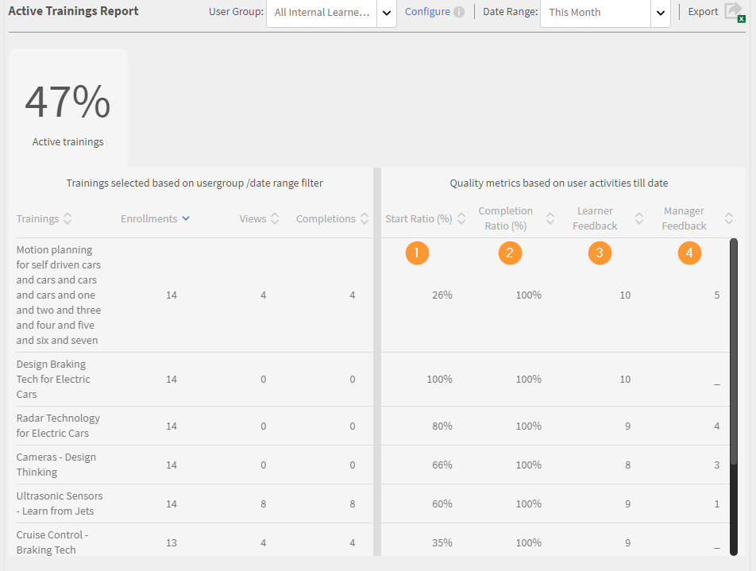
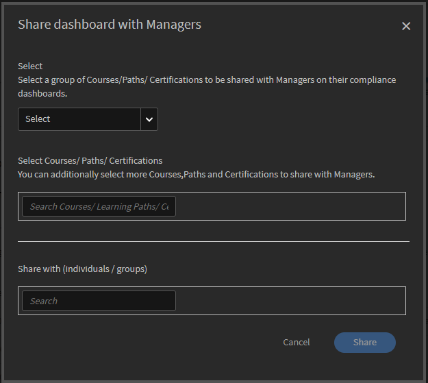
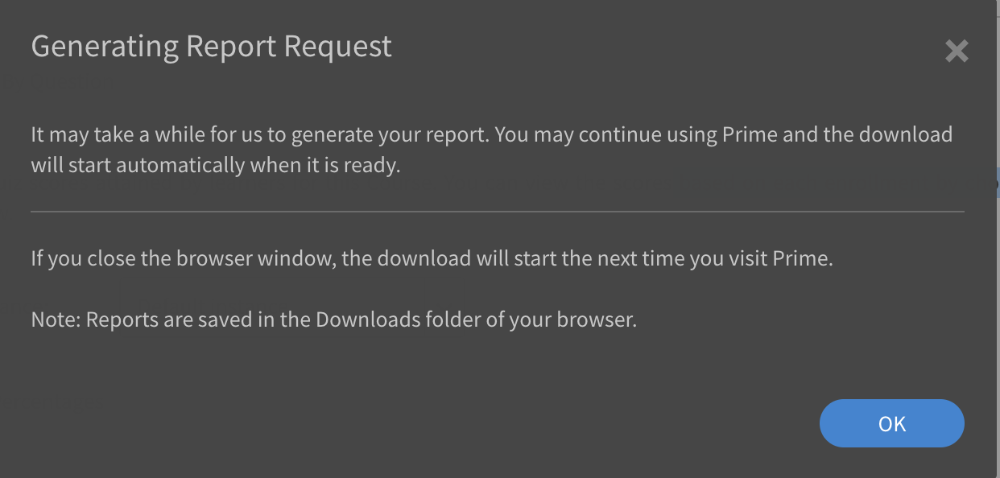

# 보고서

Learning Manager 응용 프로그램에서 책임자 역할과 관련된 보고서에 관해 알아봅니다.

Adobe Learning Manager를 사용하면 학습자 활동을 추적, 모니터링 및 제어하는 다양한 보고서를 생성할 수 있습니다. 학습자 활동은 데이터베이스에서 자동으로 추적 및 캡처됩니다. 관리자 및 책임자 보고서는 데이터베이스에서 생성됩니다.

## 개요 {#overview}

책임자와 관리자의 보고서 생성 프로세스는 둘 다 유사합니다. 관리자는 자신의 하위 보고서를 볼 수 있고 책임자는 모든 조직 차원에서 보고서를 볼 수 있습니다.

보고서는 대시보드에 집계됩니다. 보고서는 대시보드 내에 있어야 합니다. 보고서 페이지에 **[!UICONTROL 기본 대시보드]**&#x200B;가 기본적으로 있습니다. 사용자가 추가한 모든 보고서는 기본 대시보드로 이동합니다. 개별 대시보드에 보고서를 추가하려면 드롭다운 화살표를 사용하여 **[!UICONTROL 보고서 추가]**&#x200B;를 선택합니다. 대시보드 작성에 대한 자세한 내용은 이 페이지에 있는 대시보드 섹션을 참조하십시오.

## 보고서 유형 {#typesofreports}

Adobe Learning Manager에서는 완료, 사용 시간, 스킬 및 효과와 같은 주요 4가지 유형의 보고서를 지원합니다. 다음 보고서 유형을 사용하여 300개 이상의 변형 보고서를 생성할 수 있습니다.

* 학습자용 강의 통계
* 강의 효과 보고서
* 학습자 스킬 기반 보고서
* 학습자용 학습 프로그램 등록 통계
* 학습자의 학습 시간
* 학습 카운트
* 인증 완료

## 사용자 활동 대시보드 {#useractivitydashboards}

플랫폼에서의 시간에 따른 모든 사용자 활동 요약을 확인합니다. 사용자 그룹을 구성하고 필터를 적용합니다.

사용자 활동 대시보드는 계정에서 사용자 활동을 표시합니다. 나열된 세 가지 보고서는 다음과 같습니다.

* **등록된 사용자:** 이 보고서는 전주 대비 계정에 등록된 사용자 수 정보를 제공합니다. 월별 활성 단위 라이선스가 있는 계정의 경우 보고서는 MAU 단위를 대신 표시합니다.

* **사용자 방문 보고서:** 이 보고서는 플랫폼에 액세스하는 사용자의 일별 수에 대한 정보를 제공합니다. 월별 보고서도 사용할 수 있습니다.

* **학습 소요 시간 보고서:** 이 보고서는 하루 단위로 플랫폼에서 소요된 학습 시간에 대한 정보를 제공합니다. 월별 보고서도 사용할 수 있습니다.

### 등록된 사용자 {#registeredusers}

Learning Manager는 매주 시스템에 등록된 사용자 수를 기록합니다. 책임자는 한 주의 특정 날짜에 등록된 사용자 수를 파악하기 위해 이 보고서를 볼 수 있습니다. 한 주 기간에 대해 저장된 등록 수는 변경되지 않습니다. 따라서 과거의 등록된 수는 시스템에서 현재 학습자 집합과 관련이 없습니다.

이 보고서는 전주 대비 계정에 등록된 사용자 수 정보를 제공합니다.

월별 활성 단위 라이선스가 있는 계정의 경우 보고서는 MAU 단위를 대신 표시합니다.

*등록된 사용자 보고서*

***월별 액세스 단위 계정의 경우:***

**월별 활성 사용자 보고서**

이 보고서는 매달 학습 플랫폼의 활성 학습자 수를 표시합니다. 사용자가 여기에 언급된 학습 작업을 수행하는 경우 해당 월에 활성으로 간주됩니다. 월별 활성 단위가 계산되는 방식과 동일합니다.

한 달 기간에 대해 계산되고 저장된 월별 활성 수는 변경되지 않습니다. 따라서 과거의 표시된 수는 시스템에서 현재 학습자 집합과 관련이 없습니다.

### 사용자 방문 {#uservisits}

이 보고서는 일별 또는 월별 기간에 시스템에 액세스하는 총 학습자를 표시합니다. 학습을 사용하지 않고 학습 플랫폼을 찾는 것도 학습 플랫폼에 &#39;액세스&#39;하는 것으로 간주됩니다. 이는 책임자가 시스템에 액세스하는 사용자의 총 집합을 파악하는 데 도움이 됩니다. Learning Manager는 월의 첫째 날에 이전 달 플랫폼에 액세스한 총 사용자의 기록을 만듭니다. 이러한 사용자에 대한 사용자 그룹 정보도 캡처합니다.

책임자가 구성한 사용자 그룹만 기록됩니다. 이를 통해 책임자는 과거 월별 데이터에 대한 사용자 그룹에 필터를 적용할 수도 있습니다. 사용자 그룹 구성이 수정되고 Learning Manager가 이전 달에 이 사용자 그룹에 대한 데이터를 기록하지 않았다면 Learning Manager는 이전 달에 새로 구성된 이 사용자 그룹의 데이터를 표시할 수 없습니다.

이 보고서에는 웹, 모바일 앱, 헤드리스 사용자 정의 솔루션 등과 같은 모든 형식을 사용하여 플랫폼에 액세스하는 사용자가 포함됩니다. 장치 앱 사용 그래프는 특히 Learning Manager의 장치 앱을 사용하여 플랫폼에 액세스하는 사용자만 언급합니다. 이는 책임자가 계정에서 모바일 앱의 사용을 식별하는 데 도움을 줍니다.

*사용자 방문 보고서*

### 학습 소요 시간 보고서 {#learningtimespentreport}

여기에서 12개월 동안 모든 학습자가 소요한 총 학습 시간을 표시하는 이중 축 선형 차트를 확인할 수 있습니다. 두 번째 축은 개인이 학습에 소요한 중위 시간값을 나타냅니다.

학습 프로그램 및 인증서와 같이 다양한 학습 객체에 소요된 시간은 다음에 대해 계산됩니다.

* 정적 및 대화형 콘텐츠가 있는 자습 과정
* URL이 있는 활동 강의.
* 주말 플래그가 활성화된 주말 세션.
* 출석이 자동으로 표시되는 VC 연결 세션.
* 학습 프로그램 및 인증서와 같이 다양한 학습 객체에 소요된 시간
* xAPI 활동 강의의 xAPI 명령문.

추가로 Excel 스프레드시트로 그래프를 내보낼 수 있습니다.

사용자 그룹 구성을 선택하는 필터가 제공되어 다양한 사용자 그룹에 대한 데이터를 보는 데 도움이 됩니다.

선택한 날짜 및 사용자 그룹 필터는 대시보드의 관련된 모든 그래프에 적용됩니다.

>[!NOTE]
>
>**[!UICONTROL 사용자 방문]** 및 **[!UICONTROL 학습 소요 시간]** 보고서의 경우 (사용자 그룹이 구성되어 있지 않으면) 전체 계정의 데이터가 기본적으로 표시됩니다.

## 교육 콘텐츠 대시보드 {#trainingcontentdashboard}

교육 콘텐츠 대시보드에서는 플랫폼에서 이용할 수 있는 교육을 한 눈에 파악할 수 있습니다. 인기 교육을 보거나 이용 가능한 모든 교육을 추적할 수 있습니다.

### 교육 보고서 {#trainingsreport}

이 보고서는 플랫폼에서 이용할 수 있는(게시된 상태) 전체 교육의 월별 정보를 제공합니다. 시간에 따라 제공된 교육 수를 표시합니다.

*교육 보고서*

### 활성 교육 보고서 {#activetrainingsreport}

이 보고서는 선택한 시간 범위 동안 활성인 교육 정보를 제공합니다. 활성 교육은 등록되었거나 플레이어에서 조회되거나 주어진 시간에 완료된 교육입니다.

활성 교육의 경우 사용자 그룹이 구성되어 있지 않으면 모든 루트 사용자(관리자 역할 포함) 내부 그룹의 데이터를 선택에 사용할 수 있습니다. 루트 사용자 그룹과 별개로 필요한 경우 10개의 추가 사용자 그룹을 구성할 수 있습니다.

*활성 교육 보고서*

>[!NOTE]
>
>**[!UICONTROL 모든 사용자]** 및 **[!UICONTROL 12개월]** 필터가 선택된 경우 예상대로 데이터가 표시되지 않지만 **[!UICONTROL 모든 내부 사용자 그룹].**&#x200B;을 선택하면 데이터가 표시됩니다.

<table>
 <tbody>
  <tr>
   <td>
    
<b>참조</b>
</td>
   <td>
    
<b>지표</b>
</td>
   <td>
    
<b>설명</b>
</td>
  </tr>
  <tr>
   <td>
    
1
</td>
   <td>
    
시작 비율(%)
</td>
   <td>
    
등록 수 대비 과정을 시작한 학습자 수의 비율.
</td>
  </tr>
  <tr>
   <td>
    
2
</td>
   <td>
    
완료율(%)
</td>
   <td>
    
과정을 시작한 총 사용자 대비 과정을 완료한 총 사용자의 비율. 
</td>
  </tr>
  <tr>
   <td>
    
3
</td>
   <td>
    
학습자 피드백
</td>
   <td>
    
1~10점까지 받은 모든 L1 피드백 응답 평균(가장 가까운 정수로 반올림). 
</td>
  </tr>
  <tr>
   <td>
    
4
</td>
   <td>
    
관리자 피드백
</td>
   <td>
    
1~5점까지 받은 모든 L3 피드백 응답 평균(가장 가까운 정수로 반올림) 
</td>
  </tr>
 </tbody>
</table>

교육 보고서에는 두 개의 추가 열이 표시됩니다.

1. 강의의 평균 평가 등급입니다.
1. 강의를 평가한 학습자 수
1. 포함된 경로
1. 포함된 경로 ID
1. 포함된 강의 ID

>[!NOTE]
>
>시작률, 완료율, 학습자 피드백 및 관리자 피드백은 적용된 필터의 영향을 받지 않습니다. 필터는 등록, 보기 및 완료에만 영향을 줍니다.

>[!NOTE]
>
>두 보고서(교육 콘텐츠, 사용자 활동) 모두, 최대 10개의 사용자 그룹을 구성할 수 있습니다. 프로세싱이 완료되고 새로 구성된 필터를 사용할 수 있게 되기까지 최대 24시간이 걸릴 수 있습니다.

## 학습 요약 대시보드 {#dashboards}

### 대시보드 보고서 생성

>[!INFO]
>
>이 교육에서는 데이터베이스에서 대시보드 보고서를 생성하는 방법에 대해 알아봅니다.    

교육을 시작할 수 없는 경우 <almacademy@adobe.com>에 작성하세요.

플랫폼의 모든 학습 활동에 대한 요약 보고서를 참조하십시오. 이 페이지에서는 선택한 루트 사용자의 팀 및 외부 프로필에 대한 다음과 같은 요약 정보를 확인할 수 있습니다. 시간 범위도 선택할 수 있습니다.

* 등록, 보기 및 완료 양식의 학습 요약
* 상위 스킬
* 준수 요약

*요약 차트*

내부 루트 수준 관리자가 있는 경우 해당 관리자가 차례로 표시됩니다.

모든 외부 프로필은 내부 프로필(내부 루트 수준 사용자) 다음에 나열됩니다.

외부 프로필에 관리자가 있으면 관리자 계층이 **[!UICONTROL 다음에 대한 데이터 표시]** 드롭다운 목록에 표시됩니다. 사용자는 모든 세부 정보 페이지의 관리자 계층에 나열됩니다(학습 요약, 준수 및 스킬 상태).

그렇지 않으면 모든 개별 사용자 세부 정보가 목록에 표시됩니다.

다양한 내부 팀의 등록에 대한 자세한 내용을 보려면 **[!UICONTROL 학습 요약 세부 정보]**&#x200B;를 클릭하십시오.

*학습 요약 세부 정보*

등록을 클릭하면 각 관리자의 학습자와 학습 객체가 등록된 학습자를 확인할 수 있습니다. 각 학습자의 진행 및 완료 세부 정보를 확인할 수도 있습니다.

*관리자에게 할당된 학습자*

팀을 클릭하고 csv로 보고서를 내보냅니다. 관리자는 사용자 그룹 또는 개별 사용자를 선택하여 사용자 그룹 또는 개별 사용자에 대한 보고서를 내보낸 다음 **[!UICONTROL 동작]** 드롭다운 목록에서 세부 정보를 내보낼 수 있습니다.

또한 진행 중이며 습득한 스킬에 대한 막대 차트 보기도 확인할 수 있습니다. 그래프에 포함하려는 스킬을 추가/제거할 수 있습니다.

*스킬 상태 누적 막대 차트*

### 준수 대시보드

**Adobe Learning Manager**&#x200B;은(는) 모든 관리자와 관리자에게 준수 대시보드를 제공합니다. 책임자는 준수 대시보드를 만들고 관리자와 공유할 수 있습니다. 관리자는 앱에서 새로 공유된 대시보드를 보고 특정 교육에 대한 팀 구성원의 준수를 쉽게 추적할 수 있습니다. 준수 대시보드를 사용하면 관리자가 사용자 정의 준수 강의를 특정 범주(예: 영업, 마케팅 및 법률)로 분류할 수 있습니다. 사용자 지정 준수 범주는 **[!UICONTROL 카탈로그 레이블]**&#x200B;에 의해 구동됩니다.

_준수 대시보드-관리자 보기_

관리자는 **[!UICONTROL 준수 대시보드로 이동]**&#x200B;을 선택하여 각 관리자의 팀에 대한 준수 상태를 확인할 수도 있습니다. 책임자는 일련의 교육 과정을 관리자와 개별적으로 또는 그룹과 공유할 수 있습니다. 이를 통해 관리자는 지정된 교육에 대한 팀원의 준수를 쉽게 추적할 수 있습니다.

#### 관리 프로세스

##### 사용자 정의 준수 레이블 만들기

준수 레이블은 강의/학습 경로/인증을 준수 유형으로 분류하는 카탈로그 레이블의 유형입니다.
사용자 정의 준수 레이블을 만들려면 다음 단계를 따르십시오.

1. 관리자 앱에서 **[!UICONTROL 설정]** > **[!UICONTROL 일반]**&#x200B;으로 이동합니다.
1. **[!UICONTROL 사용자 지정 준수 유형]** 옵션을 선택하여 사용자 지정 준수 레이블을 활성화합니다.

   
   _사용자 지정 준수 사용_

   >[!NOTE]
   >
   >이 새로운 카탈로그 레이블은 강의, 학습 경로 및 인증을 준수 유형으로 분류하기 위해 도입되었습니다. **[!UICONTROL 사용자 지정 준수 유형]** 옵션을 사용하려면 먼저 같은 페이지에서 **[!UICONTROL 카탈로그 레이블 표시]** 옵션을 활성화해야 합니다.

1. **[!UICONTROL 설정]** > **[!UICONTROL 카탈로그 레이블]**&#x200B;로 이동하고 **[!UICONTROL 준수 유형]**&#x200B;을 선택합니다.
1. **[!UICONTROL 값]** 텍스트 상자에 값(예: Legal, Sales)을 입력하고 **[!UICONTROL 값 추가]**&#x200B;를 선택합니다.

   
   _사용자 지정 규격을 위한 값 추가_

1. **[!UICONTROL 저장]**&#x200B;을 선택합니다.

>[!NOTE]
>
>작성자는 앱에서 강의를 생성/편집하는 동안 이러한 준수 레이블을 추가해야 합니다. [강의/학습 경로/인증에 준수 레이블 추가](/help/migrated/authors/feature-summary/courses.md#add-compliance-labels-to-courselearning-pathcertification)를 참조하십시오.

##### 준수 대시보드 만들기 및 공유

준수 대시보드를 만들고 공유하려면 다음 단계를 따르십시오.

1. **[!UICONTROL 보고서]** > **[!UICONTROL 학습 요약]**(으)로 이동합니다.
1. **[!UICONTROL 준수 대시보드]** 섹션에서 **[!UICONTROL 관리자와 공유됨]**&#x200B;을 선택합니다.
1. **[!UICONTROL 대시보드 공유]**&#x200B;를 선택하고 **[!UICONTROL 준수 레이블 선택]** 드롭다운 메뉴에서 만든 레이블을 선택합니다.

   
   _준수 유형 선택_

1. **[!UICONTROL 공유]** 텍스트 상자에 관리자의 이름을 입력하고 선택합니다.
1. 선택한 관리자에게 대시보드를 보내려면 **[!UICONTROL 공유]**&#x200B;를 선택하세요.

>[!NOTE]
>
>새 대시보드를 공유하면 선택한 관리자의 앱에 있는 기존 대시보드를 덮어씁니다. 관리자는 관리자가 새로 공유한 대시보드를 볼 수 있습니다.

#### 관리자 및 사용자 정의 관리자와 준수 대시보드 공유

관리자는 대시보드를 다른 관리자 및 맞춤형 관리자와 공유하여 모든 준수 대시보드에 즉시 액세스할 수 있습니다.

관리자 및 사용자 정의 관리자와 대시보드를 공유하려면 다음 단계를 따르십시오.

1. **[!UICONTROL 관리자]**(으)로 로그인합니다.
2. **[!UICONTROL 보고서]** > **[!UICONTROL 학습 요약]**&#x200B;으로 이동합니다.
3. **[!UICONTROL 준수 대시보드]** 섹션에서 **[!UICONTROL 관리자 보기]**&#x200B;를 선택합니다.
4. **[!UICONTROL 대시보드 공유]** 단추를 선택합니다.

   
   _대시보드 공유 - 관리자_

5. **[!UICONTROL 사용자 지정 준수 선택]** 드롭다운 메뉴에서 준수 레이블을 선택합니다. 이 옵션은 선택한 준수 레이블이 있는 모든 강의를 선택합니다.
6. 관리자와 공유하려는 추가 강의, 학습 경로 또는 인증을 선택합니다.

   
   _준수 대시보드 공유_

7. 대시보드를 공유할 사용자 또는 사용자 그룹을 선택하고 **[!UICONTROL 공유]**&#x200B;를 선택합니다.

##### 준수 대시보드 보기 - 사용자 정의 관리자 및 기타 관리자

선택한 사용자 그룹의 모든 사용자 정의 책임자 및 기타 관리자는 앱에서 준수 대시보드를 볼 수 있습니다.

준수 대시보드를 보려면 다음 단계를 따르십시오.

1. **[!UICONTROL 보고서]** > **[!UICONTROL 학습 요약]** > **[!UICONTROL 준수 대시보드]**&#x200B;로 이동합니다.
2. **[!UICONTROL 준수 대시보드]** 섹션에서 **[!UICONTROL 내 보기]**&#x200B;를 선택합니다.
3. **[!UICONTROL 준수 대시보드로 이동]** 옵션을 선택하면 관리자가 공유한 새 준수 대시보드가 표시됩니다.

   
   _준수 대시보드 보기 - 사용자 지정 관리자_

#### 스토어 관리자와 공유

관리자는 스토어 관리자와 준수 대시보드를 공유하여 학습자의 준수 진행률을 모니터링할 수 있습니다.

스토어 관리자와 대시보드를 공유하려면 다음 단계를 따르십시오.

1. **[!UICONTROL 관리자]**(으)로 로그인합니다.
2. **[!UICONTROL 보고서]** > **[!UICONTROL 학습 요약]** > **[!UICONTROL 준수 대시보드]**&#x200B;로 이동합니다.
3. **[!UICONTROL 준수 대시보드]** 섹션에서 **[!UICONTROL 관리자 보기]**&#x200B;를 선택합니다.
4. **[!UICONTROL 대시보드 공유]** 단추를 선택합니다.

   
   _관리자와 준수 대시보드 공유_

5. **[!UICONTROL 사용자 지정 준수 선택]** 드롭다운 메뉴에서 준수 레이블을 선택합니다.
이 옵션은 선택한 준수 레이블이 있는 모든 강의를 선택합니다.
6. 관리자와 공유하려는 추가 강의, 학습 경로 또는 인증을 선택합니다.
7. 대시보드를 공유할 사용자 또는 사용자 그룹을 선택하고 **[!UICONTROL 공유]**&#x200B;를 선택합니다.

##### 준수 대시보드 보기 - 관리자

자세한 내용은 이 문서 [준수 대시보드 보기](/help/migrated/managers/feature-summary/manager-dashboard.md#view-the-dashboard)를 참조하십시오.

#### 대시보드 편집

준수 대시보드를 편집하려면 다음 단계를 따르십시오.

1. **[!UICONTROL 관리자]**(으)로 로그인합니다.
2. **[!UICONTROL 보고서]** > **[!UICONTROL 학습 요약]** > **[!UICONTROL 준수 대시보드]**&#x200B;로 이동합니다.
3. **[!UICONTROL 준수 대시보드]** 섹션에서 **[!UICONTROL 관리자 보기]** 또는 **[!UICONTROL 관리자 보기]**&#x200B;를 선택합니다. 이 섹션에서 준수 대시보드를 볼 수 있습니다.
4. 편집하려는 준수 대시보드에서 **[!UICONTROL 편집]**&#x200B;을 선택합니다.

   
   _준수 대시보드 편집_

5. 필요한 세부 정보를 변경하고 **[!UICONTROL 공유]**&#x200B;를 선택합니다.
6. 준수 대시보드가 선택한 관리자와 공유됩니다.

#### 대시보드 회수 - 관리자

준수 대시보드를 철회하려면 다음 단계를 따르십시오.

1. **[!UICONTROL 관리자]**(으)로 로그인합니다.
2. **[!UICONTROL 보고서]** > **[!UICONTROL 학습 요약]** > **[!UICONTROL 준수 대시보드]**&#x200B;로 이동합니다.
3. **[!UICONTROL 준수 대시보드]** 섹션에서 **[!UICONTROL 관리자 보기]** 또는 **[!UICONTROL 관리자 보기]**&#x200B;를 선택합니다. 이 섹션에서 준수 대시보드를 볼 수 있습니다.
4. 제거하려는 준수 대시보드에서 **[!UICONTROL 철회]**&#x200B;를 선택하고 **[!UICONTROL 진행]**&#x200B;을 선택합니다.
5. 이 작업을 수행하면 관리자의 앱에서 공유 준수 대시보드가 제거됩니다.

   
   _준수 대시보드 회수_

#### 학습자용 기본 준수 위젯 설정

학습자를 위한 기본 준수 위젯을 설정하려면 다음 단계를 따르십시오.

1. **[!UICONTROL 관리자]**(으)로 로그인합니다.
2. **[!UICONTROL 보고서]** > **[!UICONTROL 학습 요약]** > **[!UICONTROL 준수 대시보드]**&#x200B;로 이동합니다.
3. **[!UICONTROL 준수 대시보드]** 섹션에서 **[!UICONTROL 학습자 보기]**&#x200B;를 선택합니다.
4. **[!UICONTROL 학습자 보기]** 섹션에서 **[!UICONTROL 변경]**&#x200B;을 선택합니다.

   
   _학습자용 기본 준수 위젯 설정_
5. **[!UICONTROL 사용자 지정 준수]** 드롭다운에서 준수 레이블을 선택합니다. 이 옵션은 선택한 준수 레이블이 있는 모든 강의를 선택합니다.
6. **[!UICONTROL 계속]**&#x200B;을 선택하여 기본 준수 위젯을 설정합니다.

학습자는 홈페이지의 준수 위젯에서 선택한 강의 또는 학습 경로를 볼 수 있습니다. 자세한 내용은 [준수 대시보드 위젯](/help/migrated/learners/feature-summary/learner-home-page.md#compliance-dashboard-widget)을(를) 참조하십시오.

## 사용자 정의 보고서

관리자는 **[!UICONTROL 보고서]** 섹션에서 사용할 수 있는 사용자 지정 템플릿을 사용하여 특정 보고서를 생성할 수 있습니다.

### 샘플 보고서 {#samplereports}

**[!UICONTROL 샘플 보고서]** 탭에서는 샘플 데이터 포인트를 기반으로 하는 보고서 목차가 나타납니다. 계정 데이터를 사용하여 다양한 기능별 보고서 아이디어를 얻으려면 이러한 보고서를 확인해 봅니다.

### 대시보드 보고서 {#dashboardreports}

대시보드는 보고서의 집합입니다. 보고서는 필요에 따라 대시보드로 그룹화할 수 있습니다. 만든 모든 게시판을 보려면 이 게시판 탭을 클릭합니다. **[!UICONTROL 대시보드 보기]** 드롭다운 목록에서 기본 보드나 만든 대시보드를 선택할 수 있습니다.

### Excel 보고서 {#excelreports}

**[!UICONTROL Excel 보고서]** 탭을 사용하여 보고서를 XLS 파일 형식으로 내보낼 수 있습니다.

다음은 다운로드할 수 있는 보고서 유형입니다.

* 강의 보고서
* 학습자 성적 증명서
* 공지사항 보고서
* 작업 지원 보고서
* 콘텐츠 감사 내역
* 사용자 감사 추적
* 로그인/액세스 보고서
* 게임화 성적 증명서
* 게임화 감사 추적

### 학습자 성적 증명서 {#learnertranscripts}

Excel 보고서의 학습자 성적 증명서에는 필요한 점수 및 획득한 점수 열이 소수점 표시 십진수로 표시됩니다.

### 강의 보고서 {#coursereports}

책임자는 강의 보고서를 다운로드할 수 있습니다. 다음 단계를 따르십시오.

1. **[!UICONTROL 보고서]** > **[!UICONTROL 사용자 지정 보고서]** > **[!UICONTROL Excel 보고서]** > **[!UICONTROL 강의 보고서]**&#x200B;를 엽니다.
1. **[!UICONTROL 강의 보고서]** 대화 상자가 나타납니다. 보고서를 가져올 강의를 선택하고 **[!UICONTROL &#39;보기&#39;]**&#x200B;를 클릭합니다.

   
   *강의 보고서*

1. 강의 페이지로 리디렉션됩니다. 특정 등록 유형을 선택하여 각 등록을 기준으로 사용자별 및 질문별로 퀴즈 점수를 내보낼 수 있습니다.
1. 보고서를 내보내려면 **[!UICONTROL 퀴즈 점수 내보내기]**&#x200B;를 선택합니다. **[!UICONTROL 보고서 생성 요청]** 대화 상자가 나타납니다. 확인하려면 **[!UICONTROL 확인]**&#x200B;을 클릭합니다.

   
   *보고서 요청 생성*

   >[!NOTE]
   >
   >모듈에 대해 여러 번 시도 옵션이 구성되어 있는 경우 내보낸 퀴즈 점수 보고서에 모든 시도에 대한 점수 세부 정보가 포함됩니다.

### 강의 보고서 생성

>[!INFO]
>
>이 교육에서는 강의 보고서를 내보내고 이러한 보고서에 대한 이메일 구독을 설정하는 방법에 대해 알아봅니다.    

교육을 시작할 수 없는 경우 <almacademy@adobe.com>에 작성하세요.

### 학습자 성적 증명서 {#LearnerTranscripts-1}

Adobe Learning Manager를 사용하면 조직 책임자가 학습자 관련 성적 증명서를 생성할 수 있습니다. 학습자 성적 증명서에는 다음이 포함됩니다.

1. 학습자 성적 증명서: 학습 활동 대시보드
1. 스킬: 스킬 대시보드
1. 준수 대시보드

Excel 보고서의 학습자 성적 증명서에는 필요한 점수 및 획득한 점수 열이 소수점 표시 십진수로 표시됩니다.

학습자 성적 증명서 생성에 대한 자세한 내용은 [학습자 성적 증명서](learner-transcripts.md)를 참조하십시오.

### 공지사항 보고서 {#announcementsreports}

책임자는 발송한 모든 공지사항에 대해서 보고서를 생성할 수 있습니다. 보고서 세부 정보는 다음과 같습니다.

* 공지사항 유형
* 공지사항 이름
* 공지사항 날짜
* 공지사항 상태
* 학습자 이름

보고서를 다운로드하려면 다음 단계를 따릅니다.

1. **[!UICONTROL 보고서]** > **[!UICONTROL 사용자 지정 보고서]** > **[!UICONTROL Excel 보고서]** > **[!UICONTROL 공지 보고서]**&#x200B;를 엽니다. **[!UICONTROL 보고서 생성 요청]** 대화 상자가 나타납니다. [확인]을 클릭합니다.
1. [!UICONTROL **공지**] > [!UICONTROL **작업**] > [!UICONTROL **보고서 내보내기**].

   
   *공지 보고서*

1. 설정 아이콘 아래의 **[!UICONTROL 보고서 내보내기]**&#x200B;를 클릭하여 특정 발표에 대한 보고서를 추출할 수 있습니다.

   
   *특정 공지에 대한 보고서*

### 작업 지원 보고서 {#jobaidsreport}

작업 지원은 강의 또는 학습 프로그램과 같은 특정 학습 대상에 등록하지 않고도 학습자가 접속할 수 있는 교육 콘텐츠입니다. 책임자는 작업 지원 보고서를 추출하고 다운로드할 수 있습니다.

추출되는 보고서에는 다음 내용이 포함됩니다.

* 이름
* 작업 지원 유형
* 작업 지원 상태(인증 및 철회)
* 등록 날짜
* 완료 날짜
* 다운로드 날짜
* 학습자 이름
* 관리자 이름
* 생성자

보고서를 다운로드받으려면 다음 중 하나를 수행합니다.

* **[!UICONTROL 보고서]** > **[!UICONTROL 사용자 지정 보고서]** > **[!UICONTROL Excel 보고서]** > **[!UICONTROL 작업 지원 보고서]**&#x200B;를 엽니다. **[!UICONTROL 보고서 생성 요청]** 대화 상자가 나타납니다. **[!UICONTROL &#39;확인&#39;]**&#x200B;을 클릭합니다.
* **[!UICONTROL 작업 지원]** > **[!UICONTROL 작업]** > **[!UICONTROL 보고서 내보내기]**&#x200B;를 엽니다.

*작업 지원 보고서*

* 설정 아이콘 아래에 있는 **[!UICONTROL 보고서 내보내기]**&#x200B;를 클릭하여 특정 작업 지원 보고서를 추출할 수 있습니다.

*특정 작업 지원에 대한 보고*

### 작업 지원 보고서

목록에서 **[!UICONTROL 작업 지원 보고서]**&#x200B;를 선택하면 다음 두 가지 옵션이 표시됩니다.

*작업 지원 사용자 등록 보고서 다운로드*

**모든 작업 지원**: 계정의 작업 지원 수가 1,000만 개 미만인 경우 생성된 보고서에는 모든 작업 지원의 등록 정보가 포함됩니다. 이것이 기본 선택 영역이 됩니다. 행 수가 1,000만 개를 초과하면 오류가 표시되며 필요한 작업 지원을 수동으로 선택해야 합니다.

**선택한 작업 지원**: 이 옵션을 선택하면 보고서를 생성할 작업 지원을 입력할 수 있습니다. 최대 10개의 작업 지원을 선택할 수 있습니다. Adobe Learning Manager은 작업 지원 건수가 1000만 건을 넘는지 확인한다.

*작업 지원 선택*

**작업 지원 보고서**

이 옵션을 선택하면 메타데이터 및 교육과 함께 시스템에 위치한 모든 작업 지원의 세부 정보가 다운로드됩니다.

다운로드한 보고서는 다음과 같은 필드로 구성되어 있습니다.

* 작업 지원 이름
* 언어
* ID
* 유형
* 기간(분)
* 상태
* 게시 날짜(UTC 시간대 기준)
* 이름으로 생성됨
* 전자 메일로 생성됨
* 사용자 고유 ID로 생성됨
* 카탈로그
* 학습 경로
* 강의
* 태그
* 스킬

**작업 지원 사용자 등록 보고서**

등록 보고서에는 사용자 등록 및 기타 정보에 대한 세부 정보가 포함되어 있습니다.

다운로드한 보고서는 다음과 같은 필드로 구성되어 있습니다.

* 작업 지원 이름
* 유형
* 상태
* 등록 날짜(UTC 시간대)
* 완료일(UTC 시간대)
* 다운로드 날짜(UTC 시간대)
* 학습자 이름
* 이메일
* 고유 사용자 ID
* 관리자 이름
* 관리자 이메일
* 관리자 사용자 고유 ID
* 이름으로 할당됨
* 전자 메일로 할당됨
* 사용자 고유 ID로 할당됨
* 이름으로 생성됨
* 전자 메일로 생성됨
* 사용자 고유 ID로 생성됨
* 작업 코드
* 신규 필드
* 프로필

### 콘텐츠 감사 내역 보고서 {#contentaudittrailreports}

**[!UICONTROL 콘텐츠 감사 추적]** 보고서 생성기를 사용하여 시스템에서 강의 사용 기간 동안 변경된 모든 내용과 편집한 내용에 대한 보고서를 생성합니다. 생성된 보고서에는 다음과 같은 정보가 포함되어 있습니다.

* 객체 ID
* 객체 이름
* 오브젝트 유형
* 수정 유형
* 설명
* 참조한 객체 ID
* 참조한 객체 이름
* 사용자 이름으로 수정됨
* 수정한 사용자 ID
* 수정한 날짜(UTC 시간대)

**수정 유형** 열에서 다음 세부 정보를 볼 수 있습니다.

| 수정 유형 | 설명 |
| --- | --- |
| 생성을 | 강의 생성됨 |
| 인증 추가 | 카탈로그에 인증 추가됨 |
| 인증 제거 | 카탈로그에서 인증서가 제거됨 |
| 콘텐츠 추가 | 모듈에 추가된 콘텐츠 |
| 강의 추가 | 학습 경로에 강의 추가됨 |
| 강의 제거 | 학습 경로에서 제거된 과정 |
| 사용자 정의 레이블 추가 | 사용자 정의 레이블이 카탈로그에 추가됨 |
| 사용자 정의 레이블 제거 | 사용자 정의 레이블이 카탈로그에서 제거됨 |
| 삭제 | 카탈로그 삭제됨 |
| 작업 지원 추가 | 작업 지원이 카탈로그에 추가됨 |
| 작업 지원 제거 | 작업 지원이 카탈로그에서 제거됨 |
| 학습 경로 추가 | 카탈로그에 학습 경로 추가됨 |
| 학습 과정 제거 | 카탈로그에서 제거된 학습 경로 |
| 모듈 콘텐츠 추가 | 강의에 추가된 모듈(콘텐츠 섹션) |
| 모듈 콘텐츠 제거 | 강의에서 제거된 모듈(콘텐츠 섹션) |
| 게시됨 | 강의 또는 학습 경로가 게시되고 기본 카탈로그에 추가됨 |
| 다시 게시됨 | 강의 재게시 |
| 리소스 추가 | 강의에 추가된 리소스 |
| 리소스 제거 | 강의에서 리소스 제거됨 |
| 중단됨 | 강의 중단 |
| 공유 카탈로그 추가 | 카탈로그가 카탈로그에 공유됨 |
| 공유 카탈로그 제거 | 카탈로그 공유가 카탈로그에서 제거됨 |
| 공유 카탈로그 업데이트 | 카탈로그 공유 상태 : 활성 |
| 업데이트 | 과정 또는 학습 과정 업데이트됨 |
| 사용자 그룹 추가 | 사용자 그룹이 카탈로그에 추가됨 |
| 사용자 그룹 제거 | 카탈로그에서 사용자 그룹 제거됨 |

메타데이터 정보는 생성한 보고서에 들어 있지 않습니다.

강의 감사 내역 보고서를 생성하려면 다음 단계를 수행합니다.

1. **[!UICONTROL 보고서]** > **[!UICONTROL Excel 보고서]** > **[!UICONTROL 강의 감사 추적]**&#x200B;을 선택합니다. **[!UICONTROL 콘텐츠 감사 내역]** 대화 상자가 나타납니다.

   
   *강의 감사 추적*

1. 보고서를 다운로드받을 강의, 학습 프로그램 및 인증을 선택합니다. 지정하지 않으면 기본적으로 모든 보고서가 다운로드됩니다.
1. 보고서의 날짜 범위를 선택하고 **[!UICONTROL 생성]**&#x200B;을 클릭하세요.
1. 보고서가 생성되고 콘텐츠 감사 보고서가 준비되었다는 알림을 받습니다. 보고서를 다운로드할 수 있습니다.

### 사용자 감사 내역 보고서 {#useraudittrailreports}

사용자 감사 추적은 사용자, 사용자 그룹 및 자체 등록 프로필의 수명 주기를 캡처합니다. 사용자 추가, 삭제, 관리자 변경 등 모든 것이 캡처됩니다. 자체 등록 프로필 생성 및 삭제가 기록됩니다. 또한, 자체 등록 일시 중지 및 재시작도 할 수 있습니다.

자체 등록 추가, 삭제, 일시 중지 또는 재시작을 하는 동안 외부 프로필 추가, 활성화, 비활성화, 일시 중지 또는 재시작이 가능합니다. CSV 업로드도 확인 가능합니다.

1. **[!UICONTROL 보고서 > Excel 보고서 > 사용자 추적]**&#x200B;을 선택합니다. 사용자 감사 추적 대화 상자가 나타납니다.
1. 사용자 감사 내역 대화 상자가 나타납니다. 팝업 메뉴에서 날짜 범위를 선택합니다. 지난 한 주, 지난 한 달이나 사용자 정의 날짜로 보고서를 생성할 수 있습니다.

   
   *사용자 감사 추적*

1. 보고서를 생성하려면 **[!UICONTROL &#39;생성&#39;]**&#x200B;을 클릭합니다.

**[!UICONTROL 사용자 감사 내역 보고서]** 대화상자에는 다음 두 가지 필터가 있습니다.

**날짜 범위 필터:** 보고서를 생성할 날짜 범위를 선택합니다. 세 가지 옵션이 있습니다.

* 최근 1주
* 최근 1달
* 사용자 정의 날짜

학습자 선택 필터: 사용자 또는 사용자 그룹을 검색합니다.

내보낸 보고서에는 지정한 검색 기준에 부합하는 사용자의 데이터가 기록됩니다.

*사용자 감사 추적*

>[!NOTE]
>
>스킬이 할당되거나 제거되면 할당되거나 제거된 사용자 감사 보고서에 대해 스킬을 추적할 수 있습니다.

### 확장 프로그램 구성 보고서

이 보고서는 활성화 상태를 포함하여 추가된 모든 기본 확장의 구성 세부 정보에 대한 정보를 제공합니다. 확장 보고서를 다운로드하는 방법을 알아보려면 [확장 보고서 다운로드](native-extensibility.md#download-extension-report)를 참조하세요.

### xAPI 활동 보고서

이 보고서는 xAPI 활동 모듈 중에 기록 및 생성된 모든 xAPI 문의 데이터를 제공합니다.

이 보고서를 다운로드하려면 다음 단계를 따르십시오.

1. **[!UICONTROL 보고서 > Excel 보고서 > xAPI 활동 보고서]**&#x200B;를 선택합니다. xAPI 활동 보고서 대화 상자가 나타납니다.
1. 팝업 메뉴에서 날짜 범위를 선택합니다. 지난 한 주, 지난 한 달이나 사용자 정의 날짜로 보고서를 생성할 수 있습니다.
1. 드롭다운 메뉴에서 학습자 및 활동을 선택합니다.
1. **[!UICONTROL 생성]**&#x200B;을 선택하여 보고서를 생성합니다.

### 게임화 보고서 {#gamification}

책임자는 CSV 형식의 게임화 성적 증명서를 다운로드할 수 있습니다. 개별 사용자 또는 사용자 그룹에 대한 보고서를 다운로드할 수 있습니다. 사용자 이름, 사용자 이메일, 사용자의 UUID, 사용자 점수 합계, 수집된 점수 합계, 사용자가 재생하는 그룹의 이름, 관리자 이름 및 활성 필드 값을 모두 보고서에 가져옵니다. 책임자가 이 보고서를 사용하면 조직 수준 또는 특정 그룹의 사용자 순위를 평가하고 이해할 수 있습니다.

1. 보고서 > Excel 보고서 > 게임화 보고서를 선택합니다.

   
   *게임화 보고서*

1. 게임화 성적 증명서 대화 상자가 나타납니다. 이름, 프로필, 사용자 그룹, 전자 메일 ID, UUID를 사용하여 학습자를 선택합니다.

   
   *게임화 대본 대화 상자*

1. 보고서를 생성하려면 **[!UICONTROL 생성]**&#x200B;을 클릭하십시오.

   학습자 보고서를 생성한 후 계정의 모든 사용자(내부, 외부 또는 삭제된 사용자)에 대한 현재 및 달성 수준 정보를 내보낼 수 있어야 합니다. 학습자의 레벨 달성 날짜를 확인할 수도 있습니다.

   * 브론즈 달성 날짜
   * 실버 달성 날짜
   * 골드 달성 날짜
   * 플래티넘 달성 날짜

   이 열에는 레벨을 처음으로 달성한 날짜가 포함되어 있습니다. 열 **[!UICONTROL 현재 수준]**&#x200B;은 학습자의 현재 수준을 표시합니다.

   책임자가 게임화를 재설정하면 학습자의 모든 점수가 그에 따라 재설정됩니다.

### 게임화 감사 내역 보고서 {#gamification-audit-trail}

이 보고서에는 각 규칙에서 학습자가 게임화 점수를 획득한 연혁과 이유가 포함되어 있습니다.

### 보고서 다운로드

1. 게임화 감사 내역 URL을 선택합니다.
1. **게임화 감사 추적** 팝업에서 날짜 범위를 선택합니다.
1. **생성**&#x200B;을 선택합니다.

보고서가 CSV 파일로 다운로드됩니다. 파일에는 다음 열이 포함되어 있습니다.

* 이름
* 이메일/UUID,
* 상태
* 작업
* 포인트,
* 잔여 점수
* 규칙/작업
* 규칙/작업 하위 작업,
* 규칙/작업 세부 정보
* 문자,
* 이름,
* 인스턴스 NameDate 달성(UTC 시간대)
* 규칙/작업 시작 시간
* 규칙/작업 종료 시간

### 보고서 등록 및 등록 취소 {#enrollmentandunenrollmentreport}

책임자와 관리자는 등록/미등록 학습자의 보고서를 추출할 수 있습니다. 책임자는 강의 인스턴스, 학습 프로그램, 인증에서 등록/미등록 학습자, 책임자 또는 관리자를 확인하고 보고서를 내보낼 수 있습니다. 관리자는 팀 구성원 보고서를 가져올 수만 있습니다. 관리자는 관리자 애플리케이션에서 삭제된 학습자 또는 자신의 이름이 등록되거나 등록되지 않은 학습자로 표시되지 않습니다.

보고서를 다운로드하려면 **[!UICONTROL 과정/학습 프로그램/인증]** > **[!UICONTROL 학습자]** > **[!UICONTROL 동작]** > **[!UICONTROL 보고서 내보내기]**&#x200B;를 엽니다.

*등록 취소 보고서*

### 피드백 보고서 {#feedback-report}

책임자는 이제 지정된 기간에 선택한 교육에 대한 학습자 피드백(L1) 및 관리자 피드백(L3) 모두를 가져올 수 있습니다.

UI에서 또는 PowerBI 커넥터를 통해 데이터를 내보내 더 심도 있게 분석할 수 있습니다.

L1 및 L3 피드백 보고서는 **1년** 범위의 선택한 교육에 대해 또는 원하는 날짜 범위에 대해 최대 10개의 선택한 교육에 대해 L1 및 L3 응답의 통합 피드백 보고서를 다운로드할 수 있는 옵션을 제공합니다.

관리자로 로그인하고 **[!UICONTROL 보고서]** > **[!UICONTROL 사용자 지정 보고서]**&#x200B;를 클릭한 다음 보고서 목록에서 **[!UICONTROL 피드백 보고서]**&#x200B;를 클릭합니다.

*피드백 보고서 다운로드*

필터를 선택한 후 다운로드를 클릭하면 CSV 형식으로 보고서를 다운로드하라는 알림이 표시됩니다.

다운로드된 보고서에는 교육 이름 및 유형, 인스턴스 이름, 학습자 이름 및 이메일, 피드백 유형: L1 또는 L3, 새 데이터에 대해 제출된 피드백 날짜 등의 세부 정보가 포함됩니다.

이 기능 구현 이전의 기존 데이터에는 LO 완료 날짜, LO 완료 날짜, L1 피드백 질문 자가 진행식 실제 텍스트 및 다른 열의 강의실 텍스트, L1 피드백 관련 응답, 관리자 이름 및 이메일, L3 피드백 값 및 제출 날짜, 활성 필드가 표시됩니다.

UI에서 또는 Power BI으로 데이터를 내보낼 수도 있으며, 이는 더 자세한 분석을 위해 날짜 범위에 대한 모든 교육을 지원합니다

### 교육 보고서 {#training-report}

Learning Manager는 책임자가 교육 세부 정보와 작성자, 게시된 날짜, 스킬, 카탈로그 레이블 등의 관련 메타데이터를 다운로드할 수 있는 교육 보고서를 지원합니다.

책임자 앱에서 **[!UICONTROL 보고서]** > **[!UICONTROL 사용자 지정 보고서]** > **[!UICONTROL Excel 보고서]** > **[!UICONTROL 교육 보고서]**&#x200B;를 클릭합니다.

다음에 대한 보고서를 다운로드할 수 있습니다.

* 선택한 교육(제한 10개) - 어떤 카탈로그에서든 하나 또는 여러 개의 교육(최대 10개)을 선택합니다.
* 선택한 카탈로그의 교육(제한 5개) - (카탈로그 섹션은 최대 5개 카탈로그까지 사용할 수 있습니다)
* 모든 교육 -(계정 내 모든 교육)

*교육 보고서 다운로드*

고급 옵션 섹션에서 다음 옵션을 사용할 수 있습니다.

* 학습 프로그램/인증이 있는 강의 매핑 포함
* 모듈 레벨 정보 포함

필터를 선택하고 다운로드를 클릭한 후 CSV 형식으로 보고서를 다운로드하라는 알림을 받게 됩니다.

보고서에는 다음 필드가 있습니다.

*카탈로그 이름, 교육 유형, 교육 ID, 교육 고유 ID, 교육 이름, 하위 교육, 모듈, 교육 또는 모듈 지속 기간, 형식, 교육 상태, 스킬, 작성자, 마지막 게시 날짜, 마지막 완료 날짜, 강사 등록 횟수, 시작된 횟수, 완료 횟수, 평균 L1 점수, 평균 L2 점수, 평균 L3 점수, 받은 L1 응답, 받은 L2 응답, 받은 L3 응답, 카탈로그 레이블 및 태그.*

*추가 옵션*

### 세션 요약 보고서 {#session-summary-report}

세션 요약 보고서에는 지정한 날짜 범위에 학습자를 위해 계획된 모든 세션이 나열됩니다.

책임자는 지정된 날짜 범위에 속하는 모든 가상 및 강의실 세션 세부 정보를 내보낼 수 있습니다. 책임자는 특정 교육 또는 강사와 관련된 세션 보고서를 내보낼 수도 있습니다.

책임자가 월 단위로 계획된 세션을 확인하고 강사의 일정과 이미 진행 중인 세션을 파악하는 데 유용합니다.

관리자는 **[!UICONTROL 사용자 지정 보고서]** > **[!UICONTROL 세션 요약 보고서]**&#x200B;를 클릭합니다.

이때 나타나는 대화상자에서 날짜 범위를 선택하고 요약 보고서로 생성하고 싶은 교육 또는 강사를 선택합니다.

*세션 요약 보고서*

다운로드한 csv에는 다음 필드가 포함되어 있습니다.

* 시작 날짜 및 시간
* 종료 날짜 및 시간

* 모듈 이름
* 세션 기간(단위: 분)
* 시트 수
* 위치
* 인스턴스 이름
* 강의 이름
* 강의 ID
* 강사 이름
* 강사 이메일
* 등록 카운트
* 세션 유형
* 대기자 명단 제한
* 대기자 명단 수
* 대기자 명단 사용자 이메일
* 위치 정보
* 위치/지역

### 강사 활용 보고서

이 보고서는 강사가 할당된 세션을 가르치는 데 매일 소요된 시간(분)을 캡처합니다. 보고서는 선택한 시작 날짜부터 3개월 동안 다운로드할 수 있습니다.

보고서를 다운로드하려면 **[!UICONTROL 보고서]** > **[!UICONTROL 사용자 지정 보고서]** > **[!UICONTROL 강사 활용 보고서]**&#x200B;를 클릭하십시오.

강사와 날짜 범위를 선택합니다.

*강사 활용률 보고서 다운로드*

다운로드한 보고서에는 다음 필드가 포함되어 있습니다.

* 강사 이름
* 강사 ID
* 역량 레벨
* 날짜 열 강사가 날짜에 활용되는 경우, 세션 수가 나열됩니다. 해당 일에 강사가 활용되지 않는 경우, 값은 0으로 표시됩니다.

보고서에는 선택한 달부터 3개월 동안의 레코드가 포함됩니다.

모든 강사의 기록을 검색하려면 강사 필드를 비워 둡니다.

또한 보고서 생성 권한이 있는 사용자 정의 책임자가 이 보고서를 검색할 수 있습니다.

### 사용자 감사 내역 보고서

이 보고서는 인스턴스, &quot;인스턴스에서 인스턴스로&quot;, 시간, 날짜 등으로 전환한 학습자에 대한 정보를 캡처합니다.

학습자 또는 사용자 그룹을 선택합니다.

보고서를 다운로드하려면 **[!UICONTROL 보고서]** > **[!UICONTROL 사용자 지정 보고서]** > **[!UICONTROL 사용자 감사 추적 보고서]**&#x200B;를 클릭하십시오.

*사용자 감사 추적 보고서 다운로드*

### 학습 계획 보고서

이 보고서에는 계정에 있는 모든 학습 계획의 세부 정보(예: 관련 사용자 그룹, 상태 및 트리거 정보)가 포함됩니다.

보고서에는 다음이 포함됩니다.

* 학습 계획 이름
* 유형(발생 시기)
* 교육(완료됨)
* 스킬(달성됨)
* 날짜
* 작업
* 상태, 작성자
* 작성 날짜
* 마지막으로 수정한 날짜
* 사용자 그룹(적용 대상)
* 사용자 그룹(추가 대상)
* 다음 이후 등록
* 학습 요소 유형
* 학습 요소
* 학습 요소 인스턴스
* 학습 요소
* 완료일
* 학습 요소 알림 메시지
* 범위-카탈로그
* 범위-사용자 그룹

### 사용자 정의 역할에 대한 감사 추적

관리자는 사용자 정의 역할 감사 보고서를 다운로드하여 사용자 정의 역할 및 해당 역할과 관련된 기능 액세스의 생성, 수정 및 삭제를 포함하여 사용자 정의 역할에 대한 모든 변경 사항을 추적할 수 있습니다.

보고서를 다운로드하려면 다음 단계를 따르십시오.

1. 관리자로 로그인합니다.
2. [보고서] > [사용자 정의 보고서]를 선택합니다.
3. 사용자 정의 역할 감사 추적을 선택하고 날짜 범위를 선택합니다.
4. 생성 을 선택하여 보고서를 다운로드합니다.

사용자 정의 역할 감사 추적 보고서에는 다음 필드가 포함되어 있습니다.

* 역할 ID
* 역할 이름
* 활동 유형
* 수정 유형
* 설명
* 참조한 개체 유형
* 참조한 개체 ID
* 참조한 개체 이름
* 참조한 개체 전자 메일
* 사용자 이름으로 수정됨
* 사용자 UUID에 의해 수정됨
* 사용자 전자 메일로 수정됨
* 수정한 날짜(UTC 시간대)
* 소스

## 전자 메일 구독 {#emailsubscriptions}

즐겨찾는 보고서를 구독하여 전자 메일로 받을 수 있습니다.

### 전자 메일 구독 설정

>[!INFO]
>
>이 교육에서는 대시보드 보고서에 대한 이메일 구독을 설정하는 방법에 대해 알아봅니다.    

교육을 시작할 수 없는 경우 <almacademy@adobe.com>에 작성하세요.

**[!UICONTROL 보고서]** 페이지에서 **[!UICONTROL 구독]** 탭을 클릭합니다. 보고서 구독 페이지가 나타납니다.

드롭다운 목록에서 보고서 이름을 선택하려면 보고서 필드에 보고서 이름을 입력합니다. 드롭다운에서 전자 메일 빈도를 선택합니다. 전자 메일 주제를 추가하고 대체 전자 메일 ID를 입력합니다.

구독을 편집 및 삭제할 수 있습니다.

## 기록 보고서

Adobe Learning Manager(ALM)의 기록 보고서는 학습 플랫폼 내에서 기록 데이터 및 활동을 캡처하는 보고서를 의미합니다. 이 보고서는 과거 학습자 활동, 교육 콘텐츠, 사용자 그룹 성과 및 기타 관련 데이터에 대한 통찰력을 제공합니다. 기록 보고서를 통해 책임자는 시간이 지남에 따라 학습 이니셔티브의 진행 상황과 효과를 추적, 모니터링 및 분석할 수 있습니다.

### 강의 액세스 보고서

강의 액세스 보고서는 각 강의 재방문에 대한 정보를 제공합니다.

이 보고서를 다운로드하려면 다음 단계를 따르십시오.

1. **[!UICONTROL 보고서]** > **[!UICONTROL 사용자 지정 보고서]** > **[!UICONTROL 기록 보고서]**&#x200B;로 이동합니다.
1. **[!UICONTROL 과정 액세스 보고서]**&#x200B;를 선택합니다. 보고서 요청 생성 대화상자가 열립니다.
1. 드롭다운 메뉴에서 연도 및 분기를 선택합니다.
1. **[!UICONTROL 생성]**&#x200B;을 선택합니다.

### 로그인/액세스 보고서

로그인/액세스 보고서는 사용자 로그인 및 액세스에 대한 정보를 제공합니다. 한 번에 3개월 데이터가 포함된 보고서를 생성할 수 있습니다.

이 보고서를 다운로드하려면 다음 단계를 따르십시오.

1. **[!UICONTROL 보고서]** > **[!UICONTROL 사용자 지정 보고서]** > **[!UICONTROL 기록 보고서]**&#x200B;로 이동합니다.
1. **[!UICONTROL 로그인/액세스 보고서]**&#x200B;를 선택합니다. 보고서 요청 생성 대화상자가 열립니다.
1. 드롭다운 메뉴에서 연도 및 분기를 선택합니다.
1. **[!UICONTROL 생성]**&#x200B;을 선택합니다.

## 대시보드 생성 {#createadashboard}

1. 나만의 보드 만들기를 시작하려면 페이지 오른쪽에 있는 &#39;대시보드 추가&#39;를 클릭합니다.

   
   *대시보드 추가*

1. 대시보드의 이름과 설명을 입력합니다.
1. 대시보드를 관리자와 공유하려면 **[!UICONTROL 공유]** 필드에서 선택하세요. 이 작업에서는 일반 선택 기준을 모두 사용할 수 있습니다.
1. **[!UICONTROL 저장].**&#x200B;을 클릭합니다.

**[!UICONTROL 대시보드 보고서]** 탭에서 최근 생성된 게시글을 볼 수 있습니다.

게시판에 보고서를 추가하려면 게시판 창의 오른쪽 상단 모서리에 있는 드롭다운을 클릭하고 **[!UICONTROL 보고서 추가]**&#x200B;를 클릭합니다. 이 방식으로 생성된 보고서는 대시보드와 연결됩니다.

>[!NOTE]
>
>보고서 페이지의 오른쪽 상단 모서리에 있는 &#39;추가&#39;를 클릭하면 생성된 보고서가 기본 대시보드에 추가됩니다.

## 공유 대시보드 {#shareddashboards}

공유 보드는 조직 내의 다른 사용자가 공유한 보고서 집합입니다. 공유 보드에 추가한 모든 보고서는 해당 보드에 액세스할 수 있는 다른 사용자에게 자동으로 공유됩니다.

다음 두 가지 방법으로 게시판을 공유할 수 있습니다.

* 대시보드가 공유된 **[!UICONTROL 공유]** 필드에 사용자를 입력하여 공유합니다.
* 드롭다운 목록에서 &#39;보드 편집&#39;을 선택하고 대시보드를 공유하기 위한 사용자 세부 정보를 입력합니다.

>[!NOTE]
>
>관리자는 공유 대시보드에서만 팀 구성원의 보고서를 볼 수 있습니다.

## 다운로드 {#downloads}

내보낸 대시보드 보고서 시트는 보고서 요약 대신 자세한 정보를 제공합니다. 다운로드받은 보고서는 학습자 성적 증명서 형식을 따릅니다.

## 보고서 만들기 {#report}

1. 왼쪽 창의 &#39;보고서&#39;를 클릭합니다. 보고서 요약 페이지가 나타납니다.

   >[!NOTE]
   >
   >기본적으로 샘플 보드 탭에 최소 3개의 샘플 보고서가 있어야 합니다. 샘플 보고서를 생성하고 조정하는 방법에 대한 아이디어를 얻기 위해서만 샘플 보고서를 볼 수 있습니다.

1. 페이지 오른쪽 상단 모서리에서 **[!UICONTROL 추가]**&#x200B;를 클릭합니다.
1. **[!UICONTROL 보고서 추가]** 대화상자의 입력 드롭다운 목록에서 사전 정의된 보고서 중 하나 또는 **[!UICONTROL 사용자 정의]**&#x200B;를 선택할 수 있습니다. 사전 정의된 보고서를 선택하면 미리 채워진 양식이 표시됩니다. 일부 필드를 추가로 변경할 수 있으며 완료 후 **[!UICONTROL 저장]**&#x200B;을 클릭합니다. 그러면 보고서가 기본 대시보드에 추가됩니다.

   
   *보고서 만들기*

   **[!UICONTROL 보고서 유형]**&#x200B;에서 먼저 정해진 보고서 집합을 선택하거나 사용자 정의 값을 선택할 수 있습니다. 정해진 보고서 세트의 일부로 다음 보고서를 볼 수 있습니다.

   * 스킬 부여 및 달성
   * 강의 등록 및 완료
   * 강의 효과
   * 학습 프로그램 등록 및 완료
   * 강의당 소요된 학습 시간
   * 분기당 소요된 학습 시간
   * 인증 완료

1. 드롭다운 옵션에서 보고서의 **[!UICONTROL Y축]**&#x200B;을 선택합니다. 선택한 일부 기준의 경우 상태 옵션에 있는 상태 중 하나 이상을 선택할 수 있습니다. 예를 들면 강의 등록 통계 1차 기준의 경우 상태를 완료, 미완료, 등록으로 표시할 수 있습니다. 1차 범위 데이터는 막대 그래프 형식으로 보고서에 표시됩니다.

   
   *보고서에 대한 축*

1. 드롭다운 옵션에서 보고서의 2차 **[!UICONTROL Y축]** 기준/범위를 선택합니다. 예를 들면 학습 프로그램 등록 옵션에서 상태 드롭다운에 있는 상태 중 하나 이상을 선택할 수 있습니다. 2차 범위 데이터는 선 그래프 형태로 표시됩니다.
1. 드롭다운 옵션에서 보고서에 적합한 X**축** 기준을 선택합니다. X축을 날짜로 선택하면 X축을 일별, 월별, 분기별, 연도별 기준으로 정렬하는 옵션을 사용할 수 있습니다.
1. 시간 범위 섹션의 드롭다운에서 적절한 옵션을 선택합니다. 사용 가능한 옵션은 다음과 같습니다.

   * 마지막 1개월
   * 분기
   * 연도
   * QTD(지난 90일)
   * YTD(지난 365일)
   * 날짜 범위. **[!UICONTROL 시작]** 및 **[!UICONTROL 종료]** 날짜 필드에 값을 제공하십시오.

   

1. **필터 섹션**

   선택한 보고서 유형에 따라 필터는 맨 아래에 있는 &#39;추가&#39; 보고서 대화 상자에 나타납니다. 몇 가지 중요한 필터에 대한 설명은 아래에 있습니다.

   * **관리자:** 등급에 따라 관리자 중 하나를 선택할 수 있습니다. 일부 관리자는 하위 관리자들과 각각의 하위 관리자에게 보고하는 직원 여러 명을 가질 수 있습니다.
   * **프로필:** 직원 명칭을 선택합니다. 프로필/명칭을 기반으로 하면 직원 보고서를 보는 데 도움을 받을 수 있습니다. 예를 들면 컴퓨터 과학자, 엔지니어가 있습니다.
   * **사용자 그룹:** 보고서를 필터링할 사용자 그룹을 선택합니다. 사용자 기능에서 계정이 정의된 사용자 그룹을 Learning Manager로 가져옵니다.
   * **콘텐츠:** 드롭다운에서 보고서를 선택하면 모든 강의에 따라 필터링할 수 있습니다.

   이 섹션을 펼치고 필요한 필터를 선택하십시오.

   
   *필터 선택*

1. 보고서 만들기를 완료하려면 **[!UICONTROL 저장]**&#x200B;을 클릭하세요.

   
   *샘플 보고서*

## 보고서 편집 {#editareport}

보고서에서 드롭다운 화살표를 클릭하고 **[!UICONTROL 보고서 편집]** 옵션을 선택합니다.

*보고서 편집*

보고서를 필요한 대로 변경합니다. 변경 사항을 저장하려면 **[!UICONTROL 저장]**&#x200B;을 클릭합니다.

## 보고서를 대시보드로 이동 {#moveareporttoadashboard}

현재 보고서를 기존 대시보드로 이동하려면 이 옵션을 선택하십시오. 보고서를 이동하려면 **[!UICONTROL 대시보드로 이동]** 옵션을 클릭합니다.

*보고서를 대시보드로 이동*

보고서를 이동하려는 대시보드를 선택한 다음 **[!UICONTROL 이동]**&#x200B;을 클릭합니다.

## 보고서 복사본 생성 {#createacopyofareport}

보고서 복사본을 만들려면 **[!UICONTROL 복사본 만들기]** 옵션을 선택하십시오.

*보고서 사본 만들기*

보고서를 복사하려는 대시보드를 선택하십시오. 복사를 시작하려면 **[!UICONTROL 복사]**&#x200B;를 클릭합니다.

## 보고서 삭제 {#deleteareport}

보고서를 삭제하려면 **[!UICONTROL 삭제]** 옵션을 선택합니다. 보고서를 삭제한 후에는 복원할 수 없습니다. 해당 프로세스는 되돌릴 수 없습니다. 보고서를 삭제하는 경우 주의하여 진행하십시오.

*보고서 삭제*

## 보고서 다운로드 {#downloadareport}

보고서를 다운로드하려면 **[!UICONTROL 보고서 다운로드]** 옵션을 선택합니다.

*보고서 다운로드*

## 보고서 크기 조정 {#resizeareport}

보고서 크기를 1×1(중) 및 1×2(대) 크기로 조정할 수 있습니다. 이렇게 하면 더 나은 보기 기능으로 보고서를 확인할 수 있습니다. 또한 보고서를 쉽게 팬 및 확대/축소할 수 있습니다.

## 필터 {#filters}

선택한 보고서 유형에 따라 필터는 맨 아래에 있는 **[!UICONTROL &#39;추가&#39;]** 보고서 대화 상자에 나타납니다. 몇 가지 중요한 필터에 대한 설명은 아래에 있습니다.

**관리자** 계층에 따라 관리자 중 한 명을 선택할 수 있습니다. 일부 관리자는 하위 관리자들과 각 하위 관리자에게 보고하는 직원 여러 명을 가질 수 있습니다.

**프로필** 직원 명칭을 선택합니다. 프로필/명칭을 기반으로 하면 직원 보고서를 보는 데 도움을 받을 수 있습니다. 예를 들면 컴퓨터 과학자, 엔지니어가 있습니다.

**사용자 그룹**&#x200B;보고서를 필터링할 사용자 그룹을 선택합니다. 사용자 기능에서 계정이 정의된 사용자 그룹을 Learning Manager로 가져옵니다.

**과정** 드롭다운에서 선택하면 모든 과정을 기준으로 보고서를 필터링할 수 있습니다.

*보고서 필터링*

그래프의 범례 위에서 확대/축소 상자를 볼 수 있습니다. 확대하려면 마우스를 상자 위로 움직여 클릭한 다음 확대 상자 그래프 영역 일부에 크로스바를 끌어 놓습니다.

막대 그래프를 지나가는 선 모양으로 2차 Y축 값을 볼 수 있습니다. 예를 들면 위 샘플에서는 그래프 전체 효과 값을 회색 선으로 볼 수 있습니다.

## 사용자 그룹 보고서 {#user-group-reporting}

부서, 외부 파트너 및 역할과 같은 사용자 그룹을 어떻게 다른 사용자 그룹이나 기타 다른 학습 객체와 비교하는지 추적합니다.

### 사용자 그룹 {#usergroups}

사용자 그룹을 기반으로 보고서를 생성하려면 아래 스크린샷과 같이 드롭다운 옵션 목록에서 X축 **[!UICONTROL 사용자 그룹]**&#x200B;을(를) 선택합니다.

*사용자 그룹 보고서*

사용자 그룹을 선택하려면 그룹 이름을 입력하십시오. 입력한 문자열에 따라 제안된 그룹이 표시됩니다. 그룹 목록이 표시되면 필요한 사용자 그룹을 선택하십시오.

타이프 어헤드 검색을 사용하여 여러 사용자 그룹을 선택할 수도 있습니다.

한 번 이 보고서를 저장하고 생성하면 여러 사용자 그룹을 선택하였을 때 각 x축에 막대 그래프로 표시된 모든 사용자 그룹과 보고서가 같이 생성됩니다.

이런 형태의 사용자 그룹 보고서를 이용하면 학습 성과를 평가하기 위해 어떤 부서/팀/역할의 성과를 다른 곳과 비교할 수 있습니다.

### 사용자 그룹/사용자 속성 정의 {#customusergroupsuserattributes}

또한, Learning Manager에서 사용자/사용자 그룹 추가 기능을 사용하여 사용자 정의 사용자 그룹을 생성할 수도 있습니다. 사용자 그룹을 생성하면 위치, 지점 같은 속성 목록을 이용하여 이러한 사용자 정의 사용자 그룹 보고서를 작성할 수 있습니다.

X축에서 사용자 특성 옵션을 선택하고 옆에 있는 **선택** 드롭다운에서 특성을 선택합니다. 이러한 속성을 기반으로 사용자 정의된 사용자 그룹 보고서를 작성하려면 필터에서 적절한 사용자 그룹을 선택해야 합니다.

## 보고서 보기 {#viewingreports}

보고서 페이지에서는 보고서의 보든 내용을 볼 수 있습니다. 각 보고서 오른쪽 상단에 있는 (-) 아이콘을 클릭하여 각 보고서를 최소화 상태로 만들 수 있습니다. 보고서를 다시 보려면 (+) 아이콘을 클릭합니다.

## 다른 날짜로 빠르게 보기 {#quickviewwithdifferentdates}

모든 보고서의 날짜 범위/값을 변경할 수 있으며 보고서 수정 및 저장 없이 빠르게 볼 수 있습니다. 최근 1년간 날짜 범위(예: QTD) 옆에 있는 편집 아이콘(아래 스냅샷에 화살표와 함께 표시됨)을 클릭합니다. 변경을 확인하려면 팝업 메뉴에서 새 값을 선택하고 체크 표시를 클릭합니다. X 표시를 클릭하면 변경을 취소할 수 있습니다.

>[!NOTE]
>
>보고서를 보는 데 사용하는 날짜는 임시값입니다. 다운로드 옵션을 선택하여도 보고서 보기가 다운로드되지 않습니다. 이러한 보기 옵션은 일시적으로만 사용할 수 있습니다.

*학습자 수 보기*

## 다른 관리자로 빠르게 보기 {#quickviewwithdifferentmanagers}

관리자 여러 명이 보고하여도 각 관리자의 보고서를 빠르게 볼 수 있습니다. 각 관리자 고유 보고서를 표시하려면 드롭다운 목록에서 관리자 이름을 선택합니다.

>[!NOTE]
>
>보고서를 보는 데 사용하는 관리자 값은 임시값입니다. 다운로드 옵션을 선택하여도 보고서 보기가 다운로드되지 않습니다. 이러한 보기 옵션은 일시적으로만 사용할 수 있습니다.

## 강의 보고서 보기 {#viewcoursereports}

다음 단계를 따라서 각 강의별 보고서를 볼 수 있습니다.

1. 보고서 페이지의 &#39;내 대시보드&#39; 탭에서 **[!UICONTROL 강의 보고서 보기]** 링크를 클릭합니다.\
   팝업 대화 상자가 나타납니다. 필요한 강의를 입력할 수 있는 텍스트 입력 필드가 나타나고 드롭다운 목록에 제안된 강의 이름이 나타납니다. 나타난 목록에서 강의를 선택합니다.

   

   *강의 보고서 보기*

1. 드롭다운 목록에서 수강할 강의를 선택하고 보기를 클릭합니다.
1. 강의별 보고서를 보기 위해 선택한 강의의 퀴즈 점수 결과 페이지로 리디렉션됩니다.

**편집/보드로 이동/복사본 생성/삭제/크기 조정**

드롭다운 옵션에서 편집/대시보드로 이동/복사본 만들기/삭제/크기 조정을 보려면 각 보고서 오른쪽 상단에 있는 드롭다운 화살표를 클릭합니다.

*게시판 편집/이동/복사본 만들기/삭제/보고서 크기 조정*

**[!UICONTROL 편집]** 데이터를 수정하는 동안 초기 값으로 돌아가려면 [다시 설정]을 클릭하십시오. 값을 변경한 후 &#39;저장&#39;을 클릭합니다.

**[!UICONTROL 대시보드로 이동]** 현재 보고서를 대시보드 목록에서 선택한 다른 대시보드로 이동할 수 있습니다.

**[!UICONTROL 사본 만들기]** 보고서를 대시보드 목록에서 선택한 동일한 대시보드 또는 다른 대시보드에 복사할 수 있습니다.

**[!UICONTROL 삭제]** [삭제]를 클릭하여 보고서를 제거합니다. 보고서를 삭제하기 전에 경고/확인 메시지가 나타납니다.

**[!UICONTROL 크기 조정]** 보고서의 크기를 1×1(중간) 및 2×2(큰) 크기로 조정할 수 있습니다.

## 피어 계정 보고서 생성 및 보기 {#generateandviewreportsforpeeraccount}

책임자는 계정 보고서 외에도 설정한 피어 계정 보고서를 생성하고 볼 수도 있습니다.

다른 사용자가 있는 피어 계정을 설정한 경우 **[!UICONTROL 보고서]** 페이지에서 해당 피어 계정 보고서를 볼 수 있습니다. 생성된 보고서는 **[!UICONTROL 계정 선택]** 영역에서 찾을 수 있습니다. 연결한 모든 피어 계정이 나타난 드롭다운 목록에서 공유 보고서를 볼 계정을 선택합니다.

피어 계정을 생성하는 동안 카탈로그 공유 옵션을 선택하지 않은 경우 이 목록에서 해당 피어 계정을 볼 수 없습니다.

*피어 계정에 대한 보고서 관리*

1. 보고서의 X축과 Y축을 선택한 다음 날짜를 선택합니다.
1. 필터 필드가 표시되면 공유 카탈로그 단추가 자동으로 활성화됩니다. 이 과정은 필수입니다. 공유 카탈로그를 사용할 수 없으면 피어 계정 보고서를 생성하거나 볼 수 없습니다.
1. 공유 카탈로그 아래 드롭다운 목록에서 보고서를 볼 공유 카탈로그를 선택합니다.
1. [!UICONTROL **저장**]&#x200B;을 클릭합니다.

   
   *피어 계정에 대한 공유 카탈로그 선택*

1. **[!UICONTROL 저장]**&#x200B;을 클릭하면 기본 대시보드에서 보고서의 그래픽 표시를 볼 수 있습니다. 이 대시보드에서 특정 피어 계정의 관리자 보고서를 추가 필터링할 수 있습니다.
1. 사용자 쪽에서 카탈로그를 변경하면 변경 내용이 피어가 생성한 보고서 및 대시보드에 즉시 반영됩니다. 그러나 피어가 카탈로그를 변경한다고 해서 변경 내용이 대시보드에 자동으로 반영되지는 않습니다.
1. 대시보드를 자동으로 업데이트하려면 피어가 새 피어 요청을 사용자에게 전송해야 합니다.

   >[!NOTE]
   >
   >관리자는 피어 보고서를 볼 수 없습니다.

## 자주 묻는 질문 {#frequentlyaskedquestions}

+++관리자와 사용자 정의 대시보드를 공유하는 방법

대시보드를 생성하는 경우 이름과 설명을 입력합니다. 관리자와 공유하려면 **[!UICONTROL 공유 대상]** 필드에 관리자의 이름을 입력합니다.

*대시보드 공유*
+++
