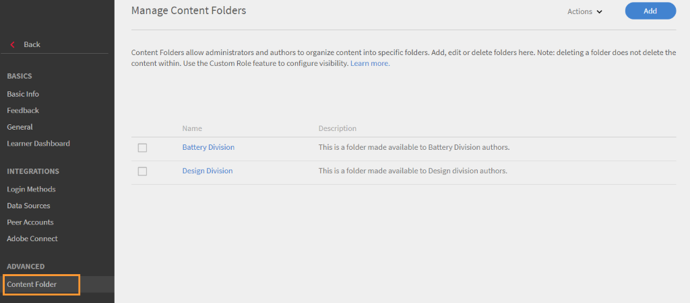

# 설정

책임자가 구성할 수 있는 Learning Manager 계정 설정에 관해 알아봅니다.

책임자 프로필 설정을 변경하고 계정 설정을 업데이트할 수 있습니다. 프로필 정보 보기, 프로필 사진 추가/변경 및 수정 **[!UICONTROL 내 정보]** 콘텐츠. 회사 정보를 업데이트하고 사용자에 대한 로그인 방법을 설정하며 계정 설정을 통해 연결 통합을 설정합니다.

## 계정 설정 {#accountsettings}

조직의 계정 설정을 업데이트하려면 **[!UICONTROL 설정]** 왼쪽 창에.

**기본 정보(회사 정보)**

다음을 수행합니다. **[!UICONTROL 변경]** 페이지에서 국가, 시간대, 지역 및 회계 연도 설정을 편집합니다.

**책임자에게 문의 구성**

조직 지원 관리자 전자 메일 주소를 추가하거나 변경하려면 왼쪽 창에서 **[!UICONTROL &#39;일반&#39;]**&#x200B;을 클릭하여 구성할 수 있습니다. 다음을 수행합니다. **[!UICONTROL 변경]** 에 인접하여 **[!UICONTROL 지원 이메일 ID]** 이메일 id를 추가합니다. 학습자가 을 클릭하면 책임자에게 전자 메일이 전송됩니다 **[!UICONTROL 관리자에게 문의]** 를 클릭합니다.

세미콜론이 있는 전자 메일 ID를 구분 기호로 추가합니다.

**로그인 방법** - 관리자는 내부 또는 외부 사용자의 계정 접속 모드를 선택할 수 있습니다.

* **내부 사용자:** 내부 사용자의 경우 로그인 모드로 Adobe ID 또는 단일 인증을 선택할 수 있습니다.
* **외부 사용자:** 외부 사용자의 로그인 모드로 Adobe ID, 단일 인증, Learning Manager ID를 선택할 수 있습니다.

Learning Manager ID를 선택하면 외부 사용자는 Learning Manager 사용자 이름 및 암호를 만든 후 이 계정에 로그인할 수 있습니다.

>[!NOTE]
>
>외부 프로필이 여러 개 설정되어 있으면 모든 프로필은 하나의 로그인 모드를 가져야 합니다. 예를 들자면, 로그인 모드가 Adobe ID인 경우에는 모든 프로필이 Adobe ID를 사용하여 로그인해야 합니다. 각 프로필은 개별 로그인 모드를 가질 수 없습니다.

Adobe ID 또는 단일 인증을 사용하여 Learning Manager 응용 프로그램에 접속할 수 있습니다. 단일 인증은 사용자가 한 번만 인증하면 여러 응용 프로그램에 다시 접속할 수 있도록 하는 구조입니다. 조직에 이 구성이 꼭 필요하지는 않습니다. 조직에 SAML 2.0 기반 SSO 제공자가 있으면 이를 이용하여 Learning Manager 응용 프로그램을 구성할 수 있습니다. 구성에는 조직 레벨과 Learning Manager 응용 프로그램이 필요합니다. SSO를 사용하도록 선택했다면 Adobe 지원팀에 문의하여 구성 지침을 받으십시오.

**피드백**

강의를 완료한 후에 왼쪽 창에서 **[!UICONTROL &#39;피드백&#39;]**&#x200B;을 클릭하여 학습자에게 피드백을 받을 수 있는 설문지를 설정합니다. 자세한 내용은 [강의 기능 도움말 콘텐츠](courses.md) (L1 및 L3 피드백 생성)

**다중 시도**

선택 **[!UICONTROL 설정]** > **[!UICONTROL 일반]** > **[!UICONTROL 다중 시도]**.

&#39;다중 시도&#39; 확인란을 활성화하면 작성자가 대화형 e러닝 강의 또는 모듈에 대해 &#39;다중 시도&#39;를 설정할 수 있으며, 두 번째 확인란 선택 시 책임자는 새로 생성된 모든 대화형 e러닝 강의에 대해 기본적으로 &#39;무한 시도&#39;를 설정할 수 있습니다.

*다중 시도 확인란을 선택합니다*

**강의 조정**

왼쪽 창에서 **[!UICONTROL &#39;일반&#39;]**&#x200B;을 클릭하고 &#39;강의 조정&#39; 옵션을 선택하면 강의 조정 기능을 사용할 수 있습니다. 이 기능에 대한 더 자세한 내용은 [강의 조정](courses.md#main-pars_header_1879001177)을 참조하십시오.

**토론 게시판**

토론 게시판 확인란을 활성화하면 학습자 앱 강의 페이지에서 토론 탭을 사용하여 학습자와 강사가 강의에 대한 의견을 올릴 수 있습니다. 그러나, 강의 레벨 설정에 이 기능을 선택하지 않았다고 표시될 경우 강의 레벨 설정이 관리자 설정에 우선합니다.

**학습자 대시보드**

왼쪽 창에서 &#39;학습자 대시보드&#39;를 클릭합니다. 이 페이지에서 학습자 페이지에 표시할 위젯을 선택할 수 있습니다. 학습자 페이지에서 활성화할 위젯을 선택합니다. 선택하지 않은 위젯은 학습자 페이지에 표시되지 않습니다.

**Adobe Connect**

왼쪽 창에서 **[!UICONTROL Adobe Connect]**&#x200B;를 클릭하여 가상 강의실 세션을 호스팅하도록 Adobe Connect 계정을 구성합니다. 자세한 내용은 다음을 참조하십시오.  [Adobe Connect](adobeconnect-integration.md) 기능 도움말.

## 일반 설정 {#general}

다음 설정을 활성화 또는 비활성화하십시오.

<table>
 <tbody>
  <tr>
   <th>
    
<b>이름</b>

    </th>
   <th>
    
<b>설명</b>

   </th>
  </tr>
  <tr>
   <td>강의 효과 표시</td>
   <td>활성화되면 학습자는 강의 타일에서 현재 강의 효과를 확인할 수 있습니다. 이 기능은 강의에서만 사용할 수 있습니다. 학습 프로그램이나 인증에서 평가 등급은 지원되지 않습니다. 강의 및 학습 프로그램에는 사용할 수 있지만 인증에는 사용할 수 없습니다.</td>
  </tr>
  <tr>
   <td>강의 조정</td>
   <td>활성화되면 책임자가 강의에 대한 모든 변경 사항을 승인해야 해당 강의가 학습자에게 표시됩니다.</td>
  </tr>
  <tr>
   <td>토론 게시판</td>
   <td>토론 게시판 확인란을 활성화하면 학습자 앱 강의 페이지에서 토론 탭을 사용하여 학습자와 강사가 강의에 대한 의견을 올릴 수 있습니다. 그러나, 강의 레벨 설정에 이 기능을 선택하지 않았다고 표시될 경우 강의 레벨 설정이 책임자 설정에 우선합니다.</td>
  </tr>
  <tr>
   <td>다중 시도</td>
   <td>활성화되면 작성자는 과정 모듈에 대해 '다중 시도'를 구성할 수 있습니다.</td>
  </tr>
  <tr>
   <td>스킬 옵션 탐색</td>
   <td>활성화되면 학습자는 피어 및 리더십 스킬을 탐색하고 선택한 스킬을 구독할 수 있습니다.</td>
  </tr>
  <tr>
   <td>스킬/태그 가시성</td>
   <td>학습자에게 모든 스킬 및 태그가 표시됩니다. 모든 스킬 및 태그, 할당된 스킬 및 태그, 또는 학습자에게 표시되는 카탈로그의 일부만 표시할 수 있습니다.</td>
  </tr>
  <tr>
   <td>고유 학습 개체 ID</td>
   <td>활성화되면 책임자 또는 작성자가 학습 객체별로 고유 ID를 추가할 수 있습니다.</td>
  </tr>
  <tr>
   <td>필터 패널 표시</td>
   <td>
    
사용자가 학습자 애플리케이션에서 검색 결과 개선에 사용할 필터 패널을 제어합니다. 옵션은 다음과 같습니다.

    <ul>
     <li>카탈로그</li>
     <li>유형</li>
     <li>형식</li>
     <li>지속 기간</li>
     <li>스킬</li>
     <li>스킬 레벨</li>
     <li>태그</li>
    </ul>
    
학습자가 학습자 앱을 시작하면 내 학습 및 카탈로그 섹션에서 해당 패널의 필터를 볼 수 있습니다.

    
<b>참고: </b>필터 <b>형식 </b>및 <b>지속 기간</b>은 기본적으로 꺼져 있으며 릴리스 이후 즉시 학습자에게 표시되지 않습니다. 책임자는 이를 활성화해야 합니다.  
</td>
  </tr>
  <tr>
   <td>카탈로그 목록 표시</td>
   <td>활성화되면 학습자는 사용 가능한 모든 카탈로그 목록을 볼 수 있습니다. 학습자는 이를 사용하여 학습 객체가 표시되는 방법을 세밀하게 조정할 수 있습니다.</td>
  </tr>
  <tr>
   <td>제품 용어</td>
   <td>Learning Manager에는 해당 제품에서 사용되는 표준 용어가 포함되어 있습니다. 조직의 필요에 맞게 용어를 수정하십시오.</td>
  </tr>
  <tr>
   <td>모듈 버전 업데이트</td>
   <td>콘텐츠 업데이트 기본 설정을 구성하십시오. 강의 페이지에서 각 콘텐츠에 대한 설정을 수정할 수 있습니다.</td>
  </tr>
  <tr>
   <td>사용자 자동 등록</td>
   <td>활성화되면 새롭게 가져온 사용자가 자동 등록됩니다. 기본적으로 사용자는 수동으로 등록해야 Learning Manager를 사용할 수 있습니다.</td>
  </tr>
  <tr>
   <td>내부 사용자 자동 삭제</td>
   <td>활성화되면 내부 사용자가 지정된 기간 동안 시스템에 액세스하지 않으면 자동으로 삭제됩니다. 이 기능은 <b>학습자</b> 역할만 맡은 사용자에게 적용됩니다. 액세스를 복원하려면 책임자에게 문의해야 합니다. </td>
  </tr>
  <tr>
   <td>카탈로그 레이블 표시</td>
   <td>활성화되면 책임자 및 작성자는 카탈로그 레이블 및 값을 설정하고 이를 학습 객체에 연결할 수 있습니다.</td>
  </tr>
  <tr>
   <td>학습자가 자신의 점수 확인 가능</td>
   <td>활성화되면 학습자는 학습자 성적 증명서에서 자신의 점수를 볼 수 있습니다.</td>
  </tr>
  <tr>
   <td>다이제스트 전자 메일</td>
   <td>
    
책임자는 학습자에게 전자 메일 전송을 활성화 또는 비활성화할 수 있습니다. 책임자는 전송된 전자 메일의 빈도를 제어할 수도 있습니다.

    <ul>
     <li><b>활성 계정</b>의 경우 다이제스트 전자 메일은 기본적으로 비활성화되며 책임자는 수동으로 이를 활성화할 수 있습니다.</li>
     <li><b>평가판 계정</b>의 경우 다이제스트 전자 메일의 옵션은 비활성화된 상태로 유지되며 책임자는 옵션을 활성화할 수 없습니다.</li>
    </ul>
    
기능이 비활성화되면:

    <ul>
     <li><b>다이제스트 전자 메일</b> 옵션은 비활성화됩니다.</li>
     <li>학습자는 다이제스트 전자 메일 구독에 대한 사용자 설정을 볼 수 없습니다.</li>
    </ul>
    
 기능이 활성화되면:

    <ul>
     <li>책임자는 다이제스트 전자 메일 옵션을 활성화하고 수정할 수 있습니다.</li>
     <li>리더 앱의 <b>프로필 설정</b>에서 학습자(DND 목록에서가 아님)는 다이제스트 전자 메일을 구독/구독 취소하도록 선택할 수 있습니다.</li>
    </ul></td>
  </tr>
  <tr>
   <td>교육 카드 아이콘 활성화 </td>
   <td>활성화하면 학습자 앱의 교육 카드에 아이콘이 표시됩니다. </td>
  </tr>
  <tr>
   <td>바닥글 링크</td>
   <td>
    
바닥글로 표시되는 링크 또는 전자 메일 ID를 추가하십시오. 최대 3개의 바닥글 링크를 추가할 수 있습니다.

    
바닥글의 링크를 사용자 정의하려면 다음 단계를 수행하십시오.

    <ol>
     <li><b>더 추가</b>를 클릭하고, 지정된 필드에 이름과 URL 또는 전자 메일 ID를 입력합니다. http:// 또는 https://를 앞에 추가합니다.</li>
     <li>모든 로케일에 변경 사항을 계단식으로 배열하려면 <b>복제</b>를 클릭합니다. 이를 통해 모든 언어에 이름 및 URL을 지정할 수 있습니다.</li>
     <li>변경 사항을 저장하려면 <b>저장</b>을 클릭합니다. 변경 사항을 확인하는 팝업 메시지를 볼 수 있습니다. '확인'을 클릭하면 바닥글이 새롭게 추가된 링크로 채워집니다.</li>
    </ol>
    
또한 다음을 수행할 수 있습니다.

    <ul>
     <li>다음을 클릭합니다. <b>재설정</b> 아이콘을 클릭하여 기본값 재설정 <b>도움말</b> 및 <b>관리자에게 문의</b> 필드.</li>
     <li>모든 언어에 대해 바닥글의 링크를 사용자 정의할 수 있습니다. <b>언어</b> 드롭다운 목록에서 언어를 선택하고 지정된 필드에 <b>이름</b> 및 <b>URL</b>을 추가합니다. 변경 사항을 저장하면 업데이트된 링크가 바닥글에 표시됩니다. </li>
    </ul></td>
  </tr>
  <tr>
   <td>시간대 보고 </td>
   <td>
    
계정 레벨 환경 설정을 설정하여 다음 시간대에서 학습자 성적 증명서를 내보냅니다.

    <ul>
     <li>UTC(기본 동작)</li>
     <li>계정 레벨 시간대 환경 설정</li>
    </ul>
    
작업 API를 사용하여 다운로드한 학습자 성적 증명서는 선택한 시간대의 데이터도 다운로드합니다.

    
<b>참고: </b>릴리스 이후 즉시 기본적으로 학습자 성적 증명서에서 변경은 예상되지 않습니다. 책임자는 책임자 &gt; 설정 &gt; 일반 &gt; 시간대 보고에서 이 설정을 구성할 수 있습니다.
</td>
  </tr>
 </tbody>
</table>

<table border="0" cellpadding="0" cellspacing="0" width="1709">
 <tbody>
  <tr>
   <td height="20" width="147">이름</td>
   <td>설명</td>
  </tr>
  <tr>
   <td height="20">강의 효과 표시</td>
   <td>활성화되면 학습자는 강의 타일에서 현재 강의 효과를 확인할 수 있습니다.</td>
  </tr>
  <tr>
   <td height="20">강의 조정</td>
   <td>활성화되면 책임자가 강의에 대한 모든 변경 사항을 승인해야 해당 강의가 학습자에게 표시됩니다.</td>
  </tr>
  <tr>
   <td height="20">토론 게시판</td>
   <td>토론 게시판 확인란을 활성화하면 학습자 앱 강의 페이지에서 토론 탭을 사용하여 학습자와 강사가 강의에 대한 의견을 올릴 수 있습니다. 그러나, 강의 레벨 설정에 이 기능을 선택하지 않았다고 표시될 경우 강의 레벨 설정이 책임자 설정에 우선합니다.</td>
  </tr>
  <tr>
   <td height="20">다중 시도</td>
   <td>활성화되면 작성자는 과정 모듈에 대해 '다중 시도'를 구성할 수 있습니다.</td>
  </tr>
  <tr>
   <td height="20">스킬 옵션 탐색</td>
   <td>활성화되면 학습자는 피어 및 리더십 스킬을 탐색하고 선택한 스킬을 구독할 수 있습니다.</td>
  </tr>
  <tr>
   <td height="20">스킬/태그 가시성</td>
   <td>학습자에게 모든 스킬 및 태그가 표시됩니다. 모든 스킬 및 태그, 할당된 스킬 및 태그, 또는 학습자에게 표시되는 카탈로그의 일부만 표시할 수 있습니다.</td>
  </tr>
  <tr>
   <td height="20">고유 학습 개체 ID</td>
   <td>활성화되면 책임자 또는 작성자가 학습 객체별로 고유 ID를 추가할 수 있습니다.</td>
  </tr>
  <tr>
   <td rowspan="10" height="191">필터 패널 표시</td>
   <td>사용자가 학습자 애플리케이션에서 검색 결과 개선에 사용할 필터 패널을 제어합니다. 옵션은 다음과 같습니다.</td>
  </tr>
  <tr>
   <td height="19">카탈로그</td>
  </tr>
  <tr>
   <td height="19">유형</td>
  </tr>
  <tr>
   <td height="19">형식</td>
  </tr>
  <tr>
   <td height="19">지속 기간</td>
  </tr>
  <tr>
   <td height="19">스킬</td>
  </tr>
  <tr>
   <td height="19">스킬 레벨</td>
  </tr>
  <tr>
   <td height="19">태그</td>
  </tr>
  <tr>
   <td height="19">학습자가 학습자 앱을 시작하면 내 학습 및 카탈로그 섹션에서 해당 패널의 필터를 볼 수 있습니다.</td>
  </tr>
  <tr>
   <td height="20">참고: 필터 형식 및 지속 기간 은 기본적으로 꺼져 있으며 릴리스 이후 즉시 학습자에게 표시되지 않습니다. 책임자는 이를 활성화해야 합니다. </td>
  </tr>
  <tr>
   <td height="20">카탈로그 목록 표시</td>
   <td>활성화되면 학습자는 사용 가능한 모든 카탈로그 목록을 볼 수 있습니다. 학습자는 이를 사용하여 학습 객체가 표시되는 방법을 세밀하게 조정할 수 있습니다.</td>
  </tr>
  <tr>
   <td height="20">제품 용어</td>
   <td>Learning Manager에는 해당 제품에서 사용되는 표준 용어가 포함되어 있습니다. 조직의 필요에 맞게 용어를 수정하십시오.</td>
  </tr>
  <tr>
   <td height="20">모듈 버전 업데이트</td>
   <td>콘텐츠 업데이트 기본 설정을 구성하십시오. 강의 페이지에서 각 콘텐츠에 대한 설정을 수정할 수 있습니다.</td>
  </tr>
  <tr>
   <td height="20">사용자 자동 등록</td>
   <td>활성화되면 새롭게 가져온 사용자가 자동 등록됩니다. 기본적으로 사용자는 수동으로 등록해야 Learning Manager를 사용할 수 있습니다.</td>
  </tr>
  <tr>
   <td height="20">내부 사용자 자동 삭제</td>
   <td>활성화되면 내부 사용자가 지정된 기간 동안 시스템에 액세스하지 않으면 자동으로 삭제됩니다. 이 기능은 학습자 역할만 맡은 사용자에게 적용됩니다. 액세스를 복원하려면 책임자에게 문의해야 합니다.</td>
  </tr>
  <tr>
   <td height="20">카탈로그 레이블 표시</td>
   <td>활성화되면 책임자 및 작성자는 카탈로그 레이블 및 값을 설정하고 이를 학습 객체에 연결할 수 있습니다.</td>
  </tr>
  <tr>
   <td height="20">학습자가 자신의 점수 확인 가능</td>
   <td>활성화되면 학습자는 학습자 성적 증명서에서 자신의 점수를 볼 수 있습니다.</td>
  </tr>
  <tr>
   <td rowspan="9" height="172">다이제스트 전자 메일</td>
   <td>책임자는 학습자에게 전자 메일 전송을 활성화 또는 비활성화할 수 있습니다. 책임자는 전송된 전자 메일의 빈도를 제어할 수도 있습니다.</td>
  </tr>
  <tr>
   <td height="19">활성 계정의 경우 다이제스트 전자 메일은 기본적으로 비활성화되며 책임자는 수동으로 이를 활성화할 수 있습니다.</td>
  </tr>
  <tr>
   <td height="19">평가판 계정의 경우 다이제스트 전자 메일의 옵션은 비활성화된 상태로 유지되며 책임자는 옵션을 활성화할 수 없습니다.</td>
  </tr>
  <tr>
   <td height="19">기능이 비활성화되면:</td>
  </tr>
  <tr>
   <td height="19">다이제스트 전자 메일 옵션은 비활성화됩니다.</td>
  </tr>
  <tr>
   <td height="19">학습자는 다이제스트 전자 메일 구독에 대한 사용자 설정을 볼 수 없습니다.</td>
  </tr>
  <tr>
   <td height="19"> 기능이 활성화되면:</td>
  </tr>
  <tr>
   <td height="19">책임자는 다이제스트 전자 메일 옵션을 활성화하고 수정할 수 있습니다.</td>
  </tr>
  <tr>
   <td height="20">학습자 앱의 프로필 설정에서 학습자(DND 목록에 없음)는 다이제스트 전자 메일을 구독/구독 취소하도록 선택할 수 있습니다.</td>
  </tr>
  <tr>
   <td height="20">교육 카드 아이콘 활성화</td>
   <td>활성화하면 학습자 앱의 교육 카드에 아이콘이 표시됩니다.</td>
  </tr>
  <tr>
   <td rowspan="8" height="153">바닥글 링크</td>
   <td>바닥글로 표시되는 링크 또는 전자 메일 ID를 추가하십시오. 최대 3개의 바닥글 링크를 추가할 수 있습니다.</td>
  </tr>
  <tr>
   <td height="19">바닥글의 링크를 사용자 정의하려면 다음 단계를 수행하십시오.</td>
  </tr>
  <tr>
   <td height="19">1. 더 추가를 클릭하고 지정된 필드에 이름과 URL 또는 전자 메일 ID를 입력합니다. http:// 또는 https://를 URL 앞에 추가합니다.</td>
  </tr>
  <tr>
   <td height="19">2. 모든 로케일에 변경 사항을 계단식으로 배열하려면 복제를 클릭합니다. 이를 통해 모든 언어에 이름 및 URL을 지정할 수 있습니다.</td>
  </tr>
  <tr>
   <td height="19">3. 변경 사항을 저장하려면 저장을 클릭합니다. 변경 사항을 확인하는 팝업 메시지를 볼 수 있습니다. '확인'을 클릭하면 바닥글이 새롭게 추가된 링크로 채워집니다.</td>
  </tr>
  <tr>
   <td height="19">또한 다음을 수행할 수 있습니다.</td>
  </tr>
  <tr>
   <td height="19">재설정 아이콘을 클릭하여 도움말 및 책임자에게 문의 필드에서 기본값을 재설정합니다.</td>
  </tr>
  <tr>
   <td height="20">모든 언어에 대해 바닥글의 링크를 사용자 정의할 수 있습니다. 언어 드롭다운 목록을 클릭하고 언어를 선택한 다음 지정된 필드에 이름 및 URL을 추가합니다. 변경 사항을 저장하면 업데이트된 링크가 바닥글에 표시됩니다.</td>
  </tr>
  <tr>
   <td rowspan="5" height="96">시간대 보고</td>
   <td> 계정 레벨 환경 설정을 설정하여 다음 시간대에서 학습자 성적 증명서를 내보냅니다.</td>
  </tr>
  <tr>
   <td height="19">UTC(기본 동작)</td>
  </tr>
  <tr>
   <td height="19">계정 레벨 시간대 환경 설정</td>
  </tr>
  <tr>
   <td height="19">작업 API를 사용하여 다운로드한 학습자 성적 증명서는 선택한 시간대의 데이터도 다운로드합니다.</td>
  </tr>
  <tr>
   <td height="20">참고: 릴리스 이후 즉시 기본적으로 학습자 성적 증명서에서 변경은 예상되지 않습니다. 책임자는 책임자 &gt; 설정 &gt; 일반 &gt; 시간대 보고에서 이 설정을 구성할 수 있습니다.</td>
  </tr>
  <tr>
   <td height="19">Badgr 통합</td>
   <td>활성화되면 학습자는 Badgr 웹 사이트에 자신의 배지를 업로드할 수 있습니다. 고객 교육 시나리오에서 조직은 고객을 "인증"하고 소셜 미디어를 통해 해당 자격 증명을 표시할 수 있는 기회를 제공하고자 합니다. 이것은 학습자가 교육을 받고 각자의 성과를 다른 사람들과 공유할 수 있도록 동기를 부여합니다. </td>
  </tr>
  <tr>
   <td height="135">
    
등급 표시
</td>
   <td>
    <ul>
     <li><b>강의 효과</b> 옵션이 활성화된 경우 학습자는 강의 효과 값만 확인할 수 있습니다.</li>
     <li><b>평가 등급</b> 옵션이 활성화된 경우 학습자는 평균 평가 등급과 함께 강의를 평가한 학습자 수만 확인할 수 있습니다. </li>
    </ul>
    
이 기능은 강의에서만 사용할 수 있습니다. 학습 프로그램이나 인증에서 평가 등급은 지원되지 않습니다.  <b>참고: </b>해당 변경은 학습자 앱에만 영향을 줍니다. 

    
다른 모든 앱(책임자, 작성자, 관리자, 사용자 정의 책임자, 사용자 정의 작성자)에서는 설정에서의 변경(평가 등급/강의 효과/등급 표시 비활성화)이 영향을 미치지 않습니다. 

    
새 계정의 경우 <b>등급 표시</b> 섹션에는 다음 옵션이 포함됩니다. <b>별점 매기기</b> 기본적으로 활성화됩니다.

    
기존 계정의 경우 계정에 이전에 옵션이 있었던 경우 <b>강의 효과</b> 활성화한 다음 <b>등급 표시</b> 섹션은 강의 효과 옵션이 선택된 상태로 활성화됩니다. 필요한 경우 <b>강의 효과</b>s가 비활성화되고 <b>등급 표시</b> 섹션도 비활성화됩니다. 다음 경우에 <b>등급 표시</b> 섹션 활성화됨, 옵션 <b>별점 매기기</b> 기본적으로 활성화됩니다.
</td>
  </tr>
 </tbody>
</table>

<table>
 <tbody>
  <tr>
   <td>
    
학습 경로
</td>
   <td>
    
<b>학습 경로의 확장 기능 활성화</b> 옵션을 활성화한 경우 책임자가 학습 경로에 학습 프로그램을 삽입하고 이러한 학습 경로를 강의에 반영할 수 있습니다. 이 옵션은 되돌릴 수 없습니다. 
</td>
  </tr>
  <tr>
   <td>
    
강사 관리 
</td>
   <td>
    
강의실/가상 강의실 세션을 만드는 중 선택할 수 있는 강사 목록을 제한하려면 이 설정을 활성화하십시오. 강사 권한을 가지는 모든 사용자만 세션의 강사로 할당할 수 있습니다. 이 제한은 마이그레이션 워크플로우에는 적용되지 않습니다. 
</td>
  </tr>
 </tbody>
</table>

## AI 기반 추천

Learning Manager에는 학습자의 환경 설정에 따라 개인화된 최신 콘텐츠 기반의 새로운 학습자 홈페이지가 포함되어 있습니다. AI 기반 학습 추천은 학습자의 참여를 향상시키고 학습의 차이를 식별 및 해결하는 데 목표를 둡니다.

추천 알고리즘은 Adobe에서 파트너로부터 소스를 받은 작업 역할, 제목 및 설명에 대한 산업 데이터를 포함하여 여러 입력 소스에 포함되도록 고안되었습니다. 그런 다음 이 데이터는 Learning Manager가 산업 정렬 스킬을 작업 제목 및/또는 직함에 연결하는 지도와 함께 제공될 수 있도록 Adobe의 AI 알고리즘을 교육하는 데 사용됩니다. 이는 추천 알고리즘에 대한 하나의 입력이 됩니다.

Learning Manager는주제 모델링 알고리즘을 사용하여 계정 내 교육 콘텐츠를 분석하고 스킬에 매핑합니다.

Learning Manager는 피어 활동 데이터를 다른 신호로 사용하여 개인화된 방식으로 추천 알고리즘을 추진합니다. 학습자가 제공한 등록, 완료 및 명시적 피드백과 같은 활동이 여기에서 사용됩니다.

또한 Learning Manager는 추가로 추천을 개인화하도록 개별 학습자로부터 수집한 명시적 및 암시적 정보를 사용합니다. 학습자는 등록을 통해 명시적으로 관심 영역을 나타낼 수 있으며 Learning Manager는 학습자가 교육 참여를 종료하는 방식을 기반으로 이 정보를 암시적으로 받게 됩니다.

마지막으로 책임자는 피어 그룹을 정의할 때 Learning Manager가 살펴봐야 하는 학습자 특성을 사용하고 특정 사용자 그룹에 대한 교육을 실제로 강조 표시하여 추천 알고리즘에 영향을 줄 수도 있습니다.

## 학습 객체 이름 변경 {#renaminglearningobjects}

이 기능은 영어로만 사용할 수 있습니다.

이제 책임자는 Learning Manager에서 학습 객체의 이름을 변경할 수 있습니다. 다음은 이름을 변경할 수 있는 용어입니다.

모듈\
강의\
학습 프로그램\
인증\
학습 계획\
작업 지원\
카탈로그\
스킬\
배지\
공지\
내 학습\
순위표\
효율성\
선행 작업\
선행 작업\
핵심 콘텐츠\
테스트\
자습형\
혼합\
강의실\
가상 교실\
활동

용어의 이름을 바꾸려면 다음 단계를 따르십시오.

1. 책임자 권한으로 **[!UICONTROL 설정]** > **[!UICONTROL 일반]** > **[!UICONTROL 제품 용어]**. 제품 용어 옵션이 열립니다.

   

   *제품 용어 이름 바꾸기*

1. 샘플 CSV 파일을 다운로드하여 제품 용어 템플릿을 수정한 다음 업로드하여 변경할 수 있습니다. 샘플 CSV 파일을 다운로드하려면 **[!UICONTROL 여기서 다운로드]** 선택 사항입니다.
1. 다운로드된 CSV 파일에는 A 열에 있는 객체의 이름이 포함됩니다. 열 B에서 해당 개체에 지정할 이름을 선택합니다. (|)로 구분된 이름의 형식은 단수 및 복수로 업데이트해야 합니다.
1. 하나 이상의 행을 수정하도록 선택할 수 있습니다. 업로드하기 전에 수정하지 않은 행을 유지하거나 CSV 파일에서 삭제할 수 있습니다.
1. 수정한 CSV 파일을 업로드하고 **[!UICONTROL 저장]**. 변경 사항을 반영하여 Learning Manager를 새로 고침합니다.
1. 기본 용어로 재설정하려면 **[!UICONTROL 제품 용어 재설정]**.

   

   *제품 용어 재설정*

## 프로필 설정 {#profilesettings}

1. 내 사진/계정 옆에 있는 오른쪽 상단 모서리에서 펼쳐지는 화살표를 클릭하고, **[!UICONTROL 프로필 설정]**.
1. 팝업 대화창의 마우스를 움직이거나 클릭하여 사진을 추가/변경할 수 있습니다. **[!UICONTROL 편집]** 아이콘을 클릭합니다.
1. 추가/수정 **[!UICONTROL 정보]** 내용 클릭 **[!UICONTROL 편집]** 옆에 있습니다.
1. 다음을 수행합니다. **[!UICONTROL 저장].**

## 콘텐츠 폴더 {#content-folder}

Learning Manager는 비공개 콘텐츠 폴더를 지원합니다. 책임자는 비공개 콘텐츠 폴더를 구성하고 사용자 정의 역할을 사용하여 특정 사용자 정의 작성자에게 액세스 권한을 제공할 수 있습니다. 표준 작성자(전체 작성자라고도 함)는 계속해서 계정에 있는 모든 콘텐츠에 액세스할 수 있습니다. 따라서 전체 작성자는 모든 폴더와 모든 콘텐츠에 대한 액세스 권한을 보유합니다.

콘텐츠 폴더는 책임자가 구성할 수 있습니다. 한 번만 구성되는 콘텐츠 폴더는 작성자에게 표시되며 작성자는 하나 또는 여러 폴더에 콘텐츠를 배치할 수 있습니다. 

콘텐츠 폴더를 추가하려면 책임자 앱에서 **[!UICONTROL 설정]** > **[!UICONTROL 콘텐츠 폴더]**.

*콘텐츠 폴더 설정 변경*

### 폴더

폴더는 콘텐츠의 저장소로, 다음 속성을 지닌 계정에서 사용할 수 있는 전체 콘텐츠 라이브러리의 하위 집합입니다.

* 책임자만 폴더를 만들거나 편집하거나 삭제할 수 있습니다.
* 책임자는 사용자 정의 책임자에 대한 역할만 정의하는 일환으로 폴더에 대한 액세스 권한을 제어할 수 있습니다.
* 콘텐츠는 **항상 최소 하나의 폴더와 연결되어야 합니다**. 시작하려면 모든 콘텐츠는 공개 폴더와 연결되며 이는 나중에 변경할 수 있습니다.
* 콘텐츠는 생성 시 여러 폴더와 연결될 수 있고, 복사 작업으로 이렇게 할 수도 있습니다.
* 모든 폴더 이름은 계정 내에서 고유해야 하며 그렇지 않은 경우 폴더 이름 지정에 오류가 발생합니다.

폴더는 콘텐츠의 가시성만 제어하며 콘텐츠의 복사본은 생성하지 않습니다. 따라서 콘텐츠를 편집하면 연결된 모든 폴더에서 반영됩니다.

### 공개 폴더

공개 폴더는 계정에 항상 있으며 초기에 모든 콘텐츠는 이 폴더의 일부입니다. 나중에 작성자는 이 폴더에서 콘텐츠를 다른 폴더로 이동할 수 있습니다. 공개 폴더에는 다음 속성이 있습니다.

* 이 폴더과 연결된 모든 콘텐츠는 기본적으로 모든 유형의 작성자가 액세스할 수 있습니다.
* 공개 폴더의 일부인 모든 콘텐츠는 다른 폴더의 일부가 될 수 없습니다. 반대로도 적용됩니다.

이 폴더는 구성 가능한 역할 정의의 일부가 될 수 없습니다. 결과적으로 구성 가능한 역할 정의에 공개 폴더가 없으면 공개 폴더에 대한 액세스 권한이 제한되지 않습니다.

### 비공개 폴더

* 책임자가 생성한 모든 폴더는 비공개 폴더입니다.

### 폴더 작업

**폴더 추가**

폴더를 추가하려면 **[!UICONTROL 추가]** 창문의 오른쪽 상단 모서리입니다.

**폴더 삭제**

폴더를 삭제할 수도 있습니다. 삭제할 폴더를 선택하고, [작업] 메뉴를 클릭하고, **[!UICONTROL 폴더 삭제]**.

>[!NOTE]
>
>해당 폴더에 연결된 모든 콘텐츠가 다른 폴더에도 연결되어 있을 때 폴더를 삭제할 수 있습니다. 삭제 중인 폴더에만 연결된 콘텐츠가 있는 경우 먼저 콘텐츠를 다른 폴더로 이동한 다음 폴더를 삭제합니다.

## 강의실 위치

책임자는 본 설정을 사용하여 강의실 위치 라이브러리를 생성하고 구성할 수 있습니다. 작성자는 사전 구성된 위치를 선택하여 강의실 이벤트를 설정할 수 있습니다. 라이브러리에서 위치를 선택하여 위치 정보, URL 및 인원 제한을 자동으로 채웁니다.

책임자는 다음 작업을 수행할 수 있습니다.

### 위치 CSV 가져오기

위치 CSV 파일을 가져와 계정에 위치를 추가하기 CSV 파일에는 반드시 도시 열이 포함되어야 합니다.

### 위치 추가하기

다음을 추가하십시오.

1. 위치 이름: 강의실의 이름을 입력합니다.
2. 위치 정보: 위치 정보를 입력합니다.
3. 위치 영역: 입력한 값은 학습자용 교육 위치 필터로 나타납니다.
4. 위치 URL: 위치의 URL을 입력합니다.
5. 인원 제한: 강의실의 제한 인원을 입력합니다.

*강의실 위치 추가*

CSV의 도움말을 사용하여 위치를 추가할 수도 있습니다. CSV에는 다음 필드가 포함되어야 합니다.

* 이름
* info
* url
* seatlimit
* 지역

<!---->

## 자주 묻는 질문 {#frequentlyaskedquestions}

+++콘텐츠 라이브러리의 다른 폴더를 생성하는 방법

다음을 수행합니다. **[!UICONTROL 설정]** > **[!UICONTROL 콘텐츠 폴더]**. 폴더를 추가하려면 **[!UICONTROL 추가]** 오른쪽 상단의 을 클릭하여 대화 상자에 폴더의 이름 및 설명을 입력합니다.

콘텐츠 폴더는 책임자가 구성할 수 있습니다. 한 번만 구성되는 콘텐츠 폴더는 작성자에게 표시되며 작성자는 하나 또는 여러 폴더에 콘텐츠를 배치할 수 있습니다. 

자세한 내용은 [콘텐츠 폴더](settings.md#content-folder)의 섹션을 참조하십시오.
+++

+++계정의 회계 연도를 추가하는 방법

위치 **[!UICONTROL 설정]** > **[!UICONTROL 기본 정보]**, 클릭 **[!UICONTROL 변경]**. (으)로부터 **[!UICONTROL 회계 연도부터]** 드롭다운 목록에서 해당 월을 선택합니다.
+++
